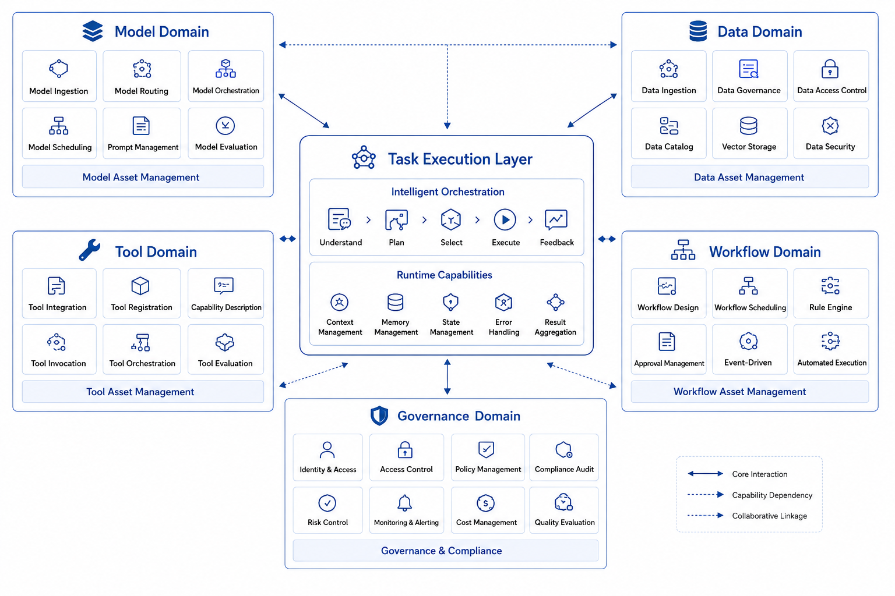
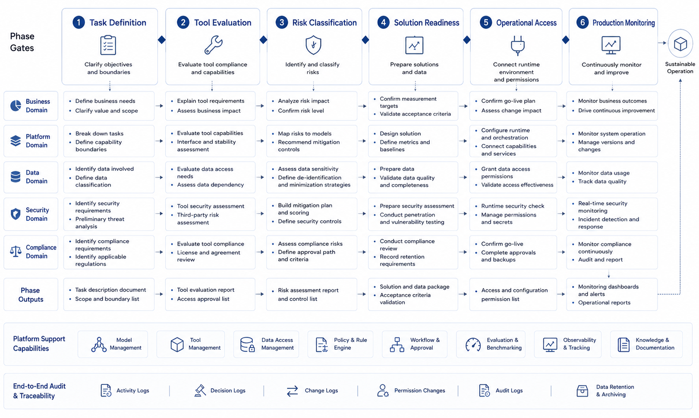

# Chapter 2 Boundaries of Enterprise-grade Agent Platforms

---
## Chapter Summary

When an enterprise develops a second or third Agent, the real challenges begin: pricing, business analysis, work orders, and tickets may each function independently, but no one can clearly answer questions like “Which Agents are allowed to access customer data? Which models are the most expensive and error-prone? If errors occur, can they be fully replayed?” This chapter distinguishes the three-layer boundaries of Agent applications, Agent frameworks, and Agent platforms, explaining why the five common concerns of models, data, tools, processes, and governance must be consolidated at the platform level. It provides a method to decide “which capabilities should be unified and which should remain under business control.” A platform is not just a bigger application or a fancy dashboard; it is a foundational infrastructure and organizational mechanism that enables multiple Agents to operate long-term under the same rules.
## Key Terms

Platform boundary, application and framework, common capability accumulation, unified governance, platform access, reverse boundary
## Learning Objectives

- Distinguish the problems addressed by Agent applications, Agent frameworks, and Agent platforms respectively.
- Identify the five common types of issues—models, data, tools, workflows, and governance—that should be consolidated at the platform level.
- Determine whether a capability should be centralized within the platform or left for individual business applications to decide.
- Explain the platform’s reverse boundaries to prevent it from becoming a new business bottleneck.

---
## Opening Scenario

*Figure 2-1: Boundaries of a multi-agent shared platform. Source: drawn by the author. Alt text: The upper layer consists of business agents for different tasks such as quotation, business analysis, work orders, and tickets. The lower layer contains five shared capabilities: models, data, tools, processes, and governance. Arrows indicate that all business agents access these capabilities through the unified platform layer.*

Business agents can each focus on different tasks, but model, data, tool, process, and governance capabilities must be consolidated into a unified platform layer.

---
## 2.1 Why Enterprises Need a Platform Instead of Isolated Agents

Chapter 1 discussed the challenges faced when a single Agent evolves from merely “answering” to actually “executing.” Chapter 2 raises the perspective one level higher: what happens if a multi-business enterprise does not just build one quoting assistant, but successively develops a quoting Agent, a business analysis Agent, a ticketing Agent, and an invoice Agent?

Intuitively, this should be a good thing. It indicates the enterprise has found multiple AI implementation entry points, with each team producing its own results. The reality, however, is often the opposite.

In the first year, a multi-business enterprise ran four pilot projects:

- Quoting Agent for the manufacturing division, responsible for reading contracts, checking inventory, and generating draft quotes.
- Business analysis Agent for the retail division, responsible for querying data, detecting anomalies, and writing review reports.
- Ticketing Agent for the customer service center, responsible for summarizing complaints and recommending handling actions.
- Invoice Agent for the finance shared services center, responsible for identifying invoices, matching orders, and generating draft vouchers.

All four pilots proved “feasible in isolation.” The real difficulty surfaced when the group wanted to govern these capabilities under a unified framework.

Platform managers quickly faced a string of questions: Which Agents can access customer identity information? Which tools generate real business side effects? Which models are used most, cost the most, or are most error-prone? Which Agents require approval and which can execute automatically? If a task fails, is it possible to fully replay its decision process?

Without uniform answers to these questions, the enterprise is not truly at the platform stage—but merely holding a set of disconnected intelligent projects.

This is the core position of this chapter: **The true challenge for enterprises is never just “can we build an Agent,” but rather “can we make a group of Agents run long-term under the same set of rules.”**
## 2.2 Applications, Frameworks, Platforms: Three Layers of Boundaries and Platformization Risks

A frequent conceptual mistake in the agent field is to mix up applications, frameworks, and platforms. While related, they do not operate on the same level.

*Table 2-1: Problems addressed by the three layers of Agent applications, frameworks, and platforms. Source: Compiled by this book.*

| Level | What problem it solves | Typical examples |
|---|---|---|
| **Agent Application** | How to accomplish a specific business task | Quotation Agent, DataAgent, Ticketing Agent |
| **Agent Framework** | How a single Agent orchestrates state, calls tools, organizes memory | LangGraph, AutoGen, CrewAI, proprietary orchestration frameworks |
| **Agent Platform** | How multiple Agents share capabilities and are governed in a unified way | Model gateway, tool registry, runtime, trace, evaluation, policies |

Frameworks focus on **“how to write a single Agent”**; platforms focus on **“how to enable many Agents to exist long-term in an enterprise without conflicts, repeated reinvention, or losing governance.”**

It is entirely possible for a company to hold the two statements simultaneously:

1. “Our application teams are free to choose the framework that fits best.”
2. “All Agents must follow a unified platform contract.”

There is no contradiction here. A platform does not replace a framework; it addresses the complexity above frameworks within the enterprise.

Low-code tools, Agent Studios, and visual workflow editors should also be viewed within this three-layer structure. They may solve the problem of “building an Agent application quickly” well, but that does not automatically mean they solve the platform-level issues.

Therefore, to judge whether something is truly a platform, do not judge based on whether it has a console or drag-and-drop capabilities. Instead, ask whether it answers questions like:

- How is model invocation of multiple Agents managed uniformly?
- How are tool capabilities of multiple Agents defined, tiered, and versioned uniformly?
- How are the permissions, approvals, tracing, and evaluation of multiple Agents uniformly integrated?

If these remain **“handled independently by each project,”** it cannot yet be considered a platform.
## 2.3 Five Common Problem Categories in Platform Management: Models, Data, Tools, Processes, Governance

An enterprise-grade Agent platform may appear as a collection of components, but in reality, it manages five common categories of problems.

*Table 2-2: The five common problem categories—Models, Data, Tools, Processes, Governance—and the questions the platform must answer. Source: compiled by this book.*

| Common Problem Category | Questions the Platform Must Answer |
|---|---|
| **Model Issues** | Which model to invoke, how to route, how to throttle, how to aggregate costs |
| **Data Issues** | Which data to access, according to which standards, under what identity, how to desensitize |
| **Tool Issues** | What capabilities exist, who can invoke them, are parameters valid, will they cause side effects |
| **Process Issues** | What can be automated, what requires human intervention, how to resume long-running tasks |
| **Governance Issues** | How to evaluate, record, replay, audit, and continuously improve |

Understanding the platform as a “unified solution to five common problem categories” is closer to enterprise reality than viewing it as “a collection of eight modules.” This is because enterprises do not develop from architecture diagrams first, but from problems first.

Why did the first four pilots in a multi-line enterprise quickly encounter platform issues? Because although their business domains differed, these five categories of problems were almost identical: all had to invoke models, all had to read data or documents, all had to call tools, all had to assess risks, and all needed explanations and postmortems after failures.

Many enterprises might link this to past experiences with data platforms, technology platforms, or capability platforms. This association is understandable but requires caution. Data platforms focus on the aggregation, governance, and usage of data assets; application platforms focus on development efficiency and service reuse; whereas Agent platforms focus on model-centric task execution chains. Agent platforms borrow assets from data and application platforms but themselves tackle a distinct set of issues: model decision-making, tool side effects, human approval, task replay, and version evaluation.

*Figure 2-2: The five common problem categories in platform management. Source: drawn by the author. Alt text: Five parallel blocks labeled Models, Data, Tools, Processes, Governance, each listing corresponding common issues (e.g., model routing and cost, tool permissions and side effects, governance approvals and replay), illustrating how these issues repeatedly appear across multiple business agents and should be uniformly handled by the platform.*

Models, data, tools, processes, and governance collectively determine whether an enterprise-level Agent can progress from isolated pilots to sustained operation.
## 2.4 How to Define Platform Boundaries: What to Standardize and What to Leave to the Business Layer

Once you accept the idea that a platform exists to unify the solution of common problems, the next practical question arises: Which capabilities should the platform handle, and which should remain at the application level?

There is no one-size-fits-all rule for this, but there is a practical sequence of judgments. Start by asking four questions:

1. Will this capability be used repeatedly across multiple Agents?
2. Will it affect permissions, costs, auditing, or evaluation?
3. Does it depend on specific rules of a particular business domain?
4. Does platformizing it significantly reduce the cost of subsequent integration?

Based on these four questions, many boundaries become clear.

*Table 2-3: Common capabilities better suited for the platform or the business layer, and reasons. Source: Compiled by this book.*

| Capability | Preferably Platform-Owned | Reason |
|---|---|---|
| Model invocation entry point | Platform | Used repeatedly by all Agents; involves cost and rate limiting |
| Tool registration and risk classification | Platform | Directly impacts side-effect control and auditing |
| Unified approval channel | Platform | High-risk actions should not have separate implementations per application |
| Quotation and discount rules for manufacturing | Application | Strongly tied to specific business domain logic |
| Customer service ticket prioritization strategy | Application | Highly dependent on specific departmental business |
| Unified trace fields and run_id conventions | Platform | Without this, cross-Agent replay is impossible |
| Semantic layer foundation | Mainly Platform | Metrics and definitions need unity |
| Business interpretation details within semantic layer | Shared by Platform and Application | Platform defines the framework; applications provide domain-specific knowledge |

Platform boundaries are not about "the bigger the platform, the better" nor "the thinner the platform, the more modern." If the platform is too thin, it degenerates into just a model gateway; if too thick, it swallows business logic. Mature platforms typically impose strong constraints only where unification is essential, and provide extension points where differences should be allowed.

There is one often underestimated dimension in this judgment: the rate of change. If a capability changes rapidly, involves frequent trial and error, and depends heavily on specific business feedback, premature platformization can slow down business innovation. Conversely, if a capability evolves slowly but needs stable and consistent reuse, the earlier it is platformized, the better.

### 2.4.1 When Is Platformization Truly Needed?

Not every company must form a platform team just because it builds two Agents. A more pragmatic approach is to look for the presence of the following three signals in the organization.

*Table 2-4: Signals indicating that capabilities should be absorbed by the platform, and their meanings. Source: Compiled by this book.*

| Signal | What It Indicates |
|---|---|
| **Duplicate Development** | Different teams repeatedly wrap models, tools, RAG, approvals, logs |
| **Governance Breakdowns** | The enterprise cannot uniformly address issues of permissions, costs, tracing, and evaluation |
| **Integration Friction** | Each new Agent requires rebuilding foundational infrastructure from scratch |

Once all three signals appear simultaneously, platformization is no longer a luxury but a necessity—delaying it will drag down the efficiency of subsequent deployments.

Many organizations have an illusion: the first two pilots proceed smoothly, but starting with the third, progress abruptly slows. The reason is straightforward: the first two projects can move forward by "each doing their own thing," but from the third onward, infrastructure and governance costs concentrate and explode. Budget approvals start asking who is responsible for model bills, security teams query who can access what data, and business teams question why different Agents give different answers to the same question. The platform is born out of this mounting pressure.
## 2.5 How Platforms Are Adopted by Organizations: Collaboration Mechanisms, Admission Processes, and Governance Committees

When discussing platforms within enterprises, the conversation cannot be limited to technical boundaries alone; responsibility boundaries must also be addressed. Once a platform exists, many decision-making powers originally scattered across individual teams will be redistributed.

*Table 2-5: Typical changes in decision makers from pilot phase to platform phase. Source: Compiled by this book.*

| Decision Issue          | Typically Decided by in Pilot Phase | More Suitable Decider in Platform Phase        |
|------------------------|------------------------------------|-----------------------------------------------|
| Which model to use      | Project team decides itself         | Platform sets unified strategy; applications propose requirements |
| Which tools to invoke   | Project team wraps by themselves    | Platform defines contracts; business teams supplement details      |
| Which actions require approval | Business team agrees verbally   | Platform and security jointly define rules                      |
| How to record trace    | Each project writes its own logs    | Platform standardizes fields and run semantics                    |
| How to judge version quality | Subjective demos                 | Platform and business jointly maintain evaluation criteria        |

This table illustrates a practical reality: a platform is not a “public service center that everyone likes.” It reallocates the rights to set standards, control admission, and partly manage releases. Therefore, platform building is often both a technical engineering and an organizational negotiation process.

The platform team most often encounters not just technical resistance but two types of organizational resistance. Business teams worry that the platform slows down onboarding, limits agility, and drags rapid experimentation into a unified process; security and governance teams worry that the platform concentrates and amplifies risks, grants excessive decision power to the system, and creates new audit black boxes. A mature platform team must answer both sides: prove “I won’t slow you down,” and prove “I can control the boundary.”

### 2.5.1 Minimal Admission Process for New Agents Joining the Platform

Once a platform is established, it must not only provide reuse for existing projects but also face a practical question: how do new business teams join?

A truly executable minimal admission process includes at least five steps.

*Table 2-6: Questions to answer at each step of the Agent admission review. Source: Compiled by this book.*

| Step           | Questions to Answer                                  |
|----------------|-----------------------------------------------------|
| **Task Definition** | What exactly is this Agent responsible for, and what is it not responsible for? |
| **Tool Review**     | Which tools will it call, which are read-only, and which have side effects? |
| **Risk Classification** | Which actions can be executed automatically, and which require confirmation or approval? |
| **Evaluation Preparation** | How to determine that when deployed, it is better than or at least not worse than the old method? |
| **Platform Admission**   | Should it be incorporated into unified Runtime, Gateway, Trace, Policy? |

These five steps may seem like raising barriers but in fact reduce downstream costs. The reason for the admission process is not to make business teams queue, but to prevent each new Agent from creating a new set of technical debt.

From an enterprise communication perspective, these five steps also serve as a translation layer. They translate the business side’s “I want to build an intelligent assistant” into questions the platform team can handle: what are the task boundaries, what is the tool list, what is the risk level, how to verify acceptance, and whether it uses the unified execution chain.

*Figure 2-3: Platform admission and governance mechanism. Source: Illustration by this book. Alt text: A left-to-right admission flow, where business Agents follow different paths based on risk classification — low risk goes through standard admission, medium risk jointly reviewed by platform and security, high risk enters governance committee. On the right, these paths feed into unified deployment and ongoing governance.*

From task definition through production monitoring, new Agents must clear shared gates including tool review, risk classification, evaluation preparation, and operational integration.

### 2.5.2 Boundaries of the Platform Governance Committee

When an enterprise has only one or two Agent pilots, many decisions can be made by temporary coordination within project teams. But when a multi-line enterprise simultaneously pushes multiple scenarios—business analysis, quoting, customer service quality inspection, financial invoices, knowledge assistants, etc.—temporary coordination soon breaks down.

At this stage, a lightweight but formal governance mechanism is needed. It may be called the platform governance committee or AI platform review board; the name is less important than the fact it must answer three categories of questions.

*Table 2-7: Typical questions and participants for admission, risk, and roadmap governance decisions. Source: Compiled by this book.*

| Decision Type | Typical Questions                                         | Participants                     |
|---------------|----------------------------------------------------------|---------------------------------|
| Admission Decisions | Which Agents can enter production, which remain pilots? | Platform, Business, Product, Security |
| Risk Decisions      | Which actions require approval, which are prohibited from auto-execution? | Platform, Security, Legal, Internal Control |
| Roadmap Decisions   | Which capabilities are built into the platform, which remain in applications? | Platform, Architecture, Data, Business |

The primary value of the governance committee is to stabilize decision consistency. Otherwise, one department’s Agent may be allowed to send customer emails automatically while another department’s can’t even send internal notifications; one scenario’s trace requirements are stringent while another tracks nothing at all; one team can onboard high-risk tools while another must redo reviews. Such inconsistencies rapidly erode platform trust.

Governance must not become a heavy approval bottleneck. It should focus on issues crossing scenarios, departments, and responsibility boundaries—not intervene in each prompt, page, or business copy. The governance committee is not a product review board or code review board but a boundary review board for enterprise Agents.
## 2.6 How to Sustain Platform Operation Long-Term: Reverse Boundaries, Costs, Catalogs, and Maturity

When defining platform boundaries, many teams only write about what the platform *should* provide. That is not enough. A mature platform must also clearly state what it *should not* do. Otherwise, the platform keeps expanding unchecked, eventually slowing down the business and taking on responsibilities it should not bear.

First, the platform should not define business goals for the business teams. Whether the operational analytics Agent serves weekly meetings, monthly reviews, or special retrospectives, or whether the quoting Agent serves key account sales or channel sales—these goals must be determined by the business and product teams. The platform can provide task templates and assessment methods but cannot decide what matters most for the business.

Second, the platform should not absorb all business rules. Discount strategies, customer service quality inspection details, financial reimbursement policies, and legal clause preferences all have strong business domain attributes. The platform can require these rules to be integrated in a governable manner but should not bake all of them into the platform core.

Third, the platform should not force all scenarios into a single unified rhythm. Low-risk exploratory scenarios require speed; high-risk production scenarios require stability. The platform should provide tiered pathways rather than managing every project with the same process.

Fourth, the platform should not replace existing enterprise platforms. Data platforms, identity platforms, approval platforms, and service governance platforms still have their own responsibilities. The Agent platform should connect to and augment them, not build an entirely parallel system.

Fifth, the platform should not stifle innovation under the guise of governance. Early Agent scenarios will inevitably involve trial and error. The platform must enforce production boundaries but should leave space for sandboxes, pilots, and low-risk exploration.

*Table 2-8: What the platform should not do, consequences of crossing boundaries, and more reasonable boundaries. Source: compiled for this book.*

| What the Platform Should Not Do | What Happens If It Does | More Reasonable Boundary |
|---|---|---|
| Define business goals on behalf of the business | Platform turns into a business product team, role confusion | Platform provides methods; business defines goals |
| Absorb all rules | Platform releases get dragged down by business changes | Platform governs contracts; applications govern domain rules |
| Use same process for all scenarios | Low-risk projects get slowed; high-risk projects go unmanaged | Manage by risk tier |
| Replace existing platforms | Duplicated architecture, fragmented governance | Consume capabilities of existing platforms |
| Eliminate space for trial and error | Business bypasses platform | Establish sandbox and access layers |

A platform does not mature by taking on more responsibility, but by clearly knowing what it *should* and *should not* be responsible for.

### 2.6.1 Platform Operation: The Real Beginning Starts After Launch

Many enterprises view platform construction as "delivering a set of capabilities." But the Agent platform is not a one-time deliverable; it is a long-term operational system.

The reason is simple: the Agent’s operating environment is constantly changing. Model versions change, business rules change, tool interfaces change, data definitions change, and user behaviors change. An Agent that performs steadily today may degrade three months later due to promotion rule updates, metric definition changes, or model upgrades. Without platform operation, the system slowly becomes unreliable.

Platform operation includes at least five types of work. Scenario operation continuously tracks which Agents are used, which requirements should be merged or retired; quality operation updates evaluation samples, records failure cases, and categorizes user feedback; cost operation monitors model calls, task costs, department budgets, and benefit relationships; risk operation reviews high-risk tools, approval policies, and sensitive data access regularly; ecosystem operation maintains documentation, templates, training materials, samples, and support mechanisms.

For a multi-business-line company that delivered four Agents in the first year and twenty in the second, platform operation becomes even more important than platform construction. From that stage onward, the company faces not "whether we have the capability" but "whether so many capabilities remain trustworthy, controllable, and worth retaining."

### 2.6.2 How Vendors and External Products Integrate with the Platform

Most enterprises will not develop all Agent capabilities entirely in-house. A multi-business-line company may purchase knowledge base products, customer service quality inspection products, model gateway products, or industry solutions. The question is not whether they can purchase but whether purchased products can be incorporated into a unified platform boundary.

When integrating external products into the Agent platform, at least six aspects must be considered: whether unified identity and access control are supported; whether tool and data access boundaries are respected; whether key operational records can be traced or exported; whether evaluation mechanisms can incorporate them; whether they can be included in cost views; and whether the enterprise can control key configurations and governance policies.

This is the true meaning of a "hybrid approach." It’s not simply buying some parts and building some parts, but ensuring all—bought or built—adhere to the same platform contracts. Vendor products can become part of the platform ecosystem but must not become governance islands.
## 2.7 Chapter Closure: The Platform Ultimately Serves AI-Native Business Systems

What this chapter truly aims to deliver is a framework for platform judgment.

First, the real challenge for enterprises is not "building a single Agent," but "managing a group of Agents."

Second, applications, frameworks, and platforms are three fundamentally different issues; mixing them together in discussion will distort subsequent construction goals.

Third, the platform manages five common categories of issues: models, data, tools, processes, and governance. The platform boundary is defined by the boundary where these common issues accumulate.

Fourth, the platform should be neither so thin that it is only a model gateway, nor so thick that it swallows business logic. A truly mature platform enforces strong constraints where unification is needed and leaves room for variation where differences are allowed.

Fifth, platformization is not a technical obsession but an inevitable organizational challenge enterprises must face in the multi-Agent stage.

The next chapter will elevate the perspective further: Since the platform ultimately serves a new category of business system, what is the fundamental difference between an "AI-native business system" and "adding AI features within legacy systems"?
## References

NIST. (2023). [*Artificial Intelligence Risk Management Framework (AI RMF 1.0)*](https://www.nist.gov/itl/ai-risk-management-framework).

OWASP. (n.d.). [*Top 10 for Large Language Model Applications*](https://owasp.org/www-project-top-10-for-large-language-model-applications/).

Model Context Protocol. (n.d.). [Specification and documentation](https://modelcontextprotocol.io/).

Kubernetes. (n.d.). [Documentation](https://kubernetes.io/docs/).
