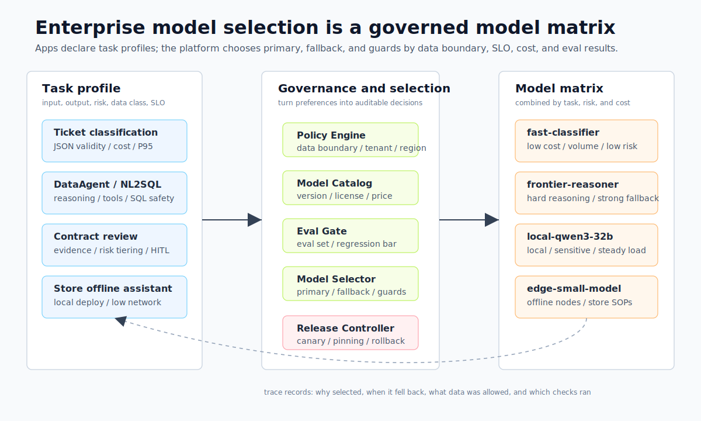
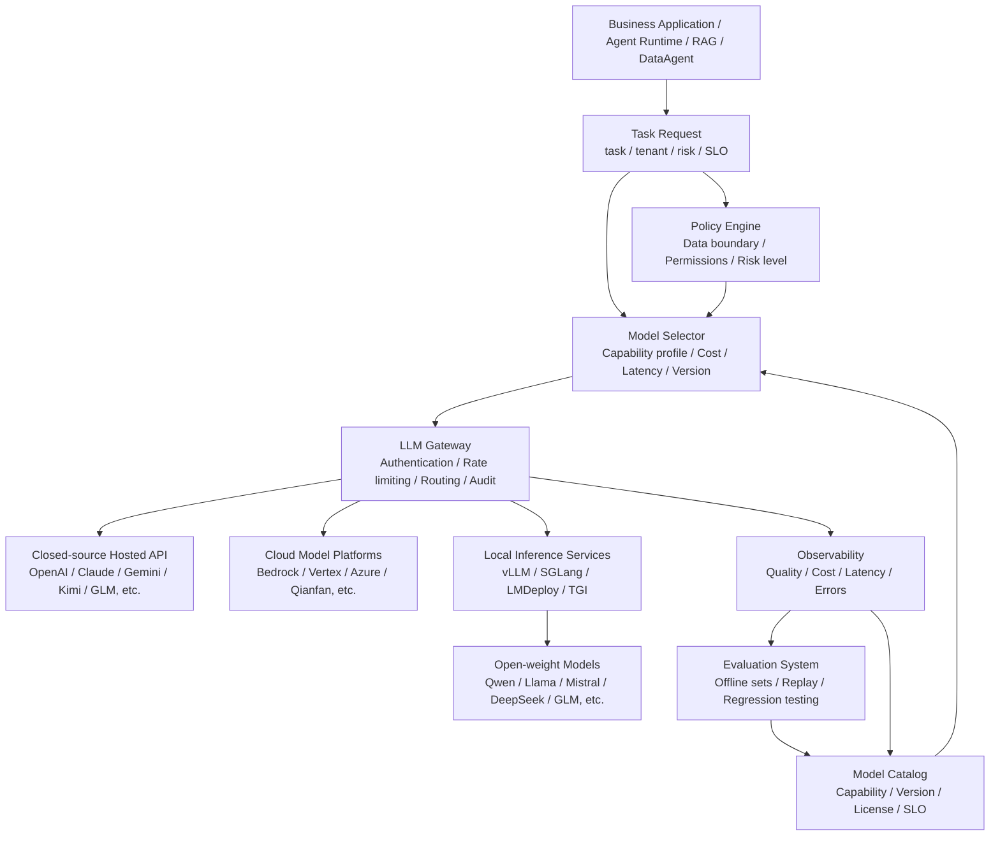
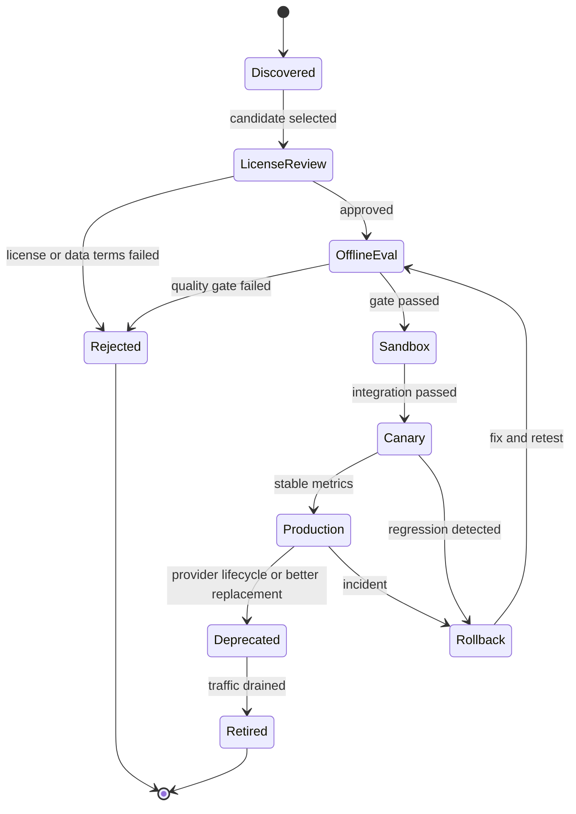
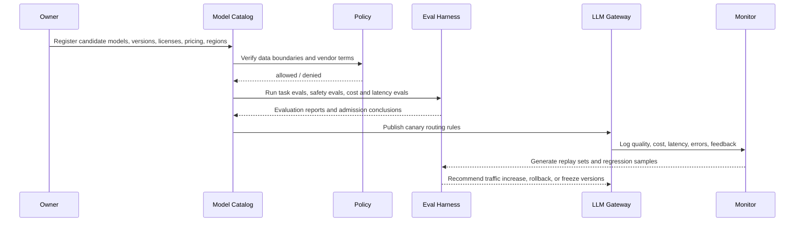

# Chapter 5 Model Selection for Large Language Models

---

## Chapter Summary

This chapter discusses how model selection for large language models (LLMs) evolves from a one-time product comparison into a runtime decision constrained by task profiles, data boundaries, SLOs, cost, and lifecycle management. The goal of selection is not to pick the “strongest model,” but to match the right models to different tasks and allow this matching to adapt as business needs and model versions iterate. This chapter provides model selection criteria grounded in business tasks, a model matrix for routing multiple models by task, and key tradeoffs between closed-source and open-source, large models and small models.

## Key Terms

Model selection, task profiling, model routing, model matrix, SLO, cost governance, open source vs. closed source

## Learning Objectives

- Be able to define selection constraints for a specific task along four dimensions: task profile, data boundary, SLO, and cost.
- Design a model matrix enabling multiple models to be routed by task instead of betting on a single global model.
- Balance the tradeoffs between closed-source API models and open-source self-hosted models, as well as between large and small models in terms of quality, cost, and compliance.
- Explain why model selection is a runtime decision adjustable through iteration, rather than a one-time procurement.

---

## Opening Scenario

In enterprises, selecting an LLM rarely happens as an isolated decision by the model team. Business units focus on result quality, platform teams on routing and rollback, security teams on data boundaries, and finance teams on cost. To coordinate these constraints, selection must start from business tasks and unify evaluation criteria across runtime governance of a model matrix and key tradeoffs.

---

## 5.1 Model Selection Begins with Business Tasks

### 5.1.1 Why a Multi-Line Enterprise Can’t Just Pick the “Strongest Model”

When a multi-business-line enterprise launches an agent platform, the first question isn’t “how to write the agent loop,” but “which model to use.” The customer support team wants low-cost processing of tens of thousands of tickets daily; finance wants DataAgent to generate executable, auditable SQL; legal wants contract assistants not to hallucinate clauses; R&D wants code assistants that understand internal repos; store operations want offline assistants that work despite unstable networks. Although all require “large model capabilities,” their specific model needs differ vastly.

Choosing a model solely by public rankings will quickly hit real constraints:

- Customer support classification doesn’t need the costliest inference model but requires stable JSON output, low latency, and minimal per-query cost.
- DataAgent needs strong reasoning, structured output, tool invocation, and SQL safety checks—dialogue experience alone isn’t enough.
- Contract review requires evidence citation, refusal boundaries, and human-in-the-loop checks—fluent responses are not reliable conclusions.
- Internal code assistants need long context windows, repo retrieval, patch generation, and sandboxed execution; ordinary chat models may not suffice.
- Store offline assistants prioritize local deployment, lightweight models, Chinese language support, and data residency.

Thus, enterprise model selection is not a one-off procurement or a decree of “we unify on a specific model.” It is a continuous engineering practice: define task profiles, select candidate models, validate on enterprise benchmarks, route requests through an LLM Gateway to appropriate models, and monitor quality, cost, latency, and version lifecycle.

A multi-business enterprise ultimately needs a *model matrix*, not a “single best model.”

*Table 5-1: Primary Metrics, Model Preferences, and Fallback Strategies by Business Scenario. Source: Compiled by the author.*

| Business Scenario             | Primary Metrics                     | Model Preferences                      | Fallback Strategy                             |
|------------------------------|-----------------------------------|--------------------------------------|-----------------------------------------------|
| Customer Support Ticket Classification | JSON validity, cost, P95 latency      | Low-cost general or lightweight local model | Escalate low confidence cases to human or strong model recheck |
| DataAgent / NL2SQL            | SQL correctness, tool reliability, permission security | Reasoning model + strong structured output | Pre-execution validation, fallback to strong model repair or manual review |
| Contract Review               | Evidence citation, risk grading, refusal boundary | High-capability closed-source or private deployment strong model | Enforce citation, key conclusions go to human-in-the-loop (HITL) |
| Internal Knowledge Q&A        | RAG factual consistency, long context, citation | General model + RAG, or long-context model as needed | No answer without evidence, favor retrieval-augmented generation (RAG) |
| Code Assistant               | Code understanding, patch quality, tool invocation | Code-specialized or strong reasoning model | Sandbox testing, review gate, rollback capability |
| Store Offline Assistant      | Data locality, deployment cost, response speed | Small open-weight model, local inference | Sync logs and knowledge repository after network recovery |



*Figure 5-1: Enterprise model matrix and runtime routing. Source: Author’s illustration. Alt text: On the left is a model pool arranged by cost and capability (lightweight local, domestic hosted, global strong, etc.), the middle is a model gateway receiving task profiles and governance policies, and the right side shows different business tasks. Arrows indicate routing by task to suitable models with fallback reserved.*

Figure 5-1 illustrates a three-layer relationship: left is business task profiles, center is governance and selection layer, and right is the routable model pool. This table and figure together expose a core fact: model selection must start from business tasks, not from model brands. Different vendors, deployment forms, versions, and inference parameters should all be abstracted by platforms into governable “model capability resources.”

### 5.1.2 Candidate Model Classification Axes and Capability Dimensions

In enterprise model discussions, it's easy to confuse dimensions like closed-source, open source, domestic, self-hosted, cloud service, inference model, and long-context model. They are distinct classification axes.

*Table 5-2: Definitions and Key Selection Questions for Closed-Source Hosted, Open-Weight, and Other Model Types. Source: Compiled by the author.*

| Concept              | Definition                                   | Key Questions for Selection                        |
|----------------------|----------------------------------------------|---------------------------------------------------|
| Closed-source hosted model | Model weights are not public; accessed via vendor API or cloud platform | Can data leave domain? Are SLA and pricing acceptable? Version stability? |
| Open-weight model     | Model weights can be downloaded or privately deployed; licenses vary | Is license commercial-use allowed? Can team deploy, fine-tune, and maintain? |
| Domestic model        | Model or platform provided by Chinese teams or cloud service | Does it meet data compliance, Chinese scenarios, procurement, and local service requirements? |
| Self-hosted model     | Enterprise runs model weights and inference service itself | Does the enterprise have GPU, inference engine, operations, and security isolation? |
| Cloud model platform  | Access to multiple models through platforms like Bedrock, Vertex AI, Azure, Qianfan | Need for unified IAM, region, billing, private network, and model lifecycle management? |
| Inference model       | Models focused on complex reasoning, planning, code, math; often higher latency and cost | Does the task truly require deep reasoning? Is longer response acceptable? |
| Long-context model    | Models supporting large context windows     | Should RAG, summarization, or context compression be used first to limit input? |
| Multimodal model      | Models processing text, images, audio, video inputs | Does business input involve multimodal evidence? How is output verified? |

“Domestic model” and “open-weight model” especially should not be conflated. A domestic model may be closed API or open-weight; an open-weight model may originate abroad. Enterprises truly need to decompose models into multiple attributes: vendor, deployment region, license, weight availability, data boundary, capability, cost, latency, context length, tool calls, structured output, and lifecycle.

Model selection should consider at least eight dimensions.

*Table 5-3: Key Questions and Metrics for Candidate Model Evaluation Along Capability, Cost, and Other Dimensions. Source: Compiled by the author.*

| Dimension          | Key Question                                 | Typical Metrics                                    |
|--------------------|----------------------------------------------|---------------------------------------------------|
| Task Capability    | Can the model accomplish the business task? | Task success rate, SQL correctness, classification accuracy, code test pass rate |
| Output Controllability | Can the model stably return schema, tool parameters, or citations? | JSON validity rate, tool call success rate, parse retry rate |
| Factual Reliability | Does the model answer based on evidence? How prone to hallucination? | Groundedness, citation hit rate, refusal without evidence rate |
| Latency and Throughput | Meets interactive or batch SLO?                 | TTFT, TPOT, P95/P99 latency, tokens/sec           |
| Cost               | Are per-task and monthly costs controllable?    | Input/output token cost, cache hit benefits, GPU utilization |
| Data Boundary      | Are inputs/outputs allowed by vendor or region? | Data classification, domain exit policies, log retention, encryption, audit |
| Operability        | Can model be monitored, throttled, grayed, and rolled back? | Error rates, version pinning, health checks, downgrade policies |
| Ecosystem Compatibility | Supports existing SDKs, inference engines, toolchains? | OpenAI compatible API, vLLM/SGLang support, tokenizer consistency |

Weights on these eight dimensions vary by business scenario. Customer support prioritizes cost and latency; contract review prioritizes evidence and risk control; DataAgent prioritizes structured output, tool calls, and SQL validation. The first step is not listing models but clearly writing the task profile.

### 5.1.3 Task Profiling: Turning Requirements into Measurable Constraints

A task profile can be described by answering the questions below.

*Table 5-4: Questions and Example Answers For Translating Task Requirements into Measurable Constraints. Source: Compiled by the author.*

| Question                  | Sample Answer                                     |
|---------------------------|--------------------------------------------------|
| What is the input?        | User natural language query + table schema + permission context |
| Who consumes the output?  | DataAgent runtime and frontend dashboards         |
| Is the output machine-consumable? | Yes, must return query plan and draft SQL         |
| What's the failure cost?  | Medium-high; incorrect SQL may mislead business decisions |
| Does it contain sensitive data? | Yes, includes sales, inventory, and membership aggregate data |
| Latency goal              | P95 return interpretable result within 30 seconds |
| Allowed human intervention? | Yes, sensitive queries require confirmation          |
| Need local deployment?    | Production data must not leave network; prioritize local or private cloud |

Only writing clear constraints like these changes model selection from “technical preference” to “engineering decision.”

### 5.1.4 Common Pitfalls

**Pitfall 1: Treating the top-ranked benchmark model as the first production choice.**

Public benchmarks can serve as initial screeners but cannot replace enterprise evaluation. Many leaderboards focus on general knowledge, math, code, or multimodal skills. A multi-business enterprise cares about customer support enumeration, internal metric definitions, SQL success, contract evidence citation, and safe refusal. High-scoring models that frequently output invalid JSON on enterprise schemas are not production-ready.

**Pitfall 2: Believing a “single strong model” can cover all tasks.**

A single model is easiest to maintain but economically inefficient in cost and risk. Using a strong model for low-risk, high-frequency tasks wastes budget; using a mediocre model for high-risk tasks magnifies errors. The enterprise platform should enable a model matrix for different tasks and hide complexity behind a gateway.

**Pitfall 3: Equating open weights with free cost.**

Open-weight models reduce vendor lock-in and can lower inference costs long-term but incur GPU, inference engine, capacity planning, model security, license review, quantization evaluation, and maintenance costs. Self-hosting is not free; it replaces API costs with infrastructure and engineering costs.

**Pitfall 4: Equating domestic models with automatic compliance.**

Domestic models can reduce procurement, service, and data export pressure, but compliance depends on deployment region, log retention, data classification, contracts, access control, audit, and vendor security commitments. Model nationality is not a sufficient compliance condition.

**Pitfall 5: Only considering models, ignoring version lifecycle.**

Vendors release new models, deprecate old ones, change context size, pricing, rate limits, and API parameters. Without model version pinning, canary, and regression testing, platforms may see behavior changes after supplier upgrades. Selection must include lifecycle governance.

---

## 5.2 Runtime Governance of the Model Matrix

### 5.2.1 Platform Location and Three Routing Modes

Model selection capability sits between business applications and model calls. It’s not an offline Excel table but a runtime decision layer composed of an LLM Gateway, model catalog, evaluation systems, policy engine, and observability.



In this chain, business applications should not hardcode `model="vendor_latest_model"`. Instead, they declare tasks, tenants, risk levels, latency goals, output formats, and data classification. The model selector chooses candidates based on registry and policies, and the LLM Gateway handles calls, retries, audits, and downgrade.

A multi-line enterprise’s model selection layer must support three runtime modes.

*Table 5-5: Explicit, Rule-based, and Automated Model Routing Modes and Use Cases. Source: Compiled by the author.*

| Mode            | Description                             | Applicable Scenario                    |
|-----------------|----------------------------------------|--------------------------------------|
| Explicit model  | Business or evaluation specifies specific model version | Offline evaluation, regression testing, reproduce issues |
| Policy routing  | Business declares task profile, platform chooses model | Default production mode               |
| Multi-model arbitration | Multiple models generate or re-judge, platform votes or adjudicates | High-risk contract review, SQL repair, spot-checking customer service quality |

Explicit models fit reproducibility, policy routing suits scale, multi-model arbitration fits high risk. Platforms must support all three; otherwise, either control or cost efficiency suffers.

### 5.2.2 Model Catalog, Policy Engine, and Routing Contract

A production-grade model selection system typically includes seven components.

*Table 5-6: Responsibilities, Inputs, Outputs, and Failure Modes of the Model Catalog, Policy Engine, and Routing Contract. Source: Compiled by the author.*

| Component         | Responsibility                        | Input                           | Output                  | Failure Mode                     |
|-------------------|------------------------------------|--------------------------------|-------------------------|----------------------------------|
| Model Catalog     | Records vendors, versions, capabilities, license, pricing, regions | Vendor docs, model cards, internal tests | Queryable model list      | Outdated info, missing license review |
| Capability Profiler | Characterizes model abilities on unified eval sets | Candidate models, task eval sets | Task scores and capability tags | Evaluation bias, test contamination |
| Policy Engine     | Determines data boundary, tenant permissions, risk levels | tenant, data_class, region, risk | Allowed model set        | Missing policy, excessive permission |
| Model Selector    | Selects models by quality, cost, latency within allowed set | Task profile, model profile, SLO | primary / fallback / guard models | Routing rule conflicts          |
| Provider Adapter  | Unifies APIs across vendors and inference engines | Standardized request          | Standard response / streaming | Incompatible parameters, inconsistent error codes |
| Release Controller | Manages canary, rollback, deprecation, version pinning | Eval reports, release policies | Routing version rules    | Behavior drift between versions  |
| Cost & Quality Monitor | Logs online quality, cost, latency, errors | Traces, usage, feedback        | Reports, alerts, replay sets | Missing fields, PII leaks         |

The model catalog is more than a list of model names. It should record at least these fields:

```yaml
model_id: local-qwen3-32b-instruct
display_name: Qwen3 32B Instruct Local
provider: internal
deployment: self_hosted
endpoint: http://llm-gateway.internal/v1/chat/completions
api_style: openai_compatible
weight_access: open_weight
license_review: approved
data_boundary:
  allowed_data_classes:
    - public
    - internal
    - confidential_aggregate
  region: cn-private
capabilities:
  text: true
  vision: false
  tool_calling: true
  structured_output: true
  reasoning: medium
  code: medium
limits:
  context_tokens: 32768
  max_output_tokens: 4096
slo:
  p95_latency_ms: 12000
  monthly_budget_usd: 5000
eval:
  customer_service_json_validity: 0.985
  dataagent_sql_exec_success: 0.78
  safety_refusal_accuracy: 0.93
release:
  status: production
  pinned_version: "2026-06-01"
  fallback_model: frontier-reasoner
```

Business requests should avoid specifying vendor details directly. Below is an example task-level model selection request:

```json
{
  "task": "dataagent_sql_planning",
  "tenant": "retail-analytics",
  "risk_level": "high",
  "data_class": "confidential_aggregate",
  "slo": {
    "p95_latency_ms": 30000,
    "max_cost_usd": 0.30
  },
  "required_capabilities": {
    "structured_output": true,
    "tool_calling": true,
    "reasoning": "high"
  },
  "response_contract": {
    "type": "json_schema",
    "schema_id": "dataagent_query_plan",
    "schema_version": "1.2.0"
  }
}
```

The model selector returns not a bare model name but a set of routing decisions:

```json
{
  "primary": {
    "model_id": "frontier-reasoner-private",
    "reason": "passed data boundary; highest sql planning score within SLO"
  },
  "fallbacks": [
    {
      "model_id": "local-qwen3-32b-instruct",
      "when": "provider_timeout_or_budget_exceeded"
    }
  ],
  "guards": {
    "pre_check": "pii_redaction_v2",
    "post_check": "sql_policy_validator_v3"
  },
  "release_policy": {
    "pinned": true,
    "canary_percent": 10
  }
}
```

The key to this contract is turning model selection into an auditable decision: why was this model chosen, when to degrade, which data is allowed, and what checks the output went through should remain traceable.

### 5.2.3 Lifecycle, Canary, and Failure Recovery

Models move through a clear lifecycle from candidate to production.



The pre-launch sequence flow:



Once in production, risks center on routing, versions, pricing, quotas, structured output, and data boundaries. Table 5-7 maps these risks back to runtime control points to enable platform-level canary, rollback, and audit capabilities.

*Table 5-7: Common Model Service Failure Modes, Signals, and Recovery Strategies. Source: Compiled by the author.*

| Failure Mode           | Typical Signal                        | Recovery Strategy                                  |
|-----------------------|-------------------------------------|--------------------------------------------------|
| Vendor API failure    | 5xx errors, timeouts, region unavailability | Gateway switches to fallback, logs event, triggers vendor alerts |
| Model version drift   | Same prompt yields different behavior | Use pinned version, run regression tests before upgrade |
| Price or rate limit change | Increased per-task cost, more 429s       | Adjust routing weights, enable caching, move low-risk tasks |
| Structured output degradation | Increasing JSON parse failures          | Downgrade to more stable model, enable constrained decoding or retries |
| Data boundary misconfiguration | Sensitive fields entering forbidden vendor | Policy engine blocks, audit event, replay to fix routes |
| Long context impacts SLO | TTFT and costs spike                   | Compress context, reorder RAG, limit input tokens |
| Self-hosting capacity shortage | Queue length, GPU memory, P99 latency rise | Throttle, batch, scale out, switch to cloud backup models |
| Model quality regression | User feedback, sample check accuracy drop | Freeze traffic, rollback version, expand eval dataset |

This table clarifies model selection does not end after picking. The crucial production task is detecting model degradation, explaining routing decisions, and quick rollback during incidents.

---

## 5.3 Key Tradeoffs: Making Model Selection a Governance Strategy

### 5.3.1 Closed-Source Hosted, Open-Weight, and Private Cloud

*Table 5-8: Tradeoffs of Closed-Source Hosted, Open-Weight, and Private Cloud Solutions. Source: Compiled by the author.*

| Solution             | Advantages                         | Cost                                      | Applicable Scenarios                    | mini-platform Choice                  |
|----------------------|----------------------------------|-------------------------------------------|----------------------------------------|--------------------------------------|
| Closed-source hosted | Strong capabilities, quick access, no inference cluster ops | Data boundary, cost, version, vendor lock risk | High-value low-frequency, complex reasoning, multimodal, early validation | As strong capabilities and fallback |
| Open-weight self-hosted | Data control, customizable, long-term cost optimizable | GPU, inference, quantization, monitoring, license review costs | High-frequency internal tasks, sensitive data, stable load | Core mid-term platform            |
| Private cloud / on-prem | Balance capabilities and data boundaries | Long business and deployment cycles, not necessarily cheaper | Finance, government, core data scenarios | High-compliance option              |

A typical path is: initially validate business value quickly with hosted models; migrate high-frequency, stable, sensitive tasks mid-term to open-weight or private cloud; maintain a small number of strong closed-source models long-term for hard problems and fallback.

### 5.3.2 Domestic Models vs. Global Models

*Table 5-9: Tradeoffs Between Domestic and Global Models. Source: Compiled by the author.*

| Solution             | Advantages                           | Cost                                | Applicable Scenarios               | mini-platform Choice              |
|----------------------|------------------------------------|-------------------------------------|---------------------------------|---------------------------------|
| Domestic hosted       | Better Chinese, services, procurement, data residency, local ecosystem | Internationalization and some frontier capabilities need tests | Domestic business, Chinese customer support, government compliance | One candidate pool by default     |
| Global hosted         | Cutting edge capabilities, fast tool ecosystem and multimodality updates | Data export, procurement, network limitations | Low-sensitivity data, global business, complex reasoning | Use under policy controls          |
| Domestic open-weight  | Local deployable, good Chinese and ecosystem adaptation | Operations and tuning cost borne by enterprise | Intranet Q&A, DataAgent, edge nodes | Recommended for focused evaluation |

Domestic is not a technical grade but a supply chain, compliance, service, and ecosystem dimension. Enterprises should evaluate domestic and global models together, use data boundaries to decide availability, and business evaluation to decide traffic share.

### 5.3.3 Single Strong Model vs. Model Matrix

*Table 5-10: Tradeoffs Between Single Strong Model and Model Matrix. Source: Compiled by the author.*

| Solution           | Advantages                      | Cost                                | Applicable Scenarios           | mini-platform Choice            |
|--------------------|---------------------------------|------------------------------------|--------------------------------|---------------------------------|
| Single strong model | Simple access, consistent behavior, easy troubleshooting | High cost, no per-task optimization, vendor risk concentration | Prototyping, few tasks         | Only for initial stage          |
| Two-model strategy | One general model + one strong fallback | Simple routing rules, controllable cost | Early production               | Recommended v0.1 start        |
| Model matrix       | Task, risk, tenant, cost-based model selection | Requires registry, evaluation, gateway, monitoring | Multi-business, multi-tenant, scale | Target long-term state          |

A multi-line enterprise should not maintain dozens of models on day one. A stable approach is to start with a two-model strategy, then expand to customer support, DataAgent, code, contract, multimodal, and local offline pools after evaluation and gateway mature.

### 5.3.4 Long-Context Models vs. RAG / Context Engineering

*Table 5-11: Tradeoffs Between Long-Context Models and RAG / Context Engineering. Source: Compiled by the author.*

| Solution            | Advantages                       | Cost                                   | Applicable Scenarios             | mini-platform Choice          |
|---------------------|---------------------------------|----------------------------------------|---------------------------------|------------------------------|
| Direct long context  | Simple integration, reduces retrieval engineering | High cost, long TTFT, irrelevant info may increase hallucination | Temporary document analysis, single-document review | Use cautiously                 |
| RAG + re-ranking    | Controllable, citeable, fast updates | Complex retrieval chain requiring evaluation | Knowledge bases, policies, manuals, metrics definitions | Default choice                |
| Summarization / context compression | Reduce tokens and latency          | Possible loss of detail                 | Multi-turn conversations, long traces, batch docs | Combine with RAG              |

Long-context capabilities are valuable, but should not justify “stuff everything into the prompt.” Use RAG as the default engineering path for citation, access filtering, and knowledge updating.

### 5.3.5 The Quality-Cost-Latency Triangle

*Table 5-12: Tradeoff Strategies and Corresponding Risks Among Quality, Cost, and Latency. Source: Compiled by the author.*

| Priority          | Strategy                                   | Risks                                   |
|-------------------|--------------------------------------------|----------------------------------------|
| Highest quality   | Use strong models, multi-model rejudgment, more context | High cost, high latency, unsuitable for high-frequency tasks |
| Lowest cost       | Use lightweight models, caching, batching, local inference | Possible insufficient quality and generalization |
| Lowest latency    | Use small models, short context, streaming output, region proximity | Limited complex reasoning capability  |
| Balanced strategy | Route by task tier, escalate on failure    | Requires solid evaluation and gateway governance |

No enterprise platform can simultaneously pursue highest quality, lowest cost, and lowest latency for all tasks. Model selection work means making this triangle explicit and embedding decisions into routing policies.


*Figure 5-2: Quality, cost, and latency triangle and governance boundary. Source: Author’s illustration. Alt text: A triangle with quality, cost, and latency at vertices, center indicating "not all three optimal," outer ring showing SLO and budget forming governance boundaries, illustrating selection tradeoffs between the three depending on task.*

This figure does not indicate one optimal point but reminds readers to place different tasks into different strategy zones: high-risk tasks prioritize quality, high-frequency low-risk prioritize cost, interactive tasks prioritize TTFT/P95 latency, with gateways lock in routing and fallback paths.

---

## 5.4 Mini-Platform Implementation Path

### 5.4.1 Implementation Boundaries

The current mini-platform is in v0.1 skeleton stage. Model selection should first focus on four boundaries: gateway, evaluation, policy, and observability — not on building a complex full model platform.

*Table 5-13: Model Selection-Related Capabilities and Responsibilities in Mini-Platform. Source: Compiled by the author.*

| Capability       | Current or Suggested Path                  | Responsibility                              |
|------------------|--------------------------------------------|---------------------------------------------|
| Model routing    | `mini-platform/core/gateway/`              | Unify model call interfaces, select primary/fallback, encapsulate vendor differences |
| Task evaluation  | `mini-platform/core/eval/`                  | Store evaluation sets, run offline evaluation, produce admission thresholds |
| Data policy      | `mini-platform/core/policy/`                | Determine tenant, data classification, region, and vendor matches |
| Safety guardrails | `mini-platform/core/guardrails/`           | Input redaction, output checks, sensitive task blocking |
| Observability    | `mini-platform/core/observability/`         | Log traces, usage, latency, cost, quality feedback |
| RAG scenarios    | `mini-platform/core/rag/`                    | Default retrieval for knowledge tasks instead of indiscriminate long-context |
| Reference project | `mini-platform/projects/05-model-selection/` | Demo model matrix configuration, evaluation, and routing |

Additional files can be added later, but are not required to implement now.

*Table 5-14: Recommended Model Gateway-Related Files and Their Functions. Source: Compiled by the author.*

| File                                  | Function                                    |
|-------------------------------------|---------------------------------------------|
| `mini-platform/core/gateway/model_catalog.py` | Define model profiles, versions, capabilities, and costs |
| `mini-platform/core/gateway/model_selector.py`| Select models based on task profiles         |
| `mini-platform/core/gateway/provider_adapter.py`| Unify OpenAI-compatible, Anthropic-style, and local inference interfaces |
| `mini-platform/core/eval/model_selection_eval.py`| Run model admission evaluations               |
| `mini-platform/core/policy/model_policy.py`       | Determine data boundaries and model availability |

### 5.4.2 Model Selector and Configuration Example

The example below shows a minimal model selector. It is not a complete production implementation, but expresses mini-platform engineering boundaries: task profiling, model profiling, policy filtering, and score-based selection.

```python
# Suggested source: mini-platform/core/gateway/model_selector.py
from __future__ import annotations

from dataclasses import dataclass, field

@dataclass(frozen=True)
class TaskProfile:
    task: str
    tenant: str
    data_class: str
    risk_level: str
    max_latency_ms: int
    max_cost_usd: float
    required_capabilities: set[str] = field(default_factory=set)

@dataclass(frozen=True)
class ModelProfile:
    model_id: str
    provider: str
    deployment: str
    allowed_data_classes: set[str]
    capabilities: set[str]
    p95_latency_ms: int
    cost_per_1k_output_tokens: float
    eval_scores: dict[str, float]
    status: str = "production"

@dataclass(frozen=True)
class ModelRoute:
    primary: str
    fallback: str | None
    reason: str

class ModelSelector:
    def __init__(self, models: list[ModelProfile]) -> None:
        self._models = models

    def select(self, task: TaskProfile) -> ModelRoute:
        candidates = [
            model
            for model in self._models
            if model.status == "production"
            and task.data_class in model.allowed_data_classes
            and task.required_capabilities <= model.capabilities
            and model.p95_latency_ms <= task.max_latency_ms
            and model.cost_per_1k_output_tokens <= task.max_cost_usd
        ]

        if not candidates:
            raise ValueError(f"no model satisfies policy for task={task.task}")

        ranked = sorted(
            candidates,
            key=lambda model: (
                model.eval_scores.get(task.task, 0.0),
                -model.cost_per_1k_output_tokens,
                -model.p95_latency_ms,
            ),
            reverse=True,
        )

        primary = ranked[0]
        fallback = ranked[1].model_id if len(ranked) > 1 else None
        return ModelRoute(
            primary=primary.model_id,
            fallback=fallback,
            reason=(
                f"selected by task score for {task.task}; "
                f"provider={primary.provider}; deployment={primary.deployment}"
            ),
        )
```

Supporting configuration can start from YAML and later migrate to DB or config centers.

```yaml
models:
  - model_id: frontier-reasoner-private
    provider: commercial-api
    deployment: managed_private
    allowed_data_classes: [public, internal, confidential_aggregate]
    capabilities: [text, reasoning_high, tool_calling, structured_output]
    p95_latency_ms: 25000
    cost_per_1k_output_tokens: 0.08
    eval_scores:
      dataagent_sql_planning: 0.86
      contract_risk_review: 0.90
      customer_service_classification: 0.93

  - model_id: local-qwen3-32b-instruct
    provider: internal
    deployment: self_hosted
    allowed_data_classes: [public, internal, confidential_aggregate, confidential_raw]
    capabilities: [text, reasoning_medium, tool_calling, structured_output]
    p95_latency_ms: 12000
    cost_per_1k_output_tokens: 0.01
    eval_scores:
      dataagent_sql_planning: 0.78
      contract_risk_review: 0.74
      customer_service_classification: 0.91

  - model_id: fast-classifier
    provider: internal
    deployment: self_hosted
    allowed_data_classes: [public, internal]
    capabilities: [text, structured_output]
    p95_latency_ms: 1500
    cost_per_1k_output_tokens: 0.002
    eval_scores:
      customer_service_classification: 0.88

routes:
  customer_service_classification:
    primary: fast-classifier
    fallback: local-qwen3-32b-instruct
    escalation:
      low_confidence: frontier-reasoner-private

  dataagent_sql_planning:
    primary: frontier-reasoner-private
    fallback: local-qwen3-32b-instruct
    guards:
      - pii_redaction_v2
      - sql_policy_validator_v3
```

Model evaluation configs should also be versioned. Don’t keep “model usable” in peoples’ memory only.

```yaml
eval_suite: model_selection_gate_v1
datasets:
  - name: customer_service_classification
    path: datasets/eval/customer_service_classification.jsonl
    metrics:
      json_validity_min: 0.98
      category_accuracy_min: 0.88
      p95_latency_ms_max: 3000
  - name: dataagent_sql_planning
    path: datasets/eval/dataagent_sql_planning.jsonl
    metrics:
      schema_validity_min: 0.97
      sql_exec_success_min: 0.75
      forbidden_table_access_max: 0
  - name: safety_regression
    path: datasets/eval/safety_regression.jsonl
    metrics:
      refusal_accuracy_min: 0.95
      sensitive_leakage_max: 0
release_gate:
  require_license_approval: true
  require_cost_owner: true
  require_rollback_model: true
```

This configuration’s core value is reproducible model replacement. In the future, switching from OpenAI, Claude, Gemini, Qwen, DeepSeek, Kimi, GLM, ERNIE, Llama, Mistral, or local quantized models will need no application code change—only updates to model catalog, evaluation reports, and routing strategies.

### 5.4.3 Release Gates and Runtime Constraints

- [ ] **Permissions**: Each model declares allowed data classification, tenant scope, region, and vendor boundaries.
- [ ] **Auditing**: Every route logs task, model version, prompt template, schema, data class, and fallback reason.
- [ ] **Cost**: Track tokens, cache hits, GPU cost, and monthly budgets by tenant, task, model, and project.
- [ ] **Performance**: Monitor TTFT, TPOT, P50/P95/P99 latencies, queue length, 429 errors, timeouts, and retries.
- [ ] **Stability**: All production routes have fallback, timeout, circuit breaker, canary, and rollback policies.
- [ ] **Quality**: Pass enterprise evaluation sets pre-release, sample into online replay and regression tests.
- [ ] **Structured output**: Machine consumption scenarios mandate schema validation, business validation, and retry limits.
- [ ] **Data security**: Sensitive fields are redacted or blocked before gateway; logging policy differentiates debug and audit logs.
- [ ] **License**: Open-weight models must pass commercial use, redistribution, training data, and model output clause reviews.
- [ ] **Disaster recovery**: Alternative paths and notifications exist for vendor unavailability, local GPU failure, or model deprecation.

### 5.4.4 Failure Scenarios and Fix Paths

**Trap 1: Selecting models using only short prompt samples.**

Short prompt tests often paint overly optimistic latency and quality. Real inputs for RAG, DataAgent, and contract review may contain thousands to tens of thousands of tokens plus tool schemas, history, and citations. Selection evaluation must cover short prompts, long contexts, high concurrency, structured output, and retry paths.

**Trap 2: Not distinguishing “model failure” from “system failure.”**

SQL errors may come from missing schema context, ambiguous semantic layers, tool errors, or permission blocking—not just model flaws. Evaluation must preserve full traces to avoid teams switching models without fixing system issues.

**Trap 3: Using vendor alias as stable version.**

Some model names are fixed snapshots, others aliases that point to new versions. Production relying on aliases can unexpectedly see behavior drift post-upgrade. Critical tasks should use explicit versions or internally pinned aliases with pre-upgrade regression tests.

**Trap 4: No upgrade path for low-cost models.**

Using cheap models for customer support classification is reasonable, but low-confidence, parsing failures, complaint escalations, VIP customers, or regulatory keywords must escalate to strong models or humans. Lacking upgrade path means small proportion of high-risk cases are quietly mishandled.

**Trap 5: Ignoring operational costs of self-hosted models.**

Idle GPUs, peak scaling, model loading, driver upgrades, inference engine compatibility, logging audits, and security patches all consume team time. Long-term benefits of self-hosting pay off only when load is stable, data boundaries critical, and ops team skilled in inference management.

---

## Chapter Recap

- Enterprise model selection is not “picking the strongest model” but a decision system combining task profiles, model profiles, data boundaries, SLOs, cost, and lifecycle.
- Closed-source, open-weight, domestic, self-hosted, and cloud platform are distinct classification axes and must be evaluated separately; domestic ≠ compliance automatically, open-weight ≠ low-cost automatically.
- A production-grade agent platform maintains a model matrix via a model registry, admission evaluation, policy routing, fallback, observability, and version governance.

- [ ] Is the task profile clearly written with inputs, outputs, failure costs, data classification, SLO, and human intervention policies?
- [ ] Have candidate models passed license, data boundary, vendor clause, and security reviews?
- [ ] Has enterprise evaluation verified task quality, structured output, factual consistency, latency, and cost?
- [ ] Do business applications only call the gateway, not directly vendors or local engines?
- [ ] Does every production route have pinned versions, fallback, canary, rollback, and monitoring?
- [ ] Are model upgrades, deprecations, price changes, and vendor failures prepared for with emergency plans?

Model versions and prices change rapidly. The following links were used when writing this chapter. Production selection must rely on up-to-date official docs, contract terms, and enterprise benchmarks.

- [OpenAI Models](https://platform.openai.com/docs/models)
- [Anthropic Claude Models](https://docs.anthropic.com/en/docs/about-claude/models)
- [Google Gemini Models](https://ai.google.dev/gemini-api/docs/models)
- [Amazon Bedrock Model Availability and Compatibility](https://docs.aws.amazon.com/bedrock/latest/userguide/models.html)
- [Qwen Documentation](https://qwen.readthedocs.io/)
- [DeepSeek API Documentation](https://api-docs.deepseek.com/)
- [Mistral Model Selection Guide](https://docs.mistral.ai/models/model-selection-guide)
- [Meta Llama](https://llama.meta.com/)
- [Kimi API Documentation](https://platform.moonshot.cn/docs/guide/start-using-kimi-api)
- [BigModel AI Open Docs](https://docs.bigmodel.cn/cn/guide/start/introduction)
- [Baidu Qianfan Model List](https://intl.cloud.baidu.com/en/doc/qianfan/s/7m95lyy43-intl-en)

## References

Liang, P. et al. (2023). [*Holistic Evaluation of Language Models*](https://arxiv.org/abs/2211.09110). TMLR.

NIST. (2023). [*AI RMF 1.0*](https://www.nist.gov/itl/ai-risk-management-framework).

LiteLLM. (n.d.). [Documentation](https://docs.litellm.ai/).

Hugging Face. (n.d.). [Open LLM Leaderboard](https://huggingface.co/spaces/open-llm-leaderboard/open_llm_leaderboard).
