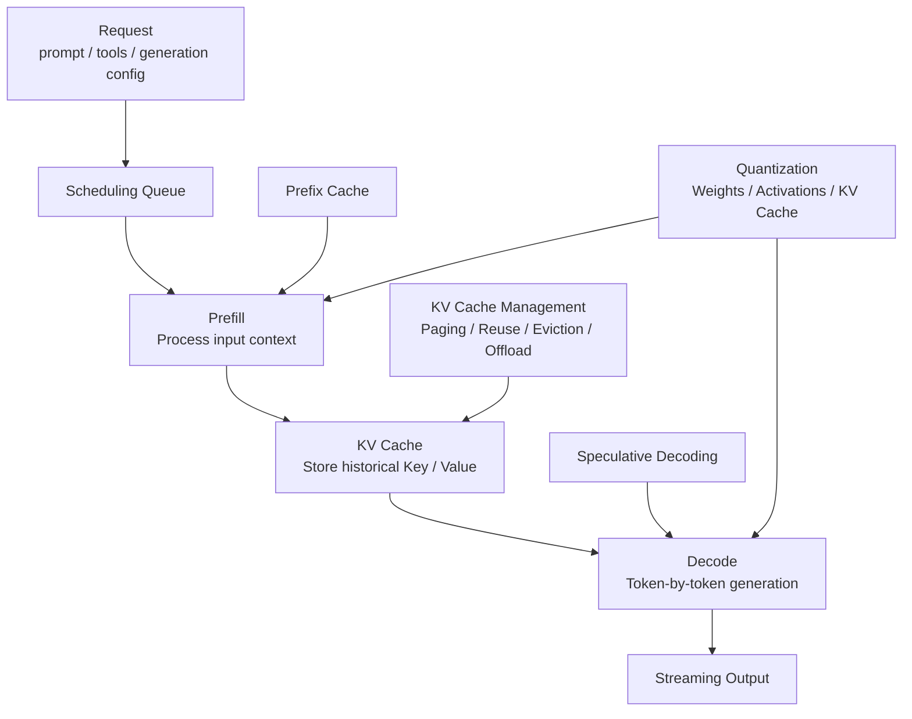
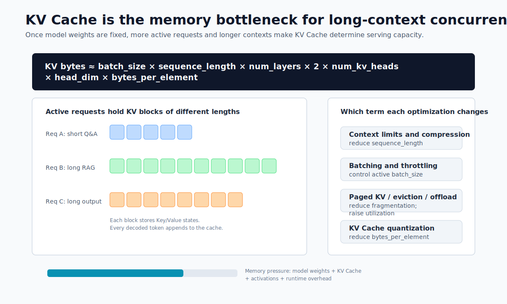
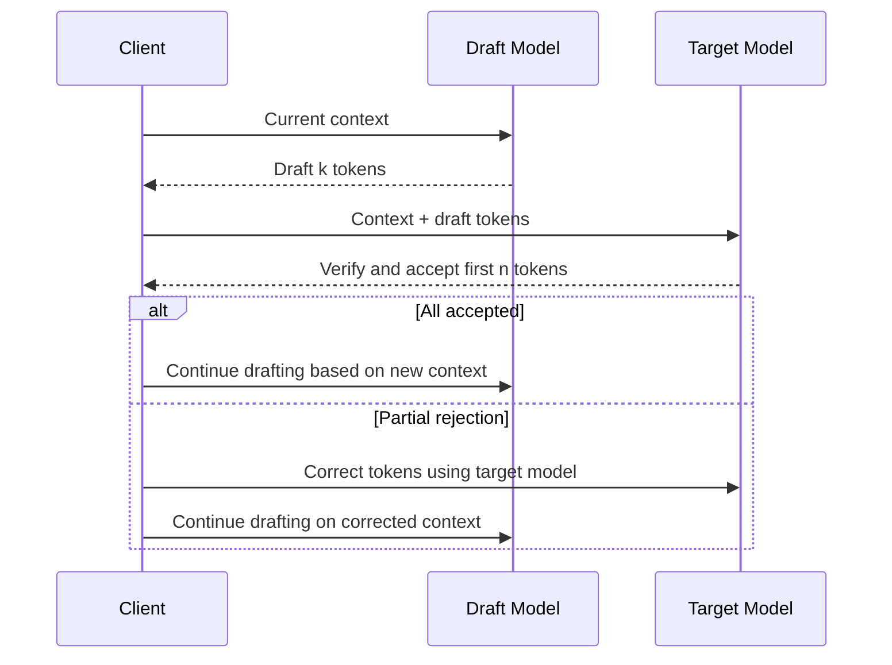

# Chapter 7 Inference Optimization Techniques

---

## Chapter Summary

This chapter outlines the main mechanisms of inference optimization, including batching, KV Cache, quantization, speculative decoding, and context management, explaining how each affects cost, capacity, and quality. Optimization is not about stacking all techniques, but first identifying bottlenecks—whether in GPU memory, initial token latency, or throughput—and then choosing the corresponding mechanisms while assessing their impact on quality. The chapter proceeds in the order of "bottleneck identification, optimization selection, and validation," emphasizing that every acceleration must be confirmed on evaluation sets to avoid unacceptable quality degradation.

## Key Terms

Inference optimization, KV Cache, Prefix Cache, speculative decoding, quantization, bottleneck identification

## Learning Objectives

- Distinguish between GPU memory, initial token latency, and throughput bottlenecks, and locate which limits the current service.
- Explain the acceleration principles and applicable preconditions of KV Cache, Prefix Cache, and speculative decoding.
- Evaluate different quantization methods in terms of memory savings versus quality loss tradeoffs.
- Design verification methods for inference optimizations to ensure they introduce no unacceptable quality regressions.

---

## Opening Scenario

In enterprises, decisions about inference optimizations rarely rest solely with the model team. The business side cares about result quality, the platform team about routing and rollback, the security team about data boundaries, and finance about costs. To make these constraints discussable, it is necessary to unify bottleneck identification and optimization selection, including KV Cache and Prefix Cache usage, into a common review framework.

---

## 7.1 Identify Bottlenecks First, Then Choose Optimization Mechanisms

Chapter 6 covered the selection of inference engines and understanding throughput versus latency tradeoffs. This chapter digs deeper into inference optimization mechanisms themselves. For enterprise platform teams, the real concern is not how cutting-edge an optimization sounds but whether it stably reduces cost, latency, or memory use without compromising model quality or business correctness.

Different business lines’ internal knowledge assistants, customer service summarizers, DataAgents, and code assistants face distinct bottlenecks. Knowledge assistants commonly hit limits in long-context prefill and KV Cache memory; customer service summarizers bottleneck at batch throughput; DataAgents struggle with structured output accuracy and retry costs; code assistants are constrained by per-token latency during decoding. Inference optimization must start with bottleneck identification and then choose mechanisms. Blindly enabling all optimizations tends to increase failure surface rather than stabilize the service.



Inference optimizations can be classified by their operational stage into four categories: KV Cache optimizations affect GPU memory and long-context concurrency; Prefix Cache optimizes redundant prefill of shared prefixes; Speculative Decoding accelerates token-by-token decode; Quantization reduces storage and bandwidth of model weights, activations, and KV Cache. They can be combined, but only after closing the evaluation loop for quality and metrics.


*Figure 7-1: Operational stages of inference optimization mechanisms. Source: This book. Alt text: A pipeline diagram from request input through token output, highlighting batching at scheduling, KV/Prefix Cache during Prefill, quantization during weight loading, and speculative decoding during Decode, illustrating mechanisms at different pipeline stages.*

Figure 7-1 organizes optimization mechanisms by bottleneck position: if Prefill is heavy, focus on prefix reuse and context management; if Decode is slow, consider speculative decoding; if memory is tight, prioritize KV management and quantization. The presence of metric and quality feedback loops are prerequisites for successful combined optimizations.

## 7.2 KV Cache: The Primary Constraint on Memory and Long Contexts

KV Cache is the core cache in autoregressive Transformer inference. When generating token `t`, the model accesses the Keys and Values for all prior tokens. Recomputing the full context at every step would be extremely slow, so inference engines cache key/value pairs during Prefill, and append new key/value pairs for each generated token during Decode. This avoids redundant computation but causes GPU memory use to grow with context length and concurrent requests.

The KV Cache size can be approximated by:

```text
KV Cache bytes
≈ batch_size
  × sequence_length
  × num_layers
  × 2
  × num_kv_heads
  × head_dim
  × bytes_per_element
```

Here the factor `2` accounts for storing both Keys and Values. This formula illustrates three facts: first, long contexts not only increase Prefill computation but also continuously consume Decode memory; second, concurrency stacks KV Cache usage by active sequences; third, quantizing KV Cache from FP16/BF16 down to FP8 or INT8 directly reduces bytes per element, significantly increasing accessible context and concurrency.



*Figure 7-2: How KV Cache scales with context length and concurrency. Source: This book. Alt text: A 3D plot showing rising KV Cache GPU memory usage with simultaneous increases in context length and concurrent request count, marking a memory limit plane beyond which queuing or rejection happens, illustrating joint pressure from long contexts and high concurrency.*

This figure connects the formula to capacity planning: context length, active request count, and bytes per element correspond to request governance, scheduling throttling, and KV Cache quantization, respectively. This should be referenced repeatedly when assessing long context, parallelism, and memory budgets.

From a platform engineering perspective, KV Cache faces four typical pressures.

*Table 7-1: Sources, symptoms, root causes, and mitigation approaches for GPU memory and context pressures. Source: This book.*

| Pressure Source       | Symptom                                     | Root Cause                                       | Priority Mitigation                        |
|----------------------|---------------------------------------------|------------------------------------------------|-------------------------------------------|
| Long Context         | High per-request memory, longer TTFT        | Large Prefill compute, long KV Cache sequences | Limit context, retrieval compression, chunking, Prefix Cache |
| High Concurrency     | GPU memory nears limit, request queuing     | Active requests hold separate KV Caches         | Continuous batching, KV paging, scheduling throttling         |
| Long Outputs         | Decode slows or forces eviction              | Output tokens also add KV Cache                  | Limit max tokens, segmented generation, task splitting         |
| Shared System Prompts | Redundant identical prefix computation       | Multiple requests share identical tool descriptions, roles, docs | Prefix Cache, prompt normalization         |

Optimizing memory use begins not with compression but with eliminating unnecessary context. Enterprises implementing Retrieval-Augmented Generation (RAG) often err by dumping all retrieved documents into the prompt, assuming the long context model will digest them automatically. In reality, this lengthens Time-To-First-Token (TTFT), increases KV Cache usage, reduces concurrency, and irrelevant evidence increases hallucination risks. A safer approach is to first improve retrieval quality, deduplicate, compress chunks, and select references, then send only necessary context into the model.

The second optimization is paged KV management. Exemplified by vLLM’s PagedAttention, inference engines avoid allocating contiguous memory per request for maximum context; instead, they split KV Cache into fixed-size blocks, mapping them like virtual memory to physical GPU memory. This reduces fragmentation and improves memory utilization when running mixed-length requests concurrently. High-performance stacks like TensorRT-LLM also support KV Cache reuse, offloading, and eviction. Platform teams don’t need to implement these manually but must understand their impact on concurrency capacity: the number of requests a single GPU can handle often depends more on KV Cache management than model weights.

The third optimization focuses on KV Cache eviction and offload. Online inference doesn’t treat all cache equally: requests currently decoding must be kept; recently completed requests that might hit shared prefixes can be retained briefly; low-priority or low-hit-probability tenant caches can be evicted first; extremely long contexts can be offloaded to CPU memory, accepting latency variability due to PCIe transfer. Enterprises should include cache policies in SLOs, not view them as internal engine minutiae.

The fourth optimization is KV Cache quantization. Reducing KV Cache precision from BF16/FP16 to FP8 or below enhances long-context concurrency but requires quality regression tests. Tasks with high fault tolerance like customer service summarization may tolerate FP8 KV Cache, while financial explanations, SQL generation, compliance responses, and code generation require business evaluation on output quality, format stability, and factual accuracy.

Pre-deployment checklist for KV Cache optimization:

- [ ] Clearly define each model’s max context, default context, and tenant-level context limits.
- [ ] Monitor KV Cache utilization, hit rate, eviction count, memory fragmentation, and request queuing time.
- [ ] Stress test scenarios with short requests, high concurrency, long context, and long output.
- [ ] Perform business-quality evaluation on KV Cache quantization, not just generic benchmarks.
- [ ] Provide degradation paths for super-long requests, e.g., context compression, batching, or prompting users to narrow scope.

## 7.3 Prefix Cache: Reusing Stable Prefixes to Reduce TTFT

Prefix Cache is a typical form of KV Cache reuse. When two requests share the same prefix, the second need not recompute the prefix prefill, instead directly reusing the cached KV pairs. vLLM documentation describes Automatic Prefix Caching as reusing existing KV Cache for queries with shared prefixes, allowing new queries to skip shared-prefix computations. For enterprise Agent platforms, this is crucial as many requests naturally share prefixes.

Common shared prefixes include:

*Table 7-2: Shared prefixes, acceleration benefits, and risks of Prefix Cache in various scenarios. Source: This book.*

| Scenario           | Shared Prefix Content                          | Acceleration Benefit                       | Risk                                      |
|--------------------|-----------------------------------------------|--------------------------------------------|-------------------------------------------|
| Multi-turn dialogue | Conversation history, system prompts, enterprise role settings | Subsequent turns reduce redundant Prefill | Cache grows with overly long history      |
| RAG Q&A            | Same long document, policy file, knowledge bundle | Multiple questions on same doc decrease TTFT | Changing retrieval snippet order lowers hit rate |
| Agent tool calls   | Tool schemas, permission rules, security policies | Avoid recomputing tool descriptions each time | Dynamic fields in prefix break hits      |
| Batch extraction   | Same task description, same output format     | Throughput increases for bulk tasks        | Diverse output schema variants reduce reuse |
| DataAgent         | Semantic layer descriptions, metric definitions, table structures | Shared metadata context across NL questions | Table structure version changes require cache invalidation |

Prefix Cache mainly reduces TTFT by cutting redundant Prefill computation. The longer and more stable the shared prefix, the higher the hit rate and the greater the benefit. If requests only share short system prompts, benefits are limited; if they share thousands or tens of thousands of tokens in long documents, tool schemas, or table structure descriptions, gains may be substantial.

To enable Prefix Cache, prompt organization matters more than engine toggles. Platforms should place stable content in the prefix and dynamic content at the suffix, for example:

```text
Stable Prefix:
1. System roles
2. Security policies
3. Tool schemas
4. Enterprise glossaries
5. Long documents or table structures

Dynamic Suffix:
1. User’s current question
2. trace_id
3. Current timestamp
4. Temporary filters
5. Previous tool outputs
```

Putting dynamic fields like `trace_id`, timestamps, random nonces, or user names at the beginning breaks cache hits even if the subsequent large tool descriptions are identical. For a multi-line enterprise DataAgent, semantic layer descriptions, metric definitions, table schemas, and SQL security rules should be stably placed in the prefix; user questions, filters, and session states belong in the suffix. This enables reuse across multiple queries in the same business domain.

In multi-turn dialogue, there is a tension between cache benefits and context inflation. The longer the history, the more reusable content but also the greater KV Cache usage. Appending the full history every turn causes subsequent requests to slow down. Production systems typically combine conversation summarization, history pruning, and important fact memory to compress dialogue history into a stable prefix rather than let it grow infinitely.

Prefix Cache deployment should monitor four metrics.

*Table 7-3: Meaning and anomaly interpretation for Prefix Cache monitoring metrics. Source: This book.*

| Metric                | Meaning                               | Anomaly Indication                               |
|-----------------------|-------------------------------------|-------------------------------------------------|
| prefix_cache_hit_rate  | Ratio of shared prefix hits          | Low hits often due to unstable prompt or dynamic fields in prefix |
| saved_prefill_tokens   | Number of Prefill tokens saved via cache | Low value means shared prefix too short, limited gains |
| cache_eviction_count   | Number of prefix cache evictions     | Frequent eviction points to memory pressure or poor cache policy |
| TTFT before/after      | Change in First-Token Latency        | High hit rate with no TTFT improvement hints at queue or decode bottlenecks |

Prefix Cache is not a universal cache: it cannot speed up completely different prompts nor fix poor retrieval quality. It can also increase memory use since the engine must retain reusable KV Cache. Platforms should set cache policies per business domain: customer service knowledge bases, fixed tool schemas, and DataAgent table structures are suitable for retention; one-off long documents, low-frequency tenants, and very large temporary contexts should be evicted more aggressively.

## 7.4 Speculative Decoding: Accelerate Decode Using a Draft Model

Speculative Decoding’s core idea is to use a faster draft model to generate multiple candidate tokens ahead of time, then have the target large model verify these candidates in a single pass. If candidates conform to the target model’s distribution, multiple tokens are accepted at once; if not, the process falls back to the target model’s own sampling. Proposed by Leviathan, Kalman, and Matias in ICML 2023, this method speeds autoregressive generation without changing output distributions.

It addresses Decode-stage bottlenecks. Large model generation typically steps one token at a time, running a large forward pass per token. Prefill can be parallelized over input tokens, but Decode is inherently serial. Speculative Decoding merges multiple decode steps into one or a few large model passes by having a small model “draft” tokens, batch-verified by the large model, reducing average cost per output token.



“Lossless” means that with proper sampling correction, the final output distribution matches the target model’s direct sampling. It is not replacing the large model with a small one nor sacrificing quality for speed. Actual gains depend on the draft model’s acceptance rate: the better the draft predicts the target’s next tokens, the higher the acceptance and speedup; if the models differ significantly, frequent rejections turn drafting computations into overhead.

Scenarios suitable for Speculative Decoding include:

*Table 7-4: Scenarios suitable for speculative decoding and their considerations. Source: This book.*

| Scenario          | Why Suitable                        | Considerations                     |
|-------------------|-----------------------------------|----------------------------------|
| Code completion   | Strong local patterns, predictable candidates | Requires related or specially trained draft model |
| Fixed-format summary | Stable output templates, high acceptance | Frequent schema changes reduce gains |
| Customer service standard replies | Consistent style and sentence patterns | Need to assess safe refusals and factual accuracy |
| Low-temperature sampling tasks | Low randomness means draft more likely to hit | High-temperature creative tasks yield unstable speedups |

Unsuitable scenarios are clear: complex reasoning, open-domain creativity, multi-tool branching, highly random sampling, multi-lingual mixing, or high uncertainty Q&A tend to have low draft acceptance. DataAgent SQL generation must be cautious; frequent draft errors, though corrected by the large model, may not improve end-to-end throughput and increase debugging complexity.

Enterprises deploying Speculative Decoding should not only look at average speedup but evaluate four metrics.

*Table 7-5: Speculative decoding monitoring metrics, meanings, and targets. Source: This book.*

| Metric                 | Meaning                                   | Target                            |
|------------------------|-------------------------------------------|---------------------------------|
| acceptance_rate         | Ratio of draft tokens accepted by target  | As high as possible; disable if below threshold |
| tokens_per_target_forward | Average accepted tokens per target model forward | Measures effectiveness of diluting large model calls |
| end_to_end_latency      | Total latency including draft computation  | Must outperform baseline at P50/P95 latency |
| quality_regression      | Business evaluation of quality degradation | Should be zero in theory; engineering validation required |

Speculative Decoding adds platform complexity by requiring extra draft model deployment, increasing model management, memory, routing, and monitoring overhead. If the draft model is from a different family, tokenizer, vocabulary, alignment, and sampling differences can cause integration challenges. Therefore, it is better viewed as an optimization for specific high-volume tasks rather than a universal default.

For a multi-line enterprise, priority scenarios to try are customer service standard summaries, code completion, and fixed-format ticket generation—where output is stable and benefits easy to measure. Deferred scenarios include financial explanations, compliance Q&A, and complex DataAgent reasoning—where quality risk and failure costs are higher.

## 7.5 Quantization: Trading Precision for Capacity, Throughput, and Cost

Quantization replaces high-precision numerical representations in models with lower-precision formats to reduce GPU memory, storage, and memory bandwidth. Large-scale inference quantization at least covers four categories: weight quantization, activation quantization, KV Cache quantization, and full-pipeline low-precision inference. Enterprises commonly use weight and KV Cache quantization.

*Table 7-6: Targets, formats, benefits, and risks of weight and activation quantization. Source: This book.*

| Type               | Target                        | Typical Formats                      | Main Benefits                     | Main Risks                        |
|--------------------|------------------------------|------------------------------------|----------------------------------|----------------------------------|
| Weight quantization | Model parameters             | INT8, INT4, GPTQ, AWQ, bitsandbytes 4-bit/8-bit | Reduces model memory, enabling larger models | Can degrade inference, code, math, and long-context quality |
| Activation quantization | Intermediate activations    | INT8, FP8                           | Lowers compute and bandwidth cost | Complex calibration; hardware and architecture sensitive |
| KV Cache quantization | Decode history cache         | FP8, INT8, INT4, etc.               | Improves long-context concurrency | Can degrade accuracy of retrieval and fine-grained references |
| Mixed precision     | Different layers or tensors at different precisions | FP16/BF16 + INT4/FP8               | Balances quality and cost        | Complex configuration and larger test matrix |

Weight quantization addresses whether the model fits into memory and the computation cost per token. For example, reducing a BF16 model to INT4 dramatically shrinks parameter storage, allowing larger models per card. Methods like GPTQ, AWQ, and bitsandbytes serve this goal, but weight quantization is not risk-free: smaller models, fine-grained tasks, or structured output are more likely to fail due to quantization noise causing business errors.

KV Cache quantization targets the main memory bottleneck in long context and high concurrency scenarios. When model weights are fixed, increased active requests and longer contexts push KV Cache to dominate GPU memory use. Reducing KV Cache precision from BF16/FP16 to FP8 or below greatly increases supported context token count. However, its impact on long-document Q&A, needle-in-haystack retrieval, code references, and SQL generation must be tested separately. Passing weight quantization evaluation does not guarantee KV Cache quantization safety.

Quantization methods can also be grouped by training/calibration requirements.

*Table 7-7: PTQ vs QAT quantization methods, advantages, and costs. Source: This book.*

| Method Type            | Description                                | Advantages                 | Costs                      |
|------------------------|--------------------------------------------|----------------------------|-----------------------------|
| Post-Training Quantization (PTQ) | Quantizing pre-trained models with calibration data or second-order approximation | Fast deployment; compatible with most open models | Relies on calibration sets; very low-bit quantization may degrade quality |
| Quantization-Aware Training (QAT) | Simulating low-precision effects during training | More robust quality; suited for production | High cost; requires training pipeline |
| Runtime quantization    | Low-precision storage or computation on some tensors during inference | Flexible configuration; easy to rollout selectively | Strong dependencies on engine, hardware, and kernels |

Enterprise quantization evaluation should go beyond perplexity or generic leaderboards. A multi-line enterprise needs at least four kinds of business evaluation sets.

*Table 7-8: Focus and typical failures in quantization quality validation sets. Source: This book.*

| Evaluation Set        | Focus                                  | Example Failures                     |
|-----------------------|----------------------------------------|------------------------------------|
| Customer Service Q&A  | Factual consistency, refusal behavior, safety phrasing | Incorrect policy dates or compensation terms |
| DataAgent / NL2SQL    | Table/column names, aggregation logic, SQL validity | Missing filtering or invalid columns |
| Code Assistant        | Syntax, dependencies, edge cases      | Generates readable but non-runnable code |
| Compliance & Security | Sensitive data, privilege escalation, injection defense | Post-quantization shifts in refusal boundaries |

Quantization rollout can follow a conservative-to-aggressive path:

1. Establish quality and performance baselines with BF16/FP16 models.
2. Try INT8 or FP8, verify quality, TTFT, TPOT, throughput, and memory.
3. For cost-sensitive and stable-quality tasks, try INT4 weight quantization.
4. Test KV Cache FP8 or lower precision separately for long-context services.
5. Produce model cards per quantization version recording method, calibration, evaluation sets, and applicable tasks.

Quantization also affects combinations of inference optimizations. For example, INT4 weight quantization frees memory to allow larger batch sizes; KV Cache FP8 increases long-context concurrency; however, quantized models combined with Speculative Decoding can change token acceptance rates due to distribution shifts between draft and target models. Prefix Cache combined with quantization also requires joint validation because it reuses KV Cache at a specific precision.

In production, quantized versions must not be treated as drop-in replacements. Platforms should consider versions like `qwen3-32b-bf16`, `qwen3-32b-awq-int4`, and `qwen3-32b-fp8-kv` as distinct routable models, each with tailored task assignments, tenant selection, SLOs, and rollback plans. This way, if DataAgent SQL errors increase on INT4, they can be routed back to BF16 without impacting lower-risk customer service summarization.

## Chapter Recap

Key takeaways:

- Inference optimization should start from identifying bottlenecks, not toggling features one by one; different tasks hit limits in Prefill, Decode, KV Cache, structured output, or queue scheduling.
- KV Cache sets memory limits for long context and concurrency; Prefix Cache reliably reduces TTFT only with stable prefixes and high hit rates.
- Speculative Decoding fits high-volume tasks with stable output patterns and high draft model acceptance; it is not a universal default.
- Quantized models must be governed independently with business-quality validation covering structure, factuality, and safety boundaries.

Pre-deployment checklist:

- [ ] Established performance baselines separately for short requests, high concurrency, long context, long output, and structured output.
- [ ] Each optimization has an independent toggle, evaluation report, applicable tasks, rollback strategy, and monitoring metrics.
- [ ] Metrics cover TTFT, TPOT, throughput, memory, KV Cache hits/evictions, quality regressions, and cost impact.
- [ ] Combined optimizations are tested end-to-end, not only on single prompt tokens/sec.

Further reading: [vLLM Automatic Prefix Caching](https://docs.vllm.ai/en/v0.13.0/features/automatic_prefix_caching/), [vLLM Prefix Caching Design](https://docs.vllm.ai/en/stable/design/prefix_caching/), [TensorRT-LLM KV Cache System](https://nvidia.github.io/TensorRT-LLM/features/kvcache.html), [TensorRT-LLM Quantization](https://nvidia.github.io/TensorRT-LLM/latest/features/quantization.html), [Hugging Face Transformers Quantization](https://huggingface.co/docs/transformers/v4.38.1/main_classes/quantization), [Fast Inference from Transformers via Speculative Decoding](https://proceedings.mlr.press/v202/leviathan23a.html), and [GPTQ: Accurate Post-Training Quantization for Generative Pre-trained Transformers](https://arxiv.org/abs/2210.17323).

## References

Dao, T. et al. (2022). [*FlashAttention: Fast and Memory-Efficient Exact Attention with IO-Awareness*](https://arxiv.org/abs/2205.14135). NeurIPS.

Kwon, W. et al. (2023). [*Efficient Memory Management for Large Language Model Serving with PagedAttention*](https://arxiv.org/abs/2309.06180). SOSP.

Leviathan, Y. et al. (2023). [*Fast Inference from Transformers via Speculative Decoding*](https://arxiv.org/abs/2211.17192). ICML.

Lin, J. et al. (2024). [*AWQ: Activation-aware Weight Quantization for LLM Compression and Acceleration*](https://arxiv.org/abs/2306.00978). MLSys.
