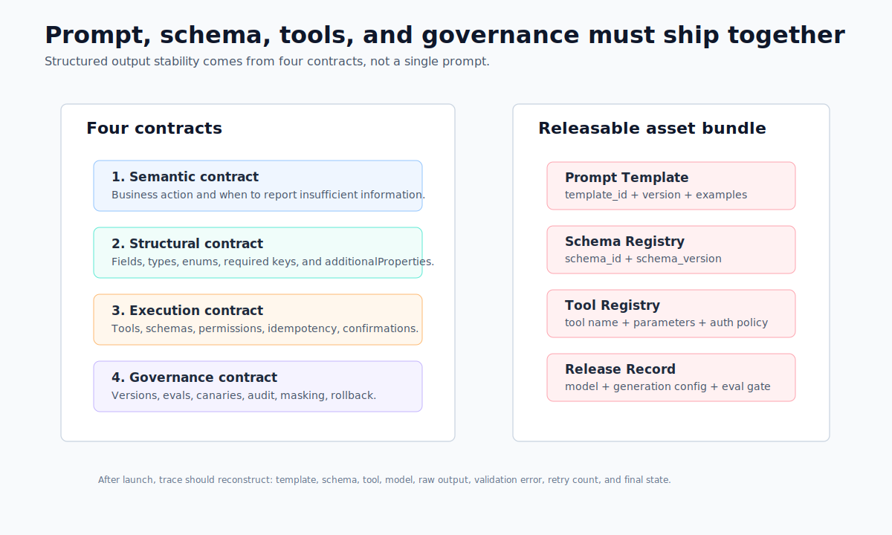
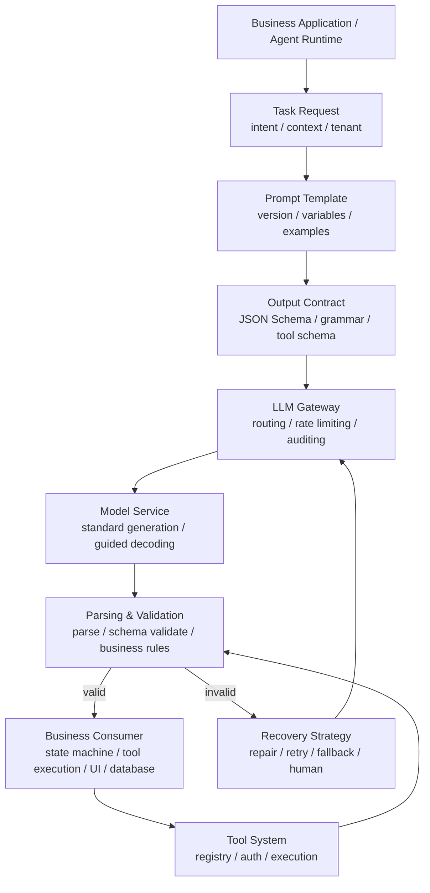
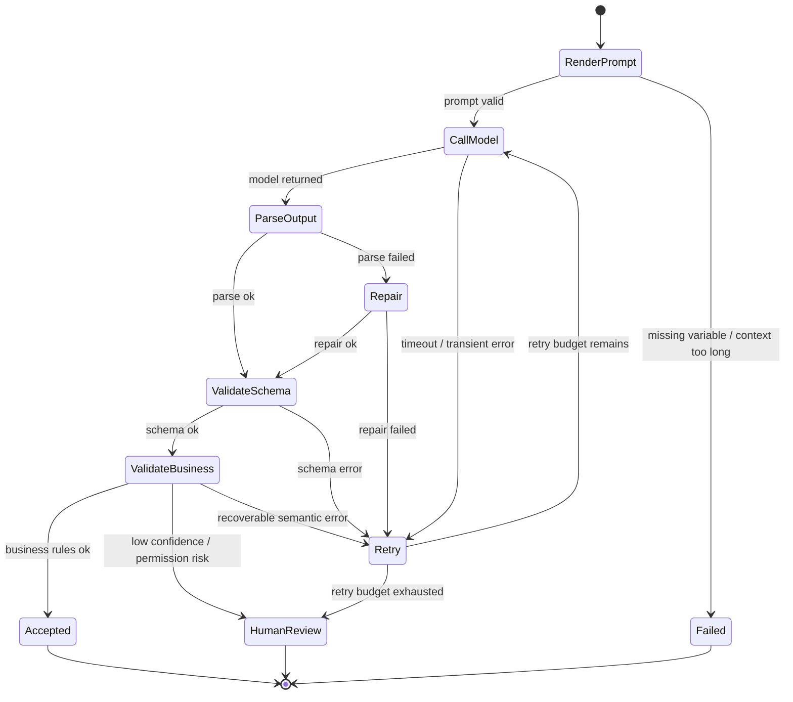

# Chapter 8 Structured Output and Prompt Engineering

---
## Chapter Summary

This chapter discusses how model outputs transform from readable text into system-consumable interface results. In enterprise applications, the output is rarely just displayed to users; more often, results need to be written into work orders, contract databases, approval workflows, SQL executors, or frontend component trees. Simply prompting the model to "output JSON" is unreliable. The system also requires schemas, parsers, business validations, retry strategies, tool permissions, and audit logs. This chapter treats prompts as the input-side interface, structured output as the output-side contract, and tool invocations as controlled system actions, explaining how these three work together within release and rollback processes.
## Key Terms

Prompt Engineering, Structured Output, JSON Schema, Tool Invocation, Constrained Decoding, Failure Recovery
## Learning Objectives

- Be able to write prompt templates as version-controlled input contracts, rather than scattered copywriting embedded in code.
- Be able to design small and explicit schemas for model outputs, explaining fields, enums, evidence, and failure exit points.
- Be able to distinguish the different problems solved by prompt constraints, constrained decoding, post-validation, and business validation.
- Be able to design parameter validation, idempotency, permissions, and human confirmation boundaries for tool calls.

---
## Opening Scenario

The customer service center wants the model to categorize complaints automatically and feed them into the ticketing system; the contract assistant wants the model to extract payment milestones and write them into a reminder table; DataAgent wants the model to generate the parameters for the next tool invocation; generative UI wants the model to return a component tree. They all seem like tasks of "making the model respond in a specific format," but the production risks are quite different.

If the model writes `delivery_delay` as "logistics are slow," humans can understand it, but the system cannot reliably ingest it into the database. If the model fills an extra undefined field in refund tool parameters, the tool executor may reject it or the business code may misinterpret it. If the model outputs evidence sentences that do not exist in the original text, correct JSON syntax alone is useless. Therefore, structured output is not just a formatting issue but an interface governance issue.

---
## 8.1 From Free Text to Verifiable Actions

### 8.1.1 What Problem Does Structured Output Solve?

When teams first integrate a large language model into a product, they typically treat it as a text interface: the application assembles a prompt, the model returns natural language, and the front end displays it to the user. This approach is fast enough for prototyping, but three limitations emerge in production.

First, free text is hard for downstream systems to consume reliably. Customer-service tickets, contract extraction, approval recommendations, and SQL execution plans all require specific fields, types, enumerations, and evidence. Second, free text is difficult to reproduce. Small changes in the prompt, model version, generation parameters, or context can cause the output to be phrased differently. Third, free text resists auditing. After an incident, teams need to know what fields the model returned, which fields failed validation, which tool was invoked, and whether the case was routed to a human queue.

Structured output reframes a model generation as a set of verifiable actions: what the input is, what structural constraints the output must satisfy, which failures are retryable, and which failures must be rejected or escalated to a human.

*Table 8-1: Output objects and failure consequences for common structured tasks. Source: compiled by the authors.*

| Task | Output Object | Downstream Consumer | Primary Risk |
|---|---|---|---|
| Ticket classification | Category, confidence, evidence sentences, human-review flag | CRM, customer-service ticketing system | Misrouting, unauthorized automation |
| Contract extraction | Dates, amounts, obligations, risk clauses, evidence locations | Contract repository, reminder system | Dirty data ingestion, missed risks |
| DataAgent planning | Tool name, parameters, stopping condition, clarifying questions | Runtime, SQL executor, permission system | Wrong tool invoked, unauthorized queries |
| Generative UI | Form schema, component tree, data bindings | Front-end rendering layer | Non-renderable page, broken interactions |

What these tasks share is that their outputs continue to drive system actions. They need not "text that looks like JSON" but a versioned, validated interface contract with defined error handling.

### 8.1.2 The Boundaries Between Prompts, Schemas, and Tool Calls

Prompts, structured output, and tool calls are often lumped together. They do depend on one another, but their responsibilities differ.

A prompt is the input-side contract: it tells the model the task, context, business rules, and output requirements. Structured output is the output-side contract: it specifies the fields, types, enumerations, and required properties of the returned object. Tool calling is the execution-side contract: it hands the tool name and parameters the model produces to the platform for validation, after which the platform decides whether to execute.



*Figure 8-1: The four-layer contract of a structured task. Source: original diagram by the authors. Alt text: The diagram shows four layers from top to bottom — prompt input contract, model generation, schema output contract, and downstream consumption — each with a validation checkpoint; output must pass the schema before entering the business system.*

Figure 8-1 emphasizes "contract binding." A structured task cannot publish only a prompt, nor only a schema. The prompt template, schema, tool contract, model version, generation parameters, evaluation samples, and rollback strategy should all be managed as a single release bundle.

A structured task can be decomposed into four layers.

*Table 8-2: The four-layer contract of a structured task. Source: compiled by the authors.*

| Layer | Key Question | Typical Artifact |
|---|---|---|
| Semantic contract | What business action should the model perform? | Task description, boundary rules, examples |
| Structural contract | What must the output look like? | JSON Schema, enumerations, field descriptions |
| Execution contract | Is tool invocation allowed, and how are tools executed? | Tool schema, permission policy, idempotency key |
| Governance contract | How is the task released, evaluated, canary-deployed, and rolled back? | Template version, schema version, evaluation report, trace |

If any of these four layers is missing, production risk shifts to a later system. With only a prompt, the system will be brought down by formatting errors; with only a schema, the model's semantic accuracy may remain low; with only tool calls, security and idempotency issues will be hidden until execution time.

When reviewing a structured task, ask the author to map each of these four layers to a concrete file or configuration artifact. If the prompt version cannot be located, behavior is not reproducible. If the destination of a schema failure is unclear, the recovery path has not been designed. If there is no clear owner for tool-call authorization, there is no isolation layer between model output and system action.

### 8.1.3 A Prompt Is an Interface Design

Enterprise prompts should not be written as one-off instructions. A stable template must at minimum specify: role boundaries, task objective, context variables, business rules, output contract, and failure strategy.

For example, a complaint classification task can be designed as follows:

```text
You are a customer-service quality-assurance assistant. Your only responsibility is to
categorize the reason for a complaint. Do not generate any refund or compensation commitments.

Task:
Identify the primary complaint reason from the ticket text and provide up to three
evidence sentences drawn directly from the original text.

Business rules:
- category must be one of: delivery_delay, quality_issue, refund_dispute,
  service_attitude, unknown.
- If there is insufficient information, use unknown and populate missing_info.
- If the complaint involves both a refund and a logistics issue, prioritize the
  reason that caused the escalation.

Output:
Return JSON conforming to complaint_classification_v2. Do not output Markdown.
```

The value of this prompt lies not in its wording but in the testability of its boundaries. Business rules can be converted into test cases; enumerations can be converted into a schema; failure exits can be monitored; and "do not generate refund commitments" can be covered by safety evaluations.

Few-shot examples, chain-of-thought reasoning, multi-branch reasoning, and majority-vote sampling can all improve stability on certain tasks, but none of them substitutes for an interface contract. More examples make prompts longer and maintenance more expensive; more explicit reasoning increases the risk of leaking intermediate drafts and raises cost. Production systems should first establish solid structure, rules, and validation, then decide — based on task risk — whether to incorporate these additional techniques.

### 8.1.4 Failure Modes in Structured Output

The most common misconception is treating "output JSON" as equivalent to structured output. The model can still produce Markdown code fences, trailing explanations, missing fields, invalid enumerations, or truncated objects. The prompt is the first constraint, not the last line of defense.

The second misconception is that a more complex schema is more reliable. Deeply nested structures, excessive optional fields, and ambiguous field names all increase failure rates and make it harder for teams to pinpoint problems. A production schema should start with the minimum viable set of fields and prioritize short enumerations, numbers, dates, booleans, and evidence references.

The third misconception is allowing the model to operate systems directly. The model can suggest which tool to call and what parameters to use, but actual execution must be performed by the platform. Actions such as sending emails, issuing refunds, creating tickets, and executing SQL require authentication, parameter validation, idempotency control, auditing, and human confirmation.

---
## 8.2 Verification and Recovery Loop

### 8.2.1 Link Location

The structured output capability sits between business applications, the LLM Gateway, inference services, and tool systems. Upstream components provide tasks, context, and risk levels; downstream components receive status updates, tool invocations, database writes, or UI rendering.




*Figure 8-2: Verification and recovery loop for structured output. Source: drawn by the authors. Alt text: The figure illustrates a cycle of model generation, parsing, schema validation, business validation, and downstream consumption; validation failures lead to repair, retry, fallback, or human review branches.*

The most crucial part in Figure 8-2 is the **invalid** branch. Many production incidents are not caused by the model failing to respond altogether, but by outputs that "look almost correct": field names are close, evidence is missing, enumerations are misspelled, permissions are violated, or tool parameters are incomplete. Once such results pass the validation layer, problems enter the business system.

### 8.2.2 Request Contract

Structured requests can be described with a unified object. The example below is not tied to any model SDK; it only expresses the platform’s necessary preserved and passed information.

```json
{
  "task": "complaint_classification",
  "tenant": "demo-retail",
  "prompt": {
    "template_id": "complaint_classifier",
    "version": "2.1.0",
    "variables": {
      "ticket_text": "User reported package delayed by three days; customer service unresponsive several times, requests refund.",
      "channel": "online_chat"
    }
  },
  "model": {
    "name": "qwen3-32b-instruct",
    "temperature": 0.1,
    "max_tokens": 512
  },
  "response_format": {
    "type": "json_schema",
    "schema_id": "complaint_classification",
    "schema_version": "2.0.0"
  },
  "recovery": {
    "max_retries": 2,
    "repair": true,
    "fallback": "human_review"
  }
}
```

The corresponding schema should remain small and clear.

```json
{
  "type": "object",
  "required": ["category", "confidence", "evidence", "requires_human_review"],
  "additionalProperties": false,
  "properties": {
    "category": {
      "type": "string",
      "enum": [
        "delivery_delay",
        "quality_issue",
        "refund_dispute",
        "service_attitude",
        "unknown"
      ]
    },
    "confidence": {
      "type": "number",
      "minimum": 0,
      "maximum": 1
    },
    "evidence": {
      "type": "array",
      "items": {"type": "string"},
      "minItems": 1,
      "maxItems": 3
    },
    "requires_human_review": {"type": "boolean"},
    "missing_info": {"type": "string"}
  }
}
```

There are two design points here. Setting `additionalProperties: false` restricts the model output from containing undefined fields, avoiding downstream misinterpretation. Including `"unknown"` gives the model a legitimate failure exit; otherwise, the model might be forced to choose among several incorrect categories.

### 8.2.3 Lifecycle and Failure Stratification

Structured output requests can be viewed as a state machine.



Failure handling requires stratification. JSON parsing failures can be repaired once; schema errors can be sent back with the validation error to the model for retry; missing evidence requires supplemental retrieval or manual confirmation; parameter overreach must be rejected outright and logged as a security incident. Retrying every failure increases cost and latency; sending every failure to manual review undermines automation.

*Table 8-3: Failure Types and Recovery Strategies for Structured Requests. Source: compiled by the authors.*

| Failure Type           | Typical Trigger Condition                             | Handling Method                                      |
|-----------------------|-----------------------------------------------------|----------------------------------------------------|
| Prompt Rendering Fail  | Missing variables, context too long, sensitive info not masked | Block request; require variable completion or context trimming |
| Parsing Fail          | Output contains code blocks, comments, trailing text, or partial JSON | Repair once; if still fail, retry                   |
| Schema Fail           | Missing fields, type errors, invalid enumerations   | Retry with validation error feedback; exceed budget triggers manual review |
| Business Validation Fail| Evidence sentence missing, amount unit missing, confidence too low | Supplemental retrieval, clarification request, or manual review |
| Tool Validation Fail  | Tool not found, parameter out of bounds, action needs confirmation | Reject execution; record trace and security events  |
| Execution Uncertainty | Tool timeout, network interruption, unknown non-idempotent action | Use idempotency key to check status; forbid blind retries |

Production systems must also log sufficient trace information: `template_id`, `schema_id`, `model`, `generation_config`, `raw_output`, `parse_error`, `validation_error`, `retry_count`, `tool_call`, `tool_result`, `latency`, `token_usage`, and final status. Sensitive fields like user text, phone numbers, ID numbers, contract amounts must be handled according to the security governance strategies described in Chapter 10 and beyond.

---
## 8.3 Key Trade-offs

### 8.3.1 Prompt Constraints, Constrained Decoding, and Post-Validation

Prompt constraints offer the best compatibility but have the highest failure rate in formatting. Post-validation is easy to integrate and can detect errors to trigger retries, but it still wastes one model call. Constrained decoding reduces invalid formats during generation, making it suitable for high-concurrency extraction and tool parameter generation; however, it depends on the inference service capabilities and cannot replace business validation.

In practice, a combined approach is often used: the prompt clearly states the task and boundaries; JSON Schema or grammar constraints are enabled at the inference stage as much as possible; then output undergoes schema and business validations. Constrained decoding ensures “correct shape,” while business validation ensures “usable content.”

### 8.3.2 Single Generation with Large Schema vs. Multi-step Generation with Small Schemas

Simple forms can generate the entire object in one go. Complex tasks are better split into multiple small schemas: contract processing first determines the contract type, then extracts clauses by type; DataAgent first identifies query intent, then generates SQL or tool parameters; customer service tickets are first classified, then evidence and escalation reasons are extracted for high-risk categories.

Multi-step generation with small schemas increases number of calls and latency but improves error localization and narrows retry scope. For high-risk tasks, this extra cost is usually worthwhile.

### 8.3.3 Explicit Reasoning Process and Evidence Output

Enterprise systems should not by default expose the model’s full reasoning drafts to users or write them into business logs. A safer approach is for the model to output conclusions, evidence references, and necessary explanations rather than a full chain of thought. For high-risk tasks, the system should retain original input, retrieved snippets, model outputs, and manual review records.

### 8.3.4 Model-Selected Tools vs. Workflow-Controlled Tools

Open-ended office assistants can let the model freely choose among low-risk tools. For production workflows like approvals, refunds, database queries, and outbound messaging, the workflow should filter the tool list based on status and permissions, then let the model fill parameters within the limited set. The more tools available, the higher the chance of mis-invocations, and larger context usage which harms cache hit rates.

---
## 8.4 mini-platform Implementation Path

### 8.4.1 Scope of Implementation

The current repository already includes two related foundational modules: `mini-platform/core/gateway/` handles model invocation and routing abstraction, and `mini-platform/core/registry/tool_registry.py` represents the relationship among tool names, descriptions, parameter schemas, and handlers. Structured output capabilities can be added on top of this foundation in three areas.

*Table 8-4: Suggested Path for Structured Output Capabilities. Source: This book.*

| Capability           | Suggested Path                                      | Description                                |
|---------------------|----------------------------------------------------|--------------------------------------------|
| Prompt Templates    | `mini-platform/core/gateway/prompt_template.py`    | Manage template variables, versions, and rendering |
| Structured Parsing  | `mini-platform/core/gateway/structured_output.py`  | Parse, JSON Schema validation, and repair results |
| Tool Invocation Validation | `mini-platform/core/registry/tool_registry.py` | Add parameter validation and policies on top of tool schemas |

A lightweight implementation can initially support only JSON object parsing and basic field validation. Production systems can then replace this with Pydantic, jsonschema, Instructor, Outlines, or an inference engine’s built-in guided decoding.

### 8.4.2 Structured Parsing Example

The following code demonstrates the core approach of the structured output gateway. It is not a full JSON Schema implementation but illustrates the boundaries of parsing, field validation, and error reporting.

```python
# Suggested source: mini-platform/core/gateway/structured_output.py
from __future__ import annotations

import json
from dataclasses import dataclass
from typing import Any

@dataclass(frozen=True)
class ValidationError:
    path: str
    message: str

@dataclass(frozen=True)
class StructuredResult:
    ok: bool
    data: dict[str, Any] | None
    errors: list[ValidationError]
    raw: str

def parse_structured_json(raw: str, required: set[str]) -> StructuredResult:
    try:
        data = json.loads(raw)
    except json.JSONDecodeError as exc:
        return StructuredResult(False, None, [ValidationError("$", exc.msg)], raw)

    if not isinstance(data, dict):
        return StructuredResult(False, None, [ValidationError("$", "expected object")], raw)

    errors = [
        ValidationError(field, "missing required field")
        for field in sorted(required)
        if field not in data
    ]
    return StructuredResult(not errors, data if not errors else None, errors, raw)
```

Tool calls must be located and executed via a registry. The model outputs at most the tool name and parameters; the platform is responsible for validation.

```python
# Suggested source: mini-platform/core/gateway/tool_calling.py
from __future__ import annotations

from typing import Any

from core.registry import ToolRegistry

def execute_validated_tool_call(
    registry: ToolRegistry,
    name: str,
    version: str,
    arguments: dict[str, Any],
    *,
    tenant: str,
    idempotency_key: str,
) -> Any:
    tool = registry.get(name, version)

    if not idempotency_key:
        raise ValueError("idempotency key is required")

    # Production code also needs to validate arguments, tenant permissions, and action risk levels.
    return tool.handler(**arguments)
```

### 8.4.3 Release Gates

Before launching structured output, it must pass at least five types of checks.

*Table 8-5: Release Gates for Structured Output. Source: This book.*

| Gate               | Inspection Items                                     | Evidence                            |
|--------------------|-----------------------------------------------------|-----------------------------------|
| Contract Integrity | Are prompt, schema, tool contracts, and model versions linked in the release? | Release record, version numbers, rollback targets |
| Failure Recovery   | Are there fallback paths for parse failure, schema failure, tool failure? | Retry settings, manual queues, fallback strategies |
| Security Boundaries | Do high-risk tools require permissions and manual approval? | Tool policies, audit logs, permission tests |
| Cost and Performance | Is there budget for retries and multiple samplings? | Token usage, P95 latency, failure cost |
| Regression Testing | Are success, boundary, refusal, and adversarial input samples adequately covered? | Evaluation reports, failure sample lists |

These gates do not require building a large platform all at once. The first version only needs to achieve version traceability, failure categorization, and tool enforcement to be much more robust than just “prompt string + JSON parse.”

The initial version of structured output also does not need to be complex. A practical starting point is to solidly implement three types of tasks: one for information extraction, one for tool invocation, and one for high-risk tasks requiring human review. Only after these three run smoothly can the team clarify whether the schema design, retry budgets, and audit fields are sufficient.

### 8.4.4 Failure Scenarios

**Failure Mode 1: Markdown code blocks wrapping JSON.** The example uses code blocks; the model outputs accordingly, causing the parser to fail outright. The fix is to keep examples as bare JSON only, have the parser do one repair pass for code blocks, and activate JSON Schema or grammar constraints for frequent tasks.

**Failure Mode 2: Fields are valid but semantically unusable.** `category` is a valid enum and `confidence` a number, but the evidence sentence does not exist in the original ticket. The fix is to add evidence backreference validation, requiring evidence to come from the input text or retrieved snippet.

**Failure Mode 3: Retries cause duplicate ticket creation.** After a timed-out first tool call, the platform retries and creates a duplicate ticket. The fix is for all non-idempotent tools to accept an `idempotency_key`, deduplicate by key on the tool side, and write execution state into the audit log.

**Failure Mode 4: Few-shot examples carry outdated policies.** The model learns old policies, resulting in correct classification but incorrect advice. The fix is to have examples only demonstrate format and boundaries, inject frequently changing policies from controlled knowledge sources, and record knowledge versions.

---
## Chapter Recap

1. The prompt serves as the input-side interface; structured output is the output-side contract; tool invocation represents controlled system actions. These three components require version binding, evaluation, and rollback mechanisms.

2. Production systems cannot rely solely on “please output JSON.” Parsing validation, schema validation, business logic validation, retries, and manual fallback all need to be integrated into the workflow.

3. While the model can generate tool invocation suggestions, execution must be performed by the platform—especially handling authentication, parameter validation, idempotency, and auditing.

4. Schemas should start from the minimally viable fields. Complex tasks are better suited to splitting into multiple small objects, multi-step validation, and partial retries.

5. The maturity of structured output depends not on how complex the prompt is, but on whether failures can be classified, recovered, reproduced, and rolled back.
## Further Reading

- JSON Schema official documentation: [https://json-schema.org/](https://json-schema.org/)
- Outlines documentation: [https://dottxt-ai.github.io/outlines/](https://dottxt-ai.github.io/outlines/)
- Instructor documentation: [https://python.useinstructor.com/](https://python.useinstructor.com/)
- OpenAI Structured Outputs documentation: [https://platform.openai.com/docs/guides/structured-outputs](https://platform.openai.com/docs/guides/structured-outputs)
- Related chapters: Chapter 6 Local Inference Engines, Chapter 7 Inference Optimization Techniques, Chapter 23 Tool Registry & Function Calling, Chapter 24 MCP and Enterprise Tool Ecosystem
## References

JSON Schema. (n.d.). [Specification](https://json-schema.org/).

OpenAI. (n.d.). [Structured Outputs guide](https://platform.openai.com/docs/guides/structured-outputs).

Guidance. (n.d.). [Documentation](https://guidance.readthedocs.io/).

Instructor. (n.d.). [Documentation](https://python.useinstructor.com/).
