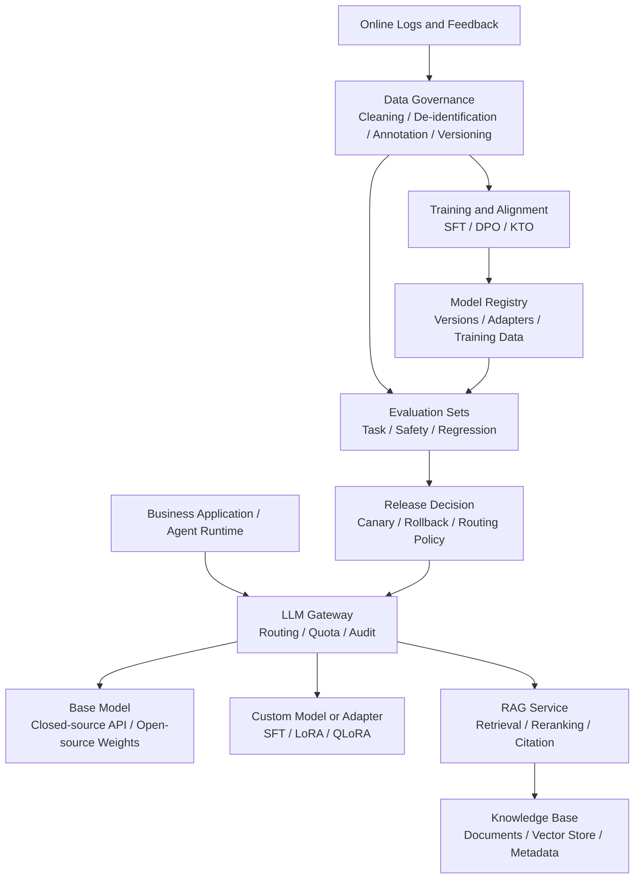
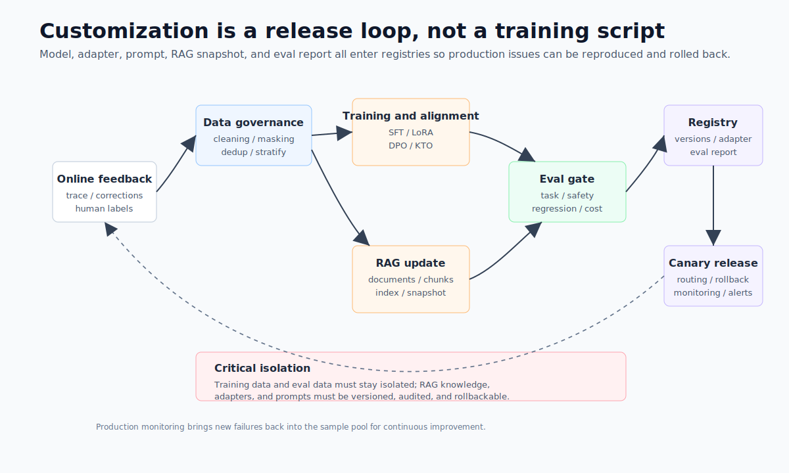
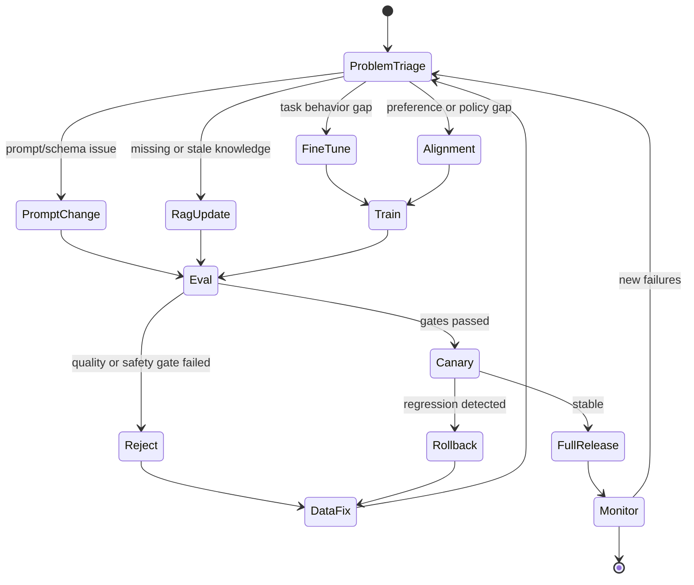

# Chapter 9 Customized Model Capabilities and Knowledge Augmentation

---
## Chapter Summary

This chapter discusses how enterprises should decide whether to revise prompts, implement RAG (Retrieval-Augmented Generation), fine-tune models, or introduce preference alignment when facing model performance issues. Many teams immediately consider fine-tuning when a model gives incorrect answers, but the root causes of failures in production may be knowledge obsolescence, unstable output formatting, missing permission boundaries, or insufficient evaluation samples. Fine-tuning is suitable for learning task patterns and domain-specific expressions, RAG is appropriate for integrating updatable, referenceable enterprise knowledge, and alignment is best for adjusting refusal behavior, style, and safety preferences. This chapter places these approaches within a single closed loop: starting from failure case triage, followed by data governance, training or knowledge updates, evaluation, canary rollout, rollback, and then returning to online monitoring.
## Key Terms

Capability customization, RAG, fine-tuning, LoRA, preference alignment, evaluation closed loop
## Learning Objectives

- Be able to determine whether a failure case is due to knowledge gaps, unstable formatting, insufficient task capability, or inappropriate preference boundaries.
- Be able to explain which part of the model pipeline is changed by Prompting, Retrieval-Augmented Generation (RAG), fine-tuning, and alignment respectively.
- Be able to explain the engineering trade-offs between LoRA / QLoRA, full fine-tuning, external knowledge bases, and tool querying.
- Be able to design a closed-loop process for capability customization from online feedback to staged rollout.

---
## Opening Scenario

After an enterprise assistant is launched, business teams usually quickly report that “the model doesn’t understand us.” The customer service team says classification criteria are unstable, the legal team says risk levels do not comply with internal standards, the data team says the model always uses incorrect metric definitions, and the HR team says the Q&A references outdated policies. Although these issues appear similar on the surface, their handling differs.

If the model doesn’t know about a vacation policy updated just last week, the knowledge base should be updated rather than retraining the model to memorize the new policy. If the model understands the question but consistently fails to output fixed-format JSON, the prompt, schema, and structured output pipeline should be checked first. If the model repeatedly generates incorrect SQL patterns, this indicates the task distribution is significantly different from the base model’s training data, and supervised fine-tuning (SFT) or Low-Rank Adaptation (LoRA) may be needed. If the model tends to give overconfident answers on borderline issues, then preferences and safety boundaries must be addressed.

The first step in capability customization is not training, but triage.

---
## 9.1 Identify the Problem Type First

### 9.1.1 Three Common Approaches

When enterprises want a model to "understand the business better," they typically pursue one of three approaches: fine-tuning, RAG, and alignment. These can be combined, but none can substitute for another.

*Table 9-1: Capability-customization approaches and the problems they address. Source: compiled by the authors.*

| Approach | What It Changes | Best For | Update Cadence |
|---|---|---|---|
| Fine-tuning | Model parameters or adapters | Task habits, domain language, fixed output patterns | Weekly to monthly |
| RAG | External context | Current policies, product manuals, contract terms, metric definitions | Hourly to daily |
| Alignment | Model preferences and refusal tendencies | Tone, safety boundaries, compliant phrasing, risk tiers | Weekly to quarterly |

A customer-service assistant might use all three simultaneously: RAG to retrieve the latest policies, LoRA to learn ticket-classification conventions, and an aligned model to prevent unauthorized promises of compensation. The key is that every failure sample must be explained by its root cause—you cannot attribute every problem to "the model doesn't understand the business well enough."

### 9.1.2 Triaging Failure Samples

Failure samples should first enter a triage table, not be fed directly into a training set. The goal of triage is to answer two questions: whether what the model is missing is knowledge, format, task capability, or a preference boundary; and whether the problem can be solved in a low-cost, rollback-friendly way.

*Table 9-2: Common failure symptoms, likely root causes, and preferred remedies. Source: compiled by the authors.*

| Symptom | Likely Root Cause | Preferred Remedy |
|---|---|---|
| Model says it doesn't know the latest policy, price, inventory, or contract status | Knowledge is absent from context or has expired | RAG, tool query, knowledge-base snapshot |
| Information is essentially correct, but output does not conform to the interface schema | Prompt and schema are unstable | Prompt engineering, structured output, regression examples |
| Persistent errors on domain-specific terminology, SQL patterns, or code frameworks | Task distribution differs significantly from the base model | SFT, LoRA, QLoRA |
| Response tone, refusals, or risk ratings do not meet standards | Preferences and safety boundaries are not aligned | Preference data, DPO/KTO, guardrail policies |
| Errors occur sporadically and sample counts are very low | Evaluation sets and logs are insufficient | First expand the evaluation set and annotate logs |

Behind this table lies a practical principle: start with changes that are interpretable, rollback-friendly, and local to a single component of the pipeline. Prompts and schemas can be canary-tested and rolled back quickly; RAG knowledge snapshots are also traceable. Fine-tuning modifies model behavior and should only be attempted after evaluation has demonstrated the need.

Triage must also retain negative examples. For instance, within a single category of "wrong answers," failures may simultaneously stem from stale knowledge, retrieval noise, and model reasoning errors. Recording only successfully repaired samples will cause the training set to become increasingly narrow; retaining records of failed repairs helps the team judge whether the next iteration should add knowledge, improve retrieval, or proceed to model training.


*Figure 9-1: Selecting a capability-customization approach. Source: original illustration by the authors. Alt text: The diagram starts from problem triage and branches toward four problem categories—stale knowledge, unstable format, insufficient capability, and preference boundaries—mapped respectively to the RAG, Prompt, fine-tuning, and alignment approaches.*

The key message of Figure 9-1 is to triage before choosing an approach. Knowledge gaps should first be addressed with external knowledge or tools; format instability should first be resolved through structured output; persistent task-behavior gaps warrant fine-tuning; and preference and safety-boundary issues call for alignment.

### 9.1.3 Boundaries Between the Four Capability Types

Prompt adjustment changes the request context. It is suited for expressing task rules, output formats, and a small number of boundary cases. RAG changes the external knowledge visible before a response is generated, making it suitable for facts that require cited sources and frequent updates. Fine-tuning changes the model's parameters or adapters, allowing the model to internalize a particular category of task patterns over time. Alignment changes the model's preferences, making it suitable for questions about "how the model should answer" and "when it should refuse."

These boundaries matter greatly in engineering practice. Encoding dynamic knowledge into model parameters makes updates slow, creates traceability problems, and makes deletion difficult. Delegating all task-capability issues to RAG yields more context but does not necessarily produce more stable reasoning or formatting. Delegating all safety concerns to DPO cannot replace access control, data masking, tool allowlists, and auditing.

### 9.1.4 Fine-Tuning Boundaries and Misuse Risks

The first misconception is that fine-tuning can permanently encode enterprise knowledge into the model. Fine-tuning is better suited to learning task patterns and expression habits; it is not designed to carry frequently changing facts. Employee policies, product prices, inventory, contract status, and versioned metric definitions should be accessed through RAG, tools, or database queries.

The second misconception is that RAG can substitute for model capability. RAG can supply knowledge, but it cannot automatically teach the model to handle complex tasks. Retrieving a document that defines financial metrics does not mean the model can reliably generate correct SQL; retrieving a contract template does not mean the model can correctly extract risk clauses.

The third misconception is that alignment can solve security problems. Alignment can increase the model's tendency to refuse requests and improve stylistic consistency, but it cannot replace access control, auditing, data masking, tool allowlists, and business rules. Even when the model is inclined to refuse unauthorized requests, the tool-execution layer must still enforce hard checks.

The fourth misconception is that more training data is always better. Low-quality, duplicate, conflicting, or stale data will cause the model to regress. The greatest risk in enterprise fine-tuning is treating historical noise as ground truth: outdated policies, incorrect customer-service scripts, temporary workarounds, and SQL anti-patterns can all be learned by the model.

---
## 9.2 Capability Customization Closed Loop

### 9.2.1 Platform Positioning

Model capability customization sits between the model platform, data platform, evaluation platform, and business applications. It is not a one-off training task but a continuous closed loop: online issues enter the sample pool; samples undergo governance before entering training, alignment, RAG updates, or prompt revisions; then through evaluation, canary release, and monitoring, they return online.





*Figure 9-2: Continuous closed loop for model capability customization. Source: drawn by the author. Alt text: The figure shows a closed loop where online failure samples flow into data governance, training or knowledge updating, evaluation, canary release, and monitoring. Model versions, adapters, and knowledge snapshots all enter the registry.*

In Figure 9-2, there are three key boundaries. Business applications should not directly concern themselves with whether the model uses LoRA or is connected to RAG; they only declare tasks, tenants, risk levels, and knowledge domains. Training data and evaluation data must be segregated, or else fine-tuning scores simply reflect memorizing test questions. RAG knowledge bases, adapters, prompt templates, and model versions must all enter the registry so online responses can be reproduced and rolled back.

### 9.2.2 Data, Training, Knowledge, and Release Components

The capability customization pipeline can be decomposed into several components, but the core responsibilities are straightforward: collect samples, govern data, train or update knowledge, evaluate, and gray-release via the gateway.

*Table 9-3: Core Components of the Capability Customization Closed Loop. Source: compiled by the author.*

| Component | Responsibility | Main Risks |
|---|---|---|
| Sample Collector | Collect online failures, user feedback, manual rewrites, and expert samples | Biased sampling, sensitive data leakage |
| Data Curator | Cleaning, de-identification, deduplication, annotation, stratified sampling, versioning | Label conflicts, training data contaminates eval sets |
| Knowledge Pipeline | Document parsing, chunking, indexing, metadata filtering | Outdated docs, permission mismatches |
| Trainer | Execute SFT, LoRA, QLoRA, DPO, KTO | Overfitting, catastrophic forgetting, excessive refusal |
| Eval Harness | Evaluate task capability, factuality, safety, cost, and latency | Single metric focus, test contamination |
| Registry & Release | Manage models, adapters, knowledge snapshots, canary release, rollback | Untraceable versions, inability to quickly rollback |

The training job contract must record model, data, method, and evaluation thresholds.

```yaml
job_id: customer_service_sft_2026_06
base_model: qwen3-32b-instruct
method: lora_sft
dataset:
  train: datasets/customer_service/sft/train-2026-06.jsonl
  validation: datasets/customer_service/sft/validation-2026-06.jsonl
  data_policy: pii_redacted_v2
training:
  lora_rank: 16
  learning_rate: 0.0001
  epochs: 2
  max_seq_length: 4096
evaluation:
  suites:
    - customer_service_classification
    - refusal_and_compliance
    - structured_output_regression
  gates:
    task_accuracy_min: 0.88
    json_validity_min: 0.98
    safety_regression_max: 0.01
release:
  canary_tenants:
    - demo-retail
  rollback_to: qwen3-32b-instruct@baseline
```

The RAG pipeline contract focuses more on knowledge version, indexing strategy, and permission filtering.

```yaml
knowledge_domain: employee_policy
snapshot: 2026-06-01
sources:
  - hr_policy_handbook
  - benefits_faq
index:
  embedding_model: bge-m3
  chunk_policy: policy_v3
  vectorstore: enterprise_vectorstore
retrieval:
  top_k: 20
  rerank_top_k: 6
  require_citation: true
security:
  metadata_filters:
    tenant: demo-company
    visibility: employee
```

This kind of configuration is not just formalism. When online problems arise, the team needs to know which adapter, prompt, knowledge snapshot, evaluation report, and canary rule were used in the response. Without these records, model capability customization is hard to maintain operationally.

### 9.2.3 Lifecycle and Failure Recovery

The capability customization lifecycle can be abstracted as the following state machine.



Failure recovery must also be handled by type.

*Table 9-4: Failure Modes and Recovery Paths in the Capability Customization Pipeline. Source: compiled by the author.*

| Failure Mode | Trigger Condition | Recovery Path |
|---|---|---|
| Choosing Wrong Technical Route | Using fine-tuning for knowledge expiration, or RAG for format stability | Re-triage samples, record root cause category |
| Data Leakage | Logs contain phone numbers, contracts, salary, or other sensitive data | De-identification, permission review, sample retention policy |
| Evaluation Contamination | Training data includes evaluation samples or near-duplicate rewrites | Data fingerprinting, deduplication, evaluation set isolation |
| Overfitting | Training metrics improve but online generalization drops | Reduce epochs, expand validation and sample diversity |
| Catastrophic Forgetting | Domain ability improves, but general or safety ability declines | Mix regression samples, route adapters by task |
| Excessive Refusal | Post-alignment, normal questions rejected heavily | Add safe positive examples, split risk levels |
| RAG Noise Injection | Retrieved chunks low relevance or permission mismatched | Retrieval evaluation, reranking, metadata filtering |
| Release Non-rollbackable | Model, adapter, prompt, index versions not bound | Complete version records in registry and support gateway rollback |

This table can be directly used in release reviews. It reminds teams that training failures do not always occur in the training script, but more often at the boundaries of samples, evaluation, release, and rollback.

---
## 9.3 Key Trade-offs

### 9.3.1 How to Choose Between Prompting, RAG, Fine-tuning, and Alignment

Prompting has low adjustment costs, quick deployment, and easy rollback, making it suitable for tasks with clear rules, few samples, and well-defined format constraints. RAG is ideal for tasks with rapidly changing knowledge, the need to cite sources, and controllable permissions. SFT / LoRA fits scenarios involving classification, extraction, SQL, and fixed workflows where task patterns remain stable over the long term. DPO / KTO works well for customer service scripts, compliance refusals, and safety preferences but requires high-quality preference data.

The engineering sequence usually follows: first refine prompts, schema, RAG, and evaluation, then decide whether fine-tuning is necessary. Fine-tuning is warranted only when evaluation shows that low-cost methods cannot reliably solve the problem and when training data is sufficiently clean.

### 9.3.2 Full Fine-tuning vs. LoRA / QLoRA

Full fine-tuning offers strong adjustment capabilities but comes with high costs, and rollback and multi-tenant governance are complicated. LoRA and QLoRA are better suited for most enterprise tasks because adapters are small, have fast deployment, simple rollback, and allow a single base model to serve multiple business domains. Their trade-off is that the capability ceiling depends on the base model, and training stability and evaluation still require careful handling.

Adapter governance provides significant value. The gateway can select adapters by tenant, task, and risk level; when a new version has issues, rollback can target a single business domain without affecting all tasks.

### 9.3.3 Should Knowledge Be Embedded in the Model or Kept Externally?

The more dynamic, sensitive, and needing citation factual knowledge is, the less it should be embedded in model parameters. Employee policies, product pricing, inventory, order status, contract clauses, and metric definitions should rely on RAG, tools, or database queries. Model parameters are better suited for learning stable terminology, task formats, domain language, and long-term consistent expression habits.

### 9.3.4 Single General-Purpose Model vs. Domain Model Matrix

Early platforms can reduce operational complexity by using a single general-purpose model. As the number of tasks grows, a stable compromise is a general model plus adapters. Maintaining multiple domain-specific models is only suitable in high-value areas such as finance, legal, or code, and when evaluation and operation frameworks are mature. The more complex the model matrix, the greater the need for unified registration, evaluation, routing, and cost governance.

---
## 9.4 mini-platform Deployment Path

### 9.4.1 Implementation Boundaries

Currently, the mini-platform's related modules are primarily expressed by boundaries: `mini-platform/core/gateway/` manages gateway and model routing; `mini-platform/core/eval/` handles the evaluation closed loop; `mini-platform/core/rag/` expresses the RAG abstraction; `mini-platform/infra/vectorstore/` supports vector store infrastructure; and `mini-platform/core/observability/` is responsible for observability.

Further implementations can add the following files.

*Table 9-5: Suggested Paths for Capability Customization. Source: Compiled by this book.*

| Capability       | Suggested Path                             | Responsibility                                                   |
|------------------|-------------------------------------------|----------------------------------------------------------------|
| Customization Decision | `mini-platform/core/gateway/customization_policy.py` | Select Prompt, RAG, or adapter based on task, knowledge domain, and risk level |
| Model Registry   | `mini-platform/core/gateway/model_registry.py`          | Record base models, adapters, evaluation results, and release status |
| Evaluation Report| `mini-platform/core/eval/model_eval.py`                 | Aggregate task evaluation, security evaluation, and regression evaluation |
| RAG Retrieval    | `mini-platform/core/rag/retriever.py`                    | Retrieve context by knowledge domain and return citations        |
| Vector Store Interface | `mini-platform/infra/vectorstore/client.py`            | Encapsulate indexing, querying, filtering, and version snapshots |

### 9.4.2 Customization Policy Example

The following example demonstrates a capability customization policy usable by an online gateway. It does not train models but decides which capability combination to use for the current task.

```python
# Suggested source: mini-platform/core/gateway/customization_policy.py
from __future__ import annotations

from dataclasses import dataclass

@dataclass(frozen=True)
class ModelRoute:
    base_model: str
    adapter: str | None = None
    prompt_template: str | None = None
    rag_domain: str | None = None
    require_citation: bool = False
    safety_profile: str = "default"

@dataclass(frozen=True)
class TaskContext:
    task: str
    tenant: str
    risk_level: str
    knowledge_domain: str | None = None

class CustomizationPolicy:
    def resolve(self, ctx: TaskContext) -> ModelRoute:
        if ctx.task == "employee_policy_qa":
            return ModelRoute(
                base_model="qwen3-32b-instruct",
                prompt_template="policy_qa_v3",
                rag_domain="employee_policy",
                require_citation=True,
                safety_profile="hr_policy",
            )

        if ctx.task == "customer_service_classification":
            return ModelRoute(
                base_model="qwen3-32b-instruct",
                adapter="customer_service_lora_v2",
                prompt_template="complaint_classifier_v2",
                safety_profile="customer_service",
            )

        if ctx.risk_level == "high":
            return ModelRoute(
                base_model="qwen3-32b-instruct",
                prompt_template="high_risk_default_v1",
                safety_profile="strict",
            )

        return ModelRoute(base_model="qwen3-32b-instruct", prompt_template="default_v1")
```

The model registry should store not only model names but also training data, evaluation results, and release status.

```json
{
  "model_version": "customer_service_lora_v2",
  "base_model": "qwen3-32b-instruct",
  "adapter_uri": "models/adapters/customer_service_lora_v2",
  "training_data": "datasets/customer_service/train-2026-06.jsonl",
  "eval_report": "reports/customer_service_lora_v2.json",
  "status": "canary",
  "created_at": "2026-06-09",
  "rollback_to": "qwen3-32b-instruct@baseline"
}
```

The RAG side also requires snapshotting.

```json
{
  "rag_domain": "employee_policy",
  "snapshot": "2026-06-01",
  "embedding_model": "bge-m3",
  "chunk_policy": "policy_v3",
  "top_k": 20,
  "rerank_top_k": 6,
  "require_citation": true
}
```

### 9.4.3 Release Admission Control

Before customizing capabilities go live, at least five categories of evidence must be reviewed.

*Table 9-6: Release Admission Controls for Model Capability Customization. Source: Compiled by this book.*

| Admission Control    | Check Questions                                    | Evidence                                   |
|---------------------|---------------------------------------------------|--------------------------------------------|
| Route Decision      | Is the problem clearly categorized into Prompt, RAG, fine-tuning, or alignment? | Triage records, failed sample annotations  |
| Data Governance     | Are training samples desensitized, deduplicated, stratified, and evaluation sets isolated? | Data versions, desensitization policies, fingerprint deduplication reports |
| Evaluation Results  | Do task capability, safety, structured output, and general capability pass gates? | Evaluation reports, regression failure lists |
| Release Controls    | Can models, adapters, prompts, and knowledge snapshots be canaried and rolled back? | Registry records, gateway routing policies |
| Online Monitoring   | Are new versions’ refusal rates, hallucination rates, citation hit rates, cost, and latency observable? | Dashboards, tracing, user feedback          |

The purpose of these admission controls is not to delay releases but to ensure failures can be traced. Fine-tuning without evaluation and version governance shifts models from “occasionally wrong” toward “unexplainable behavior.”

The first version of the platform can implement admission controls as release checklists and script checks without building a full MLOps system at once. As long as each release obtains sample versions, evaluation reports, routing policies, and rollback targets, model capability customization shifts from a one-off experiment to an auditable engineering process.

### 9.4.4 Failure Scenarios

**Failure Mode 1: Using fine-tuning to solve policy updates.** Answers were correct on day one but weeks later policies changed, and the model still referenced old policies. The fix is to switch policy Q&A to RAG; fine-tuning should only retain answer format, citation norms, and refusal boundaries.

**Failure Mode 2: JSON validity degradation after customer service fine-tuning.** The model’s tone became more natural, but parsing failures of structured classification interface increased. The fix is to stratify training sets by task, evaluate structured tasks separately, and include JSON validity in the release gate.

**Failure Mode 3: Over-refusal after DPO (Direct Preference Optimization).** Compliance risks declined, but normal questions were frequently answered with “cannot handle.” The fix is to add safe answer positives and split safety policies by risk level.

**Failure Mode 4: RAG retrieving unauthorized documents.** When ordinary employees asked about welfare policies, answers cited internal notes visible only to HR. The fix is to write metadata such as tenant, department, clearance, and validity period to indexes and enforce filters during retrieval.

**Failure Mode 5: Unable to reproduce problems after publishing a new adapter.** Logs only recorded the model name without adapter or prompt versions. The fix is to log base_model, adapter, prompt_template, schema, RAG snapshot, and release_id on each call.

---
## Chapter Recap

1. Fine-tuning, RAG, and alignment address different problems: fine-tuning learns tasks, RAG accesses knowledge, and alignment adjusts preferences.
2. Dynamic, sensitive, and reference-required facts should prioritize RAG or tools instead of being baked into model parameters.
3. LoRA / QLoRA are better suited for enterprise multi-tenant and multi-task customization because adapters are easy to deploy, rollback, and route.
4. Alignment cannot replace permissions, auditing, data masking, tool whitelisting, and business rules.
5. Capability customization must center on evaluation and version governance; otherwise, the more training done, the harder the system is to interpret and rollback.
## Further Reading

- LoRA: Hu et al., Low-Rank Adaptation of Large Language Models, 2021
- QLoRA: Dettmers et al., QLoRA: Efficient Finetuning of Quantized LLMs, 2023
- DPO: Rafailov et al., Direct Preference Optimization, 2023
- RAG: Lewis et al., Retrieval-Augmented Generation for Knowledge-Intensive NLP Tasks, 2020
- Hugging Face PEFT Documentation: [https://huggingface.co/docs/peft](https://huggingface.co/docs/peft)
- Hugging Face TRL Documentation: [https://huggingface.co/docs/trl](https://huggingface.co/docs/trl)
- Related Chapters: Chapter 8 Structured Output and Prompt Engineering, Chapter 16 Embedding Models, Chapter 20 RAG Engineering and Advanced Retrieval, Chapter 40 LLM-as-Judge
## References

Hu, E. J. et al. (2022). [*LoRA: Low-Rank Adaptation of Large Language Models*](https://arxiv.org/abs/2106.09685). ICLR.

Hugging Face. (n.d.). [PEFT documentation](https://huggingface.co/docs/peft/).

Lewis, P. et al. (2020). [*Retrieval-Augmented Generation for Knowledge-Intensive NLP Tasks*](https://arxiv.org/abs/2005.11401). NeurIPS.

Ouyang, L. et al. (2022). [*Training Language Models to Follow Instructions with Human Feedback*](https://arxiv.org/abs/2203.02155). NeurIPS.
