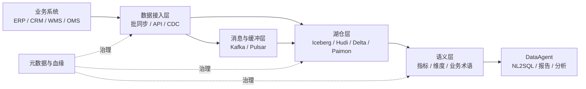
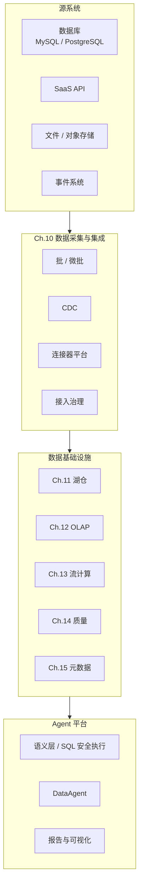
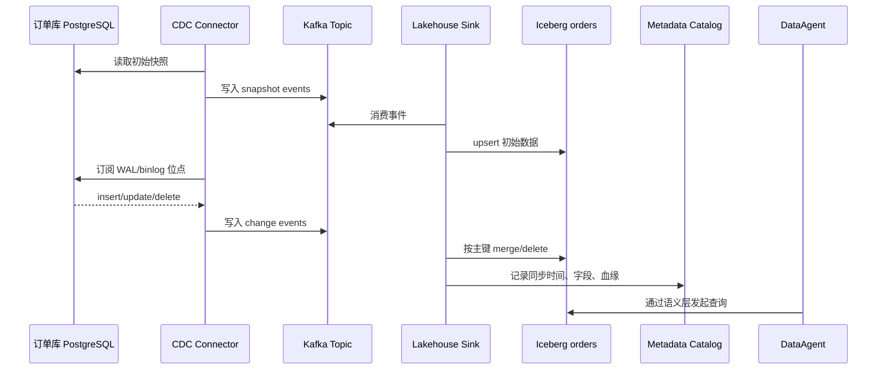
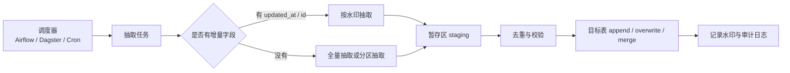
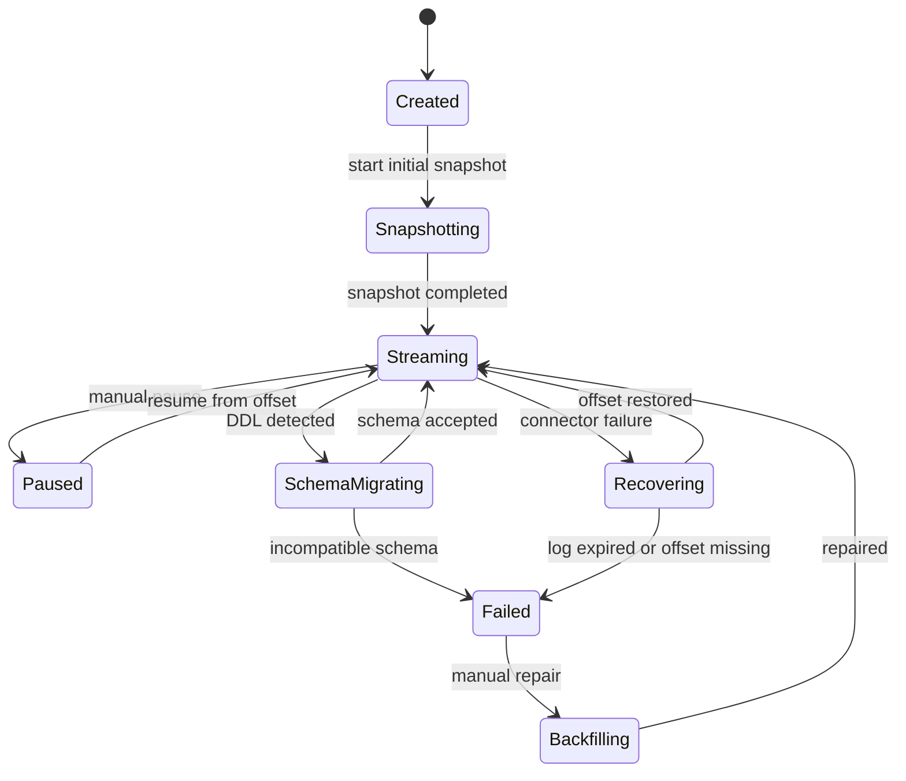
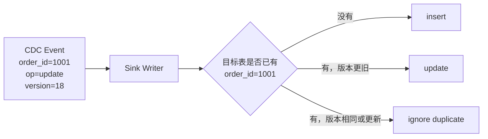
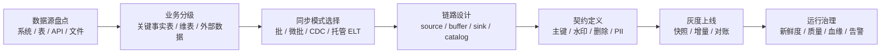
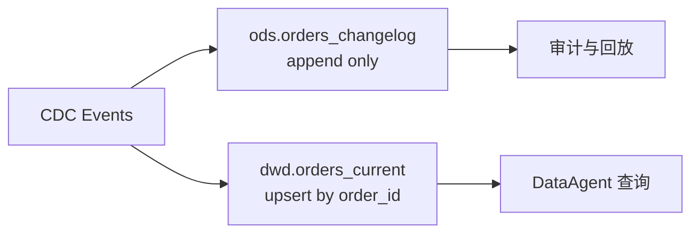

# Ch.10 数据采集与集成：从批同步到 CDC 实时链路

> **本章目标**：读者学完能为企业 Agent 平台设计一条可恢复、可审计、可治理的数据接入链路，并能判断批同步、CDC、Airbyte、Fivetran、Debezium 与 Flink CDC 的适用边界。
> **前置阅读**：Ch.04 平台参考架构总览
> **估计阅读**：L1 20 min / L1+L2 55 min / 全章 100 min
> **本章定位**：数据基础设施层的数据入口设计，服务湖仓、语义层与 DataAgent
> **按角色推荐阅读层**：CTO ⇒ L1+L2 ｜ 架构师 ⇒ L1+L2 ｜ 工程师 ⇒ L1+L2+L3

---

## L1 概念  〔约 30% 篇幅〕

### 1.1 山岚集团的数据入口问题

山岚集团是一家同时经营零售、制造、金融和物流业务的综合企业。它的 Agent 平台需要回答的问题不是单一知识库能覆盖的：库存是否足够、订单是否异常、供应商是否延迟、客户授信是否变化、门店促销是否影响毛利。这些问题背后分别连接着 ERP、CRM、WMS、OMS、财务系统、售后系统、IoT 采集平台和多个历史数据仓库。

如果数据没有稳定进入统一的数据底座，DataAgent 会出现三个典型问题。

第一，回答延迟。业务系统已经发生变化，但湖仓中的数据仍停留在昨天夜间批处理结果，Agent 给出的库存、订单、资金占用信息天然滞后。

第二，回答不一致。报表系统、运营看板和 Agent 查询使用不同的数据副本，口径难以对齐。运营经理在看板里看到的销售额，和 DataAgent 通过 SQL 查询得到的结果可能不同。

第三，无法追责。数据从哪个源系统来、什么时候同步、有没有丢数据、是否经过脱敏、Schema 是否变更，没有完整记录。此时 Agent 即使回答正确，也难以在企业场景中被信任。

因此，本章讨论的不是“如何把数据搬过来”这么简单，而是如何把企业业务数据接入成一条可靠的数据供应链。它是 Ch.11 湖仓、Ch.13 流式计算、Ch.14 数据质量、Ch.15 元数据血缘，以及 Ch.32 到 Ch.37 DataAgent 主线的共同上游。

### 1.2 数据集成的三类目标：同步、复制、摄取

数据集成在工程上通常被拆成三类目标。

| 目标 | 典型问题 | 输出位置 | 对 Agent 平台的意义 |
|---|---|---|---|
| 数据同步 | 源库与目标库如何保持一致 | 数据仓库、湖仓、搜索索引 | 让 Agent 查询到较新的业务状态 |
| 数据复制 | 如何把一个系统的数据副本复制到另一个系统 | 备库、分析库、消息队列 | 降低对源业务库的查询压力 |
| 数据摄取 | 如何把外部数据、文件、API 数据进入平台 | 对象存储、湖表、主题队列 | 扩展 Agent 可使用的数据范围 |

三者经常重叠。比如通过 Debezium 订阅 PostgreSQL WAL 日志，把订单表变更写入 Kafka，再由下游落入 Iceberg 表，这既是同步，也是复制，也是摄取。区别不在于工具名字，而在于企业想要保障什么：一致性、时效性、成本、可治理性，还是可回放能力。

### 1.3 批处理、微批、流式、CDC 的边界

数据接入最常见的误解，是把“实时”与“CDC”直接等同。实际工程里至少有四种模式。

| 模式 | 工作方式 | 典型延迟 | 优势 | 局限 |
|---|---|---:|---|---|
| 批处理 | 按小时、按天或按任务调度抽取 | 分钟到天 | 简单、稳定、成本低 | 新鲜度差，回填窗口大 |
| 微批 | 按较小时间窗口周期抽取 | 秒到分钟 | 易于落地，兼容批处理框架 | 仍可能漏更新或重复处理 |
| 流式 | 持续消费事件或消息 | 毫秒到秒 | 低延迟，天然适合事件驱动 | 状态、乱序、Exactly-once 成本高 |
| CDC | 从数据库日志捕获变更 | 秒级为主 | 不侵入业务代码，保留变更语义 | 依赖源库日志、主键、DDL 管理 |

CDC 是 Change Data Capture，即变更数据捕获。它关注的是数据库中插入、更新、删除这些变化如何被发现并传播。流式计算关注的是事件进入后如何计算、聚合、维持状态和处理乱序。两者可以组合，但不是同一件事。

### 1.4 CDC 的核心概念：日志、位点、快照、增量、事务顺序

多数关系型数据库都会维护事务日志。MySQL 有 binlog，PostgreSQL 有 WAL，SQL Server 有 transaction log。CDC 工具通过读取这些日志，捕获表级别的数据变化。

一个完整 CDC 链路至少包含五个概念。

| 概念 | 含义 | 工程关注点 |
|---|---|---|
| 事务日志 | 数据库记录事务变化的日志 | 日志保留时间、权限、日志格式 |
| 位点 offset | CDC 已消费到的位置 | 必须持久化，失败后从位点恢复 |
| 初始快照 snapshot | 第一次同步已有数据 | 不能拖垮源库，需控制并发和锁 |
| 增量变更 incremental change | 快照之后持续捕获的变更 | 需要按顺序消费并处理删除 |
| 事务顺序 | 同一事务内多条变更的相对顺序 | 决定最终一致性与回放正确性 |

Debezium 官方文档对 CDC 的基本思想有清晰定义：它记录数据库表中每一行级别的变化，并让应用对这些变化做响应。Fivetran 文档也把同步拆成 initial sync、incremental sync 与 rollback sync。Airbyte 文档则从 sync mode 角度描述 Full Refresh、Incremental Append、Incremental Deduped History 等同步模式。Flink CDC 在 2026 年 6 月 3 日确认的最新稳定文档版本为 3.6.0，它把 CDC 连接器放在实时数据集成框架中。

### 1.5 数据集成与 DataAgent 的关系

DataAgent 不是直接查询所有业务库。企业生产环境中，直接让 Agent 访问 ERP、CRM、财务库，通常会带来权限、性能和审计风险。合理路径是让业务数据先进入受治理的数据底座，再由语义层和 SQL 安全执行器暴露给 Agent。



对 DataAgent 来说，数据接入层要提供四类保证。

| 保证 | 说明 | 缺失后的表现 |
|---|---|---|
| 新鲜度 | 数据延迟在业务可接受范围内 | Agent 回答已经过期 |
| 完整性 | 没有漏表、漏字段、漏删除 | Agent 基于残缺数据推理 |
| 可解释性 | 能说明数据来源、同步时间、加工路径 | 回答无法审计 |
| 稳定性 | 源库故障、网络抖动、Schema 变更后可恢复 | Agent 服务间歇性不可用 |

### 1.6 常见误区

**误区一：实时越快越好。**  
很多企业在没有明确业务目标时追求秒级同步，最后把复杂度转嫁给源库、消息队列、湖仓写入和运维团队。库存扣减、风控拦截、欺诈识别可能需要秒级；月度经营分析、供应商结算、历史趋势分析通常不需要。

**误区二：CDC 可以替代所有批处理。**  
CDC 擅长捕获变更，但不擅长处理历史回填、外部文件导入、复杂 API 拉取和低频维表同步。成熟平台一般同时保留批处理、微批和 CDC。

**误区三：买一个连接器工具就完成了数据治理。**  
Airbyte、Fivetran、Debezium 和 Flink CDC 解决的是接入问题，不自动解决字段口径、权限、脱敏、质量规则、血缘、指标一致性。治理能力仍需要 Ch.14 和 Ch.15 中的数据质量、元数据、契约与指标系统支撑。

---

## L2 架构  〔约 40% 篇幅〕

### 2.1 在平台中的位置

数据集成层位于业务系统与数据底座之间。它向上连接不可随意改造的业务源系统，向下服务湖仓、OLAP、流计算、语义层和 Agent 工具。



本章只讨论“数据如何进入平台”。进入之后如何存储、如何实时计算、如何建模、如何评估质量，不在本章展开。

### 2.2 官方视角：Debezium 与 Flink CDC 的链路形态

Debezium 官方文档展示的典型架构，是数据库变更经过 Debezium 连接器进入 Kafka，再被下游应用消费。它适合说明 CDC 在企业平台中的基本位置。


图片来源：[Debezium stable documentation, Architecture](https://debezium.io/documentation/reference/stable/architecture.html)。

Flink CDC 官方文档展示了从 CDC source 到 route、transform、sink 的数据集成链路。它更接近“实时数据管道”的表达方式，适合需要在接入链路中做轻量转换、路由和下游写入的场景。


图片来源：[Apache Flink CDC 3.6.0 documentation](https://nightlies.apache.org/flink/flink-cdc-docs-stable/)。

两张图体现了两种不同的工程重心。

| 工具 | 官方架构重心 | 更适合的企业场景 |
|---|---|---|
| Debezium | 数据库日志捕获与事件发布 | 以 Kafka 为中心构建 CDC 事件总线 |
| Flink CDC | CDC source 到下游 sink 的实时管道 | CDC 同步同时需要转换、路由、状态和多 sink |

### 2.3 典型数据流：业务库到 DataAgent

山岚集团的订单数据接入可以抽象成下面的链路。



这条链路有两个阶段。

第一阶段是初始快照。CDC 工具先把源表已有数据同步到目标端。这个阶段通常最容易影响源库，因为扫描大表会增加 I/O、锁等待和复制槽压力。

第二阶段是增量订阅。快照完成后，CDC 工具从保存的位点继续消费日志，把后续 insert、update 和 delete 传播到下游。

### 2.4 组件划分与接口契约

| 组件 | 职责 | 输入 | 输出 | 失败模式 |
|---|---|---|---|---|
| Source Connector | 连接源系统并抽取数据 | 数据库日志、API、文件 | 规范化事件 | 权限不足、日志过期、API 限流 |
| Offset Store | 保存读取进度 | connector checkpoint | offset / LSN / binlog position | 位点丢失、重复消费 |
| Schema Manager | 管理字段结构变化 | DDL、schema registry | schema version | 字段漂移、类型不兼容 |
| Buffer / Queue | 缓冲变更事件 | CDC event | topic / partition event | 积压、乱序、重复 |
| Sink Writer | 写入目标系统 | 规范化事件 | 湖仓表、OLAP 表 | 幂等失败、写入冲突 |
| Audit Logger | 记录同步过程 | run state、metrics | 审计日志、血缘事件 | 无法追责 |

数据接入层应向下游暴露统一的运行状态契约，而不是让 Agent 直接理解每种连接器的内部细节。

```json
{
  "pipeline_id": "orders-postgres-to-iceberg",
  "source": {
    "type": "postgres",
    "database": "oms",
    "table": "public.orders"
  },
  "destination": {
    "type": "iceberg",
    "table": "dwd.orders"
  },
  "mode": "cdc",
  "state": "running",
  "last_checkpoint": {
    "kind": "lsn",
    "value": "0/16B6C50",
    "committed_at": "2026-06-03T10:20:00+08:00"
  },
  "freshness": {
    "lag_seconds": 8,
    "last_event_time": "2026-06-03T10:19:52+08:00"
  },
  "schema_version": "orders.v7",
  "quality_status": "passed"
}
```

这个契约会被三类下游使用。

| 下游 | 使用方式 |
|---|---|
| 湖仓写入器 | 根据 `mode`、`last_checkpoint` 和 `schema_version` 判断如何落表 |
| 元数据系统 | 记录数据源、血缘、同步新鲜度和 Schema 版本 |
| DataAgent | 在回答中标注数据更新时间，必要时拒绝基于过期数据回答 |

### 2.5 批同步架构：定时抽取、分页、增量字段、水印

批同步仍然是企业数据接入的主力形态。它的核心不在“定时跑脚本”，而在如何定义增量边界。



批同步的关键设计点如下。

| 设计点 | 推荐做法 | 风险 |
|---|---|---|
| 增量字段 | 优先使用单调递增主键或 `updated_at` | `updated_at` 被业务回写时可能漏数据 |
| 分页方式 | 大表使用 keyset pagination | offset pagination 对大表性能差 |
| 水印保存 | 每张表独立保存高水位 | 统一水位会导致局部失败后难恢复 |
| 删除处理 | 使用软删除字段或定期全量对账 | 纯增量无法发现物理删除 |
| 回填策略 | 回填写入独立分区或 staging 表 | 回填与实时增量冲突 |

批同步简单，但不等于低质量。对低频维表、外部 API、财务月结、历史大表回填，批同步往往比 CDC 更可控。

### 2.6 CDC 架构：全量快照、binlog/WAL 订阅、offset 管理、Schema Change

CDC 的生命周期可以用状态机表达。



CDC 架构有四个核心挑战。

| 挑战 | 表现 | 处理策略 |
|---|---|---|
| 初始快照压力 | 大表扫描拖慢业务库 | 限流、分片快照、低峰期执行、只读副本 |
| 位点管理 | 故障后不知道从哪里恢复 | offset store 持久化，恢复前校验日志保留 |
| DDL 变更 | 字段类型变化导致 sink 写入失败 | schema registry、兼容性规则、变更审批 |
| 删除语义 | 下游只 append，无法反映 delete | 明确 tombstone、软删除或 merge-on-read 策略 |

### 2.7 工具分层对比：Debezium、Airbyte、Fivetran、Flink CDC

| 工具 | 类型 | 核心能力 | 优势 | 代价 |
|---|---|---|---|---|
| Debezium | 开源 CDC 平台 | 读取数据库日志，发布变更事件 | CDC 专业、生态成熟、Kafka 集成强 | 需要运维 Kafka Connect 或 Debezium Server |
| Airbyte | 开源数据集成平台 | 大量 source / destination 连接器，同步模式丰富 | 连接器覆盖广，适合 ELT 接入 | 部分连接器质量不一，生产治理需补强 |
| Fivetran | 商业托管 ELT 平台 | 托管连接器、自动同步、Schema 演进 | 运维成本低，适合 SaaS 与数据仓库接入 | 成本与厂商绑定，需要评估数据合规 |
| Flink CDC | 开源实时数据集成框架 | CDC source、pipeline、transform、sink | 适合实时链路和复杂处理 | 需要 Flink 运维能力 |

工具选择要从组织能力出发，而不是从技术偏好出发。

| 企业条件 | 更自然的选择 |
|---|---|
| 已有 Kafka 与 Kafka Connect 团队 | Debezium |
| 需要快速接入多种 SaaS、数据库、文件源 | Airbyte 或 Fivetran |
| 希望减少运维，把连接器交给商业服务 | Fivetran |
| 已有 Flink 平台，需要 CDC 后立即做实时转换 | Flink CDC |
| 只需要低频维表或财务数据同步 | 批同步或 Airbyte |

### 2.8 批 vs 流的决策表

| 方案 | 优势 | 代价 | 适用场景 | 本章建议 |
|---|---|---|---|---|
| 批同步 | 简单、可回填、成本低、易审计 | 延迟较高，删除捕获困难 | 财务、历史报表、低频维表、API 数据 | 默认支持 |
| 微批 | 延迟较低，仍保留批处理可控性 | 水印和重复处理复杂度上升 | 门店库存、订单状态、准实时看板 | 默认支持 |
| CDC 流式 | 秒级新鲜度，保留变更语义 | 运维复杂，依赖日志和主键 | 订单、库存、风控、客服工单 | 作为关键表增强能力 |
| 原生事件流 | 与业务事件天然对齐 | 需要改造业务系统 | 支付、风控、IoT、用户行为 | Ch.13 展开 |

本书建议的默认策略是：先用批同步覆盖 80% 数据接入，再对真正有实时价值的关键事实表引入 CDC。这样可以避免一开始就把所有源系统推入高复杂度链路。

### 2.9 CDC vs API 同步 vs 文件同步的决策表

| 方案 | 优势 | 代价 | 适用场景 | 本章建议 |
|---|---|---|---|---|
| CDC | 低侵入、捕获 insert/update/delete、时效高 | 源库配置要求高，DDL 管理复杂 | 自有数据库核心表 | 订单、库存样例使用 |
| API 同步 | 适合 SaaS，权限边界清晰 | 限流、分页、字段缺失 | CRM、客服、营销平台 | 通过 connector 抽象支持 |
| 文件同步 | 简单、低耦合、适合批量历史数据 | 文件命名、幂等和质量校验复杂 | 财务、供应商、离线导入 | 作为批同步基础路径 |

### 2.10 数据一致性：至少一次、恰好一次、幂等写入、重复消费

企业接入链路最常见的现实选择是“至少一次投递 + 幂等写入”。也就是说，允许同一条事件被消费多次，但 sink 端必须保证重复事件不会改变最终结果。



| 语义 | 含义 | 工程成本 | 适合场景 |
|---|---|---:|---|
| At-most-once | 最多处理一次，可能丢数据 | 低 | 日志类、可容忍丢失 |
| At-least-once | 至少处理一次，可能重复 | 中 | 多数数据集成场景 |
| Exactly-once | 逻辑上只生效一次 | 高 | 金融账务、严格状态计算 |

需要强调的是，Exactly-once 往往是端到端语义，不是某一个工具单独声明就能完成。源端、队列、计算、sink、目标表格式都要共同配合。

### 2.11 失败模式与恢复策略

| 失败模式 | 触发条件 | 业务影响 | 恢复策略 |
|---|---|---|---|
| 日志过期 | Connector 停止太久，binlog/WAL 被清理 | 无法从原 offset 恢复 | 重新快照或从备份回填 |
| 位点丢失 | offset store 损坏或未持久化 | 重复或漏同步 | offset 外部化，恢复前人工校验 |
| Schema 漂移 | 源表新增、删除、改类型 | sink 写入失败或字段错位 | 兼容性检查、DDL 审批、自动迁移白名单 |
| 主键缺失 | 源表没有稳定主键 | upsert 与去重困难 | 定义业务键，或只 append 并定期对账 |
| 大事务积压 | 源库长事务或批量更新 | 下游延迟飙升 | 拆分事务、限流、扩容消费端 |
| API 限流 | SaaS 接口达到速率限制 | 同步窗口拉长 | 指数退避、配额监控、分租户调度 |
| 目标表写入冲突 | 回填与实时写入同时发生 | 目标数据不一致 | 回填隔离分区，完成后原子合并 |

### 2.12 与后续章节的边界

| 章节 | 本章交付给它什么 | 它继续解决什么 |
|---|---|---|
| Ch.11 数据湖与湖仓 | 规范化事件、批数据、upsert/delete 语义 | 表格式、ACID、时间旅行、分区演化 |
| Ch.12 湖仓引擎与 OLAP | 已落地的事实表和维表 | 查询加速、OLAP 建模、引擎选型 |
| Ch.13 流式计算与实时数据 | CDC 事件流、业务事件流 | 状态计算、watermark、窗口、Exactly-once |
| Ch.14 数据编排与质量 | pipeline 状态、同步结果 | 质量规则、调度依赖、数据校验 |
| Ch.15 元数据、血缘、契约与指标 | 数据源、字段、同步时间、schema version | 元数据目录、血缘、Data Contract、指标口径 |

---

## L3 落地实践与治理指南  〔约 30% 篇幅〕

### 3.1 实施路线：从数据盘点到上线验收

本节不再展开某个参考项目的代码实现，而是给出企业落地数据接入链路时可以复用的实施路线。对一本平台工程书来说，这部分的价值在于帮助读者把工具选择、配置策略、数据契约和上线治理串成闭环。



第一步是数据源盘点。平台团队需要识别哪些数据来自自有数据库，哪些来自 SaaS API，哪些来自供应商文件，哪些已经存在于历史数仓。不同来源对应不同接入策略，不能用 CDC 统一解决。

第二步是业务分级。订单、库存、支付、工单这类事实表通常对新鲜度更敏感；门店、商品、组织架构这类维表通常更适合批同步；营销平台、客服平台、广告平台这类 SaaS 数据更适合连接器或托管 ELT。

第三步是上线验收。接入链路上线不以“任务跑起来”为验收标准，而应以行数对账、主键唯一性、删除语义、Schema 兼容性、新鲜度 SLO、血缘登记和告警闭环作为验收标准。

### 3.2 批同步模式：按时间戳增量抽取

下面的代码片段不是要求读者在本书项目中落地实现，而是用伪实现说明批同步的核心控制点：水印、分页、主键合并和状态推进。真实工程中应使用 SQLAlchemy、参数化查询、连接池、审计日志和异常恢复。

```python
from dataclasses import dataclass
from datetime import datetime
from typing import Iterable, Mapping, Protocol


class SourceClient(Protocol):
    def fetch_since(self, table: str, watermark: datetime, limit: int) -> list[Mapping]:
        ...


class SinkClient(Protocol):
    def merge_rows(self, table: str, rows: Iterable[Mapping], key: str) -> None:
        ...


@dataclass
class BatchSyncState:
    table: str
    watermark_column: str
    watermark_value: datetime
    batch_size: int = 5000


def sync_incremental_table(
    source: SourceClient,
    sink: SinkClient,
    state: BatchSyncState,
    primary_key: str,
) -> BatchSyncState:
    rows = source.fetch_since(
        table=state.table,
        watermark=state.watermark_value,
        limit=state.batch_size,
    )
    if not rows:
        return state

    sink.merge_rows(table=state.table, rows=rows, key=primary_key)
    next_watermark = max(row[state.watermark_column] for row in rows)

    return BatchSyncState(
        table=state.table,
        watermark_column=state.watermark_column,
        watermark_value=next_watermark,
        batch_size=state.batch_size,
    )
```

这个实现有一个隐含前提：`watermark_column` 必须可靠。如果业务系统会回写旧时间，或者多个事务使用相同时间戳，就需要增加主键作为二级游标。

### 3.3 CDC 事件模型：把工具差异收敛成统一语义

Debezium、Flink CDC、Airbyte 和 Fivetran 的内部事件格式不同。平台不应该让下游湖仓、语义层和 DataAgent 直接依赖每个工具的原始格式，而应在接入层转换成统一事件语义。

```python
from dataclasses import dataclass
from datetime import datetime
from typing import Any, Literal


Operation = Literal["insert", "update", "delete", "snapshot"]


@dataclass(frozen=True)
class CdcEvent:
    source_system: str
    database: str
    schema: str
    table: str
    primary_key: dict[str, Any]
    operation: Operation
    before: dict[str, Any] | None
    after: dict[str, Any] | None
    source_position: str
    event_time: datetime
    schema_version: str
```

统一事件带来三个好处。

| 好处 | 说明 |
|---|---|
| 工具可替换 | Debezium 切换到 Flink CDC 时，下游 sink 不需要整体重写 |
| 便于审计 | 每条事件都带有 source position 和 schema version |
| 便于 Agent 使用 | DataAgent 可以知道数据最后更新时间和来源 |

### 3.4 Debezium CDC 配置示例

以下配置展示 PostgreSQL 订单表进入 Kafka 的典型 Debezium Connector 形态。参数应以官方文档和实际版本为准。

如果企业不希望直接运行完整 Kafka Connect 集群，也可以考虑 Debezium Server 形态。Debezium 官方架构图展示了它从 source connector 读取变更事件，再通过 sink adapter 写入外部系统的方式；这类形态适合把 CDC 作为独立数据接入服务运行。


图片来源：[Debezium stable documentation, Debezium Server architecture](https://debezium.io/documentation/reference/stable/architecture.html)。

```json
{
  "name": "orders-postgres-connector",
  "config": {
    "connector.class": "io.debezium.connector.postgresql.PostgresConnector",
    "database.hostname": "postgres",
    "database.port": "5432",
    "database.user": "debezium",
    "database.password": "${file:/secrets/db.properties:password}",
    "database.dbname": "oms",
    "topic.prefix": "shanlan.oms",
    "table.include.list": "public.orders,public.order_items",
    "plugin.name": "pgoutput",
    "slot.name": "shanlan_orders_slot",
    "publication.autocreate.mode": "filtered",
    "snapshot.mode": "initial",
    "schema.history.internal.kafka.bootstrap.servers": "kafka:9092",
    "schema.history.internal.kafka.topic": "schema-changes.oms"
  }
}
```

工程上需要特别关注四个参数组。

| 参数组 | 关注点 |
|---|---|
| 数据库连接 | 密码必须走 secret，不写入仓库 |
| 表过滤 | 只同步明确需要的表，避免误摄取敏感表 |
| slot / publication | PostgreSQL 复制槽积压会占用 WAL 空间 |
| schema history | DDL 历史必须持久化，否则恢复困难 |

### 3.5 Airbyte 与 Fivetran 的集成方式

Airbyte 更像连接器平台。它的核心配置是 source、destination、connection 和 sync mode。官方文档把 sync mode 拆成 Full Refresh、Incremental Append、Incremental Deduped History 等模式，适合根据源系统能力选择同步策略。

```yaml
connection:
  name: shopify_orders_to_warehouse
  source: shopify
  destination: iceberg_warehouse
  streams:
    - name: orders
      sync_mode: incremental
      destination_sync_mode: append_dedup
      cursor_field: updated_at
      primary_key:
        - id
```

Fivetran 更像托管 ELT 服务。它的优势是连接器托管、自动 Schema 演进和较少的运维工作。Fivetran 文档把同步过程分成 initial sync、incremental sync 和 rollback sync，这种表达对企业架构师很有用，因为它提示了上线时必须分别考虑首次同步、持续增量和异常恢复。

Fivetran 官方文档中的 Sync History chart 展示了同步运行状态、耗时与数据量。对企业平台来说，这类视图的价值不只是“看起来方便”，而是把接入链路变成可运营对象：同步是否失败、是否被限流重排、是否超出新鲜度 SLO，都能从运行历史里追踪。


图片来源：[Fivetran Sync Overview](https://fivetran.com/docs/core-concepts/syncoverview)。

在企业平台中，不应把 Airbyte 或 Fivetran 的控制面深度耦合进 Agent Runtime。更合理的做法，是把它们视为外部接入系统，通过元数据 API、运行日志或审计事件同步状态。

```yaml
pipelines:
  - id: orders-postgres-cdc
    owner: data-platform
    mode: cdc
    tool: debezium
    freshness_slo_seconds: 60
    destination: dwd.orders
    expose_to_data_agent: true

  - id: crm-contacts-airbyte
    owner: data-platform
    mode: incremental_batch
    tool: airbyte
    freshness_slo_seconds: 3600
    destination: dim.crm_contacts
    expose_to_data_agent: true

  - id: finance-monthly-fivetran
    owner: finance-data
    mode: managed_elt
    tool: fivetran
    freshness_slo_seconds: 86400
    destination: dws.finance_monthly
    expose_to_data_agent: false
```

### 3.6 Flink CDC 的使用边界

Flink CDC 适合在接入时就需要实时加工的链路，例如订单状态变更进入 Kafka 后，需要按门店、渠道、商品品类做实时派生字段，再写入 Paimon 或 Iceberg。

Flink CDC 官方文档用 YAML pipeline 说明了 source、route、transform 与 sink 的配置关系。这个视角比单个连接器配置更接近实时数据管道：源表不只是被复制，还可以在进入目标表之前完成路由和轻量转换。


图片来源：[Apache Flink CDC 3.6.0 documentation](https://nightlies.apache.org/flink/flink-cdc-docs-stable/)。

```yaml
# 示例：Flink CDC pipeline 风格配置，具体字段以 Flink CDC 3.6.0 官方文档为准
source:
  type: postgres
  hostname: postgres
  port: 5432
  username: cdc_user
  password: ${CDC_PASSWORD}
  tables: public.orders,public.order_items

route:
  - source-table: public.orders
    sink-table: dwd.orders
  - source-table: public.order_items
    sink-table: dwd.order_items

sink:
  type: paimon
  warehouse: s3://shanlan-lakehouse/warehouse
```

如果只是把数据库变化搬到 Kafka，Debezium 往往更直接。如果 CDC 后马上要做状态计算、维表关联、窗口聚合或多目标写入，Flink CDC 更自然。

### 3.7 面向 DataAgent 的数据契约

DataAgent 使用的数据表不应只提供字段名。接入层至少要为每张表沉淀一份数据契约。

```yaml
dataset: dwd.orders
description: 山岚集团订单事实表
source_pipeline: orders-postgres-cdc
freshness_slo_seconds: 60
primary_key:
  - order_id
columns:
  - name: order_id
    type: string
    nullable: false
    business_meaning: 订单唯一标识
  - name: customer_id
    type: string
    nullable: false
    business_meaning: 客户唯一标识
  - name: order_status
    type: string
    nullable: false
    business_meaning: 当前订单状态
  - name: updated_at
    type: timestamp
    nullable: false
    business_meaning: 源系统最后更新时间
agent_policy:
  queryable: true
  pii_columns:
    - customer_phone
  require_freshness_check: true
```

这份契约会被 Ch.15 的元数据系统消费，也会被 Ch.34 的 NL2SQL 工程用来做 Schema Linking 和权限过滤。

### 3.8 数据落地策略：append、upsert、delete、软删除

CDC 事件进入湖仓时，最容易出错的是删除语义和重复写入。

| 策略 | 说明 | 适用场景 | 风险 |
|---|---|---|---|
| append | 所有事件追加写入 | 审计日志、行为事件 | 查询时需要取最新版本 |
| upsert | 按主键合并到最新状态表 | 订单、库存、客户状态 | 需要稳定主键和幂等写入 |
| hard delete | 下游删除对应记录 | 法规删除、强一致状态表 | 删除后难追溯 |
| soft delete | 标记 `is_deleted=true` | 大多数分析表 | 查询必须过滤删除标记 |

推荐同时保留两张表。



`ods.orders_changelog` 用于审计和回放，`dwd.orders_current` 用于 Agent 查询。这样既能保证可追溯，又能降低 DataAgent 的查询复杂度。

### 3.9 生产化 checklist

- [ ] 权限：CDC 用户只授予必要库表权限，不使用业务系统管理员账号。
- [ ] 密钥：数据库密码、API token、Fivetran/Airbyte 凭证全部进入 secret 管理。
- [ ] 表范围：使用 allowlist 明确同步表，禁止默认同步全库。
- [ ] 脱敏：PII 字段进入湖仓前或进入语义层前必须脱敏或标注访问策略。
- [ ] 位点：offset、LSN、binlog position、cursor 必须持久化并可审计。
- [ ] 日志保留：源库 binlog/WAL 保留时间大于最大恢复时间目标。
- [ ] 初始快照：大表快照需要限流、分片和业务低峰窗口。
- [ ] Schema 变更：新增字段、删除字段、类型变更要有兼容性规则。
- [ ] 幂等：sink 端必须能处理重复事件。
- [ ] 删除：明确 hard delete、soft delete、tombstone 的处理方式。
- [ ] 回填：历史回填与实时增量隔离，完成后原子合并。
- [ ] 新鲜度：为关键表定义 freshness SLO，并暴露给 DataAgent。
- [ ] 质量：接入完成后运行行数、主键唯一性、非空、枚举值检查。
- [ ] 血缘：记录 source、connector、destination、schema version 和运行时间。
- [ ] 告警：延迟、错误率、积压、同步失败、日志空间占用都要告警。

### 3.10 踩坑记录

**踩坑 1：日志保留不足，Connector 恢复失败。**  
现象：周末 Kafka Connect 停止两天，周一恢复时 Debezium 报告找不到原 binlog/WAL 位点。  
根因：源库日志保留时间小于 Connector 停止时间，offset 指向的日志已经被清理。  
修复：增加日志保留，监控 Connector 停止时长和复制槽积压。恢复时重新快照受影响表，并通过审计表比对行数。

**踩坑 2：全量快照拖慢源库。**  
现象：首次同步订单明细表时，业务系统查询延迟明显升高。  
根因：快照扫描大表，占用源库 I/O 和锁资源。  
修复：改为只读副本执行快照，降低 snapshot 并发，按主键范围分片，并把首次同步安排在低峰期。

**踩坑 3：源表没有主键，upsert 目标表持续重复。**  
现象：目标湖仓表中同一业务记录出现多行，DataAgent 统计订单数偏高。  
根因：源表没有稳定主键，sink writer 无法判断重复事件。  
修复：与业务方确认业务唯一键。如果无法确认，则写入 changelog 表，并在下游建模层通过窗口函数取最新版本。

**踩坑 4：DDL 改类型导致链路中断。**  
现象：业务库把 `order_status` 从整数改成字符串，下游写入失败。  
根因：接入链路没有 Schema 兼容性检查，也没有 DDL 变更通知。  
修复：建立 Schema 变更审批，新增字段自动兼容，删除字段和类型收窄必须人工确认。对 Agent 可查询表增加 schema version 标记。

**踩坑 5：回填任务覆盖实时增量。**  
现象：修复历史数据时，实时订单状态被旧数据覆盖。  
根因：回填任务和 CDC sink 同时写同一张 current 表，没有版本比较。  
修复：回填写入 staging 表，根据源系统更新时间和事件版本做合并，合并期间暂停相关分区的实时写入或使用乐观冲突检测。

---

## 本章小结

### 关键结论

1. 数据集成是企业 Agent 平台的数据入口，不是单纯的 ETL 脚本。它决定了 DataAgent 的新鲜度、可信度和可审计性。
2. 批同步、微批、CDC 和流式各有边界。默认应先用批同步覆盖大多数数据，再为关键事实表引入 CDC。
3. Debezium 适合以 Kafka 为中心的 CDC 事件总线，Flink CDC 适合 CDC 后继续做实时管道处理，Airbyte 适合开源连接器平台，Fivetran 适合托管 ELT。
4. 生产级 CDC 的难点不在启动 Connector，而在初始快照、offset、Schema 变更、删除语义、幂等写入和故障恢复。
5. 面向 DataAgent 的接入链路必须暴露数据契约、新鲜度、血缘和质量状态，否则 Agent 无法判断数据是否值得信任。

### 上线检查清单

- [ ] 能上线吗？关键表已定义同步模式、主键、初始快照策略、日志保留和恢复预案。
- [ ] 能扩展吗？新增 source、destination、schema version 时不需要重写 Agent 工具。
- [ ] 能治理吗？每条链路都有 owner、数据契约、血缘、质量规则、PII 标记和审计日志。
- [ ] 能恢复吗？offset 丢失、日志过期、Schema 漂移、sink 写入失败都有演练过的处理路径。
- [ ] 能服务 Agent 吗？DataAgent 能读取数据更新时间，并能在数据过期或质量失败时拒绝回答。

### 延伸阅读

- Debezium 官方文档：[Architecture](https://debezium.io/documentation/reference/stable/architecture.html)、[Tutorial](https://debezium.io/documentation/reference/stable/tutorial.html)
- Airbyte 官方文档：[Sync modes](https://docs.airbyte.com/platform/using-airbyte/core-concepts/sync-modes)、[Postgres Connector CDC 配置](https://docs.airbyte.com/integrations/sources/postgres)
- Fivetran 官方文档：[Sync Overview](https://fivetran.com/docs/core-concepts/syncoverview)
- Apache Flink CDC 官方文档：[Flink CDC 3.6.0 Stable Documentation](https://nightlies.apache.org/flink/flink-cdc-docs-stable/)
- 相关章节：[Ch.11 数据湖与湖仓](ch11.md)、[Ch.13 流式计算与实时数据](ch13.md)、[Ch.14 数据编排与质量](ch14.md)、[Ch.15 元数据、血缘、契约与指标](ch15.md)、[Ch.34 NL2SQL 工程化](../part06-dataagent/ch34-nl2sql.md)
