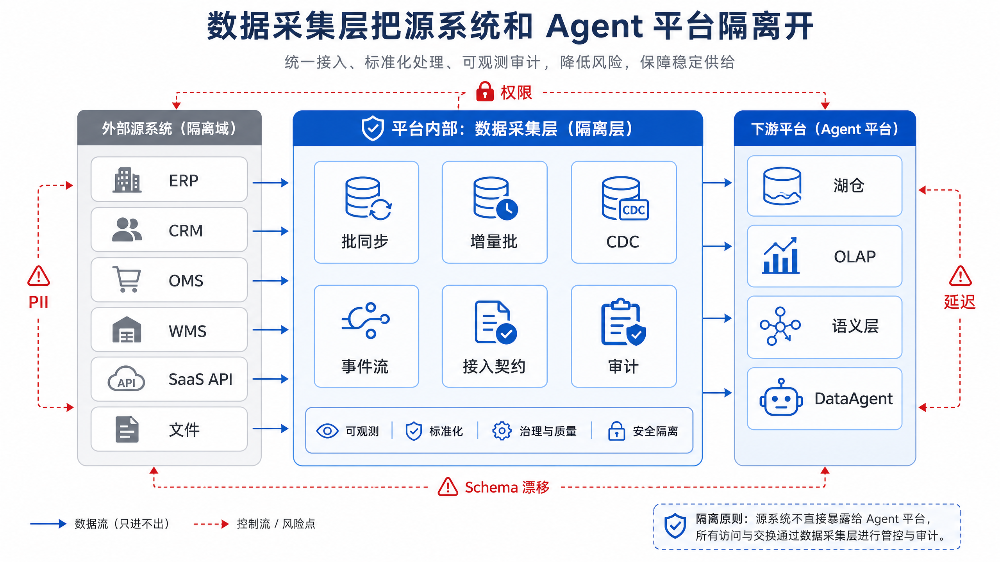
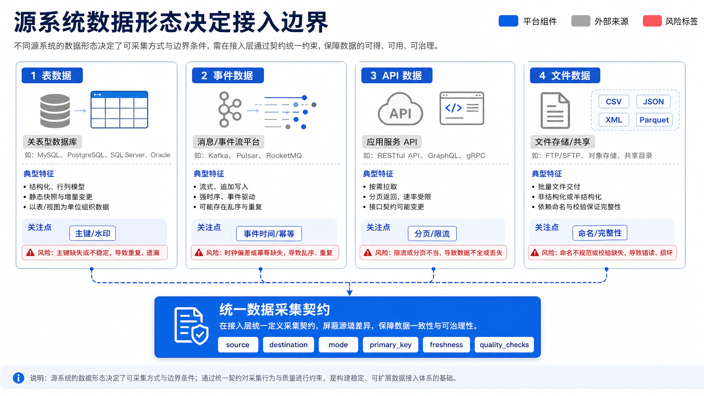
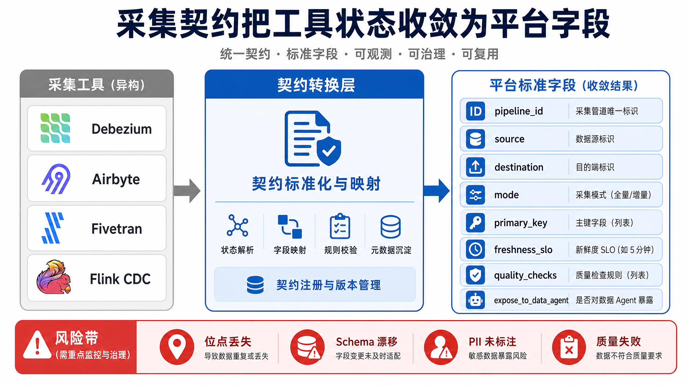

# Ch.10 数据采集与集成

> **本章目标**：读者学完后能为企业 Agent 平台设计一条可恢复、可审计、可治理的数据接入链路，并能用 mini-platform 的最小规则模型生成数据采集契约。
> **前置阅读**：Ch.04 平台参考架构总览 / Ch.11 数据湖与湖仓 / Ch.15 元数据、血缘、契约与指标
> **估计阅读**：L1 15 min / L1+L2 45 min / 全章 90 min
> **mini-platform 关联**：`mini-platform/infra/ingestion/`
> **实战项目**：`mini-platform/projects/10-ingestion-pipeline/`
> **按角色推荐阅读层**：CTO ⇒ L1+L2，判断数据入口的业务价值和风险；架构师 ⇒ L1+L2，重点关注模式选择、接口契约和失败恢复；工程师 ⇒ L1+L2+L3，落地契约、测试和运行命令。

---

## L1 概念  〔约 30% 篇幅〕

### 10.1 数据采集层在企业 Agent 平台中的位置

山岚集团同时经营零售、制造、金融和物流业务。门店订单来自订单管理系统（Order Management System，OMS），库存状态来自仓储管理系统（Warehouse Management System，WMS），客户信息来自客户关系管理系统（Customer Relationship Management，CRM），供应商结算来自企业资源计划系统（Enterprise Resource Planning，ERP），设备质检来自工厂采集平台。DataAgent 要回答“哪些门店正在缺货”“某个供应商延期是否影响毛利”“客户授信变化后还有哪些未履约订单”时，不能直接访问这些生产系统。

生产系统面向交易处理，优先保证短事务、权限隔离和稳定性。Agent 平台面向分析、解释、问答和自动化动作，需要的是可查询、可追溯、可治理的数据副本。因此数据采集层的职责不是简单复制数据，而是把源系统中的业务事实转换成平台可使用的数据产品入口。

这里的关键转变是：源系统中的一条记录，只有在进入平台后带上来源、时间、版本、质量和权限语义，才适合被 Agent 使用。订单库中的 `orders.status` 只是一个字段；进入数据采集层后，它需要被解释为“订单当前履约状态”，需要说明来自哪个系统、同步到哪个位点、是否包含删除、是否允许 DataAgent 查询。没有这一层转换，Agent 即使查到了数据，也无法判断这份数据是否新鲜、完整和可对外解释。

数据采集层也承担“节奏隔离”的作用。生产系统按业务事务节奏变化，湖仓和语义层按分析节奏组织数据，Agent 按用户问题的节奏发起查询。三者节奏不同，若让 Agent 直接访问生产库，分析查询会影响交易系统，字段变化会直接击穿问答链路，权限规则也会分散到多个入口。采集层把这些节奏隔开，使源系统可以继续稳定处理交易，下游可以围绕统一契约消费数据。



图 10-1 的关键不是工具名称，而是边界。源系统只向采集层暴露受控接口；湖仓、OLAP、语义层和 DataAgent 只消费采集层沉淀的契约。这样做可以降低四类风险：直接查询源库导致业务抖动；字段含义变化后 Agent 仍按旧口径回答；权限和个人可识别信息（Personally Identifiable Information，PII）绕过治理；数据延迟或质量失败时无法解释。沿着图从左向右看，读者应关注两条线：一条是数据流，从源系统进入湖仓和分析层；另一条是控制流，从采集契约把权限、质量、新鲜度和血缘约束传给下游。

### 10.2 从业务事件到可分析数据

数据进入平台前通常有四种形态。

| 数据形态 | 典型来源 | 采集关注点 | 对 Agent 的意义 |
|---|---|---|---|
| 表数据 | OMS、WMS、ERP、CRM 数据库 | 主键、水印、删除、字段演化 | 提供订单、库存、客户、结算等结构化事实 |
| 事件数据 | 支付、风控、设备、用户行为 | 事件时间、事件 ID、幂等、重放 | 提供实时上下文和动作触发条件 |
| 应用程序接口（Application Programming Interface，API）数据 | SaaS、广告平台、客服平台 | 分页、限流、增量游标、权限范围 | 扩展外部业务信息，但新鲜度受接口限制 |
| 文件数据 | 供应商、财务、历史归档 | 命名、分区、完整性、重复导入 | 支持低频批量导入和历史回填 |

DataAgent 关心的不是“数据从哪里来”这一层事实，而是这份数据能否被可信地使用。数据采集层需要把源系统差异收敛为统一的契约：数据源、目标表、同步模式、主键、分区、新鲜度、质量检查、血缘和暴露策略。

四种数据形态的差异，本质上是“变化如何被识别”的差异。表数据通常靠主键、水印、更新时间或数据库日志识别变化；事件数据本身就是变化事实，需要处理重复和乱序；API 数据要服从外部接口的分页、限流和游标规则；文件数据则常靠文件名、分区目录、清单文件和校验和判断是否完整。若忽略这种差异，把所有来源都当作“抽一批数据”处理，平台很容易在删除、补数、重复导入和字段漂移上出错。

因此，接入边界不是简单选择一个连接器，而是先回答三个问题。第一，平台拿到的是“当前状态”还是“变化过程”。第二，源系统能否提供稳定的身份标识、时间标识和版本标识。第三，下游需要的是可查询的最新状态、可回放的历史过程，还是低频归档数据。不同答案会直接影响目标表模型、质量检查和失败恢复策略。



图 10-2 表明，数据形态决定采集边界。表数据需要主键、水印和删除语义；事件数据需要事件时间、事件 ID 和幂等；API 数据需要游标、限流和权限范围；文件数据需要命名、分区和完整性检查。读图时不要只看来源分类，还要看每类来源右侧对应的“控制点”：这些控制点决定了数据能否被回放、对账和解释。

### 10.3 批处理、流处理、CDC 与 API 同步的选择模型

采集模式选择不应从工具开始，而应从业务动作开始。山岚集团的月度财务结算只需要稳定、完整、可审计的数据，批处理更合适。门店库存接近售罄时要触发补货提醒，分钟级增量批或变更数据捕获（Change Data Capture，CDC）更合适。支付异常拦截依赖秒级动作，事件流和实时计算更合适。SaaS 营销平台数据通常受 API 限流约束，托管抽取加载转换（Extract Load Transform，ELT）或连接器平台更现实。

一个更可操作的选择方法，是把需求拆成五个维度：新鲜度、完整性、删除语义、回放能力和源系统改造成本。新鲜度决定是天级、小时级、分钟级还是秒级；完整性决定是否需要对账和补数；删除语义决定是否能只追加数据；回放能力决定是否必须保留 changelog；源系统改造成本决定能否要求业务系统主动发事件。只有把这五个维度放在一起，采集模式才不会被“实时”“开源”“托管”等单一标签带偏。

例如，门店库存看似需要实时，但若业务只要求每 10 分钟触发一次补货建议，增量批可能比 CDC 更稳定。订单状态看似也可以按更新时间增量抽取，但若涉及取消、退款和状态回滚，CDC 保留的变化顺序会更有价值。营销 SaaS 数据虽然也有“增量”需求，但平台不能控制外部接口的限流和字段变更，因此托管 ELT 或成熟连接器常常比自研脚本更可维护。

| 模式 | 工作方式 | 优势 | 代价 | 适用场景 | 本书建议 |
|---|---|---|---|---|---|
| 批同步 | 定时全量或分区抽取 | 简单、便宜、易对账 | 延迟高，删除捕获弱 | 财务、历史回填、低频维表 | 默认保留 |
| 增量批 | 按水印或游标周期抽取 | 复杂度适中，新鲜度较好 | 水印可靠性决定正确性 | 门店库存、订单状态准实时同步 | mini-platform 默认可选 |
| CDC | 读取数据库日志传播行级变化 | 低侵入、保留变更语义 | 依赖日志、主键和 DDL 管理 | 订单、库存、工单关键事实表 | 关键表增强 |
| 托管 ELT | 连接器或服务周期同步 | 运维成本低，覆盖 SaaS 多 | 成本、合规和厂商绑定 | CRM、客服、营销平台 | 视组织能力选择 |
| 事件流 | 业务系统主动发送事件 | 低延迟、语义清晰 | 需要业务系统改造 | 支付、风控、设备告警 | Ch.13 展开 |


图 10-3 把采集模式选择收敛到两个问题：业务动作需要多快的新鲜度，源系统能否稳定提供主键、游标或事件语义。先回答这两个问题，再选择批同步、增量批、CDC、托管 ELT 或事件流，能避免从工具偏好反推架构。图中的箭头表达的是决策顺序：先由业务动作确定新鲜度目标，再由源系统能力确定可行路径，最后才落到工具和目标表设计。

### 10.4 常见误区

第一，实时越快越好。低延迟会带来常驻计算、状态恢复、消息积压和运维值班成本。若业务动作只要求小时级新鲜度，把链路压到秒级通常是浪费。判断是否需要实时，应看“迟到的数据是否会导致错误动作”。如果只是报表展示，延迟通常可以被标注和解释；如果是支付拦截、库存冻结或风险止付，延迟才会直接变成业务损失。

第二，CDC 可以替代所有批处理。CDC 擅长捕获数据库行级变化，不擅长外部文件、历史回填、低频维表和受限 API。成熟平台通常同时保留批同步、增量批、CDC 和事件流。更重要的是，CDC 解决“变化怎么来”，不自动解决“历史怎么修”。一旦源表曾经漏同步、字段曾经写错，平台仍需要批量回填和对账能力。

第三，买连接器工具就完成了数据治理。Debezium、Airbyte、Fivetran、Flink CDC 等工具解决接入问题，不自动解决字段口径、PII 脱敏、质量门禁、血缘、权限和指标一致性。连接器能把数据搬到平台，治理则要回答“谁能用、用哪个版本、失败时谁负责、结果能否解释”。这两个问题不能混为一谈。

---

## L2 架构  〔约 40% 篇幅〕

### 10.5 CDC 架构：快照、增量日志、Schema 演化与一致性

CDC 链路通常分成两个阶段。第一阶段是初始快照，把源表已有数据同步到目标端。第二阶段是增量订阅，从数据库事务日志继续读取插入、更新和删除。两个阶段之间必须保存位点，例如 PostgreSQL 的 WAL 日志序列号（Log Sequence Number，LSN）或 MySQL binlog position。

理解 CDC 时，不能把它简单看成“更快的同步”。批同步通常关心某个时间点的最终状态，CDC 关心从一个状态变到另一个状态的过程。这个过程包含插入、更新、删除、事务顺序和源库位点。对 DataAgent 来说，过程信息可以解释“为什么库存从 10 变成 4”“哪一次订单状态回滚导致报表变化”，而不仅是给出一个最新数字。

CDC 的难点在于快照和增量之间不能出现缝隙。若初始快照还没有结束，源表已经产生新变更，平台必须知道这些变更是否已经被快照覆盖、是否还需要从日志重放。成熟链路会在快照开始、快照结束和增量订阅之间保存一致的 source position，并让 sink 端按照主键和版本做幂等写入。否则一次重启就可能造成漏数或重复。


图 10-4 展示 CDC 的两个阶段：先用初始快照建立全量基线，再从日志位点持续订阅增量变化。两个阶段之间的位点保存，是后续断点恢复、重复消费控制和历史对账的前提。沿着图中的时间线看，平台最需要记录三类信息：快照覆盖了哪些主键范围，增量从哪个日志位点开始，目标表提交到了哪个批次。

CDC 的核心挑战有四个。

| 挑战 | 表现 | 处理策略 |
|---|---|---|
| 初始快照压力 | 大表扫描拖慢业务库 | 使用只读副本、低峰期执行、分片快照、限流 |
| 位点恢复 | Connector 故障后不知道从哪里继续 | offset 外部持久化，恢复前校验日志保留窗口 |
| Schema 演化 | 源表新增、删除、改类型 | 建立兼容性规则和变更审批，记录 schema version |
| 删除语义 | 下游只 append，无法反映 delete | 明确 tombstone、软删除或 merge-on-read 策略 |

### 10.6 采集链路的接口契约

平台不应让湖仓写入器、元数据系统和 DataAgent 分别理解每一种连接器的内部状态。采集层应向下游暴露统一接口契约。

契约的作用，是把“工具能做到什么”翻译成“平台承诺什么”。连接器可能记录的是 topic、partition、offset、cursor、job id 或内部 checkpoint；DataAgent 真正需要知道的是这张表来自哪里、多久更新一次、是否有主键、质量是否通过、是否允许查询。没有契约，下游只能猜测数据状态，出了问题也很难定位责任边界。

契约还决定了失败恢复的语言。若契约声明 `primary_key`，sink 端可以做幂等 merge；若声明 `freshness_slo_seconds`，观测系统可以判断是否违反新鲜度目标；若声明 `quality_checks`，编排系统可以在质量失败时阻断暴露给 Agent。也就是说，契约不是文档附件，而是采集链路与治理系统、查询系统之间的机器可读协议。

| 组件 | 职责 | 输入 | 输出 | 失败模式 |
|---|---|---|---|---|
| Source Connector | 连接源系统并抽取数据 | 数据库日志、API、文件、事件 | 规范化记录或事件 | 权限不足、限流、日志过期 |
| Offset Store | 保存读取进度 | connector checkpoint | offset、LSN、cursor | 位点丢失、重复消费 |
| Schema Manager | 管理字段结构变化 | DDL、schema registry | schema version | 字段漂移、类型不兼容 |
| Buffer / Queue | 缓冲变更事件 | CDC event、业务事件 | topic、partition event | 积压、乱序、重复 |
| Sink Writer | 写入目标表 | 规范化事件 | 湖仓表、OLAP 表 | 幂等失败、写入冲突 |
| Audit Logger | 记录运行过程 | run state、metrics | 审计日志、血缘事件 | 无法追责 |

接口契约示例：

```json
{
  "pipeline_id": "orders-postgres-to-iceberg",
  "source": {
    "type": "postgres",
    "database": "oms",
    "table": "public.orders"
  },
  "destination": {
    "type": "iceberg",
    "table": "dwd.orders"
  },
  "mode": "cdc",
  "primary_key": ["order_id"],
  "freshness_slo_seconds": 60,
  "expose_to_data_agent": true,
  "quality_checks": [
    "row_count_reconciliation",
    "primary_key_uniqueness",
    "freshness_slo",
    "schema_compatibility"
  ]
}
```



图 10-5 说明采集契约的价值：把连接器内部状态转成平台统一字段，让湖仓写入器、元数据系统和 DataAgent 看到同一套同步模式、主键、新鲜度、质量检查和暴露策略。图中从左到右的转换，表达的是“工具状态”到“平台语义”的转换：源端细节可以不同，但进入平台后的契约字段必须稳定。

这份契约会被三类下游使用。湖仓写入器根据 `mode`、`primary_key` 和 `quality_checks` 决定 append、merge 或回填；元数据系统记录源表、目标表、Schema 版本和新鲜度；DataAgent 在回答时判断数据是否足够新，必要时拒绝基于过期或质量失败的数据回答。

### 10.7 工具生态对比

工具介绍必须服务于架构取舍。Debezium 更适合以 Kafka 为中心的数据库 CDC 事件总线；Airbyte 更适合作为开源连接器平台；Fivetran 更适合希望降低连接器运维的托管 ELT 场景；Flink CDC 更适合 CDC 后立即进入实时转换、路由和多 sink 的链路。

选择工具时，读者应把工具放回组织能力中评估。平台团队若已经有 Kafka 和流式运维能力，Debezium 或 Flink CDC 的可控性更高；若团队主要目标是快速接入大量 SaaS，Airbyte 或 Fivetran 的连接器覆盖更重要；若数据涉及敏感字段和复杂内网权限，托管服务的合规边界就必须被提前评估。工具没有绝对优劣，只有与链路职责和团队能力是否匹配。

| 工具 | 为什么用 | 不适合什么场景 | 替代方案 | 本书建议 |
|---|---|---|---|---|
| Debezium | 数据库日志捕获成熟，适合核心表 CDC | 不适合大量 SaaS API 和低频文件 | Flink CDC、数据库原生复制 | 用于订单、库存等关键事实表 |
| Airbyte | 连接器覆盖广，自建可控 | 连接器质量和运维需要平台补强 | Fivetran、Meltano、批脚本 | 用于多源快速接入 |
| Fivetran | 托管体验好，减少连接器维护 | 成本、合规和厂商绑定需评估 | Airbyte、自研批同步 | 用于外部 SaaS 和低运维团队 |
| Flink CDC | CDC 后可直接做实时转换和多 sink | 没有 Flink 运维能力时成本高 | Debezium + Sink、Spark 微批 | 用于实时数据管道 |


图 10-6 对比了四类连接器工具的边界。Debezium 更像数据库日志事件源，Airbyte 更像自建连接器平台，Fivetran 更像托管 ELT 服务，Flink CDC 更适合把 CDC 与实时计算放在同一条链路中。图中的“工具职责”应与前文契约字段一起理解：无论底层选择哪个工具，进入平台后都要产出同样的 source、destination、mode、freshness 和 quality 信息。

### 10.8 面向 DataAgent 的新鲜度、延迟、成本与可靠性取舍

DataAgent 的新鲜度需求容易被误解为“越实时越智能”。实际情况是，Agent 更需要“知道自己基于什么时间点的数据回答”。如果平台能明确告诉 Agent 数据截至 10 分钟前，Agent 可以在回答中说明限制；如果平台给出秒级链路但经常重复、乱序或质量失败，Agent 反而更容易生成看似精确但不可追责的结论。

因此，本节的取舍不是在“慢”和“快”之间选边，而是在业务价值、恢复复杂度和解释能力之间找平衡。关键事实表可以承受更高链路成本，低频维表不应被强行实时化；敏感数据应优先选择可控链路，低敏外部数据可以用托管连接器加速接入。

**取舍一：批同步 vs CDC**

| 方案 | 优势 | 代价 | 适用场景 | 本书建议 |
|---|---|---|---|---|
| 批同步 | 成本低、对账简单、故障恢复直观 | 新鲜度差，删除捕获弱 | 财务、维表、历史回填 | 作为默认基础能力 |
| CDC | 新鲜度好，保留 insert/update/delete 语义 | 依赖日志、主键、Schema 管理和值班 | 订单、库存、工单关键事实表 | 只给高价值表启用 |

**取舍二：自建连接器 vs 托管 ELT**

| 方案 | 优势 | 代价 | 适用场景 | 本书建议 |
|---|---|---|---|---|
| 自建连接器 | 可控、可审计、可贴合内部治理 | 需要维护连接器、调度和告警 | 核心系统、敏感数据、复杂权限 | 平台团队掌握核心链路 |
| 托管 ELT | 接入快、运维少、SaaS 支持多 | 成本、合规和厂商锁定 | 外部系统、低敏数据、连接器标准化场景 | 作为补充路径 |


图 10-7 强调采集技术取舍不能只看延迟。对 DataAgent 来说，新鲜度、成本、故障恢复、审计能力和组织运维能力都应同时进入决策，否则低延迟链路可能变成高成本且难恢复的生产负担。读图时可以把每条链路都放到同一个问题下检验：如果今天凌晨失败，明天上午能否解释影响范围并补回正确数据。

### 10.9 失败模式：重复、乱序、断点续传、字段漂移与补数

| 失败模式 | 触发条件 | 影响 | 检测方式 | 恢复策略 |
|---|---|---|---|---|
| 日志过期 | Connector 停止时间超过源库日志保留 | 无法从原位点恢复 | 监控复制槽积压、binlog/WAL 保留 | 重新快照受影响表并对账 |
| 重复消费 | at-least-once 投递或恢复重放 | 指标偏高、重复记录 | 主键唯一性检查、事件版本检查 | sink 端幂等 merge，保留 changelog |
| 乱序到达 | 网络抖动、跨分区消费、大事务 | 当前状态被旧事件覆盖 | 事件时间与版本监控 | 按版本号或 source position 比较后更新 |
| 字段漂移 | 源系统新增、删除、改类型 | 写入失败或字段错位 | Schema diff、兼容性检查 | 自动兼容新增字段，破坏性变更人工审批 |
| 回填覆盖实时 | 历史修复与 CDC 同写 current 表 | 最新状态被旧数据覆盖 | 写入批次审计、更新时间比较 | 回填写 staging，按版本原子合并 |

这些失败模式有一个共同点：它们通常不会在链路刚上线时暴露，而是在重启、回填、字段变更和流量高峰时出现。平台不能只监控“任务是否成功”，还要监控“产出的数据是否仍然可信”。例如，同步任务成功结束但主键重复，DataAgent 统计会偏高；CDC 仍在运行但日志位点落后，回答会滞后；Schema 自动兼容新增字段但语义没有登记，Agent 可能误用字段。


图 10-8 表示一个实用原则：同一条采集链路应同时保留 append-only 的变更日志表和面向查询的 current 表。变更日志表用于审计、回放和故障修复；current 表用于 DataAgent 查询最新业务状态。只保留 current 表会降低追溯能力，只保留 changelog 表会把查询复杂度转嫁给下游。图中两张表不是重复建设，而是分别服务“解释过去”和“查询现在”两个目标。

---

## L3 工程实现  〔约 30% 篇幅〕

### 10.10 mini-platform 实现：采集配置、落地表与最小可运行链路

本章的 mini-platform 实现不连接真实数据库或 Kafka，而是把采集模式选择和 DataAgent 可读契约固化为可测试代码。这样做的原因是：企业平台在接入真实工具前，必须先统一“什么样的数据可以暴露给 Agent”这一层语义。

这段实现刻意从规则模型开始，而不是从连接器客户端开始。真实连接器会引入网络、权限、数据库版本和运行环境差异，容易让初学者把注意力放在工具参数上。mini-platform 先把“源类型、新鲜度、主键、水印、暴露策略”建模清楚，使读者看到平台最小闭环：需求输入、模式选择、契约输出、测试验证。

- 入口：`mini-platform/infra/ingestion/__init__.py`
- 核心实现：`mini-platform/infra/ingestion/pipeline_contract.py`
- 测试：`mini-platform/tests/test_ingestion_pipeline_contract.py`
- 实战项目：`mini-platform/projects/10-ingestion-pipeline/run.py`


图 10-9 对应本章 mini-platform 的最小闭环：输入源系统类型、新鲜度、主键和目标表信息，规则模型选择采集模式与工具，再生成 DataAgent 可读的数据采集契约。

`mini-platform/infra/ingestion/pipeline_contract.py`：

```python
class SourceKind(str, Enum):
    DATABASE = "database"
    SAAS_API = "saas_api"
    FILE = "file"
    EVENT_STREAM = "event_stream"


class IngestionMode(str, Enum):
    BATCH = "batch"
    INCREMENTAL_BATCH = "incremental_batch"
    CDC = "cdc"
    MANAGED_ELT = "managed_elt"
    EVENT_STREAM = "event_stream"
```

同一文件中的 `plan_ingestion_pipeline` 根据源类型、新鲜度、主键和水印做第一轮模式选择。下面是核心分支的节选：

```python
def plan_ingestion_pipeline(request: dict[str, Any]) -> PipelineDecision:
    source_kind = SourceKind(request["source_kind"])
    freshness = int(request.get("freshness_slo_seconds", 86_400))
    has_primary_key = bool(request.get("has_primary_key", False))

    if source_kind is SourceKind.DATABASE and freshness <= 300 and has_primary_key:
        return PipelineDecision(
            mode=IngestionMode.CDC,
            tool="Debezium",
            reason="数据库关键事实表需要分钟级新鲜度，且具备稳定主键。",
            freshness_slo_seconds=freshness,
            requires_primary_key=True,
            requires_watermark=False,
        )
```

`build_pipeline_contract` 把规则决策转换为下游可消费的契约：

```python
def build_pipeline_contract(request: dict[str, Any]) -> PipelineContract:
    decision = plan_ingestion_pipeline(request)
    primary_key = tuple(request.get("primary_key", ()))
    quality_checks = (
        "row_count_reconciliation",
        "primary_key_uniqueness" if primary_key else "source_file_completeness",
        "freshness_slo",
        "schema_compatibility",
    )

    return PipelineContract(
        pipeline_id=request["pipeline_id"],
        source=request["source"],
        destination=request["destination"],
        mode=decision.mode,
        primary_key=primary_key,
        freshness_slo_seconds=decision.freshness_slo_seconds,
        expose_to_data_agent=bool(request.get("expose_to_data_agent", False)),
        quality_checks=quality_checks,
    )
```

运行测试：

```bash
cd enterprise_agent_platform_book/mini-platform
python3 -m pytest tests/test_ingestion_pipeline_contract.py -q
```

运行项目：

```bash
cd enterprise_agent_platform_book/mini-platform/projects/10-ingestion-pipeline
PYTHONPATH=../.. python3 run.py
```

预期输出：

```text
orders-postgres-to-iceberg -> cdc
tool=Debezium freshness=60s
checks=row_count_reconciliation,primary_key_uniqueness,freshness_slo,schema_compatibility
```

这段输出对应图 10-9 的最小闭环：输入是山岚集团订单表采集需求，规则选择 CDC 和 Debezium，输出是 DataAgent 可读的数据契约。真实生产系统还需要把这份契约写入 Ch.15 的元数据系统，并把运行状态、血缘、质量检查和告警接入 Ch.14 的编排与质量平台。

### 10.11 生产化 checklist

- [ ] 权限：CDC 用户、API token 和文件读取账号只授予必要范围。
- [ ] 密钥：所有凭证进入 secret 管理，不写入仓库、配置样例或日志。
- [ ] 表范围：使用 allowlist 明确同步表，禁止默认同步全库。
- [ ] PII：敏感字段进入湖仓前或进入语义层前必须标注、脱敏或策略过滤。
- [ ] 位点：offset、LSN、binlog position 和 API cursor 必须持久化并可审计。
- [ ] 日志保留：源库日志保留时间大于最大恢复窗口。
- [ ] 快照：大表初始快照需要限流、分片和低峰窗口。
- [ ] Schema：新增字段、删除字段、类型变更要有兼容性规则。
- [ ] 幂等：sink 端必须处理重复事件，不允许重复消费直接影响指标。
- [ ] 回填：历史回填写入 staging，完成后按版本原子合并。
- [ ] 新鲜度：关键表定义 freshness SLO，并暴露给 DataAgent。
- [ ] 质量：行数、主键唯一性、非空、枚举值和 Schema 兼容性检查必须自动运行。
- [ ] 血缘：记录 source、connector、destination、schema version 和运行时间。
- [ ] 告警：延迟、错误率、积压、同步失败、日志空间占用都要告警。

### 10.12 真实踩坑记录

**踩坑 1：日志保留不足，Connector 恢复失败。**

- 现象：周末 CDC Connector 停止两天，周一恢复时找不到原 binlog/WAL 位点。
- 根因：源库日志保留时间小于停止时间，offset 指向的日志已经被清理。
- 修复：增加日志保留，监控停止时长和复制槽积压；恢复时重新快照受影响表，并通过 changelog 与 current 表对账。

**踩坑 2：全量快照拖慢源库。**

- 现象：首次同步订单明细表时，业务系统查询延迟明显升高。
- 根因：快照扫描大表，占用源库 I/O 和锁资源。
- 修复：改为只读副本执行快照，降低并发，按主键范围分片，把首次同步安排在低峰期。

**踩坑 3：源表没有主键，upsert 目标表持续重复。**

- 现象：目标湖仓表中同一业务记录出现多行，DataAgent 统计订单数偏高。
- 根因：源表没有稳定主键，sink writer 无法判断重复事件。
- 修复：与业务方确认业务唯一键；无法确认时写入 changelog 表，并在下游建模层通过窗口函数取最新版本。

**踩坑 4：回填任务覆盖实时增量。**

- 现象：修复历史订单时，实时订单状态被旧数据覆盖。
- 根因：回填任务和 CDC sink 同时写 current 表，没有版本比较。
- 修复：回填写入 staging 表，根据源系统更新时间和 source position 做合并，合并期间暂停相关分区或使用冲突检测。

---

## 本章小结

### 关键结论

1. 数据采集层是企业 Agent 平台的数据入口，决定 DataAgent 的新鲜度、可信度和可审计性。
2. 批同步、增量批、CDC、托管 ELT 和事件流各有边界，不能用一个工具覆盖所有来源。
3. 采集链路必须暴露统一契约，包括源、目标、模式、主键、新鲜度、质量检查和 Agent 暴露策略。
4. 生产级 CDC 的难点在快照、位点、Schema 演化、删除语义、幂等写入和回填恢复。
5. mini-platform 的最小实现先固化规则和契约，真实连接器接入应在这个契约之后发生。

### 上线检查清单

- [ ] 能上线吗？关键表已定义同步模式、主键、快照策略、日志保留和恢复预案。
- [ ] 能扩展吗？新增 source、destination、schema version 时不需要重写 Agent 工具。
- [ ] 能治理吗？每条链路都有 owner、数据契约、血缘、质量规则、PII 标记和审计日志。
- [ ] 能恢复吗？offset 丢失、日志过期、Schema 漂移、sink 写入失败都有演练过的处理路径。
- [ ] 能服务 Agent 吗？DataAgent 能读取数据更新时间，并能在数据过期或质量失败时拒绝回答。

### 延伸阅读

- 官方文档：[Debezium Documentation](https://debezium.io/documentation/)
- 官方文档：[Airbyte Documentation](https://docs.airbyte.com/)
- 官方文档：[Fivetran Documentation](https://fivetran.com/docs)
- 官方文档：[Apache Flink CDC Documentation](https://nightlies.apache.org/flink/flink-cdc-docs-stable/)
- 对标项目：Debezium、Airbyte、Fivetran、Apache Flink CDC
- 相关章节：[Ch.11 数据湖与湖仓](ch11.md)、[Ch.13 流式计算与实时数据](ch13.md)、[Ch.14 数据编排与质量](ch14.md)、[Ch.15 元数据、血缘、契约与指标](ch15.md)、[Ch.34 NL2SQL 工程化](../part06-dataagent/ch34-nl2sql.md)
