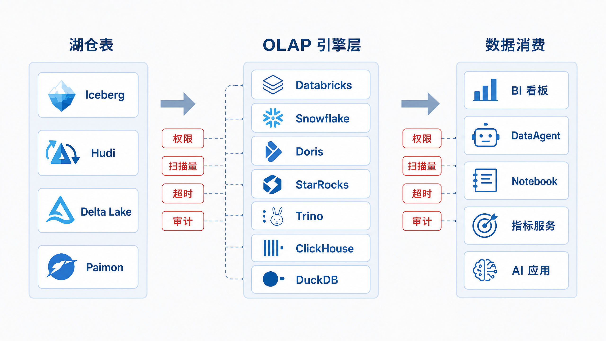
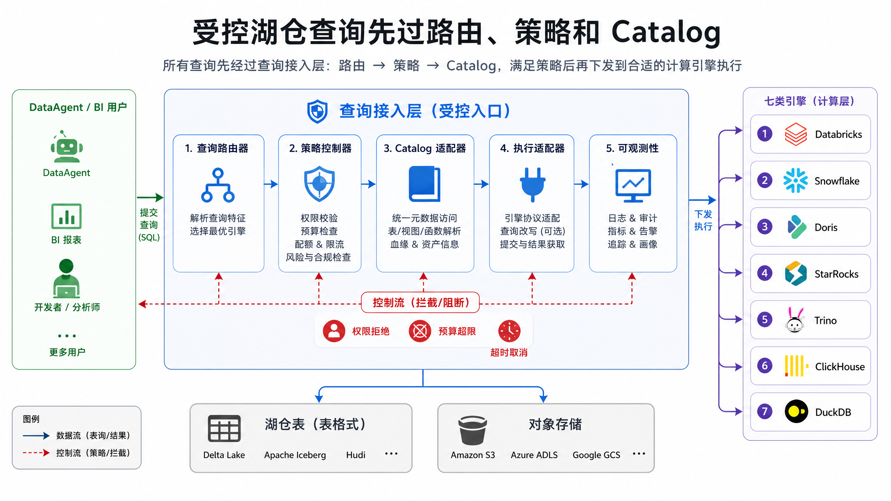
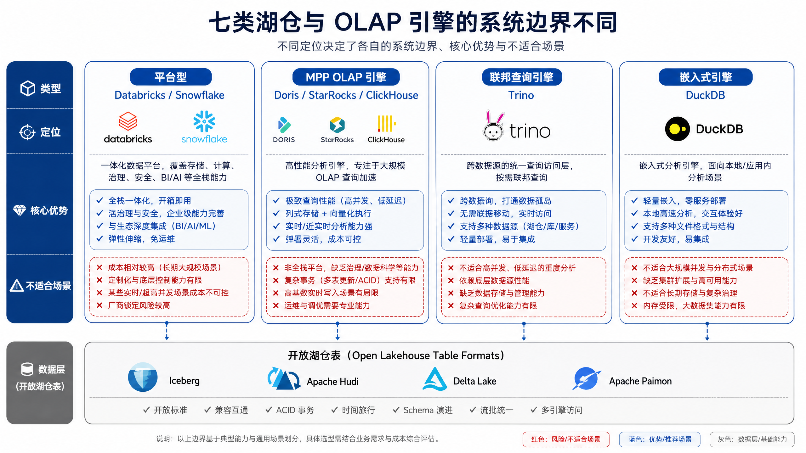
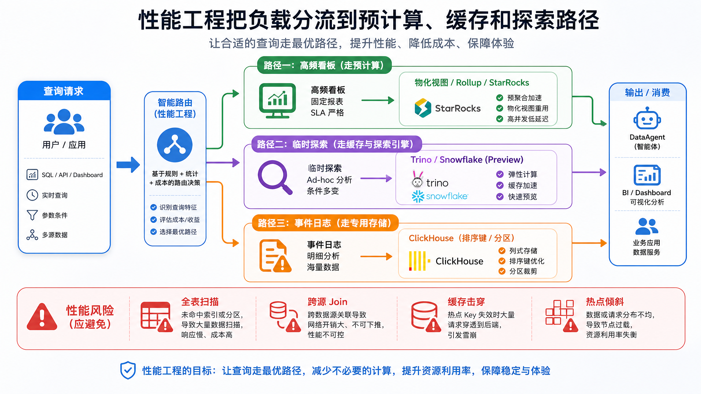
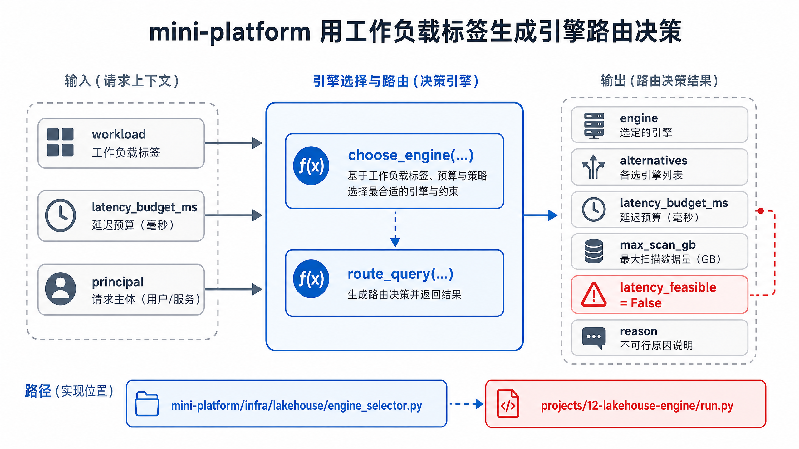

# Ch.12 湖仓引擎与 OLAP

> **本章目标**：读者学完后能基于业务负载、开放性、延迟、治理和成本要求，为企业湖仓选择合适的查询与分析引擎，并能用 mini-platform 的规则模型实现第一版引擎路由。
> **前置阅读**：Ch.10 数据采集与集成 / Ch.11 数据湖与湖仓 / Ch.15 元数据、血缘、契约与指标
> **估计阅读**：L1 15 min / L1+L2 45 min / 全章 90 min
> **mini-platform 关联**：`mini-platform/infra/lakehouse/`
> **实战项目**：`mini-platform/projects/12-lakehouse-engine/`
> **按角色推荐阅读层**：CTO ⇒ L1+L2，判断引擎组合的成本和组织边界；架构师 ⇒ L1+L2，重点关注路由、权限、状态和失败恢复；工程师 ⇒ L1+L2+L3，落地规则模型、测试和运行命令。

---

## L1 概念  〔约 30% 篇幅〕

### 12.1 OLAP 引擎在 DataAgent 分析执行链路中的角色

Ch.11 解决湖仓表如何可靠保存，Ch.12 解决这些表如何被查询、分析和服务。山岚集团的数据已经通过采集链路进入湖仓，订单、库存、会员、工单和设备数据以开放表格式管理。但业务问题并不都适合同一个计算系统。财务看板要求稳定秒级返回，运营团队要高并发查询当天销售，数据科学家要在 Notebook 中读抽样文件，DataAgent 需要跨 MySQL、Iceberg 和指标层做探索。

在线分析处理（Online Analytical Processing，OLAP）引擎的职责是面向大范围扫描、过滤、聚合、Join、排序和窗口函数做优化。它不同于在线事务处理（Online Transaction Processing，OLTP）数据库，后者服务短事务、点查、行级更新和高并发写入。Agent 平台若直接把复杂分析压到 OLTP 源库，会影响生产系统；若只把所有分析交给一个通用引擎，又会在延迟、成本或治理上付出代价。

OLAP 引擎可以理解为湖仓表和业务消费之间的“计算适配层”。湖仓保存数据资产，但用户需要的是指标、报表、探索结果和可解释 SQL 输出。不同消费方式对计算适配层的要求不同：看板要求稳定低延迟，临时分析要求灵活 SQL，事件分析要求高吞吐写入和时间过滤，本地探索要求低成本和易嵌入。若没有这层区分，平台会把所有查询塞进同一个系统，最后要么慢查询拖垮看板，要么为了低延迟报表牺牲探索灵活性。

对 DataAgent 来说，OLAP 引擎还承担“可控执行”的职责。Agent 生成查询后，平台需要选择合适引擎、限制扫描量、应用权限策略、设置超时、记录审计并返回可解释错误。引擎不是被动数据库，而是 Agent 分析链路中的执行边界。



图 12-1 展示了“同一份湖仓资产，多种消费方式”。DataAgent 的临时探索可以走 Trino，固定经营看板可以走 StarRocks 或 Doris，日志与事件分析可以走 ClickHouse，统一数据工程和机器学习可以走 Databricks，云数仓标准报表可以走 Snowflake，本地抽样验证可以走 DuckDB。关键不是多装几个引擎，而是用统一入口控制路由、权限、成本和审计。沿着图从湖仓到消费端看，读者应关注两个问题：哪类工作负载走哪条路径，以及这些路径是否仍被统一治理。

### 12.2 企业分析负载分类

引擎选型应从负载分类开始。

负载分类比产品名称更重要，因为同一个 SQL 引擎在不同负载下表现可能完全不同。即席查询重视灵活连接和容错，固定仪表盘重视并发和稳定延迟，指标查询重视口径一致和可缓存，联邦查询重视连接器能力，本地探索重视单机效率和易用性，事件分析重视时间过滤和写入吞吐。先分清负载，平台才能给每类查询设置不同的延迟目标、预算、权限和降级策略。

| 负载 | 典型问题 | 延迟目标 | 更自然的引擎方向 |
|---|---|---:|---|
| 即席查询 | “这个异常门店还能关联哪些供应商？” | 秒到分钟 | Trino、Databricks、Snowflake |
| 仪表盘 | “今日门店销售额按城市刷新” | 亚秒到数秒 | StarRocks、Doris、ClickHouse、Snowflake |
| 指标查询 | “同店同比、复购率、支付成功率” | 稳定秒级 | 物化视图、指标层、实时 OLAP |
| 联邦查询 | “湖仓订单 join MySQL 促销配置” | 秒到分钟 | Trino、Databricks federation |
| 本地探索 | “抽样 Parquet 验证口径” | 单机交互式 | DuckDB |
| 事件分析 | “最近 5 分钟点击流异常” | 秒级 | ClickHouse、StarRocks、Doris |


图 12-2 表明，引擎选型应先识别负载类型。即席查询、仪表盘、指标查询、联邦查询、本地探索和事件分析对延迟、并发、成本和治理的要求不同，因此自然会落到不同的候选引擎组合。图中的候选项不是固定答案，而是提示读者先把“查询为什么存在”讲清楚，再选择执行系统。

### 12.3 OLAP 核心机制

现代 OLAP 引擎通常围绕六类机制优化：列式存储只读必要列；编码和压缩减少 I/O；向量化执行批量处理数据；大规模并行处理（Massively Parallel Processing，MPP）把任务拆到多节点；优化器基于统计信息选择计划；缓存和物化视图减少重复计算。

这些机制共同解决一个问题：如何用可接受的成本扫描大量数据并快速得到聚合结果。列式存储让查询只读 `city` 和 `amount` 这样的必要列，而不是整行订单；压缩和编码减少磁盘与网络传输；向量化执行让 CPU 一批一批处理数据；MPP 把扫描和聚合拆到多个节点；优化器决定先过滤还是先 Join；缓存和物化视图则避免重复计算。读者理解这些机制后，才能判断慢查询到底是数据布局问题、统计信息问题、Join 计划问题，还是资源隔离问题。


图 12-3 中最容易被忽略的是优化器和数据布局。若没有统计信息，引擎可能选择错误 Join 顺序；若分区和排序键不匹配查询条件，再强的向量化执行也会变成大范围扫描。Ch.11 的表格式、分区、文件大小和快照管理，会直接影响本章的查询成本。沿着图看，一次查询并不是直接“读数据”，而是先解析、优化、拆分、调度，再扫描和聚合；任何一步缺少输入信息，都会把成本放大到后续阶段。

### 12.4 常见误区

第一，有湖仓表格式就不需要 OLAP 引擎。表格式解决数据资产开放性，查询性能仍取决于执行引擎、数据布局、统计信息、缓存和并发控制。表格式回答“读哪些文件才一致”，OLAP 引擎回答“如何高效读并计算这些文件”，两者解决的是不同层的问题。

第二，所有分析场景都应统一到一个引擎。统一能降低治理复杂度，但会牺牲特定负载的成本或延迟。更现实的做法是统一元数据、权限和审计，允许多个引擎围绕同一份数据协同。这里的统一对象应是控制平面，而不是强行统一执行引擎。

第三，选型只看基准测试排行榜。基准测试不能替代对真实数据分布、真实 SQL、并发、写入模式、权限模型、成本和团队运维能力的评估。一个引擎在标准测试上很快，不代表它适合山岚集团的权限模型、数据倾斜、冷热分层和 Agent 查询模式。

---

## L2 架构  〔约 40% 篇幅〕

### 12.5 湖仓查询路径：Catalog、开放表格式、对象存储与计算引擎协作

一次受控湖仓查询通常经过五个步骤：用户或 DataAgent 提交查询意图；查询路由器选择引擎；策略控制器校验权限、预算和超时；Catalog 适配器解析表、快照和连接信息；执行适配器提交到具体引擎并返回结果句柄。

这个路径的核心思想是“先控制，再执行”。DataAgent 生成的 SQL 只是查询意图的一种表达，还不能直接提交给底层引擎。平台必须先判断查询适合哪类负载，用户是否有权限，是否超过扫描预算，是否需要固定快照，是否应读取脱敏视图。只有这些判断完成后，执行适配器才把查询交给 Trino、StarRocks、Snowflake 或其他引擎。



图 12-4 展示受控查询入口的基本路径。用户或 DataAgent 的查询意图先经过路由和策略校验，再通过 Catalog 解析表、快照和连接信息，最后才提交给具体执行引擎。图中路由、策略和 Catalog 位于引擎之前，说明治理不是查询完成后的审计补丁，而是执行前必须经过的控制点。

平台不建议让 DataAgent、BI 工具或业务系统直接裸连所有引擎。裸连会带来三个问题：权限口径不一致，成本无法归因，失败无法解释。统一接入层不一定是重型网关，也可以先从规则路由和审计记录开始。对早期平台来说，先记录工作负载标签、选择引擎、用户身份、快照和错误码，就已经能显著提升可解释性。

### 12.6 引擎生态对比

| 类型 | 代表产品 | 为什么用 | 不适合什么场景 | 替代方案 |
|---|---|---|---|---|
| 平台型湖仓 | Databricks | 数据工程、SQL、机器学习和治理一体化 | 只服务单一低延迟看板时成本较高 | Snowflake、Doris/StarRocks + Spark |
| 云原生数仓 | Snowflake | SQL 数仓、弹性 warehouse、低运维 | 极低延迟事件分析或强本地化部署 | Databricks、ClickHouse、Doris |
| 实时 OLAP | Doris、StarRocks | 高并发报表、物化视图、MySQL 生态 | 任意跨源探索和重型数据工程 | Trino、Databricks、Snowflake |
| 事件分析 | ClickHouse | 日志、事件、时序和大宽表聚合 | 表设计不明确或频繁更新的强事务表 | StarRocks、Doris |
| 联邦查询 | Trino | 多源连接、开放湖仓入口 | 高频固定报表和高成本跨源 Join | 预建数据集、物化视图 |
| 嵌入式分析 | DuckDB | 本地文件、Notebook、轻量 ETL | 多租户、高并发、集群级治理 | Trino、Spark、本地服务化引擎 |

这张表不应被理解为“产品排名”。Databricks 和 Snowflake 更像平台或托管服务，能覆盖较宽的治理和工程场景；Doris、StarRocks、ClickHouse 更偏向低延迟服务化分析；Trino 的价值在开放连接和联邦查询；DuckDB 的价值在本地与嵌入式。企业常见做法不是选一个赢家，而是先确定主路径，再给特殊负载保留合适工具。



图 12-5 的重点是系统边界。Databricks、Snowflake、Doris、StarRocks、ClickHouse、Trino 和 DuckDB 都能服务分析，但它们分别偏向平台化、托管数仓、实时服务、事件分析、联邦查询或本地探索。读图时要特别看每类引擎“负责到哪里”：有的包含治理和工程平台，有的主要负责执行，有的适合嵌入在本地进程中。

这张图的含义是先确定系统边界，再比较产品能力。Databricks 和 Snowflake 偏平台化或托管体验；Doris、StarRocks、ClickHouse 偏低延迟服务化分析；Trino 偏连接器和联邦查询；DuckDB 偏单机本地分析。同一张 Iceberg 表可以被多个引擎读取，但每条访问路径都需要不同的 SLA、预算和运维 playbook。

### 12.7 SQL 方言、权限模型、资源组与多租户隔离

多引擎协同时，平台最容易低估的是非性能问题。SQL 方言差异会导致 DataAgent 生成的语句在一个引擎可运行、另一个引擎失败；权限模型差异会导致同一用户在不同入口看到不同列；资源组和 warehouse 配置差异会导致成本和并发不可控。

这也是为什么路由器不能只返回一个引擎名称。它还需要知道查询属于什么工作负载、使用哪套 SQL 方言、允许访问哪些表和列、扫描预算是多少、失败时能否换引擎。对 DataAgent 来说，方言差异尤其重要：同一个日期函数、JSON 函数或近似聚合函数，在不同引擎中的语法和语义可能不同。平台要么在生成 SQL 前绑定方言，要么在提交前做语法转换和校验。

| 组件 | 职责 | 输入 | 输出 | 失败模式 |
|---|---|---|---|---|
| 查询路由器 | 根据工作负载、数据位置、延迟和预算选择引擎 | 查询意图、SQL、用户、工作负载标签 | 引擎选择、查询提交请求 | 路由规则过期、误路由 |
| Catalog 适配器 | 映射平台资产到各引擎 catalog/schema/table | 元数据、权限、快照 | 引擎可识别的数据源定义 | 元数据漂移、凭证失效 |
| 策略控制器 | 执行权限、行列级策略、成本预算和并发限制 | 用户、角色、数据分级、预算 | 允许、拒绝或降级 | 权限漏放、预算失控 |
| 执行适配器 | 适配不同引擎协议 | 查询请求、连接信息、超时 | 查询状态、结果句柄 | 连接池耗尽、引擎不可用 |
| 可观测性采集器 | 记录耗时、扫描量、费用、错误和血缘 | 查询生命周期事件 | Trace、Metrics、审计日志 | 日志缺失、成本归因失败 |

接口契约示例：

```text
POST /api/lakehouse/query
Request:
{
  "principal": "user:finance_analyst_01",
  "workload": "realtime_bi",
  "sql": "select city, sum(amount) from mart.sales group by city",
  "latency_budget_ms": 3000,
  "cost_budget": "low",
  "result_mode": "preview"
}

Response:
{
  "query_id": "q_20260611_001",
  "engine": "StarRocks",
  "state": "submitted",
  "result_ref": "lakehouse-results/q_20260611_001"
}

Errors:
{
  "code": "POLICY_DENIED | ENGINE_UNAVAILABLE | QUERY_TIMEOUT | COST_BUDGET_EXCEEDED",
  "reason": "...",
  "retryable": true
}
```

这个接口契约把查询执行拆成可观测状态，而不是简单返回一张结果表。`workload` 帮助路由器选择引擎，`latency_budget_ms` 和 `cost_budget` 帮助策略控制器做预算判断，`result_mode` 决定返回预览还是落地结果。错误码中的 `retryable` 也很关键：权限拒绝和预算超限通常不应自动重试，引擎暂时不可用才可能触发降级或换路由。

### 12.8 性能工程：物化视图、Rollup、数据分布、冷热分层与查询加速

性能工程要从查询模板和数据布局开始，而不是先加机器。固定看板应优先使用物化视图、汇总表、Rollup 或服务化宽表；探索查询应限制扫描量和并发；日志事件分析应围绕排序键、分区和压缩设计；冷历史查询应接受更高延迟或走低成本引擎。

性能工程的第一步，是把查询分成“重复发生”和“临时发生”。重复发生的查询，应尽量通过预计算、物化视图、缓存和宽表把成本前移；临时发生的查询，则要控制扫描范围和并发，避免少数探索请求拖垮共享集群。对 DataAgent 尤其如此，因为 Agent 可能在多轮对话中自动发起多个探索查询，如果没有预算和缓存，很容易把一次自然语言追问变成一组昂贵 SQL。



图 12-6 说明性能工程的核心不是单纯扩容，而是把不同负载导向不同路径。高频看板走预计算和缓存，探索查询限制扫描量和并发，冷历史查询接受更高延迟或走低成本引擎。图中的分流逻辑与 12.2 的负载分类一一对应：先分类，再决定是否预计算、缓存、限流或降级。

**取舍一：单引擎统一 vs 多引擎协同**

| 方案 | 优势 | 代价 | 适用场景 | mini-platform 选择 |
|---|---|---|---|---|
| 单引擎统一 | 治理简单、运维集中、用户体验一致 | 特定负载性能或成本不优 | 组织早期、负载单一 | 可作为初始策略 |
| 多引擎协同 | 按负载选择成本和性能最优解 | 路由、权限、审计和一致性复杂 | 多团队、多负载、既有系统复杂 | 默认建模方式 |

**取舍二：联邦查询 vs 预建数据集**

| 方案 | 优势 | 代价 | 适用场景 | mini-platform 选择 |
|---|---|---|---|---|
| 联邦查询 | 快速跨源探索，不必先搬数 | 跨源 Join 成本和稳定性难预测 | 临时分析、低频探索、数据发现 | `federated_query` 路由到 Trino |
| 预建数据集 | 延迟稳定、成本可控、权限清晰 | 需要建模、调度和维护 | 高频报表、DataAgent 常用指标 | 生产路径优先 |

单引擎统一适合作为早期平台的过渡策略，但一旦负载分化，就需要至少在逻辑上区分执行路径。联邦查询也应被当作探索工具，而不是长期报表路径；当某个联邦查询被频繁使用时，就应该沉淀成预建数据集、物化视图或指标层能力。这个转化过程，是数据平台从“能查”走向“稳定服务”的关键。

### 12.9 Agent 查询安全：只读执行、超时、限额、结果脱敏与审计

Agent 生成 SQL 后必须经过安全执行边界。最低要求包括只读执行、禁止危险语句、限制扫描量、设置超时、限制返回行数、脱敏敏感列、记录 SQL 摘要和结果去向。若查询失败，错误码需要能区分权限拒绝、预算超限、引擎不可用和 SQL 语义错误，避免 Agent 无意义重试。

这里的安全不只是防止删除表，也包括防止“合法但危险”的查询。一个只读 `SELECT` 仍可能扫描全量历史、跨源 Join 巨表、返回过多敏感明细，或在用户没有授权的维度上聚合。Agent 的自动化能力越强，执行边界越要前置。平台应把 SQL 安全、数据权限、成本预算和结果脱敏看成同一条链路，而不是四个互相独立的开关。


图 12-7 强调安全边界必须在查询提交前生效。只读执行、危险语句拦截、扫描量限制、超时、脱敏和审计应由平台统一执行，不能依赖 Agent 自觉生成安全 SQL。读图时应注意控制点的位置：它们都在执行适配器之前，意味着不通过策略的查询根本不应到达底层引擎。

状态机如下。

| 状态 | 进入条件 | 下一步 | 失败处理 |
|---|---|---|---|
| Submitted | 用户或 Agent 提交请求 | Planned 或 Rejected | 权限和预算不通过则拒绝 |
| Planned | 路由和策略通过 | Running 或 Failed | 引擎连接失败则返回可解释错误 |
| Running | 引擎接受查询 | Succeeded、TimedOut、Cancelled、Failed | 超时取消，避免无限重试 |
| Succeeded | 结果完成 | 审计并返回 result_ref | 大结果集分页或落对象存储 |
| TimedOut | 超过预算 | Retried 或 Failed | 改写查询、加过滤或换物化视图 |
| Cancelled | 用户或策略取消 | 终止 | 释放引擎资源并记录原因 |


图 12-8 给出查询生命周期的状态边界。平台需要区分提交、规划、运行、成功、超时、取消和失败，才能正确决定是否重试、是否降级，以及向 Agent 返回什么可解释错误。状态机的价值在于防止“失败就重试”的简单策略：权限拒绝应停止，超时应缩小范围或走物化视图，引擎不可用才考虑备用引擎。

### 12.10 失败模式与恢复策略

| 失败模式 | 触发条件 | 影响 | 检测方式 | 恢复策略 |
|---|---|---|---|---|
| 元数据漂移 | 表已演进，引擎 catalog 缓存未刷新 | 查询旧表或失败 | catalog diff、schema version 对账 | 刷新 catalog，固定 snapshot_id |
| 查询超时 | 扫描量过大、Join 顺序差、缓存未命中 | DataAgent 等待过久或重试 | 查询耗时、扫描量、stage trace | 中止查询，增加过滤，走物化视图或换引擎 |
| 权限不一致 | 平台策略与引擎权限不同步 | 越权或误拒绝 | 权限对账、审计抽检 | 平台策略优先，生成引擎权限配置 |
| 成本失控 | 无过滤大查询或跨源 Join 爆炸 | 计算费用飙升，影响集群 | 预估扫描量、预算告警 | per-user/per-workload 限额，超预算拒绝 |
| 热点看板击穿 | 多用户同时请求同一慢查询 | 引擎资源被占满 | 并发、队列、缓存命中率 | 结果缓存、查询合并、物化视图 |
| DuckDB 结果不可复现 | 本地读取抽样文件未记录快照 | 生产口径不一致 | Notebook 审计、输入文件记录 | 记录 snapshot、SQL 和输入文件，生产前回到语义层 |

这些失败模式都说明，查询系统的可靠性不只取决于引擎是否在线。元数据、权限、预算、缓存、快照和本地分析流程都会影响最终答案。Agent 场景还会放大这些问题：用户看到的是自然语言回答，不一定知道底层查询读了哪个引擎、哪个版本、扫描了多少数据。因此平台必须把失败解释作为接口的一部分，而不是只在日志里记录堆栈。

---

## L3 工程实现  〔约 30% 篇幅〕

### 12.11 mini-platform 实现：湖仓引擎路由器与查询执行契约

mini-platform 不直接连接 Databricks、Snowflake、Doris、StarRocks、Trino、ClickHouse 或 DuckDB，而是先实现“负载到候选引擎”的规则模型。这样做的原因是：真实执行适配器之前，平台必须先定义工作负载分类、默认引擎、替代引擎、延迟预算和扫描预算。

这个实现对应本章的核心思想：路由规则先于执行适配器。真实引擎连接会涉及账号、网络、驱动和部署环境；但在这些工程细节之前，平台必须已经知道 `realtime_bi` 为什么默认走 StarRocks，`federated_query` 为什么默认走 Trino，`local_analytics` 为什么默认走 DuckDB。mini-platform 用规则模型让读者先看到选型依据，而不是陷入连接字符串和客户端参数。

- 入口：`mini-platform/infra/lakehouse/__init__.py`
- 核心实现：`mini-platform/infra/lakehouse/engine_selector.py`
- 测试：`mini-platform/tests/test_lakehouse_engine_selector.py`
- 实战项目：`mini-platform/projects/12-lakehouse-engine/run.py`



图 12-9 对应本章 mini-platform 的路由闭环：输入工作负载标签和延迟预算，规则模型返回主引擎、备选引擎、扫描预算和可行性判断。

`mini-platform/infra/lakehouse/engine_selector.py`：

```python
class Workload(str, Enum):
    PLATFORM = "platform"
    CLOUD_WAREHOUSE = "cloud_warehouse"
    REALTIME_BI = "realtime_bi"
    FEDERATED_QUERY = "federated_query"
    EVENT_ANALYTICS = "event_analytics"
    LOCAL_ANALYTICS = "local_analytics"
```

核心规则节选：

```python
_RULES: dict[Workload, EngineChoice] = {
    Workload.REALTIME_BI: EngineChoice(
        primary="StarRocks",
        alternatives=("Apache Doris", "ClickHouse"),
        reason="高并发看板、低延迟聚合、物化视图和 MySQL 协议生态。",
        latency_budget_ms=3000,
        max_scan_gb=200,
    ),
    Workload.FEDERATED_QUERY: EngineChoice(
        primary="Trino",
        alternatives=("Apache Doris", "Databricks Lakehouse Federation"),
        reason="以连接器访问多源数据，适合作为开放湖仓 SQL 入口。",
        latency_budget_ms=30000,
        max_scan_gb=1024,
    ),
}
```

`route_query` 在 `choose_engine` 之上叠加调用方延迟预算：

```python
def route_query(request: dict) -> dict:
    choice = choose_engine(request["workload"])
    requested = request.get("latency_budget_ms")
    effective_budget = choice.latency_budget_ms
    latency_feasible = True
    if requested is not None:
        effective_budget = min(effective_budget, requested)
        latency_feasible = requested >= choice.latency_budget_ms

    return {
        "engine": choice.primary,
        "alternatives": choice.alternatives,
        "latency_budget_ms": effective_budget,
        "max_scan_gb": choice.max_scan_gb,
        "latency_feasible": latency_feasible,
        "reason": choice.reason,
    }
```

运行测试：

```bash
cd enterprise_agent_platform_book/mini-platform
python3 -m pytest tests/test_lakehouse_engine_selector.py -q
```

运行项目：

```bash
cd enterprise_agent_platform_book/mini-platform/projects/12-lakehouse-engine
PYTHONPATH=../.. python3 run.py
```

预期输出：

```text
realtime_bi -> StarRocks
federated_query -> Trino
local_analytics -> DuckDB
route realtime_bi@1500ms -> StarRocks budget=1500ms feasible=False
```

最后一行说明：调用方要求 1500ms，但 `realtime_bi` 在规则中目标延迟是 3000ms。路由器仍返回 StarRocks，同时标记 `latency_feasible=False`，提示上层缩小时间范围、走物化视图或调整 SLA，而不是盲目提交慢查询。

### 12.12 生产化 checklist

- [ ] 权限：查询入口接入统一身份系统，行列级权限以平台策略为准。
- [ ] 审计：记录用户、SQL 摘要、引擎、数据集、快照、扫描量、耗时、错误码和结果去向。
- [ ] 成本：按用户、团队、工作负载和引擎设置预算；对全表扫描和跨源 Join 做预估拦截。
- [ ] 性能：高频查询建立物化视图、结果缓存或预建数据集；探索查询限制并发和扫描量。
- [ ] 稳定性：设置超时、取消、连接池上限、并发上限和降级策略。
- [ ] 可观测性：打通 DataAgent 调用、SQL 生成、查询执行和结果解释 trace。
- [ ] 灾难恢复：核心报表有备份路径和备用引擎；路由规则、权限和 Catalog 配置版本化。
- [ ] 数据一致性：生产看板读取发布快照或稳定数据集，不直接读取正在提交的中间表。

### 12.13 真实踩坑记录

**踩坑 1：把 Trino 当成高并发报表数据库。**

- 现象：DataAgent 和 BI 看板共用 Trino，临时跨源查询拖慢固定经营看板。
- 根因：Trino 适合开放湖仓入口和跨源探索，但不负责热点数据物化和报表服务隔离。
- 修复：固定看板迁移到 StarRocks、Doris、ClickHouse 或 Snowflake warehouse；Trino 保留探索入口，并设置并发与扫描量上限。

**踩坑 2：只看引擎性能，不看数据布局。**

- 现象：压测表现很好，上线后部分查询仍然慢。
- 根因：排序键、分区、物化视图、统计信息和数据倾斜没有按真实查询模式设计。
- 修复：先收集 Top 查询模板，再设计主键、排序键、分区、物化视图和冷热分层，用真实数据分布做回归压测。

**踩坑 3：多个引擎权限口径不一致。**

- 现象：同一用户在 BI 中看不到某列，在另一个 SQL 客户端却能查到。
- 根因：平台元数据、引擎内部权限和外部 catalog 没有统一发布流程。
- 修复：平台策略优先，自动生成引擎权限配置；新增引擎时先接 Catalog 适配器和策略控制器，再接执行适配器。

**踩坑 4：本地 DuckDB 分析结果无法复现到生产。**

- 现象：数据科学家在 Notebook 中直接读文件得到结论，生产看板复现时口径不同。
- 根因：本地分析绕过语义层、数据版本和指标口径管理。
- 修复：DuckDB 用于探索，但必须记录输入文件、湖仓快照、SQL 和指标定义；进入生产前转为受治理的数据集或指标层查询。

---

## 本章小结

### 关键结论

1. 湖仓表格式解决数据资产开放性，OLAP 引擎解决分析查询性能、并发、服务化和成本问题。
2. Databricks 和 Snowflake 更偏平台化与托管数仓；Doris、StarRocks、ClickHouse 更偏实时 OLAP；Trino 更偏联邦查询；DuckDB 更偏本地分析。
3. 多引擎协同的关键不是产品数量，而是统一 Catalog、权限、审计、成本预算、查询状态和失败恢复。
4. DataAgent 接入湖仓时必须走受控查询接口，不能绕过平台策略直接生成任意 SQL 访问底层引擎。
5. mini-platform 的 `route_query` 只做第一版规则路由，真实生产还需要执行适配器、权限同步和查询观测。

### 上线检查清单

- [ ] 能上线吗？已定义工作负载分类、默认引擎、备用引擎、权限策略、超时策略和审计字段。
- [ ] 能扩展吗？新增引擎只需增加执行适配器和路由规则，不影响上层 DataAgent 与 BI 接口。
- [ ] 能治理吗？查询请求、数据资产、用户身份、成本预算和结果去向都能被追踪。
- [ ] 能控成本吗？大扫描、跨源 Join、无过滤查询和高并发看板都有预算、限流或物化策略。
- [ ] 能解释失败吗？错误码能区分权限拒绝、引擎不可用、查询超时、预算超限和数据不一致。

### 延伸阅读

- 官方文档：[Databricks Lakehouse Architecture](https://docs.databricks.com/aws/en/lakehouse-architecture/)
- 官方文档：[Snowflake Architecture](https://docs.snowflake.com/en/user-guide/intro-key-concepts)
- 官方文档：[Apache Doris Documentation](https://doris.apache.org/docs/)
- 官方文档：[StarRocks Documentation](https://docs.starrocks.io/)
- 官方文档：[Trino Documentation](https://trino.io/docs/current/)
- 官方文档：[ClickHouse Documentation](https://clickhouse.com/docs)
- 官方文档：[DuckDB Documentation](https://duckdb.org/docs/)
- 对标产品或项目：Databricks、Snowflake、Apache Doris、StarRocks、Trino、ClickHouse、DuckDB
- 相关章节：[Ch.10 数据采集与集成](ch10.md)、[Ch.11 数据湖与湖仓](ch11.md)、[Ch.15 元数据、血缘、契约与指标](ch15.md)、[Ch.34 NL2SQL 工程化](../part06-dataagent/ch34-nl2sql.md)
