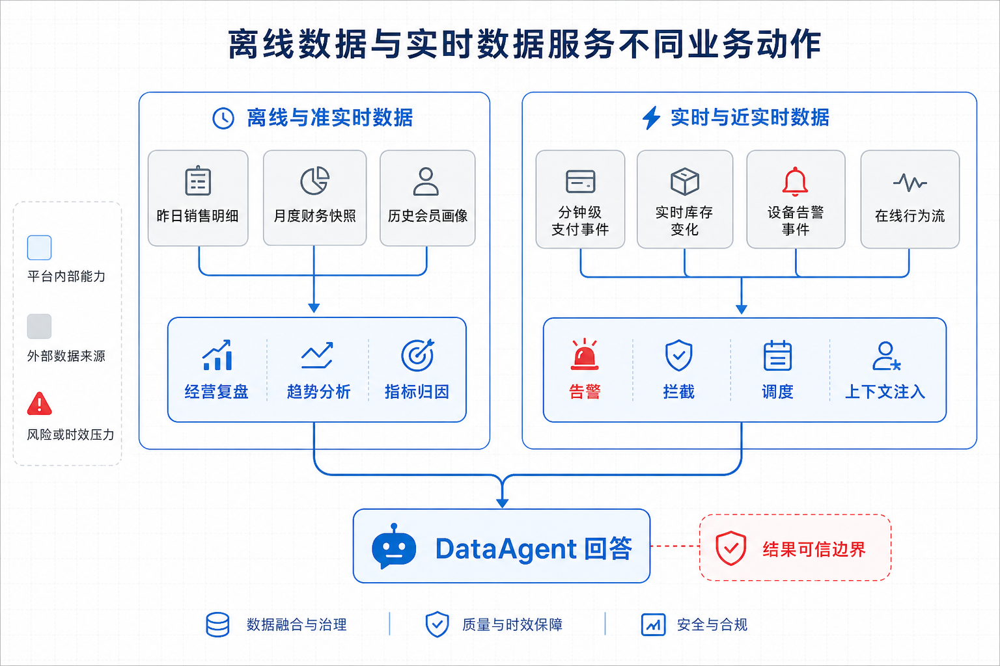
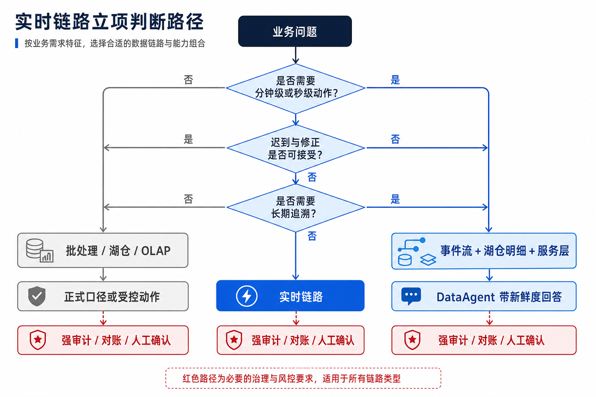
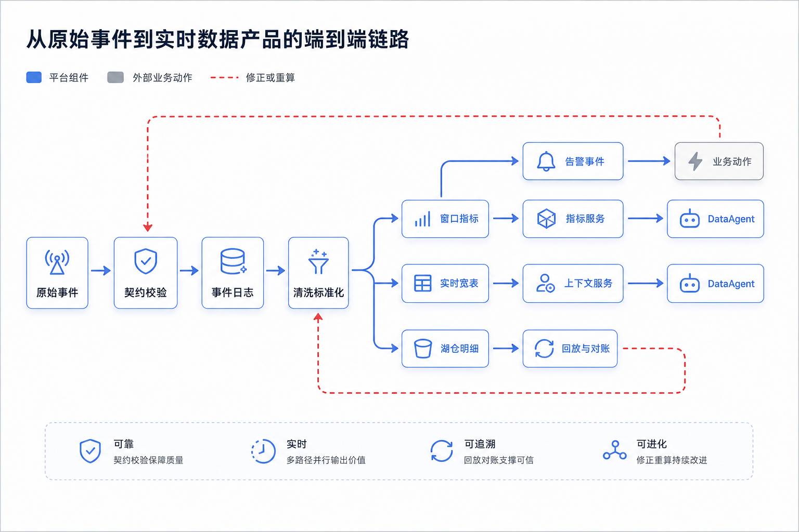
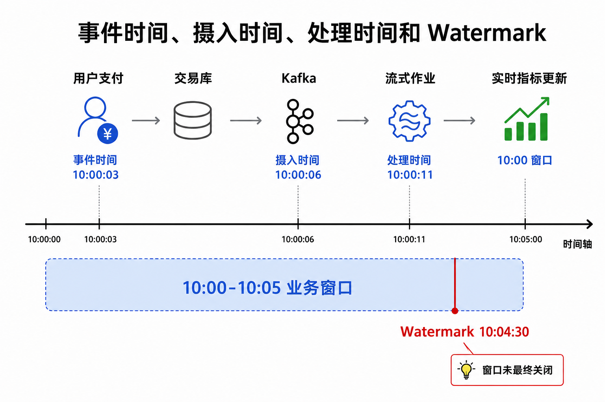
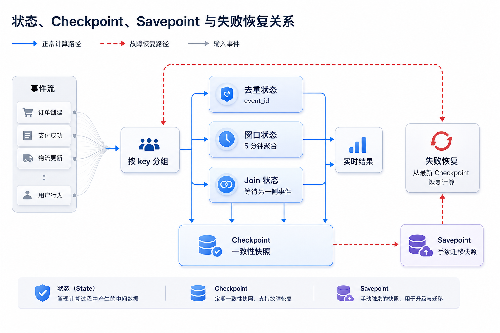
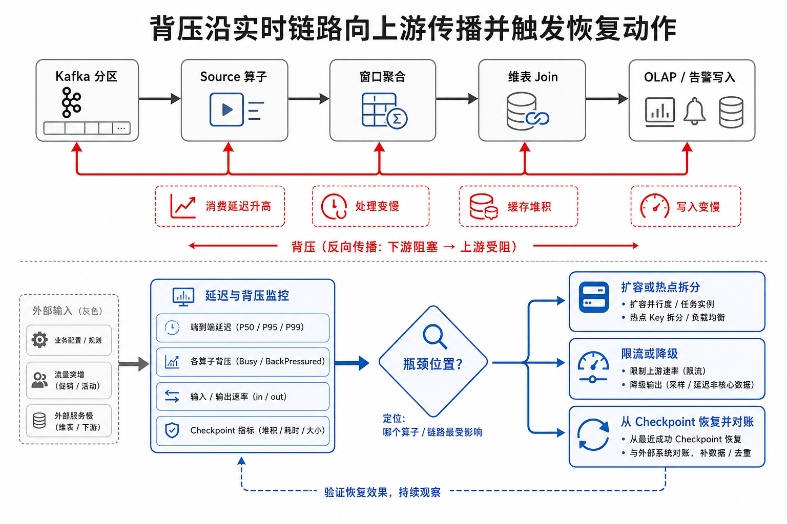
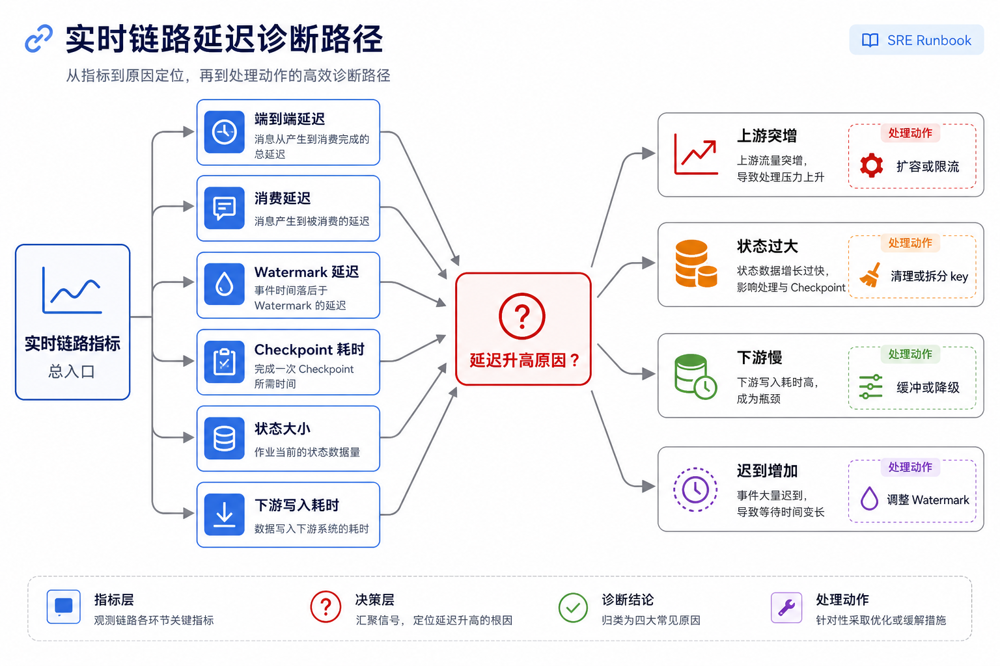

# Ch.13 流式计算与实时数据

> **本章目标**：读者学完后能判断哪些企业 Agent 场景应该建设实时链路，并能设计一条可治理、可回放、可扩展的流式计算架构。
> **前置阅读**：Ch.10 数据采集与集成 / Ch.11 数据湖与湖仓 / Ch.12 湖仓引擎与 OLAP / Ch.15 元数据、血缘、契约与指标
> **估计阅读**：L1 15 min / L1+L2 45 min / 全章 90 min
> **mini-platform 关联**：本章不要求体现
> **实战项目**：本章不要求体现
> **按角色推荐阅读层**：CTO 读 L1+L2，判断实时链路的业务价值、成本和治理边界；架构师读 L1+L2，重点关注时间语义、状态、一致性和失败恢复；工程师读全章，落地发布、监控、扩缩容、回放和生产检查清单。

---

## L1 概念

### 13.1 实时数据在企业 Agent 场景中的价值与边界

山岚集团的数据平台已经具备批量采集、湖仓存储和联机分析处理（Online Analytical Processing，OLAP）查询能力。门店交易、会员行为、仓储履约、设备质检、客服工单每天都会进入湖仓，并通过经营看板和 DataAgent 被业务人员消费。问题是，有些业务动作不能等到第二天。

运营负责人会问 DataAgent：“最近 10 分钟哪些门店支付失败率异常？”供应链团队需要在缺货风险出现前触发补货提醒；风控团队希望在异常下单行为扩散前拦截；客服主管需要看到正在堆积的高优先级工单。此类问题的共同点不是数据量大，而是事件正在发生，业务动作必须跟着发生。



图 13-1 表明，离线链路服务复盘、归因和正式报表，实时链路服务告警、拦截、调度和上下文注入。若问题是“上季度华东区毛利率为什么下降”，批量湖仓和 OLAP 引擎更合适，因为它需要稳定口径、完整数据和可追溯快照。若问题是“过去 5 分钟支付失败率是否超过正常波动”，实时链路更合适，因为它需要在数据尚未沉淀成正式报表前先发现异常。

实时链路不等于把所有数据都变快。它引入常驻计算资源、状态存储、消息积压、乱序事件、重复消费、迟到数据和复杂恢复流程。对企业 Agent 平台而言，实时数据的价值是让 Agent 在正确时间拿到足够新的上下文，同时在数据迟到、重复、修正时仍能解释结果的可靠性。



图 13-2 给出立项边界。只有业务动作依赖分钟级或秒级数据时，实时链路才值得承担额外复杂度；一旦涉及审计和追溯，实时结果还必须能回放和对账。山岚集团的支付异常告警可以使用实时链路，但月度财务结算仍应以湖仓快照和人工确认后的正式口径为准。

实时能力进入 Agent 平台后，边界会发生四类变化：

- DataAgent 不只能查询历史表，还能读取实时指标和实时事件上下文。
- 业务 Agent 不只能回答“发生了什么”，还可以触发告警、派单、冻结、降级、补货等动作。
- 可观测性平台不只能事后分析慢查询和失败任务，还要实时发现数据延迟、消费堆积和状态膨胀。
- 数据治理不只能管表和字段，还要管事件契约、延迟承诺、重放窗口和异常修正流程。

### 13.2 流批一体视角：事件流、变更日志、实时宽表与实时指标

流式计算围绕持续到达的事件构建。一个事件可以是支付成功、库存扣减、设备温度异常、用户点击、工单创建，也可以是数据库行变更。它们不是每天集中生成的文件，而是随着业务运行不断进入消息系统，再被流式作业持续消费、计算和写出。



图 13-3 中有三个边界需要明确。第一，消息系统不是计算系统。Kafka 这类系统提供事件日志、分区、有序追加和消费进度管理，但不会自动完成窗口聚合、状态关联和迟到修正。第二，流式计算不是 OLAP 查询。Flink 或 Spark Structured Streaming 负责持续处理新事件，Doris、StarRocks、ClickHouse 等 OLAP 引擎负责让用户以低延迟查询当前结果。第三，实时数据产品不是临时脚本。只要结果会被 DataAgent 或业务系统用于决策，就必须有事件契约、延迟目标、血缘、权限和回放策略。

流批一体不是一个单独产品名，而是一种平台视角：同一份业务事实既能以事件流进入实时链路，也能以明细表进入湖仓；同一套指标口径既能生成实时窗口结果，也能被离线链路复算对账。对山岚集团而言，支付成功率可以每 5 分钟生成实时结果用于告警，也可以每天用湖仓明细重算，解释实时结果和最终结果之间的差异。

| 概念 | 定义 | 与相邻概念的区别 |
|---|---|---|
| 事件流 | 按时间持续追加的业务事实记录，例如订单创建、支付成功、库存变更 | 强调事实发生；区别于定时生成的批量文件 |
| 变更日志 | 数据库行级变更形成的日志流，常由变更数据捕获（Change Data Capture，CDC）产生 | 强调表状态变化；区别于带领域语义的业务事件 |
| 流式计算 | 持续消费事件并进行过滤、转换、窗口聚合、关联和状态更新的计算方式 | 强调持续计算；区别于一次性批处理 |
| 实时宽表 | 把事件流与维表、规则、历史状态关联后形成的可查询明细或状态表 | 强调当前上下文；区别于只追加不更新的原始日志 |
| 实时指标 | 按事件时间和窗口口径持续更新的指标结果 | 强调低延迟服务；区别于正式离线报表 |
| Watermark | 系统对“事件时间已经推进到某个位置”的估计 | 用于处理乱序与迟到；不等于所有事件都已到齐 |
| Checkpoint | 流式作业对状态和输入位置的一致性快照 | 用于故障恢复；区别于业务审计快照 |
| Savepoint | 运维人员主动触发的可迁移状态快照 | 用于升级、迁移和有计划恢复；区别于周期性 Checkpoint |
| Exactly-once | 在特定源、状态和下游协议配合下实现的一致性处理语义 | 不等于业务世界绝对只发生一次，仍需幂等键和对账 |
| 背压 | 下游处理能力不足导致上游处理速度被迫下降 | 是容量和瓶颈信号；不只是“任务慢” |

实时链路最常见的误区有五个。第一，实时一定比离线更好。实时提升的是动作时效，不一定提升数据质量。第二，Kafka 或流引擎提供 Exactly-once 后，业务就不会重复。系统一致性语义只覆盖特定边界，业务侧仍需 event_id、幂等写入和对账。第三，Watermark 可以解决所有迟到数据。Watermark 是进度估计，不是完整性承诺。第四，实时链路可以替代湖仓。审计、回放、训练样本、长期归因仍依赖湖仓。第五，延迟越低越好。秒级链路通常需要更多常驻资源、更复杂状态管理和更严格值班；若业务只要求 10 分钟内发现异常，把延迟压到 1 秒往往是成本浪费。

---

## L2 架构

### 13.3 流式基础设施：Kafka、Flink、Spark Streaming 与存储系统协作

在企业 Agent 平台中，流式计算层位于数据采集之后、湖仓和服务层之前。它接收 Ch.10 产生的业务事件和 CDC 日志，把结果写入 Ch.11 的湖仓表、Ch.12 的 OLAP 服务层、Ch.15 的元数据与血缘系统，以及面向 DataAgent 的实时上下文服务。


图 13-4 说明实时层不是单独的 Kafka 集群或 Flink 集群，而是一条从事件契约、消息总线、状态计算到服务层和治理系统的端到端链路。它有两条输出路径容易混淆。第一条是事实沉淀路径：原始事件或清洗后的明细写入湖仓，用于审计、回放、训练样本和长期分析。第二条是服务路径：窗口指标、实时宽表、告警事件和在线特征写入 OLAP、缓存或业务系统，用于分钟级查询和动作触发。成熟平台不会只保留服务路径，否则当 DataAgent 被追问“这次告警依据哪些事件”时，平台无法回溯。

实时链路的组件可以按入口、处理、状态、输出、治理五类划分。

| 组件 | 职责 | 输入 | 输出 | 失败模式 |
|---|---|---|---|---|
| 事件生产者 | 将业务动作、日志或数据库变更写入事件总线 | 业务事务、CDC 日志、设备消息 | 标准事件 | 重复发送、乱序、字段漂移、时间戳错误 |
| 事件总线 | 保存事件日志、提供分区、有序追加和消费进度 | 标准事件 | 可消费的分区日志 | 分区倾斜、消息堆积、保留期不足 |
| 流式计算作业 | 持续消费事件，执行过滤、转换、窗口、关联和聚合 | 事件流、维表、规则 | 实时指标、告警、宽表、明细 | 状态膨胀、背压、Checkpoint 失败 |
| 状态存储 | 保存窗口状态、关联状态、去重状态和聚合中间结果 | key、窗口、事件 | 可恢复状态快照 | 状态过大、恢复过慢、状态不兼容 |
| 服务层 | 对外提供查询、告警和在线上下文 | 实时结果 | 查询结果、告警事件、特征值 | 写入重复、查询超时、结果不一致 |
| 治理与观测 | 管理 Schema、血缘、延迟、质量、权限和审计 | 作业元数据、运行指标、事件契约 | 告警、审计、影响分析 | 指标缺失、Owner 不清、事故不可定位 |

框架和存储系统的选择必须服务于业务场景，而不是按流行程度堆叠。Kafka 适合做可重放事件日志，不适合承载复杂窗口计算。Flink 适合复杂事件时间、低延迟状态计算和精细恢复，不适合由缺少流式运维能力的团队直接大规模铺开。Spark Structured Streaming 适合已有 Spark 和湖仓基础的团队做微批增量处理，不适合把所有秒级拦截场景都压到微批模型。Kafka Streams 适合嵌入单个服务做局部流处理，不适合作为全公司统一实时数据平台。替代方案包括 Pulsar、Redpanda、RisingWave、Materialize、ksqlDB 以及云厂商托管流处理服务；选择时要看事件保留、状态恢复、Schema 治理、权限、成本和团队运维能力。

**取舍一：批处理、微批与连续流**

| 方案 | 优势 | 代价 | 适用场景 | 本书建议 |
|---|---|---|---|---|
| 批处理 | 简单、成本低、易对账 | 延迟高，不能及时触发动作 | 日报、月报、离线特征、财务对账 | 默认保留，作为最终事实和对账底座 |
| 微批 | 工程复杂度适中，吞吐好 | 延迟通常以秒到分钟计 | 近实时报表、轻量告警、湖仓增量写入 | 适合大多数企业准实时场景 |
| 连续流 | 延迟低，适合复杂状态计算 | 运维复杂，状态和恢复成本高 | 风控拦截、设备告警、实时规则 | 只用于业务动作确实依赖低延迟的链路 |

**取舍二：Flink、Spark Structured Streaming 与 Kafka Streams**

| 方案 | 优势 | 代价 | 适用场景 | 本书建议 |
|---|---|---|---|---|
| Flink | 原生流处理、事件时间和状态能力强，适合复杂实时计算 | 运维和调优门槛高 | 高吞吐、低延迟、复杂窗口、实时关联 | 作为企业实时计算主力选项，但必须配套状态、发布和观测平台 |
| Spark Structured Streaming | 与 Spark 批处理生态一致，适合湖仓和微批 | 超低延迟和复杂状态场景不如专用流引擎自然 | 湖仓增量处理、近实时 ETL、已有 Spark 团队 | 适合从离线团队平滑进入近实时 |
| Kafka Streams | 嵌入应用，部署轻，和 Kafka 生态贴合 | 大规模集中治理、复杂运维能力较弱 | 单服务内局部流处理、轻量状态应用 | 用于局部服务，不作为全公司统一实时平台首选 |

### 13.4 时间语义：事件时间、处理时间、Watermark、窗口与迟到数据

实时系统通常同时处理三类时间。事件时间是业务事件实际发生的时间，例如支付完成时间。摄入时间是事件进入消息系统或流式平台的时间。处理时间是计算任务真正处理这条事件的时间。



图 13-5 的关键是，实时计算要按业务发生时间计算指标，而不是简单按系统处理时间计算。以支付成功率为例，如果按照处理时间统计，10:00:03 发生但 10:00:11 才处理的支付事件会被计入后续窗口，导致 10:00:00 到 10:05:00 的成功率偏低。对于“刚才是否异常”的告警，这种偏差会直接触发误报。

企业事件天然可能乱序。门店网络抖动、移动端离线缓存、数据库日志同步延迟、跨地域链路抖动都会导致较早发生的事件较晚到达。Watermark 的作用是给系统一个进度判断：大多数事件已经推进到某个事件时间，窗口可以先输出。它不是“该时间之前所有事件都已到达”的证明。

Watermark 策略需要与业务契约绑定。例如，山岚集团门店支付事件一般 30 秒内到达，但山区门店偶发 5 分钟延迟。若 Watermark 只允许 30 秒迟到，实时大屏更快，但山区门店会频繁被漏算；若允许 10 分钟迟到，结果更完整，但告警变慢。平台应让业务明确选择：实时告警用快速但可修正的结果，财务口径用延迟更高但更完整的结果。

**取舍三：速度优先还是完整性优先**

| 方案 | 优势 | 代价 | 适用场景 | 本书建议 |
|---|---|---|---|---|
| 速度优先 | 告警快，用户感知好 | 迟到事件会造成修正或误报 | 异常预警、运营监控、设备告警 | 输出必须标注 Watermark 与是否最终 |
| 完整性优先 | 结果稳定，少修正 | 延迟更高，可能错过动作窗口 | 财务口径、监管报送、正式复盘 | 用离线或长 Watermark 链路确认 |
| 双轨输出 | 快速结果和最终结果都保留 | 存储和治理复杂度更高 | 高价值指标、风控、供应链调度 | 用于关键业务指标，并建立对账说明 |

实时指标服务响应不能只返回一个数值。DataAgent 如果只拿到 `0.982`，就无法判断这个数值是否是完整窗口、是否包含迟到修正、是否正在回放。

```json
{
  "metric": "payment_success_rate",
  "window_start": "2026-06-11T10:00:00+08:00",
  "window_end": "2026-06-11T10:05:00+08:00",
  "value": 0.982,
  "watermark": "2026-06-11T10:04:30+08:00",
  "is_final": false,
  "late_event_policy": "update_until_10_minutes",
  "source_lag_seconds": 35,
  "lineage": {
    "source_topics": ["payment-events-v3"],
    "job": "payment-success-rate-stream",
    "contract": "payment.succeeded.v3"
  }
}
```

**示例 13-1：实时指标服务响应示例。** 这是生产工程示例。`is_final=false` 告诉 DataAgent 当前窗口还可能被迟到事件修正，回答时应标注“截至当前 Watermark”。

### 13.5 状态管理：Checkpoint、Savepoint、Exactly-once 与端到端一致性

窗口聚合、去重、流式关联、规则匹配都需要状态。状态可以理解为流式作业的记忆：当前窗口累加到多少、哪些 event_id 已处理、某个订单是否已经支付、某个用户最近 5 分钟是否连续失败。



图 13-6 说明，状态使实时计算能够跨事件记忆上下文，也让故障恢复变得复杂。Checkpoint 用于把状态和输入位置保存成一致性快照。作业失败后，系统从最近一次成功 Checkpoint 恢复状态，并从对应输入位置继续消费。没有 Checkpoint，作业只能从最新位置丢数据，或从很早位置重放并产生大量重复结果。

Savepoint 是有计划运维动作中的可迁移快照，常用于版本升级、状态结构迁移、并行度调整和跨集群迁移。Checkpoint 关注自动故障恢复，Savepoint 关注可控变更。二者都不是业务对账的替代品，因为它们解释的是计算状态，不解释业务事实是否完整。

Exactly-once 通常不是单个组件独立完成，而是源、计算状态和下游共同参与。输入必须可重放，状态必须可恢复，下游必须支持事务提交或幂等写入。缺任何一环，都只能获得较弱的一致性。在业务层，还要补充幂等键和对账。例如告警系统如果不支持事务提交，就应使用 `alert_id = rule_id + store_id + window_start` 做幂等写入，避免作业恢复后重复派单。湖仓写入如果支持事务提交，也要确保每次提交包含唯一批次号，避免回放产生重复文件。

以下事件契约示例展示实时链路的入口边界。它不是 mini-platform 配置，而是生产工程示例。

```json
{
  "event_id": "evt_20260611_000001",
  "event_type": "payment.succeeded",
  "schema_version": "v3",
  "event_time": "2026-06-11T10:00:03+08:00",
  "source": "pos-payment",
  "partition_key": "store_1024",
  "trace_id": "trace_8f4a",
  "producer_time": "2026-06-11T10:00:04+08:00",
  "payload": {
    "order_id": "ord_10086",
    "store_id": "store_1024",
    "amount": 128.50,
    "payment_method": "card",
    "status": "succeeded"
  },
  "quality": {
    "is_replay": false,
    "source_lag_ms": 1000
  },
  "governance": {
    "owner": "payment-platform",
    "pii_tags": ["customer_id"],
    "retention_days": 30
  }
}
```

**示例 13-2：实时事件契约示例。** 重点是把业务时间、生产时间、Schema 版本、分区键、质量标记和治理属性放入统一信封。


图 13-7 说明，事件契约不是文档附件，而是生产、消费、治理和审计共同依赖的控制面。一个合格的事件契约至少要回答八个问题：这是什么事件；事件唯一键是什么；事件时间字段是什么；分区键是什么；Schema 版本如何演进；哪些字段属于个人可识别信息（Personally Identifiable Information，PII）；事件保留多久；迟到、补发、撤销、修正事件如何表达。

### 13.6 Stream-table Duality：从实时流到可查询表与物化视图

流与表的二象性（Stream-table Duality）提供了理解实时数据产品的关键模型。追加事件流记录发生过什么，表表达某个时刻的当前状态；变更日志则连接二者。订单创建、支付成功、取消订单是一组事件；把它们按 order_id 折叠后，就得到订单当前状态表；再按门店和 5 分钟窗口聚合，就得到可查询的实时指标表。


图 13-8 提醒平台团队，DataAgent 不应该直接消费原始事件流来回答经营问题。它应该访问受控的实时表、物化视图或指标服务，并同时获得窗口、Watermark、是否最终、口径和血缘。原始流用于计算、回放和审计；可查询表用于服务 DataAgent、BI 和业务系统。

**取舍四：实时结果写哪里**

| 方案 | 优势 | 代价 | 适用场景 | 本书建议 |
|---|---|---|---|---|
| 直接写 OLAP | 查询快，服务 BI 和 DataAgent 简单 | 审计和回放能力不足 | 高频实时看板、最近窗口查询 | 只保存服务结果，不作为唯一事实 |
| 写湖仓明细 | 可追溯、可回放、可训练 | 查询延迟较高，服务链路还需加工 | 原始事件、清洗明细、修正记录 | 必须保留，用于对账和回放 |
| 同时写湖仓和服务层 | 兼顾可追溯与低延迟 | 双写一致性和治理复杂 | 关键实时指标和告警 | 默认推荐，但必须设计幂等键和对账链路 |

### 13.7 面向 Agent 的实时特征、实时告警与实时上下文注入

Agent 使用实时数据有三类常见方式。第一类是实时特征，例如用户最近 10 分钟失败支付次数、门店最近 5 分钟订单量、设备最近 1 分钟温度斜率。这类数据通常进入特征服务或上下文服务，供风控 Agent、调度 Agent 或 DataAgent 查询。第二类是实时告警，例如支付失败率异常、仓储积压、设备异常、客服工单激增。这类数据通常进入告警系统或工作流系统，并由 Agent 解释原因、推荐动作或生成工单。第三类是实时上下文注入，例如 DataAgent 回答“现在是否异常”时，把当前窗口指标、Watermark、最近事件样本和历史基线一起注入推理上下文。

实时上下文注入需要设置访问边界。Agent 不应无限制读取 Kafka 主题，因为原始事件中可能包含敏感字段、坏数据、重复事件和未稳定口径。更稳妥的模式是由实时指标服务、实时特征服务或实时上下文服务提供受控接口，返回值包含数据新鲜度、是否最终、血缘和脱敏状态。这样 DataAgent 的回答可以区分“已确认事实”“当前窗口初步结果”和“正在回放修正的结果”。

**取舍五：实时数据直接进 Agent，还是先经过服务层**

| 方案 | 优势 | 代价 | 适用场景 | 本书建议 |
|---|---|---|---|---|
| Agent 直接读事件流 | 延迟低，灵活 | 权限、脱敏、口径、重复和迟到难治理 | 调试、内部实验、有限主题 | 不作为生产默认路径 |
| Agent 读实时 OLAP | 查询表达能力强，接入成本低 | 需要管理 SQL 安全、资源限额和窗口完整性 | 实时指标查询、运营看板问答 | 适合 DataAgent，但响应必须带新鲜度与血缘 |
| Agent 读上下文服务 | 契约清晰，易脱敏和限流 | 服务层建设成本更高 | 风控、客服、供应链调度等动作型 Agent | 关键业务动作优先使用 |

以下伪代码展示一个受控上下文接口应如何表达实时语义。

```yaml
# 示例：实时上下文服务响应，不包含真实凭证
context:
  subject: store_1024
  window: 5m
  generated_at: "2026-06-11T10:05:12+08:00"
  watermark: "2026-06-11T10:04:30+08:00"
  freshness_seconds: 42
  finality: provisional
signals:
  payment_success_rate:
    value: 0.982
    baseline: 0.995
    severity: warning
  order_count:
    value: 438
    baseline: 410
    severity: normal
governance:
  lineage:
    - payment-events-v3
    - payment-success-rate-stream
  pii_status: masked
  allowed_actions:
    - explain
    - create_ticket
    - request_human_review
```

**示例 13-3：实时上下文服务响应示例。** 该接口让 Agent 能说明“数据截至哪个 Watermark”“结果是否最终”“允许触发哪些动作”。

### 13.8 失败模式：背压、重复消费、数据倾斜、状态膨胀与回放修正

背压表示下游处理速度低于上游输入速度。它可能发生在消息消费、计算算子、状态读写、网络 Shuffle、下游写入任意一环。



图 13-9 说明，下游写入变慢会逐步影响计算、消费和 Kafka 堆积，最终表现为端到端延迟上升。背压不是单个组件的“任务慢”，而是容量、状态和下游服务共同作用的结果。排查时不能只看作业是否运行，要同时看输入速率、输出速率、消费延迟、Watermark 延迟、Checkpoint 耗时、状态大小和下游写入耗时。

| 失败模式 | 触发条件 | 影响 | 检测方式 | 恢复策略 |
|---|---|---|---|---|
| 消息堆积 | 生产速度高于消费速度 | 指标延迟，告警滞后 | 消费延迟、端到端延迟 | 扩容消费者、优化慢算子、下游限流 |
| 分区倾斜 | 少数 key 流量远高于其他 key | 单个任务拖慢全链路 | 分区吞吐、任务负载差异 | 重设计分区键、热点拆分、局部聚合 |
| 迟到事件增加 | 网络抖动、移动端离线、上游补发 | 窗口结果反复修正或漏算 | 迟到率、Watermark 延迟 | 调整 Watermark、设置迟到修正表 |
| Checkpoint 失败 | 状态过大、下游提交慢、存储不稳定 | 作业恢复点变旧，失败后重算变多 | Checkpoint 耗时与失败率 | 缩减状态、增加并行度、优化状态后端 |
| 状态膨胀 | 关联无上界、去重保留期过长 | 内存或磁盘压力，恢复变慢 | 状态大小、恢复耗时 | 设置状态保留时间、清理无效 key |
| 下游写入重复 | 恢复后重复提交结果 | 告警重复、指标翻倍 | 幂等冲突、对账差异 | 事务提交、幂等键、结果去重 |
| Schema 不兼容 | 上游删除字段或变更类型 | 作业解析失败或数据错误 | Schema 校验失败 | 兼容性策略、灰度发布、回滚契约 |
| 原始事件保留期不足 | 需要回放时日志已过期 | 无法重算或解释历史结果 | 回放任务失败、审计缺口 | 同步写湖仓明细，提高关键主题保留期 |

回放修正是实时链路的必备能力。山岚集团如果发现某批门店支付事件的 `event_time` 被上游写错，不能只在服务层手工改指标。正确流程是隔离坏数据、修正事件或生成补偿事件、从保留日志或湖仓明细回放指定时间范围、对比新旧结果、更新服务层，并把修正原因写入审计记录。否则 DataAgent 后续回答无法解释为什么同一窗口指标发生变化。

---

## L3 工程实现

### 13.9 工程落地：实时链路部署、监控、扩缩容与治理

工程实现重点是给出生产落地时必须具备的部署拓扑、发布流程、监控指标、扩缩容策略和治理边界。


图 13-10 表明，流式作业不应直接从开发环境发布到生产。预发回放和影子对比是发现口径偏差的关键步骤；Savepoint 是有状态作业升级和回滚的关键控制点；灰度发布后必须观察延迟、结果质量和 Checkpoint 指标，而不是只看进程存活。

以下配置示例展示实时作业的生产配置形态，不绑定 mini-platform。

```yaml
# 示例：实时作业配置，不包含真实凭证
job:
  name: payment-success-rate-stream
  owner: payment-data-team
  version: 2026.06.11
  mode: streaming

source:
  type: kafka
  topic: payment-events-v3
  consumer_group: payment-success-rate
  start_from: committed-offset
  event_time_field: event_time
  partition_key: store_id

watermark:
  max_out_of_orderness: 2m
  allowed_lateness: 10m
  late_event_output: payment-events-late

state:
  checkpoint_interval: 30s
  checkpoint_timeout: 10m
  state_retention: 2h
  savepoint_required_for_upgrade: true

sink:
  lakehouse_table: dwd.payment_events_rt
  olap_table: ads.payment_success_rate_5m
  idempotent_key: window_start,window_end,store_id

governance:
  contract: payment.succeeded.v3
  pii_policy: mask_customer_id
  lineage_enabled: true
  alert_on_lag_seconds: 180
```

**示例 13-4：实时作业配置示例。** 关键配置不是框架参数本身，而是把事件时间、Watermark、状态保留、幂等键和治理策略显式化。

```sql
-- 伪代码：用 SQL 表达 5 分钟支付成功率窗口
CREATE TABLE payment_events (
  event_id STRING,
  store_id STRING,
  status STRING,
  event_time TIMESTAMP(3),
  WATERMARK FOR event_time AS event_time - INTERVAL '2' MINUTE
);

CREATE TABLE payment_success_rate_5m (
  window_start TIMESTAMP(3),
  window_end TIMESTAMP(3),
  store_id STRING,
  success_rate DOUBLE,
  total_count BIGINT,
  updated_at TIMESTAMP(3),
  PRIMARY KEY (window_start, window_end, store_id) NOT ENFORCED
);

INSERT INTO payment_success_rate_5m
SELECT
  TUMBLE_START(event_time, INTERVAL '5' MINUTE) AS window_start,
  TUMBLE_END(event_time, INTERVAL '5' MINUTE) AS window_end,
  store_id,
  SUM(CASE WHEN status = 'succeeded' THEN 1 ELSE 0 END) * 1.0 / COUNT(*) AS success_rate,
  COUNT(*) AS total_count,
  CURRENT_TIMESTAMP AS updated_at
FROM payment_events
GROUP BY TUMBLE(event_time, INTERVAL '5' MINUTE), store_id;
```

**示例 13-5：窗口指标伪代码。** 这段只表达计算意图：按事件时间生成 5 分钟窗口，用主键保证下游可幂等更新。

生产部署至少应满足以下要求。

| 领域 | 必备能力 | 说明 |
|---|---|---|
| 发布 | 版本号、配置快照、Savepoint、回滚方案 | 流式作业升级涉及状态兼容，不能只替换镜像 |
| 监控 | 输入速率、输出速率、消费延迟、Watermark 延迟、Checkpoint 成功率 | 这些指标共同解释端到端延迟 |
| 扩缩容 | 按吞吐、延迟、状态大小和下游写入能力调整并行度 | 扩容前要确认瓶颈不是下游 |
| 治理 | 事件契约、Owner、SLA、血缘、权限、数据保留期 | 实时结果进入 DataAgent 前必须可解释 |
| 恢复 | Checkpoint、Savepoint、回放、幂等写入、对账 | 恢复流程要提前演练 |
| 成本 | 常驻资源、状态存储、消息保留、重复计算 | 实时链路不是按查询付费，空闲时也会产生成本 |



图 13-11 是值班人员排查延迟的最小路径。消费延迟升高不一定意味着 Kafka 有问题；Watermark 延迟升高可能是迟到事件增加；Checkpoint 变慢通常指向状态膨胀或下游提交慢；下游写入耗时上升会反向制造背压。


图 13-12 把技术取舍汇总到四个维度。低延迟通常引入状态和运维复杂度；可解释正确性通常要求实时与离线双轨；成本治理要求限制常驻资源和事件保留；治理能力要求统一契约、血缘、权限和审计。平台负责人应把这些约束写入立项评审，而不是在事故后补流程。

### 13.10 生产化检查清单与真实踩坑记录

**生产化检查清单**

- [ ] 业务价值：确认实时链路服务的是告警、拦截、调度、在线上下文等低延迟动作，而不是为了“看起来实时”。
- [ ] 事件契约：每个事件有 event_id、event_time、schema_version、partition_key、owner、retention 和 PII 标记。
- [ ] 时间语义：明确使用事件时间、摄入时间还是处理时间；关键指标必须说明 Watermark 和允许迟到范围。
- [ ] 幂等设计：下游写入有幂等键或事务提交，告警和工单不会因重放重复触发。
- [ ] 状态边界：所有去重、窗口、关联状态都有保留时间和清理策略。
- [ ] Checkpoint：定义间隔、超时、存储位置、失败阈值，并定期演练恢复。
- [ ] Savepoint：升级、迁移、扩缩容前可生成 Savepoint，并确认新版本状态兼容。
- [ ] 回放能力：保留足够长的原始事件日志或湖仓明细，支持按时间范围重算。
- [ ] 对账机制：关键实时指标有离线对账链路，能解释实时值和最终值差异。
- [ ] 背压监控：监控消费延迟、Watermark 延迟、下游写入耗时、状态大小和 Checkpoint 耗时。
- [ ] 限流降级：当下游不可用时，能暂停告警、降级指标、缓冲写入或切换到只写湖仓。
- [ ] 权限与脱敏：DataAgent 和业务系统只能访问授权后的实时结果，敏感字段按策略脱敏。
- [ ] 血缘与审计：每个实时结果能追溯到源 topic、作业版本、事件契约和输出表。
- [ ] 成本治理：常驻计算、消息保留、状态存储和回放成本有预算和归因。
- [ ] 值班机制：核心实时链路有明确 Owner、告警接收人、升级路径和事故复盘模板。

**踩坑 1：用处理时间做支付成功率，促销高峰误报。**

- 现象：促销开始后，部分门店 5 分钟支付成功率突然下降，风控 Agent 自动触发支付通道降级。
- 根因：事件按处理时间进入窗口。高峰期消费堆积后，早发生的成功支付被计入后续窗口，当前窗口成功率被低估。
- 修复：支付指标改为事件时间窗口，设置 2 分钟乱序容忍和 10 分钟迟到修正；DataAgent 回答中展示 Watermark 和是否最终。

**踩坑 2：Kafka 分区键使用城市，导致核心城市单分区过热。**

- 现象：全国大部分门店指标正常，上海和深圳门店指标持续延迟。
- 根因：分区键选择 `city_id`，大城市流量集中在少数分区，单个流式任务成为瓶颈。
- 修复：分区键改为 `store_id`，热点门店再做二级拆分；窗口聚合先局部汇总再全局合并。

**踩坑 3：去重状态没有过期时间，作业恢复越来越慢。**

- 现象：作业运行数周后 Checkpoint 时间从几十秒增长到十几分钟，失败恢复超过业务可接受时间。
- 根因：去重状态保存所有历史 event_id，没有按事件时间或业务周期清理。
- 修复：按事件保留期设置状态过期时间；超过迟到窗口的 event_id 进入离线对账，不再占用实时状态。

**踩坑 4：告警 Sink 不幂等，恢复后重复派单。**

- 现象：一次集群重启后，同一门店的支付异常工单被创建多次。
- 根因：流式作业从 Checkpoint 恢复后重放部分结果，告警系统只提供追加写入，没有基于业务键去重。
- 修复：设计 `alert_id = rule_id + store_id + window_start`，告警系统改为按 `alert_id` upsert；恢复后只更新已有告警状态。

**踩坑 5：只保留实时聚合结果，无法解释 DataAgent 回答。**

- 现象：业务质疑“为什么说某门店近 10 分钟异常”，DataAgent 只能给出聚合值，无法列出支撑事件。
- 根因：原始事件保留期过短，清洗明细没有写入湖仓；实时服务层成为唯一事实来源。
- 修复：所有关键事件同时写入湖仓明细，实时聚合结果保存血缘字段；DataAgent 回答可附上窗口、事件数量和样例事件引用。

---

## 本章小结

### 关键结论

1. 实时链路的价值在于低延迟动作，不在于替代离线湖仓。关键业务指标应同时保留实时结果和可回放事实。
2. 事件时间、Watermark、Checkpoint 和状态管理是流式计算的核心，不理解这些机制就无法解释结果是否可靠。
3. Exactly-once 是端到端系统语义，依赖可重放输入、可恢复状态和事务或幂等下游；它不能替代业务幂等和对账。
4. 背压是实时链路最重要的容量信号。排查延迟时要同时看输入、Watermark、状态、Checkpoint 和下游写入。
5. DataAgent 使用实时数据时，必须获得时间窗口、Watermark、是否最终、来源血缘和延迟信息，避免把未完成窗口当作最终事实。

### 上线检查清单

- [ ] 能上线吗？事件契约、Watermark 策略、Checkpoint、幂等写入、回放和告警都已通过预发验证。
- [ ] 能扩展吗？分区键、并行度、状态保留、下游写入能力和扩缩容流程已经压测。
- [ ] 能治理吗？Owner、SLA、血缘、权限、PII 脱敏、审计和成本归因已经进入平台控制面。

### 延伸阅读

- 官方文档：[Apache Flink - Timely Stream Processing](https://nightlies.apache.org/flink/flink-docs-stable/docs/concepts/time/)。支撑本章对事件时间、处理时间、Watermark 和窗口完整性的说明。
- 官方文档：[Apache Flink - Checkpointing](https://nightlies.apache.org/flink/flink-docs-stable/docs/dev/datastream/fault-tolerance/checkpointing/)。支撑本章对 Checkpoint、一致性快照和恢复边界的说明。
- 官方文档：[Apache Flink - Savepoints](https://nightlies.apache.org/flink/flink-docs-stable/docs/ops/state/savepoints/)。支撑本章对有状态作业升级、迁移和回滚的说明。
- 官方文档：[Apache Kafka - Message Delivery Semantics](https://kafka.apache.org/documentation/#semantics)。支撑本章对消息投递语义和端到端 Exactly-once 边界的说明。
- 官方文档：[Apache Spark - Structured Streaming Programming Guide](https://spark.apache.org/docs/latest/structured-streaming-programming-guide.html)。支撑本章对微批、事件时间和流式查询模型的说明。
- 论文：[The Dataflow Model](https://research.google/pubs/the-dataflow-model-a-practical-approach-to-balancing-correctness-latency-and-cost-in-massive-scale-unbounded-out-of-order-data-processing/)。支撑本章对正确性、延迟、成本和乱序数据处理取舍的说明。
- 对标项目：[Apache Flink](https://flink.apache.org/)、[Apache Kafka](https://kafka.apache.org/)、[Apache Spark Structured Streaming](https://spark.apache.org/streaming/)、[ksqlDB](https://ksqldb.io/)。用于对比企业实时计算、事件日志和流表服务的不同落地方式。
- 相关章节：[Ch.10 数据采集与集成](ch10.md)、[Ch.11 数据湖与湖仓](ch11.md)、[Ch.12 湖仓引擎与 OLAP](ch12-olap.md)、[Ch.14 数据编排与质量](ch14.md)、[Ch.15 元数据、血缘、契约与指标](ch15.md)、[Ch.34 NL2SQL 工程化](../part06-dataagent/ch34-nl2sql.md)、[Ch.38 可观测性与 Trace](../part07-observability-eval/ch38-trace.md)、[Ch.51 安全护栏](../part10-security-org/ch51-guardrails.md)。
