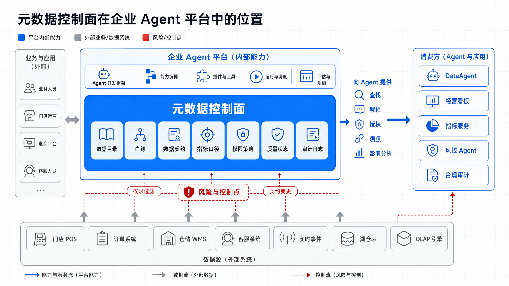
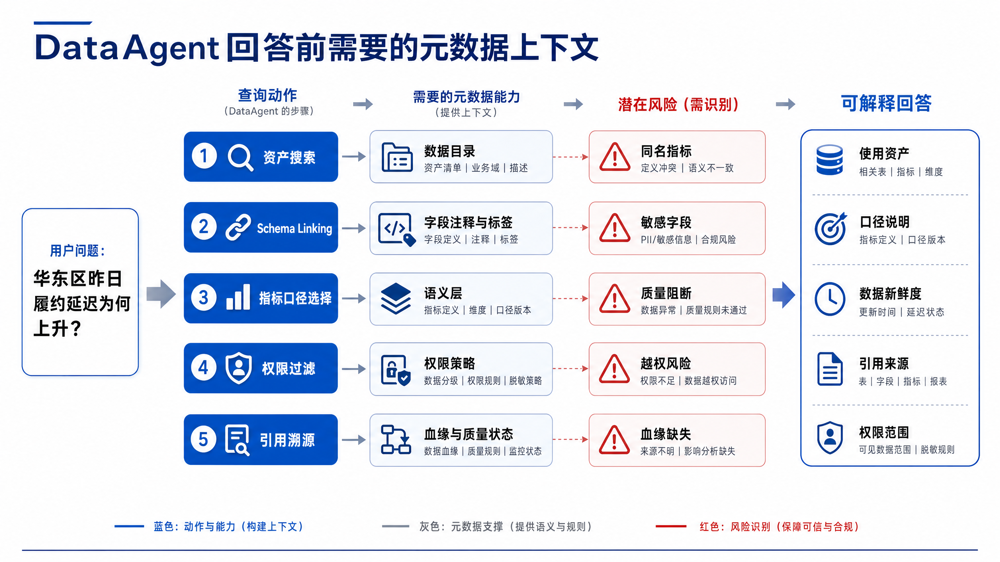
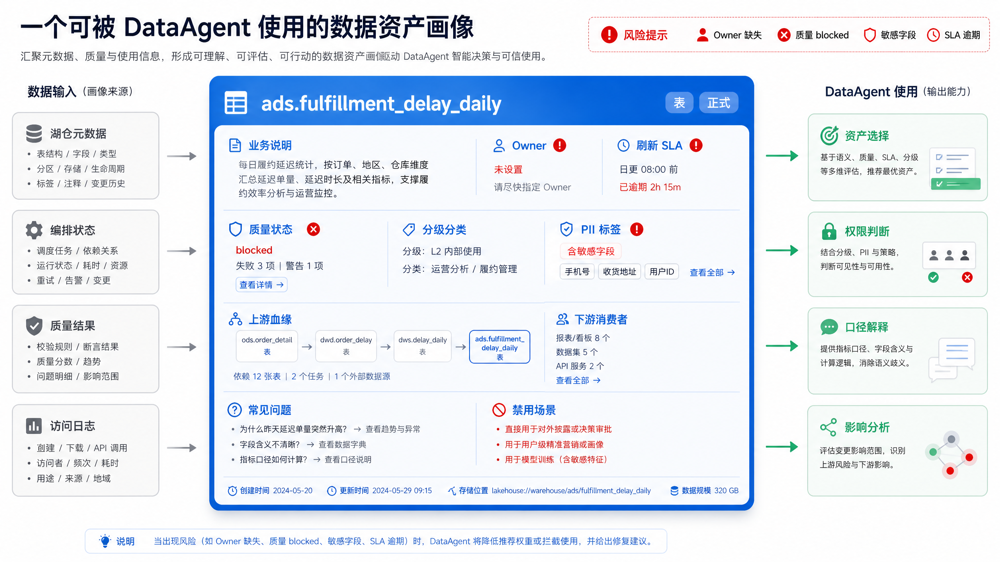
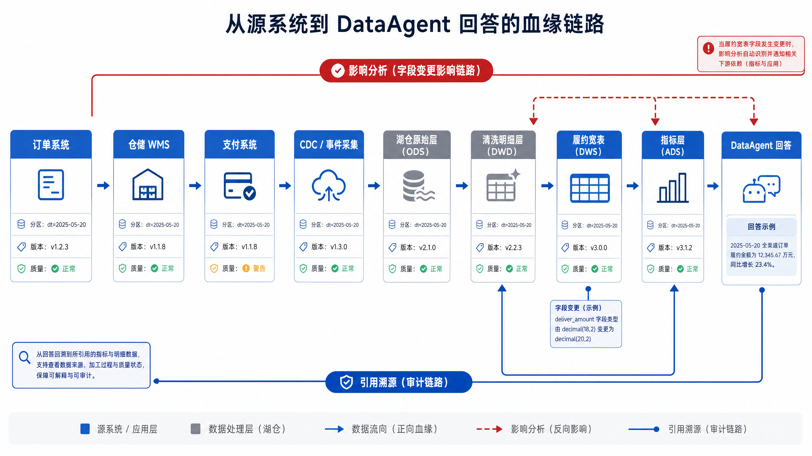
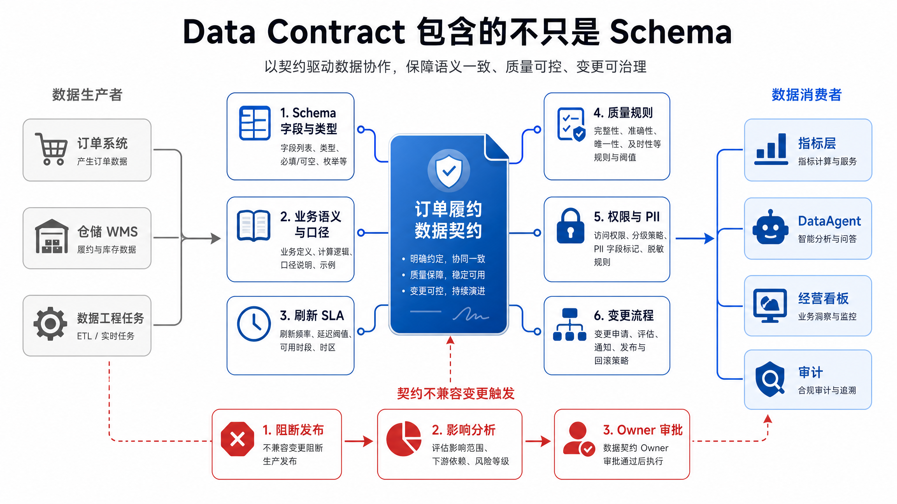
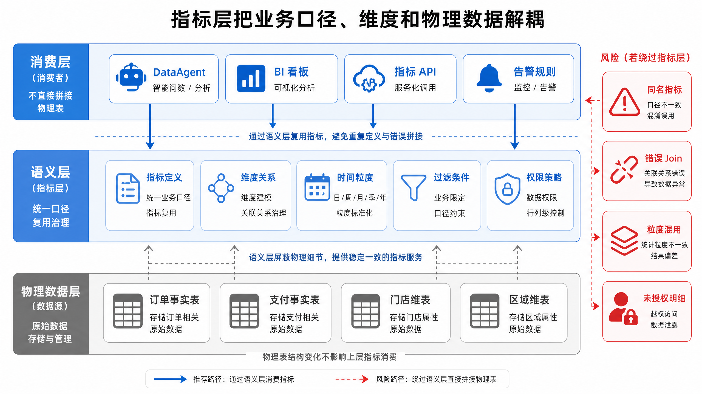
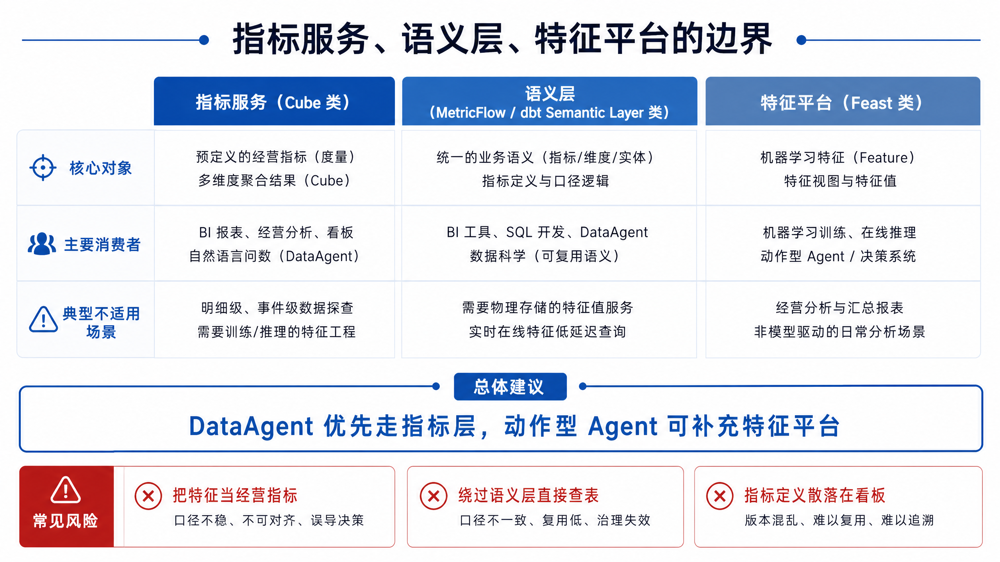
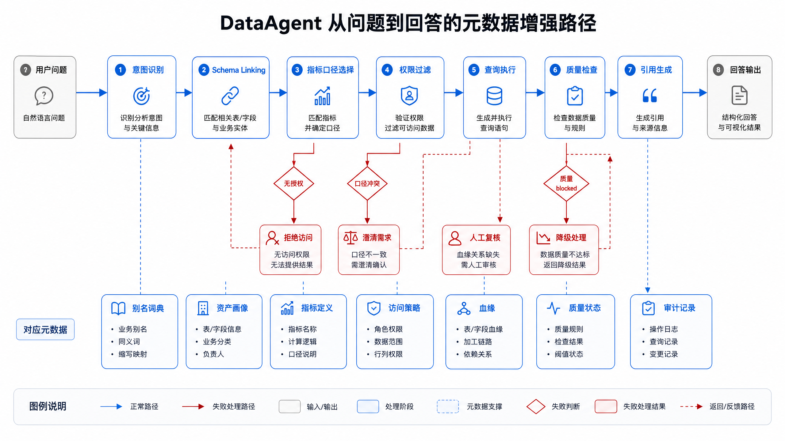
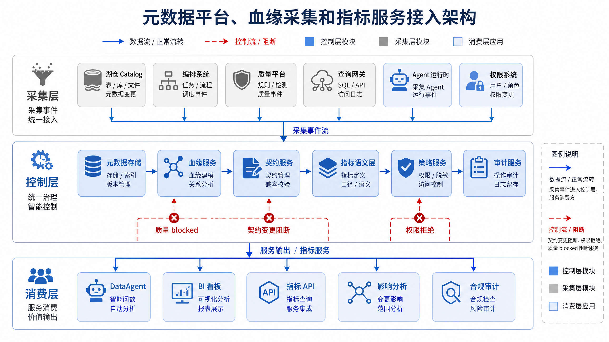
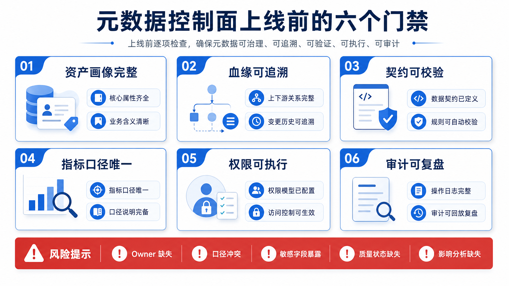

# Ch.15 元数据、血缘、契约与指标

> **本章目标**：读者学完后能为企业 Agent 平台设计一套支撑查数、解释、溯源、权限和变更治理的数据控制平面。
> **前置阅读**：Ch.10 数据采集与集成 / Ch.11 数据湖与湖仓 / Ch.12 湖仓引擎与 OLAP / Ch.13 流式计算与实时数据 / Ch.14 数据编排与质量
> **估计阅读**：L1 15 min / L1+L2 45 min / 全章 90 min
> **mini-platform 关联**：本章不要求体现
> **实战项目**：本章不要求体现
> **按角色推荐阅读层**：CTO 读 L1+L2，判断数据治理对 Agent 风险、合规和复用效率的影响；架构师读 L1+L2，重点关注元数据控制面、血缘、契约、语义层和权限闭环；工程师读全章，落地元数据采集、指标服务、影响分析和审计流程。

---

## L1 概念

### 15.1 元数据是 Agent 平台的数据控制平面

山岚集团的 DataAgent 能访问湖仓表、OLAP 引擎、实时指标和质量状态。若没有元数据控制面，Agent 面对自然语言问题时会遇到四类不确定性：该用哪张表；字段是什么意思；指标口径是否一致；当前用户是否有权查看结果。传统 BI 可以通过固定看板和人工培训减少这些问题，DataAgent 则需要把这些判断自动化、可解释化、可审计化。

元数据不是“表的备注”。它是企业 Agent 平台的数据控制平面，负责登记资产、描述语义、连接血缘、约束契约、服务指标、执行权限和记录审计。没有这个控制面，Agent 只能把物理表名、字段名和历史查询样例拼在一起猜测，回答质量会随着数据规模增长迅速下降。



图 15-1 表明，元数据控制面横跨数据基础设施层和 Agent 消费层。它不直接替代湖仓或 OLAP 引擎，而是告诉 DataAgent 哪些资产可用、哪些字段可信、哪个指标可复用、回答引用来自哪里、变更会影响谁。



图 15-2 展示了元数据如何进入 Agent 推理链路。用户问的是自然语言问题，但平台需要把问题映射到资产、字段、指标、权限和引用。这个过程若只依赖大语言模型记忆，很容易把“GMV”“销售额”“实收金额”混为一谈。控制面应提供可查询、可验证、可审计的上下文。

### 15.2 数据目录：搜索、标签、Owner、分级分类与资产画像

数据目录是元数据控制面的入口。它回答“有什么数据、谁负责、能不能用、适合什么问题”。一个可用于 DataAgent 的目录不应只展示表名和字段，还应包含资产类型、业务说明、Owner、分级分类、质量状态、新鲜度、使用热度、下游消费者和示例问题。

| 概念 | 定义 | 与相邻概念的区别 |
|---|---|---|
| 技术元数据 | 表名、字段、类型、分区、存储位置、刷新时间等系统属性 | 描述物理结构；不解释业务语义 |
| 业务元数据 | 业务含义、指标口径、Owner、适用场景、禁用场景 | 面向业务理解；是 DataAgent 解释口径的关键 |
| 操作元数据 | 运行状态、质量结果、服务等级协议（Service Level Agreement，SLA）、成本、访问频率 | 反映资产运行健康；用于可用性判断 |
| 治理元数据 | 数据分级、个人可识别信息（Personally Identifiable Information，PII）标签、权限策略、审计要求、保留期 | 约束谁能访问、如何脱敏、如何留痕 |
| 资产画像 | 汇总技术、业务、操作和治理元数据形成的资产视图 | 面向搜索、推荐和影响分析；不是静态字段备注 |



图 15-3 强调资产画像要服务消费行为。DataAgent 选择表时，不能只看字段是否匹配，还要看质量状态、刷新时间、Owner 和适用场景。例如“履约延迟”可能同时出现在明细表、日报表和实时宽表中。若用户问“昨日原因分析”，日报表和明细表更合适；若用户问“现在是否异常”，实时宽表更合适。

常见误区有四个。第一，把数据目录做成表名搜索框。没有业务语义、质量状态和权限信息，目录对 Agent 价值有限。第二，把 Owner 当作展示字段。Owner 必须参与告警、审批、变更和事故复盘。第三，字段标签只服务合规，不服务语义。标签还应帮助 Schema Linking，例如“门店”“区域”“履约时长”的业务别名。第四，目录只采集不治理。无人维护、无人审核、无人下线的目录会快速失真。

### 15.3 端到端血缘：从采集任务、转换作业、查询语句到 Agent 回答

血缘描述数据从哪里来、经过哪些处理、影响哪些下游。对 Agent 平台而言，血缘不仅用于工程排障，还用于回答引用、影响分析和合规审计。DataAgent 如果回答“华东区延迟上升主要来自夜间仓配”，平台应能说明这个结论使用了哪些资产、哪些分区、哪些指标口径和哪些质量状态。



图 15-4 说明，血缘要覆盖四层：源系统到湖仓、湖仓到指标、指标到 Agent 查询、Agent 查询到回答引用。只采集表级血缘不够，字段级血缘能解释某个字段变更会影响哪些指标；查询级血缘能解释某次回答用了哪些表和过滤条件；回答级血缘能把自然语言结论和底层数据证据连接起来。

血缘采集通常来自多种来源：编排系统提供任务依赖，SQL 解析提供表字段关系，数据集成系统提供源到目标映射，查询网关提供实际访问记录，Agent 运行时提供工具调用和回答引用。OpenLineage 可以作为事件标准，DataHub 或 OpenMetadata 可以作为元数据平台，但企业仍需要定义自己的资产命名、Owner、标签和权限规则。

---

## L2 架构

### 15.4 Data Contract：Schema、语义、SLA、权限、质量规则与变更流程

数据契约（Data Contract）是生产者和消费者之间对数据资产的正式约定。它不只约束字段 Schema，还应覆盖业务语义、刷新 SLA、质量规则、权限分类、兼容性策略和变更流程。



图 15-5 的重点是把隐性约定显性化。山岚集团如果把 `delivered_at` 从实际签收时间改成系统确认时间，即使字段名和类型不变，业务语义也发生了不兼容变更。没有契约，DataAgent 会继续使用旧口径解释新数据，造成难以发现的错误。

一个生产工程中的数据契约可以这样表达。

```yaml
# 示例：数据契约，不包含真实凭证
contract:
  id: contract.fulfillment_delay.v2
  asset_id: ads.fulfillment_delay_daily
  owner: fulfillment-data-team
  consumers:
    - DataAgent
    - operations_dashboard

schema:
  fields:
    - name: order_id
      type: string
      required: true
      pii: false
    - name: store_id
      type: string
      required: true
      pii: false
    - name: delivered_at
      type: timestamp
      required: true
      meaning: actual_customer_receipt_time
    - name: delay_minutes
      type: integer
      required: true
      rule: delivered_at - promised_at

semantics:
  metric_refs:
    - fulfillment_delay_rate
  grain: order_id
  valid_questions:
    - "按区域分析履约延迟原因"
    - "查看昨日履约延迟趋势"

slo:
  freshness: "08:00 Asia/Shanghai daily"
  availability: "99.5% monthly"

quality:
  hard_rules:
    - order_id_unique
    - delay_minutes_non_negative
  soft_rules:
    - row_count_anomaly

governance:
  classification: internal
  retention_days: 730
  access_policy: region_level_aggregation_only

change_policy:
  compatible:
    - add_nullable_field
  incompatible:
    - remove_field
    - change_business_meaning
    - tighten_access_policy
  approval_required_from:
    - asset_owner
    - downstream_owner
```

**示例 15-1：数据契约示例。** 这个契约让平台能自动判断字段变更、语义变更、SLA 违约和权限变化是否会影响 DataAgent。

| 组件 | 职责 | 输入 | 输出 | 失败模式 |
|---|---|---|---|---|
| 元数据采集器 | 从湖仓、编排、质量、查询网关和 Agent 运行时采集元数据 | 表结构、运行状态、质量结果、查询日志 | 统一资产元数据事件 | 采集延迟、字段缺失、重复资产 |
| 数据目录 | 提供资产搜索、标签、Owner、质量状态和资产画像 | 元数据事件、人工维护信息 | 资产详情、搜索结果、推荐资产 | 目录失真、Owner 缺失、标签过期 |
| 血缘服务 | 维护表级、字段级、查询级和回答级血缘 | 作业依赖、SQL 解析、Agent 调用记录 | 血缘图、影响分析、引用链路 | 解析失败、动态 SQL 缺失、跨系统断点 |
| 契约服务 | 管理 Schema、语义、SLA、质量和权限约定 | 契约配置、变更请求 | 兼容性判断、审批结果、发布门禁 | 只校验 Schema、不校验语义 |
| 指标服务 | 统一指标定义、维度、时间粒度和查询接口 | 语义层定义、物理模型、权限上下文 | 指标结果、口径解释、SQL 或查询计划 | 口径重复、维度错误、权限绕过 |
| 审计服务 | 记录访问、变更、授权、回答引用和人工审批 | 查询请求、策略决策、发布事件 | 审计日志、合规报告、追责证据 | 日志缺失、身份不一致、保留期不足 |

### 15.5 指标体系：业务口径、维度关系、时间粒度与可复用计算逻辑

指标体系是 DataAgent 查数能力的核心。没有统一指标层，Agent 只能在物理表上生成 SQL，容易出现同名不同义、分母不一致、时间粒度错误和权限绕过。



图 15-6 表明，语义层把业务问题和物理存储解耦。DataAgent 问“昨日 GMV 环比变化”，应调用指标定义，而不是自己临时选择订单表、支付表和退款表拼出口径。指标定义应包含名称、说明、计算公式、过滤条件、维度、粒度、时区、默认聚合方式、权限策略和废弃状态。

| 方案 | 优势 | 代价 | 适用场景 | 本书建议 |
|---|---|---|---|---|
| 直接查物理表 | 灵活，开发初期快 | 口径分散、权限难控、回答不可复用 | 探索分析、一次性排查 | 不作为 DataAgent 生产默认路径 |
| 指标宽表 | 查询快，BI 接入简单 | 口径容易固化，维度扩展成本高 | 高频报表、稳定指标、低延迟查询 | 可作为服务层，但定义仍应进入语义层 |
| Headless BI / 语义层 | 口径统一，跨消费端复用 | 建模和治理成本较高 | 多团队共享指标、DataAgent 查数、指标 API | 生产环境优先建设 |
| 特征平台 | 统一在线和离线特征 | 更偏机器学习特征生命周期 | 风控、推荐、调度 Agent | 与指标层协作，不替代经营指标体系 |

指标层工具的选择也要看边界。Cube 适合把指标和维度以服务方式暴露给应用和看板；MetricFlow 和 dbt Semantic Layer 适合与 SQL 模型和指标定义协同；Feast 更偏特征平台，适合在线特征查询和训练服务一致性，不适合作为经营指标口径的唯一载体。替代方案包括自研语义层、BI 工具内置指标层、湖仓引擎物化视图和 OLAP 指标宽表。

### 15.6 语义层与指标层工具：Cube、MetricFlow、dbt Semantic Layer 与 Feast

工具不是本章的中心，但工具边界必须讲清楚。

| 方案 | 优势 | 代价 | 适用场景 | 本书建议 |
|---|---|---|---|---|
| Cube | 面向应用的指标服务能力强，缓存和 API 形态成熟 | 需要维护语义模型与底层表的一致性 | 面向产品、看板和 DataAgent 的指标查询服务 | 适合把核心指标服务化 |
| MetricFlow | 与指标定义、维度和时间粒度建模贴近 | 需要配合模型治理和开发流程 | 指标口径统一、分析工程团队主导 | 适合与 dbt 模型协同 |
| dbt Semantic Layer | 与 dbt 生态和模型测试结合紧密 | 依赖 dbt 项目治理质量 | 已有 dbt 转换体系的组织 | 适合把模型、测试和指标定义打通 |
| Feast | 在线和离线特征一致性强 | 不面向通用 BI 指标语义 | 风控、推荐、供应链预测、实时特征 | 用于 Agent 的在线特征，不替代指标层 |
| 自研语义层 | 可完全贴合组织权限、口径和审计要求 | 成本高，容易重复造轮子 | 强监管、复杂组织、特殊权限模型 | 只有在现有工具无法满足治理要求时采用 |



图 15-7 的结论是，经营查数和在线决策不能混用同一抽象。DataAgent 解释经营结果时需要指标口径和维度关系；风控 Agent 判断某个用户是否异常时可能需要实时特征。二者可以共享底层事实和元数据，但接口、时效、权限和审计要求不同。

### 15.7 面向 DataAgent 的元数据能力：Schema Linking、口径解释、引用溯源与影响分析

DataAgent 使用元数据有四个关键环节。

第一，Schema Linking。平台要把自然语言中的“华东区”“履约延迟”“昨日”“门店”映射到候选资产、字段、维度和指标。映射过程需要字段别名、业务标签、示例问题、使用热度和权限过滤共同参与。

第二，口径解释。Agent 不能只给出数值，还要说明指标口径、过滤条件、时间范围和分母分子。例如“履约延迟率”应说明是否按订单数计算、是否剔除取消订单、承诺时间来自下单页还是履约系统。

第三，引用溯源。每次回答应记录使用的指标、资产版本、分区、查询语句、质量状态和权限策略。用户追问“这个结论从哪里来”时，平台能返回可读引用。

第四，影响分析。字段、表、质量规则或指标口径变化前，平台应知道会影响哪些看板、Agent 能力、历史回答和告警规则。



图 15-8 说明，元数据不是离线文档，而是 Agent 运行时的一部分。每一次工具调用都应携带身份、权限、资产版本和质量状态；每一次回答都应沉淀引用和审计。

以下接口契约示例展示 DataAgent 如何向元数据服务请求查询上下文。

```json
{
  "request_id": "req_20260611_0001",
  "user_context": {
    "user_id": "user_demo",
    "roles": ["regional_ops"],
    "region_scope": ["east"]
  },
  "question": "华东区昨日履约延迟为何上升？",
  "intent": "metric_explanation",
  "required_capabilities": [
    "asset_search",
    "metric_resolution",
    "policy_filter",
    "lineage_trace"
  ]
}
```

响应应同时返回候选指标、可访问资产、口径说明、质量状态和限制。

```json
{
  "resolved_metrics": [
    {
      "metric_id": "fulfillment_delay_rate",
      "display_name": "履约延迟率",
      "definition": "延迟订单数 / 已履约订单数",
      "grain": "day, region",
      "allowed_dimensions": ["region", "store_type", "warehouse_type"]
    }
  ],
  "authorized_assets": [
    {
      "asset_id": "ads.fulfillment_delay_daily",
      "partition": "dt=2026-06-10",
      "quality_status": "passed",
      "freshness": "2026-06-11T07:10:00+08:00"
    }
  ],
  "policy": {
    "row_filter": "region = 'east'",
    "masking": ["customer_id"],
    "allowed_actions": ["query", "explain"]
  },
  "lineage_hint": {
    "upstream_assets": ["dwd.orders_daily", "dwd.delivery_events_daily"],
    "contract": "contract.fulfillment_delay.v2"
  }
}
```

**示例 15-2：DataAgent 元数据上下文接口示例。** 这是生产工程示例。重点是把语义解析、权限过滤、质量状态和血缘提示放在同一个响应中，避免 Agent 自行猜测。

### 15.8 治理闭环：权限过滤、脱敏策略、审计日志与合规留痕

Agent 平台的数据治理难点在于自然语言查询比固定看板更灵活。用户可能用模糊表达绕过固定报表边界，例如“列出华东区延迟最严重的客户明细”。如果元数据控制面不能把身份、资产、字段、指标和输出动作关联起来，权限策略很容易被绕过。


图 15-9 展示了治理闭环。权限不是查询前的一次判断，而是贯穿资产发现、指标选择、SQL 生成、结果脱敏、回答措辞和审计留痕。某些用户可以看区域聚合指标，但不能看门店明细；可以看延迟率，但不能看客户手机号；可以解释原因，但不能导出明细。

| 方案 | 优势 | 代价 | 适用场景 | 本书建议 |
|---|---|---|---|---|
| 只在数据库授权 | 利用现有权限体系，落地快 | Agent 语义层和回答输出仍可能泄露 | 早期内部分析、单一数据源 | 只能作为底层防线 |
| 语义层权限 | 能按指标、维度、动作控制访问 | 需要维护语义模型和策略一致性 | DataAgent 查数、跨看板指标复用 | 作为生产默认控制点 |
| 结果级脱敏 | 能控制最终展示内容 | 无法阻止中间查询过度访问 | 聚合回答、敏感字段展示控制 | 必须与查询前授权配合 |
| 全链路审计 | 可追责、可复盘、可合规证明 | 日志存储和检索成本增加 | 涉及敏感数据、监管或关键业务动作 | 核心 Agent 能力必须具备 |

---

## L3 工程实现

### 15.9 工程落地：元数据平台、血缘采集与指标服务接入

Ch.13-Ch.15 不要求体现 mini-platform。本节给出生产工程落地方案，重点是接口和治理流程。



图 15-10 是可落地的最小架构。元数据采集不应只从湖仓 Catalog 读取表结构，还应从编排系统读取任务状态，从质量平台读取门禁结果，从查询网关读取实际访问，从 Agent 运行时读取回答引用，从权限系统读取策略决策。控制层再把这些信息统一服务给 DataAgent 和治理工具。

以下 YAML 展示一个指标定义示例。

```yaml
# 示例：指标定义，不包含真实凭证
metric:
  id: fulfillment_delay_rate
  display_name: 履约延迟率
  description: 延迟订单数占已履约订单数的比例
  owner: fulfillment-data-team
  status: active

calculation:
  numerator: count_orders(where: delay_minutes > 0)
  denominator: count_orders(where: delivered_at is not null)
  expression: numerator / denominator
  default_time_grain: day
  timezone: Asia/Shanghai

dimensions:
  - region
  - store_type
  - warehouse_type
  - carrier_type

source:
  asset_id: ads.fulfillment_delay_daily
  required_quality_status: passed
  contract: contract.fulfillment_delay.v2

governance:
  access_policy: region_scoped
  minimum_aggregation_level: region
  pii_exposure: none

examples:
  - question: 华东区昨日履约延迟率是多少？
    intent: metric_lookup
  - question: 为什么昨日履约延迟率上升？
    intent: metric_explanation
```

**示例 15-3：指标定义示例。** 这类定义让 DataAgent 可以复用指标口径，而不是每次动态拼出口径。

以下伪代码展示 DataAgent 查询前的元数据检查。

```python
# 伪代码：DataAgent 查询前的元数据控制面检查
def prepare_query_context(user, question):
    candidates = metadata.search_assets_and_metrics(question)
    authorized = policy.filter(user=user, candidates=candidates)
    if not authorized:
        return deny("no_authorized_asset")

    selected = semantic_layer.resolve_metric(question, authorized)
    quality = quality_service.get_status(selected.source_asset)
    if quality.status == "blocked":
        return degrade_with_reason(selected, quality)

    lineage = lineage_service.trace(selected.source_asset)
    audit.record_intent(user=user, question=question, selected=selected)

    return {
        "metric": selected,
        "policy": authorized.policy,
        "quality": quality,
        "lineage": lineage,
    }
```

**示例 15-4：查询前元数据检查伪代码。** 核心路径是先搜索，再授权，再解析指标，再检查质量和血缘，最后记录审计。

变更流程也需要进入控制面。


图 15-11 把变更前置到发布之前。若 `delay_minutes` 的计算公式变更，平台应先判断影响哪些指标、看板、Agent 问题模板和历史引用，再决定是否需要灰度、重算和公告。没有影响分析的变更流程只是在事故后补救。

### 15.10 生产化检查清单与真实踩坑记录

**生产化检查清单**

- [ ] 资产目录：核心表、视图、指标、特征、实时结果都有资产画像、Owner、状态和下游消费者。
- [ ] 术语与别名：关键业务词、字段别名、指标别名和禁用同义词已进入元数据系统。
- [ ] 血缘覆盖：至少覆盖采集、转换、指标、查询和 Agent 回答引用；核心资产支持字段级血缘。
- [ ] 数据契约：核心资产有 Schema、语义、SLA、质量、权限和变更策略。
- [ ] 指标治理：指标有唯一 ID、口径、维度、粒度、时区、Owner、状态和废弃流程。
- [ ] 权限策略：支持用户身份、角色、区域范围、行列级过滤、聚合级别和脱敏策略。
- [ ] 质量集成：DataAgent 查询前能读取资产质量状态和新鲜度，质量 blocked 时可降级或拒绝。
- [ ] 引用溯源：每次回答能记录使用资产、分区、指标、查询、质量状态和权限策略。
- [ ] 影响分析：字段、契约、指标和权限变更前能识别下游看板、Agent 能力和告警规则。
- [ ] 审计留痕：访问、拒绝、脱敏、导出、回答、审批和变更均有可检索日志。
- [ ] 生命周期：资产、指标和字段有创建、发布、废弃、下线和历史兼容策略。
- [ ] 成本治理：元数据采集频率、血缘解析深度、审计日志保留和指标缓存有成本边界。



图 15-12 将上线标准压缩为六个门禁。只要任一门禁缺失，DataAgent 都可能在资产选择、口径解释、权限过滤或审计复盘中出现不可控风险。

**踩坑 1：同名指标散落在多个看板，DataAgent 口径前后不一致。**

- 现象：业务人员连续追问“销售额”和“GMV”，DataAgent 在不同问题中使用了订单金额、支付金额和扣除退款后的净额。
- 根因：指标定义分散在看板 SQL、临时宽表和分析脚本中，没有统一指标 ID、口径和废弃状态。
- 修复：建立指标注册流程；将核心指标迁入语义层；DataAgent 只能调用 active 状态指标，并在回答中显示口径。

**踩坑 2：字段类型没变但业务含义变了，契约检查没有发现。**

- 现象：履约延迟率突然下降，但仓配实际没有改善。
- 根因：上游把 `delivered_at` 从实际签收时间改为系统确认时间，字段类型仍是 timestamp，Schema 校验通过。
- 修复：数据契约加入业务语义和不兼容变更类型；涉及语义变更必须走影响分析和下游 Owner 审批。

**踩坑 3：血缘只到表级，无法判断字段变更影响。**

- 现象：门店区域字段调整后，多个区域指标异常，但平台只能看到表依赖，无法定位哪些指标受影响。
- 根因：只采集任务级和表级血缘，没有解析字段级 SQL 和指标定义。
- 修复：核心资产补字段级血缘；指标定义显式声明依赖字段；变更前自动列出受影响指标和 Agent 问题模板。

**踩坑 4：权限只在数据库层控制，Agent 回答泄露了敏感聚合维度。**

- 现象：区域经理无权查看客户明细，但通过自然语言追问获得了过细粒度的异常客户列表。
- 根因：数据库权限阻止了部分字段访问，但语义层没有最小聚合粒度和回答级脱敏策略。
- 修复：策略服务增加指标级、维度级、动作级权限；DataAgent 输出前执行聚合粒度检查和敏感字段脱敏。

**踩坑 5：元数据采集延迟，Agent 使用了已废弃资产。**

- 现象：某张履约旧表已经迁移，但 DataAgent 仍在少数问题中选择旧表。
- 根因：目录采集延迟，资产废弃状态没有及时同步到 Agent 检索索引。
- 修复：资产状态变更采用事件推送；废弃资产进入查询阻断列表；索引刷新失败时回退到在线目录查询。

---

## 本章小结

### 关键结论

1. 元数据是企业 Agent 平台的数据控制平面，负责资产发现、语义解释、权限过滤、血缘溯源和审计留痕。
2. 数据目录必须从表名搜索升级为资产画像，包含 Owner、质量状态、新鲜度、分级分类、使用场景和下游消费者。
3. 血缘需要覆盖源系统、湖仓、指标、查询和 Agent 回答引用；核心资产应具备字段级和回答级血缘。
4. 数据契约必须覆盖 Schema、业务语义、SLA、质量规则、权限和变更流程，不能只做字段类型校验。
5. DataAgent 生产查数应优先经过语义层和指标服务，避免直接在物理表上临时拼接口径。

### 上线检查清单

- [ ] 能上线吗？核心资产画像、指标定义、数据契约、质量状态和权限策略已接入 DataAgent 查询链路。
- [ ] 能扩展吗？元数据采集、血缘解析、指标注册、策略执行和审计存储可覆盖多团队资产。
- [ ] 能治理吗？变更影响分析、回答引用溯源、敏感字段脱敏和合规审计已经形成闭环。

### 延伸阅读

- 官方文档：[DataHub Documentation](https://docs.datahub.com/)。支撑本章对数据目录、元数据建模和治理工作流的说明。
- 官方文档：[OpenMetadata Documentation](https://docs.open-metadata.org/)。支撑本章对统一元数据平台和数据资产画像的说明。
- 官方文档：[OpenLineage Documentation](https://openlineage.io/docs/)。支撑本章对血缘事件采集和跨系统血缘标准的说明。
- 官方文档：[Cube Documentation](https://cube.dev/docs)。支撑本章对指标服务和应用层语义建模的说明。
- 官方文档：[MetricFlow Documentation](https://docs.getdbt.com/docs/build/metricflow-commands)。支撑本章对指标定义、维度和时间粒度建模的说明。
- 官方文档：[Feast Documentation](https://docs.feast.dev/)。支撑本章对在线和离线特征平台边界的说明。
- 对标项目：[DataHub](https://datahubproject.io/)、[OpenMetadata](https://open-metadata.org/)、[OpenLineage](https://openlineage.io/)、[Cube](https://cube.dev/)、[Feast](https://feast.dev/)。用于对比元数据、血缘、指标服务和特征平台的不同落地方式。
- 相关章节：[Ch.10 数据采集与集成](ch10.md)、[Ch.11 数据湖与湖仓](ch11.md)、[Ch.12 湖仓引擎与 OLAP](ch12-olap.md)、[Ch.13 流式计算与实时数据](ch13.md)、[Ch.14 数据编排与质量](ch14.md)、[Ch.32 DataAgent 总体架构](../part06-dataagent/ch32-dataagent.md)、[Ch.34 NL2SQL 工程化](../part06-dataagent/ch34-nl2sql.md)、[Ch.38 可观测性与 Trace](../part07-observability-eval/ch38-trace.md)、[Ch.51 安全护栏](../part10-security-org/ch51-guardrails.md)。
