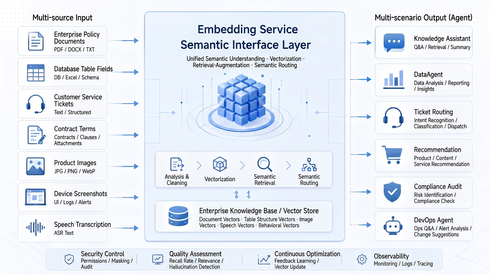
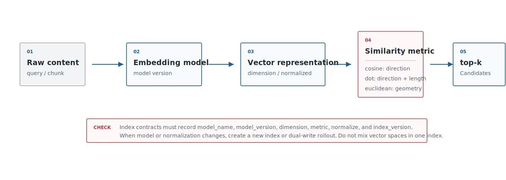
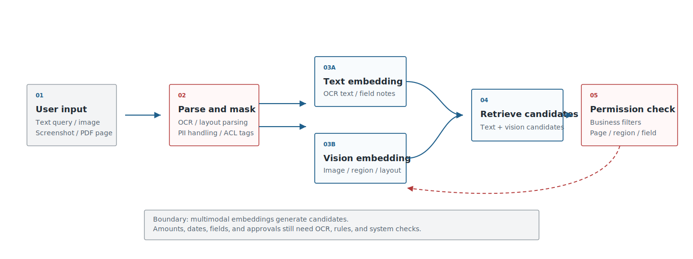
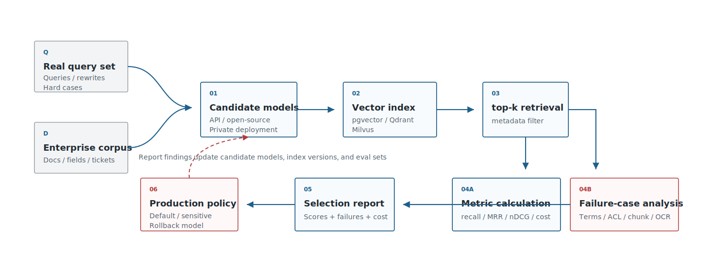

# Chapter 16 Embedding Models

---

## Chapter Summary

This chapter introduces the role of embedding models in the enterprise knowledge supply chain, emphasizing how text, code, images, and structured semantics can be represented as searchable vectors. Embeddings determine whether enterprise knowledge can be accurately recalled: when document language, domain terminology, and retrieval intent deviate from general corpora, out-of-the-box embeddings tend to rank relevant content lower in results. This chapter explains the principles of vector representation and similarity measurement, provides criteria for selecting text and multimodal embedding models, and presents an evaluation framework covering recall quality, latency, and cost.

## Key Terms

Embedding model, vector representation, similarity measurement, multimodal embedding, model selection, recall quality

## Learning Objectives

- Explain how text, code, and images are embedded as vectors, and the differences between common similarity metrics.
- Judge whether general embedding models suffice based on document language, domain terms, and search intent.
- Select suitable embedding model combinations for multimodal retrieval scenarios.
- Design an evaluation framework that covers recall, latency, and cost for embedding models.

---

## Opening Scenario

When enterprises implement RAG, DataAgent, customer service agents, or multimodal retrieval, their first instinct is often to pick a vector database. But an earlier, more fundamental decision is embedding: what content should be vectored, who generates the vectors, which problems vectors solve, and which must be handled by keyword search, access control, reranking, or manual review.

From industry products, embedding has become a foundational layer for enterprise search and agent platforms. Azure AI Search integrates vector, hybrid, and filtered search in one system; Google Vertex AI Vector Search supports semantic search, recommendations, and generative AI applications via vector indexes; Amazon Bedrock Knowledge Bases orchestrate document chunking, embedding generation, vector store insertion, and RAG retrieval as managed workflows. Although these product paths differ, embedding is treated as the "middle layer" connecting business content to large model applications, rather than a standalone model novelty.

This chapter unfolds around five questions: which business scenarios first use embeddings in enterprises, how vector similarity is computed, how to select text embedding models, what gaps multimodal embeddings fill, and how enterprises can establish their own evaluation framework.

---

## 16.1 Enterprise Use Cases for Embedding Models

The most common problem in enterprises is not "lack of data," but the fact that the same thing is expressed differently across systems. Employees might ask conversationally, "How soon after business travel must I submit expenses?" while the policy says, "Applications must be submitted within fifteen working days after returning." Business analysts may say "high ticket stores," while data warehouses record `avg_order_value_store_segment`. Onsite photos, scanned receipts, and dashboard screenshots contain information hard to capture in text fields. Without stable mappings between these expressions, RAG, DataAgent, and customer service agents often fail in their first retrieval step.

Embedding provides semantic candidate generation here: it maps natural language questions, policy fragments, field descriptions, contract clauses, image captions, and more into a searchable semantic space. Although embedding does not guarantee correct answers, it can find potentially relevant evidence, fields, cases, or images first. Table 16-1 presents common entry points for enterprise embedding from this perspective: rather than isolated solutions, they share a semantic candidate capability feeding different business processes.

*Table 16-1: Typical enterprise embedding business entry points. Source: compiled by this book.*

| Business Entry | Actual Input | Embedding Finds | Downstream Systems |
|---|---|---|---|
| Enterprise Knowledge Base | Employees' conversational questions, policy documents, manuals | Relevant policy snippets, FAQs, citing evidence | Knowledge assistants, HR/Finance assistants |
| Customer Service & Tickets | New ticket descriptions, historical tickets, handling logs, quality tags | Similar faults, root causes, handling plans | Customer service agents, ticket routing, quality control |
| DataAgent | Business questions, metric definitions, field comments, SQL examples | Metrics, dimensions, table fields, historic queries | NL2SQL, ChatBI, semantic layer |
| Legal & Compliance | Contract clauses, approval notes, risk tags | Similar clauses, similar risks, historical processing notes | Legal agents, compliance audits |
| Product & Operations | Titles, categories, reviews, images, operations notes | Similar products, duplicate SKUs, similar review clusters | Recommendation, deduplication, operations workbench |
| R&D & Operations | Error stacks, issues, runbooks, release notes | Similar incidents, fix plans, dependency changes | DevOps agents, R&D assistants |
| Multimodal Inspection | Equipment photos, quality images, screenshots, OCR text | Similar defects, similar pages, relevant notes | QC agents, onsite inspection assistants |

Downstream systems differ, but the embedding role is consistent: first find candidates, not make decisions. Customer service uses embedding to find similar prior cases, DataAgent to find field and metric explanations, legal to find similar clauses, RAG to find referenceable documents. Whether it can answer or execute actions depends on access control, reranking, citation validation, tool invocation, and manual review.

For DataAgent, the first high-value embedding targets are not long documents but semantic layer assets: metric definitions, dimension explanations, field comments, table relations, historic SQL, business terms, and report screenshots. When a user asks "What is the repurchase trend for high ticket stores?" embedding first maps "high ticket" to metric definitions, "store" to dimension, "repurchase trend" to computable fields, then passes this to NL2SQL or analysis agents. Embedding provides candidates; semantic layer and execution engines provide constraints.

From platform leaders' perspective, the next step isn't expanding entry points but stratifying risk. Table 16-2 replaces “scenario popularity” with risk tiers, as different scenarios have very different tolerance for errors despite similar semantic search use.

*Table 16-2: Risk stratification of enterprise embedding scenarios. Source: compiled by this book.*

| Risk Tier | Scenario | Quality Goals | Platform Requirements |
|---|---|---|---|
| Low-risk, high-frequency | Policy Q&A, product manuals, FAQs, internal wiki | High recall, low latency, low cost | API models or lightweight open-source to establish baseline |
| Mid-risk business assistance | Tickets, DataAgent schema linking, R&D & Ops | Candidate accuracy, analyzable errors, replayability | Internal eval sets, hard negatives, rerankers |
| High-risk compliance | Contracts, finance, legal, security audits | Access correctness, sufficient evidence, auditability | Private deployment, audits, field-level permissions, human review prioritized |

Table 16-2 brings the discussion back from model strength to risk boundaries. The same embedding model may suffice for employee Q&A but only serve recall in contract review. Enterprise platforms must clarify use boundaries: embeddings return candidates, not facts; similar clauses are not risk judgments; similar tickets are not root cause confirmations; similar fields are not SQL execution approvals.

With risk layering, platform decisions rise above “Is embedding useful?” Table 16-3 then addresses three investment questions: within which boundaries to introduce embeddings, whether to platformize, and when governance and manual review are required.

*Table 16-3: Platform leader decisions on embeddings. Source: compiled by this book.*

| Decision Question | Recommended Judgement |
|---|---|
| Use commercial APIs first? | Non-sensitive KB and PoCs can start with API baseline; sensitive contracts, finance, HR data require early private deployment evaluation. |
| Tune/fine-tune now? | Build internal query sets and hard negatives first, then decide on tuning; without eval sets, tuning results are irreproducible. |
| Build dedicated embedding platform? | Worth platformizing when knowledge bases, DataAgent, customer service, legal share; lightweight integration suits low-frequency single apps. |
| Use multimodal embedding? | Introduce when visual evidence like receipts, screenshots, inspection photos exist; pure text KB need not complicate early. |
| Minimum launch criteria | Permissions filtering, model versions, index versions, recall evaluation, failure cases, human review boundaries. |

These three steps encapsulate a pattern repeated when discussing models, vector databases, and evaluation: identify embedding’s business entry points, stratify by error risk, then decide on platform investment and launch criteria. Returning to Figure 16-1’s enterprise capability chain, embedding is only one segment: it generates semantic representations from business content, then requires indexing, permissions, evaluation, and orchestration to go live.


*Figure 16-1: Enterprise embedding capability chain. Source: own drawing. Alt text: A horizontal chain from document/query input, embedding model encoding, vector indexing, similarity retrieval, to result return, arrows indicate raw content transformed into searchable state by embedding.*

If Figure 16-1 focuses on a single capability chain, Figure 16-2 highlights the platform cross-section. A stable semantic interface layer is required between documents, images, semantic layer assets, and business applications. Embedding’s platform value is primarily here.



*Figure 16-2: Semantic interface layer in enterprise-level agent platforms. Source: own drawing. Alt text: The layered diagram shows embedding services as the semantic interface layer, connecting downward to vector databases and document sources, and upward providing unified vectorization and retrieval interfaces for multiple agents such as RAG and knowledge assistants.*

---

## 16.2 Vector Representations and Similarity Computations

Embedding models output sets of floating-point numbers. For engineering teams, these can be understood as “semantic fingerprints”: similar content is closer in vector space, dissimilar is farther away. OpenAI’s embeddings docs use them to measure text relevance; Google’s embeddings docs describe embeddings as fixed-dimension numerical vectors. Although this sounds simple, it influences index design, version control, access filtering, and online debugging.

Table 16-4 lists the three most common similarity metrics in engineering. The choice is not a matter of math preference but must align with model output, normalization strategy, and index creation parameters.

*Table 16-4: Comparison of common vector similarity metrics. Source: compiled by this book.*

| Metric | Intuition | Typical Use | Engineering Notes |
|---|---|---|---|
| Cosine similarity | Compares vector directions | Text semantic search, similar cases, knowledge QA | Normalize vectors consistently between model service and vector store |
| Dot product | Accounts for direction and length | Supported by many embedding APIs and vector libraries | Mixing different models or normalization strategies breaks results |
| Euclidean distance | Compares geometric distances | Clustering, classical ML, some retrieval tasks | Distance intuition weakens in high-dimensional spaces |

These metrics eventually come down to the short but critical pipeline illustrated in Figure 16-3: raw content is encoded to vectors via model service, vector store computes similarity with a unified metric, and candidates are returned. For debugging, verify model version, normalization, metric, and index version consistency along this chain.



*Figure 16-3: Vector generation and similarity computation pipeline. Source: own drawing. Alt text: Left side shows text tokenized and encoded to vector, right side shows query vector similarity computation (cosine/dot product) with index vectors and sorting, arrows indicate full process from text to similarity scoring.*

If vectors are normalized, cosine similarity and dot product rankings closely align; if not, vector length affects ranking. Enterprise systems must not only write `similarity="cosine"` in code but also record whether the model outputs normalized vectors, the metric used during index creation, and whether queries are normalized at runtime. Otherwise, model upgrades or vector store migrations cause unexplained score shifts.

Several engineering facts should be part of the platform contract:

**Do not mix vectors from different models in the same index.** Vectors from model A and model B lie in different vector spaces. Using old-model document vectors with new-model query vectors degrades performance. Correct practice is to store `model_name`, `model_version`, `dimension`, and `index_version` in index metadata and create a new index or dual-write during upgrades.

**Dimensionality impacts cost.** High-dimensional vectors increase storage, memory, index construction time, and query latency. Cohere embeddings let users adjust output dimension via `output_dimension`, explicitly trading off quality and cost. Open-source models share similar trade-offs; offline quality scores alone are insufficient without throughput, hardware cost, and index size considerations.

**Vector similarity ≠ answer correctness.** Users querying “How to handle overdue reimbursements?” may get back similar materials like “reimbursement limits” or “approval authorities,” which don’t directly answer the query. Mature RAG systems combine embedding recall with keyword search, metadata filtering, reranking, and citation verification.

**Access control must be explicitly enforced outside vectors.** The embedding space does not encode who can view which contract, report, or employee record. Tenant, department, role, document state, and effective date must be stored as metadata in the index. Azure AI Search’s filtered vector search productizes such needs: vectors handle similarity, filtering fields handle access boundaries.

A production-grade embedding record must at minimum support auditing, rollback, and rebuilding.

```json
{
  "source_id": "policy-2026-hr-001",
  "chunk_id": "policy-2026-hr-001#p12#c03",
  "content_type": "text",
  "text_hash": "sha256:...",
  "embedding": [0.014, -0.031],
  "model_name": "bge-m3",
  "model_version": "2026-embedding-baseline",
  "dimension": 1024,
  "normalized": true,
  "metric": "cosine",
  "index_version": "kb-hr-v7",
  "metadata": {
    "tenant_id": "tenant-a",
    "department": "hr",
    "acl": ["hr", "finance_manager"],
    "source_version": "v3",
    "effective_at": "2026-01-01",
    "created_at": "2026-06-03"
  }
}
```

This record’s value appears when incidents arise. When business questions a particular answer, the platform team must explain: which model, which index version, which document batch, what filters, which chunks were recalled, and which evidence was cited. Without fields like these, embedding systems turn into opaque black boxes difficult to audit.

---

## 16.3 Text Embedding Model Selection

Text embedding selection should not start by picking the "top-ranked" model. Benchmarks like MTEB are valuable because they compare models on unified tasks; but enterprises deploy on their own policies, contracts, products, tickets, field notes, and jargon. Public leaderboards offer candidates, not substitutes for internal evaluation.

The first candidate pool can cover the four routes in Table 16-5. This section compares routes rather than models, because commercial APIs, open-source private deployment, domestic ecosystems, and industry-specialized models have very different organizational constraints.

*Table 16-5: Trade-offs of text embedding model routes. Source: compiled by this book.*

| Approach | Advantages | Cost | Applicable Scenarios | Mini-platform Choice |
|---|---|---|---|---|
| Commercial APIs (OpenAI Embedding, Cohere Embed, Voyage) | Fast integration, stability, complete docs and SDKs, suitable for initial baseline | Must evaluate data leakage, unit cost, quotas, vendor lock-in, cross-region compliance | Rapid PoCs, non-sensitive KB, multilingual KB, SaaS-first teams | Optional provider for non-sensitive baseline evaluation |
| Open-source general models (BGE-M3, E5, GTE, Jina) | Private deployment, strong control, facilitates long-term platform capability | Requires inference service, model evaluation, resource orchestration, version governance, daily ops | Chinese/multilingual KB, customer tickets, field explanations, long-term platform building | Default private deployment candidate, prioritized in benchmark |
| Domestic ecosystem models (Qwen3 Embedding) | Easier integration into domestic model ecosystems, private cloud, hardware ecosystems | Monitor version updates, inference adaptation, long-text costs, ecosystem maturity | Domestic enterprises, private clouds, strong localization requirements | Domestic candidate, evaluated alongside default private baseline |
| Industry-specific models (finance, healthcare, legal, customer service) | May improve domain terminology, industry expressions, professional corpora recall | Higher migration cost, transparency, licensing boundaries, evaluation cost; generalization requires verification | Terminology-intensive, high-cost errors, established domain corpora | Not default; included only if domain-specific evaluation significantly favors |

The BGE-M3 model card highlights multi-lingual, multi-functional, multi-granular capabilities, suitable as an open-source baseline for Chinese and multilingual enterprise knowledge bases. Qwen3 Embedding emphasizes multilingual abilities, fitting teams already using Qwen LLMs for localized evaluation. OpenAI Embedding’s advantages are quick integration, full documentation, and stable service, suitable as first SaaS baseline. Cohere differentiates queries and documents by input_type, a detail worth codifying: user questions differ from searchable documents, and model services must distinguish these roles.

Once routes are settled, go to Table 16-6’s selection criteria, breaking “Is the model strong?” into evaluable questions. Teams thus discuss language coverage, deployment boundaries, cost, and version governance—factors affecting deployment—rather than leaderboard ranks.

*Table 16-6: Text embedding model selection dimensions. Source: compiled by this book.*

| Dimension | Questions to Ask | Impact |
|---|---|---|
| Language & terminology | Are Chinese, English, cross-lingual, industry acronyms, internal slang covered? | Recall quality and hard negative difficulty |
| Text length | Do policies, contracts, field notes, or table transcriptions exceed model effective length? | Chunking strategy and long document recall |
| Deployment | Support for API, private cloud, offline, domestic hardware? | Data compliance, operational cost, deployment cycle |
| Vector dimensions | Vector dimensions, reducibility, normalization? | Storage, memory, index rebuilding, latency |
| Inference performance | Batch size, concurrency, CPU/GPU cost, p95 latency? | Online queries and offline rebuilding speed |
| Ecosystem | Support for rerankers, sentence-transformers, TEI, vector store adapters? | Engineering integration cost |
| Version governance | Controlled model upgrades? Ability to keep old index and rollback? | Online stability |

These dimensions directly shape the first candidate pool. Table 16-7 organizes candidates more conservatively: at least one representative per route runs on the same internal eval set, avoiding betting on a single model too early.

*Table 16-7: First-round text embedding candidate models. Source: compiled by this book.*

| Candidate | Positioning | Usage |
|---|---|---|
| OpenAI Embedding | SaaS baseline | Run quality and latency baseline on non-sensitive KB first |
| BGE-M3 | Open-source private baseline | Main candidate for Chinese policies, customer tickets, field notes |
| Qwen3 Embedding | Domestic ecosystem candidate | Evaluated alongside Qwen LLM and domestic inference |
| E5/GTE/Jina | Control group | Verify if public models suffice, avoid single-model bias |

The candidate table is not a final verdict. Its value is ensuring evaluation coverage of diverse routes: SaaS baseline sets quality upper bound, private baseline evaluates long-term platform potential, domestic candidate assesses deployment synergy, control group prevents model bias.

Connecting routes, dimensions, and candidate pool forms the selection process in Figure 16-4. This process is no longer “pick the strongest model,” but filter by business risk and deployment constraints, compare candidates internally, then stratify conclusions by scenario. This approach discourages “one model to rule the company.”


*Figure 16-4: Text embedding model selection process. Source: own drawing. Alt text: Decision flow starting from language/terminology coverage, data sensitivity, latency/cost requirements; filters out API or private models; ends with evaluation baselines to reflect constraint-based selection.*

Final selection reports should maintain stratified conclusions as in Table 16-8, not just specify a single model name.

*Table 16-8: Stratified conclusions in text embedding selection reports. Source: compiled by this book.*

| Scenario | Recommended Conclusion Wording |
|---|---|
| General knowledge bases | Select models stable in recall and latency, ensure cited evidence appears in top-k first |
| Sensitive data | Prefer private, auditable models with long-term maintainability |
| Terminology-intensive cases | Supplement terminology lists, field notes, hard negatives before deciding on tuning |
| High-risk Q&A | Embedding only serves first-stage recall; must pair with reranker, citation verification, and human review |

This section’s message is clear: enterprises don’t buy a “semantic search ability” by selecting one embedding model, but build a continuously iterated retrieval baseline. Models update, documents change, business terms evolve. Without internal eval sets, any model conclusion quickly expires.

---

## 16.4 Multimodal Embeddings and Visual Retrieval

Multimodal embeddings embed text, images, screenshots, scanned pages into a comparable semantic space. CLIP is the classic origin, showing that images and natural language align through contrastive learning; SigLIP improved image-text pretraining objectives; ColPali treats pages as visual objects, suited to visually rich document retrieval. Cohere Embed v4 adds image embeddings and adjustable output dimensions, reflecting the enterprise shift from “pure text chunk” retrieval to “text, image, and page layout jointly involved.”

Multimodal embeddings primarily fill gaps in traditional pipelines: when key information lies in page layout, image similarity, or screenshot context, pure text retrieval often falls short. Table 16-9 lists scenarios and pre-launch controls to avoid seeing multimodal retrieval as simple "image search."

*Table 16-9: Enterprise scenarios and launch controls for multimodal embedding. Source: compiled by this book.*

| Scenario | Traditional Problem | Role of Multimodal Embedding | Pre-launch Control |
|---|---|---|---|
| Quality & inspection | Defect photos hard to fully describe in text | Use images to find similar defects, supplier batches, historical cases | Image permissions, shooting standards, false positive review |
| Contracts and receipts | OCR extracts text but seals, layout, tables are lost | Find similar clauses, monetary areas, approval markings by page image | Page references, amount verification, manual review |
| Dashboard screenshots | Users submit only screenshots, unknown metric names | Align screenshots with metric descriptions, report docs, field notes | Screenshot desensitization, version recognition, field mapping |
| Product search | Image, title, and comments capture different similarities | Joint image-text recall for similar products, substitutes, duplicates | Category filters, stock and price constraints |
| Equipment maintenance | On-site photos inconsistent with fault descriptions | Find similar equipment states, repair records, runbooks | Equipment permissions, time/location, poor image handling |

Multimodal retrieval cannot replace document parsing. Contract amounts, receipt dates, dashboard metrics still require OCR, table parsing, rule verification, and business system data confirmation. A more robust architecture is: OCR and layout parsing produce verifiable, structured content; multimodal embedding generates visual similarity, layout similarity, and text-image related candidates.

Hence multimodal retrieval is better approached as two complementary streams in Figure 16-5: OCR/parsing produces referenceable text and structured fields; multimodal embedding produces visual similarity candidates. Both meet at evidence verification and manual review.



*Figure 16-5: Multimodal retrieval data flow. Source: own drawing. Alt text: Images and text separately encoded into a shared vector space, allowing cross-modal retrieval; arrows indicate image-to-image and text-to-image search sharing the same vector index.*

Enterprise deployments often fall into two traps. First, directly indexing screenshots, receipts, and inspection photos spreads sensitive fields like customer names, addresses, amounts, and device IDs into the retrieval system. Second, treating visual similarity as business equivalence: two similar defect images do not imply the same root cause; page layout similarity does not imply identical clause risk. Multimodal embedding is better as a candidate generator; final judgments rely on business rules, structured fields, cited evidence, and manual review.

During requirements interviews, ask whether visual evidence like Figure 16-6 actually impacts retrieval and decision-making: do screenshots, receipts, inspection photos, dashboard pages truly affect outcomes? If not, enterprises need not adopt multimodal embedding prematurely.


*Figure 16-6: Enterprise multimodal retrieval scenarios. Source: own drawing. Alt text: Lists quality inspections, contract screenshots, product images, ticket photos, labeling the retrieval problems solved by image embeddings, illustrating multimodal embedding enterprise use cases.*

---

## 16.5 Enterprise Embedding Model Evaluation Framework

Enterprise embedding evaluation is not about ranking models overall but deciding if a business scenario is deployable, costs are acceptable, and failures can be audited. Public benchmarks help filter candidates, but internal query sets are mandatory pre-launch.

Table 16-10 defines five minimal evaluation set objects. Together, they define what counts as “correct retrieval” and enable comparison across models, indexes, and filters.

*Table 16-10: Basic objects in embedding evaluation sets. Source: compiled by this book.*

| Object | Content | Example |
|---|---|---|
| Query | Real user questions, reformulations, colloquial, cross-language | “How soon must expenses be submitted after business travel?” |
| Golden docs | Documents, chunks, field notes, or page areas that should be recalled | `travel-policy#p12#c03` |
| Hard negatives | Semantically close but cannot answer | Reimbursement limit policy, approval authority description |
| Metadata filter | Department, tenant, permissions, time, document status | `department=finance` |
| Judgment | Relevant, partially relevant, irrelevant; whether supports final answer | `relevant / partial / irrelevant` |

Metrics should also be viewed hierarchically as in Table 16-11. Focusing only on recall@10 can mislead because candidates in top-10 are not guaranteed to support final answer citation; quality, latency, cost, and access control must be reported together.

*Table 16-11: Enterprise embedding evaluation metrics. Source: compiled by this book.*

| Metric | What It Reflects | Suitable Audience |
|---|---|---|
| recall@k | Whether correct evidence is in top-k candidates | Retrieval engineers, architects |
| MRR | Whether correct evidence ranks earlier | Retrieval engineers |
| nDCG | Ordering quality for multiple relevant results | Evaluation managers |
| answer citation hit rate | Whether final answer cites correct evidence | RAG managers, business owners |
| p50/p95 latency | Query latency acceptability | Platform leaders |
| cost/query | Cost per query or per thousand queries | CTO, platform leaders |
| index size / rebuild time | Storage, DR, upgrade costs | Architects, Ops |
| permission violation rate | Whether unauthorized content is recalled | Security, compliance officers |

Evaluation reports should also cover these pre-launch engineering checkpoints in Table 16-12. The goal is not long audit documents but letting platform owners know “if it can launch” and “how to roll back on issues.”

*Table 16-12: Engineering checkpoints before embedding launch. Source: compiled by this book.*

| Checkpoint | Confirm | Common Failures |
|---|---|---|
| Access filtering | Queries and recalls filtered by tenant, department, role, doc state | Recall then filter allows unauthorized content leaking to logs/traces |
| Model versions | Document vectors, query vectors, index versions share one model space | Query model upgraded but old index not rebuilt |
| Index rebuilding | Full rebuild, incremental update, failure recovery, rollback plans exist | Chaos in index versions post document updates |
| Cost accounting | Distinguish offline build cost, online query cost, reranker cost | Only embedding unit price watched, ignoring rerank and rebuild |
| Observability | Record query, top-k, filters, cited evidence, latency, model version | Cannot audit when production quality declines |
| Manual review | High-risk scenarios have approval, rejection, appeal interfaces | Contract, finance, compliance Q&A treated as fully automatic conclusions |

This evaluation framework can be solidified as mini-platform Project 13. Currently `mini-platform/infra/vectorstore/__init__.py` is a placeholder. This chapter clarifies inputs, configs, run commands, and report structure for subsequent demos.

```text
mini-platform/projects/13-embedding-vector-benchmark/
├── README.md
├── requirements.txt
├── run.sh
├── data/
│   ├── docs/
│   │   ├── travel-policy.md
│   │   ├── reimbursement-guide.md
│   │   └── product-quality-faq.md
│   └── evals/
│       └── retrieval_queries.jsonl
├── configs/
│   ├── openai.yaml
│   ├── bge_m3.yaml
│   └── qwen3_embedding.yaml
├── reports/
│   └── embedding_benchmark.md
└── src/
    ├── embed.py
    ├── index.py
    ├── retrieve.py
    └── evaluate.py
```

Sample evaluation queries can be like:

```json
{
  "query_id": "q-001",
  "query": "How soon must expenses be submitted after business travel?",
  "golden_chunk_ids": ["travel-policy#p12#c03"],
  "hard_negative_chunk_ids": ["reimbursement-guide#p02#c01"],
  "metadata_filter": {
    "department": "finance"
  },
  "risk_level": "medium"
}
```

Config files should specify not only model name but dimension, normalization, batch size, index metric, and cost accounting.

```yaml
provider: local
model_name: BAAI/bge-m3
model_version: 2026-embedding-baseline
dimension: 1024
normalized: true
metric: cosine
batch_size: 32
top_k: 10
cost:
  unit: local_gpu_hour
  estimate: manual
index:
  backend: qdrant
  collection: enterprise_policy_benchmark
  version: kb-hr-v7
```

Run command remains simple:

```bash
cd mini-platform/projects/13-embedding-vector-benchmark
./run.sh --config configs/bge_m3.yaml --top-k 10
```

Reports should output scores and failure cases. For enterprises, failure cases are often more valuable than averages: they reveal problems in models, chunking, OCR, filtering, field notes, or query reformulation. Figure 16-7’s Project 13 dataflow design follows this principle: the same query sets, golden docs, hard negatives, and filters are evaluated simultaneously across multiple model/index combos, avoiding “model A uses one dataset, model B another” comparability issues.



*Figure 16-7: Embedding benchmark data flow. Source: own drawing. Alt text: Evaluation process from labeled queries, through candidate model encoding, retrieval, recall@k and latency computation, to comparative reports, arrows show lateral comparison of models on same evaluation set.*

Upon this dataflow, internal reports fit stratified conclusions like in Table 16-13.

*Table 16-13: Example conclusions from embedding benchmark reports. Source: compiled by this book.*

| Conclusion | Example |
|---|---|
| Default model | BGE-M3 shows stable recall in Chinese policy Q&A, suitable as private baseline |
| SaaS baseline | OpenAI Embedding has good latency and stability, suitable for quick launch of non-sensitive KB |
| High-risk scenarios | Contracts and finance Q&A must add reranker, citation verification, and manual review |
| Main failure causes | Business terms like "high ticket," "payment terms," "rebates" need terminology lists and hard negatives |
| Next steps | Expand eval sets, add table-type documents and multimodal screenshot retrieval |

Evaluation should not stop post-launch. Every model upgrade, chunk policy change, vector store migration, or document rebuild must rerun benchmarks, preserving rollback paths to older models and indexes. Enterprise platforms must institutionalize not a model name but a mechanism ensuring every semantic retrieval change is evaluable, explainable, and reversible.

---

## References

- Azure AI Search vector search overview: [https://learn.microsoft.com/en-us/azure/search/vector-search-overview](https://learn.microsoft.com/en-us/azure/search/vector-search-overview)
- Azure AI Search hybrid search overview: [https://learn.microsoft.com/en-us/azure/search/hybrid-search-overview](https://learn.microsoft.com/en-us/azure/search/hybrid-search-overview)
- Google Vertex AI Embeddings APIs overview: [https://cloud.google.com/vertex-ai/generative-ai/docs/embeddings](https://cloud.google.com/vertex-ai/generative-ai/docs/embeddings)
- Google Vertex AI Vector Search overview: [https://cloud.google.com/vertex-ai/docs/vector-search/overview](https://cloud.google.com/vertex-ai/docs/vector-search/overview)
- Amazon Bedrock Knowledge Bases overview: [https://docs.aws.amazon.com/bedrock/latest/userguide/knowledge-base.html](https://docs.aws.amazon.com/bedrock/latest/userguide/knowledge-base.html)
- Amazon Bedrock Knowledge Bases supported models and vector stores: [https://docs.aws.amazon.com/bedrock/latest/userguide/knowledge-base-supported.html](https://docs.aws.amazon.com/bedrock/latest/userguide/knowledge-base-supported.html)
- OpenAI Embeddings guide: [https://platform.openai.com/docs/guides/embeddings](https://platform.openai.com/docs/guides/embeddings)
- BGE-M3 model card: [https://huggingface.co/BAAI/bge-m3](https://huggingface.co/BAAI/bge-m3)
- Qwen3 Embedding model card: [https://huggingface.co/Qwen/Qwen3-Embedding-8B](https://huggingface.co/Qwen/Qwen3-Embedding-8B)
- MTEB leaderboard: [https://huggingface.co/spaces/mteb/leaderboard](https://huggingface.co/spaces/mteb/leaderboard)
- Cohere Embeddings docs: [https://docs.cohere.com/docs/embeddings](https://docs.cohere.com/docs/embeddings)
- Cohere Embed Multimodal v4: [https://docs.cohere.com/changelog/embed-multimodal-v4](https://docs.cohere.com/changelog/embed-multimodal-v4)
- OpenAI CLIP: [https://openai.com/index/clip/](https://openai.com/index/clip/)
- SigLIP paper: [https://arxiv.org/abs/2303.15343](https://arxiv.org/abs/2303.15343)
- ColPali paper: [https://arxiv.org/abs/2407.01449](https://arxiv.org/abs/2407.01449)
