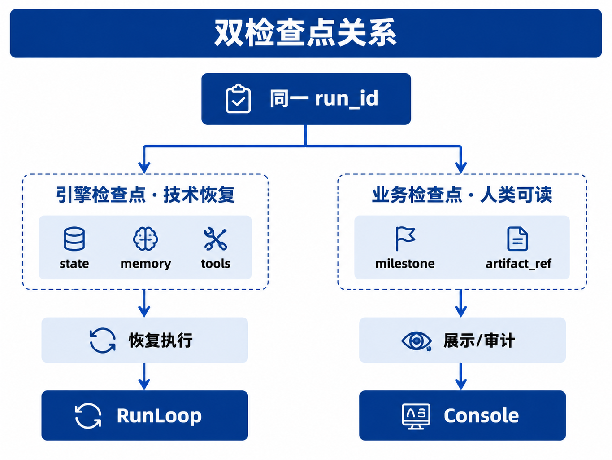

# 第30章 Human-in-the-loop 与长任务

---

## 本章摘要

人工介入和长任务都要进入 Agent Runtime 的状态机。企业 Agent 不应把所有动作都推向全自动；高风险动作前要能停下来，让合适的人确认，并在确认后沿同一个 Run 继续执行。长任务也不能长期占用 HTTP 连接，必须用检查点和异步队列支持暂停、恢复、取消和审计。`waiting_human` 状态串起审批模式、人工决策留痕、两类检查点和长任务队列，是保证 Agent 可控运行的关键状态。

## 关键词

Human-in-the-loop、审批、waiting_human、长任务、检查点、业务回放

## 学习目标

- 能说明 HITL 为什么是高风险 Agent 的治理能力，而不是模型能力不足时的补丁。
- 能把审批设计为同一 Run 内的暂停和恢复，而不是新建任务。
- 能区分引擎检查点和业务检查点，并说明它们分别服务恢复和展示。
- 能为长任务设计异步执行、SLA、取消和审计导出。

---

## 场景引入

第22章把 `waiting_human` 定义为 Run 六态之一。它表示 Runtime 有意暂停，正在等待 Console 或人工回调。这个状态在生产系统里非常常见：报告草稿已经生成，但还不能对外发送；折扣方案已经算出，但超过阈值需要经理确认；合同风险点已经抽取，但法务需要先看证据。

如果没有 HITL，Agent 容易把“看起来合理”的结果直接变成系统动作。未经审核的竞品描述可能被发到区域经理群，错误折扣可能写入主数据，含个人信息的报告可能被外发。Amershi 等人关于交互式机器学习的研究强调，人应是有控制权的协作者，而不是被动标注机 (Amershi et al. 2014; Mosqueira-Rey et al. 2023)。企业 Agent 中的人工介入，正是这个原则的工程化表达。

以区域经营分析报告为例。DataAgent 可以生成销售下滑原因、库存建议和对外沟通口径。SQL 查询和图表生成可以自动完成，但“是否把这份报告发给区域经理”是另一个动作。前者是分析过程，后者是组织承诺。HITL 要拦截的是后者：审批人看到报告正文、数据版本、关键 SQL 摘要和模型建议后，决定发布、驳回或要求重写。

长任务还有另一个问题。季度分析、批处理 SQL、外部 A2A Task 和多轮报告修改可能持续数小时。系统不能让一个 HTTP SSE 连接一直占着 Worker，也不能在用户关闭页面后丢失任务。Runtime 必须用异步队列和检查点，把“等机器”和“等人”纳入同一个 `run_id` 生命周期。

---

## 30.1 HITL 的设计目标

### 30.1.1 人工介入的治理目标

HITL 和聊天里的追问不是一回事。澄清问题用于补全任务输入，人工审批用于授权 Agent 执行动作。前者常发生在规划前，后者发生在 Runtime 准备执行高风险动作或发布 artifact 之前。

企业引入 HITL 通常为了四类目标。

*表30-1：HITL 的目标与无人工介入时的风险。来源：本书整理。*

| 目标 | HITL 负责什么 | 缺失后的风险 |
|---|---|---|
| 授权 | 金额、折扣、发布、写操作由具备权限的人确认 | 越权自动化 |
| 质量 | 报告、代码、客服话术在关键节点被复核 | 事实错误或品牌风险 |
| 合规 | 隐私、广告法、反垄断、行业监管要求可追踪 | 处罚和审计失败 |
| 学习 | 人工拒绝和修改进入评测与样本闭环 | 同类错误反复出现 |

金融、医疗、政务、零售营销等场景都可能要求人类监督 (EU AI Act 2024; NIST 2023)。但就算没有外部监管，企业也需要把风险动作放进组织授权体系。Agent 只是发起者之一，不应绕过已有审批链。

### 30.1.2 `waiting_human` 的 Runtime 状态语义

审批必须进入 Run 六态的 `waiting_human`，而不是写在某个 Agent 应用的 if/else 里。原因很直接：只有 Runtime 状态知道当前 Run 是否暂停、是否能恢复、是否应该继续推送 SSE、检查点是否完整、审批超时后该怎么处理。

进入 `waiting_human` 时，Runtime 不能只改一个状态字段。它要写引擎检查点，保存 Run 状态、Memory、Tool 结果和等待中的审批信息；也要写业务检查点，让 Console 能展示“报告草稿已生成，待审批”；同时推送 `approval_request` 事件，让前端或工单系统生成待办。

如果审批只是业务代码里的一个字段，进程重启后 Runtime 可能不知道该从哪里恢复；如果审批通过后重新 POST `/run`，发布工具可能被执行两次；如果拒绝审批后静默结束，用户和审计系统都无法知道任务为何失败。

### 30.1.3 全自动与人工介入的边界

只读查询、内部预览和低风险草稿可以全自动。写工单、改主数据、对外邮件、合同发布和高金额折扣应默认触发 Policy，进入 `waiting_human` 或更严格的审批链。自动化测试环境可以关闭 HITL，但这个开关应由环境和租户策略控制，不能由模型决定。

HITL 的基本规则可以概括为三条：写操作默认可拦截；审批在同一个 `run_id` 上恢复；审批超时必须有策略。无限挂起的审批不是安全设计，只是把风险推迟到没人处理。

在架构评审里，可以要求每个高风险工具都回答四个问题：谁有权批准，批准前能看到什么证据，批准后允许执行哪些动作，拒绝后任务怎样结束。回答不了这四个问题，说明工具还不适合接入自动化链路。HITL 不负责兜底所有错误；它把组织授权变成 Runtime 可执行、可审计的状态迁移。

---

## 30.2 审批模式与事件契约

### 30.2.1 前置审批、后置审批与分级审批

审批模式取决于风险动作发生在哪一步。前置审批是在工具执行前暂停，适合大额转账、删库、改主数据等动作。后置审批是在草稿 artifact 生成后、发布类副作用发生前暂停，适合报告发送、邮件群发、公告发布。分级审批用于经理、总监、法务等多角色会签。

*表30-2：常见审批模式。来源：本书整理。*

| 模式 | 行为 | 适用场景 |
|---|---|---|
| 前置审批 | 展示拟执行工具和参数，批准后才执行 | 高风险写操作、删除、转账 |
| 后置审批 | 先生成草稿，批准后才发布或外发 | 报告、邮件、公告、营销内容 |
| 分级审批 | 多个 `waiting_human` 节点串联 | 合同、采购、对外声明 |
| Reviewer Agent + 人 | Agent 先筛，低风险自动通过，高风险升级 | 大批量内容审核 |

经营报告适合后置审批：Report Agent 先调用 `render_report` 生成草稿并写入 Memory，Runtime 进入 `waiting_human`，Console 展示报告预览；审批通过后，Workflow Agent 才调用 `publish_report`。草稿已经生成，发布类副作用尚未发生。

### 30.2.2 SSE 与审批回调

Console 需要通过 SSE 感知审批状态。`approval_request` 应带上待办标题、artifact 引用、允许动作和过期时间；`approval_result` 应带上审批人、结论和备注。

```text
event: state
data: {"run_id":"run-8f3a","state":"waiting_human","step_index":4}

event: approval_request
data: {"approval_id":"ap-001","run_id":"run-8f3a","title":"Q1 华东毛利报告发布","artifact_ref":"mem://run-8f3a/report_md","requested_actions":["publish_report"]}

event: approval_result
data: {"run_id":"run-8f3a","decision":"approved","approver_id":"u-director-001","comment":"口径已确认"}
```

审批回调可以表达为：

```http
POST /runs/{run_id}/approvals/{approval_id}
Content-Type: application/json

{
  "decision": "approved",
  "comment": "口径已与财务确认",
  "approver_id": "u-director-001"
}
```

Runtime 收到回调后要校验三件事：Run 当前确实处于 `waiting_human`；`approval_id` 与检查点匹配；审批人角色满足 Policy。通过后触发 `approved` 迁移，从引擎检查点恢复 Planner 上下文继续执行。同一 `approval_id` 重复 approved 必须幂等，不能重复调用发布工具。

### 30.2.3 Policy 触发条件

Policy 决定哪些动作需要人工介入。常见触发条件包括工具标签 `requires_approval`、参数阈值、数据域、租户策略、Reviewer Agent 的风险分数等。例如 `discount_rate > 0.15`、文档含 `pii:true`、工具名是 `send_email` 或 `publish_report`，都可以触发 `need_approval`。

审批 SLA 也属于策略。到期后可以自动拒绝、提醒审批人或升级到上级审批人。无论采用哪种策略，状态变化都要写入检查点和审批记录，不能只在 Console 前端更新待办状态。

审批记录还要保存“当时看到的证据”。同一个报告草稿在审批前后可能被重新生成，指标版本也可能更新。如果审批记录只保存 `approved=true`，后续无法证明审批人批准的是哪一份内容。生产系统至少应保存 artifact hash、指标版本、关键数据新鲜度、Policy 触发原因和审批页快照引用。

Policy 还要避免把所有风险都丢给审批人。低风险、重复性强、证据明确的动作可以自动通过；高风险但证据不足的动作应先要求 Planner 补证据，不要直接发给人。否则审批台会变成新的瓶颈，重要审批反而被大量低价值待办淹没。

因此，HITL 不是越多越好。一个成熟系统应该减少无意义审批，提高高风险审批的证据质量。审批人不应只看到“是否同意发布”的按钮，还应看到模型为何建议发布、用了哪些数据、哪些 Policy 被触发、拒绝后会发生什么。这样人工介入才是决策节点，不是形式上的按钮。

---

## 30.3 暂停、恢复与取消

### 30.3.1 同一 Run 内恢复

审批通过不是新 Run。Runtime 应在同一 `run_id` 上从检查点恢复，继续执行批准后的动作。这样才能保留原始输入、工具结果、草稿 artifact、审批记录和最终发布结果之间的因果链。

审批拒绝通常进入 `failed`，并记录结构化原因。用户可以修改输入后发起新 Run，也可以在产品设计允许时创建带 revision 的 replanning。不要在原 Run 里静默修改 artifact 并继续执行，否则审计时很难说清“人批准的到底是哪一版”。

### 30.3.2 Cancel 与 Hold

Cancel 是主动放弃任务。用户或运维触发取消后，Runtime 应停止未开始的工具，尽力取消进行中的工具，关闭审批待办，写入 `failed` + `reason_code=user_cancel`。已完成的副作用不会自动回滚，需要补偿事务或人工处理。

Hold 是审批中的暂存或等待补充材料。Run 可以保持 `waiting_human`，业务检查点记录 `revision_draft` 或补充意见。Hold 不是新的 Runtime 状态，更像 `waiting_human` 的业务子状态。

*表30-3：审批通过、拒绝、取消和暂存的状态语义。来源：本书整理。*

| 动作 | 触发者 | Runtime 结果 | 说明 |
|---|---|---|---|
| `approved` | 审批人 | `waiting_human` → `executing` | 同一 Run 恢复 |
| `rejected` | 审批人 | `waiting_human` → `failed` | 记录拒绝原因 |
| `cancel` | 用户或运维 | 非终态 → `failed` | 主动放弃任务 |
| `hold` | 审批人或用户 | 保持 `waiting_human` | 记录业务子状态 |

### 30.3.3 进程恢复

Pod 重启时，Runtime 根据 `run_id` 加载引擎检查点。如果状态是 `waiting_human`，它只能幂等同步审批待办到 Console，不能自动批准。审批人回调后，Runtime 再触发 `approved` 或 `rejected`。

这个流程能避免两类事故：一类是重启后自动越过审批，另一类是重启后重复创建审批工单。审批工单要以 `approval_id` 幂等注册；发布工具要以 `tool_call_id` 或业务幂等键去重。

恢复时还要保留“人批准的是哪一版”。如果报告草稿在审批期间被重新生成，原审批就不应继续用于新 artifact。一个简单做法是让 `approval_request` 记录 artifact hash，审批回调时再次校验 hash；如果内容已变更，旧审批作废并生成新的待办。

---

## 30.4 两类检查点与长任务队列

### 30.4.1 引擎检查点与业务检查点

HITL 和长任务需要两类检查点。引擎检查点服务 Runtime 恢复，业务检查点服务 Console 展示和合规回放。二者引用同一个 `run_id`，但字段和读取方不同。



*图30-1：双检查点关系。来源：本书自绘。Alt text：图中并列展示引擎检查点和业务检查点；前者保存 Runtime 状态、工具结果和 Memory 引用，后者保存报告草稿、审批里程碑和展示状态，二者通过同一个 run_id 对齐。*

*表30-4：引擎检查点与业务检查点的区别。来源：本书整理。*

| 类型 | 读取方 | 保存内容 | 作用 |
|---|---|---|---|
| 引擎检查点 | Runtime | `state`, `step_index`, `memory_refs`, `tool_calls`, `handoff_stack` | 崩溃恢复、继续执行 |
| 业务检查点 | Console、合规、业务用户 | `label`, `artifact_ref`, `created_at`, `approval_status`, `metadata` | 展示进度、SLA、回放 |

混淆这两类检查点会造成很隐蔽的问题。Console 可能显示“报告草稿已审批”，但 Runtime 恢复时没有 Memory 和工具结果，只能重新生成报告；或者 Runtime 能继续执行，但业务用户看不到任务卡在哪个里程碑。

### 30.4.2 异步队列长任务

超过分钟级的任务不应阻塞同步 Worker。Runtime 可以提交异步 Tool Call 到队列，Worker 执行后把结果写回，RunLoop 再根据结果触发下一步。Worker 不持有 Run 状态机，只处理 `tool_call_id` 对应的工作；RunLoop 才负责状态迁移、审批和检查点。

长任务里，“等机器”和“等人”可以并存。异步 SQL 仍属于 `executing`，Tool Call 状态为 `running`；报告生成后触发审批，Run 才进入 `waiting_human`。不要为了等待外部任务新增 `waiting_external` 之类的 Run 状态，否则对外生命周期会越来越复杂。

保持 Run 状态克制很重要。等待外部系统、等待队列 Worker、等待用户审批，都是不同原因的等待，但不一定都要变成新的 Runtime 状态。Runtime 对外只需要表达任务是否还在执行、是否等人、是否成功或失败；更细的等待原因可以放在 Tool Call 状态、业务 milestone 或 Trace span 中。

经营分析的时间线通常是：用户发起 Run，异步 SQL 入队，数据就绪，报告草稿生成，进入审批，审批通过，发布完成。T4 到 T48h 期间 SSE 可以断开；恢复靠检查点和事件日志，不靠重新从 T0 跑一遍。

### 30.4.3 超时和 SLA

长任务至少有三类时间约束：工具执行超时、Run 总超时、审批 SLA。队列的 visibility timeout 应短于 Run 超时；审批 SLA 应单独配置。审批超时后是自动拒绝、提醒还是升级，要由 Policy 决定。

如果所有等待都算进同一个超时，系统会误判。一个 SQL 工具跑了 40 分钟可能是性能问题；一个审批等了 40 分钟可能完全正常；一个外部 A2A Task 等了 40 分钟则需要看对方 SLA。Runtime 要把这些等待类型区分开。

异步队列也不能替代检查点。队列知道某个 `tool_call_id` 是否还在执行，但不知道 Planner 看过哪些结果，也不知道 Console 展示到哪个业务里程碑。长任务要同时维护队列消息、引擎检查点和业务检查点，三者缺一项都会让恢复或回放变得不完整。

---

## 30.5 业务回放与审计

### 30.5.1 回放包

合规和客诉场景常要求在限定时间内证明：谁批准了内容，依据什么数据，发布了哪个版本，模型是否自动越过人工监督。第38章的 Trace 解决技术回放，本节的业务回放包解决组织责任。

回放包可以由 API 导出：

```http
GET /runs/{run_id}/export?format=bundle
```

返回内容应包含业务里程碑、审批记录、工具调用摘要、artifact hash、数据血缘和 Policy 决策。

```json
{
  "run_id": "run-8f3a",
  "milestones": [],
  "approvals": [],
  "tool_calls": [],
  "artifacts": [{"ref": "mem://run-8f3a/report_md", "sha256": "..."}],
  "data_lineage": [{"semantic_layer_version": "2026Q1"}],
  "policy_decisions": []
}
```

回放包不一定保存完整模型推理草稿，尤其当策略禁止存储 CoT 时。但它必须保存工具参数、审批意见、artifact hash 和数据版本。否则，团队只能说明“系统大概做过什么”，不能证明“这一版内容由谁基于什么数据批准”。

### 30.5.2 不可篡改与学习闭环

审批记录和 artifact 应采用追加写和内容寻址。关键报告、邮件、公告可以按 hash 存储；审批记录包含 `approver_id`、SSO 会话、时间戳和 comment。合规导出只对审计角色开放，并记录访问日志。

人工拒绝和修改也应进入评测样本。一次 `rejected` 说明同类输入下次可能要更早触发 HITL，或让 Planner 生成更好的草稿。人类反馈进入评测和训练时，要保留版本、来源和适用范围，避免把一次临时判断固化成全局规则。

回放包的粒度也要克制。合规人员通常关心的是版本、证据、审批和发布结果，不需要阅读完整模型过程。把所有中间草稿都无差别归档，会增加隐私和存储压力；只归档最终发布物，又无法解释审批为何发生。更合理的做法是保存关键 artifact、工具参数摘要、数据版本和人工 comment。

---

## 30.6 HITL 与 Runtime 状态恢复

### 30.6.1 从 Runtime 状态到审批恢复

`projects/multi-agent-workflow/` 已演示报告草稿生成后进入 `waiting_human`，SSE 推送 `approval_request`；另一终端执行 approve 后，Runtime 在同一 `run_id` 上恢复并发布。

```text
mini-platform/
├── core/runtime/
│   ├── run_loop.py
│   └── approval.py
└── projects/multi-agent-workflow/
    └── run.py
```

运行方式：

```bash
cd mini-platform
python3 projects/multi-agent-workflow/run.py start
python3 projects/multi-agent-workflow/run.py approve
```

自动化验证：

```bash
pytest tests/test_multi_agent_workflow_run.py tests/test_runtime.py -q
```

### 30.6.2 HITL 示例范围与后续演进

本章示例覆盖 `waiting_human` 状态迁移、`approval_request`、`approval_result`、手动 approve/resume 和检查点。生产版本还需要 HTTP 审批回调、Console 待办、审批 SLA、业务 milestone API、Export Bundle、异步队列、幂等工单同步和审计权限。

*表30-5：HITL 示例实现与后续补齐项。来源：本书整理。*

| 能力 | 示例实现 | 后续补齐 |
|---|---|---|
| `waiting_human` | 已覆盖 | 与 Policy、Console、检查点联动 |
| 审批事件 | 已覆盖核心 SSE | 增加 SLA、角色、工单状态 |
| 检查点 | 已覆盖引擎检查点 | 增加业务 milestone 和审计归档 |
| 长任务 | 基础流程演示 | 接入队列、Worker 幂等、嵌套超时 |
| 审计导出 | 未覆盖 | Export Bundle、hash、访问控制 |

第一版验收可以聚焦三个场景：报告草稿审批通过后同一 Run 发布；审批拒绝后 Run 进入失败且记录原因；进程在 `waiting_human` 重启后不自动批准，也不重复创建审批工单。

审批链路还要验证“审批内容未变化”。报告、邮件、折扣方案这类 artifact 在等待期间可能被重新生成，也可能被人工编辑。审批请求应绑定 artifact hash、关键指标版本和允许动作；审批回调时 Runtime 再次校验这些字段。若 hash 已变化，旧审批应失效并生成新待办。这样做会多一次用户操作，但可以避免审批人批准 A 版本、系统发布 B 版本。

长任务的第一版也不必一次接入完整工作流引擎。只要 Run 有独立状态、Tool Call 有幂等键、审批有可恢复检查点、前端能按 `run_id` 查进度，就已经能覆盖大部分报告生成和人工确认场景。后续再接入队列优先级、SLA 升级、工单同步和审计导出。把这些能力分阶段落地，比先设计一个庞大的审批平台更容易稳定。

---

### 30.6.3 人工介入的责任链路

HITL 的核心不是让界面多一个确认按钮，而是让责任从模型决策转移到可识别的人或流程。用户点击批准时，平台要记录批准人、角色、审批对象、证据摘要、风险等级和批准后的执行动作。若只在前端弹出确认框，后端仍按普通工具调用执行，这个确认既不能审计，也不能在事故后说明责任归属。

审批材料要足够具体。高风险动作不能只展示“是否继续执行”，而应展示影响范围、关键参数、数据来源、模型建议、可替代动作和拒绝后结果。比如 DataAgent 准备导出客户明细时，审批卡片应说明字段范围、行数上限、脱敏状态、导出目的和保存期限。审批人看到的是业务后果，而不是模型生成的一段解释。

超时策略也要提前定义。审批长时间无人处理时，Run 是继续等待、自动取消、降级为只读报告，还是转派给上级审批，都应写入状态机。不同风险等级可以有不同超时策略：低风险报告发布可以提醒后继续等待，高风险写操作应超时取消并保留恢复入口。这样用户刷新页面或服务重启后，系统仍能解释任务停在哪里。

HITL 还应反哺评测。人工拒绝、修改审批意见、要求补证据，都是很有价值的评估信号。平台可以把这些信号写入第39章的业务金标准集，用于改进 Planner、工具参数和报告模板。但反馈进入训练或提示词前必须脱敏，并保留来源和适用范围，避免把一次个案意见扩散成全局规则。

## 30.7 审批责任与假按钮风险

HITL 的价值不在于界面上出现一个“同意”按钮，而在于人工决策真正进入运行链路。很多系统把审批做成前端确认框，用户点击后后端继续执行，但审批原因、审批人身份、审批上下文和审批后的状态变化没有进入 Runtime。这样的按钮只能降低用户心理压力，不能承担审计责任。企业场景里的 HITL 必须把人作为状态机参与者，而不是界面装饰。

审批责任需要明确到动作级别。人工确认的是执行某个工具、发布某份报告、读取某类数据，还是接受某个风险判断，含义完全不同。审批事件应当记录审批对象、风险说明、候选动作、可见证据、审批人、审批时间和有效范围。审批通过也不代表后续所有动作都获得授权，如果 Runtime 在审批后生成了新的工具调用或扩大了数据范围，应当重新触发审批或降级执行。

假按钮风险还来自超时处理。用户长时间不审批时，系统不能默认继续执行；审批页面断线时，也不能让后台任务停在不明状态。比较稳妥的策略是把审批超时视为独立状态，允许取消、重新通知、转交或降级为只读输出。所有处理都要进入 Trace，后续复盘才能判断任务是被人工拒绝、系统超时还是业务规则阻断。

## 30.8 长任务恢复中的人工上下文

长任务恢复不能只恢复机器状态，还要恢复人工上下文。审批人看到的页面、证据、风险说明和候选动作，构成了审批决策的上下文。系统重启或页面刷新后，如果这些内容重新生成，可能和当时不一致。Runtime 应当保存审批快照，恢复时展示同一份证据，而不是基于最新数据重建一份看似相同的页面。

人工上下文也影响补偿动作。一个任务在审批后失败，平台需要判断是否可以自动重试，还是必须再次请求人工确认。比如发送合同、更新客户状态、触发付款审批这类动作，重试前必须确认上一次是否已经部分成功。HITL 与 Runtime 的关系因此不是简单的暂停和继续，而是把人工决策纳入幂等、补偿和审计链路。

在第一版实现中，可以先把 HITL 限制在少数高风险节点：外部写操作、敏感数据访问、报告发布和跨系统任务委派。范围小一些没问题，但每个节点都要做完整。一个可靠的审批节点，比到处都有但无法审计的确认按钮更有价值。

## 30.9 HITL 的产品体验边界

HITL 既是后端状态，也是前端体验。用户需要知道系统为什么暂停、需要谁处理、处理后会发生什么、等待期间能否取消或补充信息。若前端只显示一个加载状态，用户会误以为系统卡住；若前端只显示审批按钮，审批人又无法理解风险。产品体验必须把 Runtime 状态翻译成可操作信息。

体验设计还要避免把责任推给用户。高风险操作需要人工确认，但确认页面应展示足够证据，例如原始请求、计划动作、工具参数、影响范围和失败后果。审批人不能只看到一句“是否继续”。如果证据不足，正确动作应是要求系统补充材料，而不是让审批人凭经验判断。

HITL 的用户体验边界最终要回到工程状态。前端展示的每个按钮，都应对应后端可审计事件；前端展示的每条风险说明，都应能回到策略或工具证据。只有这样，人工介入才不会停留在交互层，而能真正进入平台治理。

人工介入还需要运营指标。平台应观察审批等待时间、超时率、拒绝率、改派率、审批后失败率和重复审批比例。等待时间过长，说明流程设计或责任人配置有问题；拒绝率过高，说明模型或策略过早触发高风险动作；审批后失败率高，说明审批前证据不足。HITL 的目标不是增加人工环节，而是把人工放在真正需要判断的位置。

这些指标也能指导自动化边界。长期通过且风险较低的审批，可以考虑降低打断频率；长期被拒绝的动作，应在 Planner 或 Policy 阶段提前拦截。HITL 应随数据调整，而不是固定不变。

## 本章小结

HITL 是高风险 Agent 的治理能力，不是模型效果不足时的临时补丁。审批应进入 Runtime 的 `waiting_human` 状态，并在同一 `run_id` 上恢复。前置审批、后置审批和分级审批对应不同风险；报告类场景通常先生成草稿，再审批发布动作。

引擎检查点负责恢复执行，业务检查点负责展示进度和合规回放，二者不能混用。长任务应通过异步队列、检查点和事件日志承载，避免长期占用同步连接。业务回放包至少要回答谁批准、依据什么数据、发布了什么版本，以及模型是否越过人工监督。


## 参考文献

Amershi, S., et al. (2014). Power to the people: The role of humans in interactive machine learning. *AI Magazine*, 35(4), 105-120. [https://doi.org/10.1609/aimag.v35i4.2513](https://doi.org/10.1609/aimag.v35i4.2513)

Mosqueira-Rey, E., et al. (2023). Human-in-the-loop machine learning: A state of the art. *Artificial Intelligence Review*, 56, 3005-3054. [https://doi.org/10.1007/s10462-022-10397-w](https://doi.org/10.1007/s10462-022-10397-w)

EU AI Act. (2024). *Regulation (EU) 2024/1689*. [https://eur-lex.europa.eu/legal-content/EN/TXT/?uri=CELEX:32024R1689](https://eur-lex.europa.eu/legal-content/EN/TXT/?uri=CELEX:32024R1689)

NIST. (2023). *Artificial Intelligence Risk Management Framework (AI RMF 1.0)*. [https://www.nist.gov/itl/ai-risk-management-framework](https://www.nist.gov/itl/ai-risk-management-framework)

Shneiderman, B. (2022). *Human-centered AI*. Oxford University Press.

LangChain. (n.d.). *Human-in-the-loop*. LangGraph. [https://docs.langchain.com/oss/python/langgraph/interrupts](https://docs.langchain.com/oss/python/langgraph/interrupts)

Temporal. (n.d.). *Workflow persistence*. [https://docs.temporal.io/workflows](https://docs.temporal.io/workflows)
