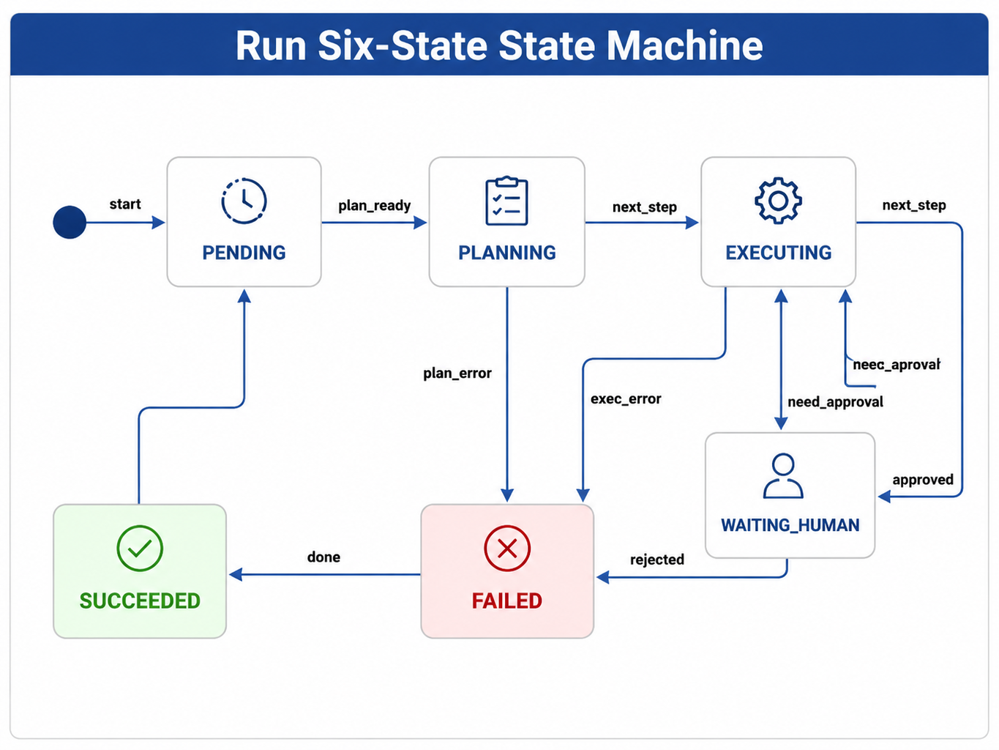

# Chapter 22 Agent Runtime

---
## Chapter Summary

This chapter discusses the execution contract of the Agent Runtime. An agent is not a single model invocation but a task chain that can be paused, resumed, and audited: the model plans the steps, the Runtime executes the tools, the frontend displays progress, and the auditing system reconstructs each action. Without the Runtime, it is difficult to resume long-running tasks after a page refresh or to decide whether to retry, escalate for manual approval, or terminate after a tool call failure. This chapter explains the six states of a Run, SSE event streams, checkpoints, failure classifications, and the implementation boundaries in the mini-platform, focusing on the three key objects: Run, Step, and Tool Call.
## Key Terms

Agent Runtime, Run State Machine, Step, Tool Call, SSE, Checkpoint
## Learning Objectives

- Distinguish the responsibilities of Run, Step, and Tool Call, and explain why they should not be interchanged.
- Explain the state transitions of the six Run states, and why terminal states must be determined by the Runtime.
- Design Agent SSE events to enable replay of tool calls, approvals, and final results.
- Describe what context checkpoints must save to support interruption recovery and manual takeover.

---
## Opening Scenario

A user initiates a business analysis task through DataAgent: first, querying last week’s sales data, then identifying abnormal SKUs, and if necessary, generating a report for manual verification. The frontend only shows the progress changing from “Planning” to “Executing,” but behind the scenes, multiple rounds of model inference, SQL tool calls, result validation, and possibly approval waiting have already occurred.

If the platform treats this interaction merely as a chat message, many issues arise. After the user refreshes the page, where does the task resume? If the SQL tool times out, should it retry or terminate? When the model says “task completed,” is the tool queue really cleared? If approval is pending for 48 hours, can the original context still be restored? These issues belong to Runtime, not something the Prompt or Planner alone can solve.

The responsibility of Agent Runtime is to transform a user task into an observable, recoverable, and auditable Run. The Planner proposes the next step, the Registry finds the tool, the Gateway calls the model, and the Console displays progress; Runtime links these components into a controlled execution chain.

---
## 22.1 Three Runtime Objects

### 22.1.1 Why Run / Step / Tool Call Are Needed

The most common mistake in Runtime design is to conflate session, reasoning rounds, and tool calls into a single object. Sessions are UI-oriented—they answer the question: “Which chat window is the user in?” Runs are task-oriented—they define “where a single auditable task starts and ends.” Steps are reasoning-oriented—they answer “which round of decision-making the Planner is currently at.” Tool Calls are side-effect-oriented—they detail “which tool was executed by whom with what parameters, and what was the result.”

Tasks like financial analysis, customer service tickets, and contract review often span multiple systems. If you only record a session ID, auditors cannot verify whether the third tool call was ever approved. If every tool call is treated as a new task, then after human review, the original task cannot be resumed. The layered design of Run / Step / Tool Call is meant to simultaneously satisfy task-level SLA, inference traceability, and side-effect audit requirements.

*Table 22-1: Responsibility boundaries of Run, Step, and Tool Call. Source: Compiled by this book.*

| Object    | Represents                  | Main Fields                                  | Typical Use Cases              |
|-----------|----------------------------|----------------------------------------------|------------------------------|
| Run       | A single auditable task     | `run_id`, `agent_id`, `input`, `context`, `state` | SLA, checkpoints, approval, audit |
| Step      | One round of Planner decision | `run_id`, `step_index`, `planner_output`     | Organizing multi-round planning and tool feedback |
| Tool Call | One actual tool execution   | `tool_call_id`, `tool`, `args`, `status`, `output` | Playback, idempotency, error categorization |

The relationship between these three objects is straightforward: one Run contains multiple Steps; one Step can generate zero, one, or multiple Tool Calls. The Planner only proposes tool call intentions; actual execution must be carried out by Runtime through the Registry.

### 22.1.2 `/run` Request Contract

Each `POST /agents/{agent_id}/run` corresponds to one Run. For long-running tasks waiting for approval, the same `run_id` is retained—do not open a new chat window or create a new task ID.

```json
{
  "input": "What were the main SKUs driving last week's sales decline in East China?",
  "context": {
    "user_id": "u-ops-001",
    "tenant_id": "demo-retail",
    "scope": ["sales_region:east"]
  },
  "options": {
    "idempotency_key": "optional-client-key",
    "max_steps": 20
  }
}
```

The `context` must be passed through unchanged to the Policy and tool layers. The `idempotency_key` is used for client retries to avoid repeating side-effect-inducing actions like sending emails, creating tickets, or writing to databases. `max_steps` acts as a deadlock protection measure, preventing the model from repeatedly trying the same category of tool calls.

### 22.1.3 Runtime and Adjacent Components

Runtime does not replace Planner, Tool Registry, or Policy. Its responsibility is to advance Run state, execute authorized tools, push events, write checkpoints, and select recovery paths on failure.

*Table 22-2: Division of responsibilities between Runtime and adjacent components. Source: Compiled by this book.*

| Component     | What Runtime Does                       | What the Component is Responsible For       |
|---------------|---------------------------------------|---------------------------------------------|
| Planner       | Calls `next_step()`, receives structured decisions | Generates next-step plans, does not execute tools directly |
| Tool Registry | Finds handlers by tool name and version | Manages tool schemas, versions, and descriptions |
| Policy        | Requests rulings before high-risk actions | Authorization, approval policies, risk evaluation |
| Memory        | Reads/writes context visible to Planner | Long/short-term memory, summaries, retrieval |
| Console       | Pushes status and approval events     | Displays progress, accepts human approval callbacks |

Industry commonly decomposes Agent capabilities into planning, memory, tool use, and other modules (Wang et al. 2024). Runtime is the execution layer that connects these modules, ensuring they operate along a unified task lifecycle instead of independently advancing their own states.

Delegating Runtime individually to each business Agent may seem flexible but can quickly spiral out of control. One team treats a tool timeout as failure, another retries three times for the same timeout; one team reruns tasks after frontend disconnect, another resumes from checkpoints; the security team wants to audit similar high-risk tool calls but finds every Agent logs different fields. The value of platform-level Runtime is here: it fixes states, events, error codes, and recovery semantics so business Agents only focus on task logic.

---
## 22.2 Run Six-State Machine

### 22.2.1 State Definitions

The Run six states represent the lifecycle exposed externally by the Runtime. Internally, the orchestration framework may have more nodes and subgraphs, but the Console, SLA, alerts, checkpoints, and auditing should all adhere to the Run six states.

*Table 22-3: Meaning and typical transitions of the Run six states. Source: Compiled by this book.*

| State           | Meaning                                               | Typical Transitions                                   |
|-----------------|-------------------------------------------------------|-----------------------------------------------------|
| `pending`       | Run has been created but planning has not started     | `start`                                             |
| `planning`      | Planner is generating the next-step decision          | `plan_ready`, `plan_error`                           |
| `executing`     | Runtime is executing tools or preparing for next planning round | `next_step`, `done`, `need_approval`, `exec_error` |
| `waiting_human` | Execution is intentionally paused, awaiting human approval or callback | `approved`, `rejected`                               |
| `succeeded`     | Planner has finished, and no unfinished Tool Calls remain | Terminal state                                      |
| `failed`        | Unrecoverable error, approval rejected, cancellation, or retries exhausted | Terminal state                                      |

`waiting_human` is not a deadlock but a deliberate pause state entered by the Runtime. In compliance scenarios, approval waiting times often need to be separately tracked rather than simply counted as model or tool execution delay.

This distinction is critical for long-running tasks. Approval waits can last hours or even days, but the Runtime must preserve the original Run’s identity, context, and checkpoints. Otherwise, recreating the task after approval would lose prior tool results and break the audit trail into two sections.

The same `run_id` spanning waiting, approval, resumption, and final export is what aligns business responsibility with technical execution. This is the core difference between Runtime and ordinary chatbot backends—traceability.

### 22.2.2 Transition Diagram



*Figure 22-1: Run six-state machine. Source: Original illustration by this book. Alt text: The state machine contains six nodes — pending, planning, executing, waiting_human, succeeded, and failed — with arrows indicating valid transitions from creation, planning, execution, human waiting to success or failure.*

The key rule in Figure 22-1 is that terminal states can only be triggered by the Runtime. The model may state in text that “the task is complete,” and the Planner may return an end intent, but the Runtime must confirm the tool queue is empty, approvals are complete, and failures are handled before transitioning to `succeeded`.

### 22.2.3 Difference from Orchestration Graph States

Chapter 25 will discuss the Planner and orchestration patterns. Orchestration graph states belong to the Planner’s internal implementation—for example, a particular LangGraph node, subgraph, or routing branch. The Run six states belong to the platform contract and are visible to the frontend, auditing, and alerts. The two should not be mixed.

If internal orchestration nodes are directly exposed to the frontend, users will see many technical states unrelated to business. If Run six states are folded inside the Planner, the Runtime cannot independently handle cancelation, approval, retries, and recovery. Thus, internal orchestration can be complex, but the external lifecycle must remain stable.

---
## 22.3 Execution Loop and Event Flow

### 22.3.1 Main Loop

The Runtime's main loop can be summarized in four steps: create a Run, invoke the Planner, execute tools, then either continue planning based on results or enter a terminal state.

```text
create run -> planning
while run is not terminal:
  planner_output = planner.next_step(context)
  if planner_output asks for tools:
      validate policy and tool schema
      emit action event
      execute tool through registry
      emit result event
      update checkpoint
  elif planner_output asks to finish and no tool is pending:
      mark succeeded
  elif approval is required:
      mark waiting_human
  else:
      classify error and recover or fail
```

There are two boundaries in this pseudocode. First, the Planner only returns decisions and does not drive the state machine. Second, any tool invocation must first pass schema validation, permission checks, and idempotency control before entering the executor.

The main loop also needs to avoid turning a “model keep thinking” scenario into an infinite loop. Each Step should consume from a shared budget: model call count, tool call count, total elapsed time, and context length are all accounted against the same Run. The budget is not to limit intelligence but to ensure failures have a termination point. Without budgeting, the Runtime could easily get stuck in loops caused by repeated tool argument revisions, unsatisfactory retrieval results, or Planner indecision.

### 22.3.2 End-to-End Timing Sequence


*Figure 22-2: End-to-end Run Sequence. Source: Created by the book authors. Alt text: Sequence diagram illustrating call order among Client, Runtime, Planner, Tool Registry, and Model Gateway, from /run request through state transitions, tool invocations, event streaming, and final return.*

Figure 22-2 shows the execution chain from the Runtime’s perspective. ReAct organizes reasoning and acting into interleaved trajectories (Yao et al. 2023). Engineering wise, “actions” must be logged as Tool Call records, and “observations” as tool result events. The OpenAI Agents SDK’s streaming runtime also distinguishes tool call and tool return events (OpenAI n.d.). The goal in all cases is to let the frontend and auditing systems see progress, not just the final text output.

### 22.3.3 SSE Events

Token streams from chat models only indicate text generation, not which tool the system executed. Agent Server-Sent Events (SSE) should at minimum include three event types.

*Table 22-4: Agent SSE Event Types. Source: Compiled by the book authors.*

| Event              | Meaning                        | Key Fields                                  |
|--------------------|-------------------------------|---------------------------------------------|
| `state`            | Run state change or terminal   | `run_id`, `state`, `step_index`, `answer`  |
| `action`           | About to execute a tool        | `tool_call_id`, `tool`, `version`, `args`  |
| `result`           | Tool execution completed       | `tool_call_id`, `status`, `output`, `error`|
| `approval_request` | Entering human approval wait   | `approval_id`, `title`, `artifact_ref`, `requested_actions` |

`action` and `result` must always appear in pairs. Without a `result` following an `action`, audits cannot verify if side effects actually occurred. When entering `waiting_human` state, the Runtime must push an approval event, and the Console sends back the manual callback to Runtime.

```text
event: state
data: {"run_id":"run-8f3a","state":"planning","step_index":0}

event: action
data: {"run_id":"run-8f3a","tool_call_id":"tc-1","tool":"sql_executor","args":{"sql":"..."}}

event: result
data: {"run_id":"run-8f3a","tool_call_id":"tc-1","status":"succeeded","output":{"rows":[...]}}

event: state
data: {"run_id":"run-8f3a","state":"succeeded","answer":"Top 3 declining SKUs in East China are..."}
```

SSE uses the `text/event-stream` format, with event format and reconnection semantics defined by the HTML Living Standard (WHATWG n.d.). Clients should reconnect with `Last-Event-ID` after disconnect. The server must resume pushing from event logs or checkpoints rather than re-triggering `/run` to avoid causing side effects.

### 22.3.4 Trace and `run_id`

The Runtime also writes the execution process to a Trace system. A task might pass through frontend, Runtime, LLM Gateway, Tool Registry, and external SQL services. To troubleshoot “which step is slow,” it is necessary to string together spans across these services using the same trace-id.

`run_id` and trace-id serve different purposes. `run_id` targets business tasks, used in Console, approvals, checkpoints, and audit export. Trace-id targets observability, used for performance analysis, call topology, and alerting. They can be mapped at the Observability layer but should not be merged into a single field; otherwise, business recovery semantics will be compromised by sampling, expiration, and link reconstruction policies. Distributed tracing can follow the W3C `traceparent` header and OpenTelemetry standards (W3C 2021; OpenTelemetry n.d.).

When troubleshooting incidents, both IDs appear together. Customer support uses `run_id` to locate the user-visible task; SRE uses trace-id to locate slow calls and error spans. Clearly mapping both IDs lets teams move from user feedback to system calls, then back from system calls to business tasks.

---
## 22.4 Checkpoints and Recovery

### 22.4.1 What Does a Checkpoint Save?

A checkpoint is a restartable snapshot of a Run. After a process crash, redeployment restart, or node migration, the new process reads the checkpoint and should be able to continue from the most recent valid state, instead of requiring the user to resubmit their request.

*Table 22-5: Essential fields for Runtime checkpoints. Source: compiled in this book.*

| Category          | Field                            | Why Needed                                    |
|-------------------|---------------------------------|-----------------------------------------------|
| Runtime State     | `run_id`, `state`, `step_index`, `history` | Restore state machine and migration history  |
| Request Context    | `input`, `context`, `options`     | Preserve permissions, tenant info, and task semantics |
| Tool Records      | Unfinished calls, references to completed results, error codes | Avoid duplicate side effects, reconstruct Planner input |
| Memory References | Session keys, summaries, retrieval fragment references | Prevent loss of context after Planner recovery |
| Event Position    | Last sent SSE event id            | Support incremental push after disconnection |

Saving only `state=executing` is insufficient. For example, if a business analysis task has already obtained a SQL result and the Pod restarts before the next planning round, without saving tool results and Memory references, the Planner might re-select tables or recompute metrics upon recovery—causing inconsistency before and after recovery.

### 22.4.2 When to Write Checkpoints

By default, enterprises should write checkpoints at three key moments: after a successful state transition, after Tool `result` is persisted, and when entering or leaving `waiting_human` state. Writing too infrequently widens the crash vulnerability window; writing too frequently increases storage pressure. For high-QPS short tasks, sampling strategies can be considered, but tool call results with side effects should never be skipped.

Storage can be layered: store online state in Redis or other low-latency KV stores with TTL aligned to the Run’s max duration; store audit archives in PostgreSQL or object storage using append-only writes to facilitate replay and export. Local development can simulate this using SQLite or file directories.

### 22.4.3 Recovery Process

The recovery process should also obey the state machine constraints.

1. Load the most recent checkpoint by `run_id`, confirming the state is not terminal.
2. Replay state history and Tool Call result references to reconstruct Planner-visible context.
3. If the state is `waiting_human`, wait for Console callback and do not automatically continue execution.
4. If there are unfinished tool calls, first query the idempotency key’s execution status, then decide whether to resend `result` event, retry, or fail.
5. On client reconnect, send only missed events based on the `Last-Event-ID`.

Frameworks like LangGraph also persist graph execution state (LangChain n.d.). The difference emphasized here is that Runtime checkpoints use platform-level `run_id` as the primary key, serving the `/run` contract and the six states of Run, rather than binding to internal node names within a specific orchestration framework.

The worst case is “not knowing whether a tool executed before, and re-executing it again.” Therefore, write-action tools must be designed with idempotency semantics alongside checkpoints. Actions like creating tickets, sending emails, or writing approval records should be executed with an `idempotency_key` and store the tool-side returned business ID after execution. On recovery, query this business ID or idempotency key first, instead of directly invoking the tool again.

---
## 22.5 Failure Classification, Timeouts, and Cancellation

### 22.5.1 Error Codes and Recovery Strategies

A runtime cannot simply retry all failures blindly. Model timeouts, tool unavailability, parameter errors, context overflows, policy denials, and infinite loops each have different responsible parties and require different recovery paths.

*Table 22-6: Runtime Failure Classification and Recovery Strategies. Source: Compiled by this book.*

| Failure Type       | `code`               | Default Handling                                  |
|--------------------|----------------------|--------------------------------------------------|
| Model Timeout      | `MODEL_TIMEOUT`       | Limited retries, switch to backup model if needed|
| Tool Unavailable   | `TOOL_UNAVAILABLE`    | Retry if idempotent; otherwise, query execution status |
| Tool Parameter Error | `TOOL_ARGUMENT_INVALID` | Report schema error to Planner; retry up to a fixed limit |
| Context Overflow   | `CONTEXT_OVERFLOW`    | Compress history, trim low-priority segments, or fail |
| Infinite Loop      | `LOOP_DETECTED`       | Fail immediately; log duplicate parameter summary |
| Policy Denied      | `POLICY_DENIED`       | Enter manual approval or fail                    |
| Tool Not Registered| `TOOL_NOT_FOUND`      | Feedback to Planner for correction; stop if persists |

Parameter errors normally should not cause an immediate Run termination. For example, if the Planner omits `tenant_id` when generating SQL tool parameters, the Registry can write the schema error into the `result` event and provide it as input for the next Planner round. Only after exhausting retry budget does the Runtime escalate to failure migration. By contrast, policy denial and infinite loops should not be retried blindly, as that increases risk or overloads shared resources.

### 22.5.2 Three Levels of Timeout

The runtime needs to support at least three timeout levels: overall Run timeout, Tool Call timeout, and LLM request timeout. The Run timeout determines whether the entire task goes to failure or asynchronous queue; Tool Call timeout determines if retry by idempotency key applies; LLM timeout is handled by the Gateway’s model routing and retry policy. Approval waiting typically uses a separately configured `approval_timeout_s`, not directly equivalent to model or tool timeouts.

### 22.5.3 Cancellation Semantics

Cancellation can be triggered by the user, Console, or upstream processes. Upon cancellation, the Runtime should stop any not-yet-started tool queues, attempt to cancel ongoing invocations, write a `failed` state with `RUN_CANCELLED` code, and log the `cancelled_at` timestamp. This book does not treat `cancelled` as a seventh Runtime state in order to keep the six-run-state stability; if cancellation were modeled separately in the future, the state machine, SSE, checkpoints, and frontend display would need to be updated in sync.

---
## 22.6 mini-platform Deployment Path

### 22.6.1 Implementation Scope

The chapters in Part V share the demonstration located in `projects/multi-agent-workflow/`, which runs the six-state machine, Registry tool calls, Handoff, and `waiting_human` features. The `core/runtime/` directory contains the platform modules. When reading the code, it's best to start with the state machine, model objects, and main loop.

```text
mini-platform/core/runtime/
├── state_machine.py
├── run_models.py
├── run_loop.py
├── handoff_tool.py
├── approval.py
├── checkpoint.py
└── stub_planner.py

projects/multi-agent-workflow/
├── run.py
└── README.md
```

Run commands are as follows:

```bash
cd mini-platform
python3 projects/multi-agent-workflow/run.py start
python3 projects/multi-agent-workflow/run.py approve
```

Automated tests can be run with:

```bash
pytest tests/test_multi_agent_workflow_run.py tests/test_runtime.py -q
```

When reading this project, it is not recommended to start from the business demo entry point. A more stable approach is to first look at `state_machine.py` to understand the six states and transitions; then read `run_models.py` to grasp the `RunContext` and `ToolCallRecord`; finally, review `run_loop.py` to see how state transitions, tool executions, checkpoints, and approval resumes are connected together. This prevents mistaking business steps in the demo for generic runtime capabilities when reading the code.

### 22.6.2 Differences Between Demo and Production

The demo covers the state machine, RunLoop, Registry invocation, SSE events, checkpoints, and manual approval. The production version still requires adding an HTTP `/run` service, OpenTelemetry tracing spans, three-level timeouts, persistent event logs, distributed locking, tool idempotency, and audit exports.

*Table 22-7: Differences between Runtime Demo and Production Version. Source: compiled by this book.*

| Capability           | Demo                 | Production Requirements                               |
|---------------------|----------------------|-----------------------------------------------------|
| Run Six States      | Covered              | Consistent with API, SSE, and checkpoints           |
| Tool Call Execution | Covered              | Add permissions, idempotency, timeouts, circuit breaker |
| Checkpoints         | File or lightweight storage | Online state storage + audit archiving            |
| SSE                 | Core events covered  | Support Last-Event-ID and event logging              |
| Manual Approval     | Covered approve/resume | Integration with Console, Policy, and ticketing system |
| Observability       | Basic logs           | Trace ID, spans, metrics, and alerts                 |

The initial version of the Runtime does not need to implement all production capabilities at once but must not miss these three bottom lines: the state machine must not be bypassable by model text, Tool Calls must have paired `action` and `result` records, and checkpoints must be able to restore the Planner-visible context.

If only one acceptance scenario can be chosen, it is recommended to select "process restart after tool execution." This scenario tests the state machine, Tool Call records, checkpoints, idempotency, and SSE reconnection all at once: after recovery, tools must not be executed repeatedly, the frontend should continue to receive subsequent events, and the final state should be consistent with the pre-restart state.

---
## Chapter Recap

1. Runtime transforms a single Agent interaction into an observable, recoverable, and auditable Run.
2. Run, Step, and Tool Call correspond respectively to tasks, reasoning iterations, and actual tool executions; they must not be confused or interchanged.
3. The six Run states serve as the platform's external contract; orchestration graph states are an internal implementation detail of the Planner.
4. The `succeeded` state can only be determined by the Runtime; the model's text output or the Planner's termination intent cannot directly determine the final state.
5. Agent SSE must not consist of only token streams—it must represent the true execution chain using `state`, `action`, `result`, and approval events.
6. Checkpoints must save state, context, tool results, Memory references, and event positions to support recovery and reconnection after disconnection.
## Further Reading

- [Chapter 23 Tool Registry & Function Calling](ch23-tool-registry-function-calling.md)
- [Chapter 25 Planner and Orchestration Patterns](ch25-planner.md)
- [Chapter 30 Human-in-the-loop and Long-running Tasks](ch30-human-in-the-loop.md)
- [Chapter 38 Agent Trace and Session Playback](../../part07-observability-eval/ch/ch38-trace.md)
- [Chapter 45 vLLM + LiteLLM Model Routing Gateway](../../part08-deployment/ch/ch45-llm.md)
- `mini-platform/projects/multi-agent-workflow/README.md`
## References

Wang, L., Ma, C., Feng, X., et al. (2024). A survey on large language model based autonomous agents. *Frontiers of Computer Science*, 18(6), 186345. [https://doi.org/10.1007/s11704-024-40231-1](https://doi.org/10.1007/s11704-024-40231-1)

Yao, S., Zhao, J., Yu, D., et al. (2023). ReAct: Synergizing reasoning and acting in language models. *ICLR*. [https://arxiv.org/abs/2210.03629](https://arxiv.org/abs/2210.03629)

OpenAI. (n.d.). *Streaming*. OpenAI Agents SDK. [https://openai.github.io/openai-agents-python/streaming/](https://openai.github.io/openai-agents-python/streaming/)

WHATWG. (n.d.). *HTML Living Standard: Server-sent events*. [https://html.spec.whatwg.org/multipage/server-sent-events.html](https://html.spec.whatwg.org/multipage/server-sent-events.html)

OpenTelemetry. (n.d.). *Tracing API*. [https://opentelemetry.io/docs/specs/otel/trace/api/](https://opentelemetry.io/docs/specs/otel/trace/api/)

W3C. (2021). *Trace Context*. [https://www.w3.org/TR/trace-context/](https://www.w3.org/TR/trace-context/)

LangChain. (n.d.). *Persistence*. LangGraph. [https://docs.langchain.com/oss/python/langgraph/persistence](https://docs.langchain.com/oss/python/langgraph/persistence)
