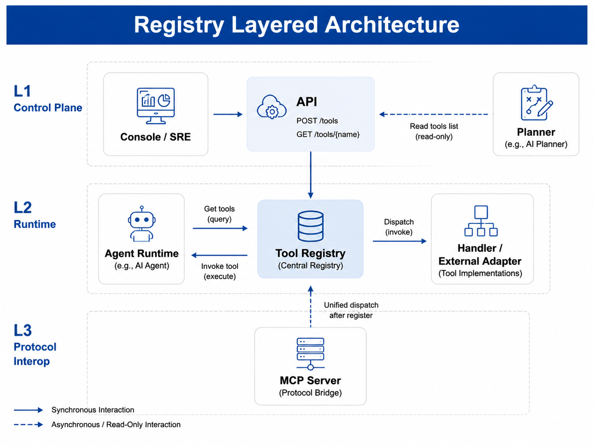
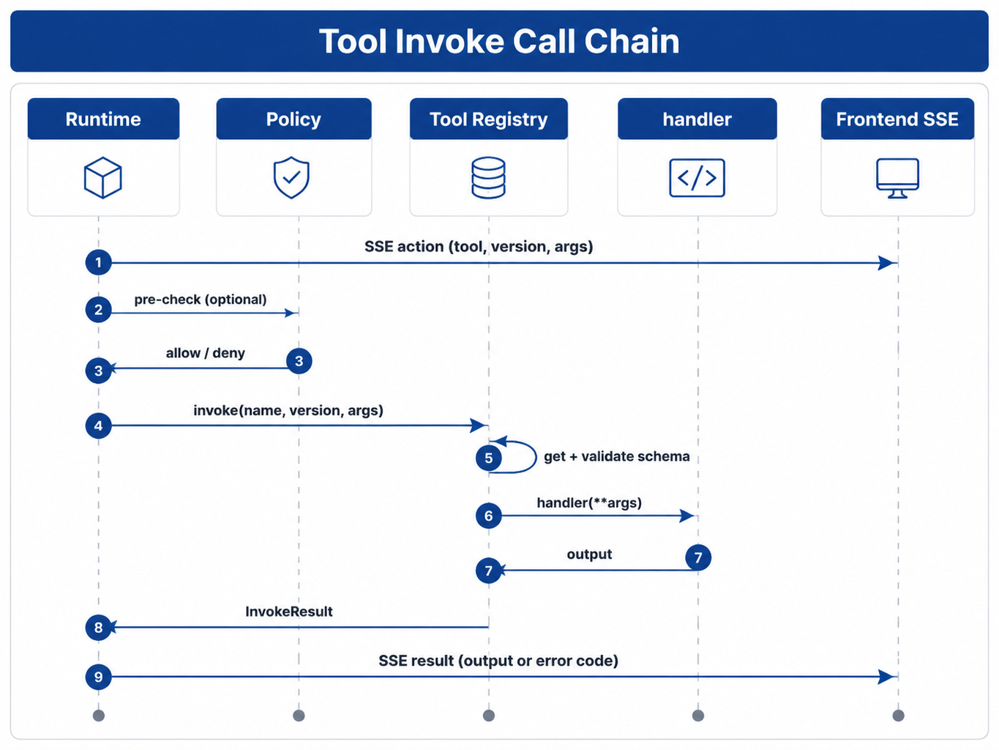

# Chapter 23 Tool Registry & Function Calling

---
## Chapter Summary

This chapter discusses the Tool Registry and Function Calling, explaining how tool descriptions, parameter validation, permission policies, audit logging, and runtime call boundaries work together. Tools serve as the exit points for Agents to produce real-world side effects; therefore, each tool requires a clear capability description, parameter schema, risk level, and permission policy instead of allowing the model to arbitrarily call any function. The chapter presents the ToolSpec capability registration model, parameter validation and failure handling for Function Calling, as well as how multi-version coexistence and audit logging support safe and controllable tool invocation.
## Key Terms

Tool Registry, Function Calling, ToolSpec, Parameter Validation, Permission Policy, Version Governance
## Learning Objectives

- Be able to describe a tool's capabilities, parameter schema, risk levels, and permission requirements using ToolSpec.
- Be able to design parameter validation and failure handling paths for Function Calling.
- Be able to explain how coexistence of multiple tool versions and staged rollout prevent upgrade disruptions during running tasks.
- Be able to design audit logs for tool calls to ensure each side effect is traceable and accountable.

---
## Opening Scenario

Chapter 22 discussed how the Runtime drives a single Run: the Planner provides the next step, the Runtime issues an `action`, the tool executes and then returns a `result`. However, one question remains unanswered here:

When the model says it wants to call `sql_executor`, how does the platform know if this tool exists? Who verifies the `tenant_id` parameter? Should the platform execute `v1` or `v2`? If execution fails, how should the error be returned to the Planner?

If each Agent project imports tools independently, validates parameters separately, and logs on its own, version control, permission checks, and auditing will run out of control. The purpose of the **Tool Registry** is to turn the enterprise’s tools into a unified platform-managed capability: first register the tool, then parse by version, validate parameters before invoking, and finally execute through a unified entry point.

**Function Calling** solves the model-side problem: it allows the model to express “which tool I want to call and with what parameters” in JSON format — passing a `tools` array in the API request, each item described by a **JSON Schema** that defines the parameter shape (OpenAI n.d.). This is often called **tool use** or **tool calling** in literature (Li 2025; Qu et al. 2025): after the model outputs the calling intent, the application side executes it and writes the tool result back to the Planner context. The **Tool Registry** solves the platform-side problem: Can this call be executed? Which version should be invoked? Are the parameters valid? How are errors classified? The two converge at the Runtime’s `executing` stage: the Planner passes the Registry-exported schema to the model; after the model returns parameters, the Registry still must validate those parameters **before** calling the handler — the model output cannot replace platform-enforced validation (OpenAI n.d.; OpenAI 2024).

Terminology in this chapter: **Function Calling** (and tool calling/tool use) refers to the model outputting a call intent through the API; **Tool Call** refers to a tool invocation instance recorded and executed by the Runtime (Chapter 22); **Tool Registry** refers to the platform registry center managing **ToolSpec** through `register` / `invoke`; **registration** means calling `register(spec)` to write tool specifications into the Registry.

When a multi-business-line enterprise DataAgent requests “SKU decline in East China,” the Chapter 22 Runtime has already entered the `executing` phase and emitted an `action` event. What this chapter answers is: how does the platform ensure it calls `sql_executor@v1` instead of an unregistered `v9`? How to return `TOOL_ARGUMENT_INVALID` if `tenant_id` is missing rather than running the SQL on the wrong tenant? The Registry resolves these issues through tool registration, version parsing, parameter validation, and a unified `invoke` entry.

This chapter introduces the Registry’s layered position (§1), the registration model (§2), Schema and validation (§3), version governance (§4), runtime call chain (§5), and concludes with a real project case (§6).

---
## 23.1 Where Registry Sits in the Platform API Hierarchy

Chapter 2 divides the platform API into three layers: **L1 Resource Management** (control plane — configuration and publishing interfaces for operations and the Console), **L2 Runtime** (data plane), and **L3 Protocol Interoperability** (MCP, A2A, etc.). Registry spans L1 and L2: operations and the Console register tools through L1; the Runtime resolves tools by `(name, version)` and invokes them at L2. A simple rule to remember: **registration happens on the control plane; invocation happens at runtime**.

### 23.1.1 Why a Platform-Level Registry Is Necessary

Without a platform-level Registry, each Agent project imports tool modules independently, which leads to three common categories of problems:

1. **Duplicate implementation**: Ten agents each write their own authentication and retry logic for "calling the HR API," producing inconsistent behavior.
2. **Audit gaps**: Compliance requirements demand proof that "a given Run invoked a specific version of the SQL tool and that the parameters included `tenant_id`" — hard-coded imports make it nearly impossible to capture unified call logs and audit evidence.
3. **Version drift**: After the semantic layer is upgraded and `sql_executor` moves from `v1` to `v2`, some agents remain pinned to the old handler, causing metric definitions to diverge from the semantic layer described in Chapter 33.

Registry turns tools into platform-managed **reusable tool capabilities**: each one carries a description, a schema, a version, and a single unified entry point, available for reuse across multiple agents and multiple `projects/`.

The value of this unified entry point often becomes apparent only during post-incident reviews. If a sales-analysis agent bypasses the Registry and connects directly to a SQL client while a finance agent accesses the same table through a wrapped tool, the two paths may apply tenant filtering, field masking, and error codes inconsistently. When a query eventually returns customer details that should never have been exposed, the team must simultaneously examine application logs, database logs, model context, and frontend export records just to find which path missed the validation check. The purpose of Registry is not to add an extra hop to every call — it is to consolidate tool discovery, parameter contracts, version selection, and audit evidence at a single entry point.

### 23.1.2 Position in the Architecture



*Figure 23-1: Registry layered architecture. Source: original illustration by the authors. Alt text: A layered diagram showing the ToolSpec registration layer, retrieval/versioning layer, permission-policy layer, and invocation-execution layer; the Runtime invokes tools through the Registry interface, illustrating the layered structure from tool registration to tool invocation.*

The dashed lines in the diagram indicate that the Planner does not execute tools — it only reads the **OpenAI `tools` definitions** or equivalent schemas exported by the Registry. MCP tools must first be registered as ToolSpecs; the Runtime subsequently follows the `action` → `invoke` → `result` flow for execution (covered in Chapter 24).

### 23.1.3 Boundaries with Adjacent Components

The table below summarizes the division of responsibilities between Registry and its adjacent components. As you read it, keep one guiding thread in mind: Registry governs "whether a tool can be discovered, whether its parameters are valid, and how its handler is invoked." Run progression, model inference, and final authorization are handled by Runtime, Planner, and Policy, respectively.

*Table 23-1: Responsibility boundaries between Registry and adjacent components such as Runtime and Planner. Source: compiled by the authors.*

| Component | What Registry does | What Registry does not do |
| ---------------------- | ----------------------------- | ----------------------------------------------- |
| **Runtime** (Chapter 22) | Called by Runtime for `get` / `invoke` | Does not drive the six Run states; does not emit SSE |
| **Planner** (Chapter 25) | Supplies the tools list and schema | Does not substitute for model inference |
| **Policy** (Chapter 50) | — | Authorization is intercepted by Policy **before** `invoke`; Registry assumes the call has passed Policy, but may still record the call source and risk metadata — it does not make the final authorization decision |
| **LLM Gateway** (Chapter 45) | — | Passing `tools` to the model is the responsibility of the Gateway/Planner |
| **MCP** (Chapter 24) | Stores the ToolSpec and routing information for MCP tools | Does not implement JSON-RPC transport; does not replicate the MCP Server implementation itself |

### 23.1.4 Misuse Risks in Tool Governance

The following three misconceptions arise most frequently in enterprise deployments:

**Misconception 1: Registry = the tool implementation codebase.**
Implementations may live in `tools/`, `handlers/`, or an external HTTP service. What Registry stores is the **ToolSpec** — a description, a schema, and the information needed to route calls to the handler. Stuffing all business logic into the Registry class overloads it with business responsibilities and makes it difficult to test and reuse.

**Misconception 2: Function Calling means "the tool has already been executed."**
OpenAI's documentation is explicit: the API does **not** execute functions on the developer's behalf; the model only generates a parameter JSON that conforms to the schema, and execution happens on the application side (OpenAI, n.d.). Treating the model's output as the final result skips authorization, validation, and auditing entirely.

**Misconception 3: Mixing L1 and L2.**
Using the REST pattern of `POST /tools` to register tools one by one inside the Run main loop will degrade latency. At runtime, only L2 `get` / `invoke` operations should occur; registration belongs to the asynchronous control-plane flow.

---
## 23.2 ToolSpec and Capability Registration Model

On the platform side, **ToolSpec** describes a callable capability. It corresponds one-to-one with the `tool` + `version` fields in the Tool Call records from Chapter 22: after the Runtime receives a Planner proposal, it uses these two fields to resolve via the Registry.

### 23.2.1 ToolSpec Fields

*Table 23-2: Explanation of ToolSpec fields. Source: compiled in this book.*

| Field                | Description                             | Production Extension (checklist ☐)       |
| -------------------- | ------------------------------------- | ---------------------------------------- |
| `name`               | Stable tool name, e.g., `sql_executor` | Tenant prefix `tenant:tool`               |
| `version`            | Semantic or sequential version, e.g., `v1`, `1.0.0` | Canary tag for staged rollout            |
| `description`        | Human- and model-readable purpose description | Multi-language descriptions                |
| `parameters_schema`  | JSON Schema object describing parameters | Aligns with OpenAI `strict` (OpenAI 2024) |
| `handler`            | Callable object (Demo uses Python function) | HTTP/gRPC adapter                         |

The `description` enters the Function Calling `tools` definitions and directly affects **when** the model chooses this tool (OpenAI n.d.); vague descriptions can lead to "calling email when SQL is needed."

Tool descriptions should be written for both models and humans. Writing only “execute query” will cause the model to call it for any data-related question; writing only “send message” cannot distinguish notification, approval, or external contact. A more robust approach is to clearly state applicable scenarios, forbidden scenarios, and side effects, for example: “Read-only query of sales summary, do not return customer phone numbers, no write operations.” These constraints cannot be enforced by natural language alone but help reduce model tool misuse and assist reviewers in judging schema-policy consistency.

### 23.2.2 Registration and Retrieval APIs

The reference implementation (`core/registry/tool_registry.py`) provides three core operations:

*Table 23-3: Roles of Registry registration and retrieval API methods. Source: compiled in this book.*

| Method                | Purpose                                 |
| --------------------- | ------------------------------------- |
| `register(spec)`      | Writes `(name, version)` primary key; fails on duplicate registration to avoid silent overwrite |
| `get(name, version)`  | Retrieves spec; throws `TOOL_NOT_FOUND` if missing |
| `list_versions(name)` | Returns all versions of a tool, for Agent config pages and governance |

```python
@dataclass(frozen=True)
class ToolSpec:
    name: str
    version: str
    description: str
    parameters_schema: dict[str, Any]
    handler: Callable[..., Any]
```

### 23.2.3 Registration Process (Control Plane → Runtime)

1. SRE / platform engineers submit ToolSpec (YAML / PR) to L1 API or configuration repository.
2. L1 calls `register(spec)` to write to the Registry.
3. Agent config page calls `list_versions("sql_executor")` and **pins** the version (e.g., `v1`).

In enterprise practice, common L1 forms include: YAML stored in Git repositories, "publish tool" forms in Console, or CI-based auto-publication from `tools/` packages. This chapter’s demo uses in-memory `register` to simulate the post-L1 registration state.

### 23.2.4 Where to Place the Handler

*Table 23-4: Deployment forms of tool handlers and their applicable scenarios. Source: compiled in this book.*

| Deployment Form     | Handler Form                          | Applicable Scenario                         |
| ------------------- | ----------------------------------- | ------------------------------------------ |
| In-process function | `Callable`                          | Single-machine demo, lightweight tools     |
| HTTP within cluster | Registry holds URL, invoked by sending HTTP request | Most microservice tools                     |
| MCP / External SaaS | Adapter wraps MCP `tools/call` into unified `invoke` | Chapter 24                                   |

The Registry only requires consistent `invoke` semantics: **parameter validation → routing → return structured output or throw RegistryError**.

---
## 23.3 Function Calling Schemas and Parameter Validation

**Function Calling** (OpenAI n.d.) refers to declaring functions available for the model to call in the `tools` parameter of APIs like Chat Completions. The model outputs `tool_calls` in its response, where `function.arguments` is a JSON string. The platform must parse this JSON into a dict and then pass it to the Registry. **Parsing is not the same as validation, nor as execution**—the Registry must still enforce schema validation on parameters before `invoke`.

### 23.3.1 What OpenAI Tools Look Like

A tool definition typically includes these fields (OpenAI n.d.):

*Table 23-5: Field descriptions of what OpenAI tools look like. Source: compiled by this book.*

| Field                   | Meaning                                     |
|-------------------------|---------------------------------------------|
| `type`                  | Fixed to `function`                           |
| `function.name`         | Matches `ToolSpec.name`                       |
| `function.description`  | Description of the trigger condition         |
| `function.parameters`   | JSON Schema describing the parameters object |
| `function.strict` (optional) | When `true`, enables Structured Outputs level constraints (OpenAI 2024) |

The `mini-platform` provides `to_openai_tool(spec)`, which generates the above structure from a `ToolSpec` (`core/registry/openai_tools.py`). Planner or Gateway can directly embed this into the API request body.

### 23.3.2 What Is JSON Schema

**JSON Schema** is a specification that uses JSON to describe the structure of JSON documents (JSON Schema 2020): which fields exist, their types, and which are required. The `parameters` in Function Calling is essentially the schema for the "parameters object."

The strict mode of OpenAI Structured Outputs further constrains the schema: objects usually must set `additionalProperties: false` and have `required` cover all properties (OpenAI 2024). This reduces the likelihood that the model generates extra or missing fields, but it still only constrains the **model’s output format** and does not replace validation on the platform side.

The demo in this book’s `to_openai_tool(spec, strict=True)` shows how to add `strict: true` in the OpenAI `tools` definition and supply `additionalProperties: false` if missing at the top level; it is **not** a complete production-grade strict schema generator. Production implementations should further check that `required` covers all properties, recursively handle nested objects, and continue to validate parameters in Registry before `invoke`.

The demo’s validator implements a **subset** of JSON Schema (`object` / scalar types / `required` / `additionalProperties`) without third-party dependencies. Production can switch to a full validator library, but the **timing of validation does not change**: it must happen before the handler.

Parameter validation is often underestimated because Function Calling seems to produce “valid JSON.” In production, common errors are not JSON parsing failures but business-critical valid JSON such as missing tenant filters, excessively large time ranges, exporting PII fields, or setting `region` to unauthorized areas. JSON Schema ensures shape, Policy enforces permission, and handlers execute business logic—these three cannot substitute for each other. The Registry must at least block calls with incorrect shapes from reaching handlers and leave business-risk checks to Policy for further judgment.

!!! warning "Validation before invoke is mandatory, whether or not `strict` is enabled"
    Even if Function Calling or `strict: true` is enabled on the model request, the Registry **must** run `validate_parameters` **before** invoking the handler. The model output is only a suggestion and cannot replace platform schema enforcement (see §6 FAQ 3).

### 23.3.3 Division of Responsibilities with Runtime

A tool call from the model to the handler involves these components and responsibilities:

*Table 23-6: Division of responsibilities and failure handling across stages of a tool call between Registry and Runtime. Source: compiled by this book.*

| Stage                                      | Responsible Component | On Failure                           |
|--------------------------------------------|----------------------|------------------------------------|
| Providing the tools list to the model      | Planner + Gateway    | Model unavailable                   |
| Parsing `tool_calls` JSON                   | Planner / Runtime    | `plan_error` etc.                   |
| `get(name, version)`                        | Registry             | `TOOL_NOT_FOUND`                   |
| Schema validation of `args`                 | Registry             | `TOOL_ARGUMENT_INVALID`             |
| Executing handler                           | Registry (routing)   | Handler error → Runtime handles per §5 |
| Writing SSE `result`, whether to report errors back to Planner | Runtime               | Retry ≤3 times in same step (Chapter 22) |

The key principle: **the model "should" follow the schema, and the platform "must" enforce the schema** (OpenAI n.d.; OpenAI 2024). Research shows that tool learning has become a core paradigm for LLM Agents but hallucinated parameters and wrong tool selection remain major failure modes (Li 2025; Qu et al. 2025; Shen 2024).

Qu et al. (2025) summarize the tool learning process as four stages: **task planning → tool selection → tool calling → response generation**. The mapping in this book is: the first two stages mainly happen inside Planner (Chapter 25) and Gateway; the **tool calling** stage is done by Runtime sending `action` and Registry executing `invoke` (see **Figure 23-2**); the **response generation** stage is Planner reading the `result` then producing user-facing answers. Registry handles execution and validation in the third stage but does not replace Planner for reasoning.

### 23.3.4 How Parameter Errors Are Reported Back to Planner (Relation to Chapter 22)

The following concrete example ties together Chapter 22 and this section’s responsibilities.

If parameters generated by Planner for `sql_executor` lack the `tenant_id`, Registry throws `TOOL_ARGUMENT_INVALID` at `invoke` with a `validation_errors` list. Runtime writes this into a `result` event and **does not** mark the entire Run as `failed`. Instead, it **calls Planner again** in the same Step (feeding the error back as input to prompt the model to fix parameters). After more than 3 retries failing, it finally enters `failed` (Chapter 22 §5). This lets users see meaningful business-level correction prompts rather than low-level validation errors or Python exception stacks.

---
## 23.4 Version Governance and Multi-Version Coexistence

Tools, like APIs, require version management. The **primary key** is `(name, version)`: different versions with the same name can coexist, and the Agent or Run configuration determines which version is actually resolved.

### 23.4.1 Why Multi-Version Is Needed

Industry scenario example: `sql_executor@v1` directly queries an old wide table; `v2` queries semantic layer metrics from Chapter 33. The Finance and Supply Chain Agents migrate at different paces—thus the platform must allow **v1 and v2 to be online simultaneously**, pinned by Agent configuration, rather than enforcing a global latest version.

In the practical project `registry_setup.py`, both **`sql_executor`** (builtin read-only demo handler) and **`mcp_db_query_sales`** (Chapter 24 MCP bridge tool) are registered simultaneously to contrast platform-builtin tools with "L3 protocol access tools" in the Registry regarding naming, versioning, and audit differentiation—these two have similar semantics but different origins and governance paths, and should never be mixed in production.

### 23.4.2 How Agents Choose Versions

*Table 23-7: Several strategies for Agent tool version selection, with advantages and risks. Source: Compiled for this book.*

| Strategy         | Approach                            | Advantages        | Risks                        |
| ---------------- | --------------------------------- | ----------------- | ---------------------------- |
| **Pin Version**  | Write `sql_executor: v1` in Agent manifest | Auditable, reproducible | Requires manual upgrade effort |
| **Default latest** | Registry records `default_version` | Easy upgrades     | Behavioral changes, drifting metric definitions |
| **Canary**       | Route v2 by `tenant_id`            | Safe gradual rollout | Complex routing logic         |

Recommended for enterprises: **Production Agents pin versions**; experimental Agents can use latest; canary rollout controlled via config center. The MVP approach in Chapter 4 "YAML registration + simple versioning → multi-version canary" is implemented here as `list_versions` + config options; when multiple versions coexist, Runtime resolves `(name, version)` according to Agent config through the Registry in **Figure 23-1**.

Version pinning is also crucial for reproducibility of results. After DataAgent generates a business report, if three months later users ask "why did this conclusion occur," the platform must restore the exact tool version, schema, semantic layer version, and result summary used at that time. If tools always use latest by default, `sql_executor` at report generation and at review may behave differently. Version governance may seem to add configuration cost, but it actually preserves reproducibility paths for audit, rollback, and user appeals.

### 23.4.3 Version Exposure via Function Calling

Exposing **multiple versions** simultaneously to the model (e.g., two `name`s `sql_executor_v1` and `sql_executor_v2`) easily causes the model to select the wrong one. **In production by default**, only one logical name is exposed to the model, with version resolved by Agent config or Runtime before `invoke`; only in experimental environments might the Planner explicitly pass version or expose multiple names. Chapter 25 on orchestration will further discuss how the Planner holds tool views.

### 23.4.4 Governance Checkpoints

- Check `list_versions` and Agent configuration references before deprecating a version.
- Tool schema **breaking changes** should increment the major version, and keep the old version read-only for a grace period.
- Registration info includes `owner` and `risk_level` (write/read operations) for Policy use (Chapter 50, demo in this chapter ☐).

---
## 23.5 Runtime Invocation Chain: From Runtime to Handler

This section connects Chapter 22 and this chapter: how a Tool Call in the `executing` state flows from `action` through the handler and then becomes a `result`.

### 23.5.1 Sequence



*Figure 23-2: Tool invoke call chain. Source: drawn by the authors. Alt text: The invocation chain starts from Runtime, passes through the Registry for parameter validation, permission checks, and version selection, then goes to the handler for execution and returns the result or error code. Arrows mark the validation checkpoints in each step.*

When a policy rejects, Runtime may enter `waiting_human` or `failed` (Chapter 22), and **does not** call the Registry. After passing policy, the Registry is responsible for verifying that the tool exists, parameters are valid, and the handler is executable.

### 23.5.2 invoke Semantics

The steps of `ToolRegistry.invoke(name, version, args)`:

1. `get(name, version)` → If not registered, returns `TOOL_NOT_FOUND`.
2. `validate_parameters(schema, args)` → On failure returns `TOOL_ARGUMENT_INVALID` (including `validation_errors`).
3. Calls `handler(**args)` → Returns `InvokeResult(output=...)`.

Error types inherit from `RegistryError`, carrying `code` / `message` / `details`. Runtime maps these to the Chapter 22 `result` and corresponding recovery strategies.

### 23.5.3 Error Code Mapping

*Table 23-8: Causes, Runtime statuses, and recovery for various tool call error codes. Source: compiled by the authors.*

| Failure Source / Registry `code`      | Typical Causes                          | Runtime Status        | Recovery                   |
|--------------------------------------|---------------------------------------|-----------------------|----------------------------|
| `TOOL_NOT_FOUND`                     | Name or version not registered, Agent misconfiguration | Remain in `executing`  | Feedback to Planner or fail |
| `TOOL_ARGUMENT_INVALID`               | Missing required, wrong type, extra fields | Remain in `executing`  | Feedback to Planner up to 3 times |
| `TOOL_UNAVAILABLE`                   | Handler downstream unreachable (e.g. MCP transport timeout) | According to Chapter 22 §5 | Retry / circuit-break / `failed` (Chapter 24; MCP inside Demo process usually not triggered) |
| Uncaught handler exceptions (non-Registry code) | Downstream timeout, business errors    | According to Chapter 22 §5 | Retry / `failed`             |

Masterman et al. (2024) emphasize in their overview of Agent architectures that **reasoning, planning, and tool calling should be designed in stages**, and both tool execution reliability and message filtering are important (Masterman et al. 2024). The Registry is the platform-level implementation at the tool calling phase.

### 23.5.4 Relationship to Chapter 24 MCP

The MCP Server exposes `tools/list` and `tools/call` externally (Model Context Protocol 2024). The platform approach is: at Level 1, MCP tools are **registered** as ToolSpecs (storing specs and routing info without copying the Server implementation). Internally, handlers invoke MCP clients rather than having Runtime directly call MCP Servers everywhere. This way, the Tool Call record and trace in Chapter 22 remain a single `invoke` semantic.

---
## 23.6 Practical Project: Tool Registry and RunLoop Invocation

Part V unified practical project **`projects/multi-agent-workflow/`** is invoked via RunLoop calling the Registry: Handoff, SQL, MCP, and Reporting tools are all registered within `build_workflow_registry()`. Independent unit tests for Registry error codes and schema validation are in `tests/test_registry.py`. The subsection numbering **3.1–3.4** below follows the engineering section convention used throughout this book.

### 23.6.1 Runtime Environment

- **Python**: ≥ 3.11 (see `mini-platform/pyproject.toml`)
- **Working Directory**: Run `python3 projects/multi-agent-workflow/run.py start` from the root directory of `mini-platform`
- **Registry Unit Tests**: `pytest tests/test_registry.py -q` (covers `TOOL_NOT_FOUND`, `TOOL_ARGUMENT_INVALID`, `to_openai_tool`, etc.)

### 23.6.2 Implementation Paths in mini-platform

```
mini-platform/core/registry/
├── __init__.py
├── tool_registry.py      # ToolSpec, register / get / list_versions / invoke
├── schema_validate.py    # JSON Schema subset validation for parameters
├── openai_tools.py       # to_openai_tool(spec) → OpenAI tool items
└── errors.py             # TOOL_NOT_FOUND, TOOL_ARGUMENT_INVALID

projects/multi-agent-workflow/lib/
└── registry_setup.py     # build_workflow_registry(): handoff / sql / MCP / report

projects/multi-agent-workflow/
├── run.py                # RunLoop + Registry full chain
└── README.md

tests/test_registry.py    # Unit tests for Registry functionality and error codes
```

Suggested reading order of the code: `tool_registry.py` → `schema_validate.py` → `registry_setup.py` → `run_loop.py` (`_execute_pending_tool`).

### 23.6.3 Runnable Code and Configuration

Below is an excerpt from `projects/multi-agent-workflow/lib/registry_setup.py`; the full handlers and MCP registration are in the same file.

```python
def sql_executor_handler(query: str, tenant_id: str) -> dict[str, object]:
    """Simulates a read-only SQL query."""
    return {
        "rows": [{"sku": "SKU-A", "sales": 3200, "delta": -12}],
        "query": query,
        "tenant_id": tenant_id,
    }

registry.register(ToolSpec(
    name="sql_executor",
    version="v1",
    description="Execute read-only SQL (Demo fixed rows)",
    parameters_schema={
        "type": "object",
        "properties": {
            "query": {"type": "string"},
            "tenant_id": {"type": "string"},
        },
        "required": ["query", "tenant_id"],
        "additionalProperties": False,
    },
    handler=sql_executor_handler,
))
```

**Run the practical project** (observe Registry invoked through RunLoop with `action` → `invoke` → `result`):

```bash
cd mini-platform
python3 projects/multi-agent-workflow/run.py start
```

SSE output will show Tool Call records like `"tool": "handoff"`, `"tool": "mcp_db_query_sales"`, `"tool": "render_report"`. The Registry also registers `sql_executor`, but the Part V main Data phase uses the MCP bridge tool **`mcp_db_query_sales`** for convenient comparison with Chapter 24 registration path; `sql_executor` can be individually verified through `tests/test_registry.py`.

**Registry error code unit tests** (RunLoop-independent):

```bash
pytest tests/test_registry.py -q
```

### 23.6.4 Release Gates and Runtime Constraints

*Table 23-9: Coverage of various Registry capabilities in the mini-platform Demo. Source: compiled by this book.*

| Capability                                  | Description                         | Demo Covered? |
| ------------------------------------------- | --------------------------------- | ------------ |
| ToolSpec and register / get / list_versions | `tool_registry.py`                 | ✓            |
| invoke + schema validation                   | `schema_validate.py`               | ✓ (subset)   |
| Structured error codes                       | `errors.py`                       | ✓            |
| Export OpenAI tools definitions              | `openai_tools.py`                 | ✓            |
| Registry invocation in practical project     | `multi-agent-workflow/run.py`     | ✓            |
| Registry error code unit tests                | `tests/test_registry.py`           | ✓            |
| L1 HTTP `POST /tools` / persistence           | Control plane API + DB             | ☐            |
| Tenant isolation and namespaces                | `tenant_id` in spec or routing     | ☐            |
| Policy pre-check integration                   | Chapter 50                       | ☐            |
| MCP registration and adapter                   | Chapter 24 · `registry_setup.py`  | ✓            |
| Integration with RunLoop                        | `run_loop._execute_pending_tool`  | ✓            |
| Full JSON Schema validation library              | Production-grade                 | ☐            |
| Tool audit and lineage                             | Who registered, who invoked      | ☐            |

### 23.6.5 Common Issues

**Issue 1: Hard-coded Tool Imports in Agent**

Symptom: Each Agent repository copies the SQL client, but after semantic layer upgrades only some Agents follow. Fix: unify tool access through the Registry; Agents only declare `tool` + `version` in configuration.

**Issue 2: Schema and Handler Parameter Drift**

Symptom: `parameters_schema` in YAML includes `tenant_id`, but handler function signature is unmodified, passing validation but missing tenant handling in business logic. Fix: CI checks tool registration to compare schema and handler signature; unit tests include required fields verification for `invoke`.

**Issue 3: Treating Model Output as Already-Validated Parameters**

Symptom: After Function Calling is enabled, Registry validation is skipped, leading to phantom fields getting into SQL concatenation. Fix: regardless of `strict` mode, parameters must be validated via `validate_parameters` before `invoke` (OpenAI n.d.; OpenAI 2024).

**Issue 4: Multiple Versions Exposed to Model Simultaneously**

Symptom: Model randomly chooses between `v1`/`v2`, causing daily comparative metrics to mismatch. Fix: expose stable logical names to the model; version is pinned by Agent config or explicitly parsed by Planner before `invoke`.

---
## Chapter Recap

1. **Tool Registry** is the central hub for L1 registration and L2 `get` / `invoke` capabilities; tool implementations can be distributed, but contracts must be unified in the Registry.
2. **Function Calling** allows the model to **propose** calls according to JSON Schema; the **Registry** is responsible for validation and execution—these two roles are not interchangeable.
3. `(name, version)` serves as the primary key for version governance; production Agents should pin versions to avoid definition drift caused by using latest.
4. `TOOL_NOT_FOUND` / `TOOL_ARGUMENT_INVALID` errors must be returned in structured form, written into `result` by Runtime, which decides whether to report the error back to the Planner.
5. Both **MCP and HTTP tools** should be registered as ToolSpecs to maintain the event and audit model described in Chapter 22 unchanged.

- In production Runs, are all tool calls routed through Registry `invoke` without hardcoded bypasses?
- Does each write operation tool have a schema with required fields and idempotency specifications?
- Does Agent configuration pin tool versions, and is there a process for deprecating old versions?
- Is there a limit on the number of times parameter validation failures are reported back to the Planner to avoid infinite loops?
- Are MCP and external tools integrated into the Registry for unified logging and auditing of calls?

- [Chapter 22 Agent Runtime](ch22-agent-runtime.md)
- [Chapter 24 MCP and Enterprise Tool Ecosystem](ch24-mcp.md)
- [Chapter 25 Planner and Orchestration Patterns](ch25-planner.md)
- [Chapter 50 Policy and Permissions](../../part10-security-org/ch/ch50.md)
- `mini-platform/projects/multi-agent-workflow/README.md`
- `mini-platform/tests/test_registry.py`

---
## References

OpenAI. (n.d.). *Function calling*. OpenAI API documentation. [https://developers.openai.com/api/docs/guides/function-calling](https://developers.openai.com/api/docs/guides/function-calling)

OpenAI. (n.d.). *How to call functions with chat models*. OpenAI Cookbook. [https://developers.openai.com/cookbook/examples/how_to_call_functions_with_chat_models](https://developers.openai.com/cookbook/examples/how_to_call_functions_with_chat_models)

OpenAI. (2024). *Introducing Structured Outputs in the API*. [https://openai.com/index/introducing-structured-outputs-in-the-api/](https://openai.com/index/introducing-structured-outputs-in-the-api/)

JSON Schema. (2020). *JSON Schema: A Media Type for Describing JSON Documents*. Draft 2020-12. [https://json-schema.org/draft/2020-12/json-schema-core](https://json-schema.org/draft/2020-12/json-schema-core)

Li, X. (2025). A review of prominent paradigms for LLM-based agents: Tool use, planning (including RAG), and feedback learning. In *Proceedings of COLING 2025*. arXiv:2406.05804. [https://arxiv.org/abs/2406.05804](https://arxiv.org/abs/2406.05804)

Qu, C., Dai, S., Wei, X., Cai, H., Wang, S., Yin, D., Xu, J., & Wen, J.-R. (2025). Tool learning with large language models: A survey. *Frontiers of Computer Science*, 19(8), 198343. [https://doi.org/10.1007/s11704-024-40678-2](https://doi.org/10.1007/s11704-024-40678-2) (Preprint: [https://arxiv.org/abs/2405.17935](https://arxiv.org/abs/2405.17935))

Shen, Z. (2024). LLM with tools: A survey. arXiv:2409.18807. [https://arxiv.org/abs/2409.18807](https://arxiv.org/abs/2409.18807)

Masterman, T., Besen, S., Sawtell, M., & Chao, A. (2024). The landscape of emerging AI agent architectures for reasoning, planning, and tool calling: A survey. arXiv:2404.11584. [https://arxiv.org/abs/2404.11584](https://arxiv.org/abs/2404.11584)

Model Context Protocol. (2024). *Specification* (2024-11-05). [https://modelcontextprotocol.io/specification/2024-11-05](https://modelcontextprotocol.io/specification/2024-11-05)

Patil, S. G., Zhang, T., Kulkarni, N., & Leask, M. (2023). Gorilla: Large language model connected with massive APIs. arXiv:2305.15334. [https://arxiv.org/abs/2305.15334](https://arxiv.org/abs/2305.15334)
