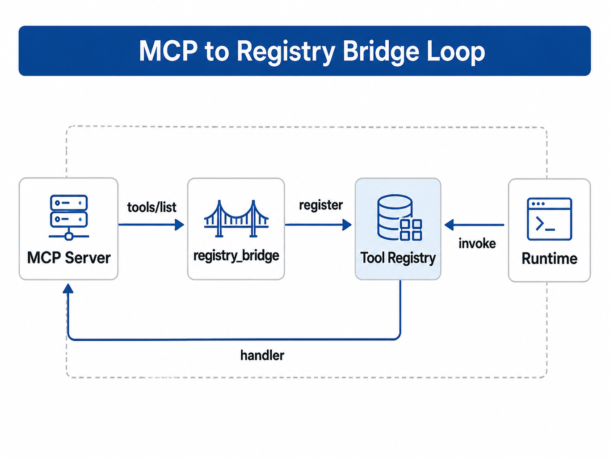

# Chapter 24 MCP and the Enterprise Tool Ecosystem

---
## Chapter Summary

This chapter introduces the role of MCP within the enterprise tool ecosystem, explaining the division of responsibilities among Host, Client, Server, Tools, Resources, and the enterprise Registry. MCP provides an open protocol that enables models to connect with external tools and data, but enterprises cannot directly connect arbitrary MCP Servers into production. Instead, they must go through their own Registry to enforce permissions, auditing, and risk classification. This chapter clarifies the architecture and deployment of Host/Client/Server, the three capability categories of Tools/Resources/Prompts, and how MCP integrates with the internal enterprise Registry rather than replacing it.
## Key Terms

MCP, Host/Client/Server, Tools, Resources, Protocol Integration, Enterprise Registry
## Learning Objectives

- Be able to explain the respective responsibilities and deployment models of Host, Client, and Server in MCP.
- Be able to distinguish the three types of MCP capabilities—Tools, Resources, and Prompts—and their uses.
- Be able to explain why an external MCP Server still needs to go through the internal Registry when connecting to the enterprise platform.
- Be able to design MCP access permissions, auditing, and risk classification to avoid introducing uncontrollable side effects.

---
## Opening Scenario

Chapter 23 converged tools into a **Tool Registry**: registering by `(name, version)`, enforcing schema validation, and providing a unified `invoke` interface. In practice, however, an enterprise's existing capabilities are scattered across individual teams' HTTP services, scripting libraries, and vendor SaaS platforms—if every consumer writes its own adapter, the platform quickly regresses to the "one Agent, one integration" anti-pattern.

**The Registry governs unified naming, versioning, and validation within the platform; MCP governs the protocol at process and service boundaries**—the integration path remains **discover → register → invoke**, rather than replacing the Registry with MCP.

How should external capabilities be exposed through a unified protocol? Should the platform hand-write an HTTP client for every server? Can **execution and auditing** still follow the `action` → `invoke` → `result` pipeline from Chapter 22? (**Discovery** is handled by L1 or the MCP Client's `tools/list` call and is not part of the Run main loop.)

**Model Context Protocol (MCP)** is an open protocol championed by Anthropic and others. It uses uniform JSON-RPC semantics to expose **Tools, Resources, and Prompts**, enabling a **Client** on the **Host** to connect to multiple **Servers** in a consistent manner (Anthropic 2024; Model Context Protocol 2024). For the platform, MCP is not a replacement for the Registry—it is the **L3 ingestion standard**: external Servers expose their capabilities over MCP, the platform-side Client fetches `tools/list`, and those capabilities are **registered** into the Registry; the Runtime continues to use the unified invocation chain from Chapters 22 and 23. For a comparison with Agent-to-Agent interoperability protocols such as A2A, see Chapter 29 (Google 2024).

Terminology used in this chapter: **MCP** refers to the Model Context Protocol, i.e., the JSON-RPC standard at the L3 protocol layer; **Host** refers to the application process that hosts the user session and orchestrates the LLM and Clients (in this platform, the Runtime + Planner); **Client** is the component that acts on behalf of the Host to connect to Servers and relay `tools/list` and `tools/call` calls; **Server** refers to a standalone process or service that exposes Tools, Resources, and Prompts.

After a multi-business-line enterprise encapsulates its "sales wide-table read-only query" as a standalone MCP Server, the DataAgent, Finance Agent, and operations scripts all share the same service, while audit logging and version governance remain unified at the Registry layer. This chapter answers three questions: where MCP sits in the L3 layer, how the three capability types divide responsibilities, and how to integrate MCP with the Tool Registry.

The chapter proceeds as follows: the layered position of MCP (§1), architecture and deployment (§2), the three capability types (§3), enterprise ingestion (§4), integration with the Registry (§5), and a hands-on project (§6).

---
## 24.1 MCP’s Position in the Platform Protocol Layering

Chapter 2 defines **L3 Protocol Interoperability** as the standard interface layer across systems and platforms. MCP’s current most typical ecosystem niche is: **enabling LLM applications (Host) to use external data and tools (Server) in a standardized way**, instead of duplicating an HTTP client in every Agent project (Anthropic 2024).

### 24.1.1 Relationship with Registry and Runtime

The table below summarizes the division of responsibilities among MCP, Registry, and Runtime at L2 / L3:

*Table 24-1: Relationship between MCP components and Registry, Runtime. Source: Compiled by this book.*

| Layer       | Component      | MCP-Related Responsibilities                             |
|-------------|----------------|---------------------------------------------------------|
| L2 Runtime  | Runtime        | Unchanged: send `action`, call Registry `invoke`, write `result` |
| L2 Runtime  | Tool Registry  | Stores `ToolSpec` + handler after MCP tool registration  |
| L3 Protocol | MCP Client     | `tools/list`, `tools/call`, transport (stdio / Streamable HTTP) |
| L3 Protocol | MCP Server     | Exposes tool implementations; optional Resources/Prompts  |

The relationship among Runtime, Registry, and MCP Client inside the Host is shown in **Figure 23-1** (Registry architecture) and **Figure 24-1** (MCP bridging closed loop); a Client can connect to multiple MCP Servers (sidecar or shared service—deployment topologies discussed below).

When an enterprise integrates MCP, the crucial issue is not “can it connect to the Server,” but whether it still respects the original runtime boundaries. Runtime should not bypass the Run state, Tool Call recording, and error categorization in Chapter 22 just because the tool originates from MCP; Registry should not abandon platform-side naming, versioning, and risk registration just because the MCP Server already has an `inputSchema`. MCP solves cross-process tool discovery and invocation; enterprise platforms still need to manage who can call the tool, which version, which logs results enter, and how failures replay.

### 24.1.2 Governance Risks in MCP Integration

The following four misconceptions are the most common pitfalls during enterprise adoption:

**Misconception 1: Treating MCP as “just another Tool Registry.”**
Registry manages **unified naming, versioning, and verification** within the platform; MCP manages the **protocol across process/service boundaries**. The proper flow is **MCP → Registration → Registry → Runtime**.

**Misconception 2: The Run main loop directly connects to MCP Server.**
Creating a new MCP connection on every Tool Call causes latency and connection storms. MCP Client should be registered as a Registry handler; connection pooling and circuit breaking should be reused at the Client layer.

**Misconception 3: Using Resources as a substitute for RAG.**
MCP Resources provide readable URIs and snapshots (Chapter 24 §3); enterprise-grade retrieval, permissions, and indexing remain in Chapter 20 RAG and Vector Stores. The two coexist: RAG handles “search,” Resources handle “reading a specific known document version.”

**Misconception 4: Ignoring Server-side audit.**
MCP only standardizes the protocol; enterprise IAM is not included. The Server side must record caller identity, `tenant_id`, tool name, parameter summary, result summary, and `run_id`; platform tracing links to these (Chapter 38). Who can `tools/call` which tool types still belongs to Chapter 50 Policy and network isolation (§4).

---
## 24.2 Host / Client / Server Architecture and Deployment

The MCP specification defines three roles (Model Context Protocol 2024):

*Table 24-2: Meanings and example scenarios of MCP Host, Client, and Server roles. Source: Compiled by this book.*

| Role   | Description                                 | Industry Scenario Example      |
|--------|---------------------------------------------|-------------------------------|
| **Host**   | Hosts user sessions and orchestrates LLM with Client applications | DataAgent platform process      |
| **Client** | Represents Host to connect to Server, forwarding `tools/list`, `tools/call`   | Built-in platform `McpDbClient` |
| **Server** | Independent process or service exposing Tools/Resources/Prompts               | `mcp-db` read-only query service |

### 24.2.1 Transmission Methods

In MCP production deployment, "local process" and "remote service" are distinguished. Local Servers typically use **stdio**; remote Servers should prefer MCP’s **Streamable HTTP** (mainstream remote transport since 2025-03-26). The legacy **HTTP+SSE** can be used for backward compatibility or understood as a server message stream mechanism within Streamable HTTP, but it should not be the primary name for production remote transport in new documentation.

*Table 24-3: Applicable scenarios and notes for different MCP transmission methods. Source: Compiled by this book.*

| Transmission      | Scenario                                    | Notes                                                      |
|-------------------|---------------------------------------------|------------------------------------------------------------|
| **stdio**         | Local subprocess, IDE plugins, developer tools | Container environments must clarify subprocess lifetime to avoid zombie processes |
| **Streamable HTTP**| Remote MCP Server, Kubernetes deployments, multi-Host sharing | Requires TLS, authentication, timeout, body size limit, and gateway routing configuration |
| **HTTP+SSE (compatibility)** | Integration with deprecated endpoints per 2024-11-05 spec | Only for compatibility; new deployments should prioritize Streamable HTTP |
| **In-process (Demo)** | Teaching and unit tests                      | Used by `tools/mcp_db/`; simulates only method/params dispatch, not production transport layer |

This chapter’s demo reduces dependencies by using in-process `McpDbClient → McpDbServer` calls. Production implementations should replace this with official SDK’s stdio or Streamable HTTP transports while preserving the call boundaries Runtime → Registry → handler → MCP Client.

Transmission mode affects failure characteristics. stdio Server failures often stem from subprocess lifecycle, stdio blocking, or container restart issues; remote HTTP Server failures often result from authentication problems, gateway timeouts, oversized bodies, connection pool exhaustion, or regional network policies. Packaging all errors as ordinary tool failures leads the Planner to repeat the same call. A better approach separates transport timeouts, Server business errors, schema mismatches, and permission denials for recording, enabling Runtime to choose retry, circuit breaking, Planner feedback, or escalation to human intervention.

A typical `tools/list` and `tools/call` interaction sequence is as follows:

*Table 24-4: Steps, directions, and descriptions of a single MCP communication. Source: Compiled by this book.*

| Step | Direction        | Description                          |
|-------|------------------|------------------------------------|
| 1     | Host → Client    | Connect to Server (stdio / Streamable HTTP) |
| 2     | Client → Server  | `tools/list` → tool definitions array |
| 3     | Host → Client    | `tools/call(name, args)`            |
| 4     | Client → Server  | JSON-RPC request                   |
| 5     | Server → Client  | `content` + optional `structuredContent` |
| 6     | Client → Host    | Normalized result returned by Registry handler |

The Server should record `tenant_id`, caller identity, and parameter summary for every `tools/call` for traceability and compliance export described in Chapter 38—the protocol itself does not replace audit storage.

### 24.2.2 Deployment Topology

- **Sidecar**: Each Agent Pod sidecar connects to a dedicated MCP Server, suitable for strong tenant isolation.
- **Shared Service**: Platform operations deploy `mcp-db` centrally; multiple Hosts connect through Clients, requiring quotas and circuit breakers.
- **Container / Host**: The `mini-platform` demo uses `sys.path` to support both; production configuration specifies Server base URL or stdio command line.

### 24.2.3 JSON-RPC Message Semantics (Key Points for Reading Protocol Docs)

MCP is built on the **JSON-RPC 2.0** message model (Model Context Protocol 2024): complete messages include `jsonrpc: "2.0"`, an `id`, plus `method` / `params` or `result` / `error`. Beginners need not memorize all fields but should keep three main lines in mind:

1. **Discovery**: `tools/list` → obtains tool array (names, descriptions, `inputSchema`).
2. **Execution**: `tools/call` → passes `name` and `arguments` object.
3. **Lifecycle**: Protocol version and capability exchanged via `initialize` upon connection establishment—production Client SDKs encapsulate this; this chapter references the (Model Context Protocol 2024) 2024-11-05 spec semantics, with remote transport based on Streamable HTTP (revision 2025-03-26).

`mini-platform`’s `McpDbServer.handle_jsonrpc()` **only simulates method/params dispatch**, returning business objects rather than the full JSON-RPC envelope and does not implement the `initialize` handshake—convenient for offline study referencing official protocol but **not** representative of production MCP message format.

### 24.2.4 Managing Multiple Clients Within a Host

A Host often connects to multiple Servers (databases, documents, ticketing). The platform should maintain a **Client pool** inside the Host. The table below lists four common points of attention:

*Table 24-5: Considerations and recommendations for managing multiple MCP Clients within a Host. Source: Compiled by this book.*

| Concern      | Recommendation                                  |
|--------------|-------------------------------------------------|
| Connection reuse | Cache Clients per Server instance to avoid handshake on every Tool Call |
| Tool name conflicts | Add prefixes when registering in Registry (e.g., `mcp_db_`, `mcp_docs_`) |
| Circuit breaking  | Temporarily remove from `tools/list` cache after continuous failures on a Server |
| Quotas           | Limit concurrent `tools/call` per tenant to avoid overloading shared Server |

---
## 24.3 Tools, Resources, and Prompts: Three Capability Categories

MCP defines not only **Tools** (executable, with side effects) but also **Resources** (read-only data URIs) and **Prompts** (reusable prompt templates) (Model Context Protocol 2024).

### 24.3.1 Tools

- Aligned with Chapter 23 Function Calling: have `name`, `description`, and `inputSchema`.
- Executed via `tools/call`, returning `content` (text/image, etc.) and optional `structuredContent` (Qu et al. 2025).
- **Enterprise default**: write-operation Tools require idempotency keys plus Policy approval (Chapter 30).

### 24.3.2 Resources

- Identified by URI pointing to read-only objects, e.g., `sales://report/2025Q1`.
- Client calls `resources/read` to pull snapshots, suitable for "known-path file read," but not for open semantic retrieval.
- Compared with Chapter 20 RAG: **RAG solves document search, Resource solves reading a specific version.**

### 24.3.3 Prompts

- Server exposes named prompt templates; Host can instantiate them with parameters.
- Platforms can integrate Prompts into **Prompt Template Management** (Chapter 8), binding them with Agent configurations to avoid conflicting maintenance between Server and Console.

Typical platform landing points for these three capabilities are as follows:

*Table 24-6: Purposes and platform landing points of Tools, Resources, and Prompts. Source: compiled by this book.*

| Capability | Typical Usage             | Platform Landing Point   |
|------------|--------------------------|-------------------------|
| Tools      | SQL, work orders, emails | Registry + Runtime      |
| Resources  | Policy PDFs, metric snapshots | Cache + permissioned URI |
| Prompts    | Standard analysis steps  | Prompt repository      |

This chapter’s demo focuses on **Tools**; Resources/Prompts are marked as production extensions in the checklist ☐.

**Key conclusion:** By default, only **Tools** are `register_mcp_tools`-ed into the Registry and invoked by the Runtime; **Resources** are better suited for Memory/RAG or permissioned URI reading; **Prompts** enter the Prompt template repository (Chapter 8) to avoid dual-source template maintenance with the Server.

Mixing these three capabilities later complicates governance. Treating Resources as Tools means even read-only document reads enter side effect audit chains, causing unnecessary approval; treating Tools as Resources risks bypassing action permissions and idempotency checks; leaving Prompts inside MCP Server makes it impossible for ops teams to view real template versions in the Console. Enterprises should assign each capability at onboarding: executable actions go to the Registry, read-only objects go to permissioned resource readers or RAG, prompt templates go to a unified Prompt repository.

### 24.3.4 Industry Scenario: How the Three Capabilities Cooperate to Answer a Query

When an Operations Director asks "Why did SKUs drop in East China?," the typical division of work is:

1. **Tools:** `query_sales` pulls structured sales data (this chapter’s demo).
2. **Resources:** `policy://pricing/2025Q2` reads the current pricing policy PDF snapshot, letting the Planner check if "price drop caused it."
3. **Prompts:** Server exposes `monthly_sales_review` template to ensure the Reviewer Agent outputs fixed sections (summary, root cause, actions).

The typical platform landing points for the three capabilities are in the table above; the Planner aggregates results obtained via Tools / Resources / Prompts to answer—**there is no need** to put all three into the same MCP Server. The key is that the Host side unifies discovery and permission models, then merges into Registry or Memory (Prompts into the Prompt repository).

### 24.3.5 Trade-offs with "Direct HTTP Integration"

When integrating with existing systems, one can choose between direct HTTP or exposing via MCP Server. The following table compares four dimensions:

*Table 24-7: Multi-dimensional comparison between direct enterprise HTTP API and MCP Server exposure. Source: compiled by this book.*

| Dimension      | Direct Internal HTTP API    | Exposed via MCP Server       |
|----------------|----------------------------|------------------------------|
| Integration Cost | Each Agent writes client    | Single Server, reused by many Hosts |
| Contract        | OpenAPI / private            | MCP `inputSchema` + JSON-RPC (Hou et al. 2024) |
| Ecosystem       | No standard tool discovery  | `tools/list` auto-registration |
| Suitable for    | Highly customized, ultra-low latency internal calls | Cross-team, multi-tool, IDE/multi-Host reuse |

Enterprises should use MCP for **read-only data warehouse legacy** scenarios (broad reuse); retain gRPC direct calls for **millisecond trading risk control** scenarios that require ultra-low latency without MCP Server adaptation.

This trade-off also applies to team boundaries. Cross-team sharing with standard discovery and IDE or multi-Host reuse suits MCP Server wrapped capabilities entered into Registry; only highly latency-sensitive internal calls with controlled interfaces should remain direct. Do not turn all HTTP APIs into MCP just because MCP is new, nor let each Agent maintain repeated clients just because direct is faster. Judgments should return to reuse scope, governance cost, latency budget, and audit requirements.

A practical rule: first ask if this integration will be used by a second Host in the future. If no, MCP may not be worth it; if yes, standard discovery and unified registration typically quickly pay off the first version wrapping cost.

This judgment should be recorded in the integration evaluation note to aid future retrospectives.

The review notes should also explain why direct integration is not used.

---
## 24.4 Enterprise Integration: Identity, Networking, and Auditing

When MCP enters enterprise production, three questions must be addressed: **Who can connect, how does traffic flow, and how to audit afterward**.

### 24.4.1 Identity and Tenancy

- The server must validate the caller’s **tenant** and **scope** (passed exactly as in Chapter 22’s `context`).
- It is not advisable to keep long-term keys as plaintext environment variables on the host; prioritize short-lived tokens with rotation (see Chapter 50).
- In multi-tenant scenarios, you can deploy isolated server instances per tenant or implement row-level isolation within one server—depending on data sensitivity.

### 24.4.2 Networking

- Public network MCP endpoints without authentication are forbidden in production.
- In Kubernetes, use Service + NetworkPolicy to restrict access so that only the Runtime namespace can reach `mcp-db`.
- For outbound proxy scenarios, configure JSON-RPC timeouts and maximum body size limits to prevent large results from overloading Runs (see Chapter 22 `tool_timeout`).

### 24.4.3 Auditing

- Each `tools/call` must write a **Tool Call Record**: `tool_call_id`, parameter summary, server instance ID, latency.
- MCP server logs and platform traces should be correlated by the same `run_id` (see Chapter 38).
- Compliance exports must demonstrate clearly “which Run called which table through MCP.”

### 24.4.4 Design Trade-offs

There are trade-offs between aggregated servers versus splitting by tool. The table below offers a reference for architectural review:

*Table 24-8: Design Trade-offs for Different Approaches. Source: Compiled in this book.*

| Approach                       | Advantages           | Cost                       |
|-------------------------------|---------------------|----------------------------|
| One MCP Server per tool        | Small blast radius   | More operational instances |
| Aggregated server (multiple tools) | Simple operations    | Single point of failure impact |
| Register Tools only; Resources accessed via RAG | Clear architecture       | Two types of access coexist |

The Business Intelligence DataAgent uses **aggregated read-only DB server + RAG document store** coexisting.

### 24.4.5 Compliance and Data Residency

Cross-border operations must clarify **where MCP server processes and data reside**: do parameters and results of `tools/call` cross borders, does the log contain PII? Even if the Host is domestic, an MCP server running in an overseas SaaS may trigger compliance reviews. The platform should mark **data domains** (e.g., `cn-north` / `eu`) when registering tools at L1; policies should reject cross-region calls accordingly.

Data residency also includes debugging traces. Many teams only check if business results cross borders, neglecting MCP Client logs, server access logs, error stacks, and trace sampling. A failed `tools/call` may write full parameters into error logs, including customer IDs, SQL conditions, or document URIs. Production integration must specify which fields can store raw text, which must be hashed or summarized, and which logs must remain in the same region. Otherwise, compliance risks may come not from normal calls but from troubleshooting and monitoring systems.

---
## 24.5 Integration of MCP Server with Tool Registry

The goal of the integration is: **the Runtime recognizes only the Registry**, and MCP acts merely as one type of handler implementation source.

!!! warning "MCP does not replace the Registry"
    Production Runtime should not directly call the MCP Server. MCP tools must first be registered as ToolSpecs, then invoked via the Registry; auditing and version governance continue to follow the unified model described in Chapter 22 and Chapter 23.

### 24.5.1 Integration Steps

1. **Discovery**: Client calls `tools/list` to fetch the Server's tool catalog.
2. **Mapping**: Generate a platform-unique `name` for each MCP tool (prefix `mcp_db_` is recommended to avoid conflicts).
3. **Registration**: Use MCP `inputSchema` as the `parameters_schema`; the handler internally calls `client.call_tool`.
4. **Health Check**: Level 1 periodically calls `tools/list` or ping; on failure, remove the tool from the Agent tool view and raise an alert.
5. **Execution**: Runtime calls `registry.invoke` → handler → MCP Client → Server.

Reference implementation: `register_mcp_tools()` in `tools/mcp_db/registry_bridge.py`. The demo handler only returns MCP `structuredContent` for use by `invoke`; production should preserve the full mapping of `content` and `structuredContent` for tracing and frontend display.



*Figure 24-1: MCP → Registry Bridge Closed Loop. Source: drawn by this book. Alt text: Tools exposed by the external MCP Server are first registered, risk-leveled, and access-controlled by the enterprise Registry before being available for Runtime invocation. The invocation results flow back for auditing, forming a closed governance loop.*

### 24.5.2 Error Handling

*Table 24-9: Platform-side handling of various MCP error scenarios. Source: compiled by this book.*

| Scenario                            | Platform-side Handling                                                                                      |
|-----------------------------------|------------------------------------------------------------------------------------------------------------|
| Server unreachable / transport timeout | Registry handler wraps error as `TOOL_UNAVAILABLE` (defined in `core/registry/errors.py`; demo in-process Server rarely triggers); Runtime handles retries using the strategy from Chapter 22 |
| MCP returns business error        | Write error details into Tool Call's `error.details`; Runtime decides whether to propagate the error to the Planner |
| `inputSchema` inconsistent with Server actual parameters | Detected during CI registration or health check; changes require Registry version upgrade                   |

---
## 24.6 Practical Project: MCP Database Tool

The MCP implementation is located in `tools/mcp_db/`; `build_workflow_registry()` registers it as **`mcp_db_query_sales@v1`** via `register_mcp_tools()`. During the Data Agent stage, it is invoked through RunLoop → Registry `invoke`. The **standalone unit tests** bridging the MCP protocol and Registry are in `tests/test_mcp_db.py`.

### 24.6.1 Runtime Environment

- **Python**: ≥ 3.11 (see `mini-platform/pyproject.toml`)
- **Run the practical project**: `python3 projects/multi-agent-workflow/run.py start` (SSE includes `"tool": "mcp_db_query_sales"`)
- **MCP unit tests**: `pytest tests/test_mcp_db.py -q` (covers `tools/list`, `tools/call`, Registry registration and `invoke`)

### 24.6.2 Implementation Path in mini-platform

```
mini-platform/tools/mcp_db/
├── __init__.py
├── server.py           # McpDbServer: tools/list, tools/call
├── client.py           # McpDbClient: in-process JSON-RPC
└── registry_bridge.py  # register_mcp_tools → ToolRegistry

projects/multi-agent-workflow/lib/
└── registry_setup.py   # register_mcp_tools(...) inside build_workflow_registry()

projects/multi-agent-workflow/
├── run.py              # Data Agent stage triggers MCP Tool Call
└── README.md

tests/test_mcp_db.py    # MCP + Registry unit tests
```

`server.py` simulates the MCP read-only database tool `query_sales`; in the practical project, it is invoked uniformly via Registry during the Data Agent stage, consistent with the event model in Chapter 22.

### 24.6.3 Executable Code and Configuration

**Run the practical project** (observe the MCP tool called within the full Handoff chain):

```bash
cd mini-platform
python3 projects/multi-agent-workflow/run.py start
```

The SSE output includes Data Agent `action` / `result` events for `mcp_db_query_sales`.

**MCP Protocol and Registry Unit Tests**:

```bash
pytest tests/test_mcp_db.py -q
```

After registration, the platform tool is named **`mcp_db_query_sales@v1`**, coexisting with the built-in `sql_executor` for versioning and audit differentiation.

### 24.6.4 Release Gatekeeping and Runtime Constraints

*Table 24-10: Coverage of MCP Capabilities in this chapter's Demo. Source: Compiled by the author.*

| Capability                        | Description             | This Chapter's Demo |
|---------------------------------|-------------------------|--------------------|
| MCP Server tools/list & call     | `server.py`             | ✓ (in-process)      |
| MCP Client                      | `client.py`             | ✓                  |
| Registry Bridge Registration     | `registry_bridge.py`    | ✓                  |
| MCP invoke in Practical Project  | `multi-agent-workflow/run.py` | ✓            |
| MCP + Registry Unit Tests        | `tests/test_mcp_db.py`  | ✓                  |
| `TOOL_UNAVAILABLE` end-to-end (transport timeout) | Remote MCP + circuit breaker | ☐           |
| In-process MCP + Practical Run chain | `test_mcp_db.py` + `multi-agent-workflow/run.py` | ✓ |
| stdio / Streamable HTTP Remote Transport | Official SDK transport layer | ☐           |
| Resources / Prompts              | Full MCP capabilities   | ☐                  |
| Health Check and Removal        | L1 liveness probe       | ☐                  |
| Tenant Authentication and Network Policy | §4               | ☐                  |
| Second Server for mcp_docs      | `tools/mcp_docs/`       | ☐                  |

### 24.6.5 Common Issues

**Issue 1: Bypass Registry and Directly Connect MCP**
Symptom: Runtime directly JSON-RPC in the Run main loop, causing tool version and audit divergence.
Fix: Always `register_mcp_tools` first and only `invoke` thereafter.

**Issue 2: MCP Tool Name Conflicts with Built-in Tools**
Symptom: `query_sales` conflicts with an old handler of the same name, overwriting registration.
Fix: Prefix platform tool names with `mcp_db_` or use tenant namespaces.

**Issue 3: inputSchema and Server Validation Mismatch**
Symptom: Registry validation passes but Server rejects the request.
Fix: Use CI to compare both schemas; bump version on changes.

**Issue 4: Stale stdio Server Zombie Processes inside Container**
Symptom: Pod restart leaves old subprocess occupying port.
Fix: Host manages subprocess lifecycle or switch to Streamable HTTP remote Server.

### 24.6.6 Runtime Troubleshooting

*Table 24-11: MCP Runtime Failure Phenomena, Possible Causes, and Diagnosis Methods. Source: Compiled by the author.*

| Phenomenon                         | Possible Cause                  | Diagnosis                              |
|-----------------------------------|-------------------------------|---------------------------------------|
| `ValueError: region and tenant_id are required` | Mandatory MCP call parameters missing | Compare `inputSchema` and Registry schema |
| `KeyError: unknown tool`           | Tool name incorrect or Server not exposed | Run `tools/list` to verify names     |
| `ValueError: unsupported method`  | Client called unimplemented JSON-RPC method | Check `handle_jsonrpc` against spec  |
| Registry `TOOL_NOT_FOUND`           | Not registered or version/agent config mistake | Confirm `register_mcp_tools` execution |
| Production Server timeout (`TOOL_UNAVAILABLE`) | Network issues, circuit breaker, Server down | Check MCP Client logs + Chapter 22 retry policy |

---
## Chapter Recap

1. **MCP is an L3 protocol**, with the Registry serving as the L2 capability hub; the integration flow is **discover → register → invoke**.
2. **Tools / Resources / Prompts** have distinct roles; in enterprise Q&A scenarios, Tools are primarily used while Resources supplement by reading known URIs.
3. **Production integration** requires completing identity, network, and auditing aspects, as the protocol itself does not include enterprise IAM.
4. The **demo** uses in-process Server/Client to clarify semantics; production replaces this with stdio / Streamable HTTP and a read-only real database account.

- Are all MCP tools registered via the Registry with version numbers?
- Does the Server enforce isolation parameters like `tenant_id`?
- Is there health checking and a `TOOL_UNAVAILABLE` retry strategy?
- Can tracing correlate `run_id` with MCP Server instances?

- [Chapter 23 Tool Registry](ch23-tool-registry-function-calling.md)
- [Chapter 29 Agent Protocols and Standards](ch29-agent.md)
- [Chapter 20 RAG Engineering](../../part04-vector-knowledge/ch/ch20-rag.md)
- `mini-platform/projects/multi-agent-workflow/README.md`
- `mini-platform/tests/test_mcp_db.py`

---
## References

Anthropic. (2024). *Introducing the Model Context Protocol*. [https://www.anthropic.com/news/model-context-protocol](https://www.anthropic.com/news/model-context-protocol)

Model Context Protocol. (2024). *Specification* (2024-11-05). [https://modelcontextprotocol.io/specification/2024-11-05](https://modelcontextprotocol.io/specification/2024-11-05)

Model Context Protocol. (n.d.). *Architecture overview*. [https://modelcontextprotocol.io/docs/concepts/architecture](https://modelcontextprotocol.io/docs/concepts/architecture)

Qu, C., et al. (2025). Tool learning with large language models: A survey. *Frontiers of Computer Science*, 19(8), 198343. [https://doi.org/10.1007/s11704-024-40678-2](https://doi.org/10.1007/s11704-024-40678-2)

Hou, X., et al. (2024). Large language models for software engineering: A systematic literature review. arXiv:2404.06393. [https://arxiv.org/abs/2404.06393](https://arxiv.org/abs/2404.06393) (Discussion on tool integration and enterprise boundaries)

Google. (2024). *Agent2Agent (A2A) protocol* (Preview of interoperability direction, to be read in comparison with MCP). [https://developers.googleblog.com/en/a2a-a-new-era-of-agent-interoperability/](https://developers.googleblog.com/en/a2a-a-new-era-of-agent-interoperability/)
