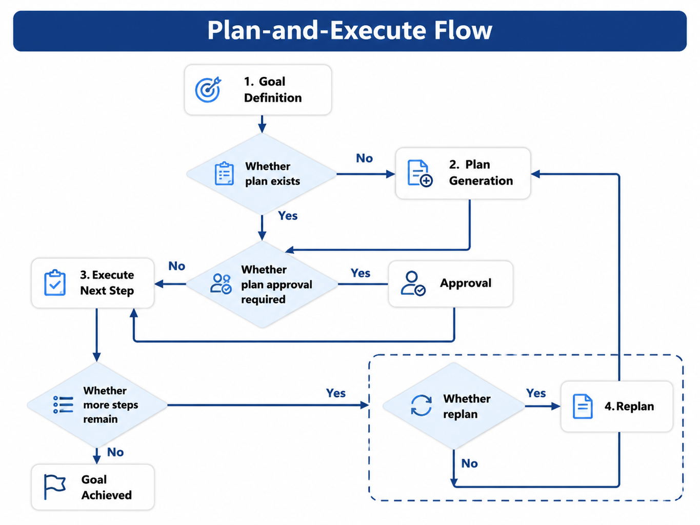

# Chapter 25 Planner and Orchestration Patterns

---
## Chapter Summary

This chapter discusses the role of the Planner within the Agent platform and how to choose orchestration patterns such as ReAct, Plan-and-Execute, and state graphs. The Planner is responsible for deciding "what to do next" but does not execute tools; the Runtime advances the Run state, calls the Registry, pushes events, and writes checkpoints. This boundary, though seemingly simple, determines whether the Agent is controllable. Starting from the DataAgent question-answering task, the chapter explains the inputs and outputs of the Planner, the stepwise exploration of ReAct, the pre-planning approach of Plan-and-Execute, the applicable boundaries of state graphs, and how the mini-platform consolidates these patterns into a single `next_step()` interface.
## Key Terms

Planner, ReAct, Plan-and-Execute, State Diagram, PlannerDecision, Separation of Proposal and Execution
## Learning Objectives

- Understand the boundary of the Planner's "proposal only, no execution" role, and its relationship with Runtime and Registry.
- Be able to choose among ReAct, Plan-and-Execute, or state diagram orchestration based on task structure.
- Be able to design single-step decision interfaces like `PlannerDecision` to allow for interchangeable Planners and governable Runtime.
- Be able to recognize signals of Planner going out of control, such as detours, repeated tool invocations, unauthorized proposals, and plan drift.

---
## Opening Scenario

Chapter 22 explains how the Runtime drives a Run forward, and Chapter 23 explains how a tool is registered as a ToolSpec. But there is still one missing role: who reads the context, tool history, and user task in each Step, and decides which tool to call next—or whether to end?

Take DataAgent answering questions as an example. The user asks, "What were the main SKUs with sales decline in East China last week?" The Runtime only manages state and execution; the Registry only manages tool definitions and invocation. The real judgment lies in deciding: Should it first look up the region code, or directly query sales details? If the SQL query fails, should it adjust parameters or switch to a semantic layer approach? When the result is sufficient, can it generate the final answer? This judgment is the Planner’s responsibility.

If planning and execution are both coded inside the RunLoop, every business Agent will duplicate a set of prompts, tool selection, and error recovery logic. When version 1 upgrades, the behavior easily drifts. A more robust approach is for the Planner to only return structured decisions, while the Runtime decides whether to execute, how to execute, how to log, and how to recover.

This separation also makes troubleshooting easier for the team. If SQL parameters are wrong, first check whether the Planner generated incorrect `args`; if a tool refuses to execute, first check the Registry schema and policy; if a task is stalled for manual approval, first check the Runtime’s state and approval callbacks. Without this boundary, all problems get blamed on "model instability," making debugging rough and coarse.

The Planner chapter easily becomes an algorithm checklist, but enterprises really care about responsibility boundaries. When a question-answering task fails, the business side doesn’t need to know whether ReAct or state machine was used internally; they need to know whether the task is still running, which tool failed, if permissions need to be supplemented, or if recovery is possible. The Planner’s mode choices should serve these concerns, not just showcase framework capabilities.

---
## 25.1 Planner Responsibility Boundaries

### 25.1.1 Planner Decides the Next Step

The Planner receives input from three sources: the user task and tenant context, the tool view provided by the Registry, and history stored by the Runtime and Memory. Its output should be a small, explicit decision object—not a direct tool invocation.

*Table 25-1: Planner Inputs and Outputs. Source: Author compilation.*

| Category | Content | Description |
|---|---|---|
| Input | `input`, `context`, `step_index` | From `/run` request and RunContext |
| Input | tools schema, tool version | From Tool Registry |
| Input | Tool Call results, errors, Memory snippets | From Runtime checkpoints and Memory |
| Output | `finish`, `answer` | Planner believes the task can be completed |
| Output | `tool`, `version`, `args` | Planner proposes a Tool Call |

The tool view should not be imported directly by the Planner from handlers. The schema the Planner sees must be the same source as the schema validated by the Registry before execution; otherwise, the model might see one set of fields while the executor validates another, making errors difficult to reproduce.

Planner inputs should also be scoped carefully. Feeding the model the full set of tools, entire conversation history, and all document fragments may seem comprehensive but actually reduces the stability of tool selection. The Runtime and Memory should give the Planner only the minimal necessary context for the current Run. The tool list should be trimmed by tenant, permissions, and workflow state.

For example, a business analysis Agent may register tools for SQL, charting, email, tickets, and knowledge base. When the user simply asks “Why did sales decline in East China?”, the Planner should not be shown email sending or ticket creation tools yet. Once a report draft is generated and enters the publishing workflow, the Runtime can open publishing tools based on state and Policy to decide if HITL applies. Changing the tools available with state changes is far more reliable than repeatedly telling the model in the prompt “do not send emails randomly.”

### 25.1.2 PlannerDecision as a Handshake Structure

The platform can represent a single-step decision with the `PlannerDecision` structure.

```python
from dataclasses import dataclass
from typing import Any

@dataclass(frozen=True)
class PlannerDecision:
    finish: bool
    answer: str | None = None
    tool: str | None = None
    version: str | None = None
    args: dict[str, Any] | None = None
```

`finish=True` only means the Planner believes the task can end. The Runtime must still confirm there are no unfinished Tool Calls before triggering `done` and entering the `succeeded` state. The `tool` and `args` are only proposals—Runtime must first perform Policy, schema, idempotency, and timeout checks, then execute via Registry.

### 25.1.3 Separation of Proposal and Execution

Separating proposal and execution offers three benefits. First, side effects occur only in the Runtime’s `action` / `result` events, ensuring a complete audit trail. Second, tool errors can be returned as Observations back to the Planner so it can revise the next step instead of outright failing. Third, the Planner logic can be replaced without rewriting Runtime state machine, SSE, checkpoints, or tool governance.

Common mistakes include letting the Planner directly call SQL or HTTP tools. This bypasses Registry versioning, permission checks, and error classification, causing gaps like “results with no action” in the trace. Another mistake is to treat the Planner as business application code with if/else conditions scattered across Agents. The Planner should provide reusable orchestration patterns; business differences should be expressed via Agent config, tool whitelists, and prompt templates.

An even subtler error: the Planner describes tool constraints in prompts, but the Runtime lacks hard validation. Models tend to obey constraints until an edge case breaks them. Production systems should never rely on “model probably won’t do this” for safety—constraints must be enforced in Registry, Policy, and Runtime execution paths.

---
## 25.2 ReAct: Acting While Observing

### 25.2.1 Suitable for Exploratory Tasks

ReAct interleaves reasoning and actions: the model first determines the next action, the Runtime executes the tool, then the tool’s output is fed back as an observation to the Planner. The ReAct paradigm proposed by Yao et al. emphasizes a loop of Thought, Action, and Observation (Yao et al. 2023). In enterprise platforms, the Thought is not necessarily exposed to users, Action should materialize as a Tool Call, and Observation must come from real tool outputs or structured error messages.

Operational inquiry questions usually fit ReAct well. User questions are often not fully clear at the outset, so the Planner needs to check and adjust step-by-step: first confirm the regional scope, then query SKU rankings, then decide whether to query inventory or gross margin based on results. The path cannot be fully hardcoded in advance, so the iterative feedback of ReAct feels more natural than a fixed one-shot plan.

### 25.2.2 Single-Turn Mechanism

Each ReAct iteration's `next_step()` roughly involves five steps:

1. The Runtime passes the user query, historical Tool Calls, Memory fragments, and available tools to the Planner.
2. The Planner calls the model via Gateway, providing the tools schema.
3. The model returns either a tool call intent or a final answer.
4. The Planner parses the response into a `PlannerDecision`.
5. The Runtime follows the decision to execute tools, invoke human approval, continue to the next step, or finish.

If the Registry returns `TOOL_ARGUMENT_INVALID`, the Runtime should not fail immediately. Instead, it can record the error in `result` and call the Planner again to generate new parameters. Conversely, if the Runtime detects the same tool call with identical parameters repeating, it should trigger loop protection rather than letting the Planner keep trying.

### 25.2.3 Advantages and Costs

*Table 25-2: ReAct advantages and costs. Source: Compiled by the book.*

| Dimension       | Advantages                                     | Costs                              |
|-----------------|-----------------------------------------------|-----------------------------------|
| Task Fit        | Suitable for exploratory, multi-hop, incomplete information tasks | Number of steps unpredictable      |
| Cost            | Each step solves a local subproblem           | Multi-step accumulates latency and token usage |
| Observability   | Tool Call trace explains task path             | Thought drafts should not be exposed directly |
| Recovery        | Single-step errors can be locally corrected    | Requires `max_steps` and loop detection           |

The key to ReAct is not letting the model “free roam,” but containing each step’s freedom within the Runtime: tools come from the Registry, actions executed by the Runtime, results saved to checkpoints, errors classified by error codes. Without these boundaries, ReAct quickly turns into uncontrollable loops.

In practice, the most common failure of ReAct is repeatedly fixing the same error. For example, the model generates the same SQL missing tenant filters three times, differing only in spacing or field order. The Runtime should normalize tool parameters and summarize them, stopping after hitting a repetition threshold rather than burning tokens endlessly. Another common failure is “verbal completion”: the model produces a summary but the last tool call hasn’t returned yet. The final state must still be decided by the Runtime.

Another failure source comes from incomplete observation information. The Planner might see the SQL returns an empty set and directly conclude “no sales decline.” But an empty set could also indicate a wrong table, incorrect date filter, or overly strict permission filter. The Runtime can feed back tool errors and data quality signals together to the Planner, e.g., “Query succeeded but result is empty, and filter includes newly launched channel fields.” The more structured the Observation, the easier it is for the Planner to fix issues.

In practice, the most common failure of ReAct is repeatedly fixing the same error. For example, the model generates the same SQL missing tenant filters three times, differing only in spacing or field order. The Runtime should normalize tool parameters and summarize them, stopping after hitting a repetition threshold rather than burning tokens endlessly. Another common failure is “verbal completion”: the model produces a summary but the last tool call hasn’t returned yet. The final state must still be decided by the Runtime.

---
## 25.3 Plan-and-Execute: Plan First, Then Execute

### 25.3.1 Suitable for Tasks Requiring Pre-Audit

Plan-and-Execute generates a plan first, then executes it step by step. It is suitable for tasks with strong compliance requirements, relatively clear workflows, and that require pre-execution auditing. For example, a financial closing assistant must first specify which tables will be checked, what filters will be applied, and what reports will be generated before running queries; only after the approver approves the plan will the runtime allow execution.

The plan itself is an artifact. It can enter checkpoints, approval workflows, and audit exports. After approval, the Planner outputs `PlannerDecision` step by step according to the `plan_cursor`. The runtime still executes tools according to the rules explained in Chapter 22.

### 25.3.2 Two-Stage Mechanism

The Plan stage should not execute any tools. The Planner only generates a structured plan based on the task, tool summaries, and policies.

```json
{
  "steps": [
    {"id": 1, "goal": "Parse East China region_code", "tool_hint": "sql_executor"},
    {"id": 2, "goal": "Query SKU sales ranking", "tool_hint": "sql_executor"},
    {"id": 3, "goal": "Summarize natural language answer", "tool_hint": null}
  ]
}
```

The Execute stage generates tool call proposals step by step based on the plan. If an Observation invalidates a planning assumption, e.g., the region code does not exist, the Planner can Replan, but the Replan must also be recorded in the `planner_output` for auditing purposes.



*Figure 25-1: Plan-and-Execute flow. Source: drawn by the author. Alt text: The process starts with the Planner generating a multi-step plan, then executing step-by-step; if errors or invalid assumptions occur, it goes back to replanning. Arrows illustrate the difference between planning before execution and the ReAct approach that thinks and acts simultaneously.*

### 25.3.3 Trade-offs Between ReAct and Plan-and-Execute

*Table 25-3: Trade-offs between ReAct and Plan-and-Execute. Source: compiled by the author.*

| Dimension         | ReAct                        | Plan-and-Execute                           |
|-------------------|------------------------------|-------------------------------------------|
| Plan Visibility   | Scattered across each Step    | Generates full plan first                  |
| Human Approval   | Usually tool or artifact-based | Plan is approved upfront                   |
| Task Type          | Exploratory data queries, multi-hop unknowns | Clear paths, strong compliance, pre-audit needed |
| Risk                  | May detour or loop               | Planning errors affect subsequent steps    |
| Default Recommendation | Data exploration & general agents | Finance, legal, cross-system high-risk tasks |

Plan-and-Execute is not inherently a “more advanced” default option. For exploratory tasks, it may generate a seemingly complete but soon outdated plan and require frequent replanning, raising costs. For tasks requiring pre-execution auditing, it is highly valuable, since the plan can be reviewed by people and systems beforehand.

Plans also need versioning and schemas. Free-text plans are prone to misinterpretation during execution—for example, “query key SKUs” could mean sorting by revenue, sales volume, or profit margin. Structured plans should at least specify each step’s goal, tool hint, input dependencies, and completion criteria. When the plan is submitted for approval, approvers review a process artifact that is executable and accountable, not just a model’s informal thoughts.

Financial scenarios especially benefit from this approach. A closing assistant can generate a plan first: which accounts to read, which dimensions to reconcile, which variance reports to generate, which steps need manual confirmation. Approvers approve the plan and permission boundary—not a natural language explanation from the model. If a step fails during execution, the Planner can replan only the remaining steps instead of canceling the entire run.

---
## 25.4 State Graphs and Workflow Boundaries

Frameworks like LangGraph use directed graphs to represent complex agent workflows: nodes correspond to function calls, model invocations, or tool wrappers, while edges represent conditional routing. State graphs are well suited for multi-branch processes, subgraph reuse, complex human-in-the-loop (HITL) gates, and node-level replay. However, the state graph remains an internal Planner implementation detail and cannot replace the six Run states.

The platform's external interface only needs to consistently expose the Run states such as `planning`, `executing`, `waiting_human`, `succeeded`, and `failed`. Internal node names like `fetch_schema`, `reflect_sql`, or `rerank_tools` should never be directly exposed to the Console or ticketing systems. Otherwise, whenever the framework or node implementation changes, the frontend and audit reports risk being tightly coupled to internal details.

A simple guideline for choosing whether to use state graphs is as follows: if the task involves just a single-agent ReAct or a linear Plan-and-Execute flow, a RunLoop with a `planner.mode` is sufficient; if the same Run involves multiple Planner roles, reusable subgraphs, multiple HITL gates, or node-level A/B tests, then explicit StateGraph use is warranted. If the workflow mainly consists of human and system tasks, external BPM systems should manage gates and SLAs while LLM inference remains embedded in Planner nodes.

### 25.4.1 Mapping Principles

The internal state graph can be complex, but the external mapping should be restrained.

- When the graph enters a model planning node, the external state can remain `planning` or `executing`.
- When the graph triggers a Tool Call, it maps externally to the Runtime state `action`.
- When the graph enters a human intervention state, externally it maps to `waiting_human`.
- Internal reflection or reranking usually remains `executing` externally, with detailed information recorded in the Trace.

This mapping layer is an engineering concern, not a documentation detail. Without it, framework states and product states will diverge, making SLA management, replay, and alerting difficult.

Another risk with state graphs is over-modeling. Many teams initially convert every decision point into a graph node, resulting in beautiful but harder-to-debug graphs. To decide if a state graph is needed, use this criterion: if node states do not require reuse, replay, or separate evaluation, avoid lifting them into graph nodes. Simple Python branching with clear logging is usually better.

The value of state graphs lies in reusing complex paths. For example, in compliance review, routine reports follow one path, reports involving personal data enter a data-masking subgraph, and reports involving competitor claims enter a legal review subgraph. Such paths have clear reuse value and suit graph modeling. In contrast, picking between two tools based on a simple if statement does not justify forcibly modeling it for framework consistency.

---
## 25.5 mini-platform Implementation Path

### 25.5.1 Scope of Implementation

The mini-platform includes two paths. `projects/multi-agent-workflow/lib/planner.py` contains the practical project’s `MultiAgentPlanner`, which outputs Handoff, Tool Call, or FINISH decisions based on `active_agent_id`. The `core/planner/` directory provides a generic Planner interface, rule-based demos for ReAct and Plan-and-Execute, and the `create_planner(config)` factory for potential integration with a real Gateway later.

```
mini-platform/core/planner/
├── base.py
├── config.py
├── react_planner.py
├── plan_execute.py
└── planner.py

projects/multi-agent-workflow/lib/
└── planner.py
```

The recommended reading order for the code is to start with `base.py` to understand `PlannerDecision`; then review `react_planner.py` and `plan_execute.py` to learn the two modes; finally look at how `run_loop.py` calls the Planner and passes decisions to the Registry for execution.

### 25.5.2 Configuration Examples

The Planner mode should be configured within the Agent setup, rather than hardcoded in the Prompt.

```yaml
agent_id: demo-data-agent
planner:
  mode: react
  model: gpt-4o
  tools:
    - name: sql_executor
      version: v2
runtime:
  max_steps: 20
  run_timeout_s: 900
```

Plan-and-Execute can add planning model, execution model, max replans, and a plan approval switch.

```yaml
planner:
  mode: plan_execute
  planning_model: gpt-4o-mini
  execution_model: gpt-4o
  max_replan: 2
  plan_requires_approval: true
  plan_schema: plans/finance_v1.json
```

Switching the `planner.mode` should be treated as a new Agent version requiring re-evaluation. Switching mid-run within the same `run_id` from ReAct to Plan-and-Execute is not allowed because checkpoints, evaluation, and audit become hard to interpret.

Configurations should also record default tool versions. The Planner should not fetch “latest” tools from the Registry each time because the same problem might then follow different schemas days later. Tools versions should be pinned into checkpoints at run startup, ensuring all steps use the same tool views unless the run is recreated.

Evaluation should separate modes. ReAct focuses on step count, loop rate, tool argument fix success rate, and final answer quality; Plan-and-Execute examines plan readability, approval pass rate, replan frequency, and execution deviation; and state charts look at node mapping, branch coverage, and recovery consistency. Mixing all modes into a single average score masks real issues.

Failed samples should be attributed by mode. ReAct failures often come from too many tools; Plan-and-Execute failures from overly loose plan schemas; state chart failures from node states not folding into the Run properly. Different causes require different fixes.

Therefore, Planner quality review should not only look at the final answer. It must also evaluate whether decision paths are short, tool selection is stable, failures are correctable, and the "Planner proposes, Runtime executes" boundary is always upheld. All evidence should be reconstructible from Trace and checkpoints.

If only the final answer is visible without seeing how the Planner arrived at it, the system remains at a chatbot interface level. A truly platform-grade Planner allows every decision step to be replayed, constrained, and replaced.

### 25.5.3 Acceptance Criteria

Planner-related acceptance should not only verify “task completion” but also whether boundaries are maintained.

*Table 25-4: Checklist Before Planner Launch. Source: Compiled by this book.*

| Checklist Item        | Judgment Criteria                                          |
|-----------------------|-----------------------------------------------------------|
| Planner does not execute tools | Code paths do not include Registry `invoke` or tool handler calls |
| Tool views have a common source | Planner sees schema from Registry                         |
| Failures provide feedback    | Errors like `TOOL_ARGUMENT_INVALID` feed into next Planner input |
| Loops are terminable         | Configured `max_steps`, parameter summaries, and repeat call thresholds |
| Mode is versioned            | `planner.mode`, model, and tool versions recorded in Agent manifest |
| States are mappable          | Internal graph states fold into Run’s six states and SSE  |

The first acceptance version can select three tasks: an exploratory Q&A task using ReAct, a plan approval task using Plan-and-Execute, and a complex branching task using the state chart. All three tasks share the same Runtime and Registry. If all can produce consistent `state`, `action`, `result`, checkpoints, and error codes, the Planner layer is truly replaceable.

This is also a prerequisite for later introducing LangGraph or other frameworks. Frameworks can replace Planner internal implementations but must not alter the outer Run contract. With this stable boundary, the platform team can gradually experiment with more complex orchestration modes without impacting already deployed tool governance and audit chains.

The first version does not need to perfect all modes. A more realistic goal is: by default, ReAct can reliably handle Q&A; Plan-and-Execute covers scenarios requiring plan approval; and state charts are used only where complex flow reuse is clearly valuable. This ensures the designs in this chapter translate into code and evaluation, not remain mere conceptual comparisons.

---
## Chapter Recap

1. The Planner is responsible for deciding the next step, while the Runtime handles execution and governance. The two coordinate through the `PlannerDecision` handshake.
2. ReAct is suitable for exploratory, multi-hop, and incomplete information tasks, but it requires defining step counts, loops, and tool boundaries.
3. Plan-and-Execute is appropriate for tasks with clear paths that require prior auditing or approval of plans.
4. Statecharts can be used to implement the Planner internally but cannot replace the Runtime’s six states or platform checkpoints.
5. Planner modes must be configurable, versioned, and integrated into evaluation and rollback processes.
## Further Reading

- [Chapter 22 Agent Runtime](ch22-agent-runtime.md)
- [Chapter 23 Tool Registry & Function Calling](ch23-tool-registry-function-calling.md)
- [Chapter 26 Agentic Workflow](ch26-agentic-workflow.md)
- [Chapter 28 Multi-Agent Collaboration](ch28-agent.md)
- [Chapter 30 Human-in-the-loop and Long-running Tasks](ch30-human-in-the-loop.md)
- [Chapter 45 vLLM + LiteLLM Model Routing Gateway](../../part08-deployment/ch/ch45-llm.md)
- `mini-platform/projects/multi-agent-workflow/README.md`
## References

Wang, L., Ma, C., Feng, X., et al. (2024). A survey on large language model based autonomous agents. *Frontiers of Computer Science*, 18(6), 186345. [https://doi.org/10.1007/s11704-024-40231-1](https://doi.org/10.1007/s11704-024-40231-1)

Yao, S., Zhao, J., Yu, D., et al. (2023). ReAct: Synergizing reasoning and acting in language models. *ICLR*. [https://arxiv.org/abs/2210.03629](https://arxiv.org/abs/2210.03629)

Qu, C., Dai, S., Wei, X., Cai, H., Wang, S., Yin, D., Xu, J., & Wen, J.-R. (2025). Tool learning with large language models: A survey. *Frontiers of Computer Science*, 19(8), 198343. [https://doi.org/10.1007/s11704-024-40678-2](https://doi.org/10.1007/s11704-024-40678-2)

OpenAI. (n.d.). *Function calling*. OpenAI API documentation. [https://developers.openai.com/api/docs/guides/function-calling](https://developers.openai.com/api/docs/guides/function-calling)

LangChain. (n.d.). *LangGraph persistence*. [https://docs.langchain.com/oss/python/langgraph/persistence](https://docs.langchain.com/oss/python/langgraph/persistence)

Masterman, T., Besen, S., Sawtell, M., & Chao, A. (2024). The landscape of emerging AI agent architectures for reasoning, planning, and tool calling: A survey. [https://arxiv.org/abs/2404.11584](https://arxiv.org/abs/2404.11584)
