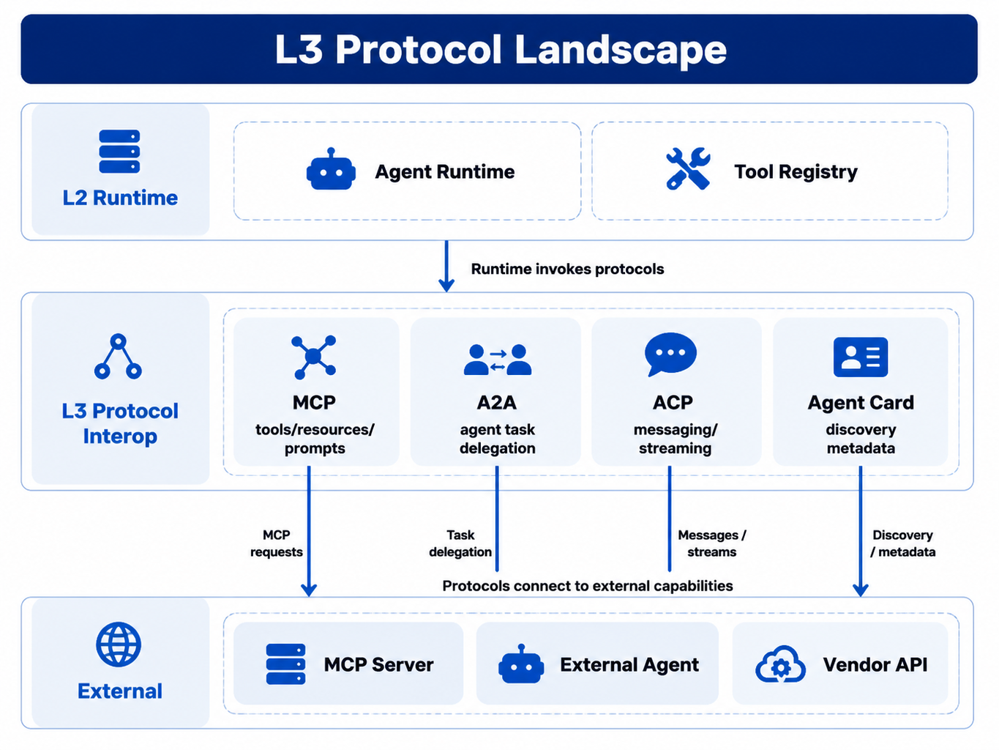
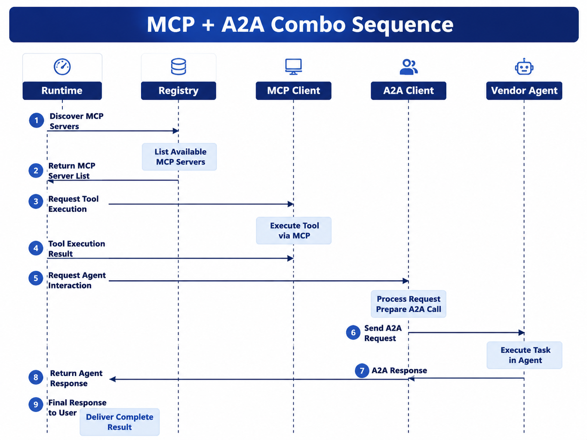

# Chapter 29 Agent Protocols and Standards

---
## Chapter Summary

This chapter discusses protocol interoperability within the Agent platform. MCP, A2A, Agent Card, and ACP address different layers of problems: MCP targets models and tools; A2A focuses on task delegation between Agents; Agent Card is aimed at capability discovery; ACP supports continuous message collaboration. When enterprises adopt these protocols, the protocol adaptation layer must not bypass the internal Registry, Policy, Run six-state lifecycle, and auditing mechanisms. This chapter presents the protocol landscape, the applicable boundaries of each protocol, and the implementation constraints for the protocol adaptation layer in the mini-platform.
## Key Terms

Agent Protocol, MCP, A2A, Agent Card, ACP, Protocol Adaptation Layer, Registry
## Learning Objectives

- Be able to distinguish the applicable targets of MCP, A2A, Agent Card, and ACP.
- Be able to explain why external protocols cannot replace platform Runtime and Tool Registry.
- Be able to design a protocol adaptation layer so that external capabilities still enter the `action`, `invoke`, and `result` call chain.
- Be able to identify production risks such as Agent Card, A2A long tasks, and MCP tool version drift.

---
## Opening Scenario

Chapter 24 has already explained how MCP exposes tools and resources to models, and Chapter 28 discusses Handoff between Agents within the platform. Real-world enterprise platforms face a third type of challenge: external vendors, Agents on other clouds, desktop tools, internal API gateways, and model vendor tool interfaces may all request integration with the same Agent platform.

Consider a sentiment analysis scenario. An internal Data Agent can query sales through a semantic layer, while an external vendor provides a sentiment monitoring Agent that only exposes an A2A endpoint and an Agent Card. The business wants to include both sales decline and sentiment changes in the same operational report. The platform cannot allow the Runtime to call the vendor’s endpoint directly, nor treat the A2A Task as an unmonitored HTTP request. The correct approach is to import the external Agent into the L1 Catalog and register it via an A2A adapter as an internal ToolSpec or Handoff target; the Runtime still only sees a single Registry `invoke`, and the Trace records the `run_id`, inputs, outputs, external task ID, and artifact hash.

This is exactly the role of the protocol layer. Protocols solve cross-boundary interoperability, while the platform core manages runtime states, permissions, checkpoints, auditing, and recovery. MCP, A2A, Agent Card, and ACP can coexist, but none should bypass the Registry to directly trigger enterprise side effects.

---
## 29.1 Protocol Landscape

Agent platforms are typically divided into three layers: L1 Control Plane, L2 Runtime, and L3 Protocol Interoperability. L3 is not a single protocol, but a set of adapter layers organized by collaboration targets. For tools and resources, use MCP; for remote Agent delegation, use A2A; for capability discovery, use Agent Card; for continuous messaging and event collaboration, consider ACP or map to an internal Event Bus; for model function calls, Gateway and Registry export the schema.



*Figure 29-1: L3 Protocol Landscape. Source: drawn by the authors. Alt text: The layered landscape stacks MCP, A2A, Agent Card, and internal Registry by responsibility, with arrows indicating their connection points.*

*Table 29-1: Key Agent Protocols, Their Objects, and Platform Integration Methods. Source: compiled by the authors.*

| Protocol or Mechanism | Primary Object | Typical Use Case | Platform Integration Method |
|---|---|---|---|
| MCP | Tools, Resources, Prompt Templates | SQL tools, file resources, enterprise system operations | Adapted as ToolSpec, handler calls MCP Client internally |
| A2A | Remote Agents | Delegating to vendor agents or cross-organization agents | Adapted as external Agent Tools or Handoff targets |
| Agent Card | Agent Metadata | Discover endpoints, skills, authentication methods | Imported into L1 Catalog, generates AgentSpec |
| ACP | Inter-Agent Messages or Events | Continuous collaboration, event broadcasting | Mapped to internal Event Bus or async Tools |
| Model tools API | Model function calls | OpenAI, Anthropic tool calls | Registry exports schema; Runtime still uses Registry |

The key takeaway from this table is not “which protocol is best,” but to first determine who the collaboration target is. A database query shouldn't be wrapped as an A2A Agent; a vendor’s full analysis service shouldn't be forced into MCP `tools/call`. Choosing the wrong protocol distorts permissions, timeouts, and audit models.

Protocol adaptation must follow three principles. First, Runtime does not import protocol Clients—only the Registry. Second, each external capability registers only one entry point, avoiding the same side effect being triggered via both MCP and A2A simultaneously. Third, Policy enforcement happens before outbound calls; tenants, security levels, and PII checks cannot be skipped simply because the counterparty supports a “standard protocol.”

The most common source of chaos in the protocol layer is mistaking “interoperability” for “direct connection.” Just because an external Agent claims to support A2A does not mean it can directly enter the production network. Similarly, an MCP Server returning tool schemas does not mean those tools conform to the enterprise permission model. The platform needs a clear adapter boundary between protocols and internal calls, transforming external capabilities into internally governable objects.

This boundary also determines fault attribution. Runtime only sees internal ToolSpecs and Tool Calls; the protocol adapter layer handles connection failures, authentication failures, remote status exceptions, and version incompatibilities; L1 Catalog handles capability onboarding, deprecation, and ownership. Separating these three layers clearly is essential to determine if an incident was caused by platform routing, adapter errors, or vendor capability faults.

---
## 29.2 Positioning of MCP

The core objects of MCP are tools, resources, and prompt templates. It is suitable for standardizing external capabilities into a discoverable, invocable, and describable tool catalog. IDEs reading repositories, local desktop tools, enterprise SQL query services, ticketing systems, and read-only document resources are all well suited to be exposed to Agents through MCP.

Within the platform described in this book, MCP does not directly enter the Runtime. The MCP Server’s tools are first registered as ToolSpec objects via an adapter layer. After the planner selects a tool, the Runtime calls the Registry; internally, the handler uses an MCP Client to initiate a `tools/call`. This approach leaves MCP transmission modes, server upgrades, and connection management within the protocol adapter layer, so the RunLoop does not need to know about stdio, Streamable HTTP, or other transport details.

```text
MCP Server tool
    -> adapter snapshot
    -> ToolSpec(name, version, schema)
    -> Runtime action
    -> Registry invoke
    -> MCP Client tools/call
    -> result
```

One commonly overlooked aspect when integrating MCP is version snapshots. The response to `tools/list` changes as the Server updates, but historical Runs need to be reproducible. If a vendor modifies `query_sales(region)` to `query_sales(regions)`, the platform must not allow old Runs to suddenly match the new schema during replay. The L1 layer should save a snapshot of the tool list at registration time; server upgrades introduce new ToolSpec versions rather than overwriting `v1`.

MCP is also not suited to handle all forms of collaboration. Long-running asynchronous agent delegation, cross-organization task state, external agent capability declarations, and ongoing multiparty messaging are not MCP’s strengths. Such requirements are better addressed through A2A communication, Agent Cards, or internal Event Buses rather than turning everything into a gigantic MCP tool.

The security boundary of MCP must be concretely implemented. stdio is suitable for local development and sidecar scenarios but in Kubernetes environments requires managing process lifecycles, stdout/stderr contamination, and container permissions. Streamable HTTP is better for remote servers but must handle TLS, authentication, request size limits, timeouts, and retries. Regardless of transport, MCP Servers should never directly expose public database capabilities; backend systems are typically accessed through enterprise API gateways or controlled services.

Resources and prompts should be governed separately as well. Read-only resources can be loaded into the Planner as Memory or contextual loaders but must log URI, etag, and access time metadata. Prompt templates can be maintained by compliance or branding teams but should not allow remote prompts to replace local system prompts versionlessly during Runs. MCP provides a distribution mechanism, not content governance itself.

---
## 29.3 A2A and Agent Card

A2A addresses task delegation between Agents. Its target is not a single function but a piece of work that may have state, progress, and artifacts. When the internal platform assigns tasks to external public opinion Agents, legal review Agents, or industry knowledge Agents, A2A is semantically closer than MCP.

When the platform integrates A2A, the outer Run still exists. An A2A Task is just one external Tool Call or asynchronous Handoff within the Run. The Trace should record delegation input, external task ID, status changes, returned artifacts, timeout policies, and vendor versions. If the A2A Task requires user-supplied materials, it can be mapped to the platform’s `waiting_human` status or a sub-form. If the external Task times out, the outer Run should be able to cancel, retry, or degrade gracefully.

*Table 29-2: Mapping between A2A Task and Platform Run. Source: Compiled by this book.*

| A2A Concept | Platform Mapping | Design Requirements |
|-------------|------------------|---------------------|
| Task        | Tool Call or external Handoff | Record `external_task_id` |
| Message     | Outbound payload or returned content | Data must be desensitized by Policy before outbound |
| Task Status | `executing`, `waiting_human`, `failed`, etc. | Outer Run must nest with external Task timeouts |
| Artifact    | Result references or report attachments | Save hash, source, and version |

Agent Card is a discovery layer, not an execution layer. It describes the Agent’s name, version, endpoint, skills, authentication method, and capability limits. After importing the Card URL at L1, the platform should verify the schema, authentication info, network access scope, and version before mapping it to an internal AgentSpec. The Router uses the internal AgentSpec rather than fetching the remote Card at runtime each time.

The production risk of Agent Cards lies in discrepancies between the declared and actual capabilities. Vendors may modify endpoints, remove skills, change authentication methods, or have temporary Card inaccessibility. The platform should pin `etag` or versions, refresh periodically, and mark stale; failure to refresh should not immediately delete the old Spec. Before enabling an external Agent, smoke tests as described in Chapter 41 should be run to confirm the declared capabilities are truly available.

When importing Cards, SSRF protection is also essential. L1 should disallow access to arbitrary intranet URLs, private IP ranges, or redirect chains. More reliable approaches include URL allowlisting, using a static egress proxy, prohibiting resolution of private subnets, and placing secret keys in secret management rather than embedding them in the Card text.

A2A’s timeout design must be bound to the outer Run. If the external Task may take up to 30 minutes, the outer Run cannot allow only 5 minutes. If the outer Run is canceled by the user, the A2A Client must also propagate the cancel signal upstream or at least mark the remote task as orphaned and enter a compensation workflow. Otherwise, the user will see failure while the vendor side continues running, and returned artifacts later have no place to go.

Outputs from external Agents should not directly enter the final answer. The platform must at minimum verify artifact type, size, hash, source, and security classification. For natural language conclusions, it must clarify whether it was generated by the external vendor or internally summarized by a Report Agent. Reports involving business, finance, or compliance should retain references to the original output from the external Agent so audits can trace back to the vendor output, rather than just see internally rewritten sentences.

---
## 29.4 ACP and Event Collaboration

ACP focuses on continuous messaging and event collaboration. It is suitable for scenarios where multiple agents append messages around a single conversation or event stream. For example, after a report draft is generated, the brand agent, legal agent, and data agent all subscribe to the same review thread. Compared to A2A, ACP is more like an ongoing conversation or message bus; compared to MCP, it is not a tool invocation protocol.

Enterprise platforms usually have an internal Event Bus. The appropriate place for the ACP adaptation layer is to convert external messages into internal event envelopes, which are then handled by the L2 Event Bus, Policy, and Runtime to decide whether to trigger follow-up actions. ACP messages must not directly trigger `invoke` calls, otherwise external messages would bypass permissions and auditing controls.

*Table 29-3: Interoperability Requirements and Protocol Selection. Source: Compiled by this book.*

| Requirement                           | Preferred Method        | Description                             |
|-------------------------------------|------------------------|---------------------------------------|
| Calling external SQL or file tools  | MCP                    | Clear tool catalog and schema         |
| Delegating complete analysis to external agents | A2A + Agent Card        | Supports task status and artifacts    |
| Multiple internal agents reviewing a report | Platform Event Bus      | Controlled by internal Policy and auditing |
| External synchronization of continuous collaboration messages | ACP or Event Bus adapter | Suitable for event streams; not as execution entry |
| Model-side function calls            | Registry-exported tools schema | Does not bypass enterprise tool governance |

ACP’s maturity and ecosystem are still evolving. This book treats it as an observable direction rather than a primary production dependency. The initial edition of the platform should first stabilize the internal Event Bus, asynchronous Tools, HITL (Human-in-the-Loop), and Trace, before considering ACP as a boundary adapter.

A common pitfall in event collaboration is treating events as commands. A `report.ready` event can notify the brand agent or reviewer to access the report, but it should not by default trigger publishing, deletion, or external sending. Actions with side effects should still go through Registry Tools and be governed by Policy. Events express "what happened," while commands express "what to do." Mixing the two blurs permission control and replayability.

If there is indeed a need for external messages to drive internal Runs, the platform should first convert messages into controlled requests. This conversion process requires verifying tenant identity, signatures, idempotency keys, event timestamps, and payload schemas, then the Runtime creates or advances the Run accordingly. External ACP messages must not directly invoke internal functions.

---
## 29.5 Protocol Combination Scenarios

Protocol combination is not uncommon. In a single business analysis Run, the Question Agent can first clarify the `query_spec`; the Data Agent calls the semantic layer via MCP to fetch metrics; the Workflow delegates to an external public opinion Agent via A2A; the Report Agent aggregates sales and public opinion; finally, an internal Event Bus notifies the Reviewer. The Runtime still sees a sequence of `action`, `invoke`, `result`, and possibly `waiting_human`.



*Figure 29-2: MCP + A2A combination sequence. Source: drawn by the author. Alt text: A sequence diagram showing an Agent receiving an external task via A2A, internally invoking tools through MCP to complete the task, and returning results via A2A.*

The engineering key point in combination scenarios is to clearly assign ownership at every boundary. MCP call records tool name, schema version, and resource etag; A2A delegations record external task ID, vendor version, and artifact hash; the internal Event Bus records topic, tenant, run_id, and subscribers. This way, when a report has errors, the platform can pinpoint whether the semantic layer metric is wrong, the external public opinion Agent is problematic, or the Report Agent made a mistake.

Model vendors’ tools APIs should also fit within this landscape. OpenAI Function Calling, Anthropic tool_use, or hosted tools can help models express tool invocation intent, but as soon as side effects touch enterprise systems, execution must return to Registry and Policy. Model API convenience cannot replace enterprise permission systems.

Combination scenarios also require unified observability. MCP call failures, A2A Task timeouts, Agent Card staleness, or internal Event Bus delivery delays should all be visible within the same Run Trace. Otherwise, when a report gets stuck, SREs must guess by scouring multiple system logs. The protocol adaptation layer should translate remote errors into stable internal error types, while preserving original error summaries and remote request IDs.

Versioning is a core variable in combination scenarios. The same Run may simultaneously depend on MCP tool version, Agent Card etag, A2A endpoint version, semantic layer version, and report template version. If report outputs do not capture these versions, it is impossible to reproduce why a certain answer was obtained at that time. The greater the protocol interoperability, the more important version freezing becomes.

Protocol combinations also raise data egress issues. Whether internal metrics fetched via MCP by the Data Agent can be passed to an external A2A Agent must be regulated by Policy before outbound transmission. The decision should not solely depend on field names but also consider tenant, data classification, masking status, user roles, and external vendor contract scope. For non-exportable data, the platform can provide aggregated summaries, masked samples, or outright refuse external delegation. Protocol standards do not replace these judgments.

Another design point that must be addressed upfront is result ownership. Public opinion conclusions returned by external A2A Agents can be referenced and rewritten by the internal Report Agent, but vendor conclusions must not be disguised as internal facts. Reports can state “The external public opinion Agent returned the following trend” and retain artifact references in the Trace. This protects traceability of vendor outputs and prevents the internal platform from taking unclear responsibility for externally generated model content.

---
## 29.6 mini-platform Implementation Path

Currently, `mini-platform/core/protocol/` only implements the minimal `ProtocolAdapter`, used to normalize protocol sources into Registry calls. The MCP data tools from Chapter 24 register to the Registry via `tools/mcp_db/registry_bridge.py`; the Part V practical Run chain uses `registry_setup.py`, `register_mcp_tools`, and `Registry invoke`, but it has not yet integrated a full A2A, Agent Card, or ACP adapter.

```text
mini-platform/core/protocol/
├── __init__.py
└── adapter.py

# Production extension targets:
# mcp_adapter.py
# a2a_adapter.py
# agent_card.py
# acp_adapter.py
```

Dependency direction must remain clear: `protocol` can register ToolSpec to the `registry`; `runtime` depends only on `registry` and must never depend directly on `protocol`. If RunLoop directly imports MCP Client or A2A Client, protocol upgrades, transport switching, and vendor replacements will pollute the Runtime.

The currently runnable minimal code is as follows:

```python
from core.protocol import ProtocolAdapter, ProtocolKind
from core.registry import ToolRegistry
from tools.mcp_db import McpDbClient, register_mcp_tools

registry = ToolRegistry()
register_mcp_tools(registry, McpDbClient())

adapter = ProtocolAdapter(registry)
output = adapter.invoke_tool(
    ProtocolKind.MCP,
    "query_sales",
    {"region": "华东", "tenant_id": "demo-tenant"},
)
```

Production extensions can proceed step-by-step. Step one: register the MCP Server’s `tools/list` snapshot as versioned ToolSpec, and complete TLS, timeouts, body size limits, and tenant ACL. Step two: add Agent Card import to generate AgentSpec, and add SSRF protection and stale detection. Step three: implement A2A adapter to map external Tasks to asynchronous Tool Calls, recording external task ID and artifact hash. Step four: consider ACP or external Event Bus adapters, only allowing them into the internal event system.

The protocol adapter layer should be as LLM-testable as possible. MCP can use mock Servers returning fixed tool lists; Agent Cards can be verified via fixture JSON for field mapping; A2A can use mock Task lifecycle tests covering submitted, working, completed, failed; ACP can use event envelopes verifying tenant, run_id, and Policy interception. The more testable the protocol layer is, the less complexity the Runtime must know about external systems.

Before launch, fault drills are essential. MCP Server returns incompatible schemas, Agent Card URL timeouts, A2A Task stuck in working, external Agents returning oversized artifacts, ACP message duplicate deliveries—all should have test cases. If the protocol adapter layer only tests success paths, the first batch of production issues usually occur during remote changes or network fluctuations.

Procurement and onboarding processes should use the same set of evidence. When vendors claim MCP or A2A support, don’t rely only on white papers or demo videos—insist on runnable endpoints, Agent Cards, authentication methods, versioning strategies, error codes, timeout behavior, and log fields. Platform teams can run fixed test runs to verify capability before allowing access to the Catalog. This turns protocol support from "verbal compatibility" into "replayable onboarding records."

The same applies internally. A new MCP Server or internal Agent wanting to enter the production Catalog must first submit ToolSpec or AgentSpec, owner, SLA, permission scope, rollback method, and a minimal test suite. Only after approval can the Router select it. Without an owner, even useful functionality should not enter default routing.

Onboarding failure should have clear states. Capabilities can remain in `draft`, `disabled`, or `stale` to serve dev and test environments, but must not join production candidates. This avoids blocking team experiments while preventing unverified external protocol capabilities from hitting business Runs.

Onboarding records should save test timestamps, environments, responsible parties, and failure reasons. Follow-up retests determine if issues are resolved.

The first version need not aim for full protocol coverage. A more reasonable approach is to stabilize internal Registry, MCP tool integration, and Agent Card import first, then choose a low-risk external Agent for an A2A pilot. ACP or complex multi-party collaboration can expand after internal Event Bus stabilization. Protocol maturity should synchronize with platform governance maturity—not industry buzzwords.

For operations, protocol capabilities need owners and disable paths. When external Agent contracts expire, MCP Servers fail long-term, Cards refresh repeatedly fail, or vendor security incidents occur, L1 must be able to instantly disable the related AgentSpec or ToolSpec and have the Router stop selecting them. Disabling is not deleting: historical Runs must preserve the used version and evidence, while new Runs cannot hit the capability.

Finally, the protocol adapter layer must avoid leaking vendor SDK implementation details into the platform model. A2A SDKs, MCP SDKs, ACP implementations will evolve, but internal ToolSpec, AgentSpec, Run state, and Trace schemas must remain stable. As long as this boundary is maintained, the platform can swap vendors, upgrade protocols, or roll back adapters without rewriting the Runtime.

Acceptance can use a minimal yet complete set of test cases. MCP cases validate tool snapshots, schema checks, tenant ACL, and replay; Agent Card cases validate import, refresh, stale marking, SSRF protection, and disable; A2A cases verify long tasks, cancellation, timeouts, artifact hash, and external task ID; event cases verify duplicate delivery and idempotency handling. Each case should leave readable evidence in the Trace. Protocol chapters that show only success calls without validating these boundaries struggle to support real procurement and production onboarding.

---
## Chapter Recap

1. MCP, A2A, Agent Card, and ACP address interoperability at different levels and are not interchangeable.
2. External protocols belong only to the L3 adaptation layer; the Runtime still invokes capabilities through the Registry.
3. MCP is suitable for tools and resources, A2A is suitable for external Agent delegation, Agent Card is suitable for capability discovery, and ACP is better suited for event collaboration.
4. Agent Card import, long-running A2A tasks, and MCP tool version drift must all be included in L1 management and tracing.
5. Whenever side effects touch enterprise systems, they must go through the Registry, Policy, and Audit processes.
## Further Reading

- [Chapter 24: MCP and the Enterprise Tool Ecosystem](ch24-mcp.md)
- [Chapter 28: Multi-Agent Collaboration](ch28-agent.md)
- [Chapter 2: Platform API Layering](../../part01-overview/ch/ch02-agent.md)
- [Chapter 50: Policy and Permissions](../../part10-security-org/ch/ch50.md)
- [Chapter 38: Agent Traces and Session Replay](../../part07-observability-eval/ch/ch38-trace.md)
## References

Model Context Protocol. (2024). *Specification* (2024-11-05). [https://modelcontextprotocol.io/specification/2024-11-05](https://modelcontextprotocol.io/specification/2024-11-05)

Anthropic. (2024). *Introducing the Model Context Protocol*. [https://www.anthropic.com/news/model-context-protocol](https://www.anthropic.com/news/model-context-protocol)

Google. (2025). *Agent2Agent (A2A) Protocol*. [https://google.github.io/A2A/](https://google.github.io/A2A/)

IBM. (2025). *Agent Communication Protocol (ACP)*. [https://github.com/i-am-bee/agent-communication-protocol](https://github.com/i-am-bee/agent-communication-protocol)

OpenAI. (n.d.). *Function calling*. [https://developers.openai.com/api/docs/guides/function-calling](https://developers.openai.com/api/docs/guides/function-calling)

Anthropic. (2024). *MCP SDK*. [https://github.com/modelcontextprotocol/python-sdk](https://github.com/modelcontextprotocol/python-sdk)

Google. (2025). *A2A Python SDK*. [https://github.com/google/A2A](https://github.com/google/A2A)

Wu, Q., et al. (2024). AutoGen: Enabling next-gen LLM applications via multi-agent conversation. arXiv:2308.08155. [https://arxiv.org/abs/2308.08155](https://arxiv.org/abs/2308.08155)
