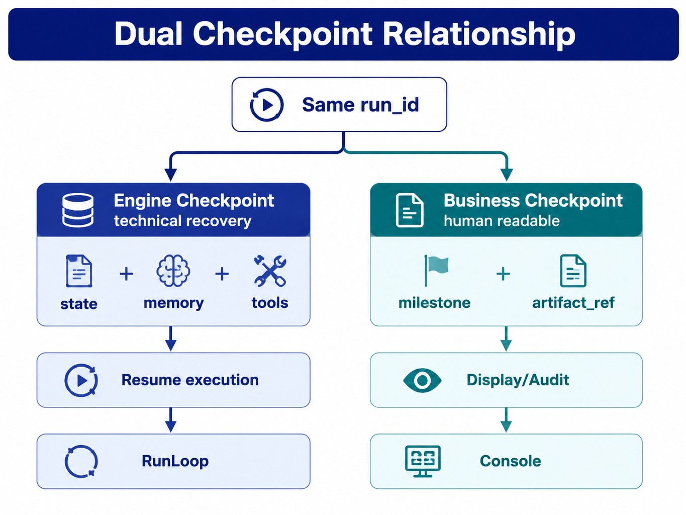

# Chapter 30 Human-in-the-loop and Long-running Tasks

---
## Chapter Summary

This chapter discusses how human intervention and long-running tasks are integrated into the Agent Runtime. The goal of enterprise agents is not to automate every action but to pause before high-risk actions, allowing the appropriate person to confirm them, and then continue execution within the same run after confirmation. Long-running tasks also cannot occupy HTTP connections indefinitely; they must support pause, resume, cancellation, and auditing via checkpoints and asynchronous queues. Centered around the `waiting_human` state, this chapter explains how approval workflows, human decision traceability, two types of checkpoints, and long task queues together ensure agent controllability.
## Key Terms

Human-in-the-loop, approval, waiting_human, long-running tasks, checkpoints, business replay
## Learning Objectives

- Explain why HITL is a governance capability for high-risk agents, rather than a patch for inadequate model performance.
- Design approval as pause-and-resume within the same run instead of creating a new task.
- Differentiate between engine checkpoints and business checkpoints, and explain how they serve recovery and presentation respectively.
- Design asynchronous execution, SLA, cancellation, and audit export for long-running tasks.

---
## Opening Scenario

Chapter 22 defines `waiting_human` as one of the six Run states. It indicates that the Runtime intentionally pauses and waits for Console or human intervention. This state is very common in production systems: a draft report has been generated but cannot yet be sent out; a discount plan has been calculated but requires manager approval due to thresholds; contract risk points have been extracted but the legal department needs to review the evidence first.

Without HITL (Human-In-The-Loop), the Agent can easily turn "seemingly reasonable" results directly into system actions. Unreviewed competitor descriptions might be sent to regional manager groups, incorrect discounts might be recorded into master data, and reports containing personal information might be externally shared. Research by Amershi et al. on interactive machine learning emphasizes that humans should be empowered collaborators with control, not passive annotators (Amershi et al. 2014; Mosqueira-Rey et al. 2023). Human intervention in enterprise Agents is the practical engineering realization of this principle.

Let's look at a concrete process. DataAgent generates a regional business analysis report containing reasons for sales decline, inventory recommendations, and communication guidelines. SQL queries and chart generation can be automated, but "whether to send this report to the regional managers" is a separate action. The former is the analytical process; the latter is an organizational commitment. HITL must intercept the latter: after the approver reviews the report body, data version, key SQL summaries, and model suggestions, they decide to publish, reject, or request revision.

Long-running tasks present another challenge. Quarterly analyses, batch SQL jobs, external A2A tasks, and multi-round report edits may take hours to complete. The system cannot let an HTTP SSE connection occupy a Worker the entire time, nor lose the task if the user closes the page. The Runtime must use asynchronous queues and checkpoints, incorporating both "waiting for machine" and "waiting for human" into the lifecycle of the same `run_id`.

---
## 30.1 HITL Design Goals

### 30.1.1 What Human Intervention Addresses

HITL (Human-In-The-Loop) is not just about asking the user a few extra questions in a chat. Clarifying questions help complete the task input, while human approval authorizes the Agent to execute actions. The former usually happens before planning, while the latter occurs at Runtime when preparing to carry out high-risk actions or release artifacts.

Enterprises adopt HITL generally for four types of objectives.

*Table 30-1: HITL Objectives and Risks Without Human Intervention. Source: Compiled by this book.*

| Objective | What HITL Is Responsible For | Risks If Missing |
|---|---|---|
| Authorization | Confirmation of amounts, discounts, releases, write operations by authorized personnel | Unauthorized automation |
| Quality | Review of reports, code, and customer service scripts at critical checkpoints | Factual errors or brand risk |
| Compliance | Traceability for privacy, advertising law, antitrust, and industry regulations | Penalties and audit failures |
| Learning | Human rejections and modifications feeding into evaluation and sample closed loops | Recurrence of similar errors |

Industries like finance, healthcare, government, and retail marketing may require human oversight (EU AI Act 2024; NIST 2023). But even without external regulation, organizations need to integrate risky actions into their authorization frameworks. The Agent is only one initiator and should not bypass existing approval chains.

### 30.1.2 `waiting_human` as a Runtime State

Approvals must be handled within the Runtime's six execution states under `waiting_human`, not just with if/else logic inside an Agent application. The reason is straightforward: only the Runtime state can know whether the current Run is paused, if it can resume, whether to continue pushing SSE (Server-Sent Events), if checkpoints are complete, and how to handle approval timeouts.

When entering `waiting_human`, the Runtime must at least do three things. First, write an engine checkpoint saving Run state, Memory, Tool results, and the pending approval information. Second, write a business checkpoint so the Console shows “Draft report generated, pending approval.” Third, push an `approval_request` event to the frontend or ticketing system to create a to-do.

If approval is just a field in business code, after a process restart the Runtime might not know where to resume; if approval triggers a re-POST to `/run`, release tools could execute twice; if approval is silently rejected and terminated, users and audit systems can’t track why the task failed.

### 30.1.3 Boundary Between Full Automation and Human Intervention

Read-only queries, internal previews, and low-risk drafts can be fully automated. Writing tickets, updating master data, sending external emails, releasing contracts, and high-value discounts should default to triggering a Policy that enters `waiting_human` or a stricter approval chain. Automated test environments can disable HITL, but this toggle should be controlled by environment and tenant policies—not by the model.

The fundamental HITL rules can be summarized in three points: Write operations are interceptable by default; approval resumes within the same `run_id`; there must be a strategy for approval timeouts. Indefinitely pending approvals are not a safety design—they just postpone the risk to no one handling it.

In architecture reviews, each high-risk tool should answer four questions: Who has the authority to approve? What evidence can they see before approving? What actions can be executed after approval? How does the task end if rejected? Inability to answer these means the tool is not ready for automation integration. The value of HITL is not to let humans catch every error but to turn organizational authorization into Runtime-executable, auditable state transitions.

---
## 30.2 Approval Modes and Event Contracts

### 30.2.1 Pre-Approval, Post-Approval, and Multi-Level Approval

The approval mode depends on at which step the risky action occurs. Pre-approval pauses before the tool executes, suitable for high-risk operations such as large transfers, database deletions, or master data changes. Post-approval pauses after a draft artifact is generated but before any publishing side effects occur, suitable for report distribution, bulk emails, or announcement publication. Multi-level approval is used for multi-role countersigning involving managers, directors, legal, etc.

*Table 30-2: Common Approval Modes. Source: Compiled by this book.*

| Mode             | Behavior                                             | Applicable Scenarios                   |
|------------------|-----------------------------------------------------|--------------------------------------|
| Pre-Approval     | Show proposed tool and parameters, execute only after approval | High-risk write operations, deletions, transfers |
| Post-Approval    | Generate draft first, only publish or send after approval | Reports, emails, announcements, marketing content |
| Multi-Level Approval | Multiple `waiting_human` nodes chained            | Contracts, procurement, external statements |
| Reviewer Agent + Human | Agent pre-screens; low risk auto-approved; high risk escalated | Large-scale content review           |

Operational reports are suitable for post-approval: The Report Agent calls `render_report` first to generate a draft and write it to Memory; the Runtime enters `waiting_human` state, and the Console displays the report preview. Only after approval, the Workflow Agent calls `publish_report`. The draft is already generated, but no publishing side effects have occurred yet.

### 30.2.2 SSE and Approval Callbacks

The Console needs to perceive approval status via SSE. `approval_request` should include the task title, artifact reference, allowed actions, and expiration time; `approval_result` should include approver ID, decision, and comments.

```text
event: state
data: {"run_id":"run-8f3a","state":"waiting_human","step_index":4}

event: approval_request
data: {"approval_id":"ap-001","run_id":"run-8f3a","title":"Q1 East China Gross Margin Report Publishing","artifact_ref":"mem://run-8f3a/report_md","requested_actions":["publish_report"]}

event: approval_result
data: {"run_id":"run-8f3a","decision":"approved","approver_id":"u-director-001","comment":"Caliber confirmed"}
```

The approval callback can be expressed as:

```http
POST /runs/{run_id}/approvals/{approval_id}
Content-Type: application/json

{
  "decision": "approved",
  "comment": "Caliber confirmed with finance",
  "approver_id": "u-director-001"
}
```

After receiving the callback, the Runtime must verify three things: the Run is currently in `waiting_human`; the `approval_id` matches the checkpoint; and the approver’s role satisfies the Policy. Upon success, trigger the `approved` transition, resuming Planner context from the engine checkpoint for continued execution. Repeated approval submissions with the same `approval_id` must be idempotent and must not trigger repeated publishing.

### 30.2.3 Policy Trigger Conditions

Policies determine which actions require human intervention. Common triggers include tool tags like `requires_approval`, parameter thresholds, data domains, tenant policies, and Reviewer Agent risk scores. For example, `discount_rate > 0.15`, documents containing `pii:true`, or tool names such as `send_email` or `publish_report` can all trigger `need_approval`.

Approval SLA also falls under policy. After expiry, it can automatically reject, notify approvers, or escalate to higher-level approvers. Regardless of the strategy, state changes must be recorded in checkpoints and approval logs—not only updated as a TODO status on the Console frontend.

Policy should avoid dumping all risks onto approvers. Low-risk, repetitive, well-evidenced actions can pass automatically; high-risk but under-evidenced actions should first require the Planner to gather more evidence, rather than directly assigning to a human. Otherwise, the approval desk becomes a new bottleneck, drowning important approvals in a flood of low-value tasks.

Therefore, HITL (Human-In-The-Loop) is not “the more, the better.” A mature system reduces meaningless approvals and improves evidence quality for high-risk cases. Approvers should not only see a “yes/no publish” button but also understand why the model recommends publishing, what data is used, which Policies were triggered, and the consequences of rejection. This way, human intervention becomes a true decision node instead of a mere formality.

---
## 30.3 Pause, Resume, and Cancel

### 30.3.1 Resume Within the Same Run

Approval of a task does not create a new Run. The runtime should resume from the checkpoint under the same `run_id` and continue executing the subsequent steps after approval. This approach preserves the causal chain between the original input, tool results, draft artifacts, approval records, and the final published outcomes.

When an approval is rejected, the state typically transitions to `failed`, with a structured reason recorded. Users can modify the input and initiate a new Run, or—if supported by product design—create a replanning with revisions. Avoid silently modifying artifacts within the original Run and continuing execution, as this obscures audit trails making it difficult to determine exactly which version was approved by whom.

### 30.3.2 Cancel and Hold

Cancel refers to actively abandoning the task. Upon cancellation triggered by the user or operations, the runtime should stop any tools that have not started, attempt to cancel in-progress tools, close any pending approvals, and mark the Run as `failed` with `reason_code=user_cancel`. Side effects already completed will not be rolled back automatically and may require compensating transactions or manual handling.

Hold refers to pausing during approval or waiting for supplementary materials. The Run can remain in `waiting_human` state, with business checkpoints recording a `revision_draft` or additional comments. Hold is not a new runtime state but rather a business sub-state within `waiting_human`.

*Table 30-3: Status semantics for approval pass, reject, cancel, and hold. Source: compiled by this book.*

| Action        | Triggered By        | Runtime Result                | Description                  |
|---------------|---------------------|------------------------------|------------------------------|
| `approved`    | Approver            | `waiting_human` → `executing` | Resume within the same Run    |
| `rejected`    | Approver            | `waiting_human` → `failed`    | Record rejection reason       |
| `cancel`      | User or Operations  | Non-terminal → `failed`       | Actively abandon task         |
| `hold`        | Approver or User    | Remain `waiting_human`         | Record business sub-state     |

### 30.3.3 Process Recovery

When a pod restarts, the runtime loads the engine checkpoint based on the `run_id`. If the state is `waiting_human`, it must idempotently synchronize the approval pending task to the Console but must not auto-approve. After the approver callback, the runtime then triggers either `approved` or `rejected`.

This workflow prevents two types of incidents: one where the system unintentionally skips approval after restart, and another where it duplicates creation of approval tasks after restart. Approval tasks must be idempotently registered by `approval_id`; publishing tools must be deduplicated by `tool_call_id` or business idempotency keys.

Recovery also needs to preserve which artifact version was approved. If the draft artifact is regenerated during approval, the original approval should no longer apply to the new artifact. A simple approach is for the `approval_request` to record an artifact hash and validate this hash again during approval callbacks. If the content has changed, the old approval is invalidated and a new approval task is issued.

---
## 30.4 Two Types of Checkpoints and Long-Running Task Queues

### 30.4.1 Engine Checkpoints and Business Checkpoints

HITL (Human-in-the-Loop) and long-running tasks require two types of checkpoints. Engine checkpoints serve Runtime recovery, while business checkpoints serve Console display and compliance replay. Both reference the same `run_id`, but their fields and readers differ.



*Figure 30-1: Relationship between Dual Checkpoints. Source: Self-drawn for this book. Alt text: The figure displays engine checkpoints and business checkpoints side by side; the former saves Runtime state, tool results, and Memory references, while the latter saves report drafts, approval milestones, and display status, aligned by the same run_id.*

*Table 30-4: Differences between Engine Checkpoints and Business Checkpoints. Source: Compiled for this book.*

| Type        | Reader                   | Saved Content                                               | Role                         |
|-------------|--------------------------|-------------------------------------------------------------|------------------------------|
| Engine Checkpoint | Runtime                  | `state`, `step_index`, `memory_refs`, `tool_calls`, `handoff_stack` | Crash recovery, continue execution |
| Business Checkpoint | Console, compliance, business users | `label`, `artifact_ref`, `created_at`, `approval_status`, `metadata` | Display progress, SLA, replay |

Confusing these two types of checkpoints can cause subtle problems. The Console may show "Report draft approved," but Runtime recovery lacks Memory and tool results and must regenerate the report; or Runtime can continue executing, but the business user cannot see which milestone the task is stuck on.

### 30.4.2 Asynchronous Queue Long-Running Tasks

Tasks lasting more than a few minutes should not block synchronous Workers. Runtime can submit asynchronous Tool Calls to a queue; Workers execute them and write back the results. The RunLoop then triggers the next step based on the results. Workers do not hold the Run state machine and only handle work corresponding to `tool_call_id`; the RunLoop manages state transitions, approvals, and checkpoints.

Within long tasks, "waiting for machines" and "waiting for humans" can coexist. Asynchronous SQL is still considered `executing`, and Tool Call status is `running`; after the report is generated, it triggers approval, and the Run enters `waiting_human`. Avoid adding new Run statuses like `waiting_external` just to wait for external tasks, as this complicates the external lifecycle.

Maintaining restraint in Run statuses is important. Waiting for external systems, queue Workers, or user approval are different reasons, but they do not necessarily require new Runtime states. Runtime only needs to express externally whether a task is still running, waiting for a person, or succeeded/failed; detailed wait reasons can reside in Tool Call statuses, business milestones, or Trace spans.

The typical timeline in operational analytics is: user initiates Run, asynchronous SQL enqueued, data ready, report draft generated, approval triggered, approval passed, and publication completed. During T4 to T48 hours, SSE connections may drop; recovery relies on checkpoints and event logs, not rerunning from T0.

### 30.4.3 Timeouts and SLAs

Long-running tasks have at least three types of time constraints: tool execution timeout, Run total timeout, and approval SLA. The queue’s visibility timeout should be shorter than Run timeout; approval SLA should be configured separately. After approval timeout, automatic rejection, reminders, or escalation should be determined by policy.

If all waits are lumped into one timeout, systems will misjudge conditions. A SQL tool running for 40 minutes may indicate a performance issue; a 40-minute approval wait may be normal; a 40-minute wait on an external A2A task depends on that party’s SLA. Runtime must distinguish these types of wait.

Asynchronous queues cannot replace checkpoints. The queue knows if a `tool_call_id` is still running but does not know which results the Planner has seen or which business milestone the Console has displayed. Long-running tasks need to maintain queue messages, engine checkpoints, and business checkpoints simultaneously; missing any of these will make recovery or replay incomplete.

---
## 30.5 Business Replay and Audit

### 30.5.1 Replay Package

Compliance and customer complaint scenarios often require proving within a limited time frame: who approved the content, based on what data, which version was published, and whether the model bypassed human supervision automatically. Chapter 38’s Trace solution addresses technical replay, while this section’s business replay package addresses organizational accountability.

The replay package can be exported via API:

```http
GET /runs/{run_id}/export?format=bundle
```

The returned content should include business milestones, approval records, tool call summaries, artifact hashes, data lineage, and Policy decisions.

```json
{
  "run_id": "run-8f3a",
  "milestones": [],
  "approvals": [],
  "tool_calls": [],
  "artifacts": [{"ref": "mem://run-8f3a/report_md", "sha256": "..."}],
  "data_lineage": [{"semantic_layer_version": "2026Q1"}],
  "policy_decisions": []
}
```

The replay package does not necessarily store the complete model inference drafts, especially when policies prohibit storing chains of thought (CoT). However, it must store tool parameters, approval comments, artifact hashes, and data versions. Otherwise, the team can only describe “roughly what the system did” but cannot prove “who approved this version of content based on what data.”

### 30.5.2 Immutability and Learning Closed Loop

Approval records and artifacts should use append-only writes and content addressing. Key reports, emails, announcements can be stored by their hashes; approval records should include `approver_id`, SSO session, timestamp, and comment. Compliance exports should be restricted to audit roles only, with access logs recorded.

Human rejections and modifications should also enter the evaluation closed loop. A single `rejected` is not just a failure; it indicates that similar future inputs should trigger HITL (Human-In-The-Loop) earlier or let the Planner generate better drafts. When human feedback enters evaluation and training, versioning, origin, and applicability scope must be preserved to avoid embedding a temporary judgment as a global rule.

The granularity of the replay package must also be controlled. Compliance officers typically care about versions, evidence, approvals, and publication outcomes, not the entire model inference process. Archiving all intermediate drafts indiscriminately increases privacy and storage pressure; archiving only the final released material cannot explain why approval occurred. A more reasonable approach is to store key artifacts, tool parameter summaries, data versions, and human comments.

---
## 30.6 mini-platform Deployment Path

### 30.6.1 Implementation Path

The `projects/multi-agent-workflow/` demonstrates that after generating the draft report, it enters the `waiting_human` state, and SSE pushes an `approval_request`; after approval is executed on another terminal, the Runtime resumes and publishes under the same `run_id`.

```text
mini-platform/
├── core/runtime/
│   ├── run_loop.py
│   └── approval.py
└── projects/multi-agent-workflow/
    └── run.py
```

Run commands:

```bash
cd mini-platform
python3 projects/multi-agent-workflow/run.py start
python3 projects/multi-agent-workflow/run.py approve
```

Automated testing:

```bash
pytest tests/test_multi_agent_workflow_run.py tests/test_runtime.py -q
```

### 30.6.2 Gap Between Demo and Production

The demo covers state transitions for `waiting_human`, SSE core events for `approval_request` and `approval_result`, manual approve/resume, and checkpoints. The production version requires HTTP approval callbacks, Console task lists, approval SLA, business milestone APIs, Export Bundle, async queues, idempotent ticket sync, and audit permissions.

*Table 30-5: Differences Between HITL Demo and Production Version. Source: Compiled for this book.*

| Capability      | Demo Coverage              | Production Requirements                                 |
|-----------------|----------------------------|--------------------------------------------------------|
| `waiting_human` | Covered                   | Integration with Policy, Console, and checkpoints      |
| Approval Events | Core SSE events covered   | Add SLA, roles, ticket status                           |
| Checkpoints     | Engine checkpoints covered | Add business milestones and audit archival             |
| Long Tasks      | Basic workflow demo       | Integrate queue, idempotent Worker, nested timeouts   |
| Audit Export    | Not covered               | Export Bundle, hashing, and access control             |

The first version acceptance can focus on three scenarios: after report draft approval, publishing within the same Run; when approval is rejected, the Run fails and logs the reason; and if the process restarts in `waiting_human`, it neither auto-approves nor creates duplicate approval tickets.

---
## Chapter Recap

1. HITL (Human-in-the-Loop) is a governance capability for high-risk agents, not a temporary patch for insufficient model performance.
2. Approvals should enter the Runtime `waiting_human` state and resume on the same `run_id`.
3. Pre-approval, post-approval, and hierarchical approval correspond to different risk levels; report scenarios typically generate a draft first, then approve the publishing action.
4. Engine checkpoints are responsible for resuming execution, while business checkpoints handle progress display and compliance playback; these two must not be mixed.
5. Long-running tasks should be handled via asynchronous queues, checkpoints, and event logs—not by occupying synchronous connections for extended periods.
6. Business playback packages must answer “Who approved, based on what data, what version was published, and whether the model bypassed human supervision.”
## Further Reading

- [Chapter 22 Agent Runtime](ch22-agent-runtime.md)
- [Chapter 28 Multi-Agent Collaboration](ch28-agent.md)
- [Chapter 38 Agent Trace and Session Replay](../../part07-observability-eval/ch/ch38-trace.md)
- [Chapter 47 Console and Approval Desk](../../part09-frontend-multimodal/ch/ch47-ui.md)
- [Chapter 50 Policy and Permissions](../../part10-security-org/ch/ch50.md)
- `mini-platform/projects/multi-agent-workflow/README.md`
## References

Amershi, S., et al. (2014). Power to the people: The role of humans in interactive machine learning. *AI Magazine*, 35(4), 105-120. [https://doi.org/10.1609/aimag.v35i4.2513](https://doi.org/10.1609/aimag.v35i4.2513)

Mosqueira-Rey, E., et al. (2023). Human-in-the-loop machine learning: A state of the art. *Artificial Intelligence Review*, 56, 3005-3054. [https://doi.org/10.1007/s10462-022-10397-w](https://doi.org/10.1007/s10462-022-10397-w)

EU AI Act. (2024). *Regulation (EU) 2024/1689*. [https://eur-lex.europa.eu/legal-content/EN/TXT/?uri=CELEX:32024R1689](https://eur-lex.europa.eu/legal-content/EN/TXT/?uri=CELEX:32024R1689)

NIST. (2023). *Artificial Intelligence Risk Management Framework (AI RMF 1.0)*. [https://www.nist.gov/itl/ai-risk-management-framework](https://www.nist.gov/itl/ai-risk-management-framework)

Shneiderman, B. (2022). *Human-centered AI*. Oxford University Press.

LangChain. (n.d.). *Human-in-the-loop*. LangGraph. [https://docs.langchain.com/oss/python/langgraph/interrupts](https://docs.langchain.com/oss/python/langgraph/interrupts)

Temporal. (n.d.). *Workflow persistence*. [https://docs.temporal.io/workflows](https://docs.temporal.io/workflows)
