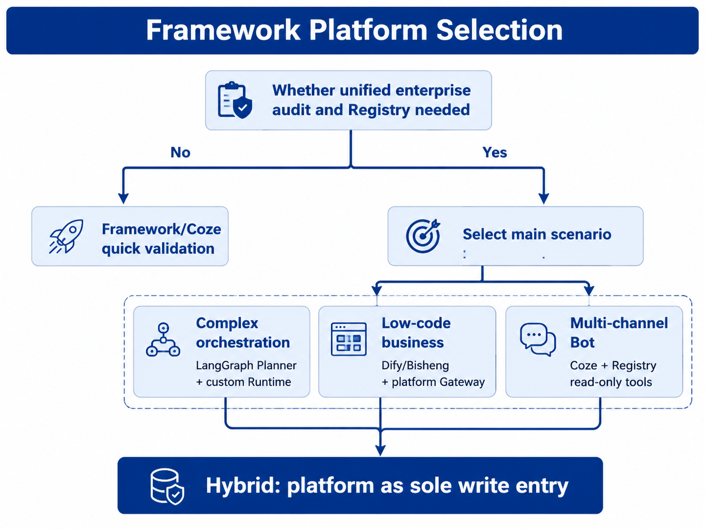

# Chapter 31 Framework Cross-Comparison

---
## Chapter Summary

This chapter discusses how to evaluate agent frameworks and application platforms such as LangGraph, AutoGen, CrewAI, Dify, Coze, and Bisheng. Frameworks address how to quickly organize Planners, tools, and multi-agent logic; enterprise platforms handle unified `/run` management, tool governance, multi-tenancy, approval workflows, auditing, and rollback. These two operate at different layers and cannot simply replace each other. This chapter reorganizes selection considerations into three layers—framework, platform, and application—clarifying which capabilities can be procured or embedded, and which must be incorporated into the enterprise runtime and registry.
## Key Terms

Framework benchmarking, LangGraph, AutoGen, CrewAI, Dify, Coze, hybrid architecture
## Learning Objectives

- Be able to distinguish the boundaries between Agent frameworks, enterprise Agent platforms, and business Agent applications.
- Be able to explain why LangGraph, Dify, or Coze cannot directly replace an enterprise Runtime.
- Be able to choose between self-development, procurement, or a hybrid approach based on team capabilities, governance requirements, and time-to-market.
- Be able to integrate external frameworks and low-code platforms into a unified Registry, Policy, Trace, and HITL system.

---
## Opening Scenario

Part V has built Runtime, Tool Registry, MCP adaptation, multi-Agent handoff, and HITL from the bottom up using `mini-platform`. Meanwhile, business teams may already be using Dify for knowledge base Q&A, marketing may have launched event Bots on Coze, and data teams might be experimenting with SQL analysis in notebooks using LangGraph.

At this point, the technical committee often asks three questions: Since Dify already exists, is it still necessary to build our own Runtime? Can LangGraph replace Run Liutai? Can Coze Bots directly connect to enterprise databases? From a feature checklist perspective, these products all support “running Agents”; however, from a production governance standpoint, they operate at different layers.

The conclusion in this chapter is straightforward: frameworks and application platforms can accelerate experimentation and delivery speed, but production write operations, tool versioning, approvals, auditing, and multi-tenant boundaries must be handled by the enterprise platform. Frameworks that can be incorporated into the platform become accelerators; those that cannot become new production silos.

This judgment is not meant to dismiss out-of-the-box tools. On the contrary, if an enterprise builds every component—Planner, Console, Bot channels, and knowledge bases—from scratch, it will easily slow down business pilots. The real problem to avoid is layer misalignment: relying on low-code platforms for group-level auditing, using notebook tools to define production permissions, or connecting core databases directly via Bot plugins. These approaches may seem convenient in the POC phase but lead to concentrated risk when moving to production.

---
## 31.1 Distinguish the Three Layers First

### 31.1.1 Framework, Platform, and Application

A framework is a development library into which business code is embedded, such as LangGraph’s graph, AutoGen’s multi-Agent conversations, and CrewAI’s roles and tasks. A platform is the enterprise’s unified runtime and governance layer, such as `/run`, the Run Six States, Tool Registry, Policy, HITL, Trace, and Console. An application is an Agent oriented to specific roles or business processes, such as DataAgent, customer service assistants, and business analysis Workflow Agents.

*Table 31-1: Responsibilities of the Framework, Platform, and Application layers. Source: compiled in this book.*

| Layer      | What Problem It Solves                          | Typical Products                          | Primary Maintainers      |
|------------|------------------------------------------------|------------------------------------------|-------------------------|
| Framework  | How to organize Planners, tools, roles, and multi-Agent flows | LangGraph graph, CrewAI crew, AutoGen chat | Application or data teams |
| Platform   | How to unify runtime, governance, auditing, and recovery         | `/run`, Registry, Policy, Trace, Console   | Platform teams           |
| Application| How to serve specific roles and processes                      | DataAgent, customer service Agents, report Agents | Business lines and platform teams |

These three layers can coexist, but their responsibilities must not be mixed. A framework can serve as the implementation of a Planner; low-code platforms may act as business entry points or operation consoles. However, all actions that modify business state must pass through the enterprise Runtime and Registry.

### 31.1.2 Three Strict Boundaries

First, all production write operations must go through platform Policy and Registry. Regardless of whether the Planner is LangGraph, CrewAI, or custom-built, actions like sending emails, writing tickets, executing SQL, and modifying master data cannot be scattered inside the framework itself.

Second, framework state is not equivalent to the Run Six States. LangGraph nodes, Dify Workflow instances, and Coze Bot conversations can all map to a `run_id`, but external SLAs, approvals, checkpoints, and auditing should be based on the Run.

Third, if a low-code application platform serves as a production entry point, it must integrate with the enterprise Gateway, Registry, and Trace. Otherwise, the enterprise will maintain multiple sets of permissions, logs, tool connections, and rollback methods simultaneously.

### 31.1.3 Boundary Risks in Low-Code Platforms

Purchasing Dify does not mean you have the Runtime described in Chapter 22. Dify has its own runtime and Workflow, but whether it meets enterprise multi-tenancy, IAM, approval, auditing, and tool version requirements must be verified item by item.

LangGraph also does not allow teams to skip the Tool Registry. In development environments, tools may be defined directly in notebooks with `tools=[]`, but in production environments, tools must be registered as versioned assets with unified authentication, auditing, and gradual rollout.

Allowing each business line to choose its own framework freely does not equal technical diversity. Frameworks can be varied, but platform interfaces must be unified. Otherwise, the more business there is, the higher the governance cost.

When reviewing a framework, first ignore marketing claims and instead ask three questions: Can it be included in the enterprise `/run`? Can its tool calls be forced through the Registry? Can its state and logs enter Trace and Export Bundle? Only after answering these can you reasonably discuss development experience and ecosystem plugins.
## 31.2 How to Use Open Source Frameworks

### 31.2.1 LangGraph

At the core of LangGraph are directed graphs, state objects, and checkpointers. It is well-suited for expressing complex branching, loops, reflection, and manual interruption. The Planner in DataAgent can use LangGraph to define subgraphs for “table selection, SQL generation, execution, reflection, and correction”; the internal state of these subgraphs is rich, but externally they should still be folded into Runtime states like `planning`, `executing`, `waiting_human`, `succeeded`, or `failed`.

The recommended approach is to place LangGraph at the Planner layer, rather than making it an independent production entry point. The `thread_id` can map to the `run_id`, graph node tool calls should route to the enterprise Registry, and `interrupt()` can map to `waiting_human`. This way, teams can leverage LangGraph’s expressive power while preserving the tool governance and audit boundaries of the enterprise platform.

This embedded usage also reduces replacement costs. The Planner graph can be iteratively adjusted as tasks evolve, while the outer Runtime events, error codes, approvals, and checkpoints remain unchanged. Business teams still see the same Agent application, and the platform team sees the same execution chain—framework changes won’t directly impact audit and SLO.

```python
# Concept example: LangGraph as a Planner plugin, not an independent Run
def next_step(ctx: PlannerContext) -> PlannerOutput:
    graph = build_sql_graph(registry=ctx.registry)
    thread_id = ctx.run_id
    for event in graph.stream(ctx.input, config={"thread_id": thread_id}):
        emit_to_runtime_sse(event)  # Fold into state / action / result
    return graph.get_final_output()
```

### 31.2.2 AutoGen

AutoGen excels at multi-Agent conversations, code execution, and research exploration. It is suitable for quickly validating how multiple roles collaborate during the Lab phase and for prototyping GroupChat or Swarm-style task decomposition. However, in production, free-form group chats bring token cost, tool boundary, and auditing challenges.

The production recommendation is to converge AutoGen experiments into explicit Handoff contracts. Agents do not chat indefinitely but pass tasks, input schemas, and return results through the Handoff Tool introduced in Chapter 28. This preserves the multi-Agent experimental insights while avoiding bringing free dialogue directly into production Runtime.

For example, during experiments, "Analyst Agent" and "Report Agent" can freely discuss in AutoGen to see how they break down problems. In production, this discussion becomes two explicit steps: DataAgent returns structured metrics and evidence, and Report Agent drafts the report based on these inputs. Whether human review is needed is decided by Runtime and Policy.

### 31.2.3 CrewAI

CrewAI’s Role / Task / Crew abstractions are well-suited for expressing job responsibilities and closely resemble the multi-Agent narrative of Chapter 28. Business teams find it easy to describe role chains such as “data analyst, report writer, reviewer” using CrewAI.

It is better used as a role configuration or Planner organization method rather than as a replacement for the enterprise Runtime. Crew role definitions, goals, and tool whitelists can be exported as platform AgentSpecs; execution is still managed by RunLoop for state, Registry for tools, and Policy for approvals.

This usage lets business users describe workflows using role language while engineers avoid introducing a second runtime. Role configurations become business assets, and RunLoop remains the platform asset. Separating the two means role changes won’t break state machines or tool audits.

---
## 31.3 How to Use Application Platforms

### 31.3.1 Dify

Dify is suitable for quickly building workflows, RAG (Retrieval-Augmented Generation), knowledge Q&A, and internal applications. Its advantages lie in visual orchestration, self-hosting, and a rich plugin ecosystem. Enterprises can use Dify as an early-stage experimental environment or for certain business entry points: business teams initially build workflows on Dify, and once matured, migrate core capabilities to the platform’s `agent_id`, or allow Dify nodes to call the enterprise `POST /agents/{id}/run` API.

The key is to prevent Dify nodes from bypassing enterprise data and tool governance. For example, if the marketing department’s workflow requires real inventory data, it should call a read-only API exposed by the Registry, rather than connecting directly to the database through a Dify plugin. Publish-type actions should flow through the `waiting_human` mechanism described in Chapter 30, rather than relying solely on a manual UI node.

### 31.3.2 Coze

Coze is optimized for rapid release of marketing, customer service, and light-weight bots, especially for multichannel outreach. Its risks revolve around data residency, plugin permissions, and internal system integration. Coze plugins can act as HTTP facades for the enterprise Registry, carrying `tenant_id`, `user_id`, and scope information for the platform to authorize calls.

For edge bots, it is recommended to only expose read-only or low-risk tools. Sensitive write operations, master data modifications, batch outbound messaging, and queries containing personal data should be routed back to the enterprise Runtime and HITL (Human-in-the-Loop).

This does not diminish the value of Coze. It is well suited as an entry point for outreach and interaction, such as event inquiries, store Q&A, and lightweight customer service. As long as plugin boundaries are clearly defined, Coze can help businesses quickly validate user entry points without taking on the role of the enterprise’s core runtime environment.

The success criteria for edge bots should align with the platform: user identity can be transmitted back to the platform, tool calls can be traced through the Registry, important actions enter approval workflows, and logs can be merged with enterprise tracing. Without these, Coze bots can only serve as low-risk pilots. Only when they integrate into the platform chain is there a chance to move from pilot to long-term operation.

### 31.3.3 Bisheng

Bisheng is more enterprise and government-focused, commonly deployed for knowledge bases, process orchestration, and combinations of domestic AI models. It can serve as a knowledge control center, process UI, or base for localized deployments, but it is still necessary to evaluate whether it can align with enterprise `run_id`, Trace, Policy, and Export Bundle requirements.

In government and enterprise scenarios, a feasible approach is: Bisheng manages the knowledge base and part of the process approval UI, while execution nodes call the enterprise Workflow Agent Run via HTTP; Bisheng instance IDs map to `run_id` and write to Observability for unified search and replay capabilities.

---
## 31.4 Capability Matrix and Platform Selection

A capability matrix should not become a product scoring sheet. Its purpose is to help the team clearly see which capabilities are the strengths of the framework and which belong to the platform foundation.

*Table 31-2: Capability comparison between the mini-platform and mainstream frameworks/platforms. Source: Compiled by this book.*

| Capability | mini-platform | LangGraph | AutoGen | CrewAI | Dify | Coze | Bisheng |
|---|---|---|---|---|---|---|---|
| Run Six States + SSE | Strong | Wrappable | Weak | Weak | Integrable | Weak | Integrable |
| Tool Registry + Versioning | Strong | Needs adaptation | Needs adaptation | Needs adaptation | Integrable | Integrable | Integrable |
| MCP / A2A Adaptation | Strong | Partial | Partial | Weak | Partial | Partial | Partial |
| Multi-Agent Handoff | Strong | Expressible | Expressible | Strong | Expressible | Expressible | Expressible |
| HITL `waiting_human` | Strong | Mappable | Mappable | Extensible | Integrable | Weak | Integrable |
| Engine/Business Dual Checkpoints | Strong | Partial | Weak | Weak | Weak | Weak | Partial |
| Policy / Tenant Isolation | Strong | Weak | Weak | Weak | Integrable | Integrable | Integrable |
| Trace / Compliance Replay | Strong | Needs integration | Needs integration | Weak | Integrable | Weak | Integrable |
| Low-Code Console | Weak | Weak | Weak | Weak | Strong | Strong | Strong |
| Fast Bot Launch | Weak | Weak | Partial | Partial | Strong | Strong | Partial |

The conclusion from this matrix is: frameworks excel at planning and prototyping; low-code platforms are strong in entry points and operations; enterprise platforms lead in governance and runtime contracts. No single type of tool naturally covers all capabilities.



*Figure 31-1: Framework/Platform selection decision tree. Source: Created by this book. Alt text: The decision tree branches from questions about team engineering capabilities, governance and multi-tenant requirements, deployment time pressure, leading to three routes: self-developed, purchased, or hybrid.*

Figure 31-1 can be read as follows: if the task is read-only, low-risk, and under tight deployment pressure, start with Dify or Coze; if the task requires building an enterprise system involving approval and audit, a unified runtime is necessary; if the team already has a LangGraph POC, it can be absorbed as the planner rather than creating a new production runtime.

Team capabilities must also factor into the decision. A strong platform team can develop the core in-house and integrate multiple frameworks; a strong business operations but weak engineering team can start with a low-code platform for read-only scenarios; a strong data science team can start with LangGraph for a planner POC, then have the platform team integrate the tooling and runtime contracts. Selection is not product ranking but an engineering combination constrained by organizational conditions.

---
## 31.5 In-House Development, Procurement, and Hybrid Approaches

### 31.5.1 When In-House Development Is Suitable

In-house development is suitable for core platform components such as unified `/run`, the Run six states, Tool Registry, MCP/A2A adaptation, Policy, HITL, Trace, Export Bundle, and deep integrations with ERP and the semantic layer. These capabilities directly impact compliance, SLA, auditing, and cost, and are generally not appropriate for each business team or every low-code platform to develop independently.

The cost of in-house development is clear: it requires a platform team, SRE, test systems, and continuous maintenance. This approach is not chosen simply because it “looks more controllable,” but because the production boundary cannot be managed by any single business application.

### 31.5.2 When Procurement Is Suitable

Procurement or managed services are suitable for rapid entry and standard use cases: marketing bots, campaign landing pages, standard RAG knowledge Q&A, non-core read-only assistants, operations consoles, and some workflow UIs. These scenarios emphasize launch speed and business configuration capabilities. Using Dify, Coze, or Bisheng can reduce reinventing the wheel.

When procuring, clarify data residency, IAM, log export, tool permissions, approval integration, model routing, and SLA. Rich product features do not guarantee readiness for production core workflows.

Procurement failures mostly happen not because the product is unusable, but because the enterprise misplaces it. Treating a low-code platform as an experimental entry point is manageable risk; making it the enterprise’s sole runtime without unified tool permissions and audit export risks turning every interface into an exception later. Procurement contracts must clearly specify data ownership, log exports, plugin approvals, SLA, and exit mechanisms; otherwise, a successful pilot will make migration back to a unified platform even harder.

### 31.5.3 Hybrid Is the More Common Approach

Most enterprises will eventually adopt a hybrid approach: building or deeply customizing the platform core in-house; embedding LangGraph or CrewAI within the Planner; either building the Console in-house or procuring/integrating a low-code UI; using Coze for edge bots while writing back operations to the platform; and running experiments with AutoGen before migrating mature cases to `agent_id`.

The key to a hybrid route is the master-slave relationship. The low-code platform may serve as a traffic entry point but must not own a separate set of production tool permissions. The framework can manage the Planner graph but must not hold an un-auditable tool execution chain. All actions that change business state must ultimately reside in the enterprise Runtime and Registry.

A typical hybrid topology is: Coze Bot or Dify Workflow receives user requests, calls the enterprise Runtime via API Gateway; the Runtime calls the Planner, which can use LangGraph; tool invocations go through the Registry; approvals enter `waiting_human`; and ultimately Trace and Export Bundle data flow back to the enterprise monitoring and compliance systems. This structure allows each layer to leverage its strengths without scattering ownership boundaries.

The rollout order for a hybrid architecture is also critical: unify tool entry points first, then unify runtime events, and finally unify Console and operational experience. Tool entry is closest to risk and must be consolidated first; runtime events determine traceability and recovery and come second; Console experience can be integrated gradually and should not delay tool governance for the sake of UI unification.

---
## 31.6 Migration and Procurement Checks

### 31.6.1 Three-Step Integration

Existing frameworks or low-code platforms do not need to be rebuilt from scratch. Integration can be done in three steps.

First, change internal tool calls within the framework to call the Registry HTTP API instead. Unify tool definitions, versions, permissions, and audit logging. Second, fold the framework's or low-code platform’s runtime events into the six Run states and the `state` / `action` / `result` event model. Third, migrate write operations, HITL (Human-In-The-Loop), Export Bundle, and high-risk approval processes back into the enterprise Runtime.

This order prioritizes resolving the most dangerous risk first: tools bypassing governance. Runtime and Console can be unified gradually, but tools and permissions should not be left until last.

### 31.6.2 Questions to Ask During Procurement

When procuring Dify, Coze, Bisheng, or evaluating internal platforms, you can directly focus on the capabilities outlined in Part V:

- Does it support stable `run_id` and export Run-level logs?
- Can tool calls be forced to go through the enterprise Central Registry?
- Are MCP Server or plugin tools version-registered?
- Is human approval engine-level suspension or a fake button on the UI?
- Can checkpoints restore the full context of the Planner?
- Can Traces export compliance replay packages?
- When writing ERP via low-code Workflow, does it enforce passing through Policy?

These questions are more critical than “how many nodes are supported” or “is there a built-in knowledge base.” Nodes and knowledge bases determine build speed; run-time contracts determine production readiness.

The same questions apply to internally developed platforms. Being self-developed does not automatically mean governable. Without stable `run_id`s, tool versioning, approval checkpoints, or export packages, it is no different from an uncontrolled framework. Procurement and evaluation should compare vendor products and internal platforms against the same capability checklist rather than assuming internal equals compliant by default.

### 31.6.3 Relationship with Part V Practical Implementation

`projects/multi-agent-workflow/` already covers the main workflow from Chapters 22 to 30: within the same `run_id`, from RunLoop, Registry, Planner, Handoff to `waiting_human` and approve/resume. When evaluating frameworks, this project can be used as a baseline: can the external framework integrate with the same Run, Registry, approvals, and checkpoints?

LangGraph can replace the Planner implementation; CrewAI can contribute role configuration; Dify can call the enterprise `/run` API; Coze can serve as the edge Bot entry point. Yet `core/runtime` and `core/registry` remain the platform’s core and cannot be directly replaced by these frameworks.

If an external framework cannot integrate with this baseline workflow, it must at least clarify who will fill in the gaps—whether the platform adapter layer will map events, the vendor will provide log exports, or the business will abandon production rollout for that scenario. Gaps do not necessarily mean unusable, but must be documented clearly before pilots.

This is the core standard of this chapter: not “which framework is best,” but “what layer of responsibility does it assume in the enterprise Agent platform?” When responsibility boundaries are clear, more frameworks can accelerate development; when unclear, more frameworks increase governance difficulties.

In the initial rollout, you can first choose one read-only scenario and one write-operation scenario for comparison. The read-only scenario verifies framework integration speed. The write-operation scenario validates whether Registry, Policy, HITL, and Trace can converge properly. Both scenarios running smoothly is what makes a hybrid architecture viable.

This approach is more reliable than merely comparing product features. It’s also more stable.

---
## Chapter Recap

1. The three-tier separation of framework, platform, and application: the framework handles expressing the Planner, the platform handles production operation and governance.
2. LangGraph is suitable as a Planner, AutoGen fits well as a Lab, and CrewAI is suited for role configuration; production tool calls should all use the Registry.
3. Dify, Coze, and Bisheng excel in low-code entry, Bot channels, and knowledge management, but their governance capabilities usually need to be integrated with enterprise platforms.
4. When selecting, priority should be given to `/run`, Registry, Policy, HITL, Trace, and checkpoints rather than only comparing canvases and nodes.
5. The baseline for hybrid architecture is that all actions that change business state ultimately enter the enterprise Runtime and Registry.
## Further Reading

- [Chapter 22 Agent Runtime](ch22-agent-runtime.md)
- [Chapter 25 Planner and Orchestration Patterns](ch25-planner.md)
- [Chapter 28 Multi-Agent Collaboration](ch28-agent.md)
- [Chapter 30 Human-in-the-Loop and Long Tasks](ch30-human-in-the-loop.md)
- [Chapter 45 vLLM + LiteLLM Model Routing Gateway](../../part08-deployment/ch/ch45-llm.md)
- `mini-platform/projects/multi-agent-workflow/README.md`
## References

NIST. (2023). *AI RMF 1.0*. [https://www.nist.gov/itl/ai-risk-management-framework](https://www.nist.gov/itl/ai-risk-management-framework)

LangChain. (n.d.). *LangGraph*. [https://docs.langchain.com/oss/python/langgraph/overview](https://docs.langchain.com/oss/python/langgraph/overview)

LangChain. (n.d.). *Persistence*. LangGraph. [https://docs.langchain.com/oss/python/langgraph/persistence](https://docs.langchain.com/oss/python/langgraph/persistence)

Microsoft. (n.d.). *AutoGen*. [https://microsoft.github.io/autogen/](https://microsoft.github.io/autogen/)

Wu, Q., et al. (2024). AutoGen. [https://arxiv.org/abs/2308.08155](https://arxiv.org/abs/2308.08155)

CrewAI. (n.d.). *Documentation*. [https://docs.crewai.com/](https://docs.crewai.com/)

Dify. (n.d.). *Documentation*. [https://docs.dify.ai/](https://docs.dify.ai/)

Coze. (n.d.). *Coze Open Platform Documentation*. [https://www.coze.cn/docs](https://www.coze.cn/docs)

Bisheng. (n.d.). *DataElem Bisheng*. [https://github.com/dataelement/bisheng](https://github.com/dataelement/bisheng)

Model Context Protocol. (2024). *Specification*. [https://modelcontextprotocol.io/specification/2024-11-05](https://modelcontextprotocol.io/specification/2024-11-05)
