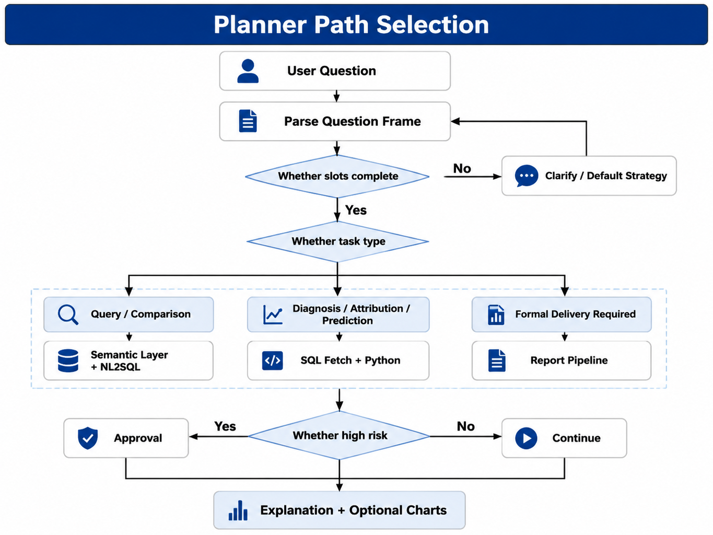
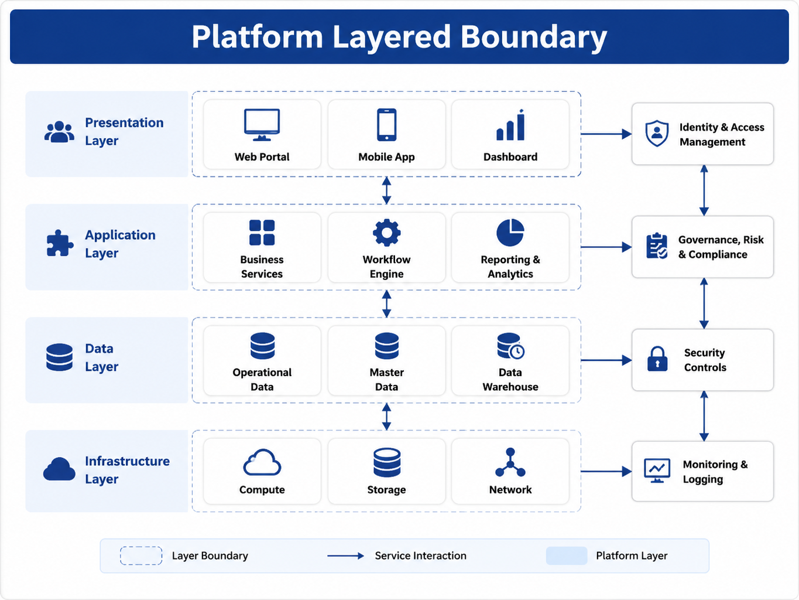

# Chapter 32 DataAgent Product Forms

---
## Chapter Summary

This chapter defines the product form of DataAgent. DataAgent is not simply a point solution that translates natural language into SQL. Instead, it is a task-oriented Agent centered around data questions: it must understand user queries, apply standardized metric definitions, choose between SQL, Python, or reporting workflows, execute the tasks with traceable evidence, and maintain context through multi-turn interactions. While products limited to NL2SQL can complete demos, they struggle to support enterprise-level data inquiries. This chapter begins by outlining the boundaries between DataAgent and NL2SQL, ChatBI, and BI Copilot, then explains four forms—data querying, analysis, reporting, and task workbench—as well as how a single operational analysis run ties together the subsequent chapters in Part VI.
## Key Terms

DataAgent, NL2SQL, ChatBI, BI Copilot, Question Frame, Data Query Closed Loop, Evidence Citation
## Learning Objectives

- Be able to explain why DataAgent cannot be equated with NL2SQL.
- Be able to differentiate ChatBI, BI Copilot, and platform-based DataAgent.
- Be able to describe the evolutionary relationship among four product forms: query, analysis, reporting, and task workbench.
- Be able to explain how Question Frame, semantic layer, SQL execution, Python analysis, and report generation compose a complete data task.

---
## Opening Scenario

Part V established the operational foundation of the Agent platform: the Runtime handles the six states of running and checkpointing, the Registry manages tool registration and call auditing, the Planner determines the next tool to use, the Memory stores multi-turn context, and HITL (Human-In-The-Loop) pauses high-risk tasks awaiting human confirmation. Entering Part VI, the question becomes: how do these capabilities combine to form a data product tailored for business users?

This book calls such products DataAgents. They run on top of the Agent platform, serving business scenarios in operations, finance, supply chain, marketing, and more, helping users initiate data queries, analyses, and reporting tasks via natural language. They are not Gateways, not semantic layers, nor just SQL plugins. They are business Agents that link natural language questions, semantic layers, SQL execution, Python analysis, charts, reports, and audit workflows into one chain.

We can start from a common question: “Sales in East China dropped sharply last week compared to the previous week. What are the main SKUs? Is there a connection with category structure?” If only NL2SQL is done, the system might generate a SQL query to find the top SKUs. But a true DataAgent must first determine whether “sales” refers to operational GMV or financial GMV, confirm which organizational level “East China” corresponds to, decide whether to first query SKUs then use Python to analyze category contribution, and explain data timestamp, metric versions, and evidence sources in the answer. When the user then asks “What about North China?”, the system should reuse the previous time frame, metrics, and comparison method, only changing the region.

This is also where DataAgents differ from ordinary chatbots. A DataAgent’s output is not a “plausible-sounding explanation,” but a replayable data task chain. Every key conclusion should trace back to SQL results, semantic layer metrics, Python artifacts, or report evidence. Chapters 33 through 36 will develop this chain step-by-step: semantic layers, NL2SQL, text-to-Python, visualization, and reporting.

---
## 32.1 Why DataAgent Is More than Just NL2SQL

NL2SQL is one of the core capabilities of DataAgent. Without the ability to convert natural language questions into executable queries, DataAgent would struggle to enable self-service analytics. However, NL2SQL alone is not enough. The most common failures in enterprise analytics are not SQL syntax errors, but mistakes in business definitions, permission boundaries, loss of context, or conclusions unsupported by evidence.

Public Text-to-SQL benchmarks typically provide the question and database schema and evaluate the correctness of the generated SQL. Benchmarks like Spider, BIRD, and Spider 2.0 have driven improvements in NL2SQL capabilities, but enterprise scenarios add layers such as semantic modeling, access control, versioned business logic, multi-turn clarifications, and evidence presentation. A model that performs well on benchmarks mainly shows it can write SQL well, but that does not prove it can reliably answer business questions within an enterprise data ecosystem.

*Table 32-1: Differences Between Pure NL2SQL and Production-Grade DataAgent. Source: Compiled by the author.*

| Stage           | Pure NL2SQL               | Production-Grade DataAgent                        |
|-----------------|---------------------------|-------------------------------------------------|
| Question Understanding | Model guesses fields and metrics directly | First construct a Question Frame                 |
| Business Logic Binding   | Depends on prompt instructions     | Bind to semantic layer metrics and their versions |
| Execution       | Generate SQL and run directly    | Through Registry, Policy, and read-only executor |
| Multi-turn Follow-up | Re-interpret question at each turn | Working Memory reuses confirmed context           |
| Complex Analysis  | Try to fit everything into one SQL | SQL fetches data, then analyze in a Python sandbox |
| Delivery        | Return numbers or tables        | Generate charts and reports with EvidenceRef      |

DataAgent can be viewed as three layers of capabilities stacked together. The first layer is the query loop: understanding the question, generating queries, executing them, and interpreting the results. The second layer is the analysis loop: performing statistics, decomposition, comparison and attribution on query results. The third layer is the delivery loop: organizing results into charts, reports, approval records, and replayable artifacts. NL2SQL covers only a portion of the first layer.

DataAgent also cannot bypass the data platform. Metric definitions, data freshness, lineage, permissions, and anonymization still come from the data platform and semantic layer; the Agent platform handles runtime, tool invocation, auditing, and recovery; DataAgent applications handle question understanding, task classification, report templates, and domain policies. When these three are clearly separated, the system can function as both a product and a scalable production solution.

This boundary also determines how failures are handled. If NL2SQL writes a faulty SQL, the planner can fix or regenerate it; if the semantic layer cannot find a metric, the system clarifies or refuses the answer; if permissions prohibit detail access, it returns aggregates or permission warnings; if data freshness is insufficient, the system annotates the answer or pauses report generation. These are product flow issues, not problems solvable by “model thinking harder.”

Therefore, the initial version of DataAgent should not try to “answer everything.” A more reasonable goal is to reliably manage metrics and business logic, query execution, evidence presentation, and multi-turn Q&A within a clear domain. Users would rather see “this metric requires business confirmation” than an unsupported but fluent number.
## 32.2 ChatBI, BI Copilot, and DataAgent

In the industry, the term "conversational data querying" is often called ChatBI, but the engineering boundaries of different product forms vary greatly. ChatBI typically focuses on natural language querying, with an emphasis on converting user questions into reports or query results. BI Copilot is embedded within existing BI products to help users modify filters, adjust charts, and explain the current dashboard. DataAgent runs on a general-purpose Agent platform and can complete data tasks across data sources, tools, and approval workflows.

*Table 32-2: Boundaries of three product forms. Source: compiled by the author.*

| Form          | Typical Interaction           | Data Scope          | Platform Relation           | Suitable Scenarios                      |
|---------------|------------------------------|---------------------|----------------------------|----------------------------------------|
| ChatBI        | Query data via chat window   | Single database or subject | Often a standalone tool    | Lightweight self-service querying      |
| BI Copilot    | Modify visuals, explain reports within BI | Current report or dataset | Attached to BI product      | Efficiency enhancement for existing BI users |
| DataAgent     | Data task-oriented Agent      | Semantic layer, multi-source, permission context | Shares Runtime, Registry, Trace | Querying, analysis, reporting, and approvals |

The advantage of BI Copilot is its closeness to existing reports. Users do not need to leave the dashboard to ask questions such as "Why did this chart drop?" or "Change to category display." Its boundary is also clear: the context is usually restricted to the current report or dataset. Cross-theme standard governance, long-running task orchestration, and multi-Agent approval are not its primary responsibilities.

DataAgent functions more like an entry point for data tasks. It can start from natural language, invoke the semantic layer and SQL tools, use a Python sandbox if needed, and ultimately generate a report for approval. It does not replace BI or data modeling. A more reasonable relationship is that formal metric dashboards remain within BI, while DataAgent handles exploratory querying, temporary analyses, and report drafts; once analysis results stabilize, they are condensed back into BI datasets or reports.

This boundary is important for product roadmaps. If a company only has a single-subject data set, starting with ChatBI or BI Copilot may be faster. If the goal is cross-business domain operational analysis with auditing, approvals, and multi-step tasks, DataAgent is a more suitable form.

When evaluating products—whether for procurement or in-house development—three questions can quickly judge the true product boundaries. First, can the metrics in responses be traced back to semantic layer versions? Second, can the execution process be replayed down to SQL, parameters, and permission contexts? Third, does multi-turn querying reuse structured frames rather than just feeding chat history back into the model? Systems unable to answer these questions resemble conversational BI plugins rather than a platform-level DataAgent.

---
## 32.3 Four Product Forms

This book divides DataAgent product forms into four tiers: Questioning, Analysis, Reporting, and Task Workbench. They are not four mutually exclusive SKUs but a maturity progression. Most enterprises should first make the Questioning form reliable, then add Analysis and Reporting, and finally solidify high-frequency workflows into a Task Workbench.

*Table 32-3: Four DataAgent Product Forms. Source: compiled by this book.*

| Form           | User Demand                        | Typical Output              | Core Dependencies                          |
|----------------|----------------------------------|-----------------------------|--------------------------------------------|
| Questioning    | “What was East China’s GMV last week?” | Tables, numbers, brief explanations | Semantic layer, NL2SQL, read-only SQL      |
| Analysis       | “Which categories mainly caused the decline?” | Decomposition, contribution, statistical summaries | SQL data retrieval, Python sandbox           |
| Reporting      | “A review report for the business meeting” | Charts, insights, draft reports | EvidenceRef, chart rendering, templates     |
| Task Workbench | “Automatically generate and submit monthly” | Replayable run chains, approval records | Runtime, HITL, multi-Agent handoff           |

The Questioning form is the easiest foundation to verify. It requires the semantic layer to bind business terms to metrics, NL2SQL to generate correct queries, the executor to safely return results, and the answer to explain definitions and data time frames. Without this step, jumping directly to reports tends to package erroneous numbers more attractively.

The Analysis form introduces Python or dedicated analysis services. Many problems cannot be solved by a single SQL query, such as structural contribution, anomaly detection, simple forecasting, and price-sales decomposition. DataAgent should first retrieve controlled data via SQL, then pass intermediate results into sandbox analysis—not have the model compute inside the prompt.

The Reporting form requires evidence references. Every number, trend, and conclusion in reports should link back to query results, chart data, or analysis artifacts. Otherwise, the smoother the narrative language, the greater the risk. Chapter 36 will focus on organizing EvidenceRef, charts, and storytelling.

The Task Workbench is the mature form. It turns DataAgent from a one-off Q&A into an operational workflow, such as weekly business briefs, monthly reviews, anomaly attribution, and approval submission. At this stage, run checkpoints, approvals, scheduled tasks, multi-Agent collaboration, and trace replay all become part of the product.

The pace of advancing through these four forms should obey the maturity of the data foundation. If the semantic layer covers only a few core metrics, starting with Questioning is more suitable; if query results are stable but business requires secondary processing, Analysis with Python can be added; if report templates and evidence referencing are stable, move to Reporting; only when reporting workflows repeat frequently is it worthwhile to build scheduling, approval, and the Task Workbench. Conversely, if the semantic layer is unstable but the system jumps directly to automated monthly reports, it amplifies definition issues into organizational problems.

---
## 32.4 Question Frame and Task Planning

Before generating SQL, DataAgent should first convert the user’s question into a Question Frame. This is not text shown to the user but rather a contract between the Planner, semantic layer, Memory, and execution tools. A typical Frame includes metrics, dimensions, time, subject, task type, granularity, and execution path.

```yaml
intent: diagnose
metrics: [gmv]
dimensions:
  region: EAST
time:
  primary: last_week
  compare_to: prior_week
grain: sku
task_type: diagnose
path: sql_then_python
semantic_view: sales_ops
```

The above Frame is still not the final SQL. The `metrics: [gmv]` is just a token at the user’s natural language level; Chapter 33’s semantic layer Linker will bind it to a specific `metric_id@version`. The `path: sql_then_python` indicates fetching data by SQL first, then performing category contribution or structural analysis in Python. This structured intermediate layer allows the system to carry forward context over multiple rounds of questioning and also to continue execution after checkpoint recovery.

*Table 32-4: Task Types and Preferred Paths. Source: Compiled by the author.*

| Task Type | User Query Example           | Preferred Path                   |
|-----------|-----------------------------|--------------------------------|
| Query     | "East China GMV last week"  | Semantic layer + NL2SQL         |
| Compare   | "Year-over-year for East and North China" | SQL aggregation or multi-column query |
| Diagnose  | "Which SKUs caused the decline?" | SQL data retrieval + Python decomposition |
| Attribution | "Was price or sales volume the cause?" | Python contribution analysis   |
| Report    | "Write a business review report" | Analysis results + charts + templates |

The Question Frame also determines if follow-up clarification is needed. If time, metrics, or subject are missing, the system cannot pretend it understands. If both operational GMV and financial GMV exist in the semantic layer, and the user does not specify context, DataAgent can use a role-based default but must state metric title and version explicitly in the answer. If defaults are insufficient to support a conclusion, the system should enter clarification.



*Figure 32-1: Planner Path Selection. Source: Author’s illustration. Alt text: Decision tree branches based on question types directing to NL2SQL, multi-step analysis, Text-to-Python paths.*

The Frame must enter Working Memory and checkpoints. When the user asks, “What about North China then?” the system should inherit metric, time, and comparison baselines, only replacing the region. After a Pod restart, the Runtime should also restore to the same Frame. Otherwise, DataAgent will degrade into independent single-turn chats where numbers and scopes easily drift.

The Frame can also reduce front-end complexity. The front end does not need to understand all metrics and table structures; it only passes user input, clarification answers, and display preferences to DataAgent. DataAgent maintains the Frame in the background, deciding whether to continue clarifying, fetch data, analyze, or generate reports. This way, the user experience preserves a natural language input while engineering relies on a structured contract.

For operational users, the Frame’s presence should not feel like a form burden. The system can ask a brief clarification question when needed, such as “For sales amount here, do you mean operational GMV or financial GMV?” Once the user confirms, subsequent similar queries can reduce repeated clarifications by applying user profiles or organizational defaults. Human-computer interaction requires restraint: ask when necessary, use explainable defaults otherwise.

---
## 32.5 Composite Scenario of Business Analysis

Part VI uses an anonymized business analysis scenario to run through each chapter. Before the weekly meeting, the operations lead needs to explain the sales decline in the East China region; the financial controller needs to verify the metric definitions; and the category manager wants to review structural changes. DataAgent is responsible for breaking down the problem into executable workflows.

*Table 32-5: Mapping of East China Decline Scenario to Part VI Chapters. Source: Compiled by the authors.*

| Step        | Chapter   | Key Action               | Output                  |
|-------------|-----------|--------------------------|-------------------------|
| Problem Modeling | Chapter 32 | Generate Question Frame    | `task_type=diagnose`     |
| Metric Binding   | Chapter 33 | Schema Linking and Disambiguation | `gmv_ops@2025Q1`        |
| Query Execution  | Chapter 34 | Compile and Execute Read-Only SQL | Top SKU results          |
| Analytical Computation | Chapter 35 | Python Category Contribution Calculation | `category_contrib.json`  |
| Report Generation | Chapter 36 | Organize Charts and Insights | EvidenceRef report       |
| Manual Review    | Chapter 30 | Controller Approval       | `waiting_human` to `approve` |

A successful SSE event for a question can remain consistent with Chapter 22. The frontend may first receive `state=running`, then `action=sql_executor`, followed by `result` and the final `state=succeeded`. DataAgent can present business answers on top of these platform events but should not invent a separate set of state names detached from the runtime.

User-visible answers must include evidence information. For example: “East China operational GMV fell 12.3% compared to the previous week, mainly from three SKUs. The metric used is operational GMV `gmv_ops@2025Q1`, with data as of 2025-06-14 06:00.” This statement does not need to expose every SQL query but must make clear which metric definition was used, data freshness, and which query the conclusion came from.

This scenario also demonstrates DataAgent’s failure handling paths. If the semantic layer lacks “operational GMV,” the system should pause for clarification or refuse to answer; if SQL execution times out, the task should return failure while preserving the trace; if Python analysis finds insufficient sample size, the conclusion confidence should be downgraded; if the report is to be sent externally, it should enter HITL (Human-In-The-Loop). Clearly defining failure paths prevents the product from degenerating into simply “model-generated fabricated explanations” during exceptional cases.

---
## 32.6 Boundaries with Data Platforms, BI, and Agent Platforms

DataAgent operates at the business application layer, reusing capabilities from the data platform and agent platform below. Clear boundaries are essential so that the system does not become technical debt after early successful demos.



*Figure 32-2: Boundary between DataAgent and platform layers. Source: author’s illustration. Alt text: The layered diagram distinguishes DataAgent's exclusive capabilities from platform shared capabilities, arrows indicate DataAgent reuses platform features rather than rebuilding them.*

The Agent platform provides Runtime, Registry, Trace, HITL (Human-in-the-Loop), and Policy components. DataAgent should not replicate its own execution state management or tool call chains. SQL executors, Python sandboxes, and chart renderers should be invoked as Registry tools so that other agents can reuse them and audits can be unified.

The data platform provides lakehouse, OLAP, metadata, data quality, freshness, and semantic layers. DataAgent can consume these capabilities but should avoid long-term direct access to ODS physical tables. Direct access may seem faster initially but will incur higher costs later in terms of consistency, permissions, lineage, and data quality.

BI remains valuable. Fixed dashboards, formal financial reports, and high-frequency metric monitoring are suitable to remain in the BI layer. DataAgent better serves exploratory queries, ad hoc analysis, draft reports, and multi-turn tasks. Both share the semantic layer to avoid having two different definitions for the same metric in BI and DataAgent.

This also means DataAgent projects should not be completed by a frontend or modeling team alone. The data platform team must provide metrics and quality metadata, the agent platform team must provide runtime and tool governance, and the business team must provide terminology, default definitions, and reporting templates. Without any party, the product will suffer distortions at some stage: the model may write SQL but be inconsistent in definitions, or the definitions may be accurate but the user experience will feel like an internal tool.

---
## 32.7 Product Success Criteria

The success of DataAgent cannot be judged solely by SQL exact match rates. Enterprise users ultimately care about trustworthiness, usability, and governance. Trustworthiness means data definitions are accurate, evidence is traceable, and permissions are properly controlled; usability means business users are willing to repeatedly use the system, with acceptable latency and interaction costs; governance means every answer can be replayed with the Run, SQL, metric versions, approval chains, and artifacts intact.

In the initial phase, accuracy can be prioritized. The system should ask clarifying questions when slots are missing, refuse to answer when the semantic layer is unavailable, and send high-risk reports for manual confirmation. This approach may reduce first-question resolution rates but helps establish trust. During the proof-of-concept phase, coverage can be moderately expanded, but it is critical to label which results have not gone through the semantic layer or manual review. Pilot strategies must not be carried into production.

After going live, metrics should be analyzed by roles. Business users focus on first-question resolution rates, multi-turn completion rates, and readability of answers; data owners focus on semantic layer coverage, metric versions, and lineage visibility; platform owners focus on cost per Run, tool reuse, and error recovery; compliance and internal audit focus on permission violations, approval records, and trace completeness. Only when all these metrics improve together can DataAgent be considered operationally mature.

Success criteria must also be phased. During the querying phase, focus on definition consistency, SQL success rates, and refusal quality; in the analysis phase, add reproducibility of artifacts and Python sandbox security; in the reporting phase, add citation rate of evidence and manual rollback rates; in the task workbench phase, add scheduled task success rates, approval times, and exception recovery. Pressuring all metrics into the first release scatters focus and weakens the team.

Finally, beware of a product pitfall: misunderstanding that “users like natural language input” means “users do not care about evidence.” Business users can accept natural language interaction with the system, but for critical numbers, they still require consistent definitions, data timestamps, and traceable sources. DataAgent’s trust comes from evidence, not from the tone of the answer.
## Chapter Recap

1. DataAgent is not NL2SQL. NL2SQL is a core capability, but a production-grade DataAgent also requires a semantic layer, secure execution, multi-turn memory, analysis, reporting, and approval workflows.
2. ChatBI, BI Copilot, and DataAgent have different boundaries. Platform-based DataAgent is better suited for cross-system integration, long-running tasks, and auditable data workflows.
3. Querying, analysis, reporting, and task workbenches form a maturity path; it is unwise to jump directly to full reporting before the semantic layer stabilizes.
4. The Question Frame is a key intermediate contract of DataAgent, which must be written into memory and checkpoints.
5. DataAgent should reuse capabilities of the data platform and agent platform and avoid building isolated SQL plugins or runtimes.
## Further Reading

- [Chapter 4 Overview of Platform Reference Architecture](../../part01-overview/ch/ch04.md)
- [Chapter 25 Planner and Orchestration Patterns](../../part05-agent-capabilities/ch/ch25-planner.md)
- [Chapter 27 Memory Systems](../../part05-agent-capabilities/ch/ch27-memory.md)
- [Chapter 33 Semantic Layer Engineering](ch33.md)
- [Chapter 34 NL2SQL Engineering](ch34-nl2sql.md)
- [Chapter 36 DataAgent Visualization and Reporting](ch36.md)
## References

Liu, X., Shen, S., Li, B., Ma, P., Jiang, R., Zhang, Y., Fan, J., Li, G., Tang, N., & Luo, Y. (2025). A survey of Text-to-SQL in the era of LLMs: Where are we, and where are we going? *IEEE Transactions on Knowledge and Data Engineering*, 37(10), 5735-5754. [https://doi.org/10.1109/TKDE.2025.3592032](https://doi.org/10.1109/TKDE.2025.3592032)

Tang, Z., Wang, W., Zhou, Z., Jiao, Y., Xu, B., Niu, B., Zhou, X., Li, G., He, Y., Zhou, W., et al. (2025). LLM/Agent-as-Data-Analyst: A survey. arXiv:2509.23988. [https://arxiv.org/abs/2509.23988](https://arxiv.org/abs/2509.23988)

Lei, F., Chen, J., Ye, Y., Cao, R., Shin, D., Su, H., Suo, Z., Gao, H., Hu, W., Yin, P., Zhong, V., Xiong, C., Sun, R., Liu, Q., Wang, S., & Yu, T. (2024). Spider 2.0: Evaluating language models on real-world enterprise text-to-SQL workflows. *ICLR 2025*. arXiv:2411.07763. [https://arxiv.org/abs/2411.07763](https://arxiv.org/abs/2411.07763)

Huo, N., Xu, X., Li, J., Jacobsson, P., Lin, S., Qin, B., Hui, B., Li, X., Qu, G., Si, S., Han, L., Alexander, E., Zhu, X., Qin, R., Yu, R., Jin, Y., Zhou, F., Zhong, W., Chen, Y., Liu, H., Ma, C., Ozcan, F., Papakonstantinou, Y., & Cheng, R. (2026). BIRD-INTERACT: Re-imagining Text-to-SQL evaluation through the lens of dynamic interactions. *ICLR 2026*. arXiv:2510.05318. [https://arxiv.org/abs/2510.05318](https://arxiv.org/abs/2510.05318)

Cube. (2025). *Introduction: Cube semantic layer*. Cube Documentation. [https://cube.dev/docs/product/introduction](https://cube.dev/docs/product/introduction)

Microsoft. (2024). *Copilot in Power BI*. Microsoft Learn. [https://learn.microsoft.com/en-us/power-bi/create-reports/copilot-introduction](https://learn.microsoft.com/en-us/power-bi/create-reports/copilot-introduction)
