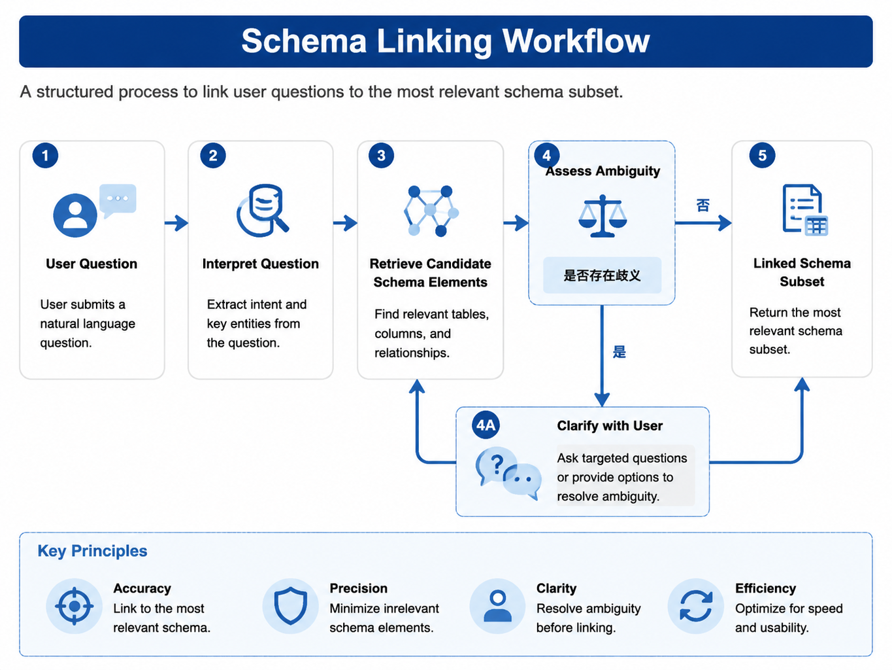

# Chapter 33 Semantic Layer Engineering

---
## Chapter Summary

This chapter discusses how DataAgent consumes the semantic layer. The semantic layer organizes metrics, dimensions, join paths, permissions, and versions on top of physical tables into a business-understandable and machine-executable model. Without the semantic layer, NL2SQL models can only guess tables and fields directly—terms like “sales,” “GMV,” “last week,” and “East China” might be interpreted with different definitions. This chapter explains the key pre-query steps in DataAgent consumption, including how Metrics, Dimensions, Views, Glossaries, Schema Linking, metric conflicts, versions, and trusted contexts are composed.
## Key Terms

Semantic Layer, Metric, Dimension, View, Schema Linking, Metric Definition, Data Freshness
## Learning Objectives

- Be able to explain why the semantic layer is the foundation of DataAgent’s trustworthy data querying.
- Be able to distinguish the roles of Metric, Dimension, View, and Glossary in DataAgent.
- Be able to describe how Schema Linking binds user natural language to semantic layer objects.
- Be able to handle metric conflicts, version applicability, permissions, lineage, quality, and freshness.

---
## Opening Scenario

Chapter 32 has already explained that DataAgent cannot maintain a long-term direct connection to ODS physical tables. When a user asks, "What were the main SKUs driving the sales decline in East China last week?" DataAgent cannot simply hand over the terms "sales," "East China," and "last week" to the model for free interpretation. "Sales" might mean operational GMV, or financial GMV excluding tax; "East China" might come from organizational master data or from historical regional divisions; "last week" might be based on the natural calendar week or the company's financial week.

The purpose of the semantic layer is to fix these easily drifting business definitions. The data platform team maintains metrics, dimensions, joins, default filters, permissions, and versions in the semantic layer; DataAgent calls the semantic layer at runtime, binding the spoken slots in the Question Frame to executable entities. This way, the model is responsible for planning and expression, while the semantic layer ensures factual consistency.

This chapter focuses on DataAgent’s consumer side. Chapter 15 discusses metadata and metric construction from the data platform perspective; this chapter does not repeat the construction process but focuses on how DataAgent reads the semantic layer during a single Run, performs disambiguation, and incorporates trusted contextual information into answers and traceability.

---
## 33.1 Why the Semantic Layer Is the Foundation

The semantic layer is a business abstraction built on top of physical tables. It centrally defines Measures, Dimensions, Hierarchies, Views, Join paths, and access policies, and exposes them to upper-layer applications via SQL, REST, GraphQL, or product APIs. Solutions like Cube, MetricFlow, and the dbt Semantic Layer fall into this category.

Without a semantic layer, DataAgent faces three major instability issues when generating SQL. First, the metric definitions are unstable: for example, whether sales revenue includes tax, excludes returns, or accounts for promotional adjustments. Second, Join paths are unstable: the model may guess wrong on fact-to-dimension table relationships, causing duplicates or missing rows. Third, security is unstable: a single physical table may contain both publicly available metrics and sensitive fields, and naïve table selection risks unauthorized exposure.

*Table 33-1: Risks without a semantic layer vs. constraints the semantic layer provides. Source: Compiled by the author.*

| Issue           | Risk Without Semantic Layer                     | Semantic Layer Constraint                  |
|-----------------|------------------------------------------------|--------------------------------------------|
| Metric Definition | Model guesses GMV definition independently      | Metric definitions and versioning           |
| Join Path       | Arbitrary physical table Joins                   | Pre-modeled relationships and Views         |
| Permissions     | Direct exposure of sensitive columns            | Row and column permissions, role-based Views |
| Data Freshness  | No knowledge of data sync time                    | Metadata and quality signals                  |

The semantic layer is not just about writing Chinese comments on tables. Comments can help the model understand column names but cannot express aggregation formulas, default filters, versions, permissions, or the Join graph. DataAgent needs executable Metrics, not descriptive text.

The semantic layer also cannot be replaced by Memory. Memory can record that a user last confirmed "show year-over-year" or "default view East China," but the mathematical definitions of metrics must come from semantic layer versions. If GMV formulas are hardcoded in long-term Memory, organizational changes or accounting policies shifts will cause DataAgent to keep using outdated definitions.

The value of the semantic layer also lies in cross-product consistency. If BI dashboards, DataAgent Q&A, scheduled reports, and alerting systems each maintain separate metric definitions, short-term development is faster, but long-term reconciliation is painful. A platform-level DataAgent should consume a unified semantic layer rather than duplicating an Agent-specific YAML file just because the model "understands it better." Agents may have their own prompt and query strategies, but should not redefine GMV formulas.

Clear division of roles between the construction and consumption sides is critical. The data platform team is responsible for model publishing, metric approval, lineage, and quality. The DataAgent team is responsible for mapping user language onto these models and explaining results to business users. DataAgent can provide feedback to the data platform on "which terms are often ambiguous," "which metrics lack titles," "which Views are too large causing linking noise," but should not bypass the data platform to directly modify tables or change definitions.

---
## 33.2 Metric, Dimension, View, and Glossary

When DataAgent consumes the semantic layer, it most commonly interacts with four types of objects. A **Metric** defines an aggregatable measure, such as operational GMV, order volume, or gross margin rate. A **Dimension** defines slicing attributes, such as region, category, channel, or SKU. A **View** defines the set of metrics and dimensions visible to a certain type of user. A **Glossary** defines mappings from business terms to semantic objects—for example, “revenue,” “sales,” and “GMV” might correspond to multiple different metrics.

*Table 33-2: Semantic layer objects and their usage in DataAgent. Source: Compiled by the authors.*

| Object   | Purpose                         | DataAgent Usage                             |
|----------|--------------------------------|--------------------------------------------|
| Metric   | Metric formula, default filters, versions | Bound to the metric slot in the Question Frame |
| Dimension| Filtering, grouping, drill-down fields       | Bound to dimensions like time, region, SKU |
| View     | Role- or scenario-based visibility scope     | Restricts objects visible to the Planner   |
| Glossary | Business term mappings                      | Converts user colloquial terms into candidate metrics |

Each Metric should have at least a programmatic ID, a display title, a definition, an owner, version, and default filters. The display title is critical because it appears in user-facing answers. For example, DataAgent should not just say “GMV decreased by 12.3%,” but say “Operational GMV `gmv_ops@2025Q1` decreased by 12.3%.” This lets users know which calculation perspective the system is using.

Planners should not see the entire repository’s DDL. A more robust approach is layered pruning: After login, users are injected with a View summary based on their role; the Linker recalls a few candidate Metrics and Dimensions based on the question; the actual joins, default filters, and SQL compilation are handled by semantic layer APIs. This controls context length and prevents the model from making erroneous associations after seeing unrelated tables.

```yaml
view: sales_ops
metrics:
  - gmv_ops
  - gmv_tax_excluded
  - order_count
dimensions:
  - region_code
  - category
  - sku
  - week
```

The above summary only tells the Planner “which objects are available for planning in the current role.” It is not the full semantic layer model and does not include all physical join details. The full definition is still held by the API under `infra/semantic_layer/`.

The granularity of a View should suit the role, not the database structure. An Operations Director needs visibility into region, category, SKU, channel, and operational GMV; a Financial Controller needs to see gross margin, cost, and tax-excluded revenue; a Store Manager might only see their own store. A View too large causes a flood of Linker candidates; too small causes frequent refused answers. The View’s design should be continuously adjusted based on business roles and common questions.

The Glossary is not a one-time dictionary. Business terms evolve; users employ abbreviations, aliases, and colloquial expressions. For example, “revenue,” “sales,” “turnover,” and “GMV” might mean different things in different companies. The Glossary should record synonyms, applicable scope, candidate Metrics, and default strategies, and feed high-frequency clarification questions back into the data governance process. Without a Glossary, the model guesses business meanings from table and column names alone, leading to poor stability.

Metric `title` and `description` are not just documentation fields. They enter DataAgent’s answers, follow-up questions, and trace logs. Titles that are too engineering-like, such as `gmv_ops_v2`, confuse business users; descriptions that are too marketing-like fail audit requirements. A better practice is a short title plus precise definition, for example: “Operational GMV: includes promotional adjustments, counted by order creation time, deducts some returns.” Such text disambiguates the model and explains to users.

---
## 33.3 Schema Linking and Field Disambiguation

Schema Linking is the process of binding the natural language slots in a Question Frame to semantic layer objects and the necessary physical schema. For example, when a user says "sales decline," the Frame might only contain `metrics: [gmv]` and `task_type: diagnose`; the Linker must further determine which Metric this `gmv` refers to, which version, and what dimensions and filters apply.



*Figure 33-1: Schema Linking flow. Source: drawn by the author. Alt text: The process starts from the user query, through term recognition, candidate field recall, scoring by signal, disambiguation confirmation, and outputs a Linked Schema bound to specific Metrics and fields.*

The Linking process typically proceeds in three steps. The first step uses a Glossary to find candidate objects, for example, “sales” or “GMV” hitting on both Operations GMV and Finance GMV. The second step uses Views to filter out objects that the current user is unauthorized to access or that are not applicable in the current context. The third step recalls candidate fields within allowed scope via vector retrieval, historical successful Runs, and column annotations, then reranks them by rules or model.

*Table 33-3: Sources of Linking signals. Source: compiled by the author.*

| Signal             | Priority | Description                            |
|--------------------|----------|------------------------------------|
| Glossary           | High     | Business terms mapped to candidate Metrics |
| View               | High     | Visibility scope for roles and tenants      |
| Vector Retrieval   | Medium   | Recall fields within allowed scope           |
| Historical Success Run | Medium | Requires validation of Metric version       |
| Model Free Inference | Low      | Must pass schema validation                |

Continuing the “East China decline” example from Chapter 32, the Linker will first recognize “sales” as a GMV candidate, then narrow down using the `sales_ops` View and the user’s role. If two legitimate definitions remain, it may prompt the user for clarification or use role defaults, clearly indicating this in the response. Subsequently, “East China” is mapped through the organizational hierarchy to `region_code = 'EAST'`, and “SKU” is bound to the product dimension allowed by the current View.

```json
{
  "metrics": [{"metric_id": "gmv_ops", "version": "2025Q1", "title": "Operations GMV"}],
  "dimensions": ["region_code", "sku"],
  "filters": [{"field": "region_code", "op": "eq", "value": "EAST"}],
  "time_range": {"grain": "week", "range": "last_week"},
  "view": "sales_ops"
}
```

Linking failures typically do not appear as SQL syntax errors, but as queries that are legal but have incorrect definitions. For example, linking to deprecated columns, combining fields across Views, or conflating same-named but semantically different fields as one dimension. DataAgent should record candidates, scores, final choices, and disambiguation reasons in Trace logs to support replay as detailed in Chapter 38.

Linking also requires an evaluation dataset. Samples should not only come from engineer-crafted standard questions but also include real user wording, abbreviations, typos, cross-department terminology, and boundary cases requiring refusal. Each sample should be annotated with the expected Metric, Dimension, View, whether clarification is needed, and error candidates that must not be used. This enables detecting cases where the model appears to generate correct SQL syntax but actually selects the wrong definition.

Historical successful Runs can assist Linking, but must include version validation. Just because a user successfully queried “East China sales” last month using `gmv_ops@2025Q1` does not mean all “East China sales” queries this year should reuse that definition. If the semantic layer updates to `2025Q2`, past Runs can only serve as candidate signals, not direct binding results.

Vector retrieval also requires scope restriction. Putting all column names and comments into a vector database makes it easy to recall similar fields; however, if filtering by View, tenant, and permissions is not first applied, the model may see fields it shouldn’t. The correct order is to first filter by visibility scope, then recall and rerank candidates within that scope. Retrieval is an aid to disambiguation, not a permission system.

---
## 33.4 Metric Conflicts, Versions, and Scope of Applicability

Multiple legitimate metric definitions often coexist within enterprises. For example, the finance team may maintain a tax-excluded GMV, while the operations team tracks an operational GMV that includes promotional adjustments; headquarters may use a group-level standard, whereas regional teams use local definitions; the definitions for 2024 and 2025 might also differ. DataAgent cannot hide these conflicts.


*Figure 33-2: Glossary multi-metric disambiguation process. Source: drawn by the authors. Alt text: When one term matches multiple metrics, the process narrows candidates step-by-step according to view scope, user role, and historical preferences, asking the user if necessary.*

*Table 33-4: Handling strategies for metric conflicts. Source: compiled by the authors.*

| Situation | Handling Approach | User-Visible Expression |
|---|---|---|
| Unique after View filtering | Auto-select | Show metric title and version |
| Multiple remain within same View | Ask user or use default metric | Indicate default source |
| Metric versions span different periods | Match by effective date | Mark as `metric_id@version` |
| No safe match | Refuse to answer or escalate to human | Explain lack of available definition |

Versioning addresses the issue of a single metric evolving over time, while scope of applicability addresses which users the metric is valid for. A Run must at least record the `metric_id`, `version`, effective time, View, tenant, and default filters. When users ask, “Which GMV did you just use?”, the system should be able to answer directly rather than re-explaining in natural language.

Enforcing a single company-wide standard reduces dialogue complexity but is often unrealistic for enterprises with multiple business lines. Allowing multiple standards to coexist requires making the selection process explicit. An even more dangerous practice is multiple standards coexisting in the backend while the frontend shows only a single label like “Sales.” This may seem simpler for users initially but will prevent DataAgent from reconciling with official reports over time.

Metric version changes must affect DataAgent behavior. When new versions go live, the system cannot simply overwrite old definitions because historical reports need to be reproducible and incomplete Runs may still use old versions. A more robust approach is to maintain both old and new versions during a transition period; the semantic layer returns version effective dates, and the Planner selects versions based on the query’s time range and current View. When comparing across versions, the system should mark “Definition changed” and require manual confirmation if needed.

User default strategies must also be auditable. For example, an operations director defaults to operational GMV, while a financial controller defaults to financial GMV. Such defaults reflect organizational policy, not model preference. The source, version, and applicable role should be written into Trace. Otherwise, when the same term “Sales” returns different values for different users, the platform cannot explain the sources of discrepancies.

When conflicts cannot be resolved, refusing to answer is better than providing incorrect answers. DataAgent can say, “There are currently two definitions for Sales in the semantic layer; please choose operational GMV or financial GMV,” optionally with a brief explanation of differences. After the user selects, the system continues execution. This extra interaction step avoids burying definition conflicts in the final numbers.

---
## 33.5 Trusted Context: Permissions, Lineage, Quality, and Freshness

Metric definitions answer the question “How is the number calculated?” Trusted context answers “Can the user see it? Where does the data come from? What is the quality? Until when is it synchronized?” DataAgent should not only return numbers but also include these signals as footnotes or trace data in the response when necessary.

*Table 33-5: Sources and Uses of Trusted Context. Source: Compiled by the author.*

| Dimension | Source | DataAgent Usage |
|---|---|---|
| Permissions | Semantic layer RBAC, Policy | Intercept unauthorized queries before execution |
| Lineage | OpenLineage, DataHub, Metadata services | Explain data origin and model versions |
| Quality | dbt tests, Great Expectations | Reduce confidence in conclusions under quality anomalies |
| Freshness | Partition time, synchronization task status | Indicate data cut-off time or refuse to answer |

In an East China downturn analysis, `trusted_context()` might return references to Views, policies, underlying tables, model versions, quality status, and the latest sync time. The Planner does not need to show all this raw JSON to the user but should convert it into concise natural language footnotes. For example: “Data sourced from `orders_fact v3`, synchronized until 2025-06-14 06:00; SKU null rate slightly high, drill-down conclusions are for reference only.”

If freshness exceeds SLA, the system can refuse to answer, suggest retrying, or escalate to human-in-the-loop (HITL) confirmation of whether to show results. For multi-source queries, avoid labeling only the fastest data source; a more reliable approach is to use the worst freshness or to explicitly label synchronization times for key data sources.

Trusted context should be named separately from Memory. Memory may record user preferences for year-over-year comparison display; Org Context may record regional or organizational definitions; the semantic layer defines Metric definitions and versions; Metadata services track quality and freshness. Mixing these diverse sources into a single “context” field risks models mistaking preferences for facts or old memories for official definitions.

The presentation of trusted context in responses should be layered. Regular queries do not require a full lineage graph but should at least state metric definitions and data timestamps; quality anomalies should add a cautionary note; formal reports should include lineage, quality status, and executed SQL in appendices or audit dashboards. Showing too much information can distract business users, while showing too little weakens trust. Product layouts can put brief footnotes inline and full evidence in expandable areas.

Quality signals must also affect conclusion confidence. If SKU null rate is slightly elevated, the system can still answer top category queries but should weaken SKU-level conclusions; if the fact table delay exceeds SLA, the system should refuse to generate “latest” conclusions; if an upstream job in the lineage failed, the report should go to human review. Trusted context is not decoration; it changes whether the Planner proceeds, how it expresses results, and whether HITL is required.

Multi-source queries require particular caution. A question may read from orders, returns, and promotions tables simultaneously. Each data source has different freshness and quality status, so the response cannot show only the best state. For operational analysis, the most conservative sync time should typically be used, or explicitly state: “Order data as of 06:00, return data as of 04:00.” This prevents users from mistaking mixed definitions as a single consistent timestamp.

---
## 33.6 mini-platform Implementation Path

In the mini-platform, the semantic layer target interface is located at `infra/semantic_layer/`, while the DataAgent's Linker is located at `agents/data_agent/`. Some implementations in the current repository remain target contracts; this chapter focuses on the interface shape and dependency direction.

```text
mini-platform/infra/semantic_layer/
├── client.py
├── models/
└── __init__.py

mini-platform/agents/data_agent/
└── linker.py
```

`resolve_metric()` is responsible for parsing the colloquial metric into candidate Metrics; `compile_query()` compiles disambiguated Metrics, Dimensions, filters, and time ranges into executable queries; `trusted_context()` returns permissions, lineage, quality, and freshness information. The Planner can read the results but cannot override the Measure aggregation logic.

```json
{
  "metrics": ["gmv_ops"],
  "dimensions": ["region_code", "sku"],
  "filters": [{"field": "region_code", "op": "eq", "value": "EAST"}],
  "time_range": {"start": "2025-06-09", "end": "2025-06-15", "grain": "week"},
  "view": "sales_ops",
  "tenant_id": "demo-tenant"
}
```

For production deployment, at least four things must be ensured. First, production queries go through semantic layer Views so that DataAgent does not directly connect to physical tables long-term. Second, Metric changes have versioning, owners, and approval records. Third, Linking logs retain candidates and final selection rationales. Fourth, freshness or quality anomalies can affect answers rather than only being logged in the backend.

Common failures also cluster around these boundaries. When Views are too large, Linking still exceeds context limits and must generate sub-Views by intent; when IAM does not inject `semantic_view`, the request should be rejected rather than degraded to full database access; when versioning of Metrics in historically successful SQL is expired, it cannot be reused directly; for Cube or MetricFlow cold start timeouts, the Run should fail or retry instead of allowing the model to bypass the semantic layer and write physical SQL directly.

The initial implementation can first deliver a narrow interface rather than trying to ship the full semantic layer product in one go. The first version only needs to support core Metrics, common Dimensions, role-based Views, Glossary, and `compile_query()`; after stabilizing the query count pipeline, more lineage, quality, and complex Join capabilities can be integrated. The interface should remain stable, while the underlying implementation can gradually migrate from self-developed YAML to Cube or MetricFlow.

Testing should also focus on the interfaces. `resolve_metric()` tests disambiguation and rejection scenarios, `compile_query()` tests default filtering and View restrictions, `trusted_context()` tests quality and freshness anomaly cases, and Linker tests candidate recall and version consistency. Simply testing whether the final SQL executes does not cover the most critical risks of the semantic layer.

---
## Chapter Recap

1. The semantic layer is the foundation of trustworthy DataAgent querying, responsible for metrics, dimensions, joins, permissions, and versions.
2. DataAgent should consume Metric, Dimension, View, and Glossary objects rather than feeding the model the entire database DDL directly.
3. Schema linking must disambiguate between Glossary, View, vector search, and historical Runs, and the selection process should be recorded in the Trace.
4. Metric conflicts cannot be hidden. Both Runs and answers must log `metric_id@version`, View, and the default data source.
5. Permissions, lineage, quality, and freshness are part of the trusted context and should be included in answer footnotes and audit replays.
## Further Reading

- [Chapter 32: DataAgent Product Forms](ch32-dataagent.md)
- [Chapter 34: Engineering NL2SQL](ch34-nl2sql.md)
- [Chapter 15: Metadata and Metrics](../../part03-data-infra/ch/ch15.md)
- [Chapter 18: Vector Databases](../../part04-vector-knowledge/ch/ch18.md)
- [Chapter 27: Memory Systems](../../part05-agent-capabilities/ch/ch27-memory.md)
- [Chapter 50: Policy and Permissions](../../part10-security-org/ch/ch50.md)
## References

Cube. (2025). *Introduction: Cube semantic layer*. [https://cube.dev/docs/product/introduction](https://cube.dev/docs/product/introduction)

dbt Labs. (2024). *About MetricFlow*. dbt Developer Hub. [https://docs.getdbt.com/docs/build/about-metricflow](https://docs.getdbt.com/docs/build/about-metricflow)

Liu, X., et al. (2025). A survey of Text-to-SQL in the era of LLMs. *IEEE TKDE*, 37(10), 5735-5754. [https://doi.org/10.1109/TKDE.2025.3592032](https://doi.org/10.1109/TKDE.2025.3592032)

Lei, F., et al. (2024). Spider 2.0: Evaluating language models on real-world enterprise text-to-SQL workflows. *ICLR 2025*. arXiv:2411.07763. [https://arxiv.org/abs/2411.07763](https://arxiv.org/abs/2411.07763)

Talaei, S., et al. (2024). CHESS: Contextual harnessing for efficient SQL synthesis. arXiv:2405.16755. [https://arxiv.org/abs/2405.16755](https://arxiv.org/abs/2405.16755)

OpenLineage. (2024). *OpenLineage documentation*. [https://openlineage.io/docs/](https://openlineage.io/docs/)
