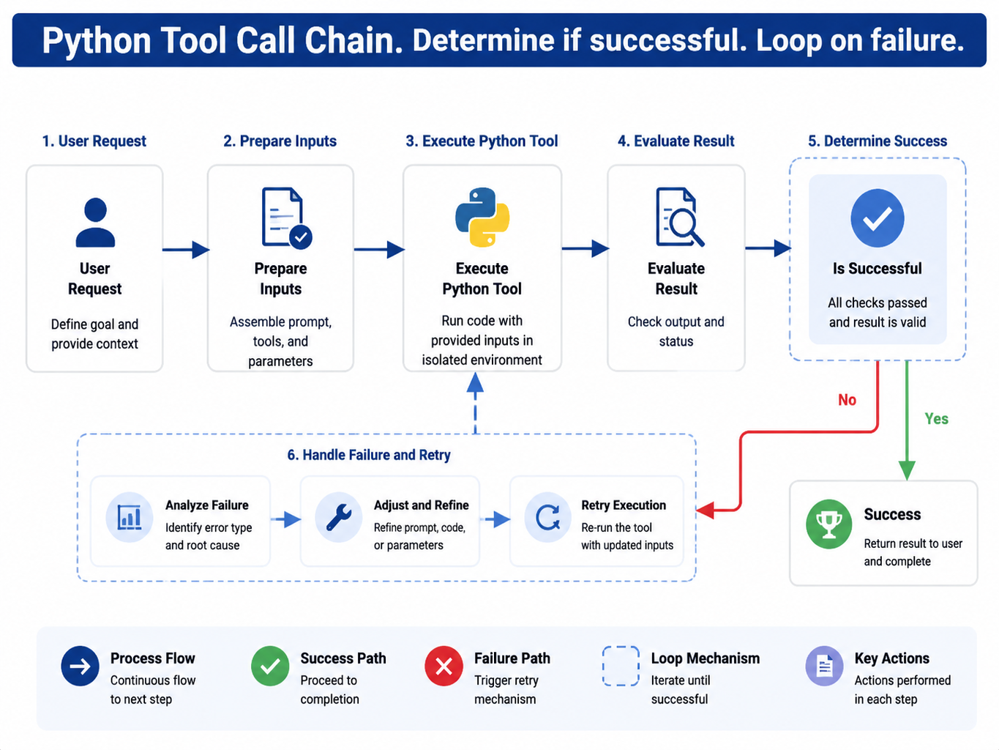

# Chapter 35 Text-to-Pandas / Text-to-Python

---
## Chapter Summary

This chapter discusses Text-to-Pandas and Text-to-Python in DataAgent. While SQL is suitable for authoritative data retrieval and aggregation, tasks such as contribution decomposition, structural transformation, statistical testing, ad hoc CSV exploration, and chart preprocessing are often better expressed in Python. Python code generated by the model is executed for real, so it must run within a restricted sandbox and be managed via Registry, Trace, artifacts, and evidence backtracking. This chapter explains the boundary between SQL and Python, sandbox security, code generation and self-healing, as well as how Python outputs feed into the charts and reports presented in Chapter 36.
## Key Terms

Text-to-Python, Text-to-Pandas, Python sandbox, DataFrame, code audit, artifact, evidence linkage
## Learning Objectives

- Be able to determine whether an analysis task should continue using SQL or switch to Python analysis.
- Be able to explain how a Python sandbox should isolate network, files, dependencies, and resources.
- Be able to design the processes of code generation, static auditing, execution, error correction, and artifact recycling.
- Be able to use `dataframe_ref`, `content_hash`, and `metric_context` to ensure that analysis results are reproducible and verifiable.

---
## Opening Scenario

Chapter 34 addresses structured data retrieval. In the East China decline case, the `sql_executor` has already obtained the Top SKUs, last week's GMV, the GMV from the week before last, and the difference. Business users continue to ask, "Is this related to the category structure?" This question goes beyond simple data extraction. The system needs to aggregate SKU-level results by category, calculate contribution to the difference, determine whether the Top categories are concentrated, and prepare data for the charts in Chapter 36.

This kind of analysis can be hard-coded in SQL, but SQL queries often become very long and intermediate steps are difficult to explain. Python is better suited for expressing DataFrame transformations, contribution calculations, statistical tests, simple modeling, and ad hoc file exploration. The value of Text-to-Python is enabling the Planner to generate this analysis code from natural language and execute it safely within a sandbox.

The sandbox boundaries must be clearly defined upfront. Python is not a second query engine, nor a shortcut to bypass the semantic layer. It can only read `dataframe_ref` objects injected from the Registry — that is, result sets that have already been trimmed, authorized, versioned by reporting standard, and hashed by upstream `sql_executor`. If new data retrieval is necessary, the Planner should go back to `sql_executor` rather than accessing the database directly from Python code.

---
## 35.1 The Boundary Between SQL and Python

SQL remains the authoritative layer for data retrieval. Metric aggregations, joins, tenant filtering, row-level permissions, and default filters should be implemented in the semantic layer and `sql_executor`. Python operates on the authorized and pre-filtered result sets. This boundary ensures traceability of metrics and prevents models from generating code that scans production databases.

*Table 35-1: Suitable Boundaries Between SQL and Python. Source: Compiled for this book.*

| Task | Preferred Approach | Reason |
|---|---|---|
| Single metric aggregation | SQL | Clear metric definitions, controllable execution |
| Top SKU query | SQL | Grouping, sorting, and limit suffice |
| Category contribution | SQL data retrieval + Python | Intermediate calculations and explanations are clearer |
| Price/sales decomposition | Python | Multiple-step formulas and many temporary columns |
| Temporary CSV exploration | Python sandbox | Data not yet warehoused, size and permissions need limiting |
| Preprocessing report charts | Python + chart renderer | Produce aggregated JSON or chart specifications |

In the East China case, the top SKU list is generated by SQL, while "whether category structure matters" is done by Python. The Planner marks `path: sql_then_python` in the Question Frame. Upstream SQL outputs a narrow table with `sku_id`, `category`, `gmv_last_week`, `gmv_prior_week`, `gmv_delta`, and `region_code`. Python performs calculations only on this narrow table.

This boundary also aids troubleshooting. If Python results differ from SQL aggregates, the team first checks `dataframe_ref`, `content_hash`, and `metric_context`. If Python uses wrong columns or duplicates aggregations, fix Python code; if upstream SQL metrics are incorrect, revisit Chapters 33 and 34. Without this layered structure, Notebooks, SQL, and reports would blame each other endlessly.

The boundary between SQL and Python also affects costs. Online OLAP fits filtering, aggregation, and sorting; Python sandbox is suited for secondary calculations on smaller result sets. If a task requires tens of millions of detail rows loaded into pandas, it means it should not run as interactive DataAgent queries but be converted to offline jobs, pre-aggregated tables, or dedicated feature services. Natural language interfaces cannot circumvent physical limitations of compute systems.

Python should not replace formal modeling workflows either. One-off contribution analysis, exploratory distribution tests, and simple regressions can go into sandboxes; long-term attribution models, predictive models, and risk scores should be developed and deployed in data platforms or model services. DataAgent can treat sandbox results as prototypes and evidence but must not turn temporary code into production models.

For business users, the difference between SQL and Python should not be exposed as a technical choice. Users simply ask follow-ups like "by category" or "is it due to price," and the Planner chooses the path. The product interface can show "secondary analysis based on previous results," listing the upstream SQL and Python artifacts in the evidence section.

---
## 35.2 Sandbox Security

Python code generated by models must be considered untrusted by default. It may import network libraries, read host files, install packages, write logs, create large files, or leak sensitive fields in exception handling. Production environments cannot rely on prompts telling the model “don’t do this” — restrictions must be enforced within the Tools and runtime environment.

The sandbox should meet several minimum requirements: network disabled by default; only mount a temporary Run directory; use cgroups or equivalent mechanisms to limit CPU, memory, and execution time; whitelist allowed dependencies; forbid `subprocess`, `socket`, database connection libraries, and arbitrary filesystem access; destroy the temporary directory when the Run finishes. PII columns must be desensitized before entering the sandbox—do not expect Python code to mask sensitive data itself.

```yaml
allowed_imports: [pandas, numpy, scipy, sklearn, matplotlib]
max_memory_mb: 512
max_cpu_seconds: 30
max_python_retries: 2
network: false
```

Docker is the more realistic default choice—complete scientific computing ecosystem, mature isolation, and resource controls. WASM or Pyodide start faster but have limited scientific computing packages, suited for edge or experimental scenarios. Remote Jupyter Kernels offer a good development experience, but multi-tenant isolation and auditing are difficult, making them unsuited as the default production execution environment.

Static auditing is the first line of defense. Before code enters the sandbox, parse its AST to check imports, file access, network access, process spawns, dynamic execution, and dangerous paths. Static auditing cannot replace container isolation but can catch many dangerous coding errors generated by the model. Container isolation handles behaviors missed by static scanning.

Dependency management must be fixed. Sandbox images should preinstall a fixed set of versioned packages such as pandas, numpy, scipy, scikit-learn, and matplotlib; each Run must record the image and package versions. Model-generated `pip install` requests must be rejected. Otherwise, the same code may produce different results over time due to library version changes.

Filesystem access must be isolated per Run. Inputs are mounted read-only, outputs are written to Run artifact directories, temporary files have quotas, and cleanup policies delete files after Run completion. Chart libraries often write config files or font caches—these paths must explicitly point to the Run temporary directory to avoid polluting the host environment. For multi-tenant platforms, these details are often a greater source of incidents than the code itself.

The sandbox must also handle resource abuse. Models may generate infinite loops, Cartesian product expansions, full pivots, or high-level model training. Hard limits must be imposed on CPU, memory, execution time, and output size, returning structured errors on overage. The planner can then require users to narrow scope or switch to offline tasks rather than continuously retrying the same code.

---
## 35.3 Code Generation, Execution, and Self-Repair

A single Python Tool invocation can be broken down into five steps. The Planner prepares the column summary, `dataframe_ref`, and analysis objective; the Gateway generates Python code; the Tool performs static auditing; the sandbox executes the code and collects stdout, stderr, and artifacts; the Registry returns the structured Observation back to the Planner.



*Figure 35-1: Python Tool sandbox execution flow. Source: original drawing for this book. Alt text: The process flows from code generation, static auditing, injecting read-only data, executing in a restricted sandbox, collecting artifacts and logs, to termination upon timeout or permission violation.*

Column name errors, type conversion errors, and minor syntax errors can be self-repaired. For example, if the model mistakenly uses `gmv_change` but the input columns only have `gmv_delta`, the sandbox will return a `KeyError` and a list of available columns. The Planner can then prompt the Gateway to fix and retry. The retry count should be independent of SQL retries covered in Chapter 34, typically limited to 1 or 2 attempts.

Privilege violations and dangerous behaviors cannot be self-repaired. If code tries to import `socket`, call `subprocess`, access database connections, or read the host directory, it should fail immediately and write an audit record. Otherwise, the model might discover usable paths by trial and error through retries. Security failures must be handled separately from ordinary code errors.

Observations should also be layered. The Planner needs exception stack traces, available columns, stdout summaries, and artifact lists; users should only see concise messages such as "Analysis failed due to missing fields"; audits must preserve code hash, input hash, dependency versions, resource usage, and exit reasons. Do not display full stderr logs directly to users.

When generating code, the prompt should only include column summaries, sample rows, and task objectives. Avoid including the full DataFrame in context and do not expose sensitive columns to the model. The column summary should include field names, types, a small amount of statistics, and anonymized samples—enough for the model to produce code such as groupbys, pivots, or pct_change. Full data is read inside the sandbox via `dataframe_ref`.

Self-repair must maintain the same input context. After the first execution failure, the Planner can ask the model to modify the code but must not replace `dataframe_ref`, `content_hash`, or `metric_context`. Otherwise, a second success might not correspond to the evidence chain of the first attempt. If a fix requires adding new fields or re-querying data, it should return to the `sql_executor` to produce new artifacts and record new upstream relationships.

In the explanation phase, the model must not write conclusions based solely on code intent. The model should read numbers from stdout or JSON artifacts and then generate natural language descriptions. Numbers not output by the code should not appear in the answer; fields shown only in exception traces should not be treated as analysis results. This constraint reduces cases where the code fails but the answer appears successful.

---
## 35.4 SQL + Python + Chart Workflow

Python's input is not a chat history segment but the output from upstream tools. The `sql_executor` returns `dataframe_ref`, column summaries, row counts, `content_hash`, and `metric_context`. Python reads `dataframe_ref` and outputs statistical JSON, chart data, or intermediate artifacts. Chapter 36’s `chart_renderer` then converts these outputs into visualizations and report EvidenceRef.


*Figure 35-2: Timing sequence of the analytical tool chain. Source: drawn by the author. Alt text: A sequence diagram showing the Planner first uses SQL to fetch data, then invokes the Python Tool for statistical modeling, and finally generates chart artifacts. Arrows indicate the relay collaboration between the SQL and Python tools in one analysis.*

`dataframe_ref` specifies which data Python reads; `content_hash` indicates whether that data has been replaced; and `metric_context` defines the accounting metric. Together, these three form a contract between SQL and Python. Missing any of them means the percentages in the report cannot be traced back to the original evidence.

A simplified category contribution script example is shown below.

```python
import json
import pandas as pd

df = pd.read_parquet(inputs["dataframe_ref"])
by_cat = (
    df.groupby("category", as_index=False)["gmv_delta"]
    .sum()
    .assign(share_of_decline=lambda x: x["gmv_delta"] / x["gmv_delta"].sum())
    .sort_values("gmv_delta")
)
result = {
    "metric": "gmv_ops@2025Q1",
    "categories": by_cat.to_dict(orient="records"),
    "top3_share": float(
        by_cat.nsmallest(3, "gmv_delta")["gmv_delta"].sum()
        / by_cat["gmv_delta"].sum()
    ),
}
print(json.dumps(result, ensure_ascii=False))
```

When the Planner writes conclusions based on Python output, it must not recalculate numbers. It should reference results from stdout or artifacts, such as “The top three categories—snacks, dairy, and beverages—account for 58% of the East China operational GMV decline difference.” If users ask “How is 58% calculated?”, the system can open the upstream Parquet hash, Python code hash, and `category_contrib.json`.

Each step in the workflow must retain input and output summaries. The SQL Tool records the query, row count, and Parquet hash; the Python Tool records code, stdout, artifacts, and resource usage; the Chart Tool records chart specs, data references, and rendering artifacts. This way, when generating reports in Chapter 36, tools don’t need to be rerun, yet evidence links can still be attached to charts and conclusions.

If Python analysis requires multiple inputs, such as sales results and competitive pricing data, the platform must separately record each input’s source, hash, permissions, and freshness. Conclusions from multi-input analyses only hold within the intersection covered by all inputs. If competitive pricing is a temporary file uploaded by a user, the report should note it is not according to enterprise data warehouse standards.

When Python outputs chart data, it’s also important to distinguish display fields from calculation fields. Display fields can be renamed or formatted, but calculation fields should keep raw values. Otherwise, Chapter 36’s charts and reports may only receive formatted percentage strings, making it impossible to sort, filter, or verify evidence further.

---
## 35.5 Artifact Management and Evidence Traceability

Python artifacts can be statistical JSON files, chart data, PNG images, CSV summaries, or notebook snippets. Regardless of the form, they should be bound to input hashes, Metric versions, code hashes, execution environments, and generation timestamps. Artifact URLs must have TTL (time-to-live), and sensitive artifacts should have tenant- and permission-based access controls.

Artifacts are not long-term fact tables. For example, a `category_contrib.json` generated in a single Run applies only to that specific input, metric version, and code version. When reused next week, it must be rebound with the new input and Metric version. What can be preserved long-term are semantic layer metrics, report templates, analysis playbooks, or evaluation samples—not a sandbox output from a single run.

Notebook collaboration requires caution. Business users may download or view the analysis process, but downloaded notebooks should not be re-ingested into the platform as authoritative results. Otherwise, the platform cannot guarantee that subsequent manual edits comply with permission policies, definitions, and evidence requirements. Production reports should reference platform-managed artifacts and traces, rather than locally modified user scripts.

Evidence traceability must also cover charts. When generating charts in Chapter 36, the chart specification should be bound to the Python artifact and the upstream SQL result. Chart titles and annotations should include the metric title or `metric_id@version` to prevent loss of definition if users screenshot charts. External reports require a more complete EvidenceRef.

Artifact lifecycle management also concerns compliant deletion. When a user deletes an uploaded file, a tenant is decommissioned, reports are withdrawn, or compliance demands data cleanup, the platform must locate Python artifacts and charts derived from that input. Saving only final images without provenance makes cleanup incomplete. Run artifacts should support tracing derivative artifacts by input hash or tenant.

Notebook previews can serve as collaborative interfaces but should be clearly read-only retrospectives—not production execution entry points. Users may view code and intermediate tables and propose modifications; actual re-execution should be performed by the Planner generating new Tool Calls. This preserves analytic transparency without letting manual notebooks become fact sources outside the platform.

For analyses reused long-term, sandbox code should be promoted to version-controlled analytic tools. For example, if the "volume-price waterfall" is used weekly, the model shouldn't regenerate a pandas snippet every time; it should be formalized as a `price_volume_decomposition@v1` Tool. Text-to-Python is suitable for exploration and gap-filling, while stable processes should gradually be industrialized.

---
## 35.6 mini-platform Deployment Path

`python_sandbox` is a Registry Tool, not a notebook accessed directly by users. The Planner passes in code, input references, tenant and metric context; the Tool returns stdout, artifacts, provenance, and structured errors. The directory can be split by execution entry, runner, static scan, and policy files.

```text
mini-platform/tools/python_sandbox/
├── handler.py
├── runner/docker_runner.py
├── static_scan.py
└── policy.yaml
```

The production implementation must at least record these fields: code hash, `dataframe_ref`, `content_hash`, `metric_context`, stdout summary, artifact URI, resource usage, exit status, and error type. This allows Chapter 38 Trace to place Python analysis back into the complete Run lineage.

The first version can initially support pandas, numpy, matplotlib, and fixed input formats. Later add polars, scipy, sklearn, notebook previews, and more chart artifacts. Do not allow arbitrary package installation from the start. The looser the dependencies, the harder it is to ensure security and reproducibility.

Common failures include sandbox timeouts, out-of-memory, matplotlib backend misconfiguration, non-whitelisted packages, KeyError, and mismatch between SQL/Python aggregation. Each failure type must have clear handling: fixable errors return available columns and hints; unfixable errors result in failure or manual confirmation. Particularly for aggregation mismatches, it is crucial to distinguish rounding errors from true scope drift.

The evaluation dataset should also cover the Python pipeline. Samples should include correct contribution, missing columns, empty data, outliers, unit changes, truncated inputs, unauthorized code, and missing chart evidence. Evaluation not only checks if the code runs but whether output numbers derive from input, retain Metric context, and reduce conclusion strength under uncertainty.

Before launch, an end-to-end rehearsal is advisable: SQL extracts East China SKU wide table, Python calculates category contribution, Chart Tool generates bar chart, report references EvidenceRef. During rehearsal, deliberately trigger KeyError, timeout, non-whitelist import, and content hash mismatch, confirming the system returns self-repair, failure, rejection, and refetching accordingly. This approach more closely simulates production than just testing a pandas snippet.

After deployment, monitor metrics closely. Python Tool retry rate, timeout rate, memory failure rate, average artifact size, and SQL/Python aggregation inconsistency rate all signal sandbox health. If a certain analysis frequently fails, consider hardcoding it as a fixed Tool or precomputing it in the data platform.

Sandbox operations require cleanup policies. Run temporary directories, chart caches, stdout, stderr, notebook previews, and intermediate Parquet files all consume storage. The platform should set TTL by tenant, Run type, and compliance needs, retaining sufficient metadata in Trace for replay. Raw sensitive data can be cleared with shorter TTL, keeping hashes, schema, Metric context, and code hash for report explanation.

For team collaboration, analytical script improvements should enter a review workflow. When data analysts find model-generated contribution code unstable, they can submit stable versions as Playbooks or fixed Tools; the platform team then adds schema, tests, and permissions. In this way, Text-to-Python does not generate limitless temporary code but gradually matures frequent analyses into governable assets.

Finally, the user experience should avoid exposing sandbox details to business users. The UI can display “Performing category contribution analysis” or “Analysis results based on previous SQL output” but need not let users choose pandas vs polars. Technical details stay in the evidence panel and Trace; the business interface only shows conclusions, scope, and traceable entry points.

Acceptance testing should verify both correctness and isolation. Correctness validates contribution, proportions, and ranking with fixed inputs; isolation tests that malicious samples are blocked from network, file, process, and non-whitelist packages. Only if both pass can Text-to-Python enter the main DataAgent pipeline.

After permission changes, replay and verification remain necessary. When user roles, tenant scopes, or masking policies change, prior Runs’ Python artifacts must not be automatically inherited under new permissions. The platform should replay historical evidence with the original permission context but decide access to re-view or download artifacts according to current permissions.

This rule is especially important for report reuse. Reports can keep conclusion summaries, but reopening underlying details, chart data, or notebook previews requires current user permission checks.

Audit exports should only include artifact references and summaries within the authorized scope, avoiding packaging sandbox temporary directories wholesale for users. When necessary, keep approval logs indicating who viewed these artifacts and under what permissions.

---
## Chapter Recap

1. SQL is the authoritative source for data retrieval; Python handles secondary analysis and ad hoc computation on SQL result sets.
2. The Python sandbox must have no network access, constrained resources, a whitelisted dependency set, and no direct connections to production databases.
3. `dataframe_ref`, `content_hash`, and `metric_context` form the evidence contract between SQL and Python.
4. Python artifacts are trustworthy only within the current run and for the current input; anything meant to persist long-term should be promoted back to the semantic layer, a template, or a Playbook.
5. Charts and reports must cite their upstream SQL and Python artifacts — the model must never rewrite numbers from memory.
## Further Reading

- [Chapter 34 NL2SQL Engineering](ch34-nl2sql.md)
- [Chapter 36 DataAgent Visualization and Reporting](ch36.md)
- [Chapter 33 Semantic Layer Engineering](ch33.md)
- [Chapter 48 Generative UI](../../part09-frontend-multimodal/ch/ch48-generative-ui.md)
- [Chapter 50 Policy and Permissions](../../part10-security-org/ch/ch50.md)
## References

Tang, Z., et al. (2025). LLM/Agent-as-Data-Analyst: A Survey. arXiv:2509.23988. [https://arxiv.org/abs/2509.23988](https://arxiv.org/abs/2509.23988)

OpenAI. (2023). *Introducing ChatGPT Code Interpreter*. OpenAI Blog. [https://openai.com/index/chatgpt-code-interpreter/](https://openai.com/index/chatgpt-code-interpreter/)

PandasAI. (2024). *PandasAI Documentation*. [https://docs.pandas-ai.com/](https://docs.pandas-ai.com/)

WebAssembly Community. (2024). *WebAssembly System Interface (WASI)*. [https://github.com/WebAssembly/WASI](https://github.com/WebAssembly/WASI)

Jupyter Development Team. (2024). *Jupyter Kernel Gateway*. [https://jupyter-kernel-gateway.readthedocs.io/](https://jupyter-kernel-gateway.readthedocs.io/)

Li, J., et al. (2023). Chain-of-code: Reasoning with Language Model-Generated Programs. arXiv:2312.05567.
