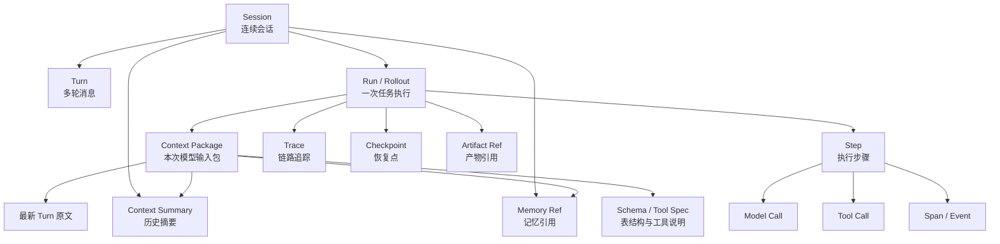
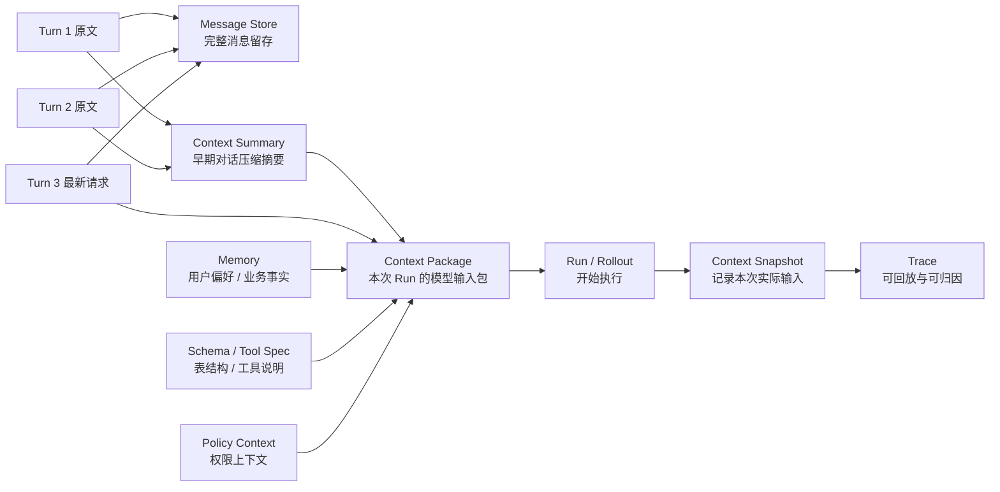

# Ch.38 Agent可观测性与运行诊断

> **本章目标**：读者学完能说清一次 Agent 运行会沉淀哪些数据，能区分会话、运行、Trace、Memory、Checkpoint、Artifact、日志与指标的边界，并能基于这些观测数据还原执行过程、定位失败原因、推动 AgentOps 质量闭环。
> **关键议题**：Agent 运行数据地图；Agent 运行时观测模型；Trace 数据结构与生命周期；全链路日志、指标与链路追踪；会话回放与执行过程还原；失败归因与根因分析；AgentOps 质量闭环实践
> **前置阅读**：[Ch.01 Agent 的本质](../part01-overview/ch01-agent.md)、[Ch.22 Agent Runtime](../part05-agent-capabilities/ch22-agent-runtime.md)、[Ch.23 Tool Registry & Function Calling](../part05-agent-capabilities/ch23-tool-registry-function-calling.md)、[Ch.30 Human-in-the-loop 与长任务](../part05-agent-capabilities/ch30-human-in-the-loop.md)
> **估计阅读**：L1 15 min / L1+L2 45 min / 全章 90 min
> **mini-platform 关联**：`core/observability/`、`core/runtime/`、`core/registry/`
> **实战项目**：`projects/08-trace-replay/`
> **按角色推荐阅读**：平台负责人 ⇒ 1、6、7 ｜ 架构师 ⇒ 全章 ｜ 工程师 ⇒ 全章 + 实战项目

---

## 1. Agent 运行会留下什么

在 Ch.01 中，Agent（智能体）被定义为“以 LLM（Large Language Model，大语言模型）为决策内核、能够调用工具完成多步任务的程序实体”。到了生产环境，问题会变成：一次 Agent 跑完之后，平台到底应该把什么存下来？

先看一个多轮对话：


| 轮次    | 用户看到的对话               | 后台实际发生的事                             |
| ----- | --------------------- | ------------------------------------ |
| 第 1 轮 | “帮我看一下本月经营性现金流为什么下降。” | Agent 生成 SQL、执行查询、分析原因、生成图表。         |
| 第 2 轮 | “把华东区单独拆出来。”          | Agent 需要理解“华东区”是在上一轮现金流分析的基础上追加过滤条件。 |
| 第 3 轮 | “生成一份给 CFO 的简报。”      | Agent 需要复用前两轮结论、图表和数据口径，生成报告产物。      |


从这个例子出发，运行数据可以先分成四类：


| 类别     | 先回答的问题                 | 主要对象                                                    |
| ------ | ---------------------- | ------------------------------------------------------- |
| 会话层    | 用户聊了什么？前端要展示什么？        | Session（会话）、Turn（对话轮次）                                  |
| 执行层    | 这次任务具体怎么跑的？哪一步失败？      | Run（运行）、Rollout（展开轨迹）、Step（执行步骤）、Trace（链路追踪）            |
| 上下文层   | 下一轮对话如何接上上一轮？哪些内容进入模型？ | Context Package（上下文包）、Context Summary（上下文摘要）、Memory（记忆） |
| 产物与运营层 | 生成了什么？能否恢复？成本和稳定性如何？   | Artifact（产物）、Checkpoint（检查点）、Metric（指标）                 |


这里先定几个口径：**Session** 是一段连续用户会话；**Turn** 是会话中的一轮用户输入或 Agent 回复；**Run** 是 Agent 为完成某个任务启动的一次执行；**Rollout** 强调这次 Run 从开始到结束展开出来的完整轨迹；**Trace** 是把轨迹中的 Step、Span（有开始和结束的操作）和 Event（瞬时事件）串起来的链路追踪结构。

### 1.1 对象之间是什么关系

先看包含关系。这个图只表达“谁包含谁、谁引用谁”，不表达执行先后。




读这张图只需要抓住三句话。

第一，Session 管会话连续性，Run / Rollout 管一次任务执行。第二，Context Package 是下一次模型调用真正使用的输入包，它会从 Turn、Summary、Memory、Schema 中挑内容。第三，Trace、Checkpoint、Artifact 不是同一类东西：Trace 用来复盘，Checkpoint 用来恢复，Artifact 用来交付和审计。

### 1.2 用户看到的，不等于后台真实轨迹

Codex、Claude Code 这类开发者 Agent 前端，通常只显示“正在理解需求、正在读取文件、正在修改代码、正在运行测试”。这是给用户看的体验层。后台真实轨迹会细得多：一次“查看文件”可能包含搜索、读取多个文件片段、过滤上下文、记录 token、写入 trace 等多个 Step。

下面用一个最小例子表示这种“前端投影”和“后台轨迹”的差异。

字段读法：


| 字段                 | 怎么理解                                  |
| ------------------ | ------------------------------------- |
| `visible_timeline` | 用户看到的简化时间线，适合表达进度，不适合排障。              |
| `visible_as`       | 后台 Step 映射到哪个前端卡片。多个 Step 可以映射到同一个卡片。 |
| `args_summary`     | 工具参数摘要。够排障即可，不要把敏感参数全量展示给前端。          |
| `output_ref`       | 工具原始输出引用。需要权限才能查看。                    |


```json
{
  "run_id": "run_dev_042",
  "trace_id": "trc_dev_042",
  "visible_timeline": ["理解需求", "查看文件", "修改文件", "检查格式", "完成"],
  "steps": [
    {
      "step_id": "step_001",
      "type": "model_call",
      "visible_as": "理解需求",
      "output_summary": "决定先读取 ch38-trace.md"
    },
    {
      "step_id": "step_002",
      "type": "tool_call",
      "name": "shell.sed",
      "visible_as": "查看文件",
      "args_summary": {"path": "docs/part07-observability-eval/ch38-trace.md"},
      "output_ref": "obj_read_ch38_001"
    },
    {
      "step_id": "step_003",
      "type": "tool_call",
      "name": "apply_patch",
      "visible_as": "修改文件",
      "artifact_refs": ["art_diff_ch38_001"]
    }
  ]
}
```

设计原则很简单：**前端少而稳，后台细而全**。前端不应该暴露每个内部事件；后台必须保留足够细的 Step、参数摘要、输出引用和错误类型，方便后续回放和排障。

还要注意：真实执行轨迹不等于保存模型的全部隐式推理。企业平台应该保存可审计的决策摘要、工具调用、输入输出摘要和产物引用，而不是把不适合展示或不应持久化的模型内部推理原文当作日志长期保存。

### 1.3 多轮对话怎么打包进下一次 Run

如果 Session 有几十轮对话，下一次 Run 不会把整个 Session 原封不动塞给模型。Runtime 通常会组装一个 Context Package：最新用户请求保留原文，最近几轮尽量保留原文，更早内容压缩成 Context Summary，大对象只保留引用，再补充必要的 Memory、Schema 和工具说明。

下面的流程图展示多轮对话如何被打包进下一次 Run：




这里要区分三件事：


| 对象                 | 存储内容                    | 是否进入下一次模型上下文 | 作用              |
| ------------------ | ----------------------- | ------------ | --------------- |
| 原始 Turn            | 用户消息、Agent 回复、附件引用、产物引用 | 不一定全部进入      | 完整审计、前端回看、会话恢复  |
| Context Snapshot   | 某次 Run 真正送入模型的上下文快照     | 是            | 复盘当时模型看到了什么     |
| Context Summary    | 对早期多轮对话压缩后的摘要           | 通常会进入        | 节省 token，保留关键事实 |
| Omitted References | 被压缩或省略内容的引用列表           | 否，只保留引用      | 需要回放或审计时追溯原文    |


换句话说，**压缩上下文不应该覆盖原始会话**。原始 Turn 仍然保留在 Session Store 或消息存储里；压缩摘要是派生数据，要记录它由哪些原始 Turn 生成、由哪个模型或规则生成、什么时候生成、适用于哪次 Run。

更具体地说，一次新的 Run 启动前，Context Package 通常遵循下面的打包策略：

1. **最新用户请求必须保留原文**：这是当前任务目标，不能只靠摘要。
2. **最近若干轮对话优先保留原文**：它们往往包含指代、省略和刚刚确认过的约束。
3. **更早历史压缩成 Context Summary**：摘要要标明来源 Turn，不能覆盖原始消息。
4. **大对象只放引用**：图表、SQL 结果、文件正文不直接塞进上下文，除非本次任务确实需要。
5. **Memory 和权限上下文单独注入**：不要把长期记忆混进会话摘要，否则难以删除、审计和纠错。

下面给一个最小的 Context Package 示例。它表达的是：下一次模型调用到底看到了什么，哪些只是保留引用。

字段读法：


| 字段                   | 怎么理解                              |
| -------------------- | --------------------------------- |
| `context_package_id` | 本次 Run 的上下文包 ID。回放时用它确认模型当时看到了什么。 |
| `source_turn_ids`    | 摘要来自哪些原始 Turn。摘要错了，可以追溯来源。        |
| `included`           | 是否进入本次模型上下文。                      |
| `include_mode`       | 进入方式：原文、摘要、还是只保留引用。               |
| `token_estimate`     | 本次上下文包的 token 估算，用于压缩策略和成本治理。     |


```json
{
  "context_package_id": "ctxpkg_run_20260418_002",
  "run_id": "run_20260418_002",
  "session_id": "ses_cashflow_009",
  "assembly_strategy": "keep_latest_turns_summarize_older_turns",
  "items": [
    {
      "order": 1,
      "type": "system_prompt",
      "ref": "prompt_dataagent_system:v5",
      "included": true
    },
    {
      "order": 2,
      "type": "context_summary",
      "ref": "ctxsum_001",
      "included": true,
      "include_mode": "summary",
      "source_turn_ids": ["turn_001", "turn_002"]
    },
    {
      "order": 3,
      "type": "turn",
      "ref": "turn_003",
      "included": true,
      "include_mode": "raw_text",
      "reason": "latest_user_request"
    },
    {
      "order": 4,
      "type": "memory",
      "ref": "mem_user_pref_1024_monthly_view",
      "included": true,
      "reason": "user_preference"
    },
    {
      "order": 5,
      "type": "schema",
      "ref": "schema_finance_cashflow:v12",
      "included": true,
      "reason": "selected_by_schema_linking"
    },
    {
      "order": 6,
      "type": "artifact",
      "ref": "art_cashflow_chart_001",
      "included": false,
      "include_mode": "reference_only",
      "reason": "large_object"
    }
  ],
  "token_estimate": {
    "system_prompt": 1300,
    "context_summary": 420,
    "latest_turns": 180,
    "memory": 90,
    "schema": 8800,
    "total": 10790
  }
}
```

这个结构的关键字段是 `included` 和 `include_mode`。它们告诉回放系统：哪些内容真的进入了模型上下文，哪些只是保留引用。排查多轮对话错误时，这个差别非常重要。比如用户说“刚才那张图按华东区重画一下”，如果上一轮图表只在 Artifact Store 里有引用，而 Context Package 没有包含图表生成参数，模型就可能不知道“刚才那张图”具体指什么。

这个设计解决三个问题。第一，回放时能回答“模型当时到底看到了什么”。第二，审计时能追溯“摘要来自哪些原始 Turn”。第三，成本治理时能知道 token 是花在哪里的：系统提示词、Schema、Memory，还是历史摘要。

上下文压缩失败也是一种真实失败模式。比如摘要漏掉了“只看华东区”这个约束，后续 SQL 就可能查全公司数据。Trace 里应该把 `context_summary_id`、`source_turn_ids` 和 `compression_strategy` 记录下来，否则很难定位这种“不是工具错、不是模型错，而是压缩上下文错”的问题。

### 1.4 一次 Run 的最小可观测记录

当任务真的开始执行后，Run 需要记录最小可观测轨迹：它属于哪个 Session，使用了哪个 Context Package，执行了哪些 Step，失败时停在哪一步。

字段读法：


| 字段                   | 怎么理解                          |
| -------------------- | ----------------------------- |
| `run_id`             | 一次任务执行的主键。                    |
| `context_package_id` | 本次 Run 使用的上下文包。               |
| `trace_id`           | 串联 Step、Span、Event、日志和指标的关联键。 |
| `steps`              | 按执行顺序记录关键动作。                  |
| `failure`            | 失败归因对象。成功时为 `null`。           |


```json
{
  "run_id": "run_20260418_002",
  "session_id": "ses_cashflow_009",
  "context_package_id": "ctxpkg_run_20260418_002",
  "trace_id": "trc_20260418_002",
  "status": "succeeded",
  "steps": [
    {
      "step_id": "step_001",
      "type": "model_call",
      "name": "planner.generate_sql",
      "span_id": "spn_001",
      "status": "succeeded",
      "output_summary": "生成华东区现金流归因 SQL"
    },
    {
      "step_id": "step_002",
      "type": "tool_call",
      "name": "sql_executor.query",
      "span_id": "spn_002",
      "status": "succeeded",
      "result_ref": "obj_sql_result_20260418_002"
    },
    {
      "step_id": "step_003",
      "type": "artifact_write",
      "name": "chart.create_waterfall",
      "span_id": "spn_003",
      "status": "succeeded",
      "artifact_refs": ["art_cashflow_east_waterfall_001"]
    }
  ],
  "metrics": {
    "latency_ms": 145321,
    "model_calls": 1,
    "tool_calls": 1,
    "total_tokens": 2154
  },
  "failure": null
}
```

如果失败，不要只写 `failed`。至少要记录失败步骤、错误类型、责任域和下一步动作：

```json
{
  "run_id": "run_20260418_004",
  "trace_id": "trc_20260418_004",
  "status": "failed",
  "failed_step_id": "step_002",
  "failure": {
    "error_type": "TOOL_TIMEOUT",
    "error_owner": "downstream_system",
    "retryable": true,
    "next_action": "retry_with_async_job"
  }
}
```

Trace 是这份 Run 记录的骨架。它把 Step 进一步拆成 Span 和 Event，便于还原时间线。

```text
trace: run_20260418_001
  span: planner.generate_sql
    event: selected_tables = ["cashflow_fact", "org_dim"]
  span: tool.sql_executor
    event: query_started
    event: query_succeeded
  span: planner.analyze_result
  span: artifact.create_report
```

Trace 不等于日志。日志可以是零散文本，而 Trace 必须能回答“上一件事和下一件事是什么关系”。这正是回放和根因分析所需要的结构。

### 1.5 Memory、Checkpoint 与 Artifact 怎么分工

Memory（记忆）、Checkpoint（检查点）和 Artifact（产物）都可能很大，但它们服务的目标不同。

Memory 是后续决策会读取的内容。例如用户偏好“财务分析默认按月展示”、企业内部指标口径“经营性现金流不含融资性现金流”、上一轮分析总结“下降主要来自应收账款回款延迟”。Memory 要考虑更新、检索、遗忘、权限和跨会话复用。

Checkpoint 是为了恢复任务。长任务执行到第 5 步时，如果模型服务超时或进程重启，Runtime 需要知道已经完成哪些工具调用、哪些副作用已经发生、下一步应该从哪里继续。Checkpoint 通常不追求长期语义价值，而追求恢复时的完整性和一致性。

Artifact 是业务产物。例如生成的 SQL 文件、图表 PNG、Excel、Markdown 报告、PPT 草稿。Trace 中通常只保存 Artifact 的标识、摘要、版本和存储位置，不直接塞入大文件正文。这样既能控制 Trace 体积，也能让 Artifact 走独立的权限、生命周期和归档策略。

### 1.6 日志、指标与 Trace 的区别

日志、指标和 Trace 是三类互补信号。

Log（日志）回答“具体发生了什么”。例如工具返回了什么错误，某个参数校验为什么失败。日志适合保留细节，但如果只有日志，很难看清一次多步任务的整体结构。

Metric（指标）回答“整体状态是否健康”。例如 P95 延迟、任务成功率、工具错误率、token 成本。指标适合告警和趋势分析，但它会丢失单次任务的上下文。

Trace 回答“一次任务是如何一步步走到这里的”。它连接日志和指标：当任务成功率下降时，指标告诉我们“出问题了”；Trace 帮我们找到“问题集中在哪些步骤”；日志提供“这个步骤里具体发生了什么”。

## 2. Agent 运行时观测模型

有了运行数据地图之后，下一步是建立观测模型。观测模型要回答三件事：观测谁，观测什么，观测到什么粒度。对于 Agent 平台来说，观测对象不只是 HTTP 请求，而是用户、租户、Session、Run、Step、模型、工具、Memory、Checkpoint 和 Artifact 共同组成的运行系统。

Agent 与传统 Web 服务的差异在于：一次用户请求可能包含多轮推理、多次工具调用、人工确认、异步恢复和最终产物。Planner（规划器，负责根据当前上下文决定下一步动作的组件）一次选择错误工具，可能导致后续 SQL、图表和报告全部偏离；工具一次返回超时，也可能让整个 Run 进入重试或降级路径。因此，观测模型必须能把用户输入、Planner 决策、工具执行、模型调用、权限拦截和结果生成串成一张事件地图。

可以把 Agent 运行时观测模型拆成四层：


| 层级  | 观测对象            | 典型问题           | 典型数据                             |
| --- | --------------- | -------------- | -------------------------------- |
| 会话层 | Session、用户、租户   | 谁在使用？体验是否连续？   | 会话轮次、用户反馈、上下文引用                  |
| 任务层 | Run、Rollout、状态机 | 任务是否完成？停在哪一步？  | 状态、步骤数、耗时、最终结果                   |
| 执行层 | Step、模型调用、工具调用  | 哪个动作失败或变慢？     | 参数摘要、返回摘要、错误类型、重试次数              |
| 运营层 | Metric、成本、质量标签  | 平台是否健康？质量是否退化？ | 成功率、P95 延迟、token 成本、Judge（评审器）分数 |


这四层之间要能互相跳转：从一个失败告警能下钻到具体 Run；从一个 Run 能展开到所有 Step；从一个 Step 能看到模型输入输出摘要、工具参数、权限上下文和日志；从一批失败 Run 能回流到 Ch.39 的离线评测集。

这里的关键不是“存得越多越好”，而是“每一类数据都有明确用途”。企业 Agent 平台尤其要警惕两种极端：一种是什么都不存，出了问题只能猜；另一种是把所有 Prompt（提示词）、工具返回和文件内容原样落库，导致隐私、合规和成本问题。

## 3. Trace 数据结构与生命周期

Trace 的价值来自结构化。它不只是把日志集中存起来，而是用统一字段描述“一次 Run 中每个动作的身份、父子关系、时间线、状态和诊断信息”。这些字段要稳定，否则后面的回放、评测、成本核算和审计都会失去共同语言。

一条生产可用的 Trace 至少要包含三类信息：


| 信息类型   | 示例字段                                                                          | 说明              |
| ------ | ----------------------------------------------------------------------------- | --------------- |
| 身份与上下文 | `tenant_id`、`user_id`、`agent_id`、`session_id`、`run_id`                        | 用于权限隔离、审计和多租户查询 |
| 结构与时间线 | `trace_id`、`span_id`、`parent_span_id`、`step_id`、`started_at`、`ended_at`       | 用于重建执行树和耗时分析    |
| 结果与诊断  | `status`、`error_type`、`input_summary`、`output_summary`、`artifact_refs`、`cost` | 用于排障、评测、成本核算和回放 |


Trace 的生命周期可以按七步理解：

1. **创建 Trace**：Run 创建时生成全局唯一的 `trace_id`。
2. **打开 Span**：每次模型调用、工具调用、检索、审批或产物生成，都创建对应 Span。
3. **记录 Event**：状态切换、缓存命中、权限拦截、重试、人工确认等瞬时事实写成 Event。
4. **绑定摘要**：保存输入输出摘要、参数摘要和引用，不默认保存所有原文。
5. **关闭 Span**：写入耗时、状态、错误类型和成本。
6. **脱敏与落库**：对敏感字段脱敏，按租户和权限写入观测存储。
7. **索引与复用**：支持查询、回放、告警、评测样本沉淀和事故复盘。

在这一套生命周期里，Trace 既是在线排障工具，也是离线质量资产。Ch.39 的 benchmark 可以来自失败 Trace，Ch.40 的在线评测可以引用 Trace 上下文，Ch.41 的成本治理也依赖 Trace 里的 token 与模型调用记录。

## 4. 全链路日志、指标与链路追踪

全链路观测不是把日志、指标和 Trace 分别接入三个系统就结束了。真正重要的是三类信号可以相互跳转：从指标告警跳到具体 Trace，从 Trace 中的某个 Step 跳到结构化日志，从日志里的错误再回到所属 Run 和用户会话。

OpenTelemetry（简称 OTel，是一套开放的观测数据标准，用于统一采集 Trace、Metric 和 Log）可以作为底层语义参考，但 Agent 平台通常需要扩展 GenAI（Generative AI，生成式人工智能）字段，例如模型名、Prompt 版本、Token 用量、工具名、检索文档、Judge 分数等。

三类数据需要通过统一关联键打通：


| 关联键           | 连接对象                      | 用途        |
| ------------- | ------------------------- | --------- |
| `trace_id`    | 一次 Run 的所有 span、event、log | 回放和根因分析   |
| `session_id`  | 多个 Run 和用户会话              | 多轮体验分析    |
| `step_id`     | 单个模型调用或工具调用               | 精确定位错误    |
| `artifact_id` | Trace 与产物存储               | 审计和复查     |
| `tenant_id`   | 租户内所有运行数据                 | 权限隔离和成本归集 |


没有这些关联键，日志、指标和 Trace 就会变成三座孤岛：告警知道成功率下降，日志里有错误文本，但工程师仍然不知道是哪类任务、哪个工具、哪个模型版本导致了退化。

## 5. 会话回放与执行过程还原

Replay（回放）是把一次 Run 按时间线重新展示出来的能力。它不是重新调用模型，也不是让 Agent 再跑一遍，而是用当时保存下来的 Trace、日志摘要、工具结果和 Artifact 引用，还原“当时发生了什么”。

Agent 需要回放，而不只是查日志，是因为多步任务的错误经常藏在中间过程里。最终答案看起来像“分析错了”，但真正原因可能是检索上下文过期、工具参数少了一个过滤条件、人工审批拒绝后没有正确降级，或者 Memory 读取了不该读取的历史偏好。

一个合格的回放页面至少应展示：

- 用户原始问题和多轮上下文。
- Prompt 版本、模型版本和关键参数。
- Planner（规划器，负责决定下一步动作的组件）为什么选择某个工具。
- 工具调用参数、权限上下文、返回摘要和错误信息。
- Memory 读取了哪些内容，是否写入了新的记忆。
- Checkpoint 记录的任务状态和恢复点。
- Artifact 的生成过程、版本和下载地址。
- 最终答案以及用户反馈。

这里要避免两个误区。第一，回放不是为了保存所有敏感原文，企业场景必须做脱敏和权限控制。第二，回放也不是为了逐 token 复刻模型输出；LLM 存在随机性，真正重要的是还原当时的输入、证据、工具结果和决策路径。

## 6. 失败归因与根因分析

根因分析的核心是把“失败”拆到可行动的层级。

在 Agent 系统里，失败可能来自用户意图不清、Prompt 约束不足、模型能力不足、工具选择错误、工具参数错误、下游系统失败、权限策略拦截、数据质量问题、上下文过长或任务循环不收敛。不同根因对应不同修复手段。如果分类不清，团队很容易把所有事故都推给“模型不稳定”，最后既修不好系统，也沉淀不出评测样本。


| 失败类别                                               | 典型观测信号                        | 可能修复方向                 |
| -------------------------------------------------- | ----------------------------- | ---------------------- |
| 意图理解失败                                             | 用户多次改写问题、Planner 选择方向明显偏离     | 补充澄清问题、优化系统提示词、增加意图分类  |
| Schema Linking（模式链接，指把用户问题中的业务概念匹配到数据库表、字段和指标口径）失败 | 选错表、选错字段、指标口径不匹配              | 改进语义层、增加字段描述、补充样例 SQL  |
| 工具选择失败                                             | 调用了不适合的工具或漏掉关键工具              | 优化工具描述、工具分组、Planner 约束 |
| 工具参数失败                                             | schema 校验失败、SQL 执行报错、API 参数缺失 | 增加参数校验回灌、工具示例、自动修复逻辑   |
| 下游系统失败                                             | 工具超时、数据库 5xx、网关熔断             | 重试、熔断、降级、异步任务化         |
| 权限策略失败                                             | Policy（策略引擎）拒绝、字段脱敏、租户越界      | 补充权限提示、转人工审批、优化策略说明    |
| 质量退化                                               | Judge 分数下降、用户点踩上升、回归集失败       | 回滚模型或 Prompt，补充评测样本    |
| 成本失控                                               | token 激增、重复调用、循环不收敛           | 设置步数上限、缓存、模型路由、预算告警    |


企业平台要避免一句“模型幻觉”盖住所有问题。很多看似模型问题，根因其实是工具描述模糊、语义层缺字段、权限反馈不清楚或下游服务超时。Trace 的价值就在于把责任边界拆清楚。

## 7. AgentOps 质量闭环实践

AgentOps（Agent Operations，围绕 Agent 运行质量的持续运营机制）可以按以下闭环落地：

1. **采集**：每次 Run 生成 Trace、日志、指标、成本和用户反馈。
2. **聚类**：按失败类型、任务类型、工具、模型版本、租户和场景聚合问题。
3. **沉淀**：把高价值失败样本加入 Ch.39 的离线评测集。
4. **修复**：调整 Prompt、工具描述、语义层、模型路由、权限策略或下游系统。
5. **回归**：用固定 benchmark（基准评测集）验证修复没有引入新退化。
6. **灰度**：小流量上线，接入 Ch.40 的在线评测和用户反馈。
7. **运营**：持续观察 Ch.41 的成本和 Ch.42 的 SLO。

这套闭环让可观测性从“出事故时查问题”变成“持续提升 Agent 质量”的基础设施。

---

## 本章小结

### 关键结论

1. Agent 可观测性要记录的是一次任务的完整决策链，而不是单次 API 请求。
2. Session、Run、Rollout、Trace、Memory、Checkpoint 和 Artifact 服务的目标不同，不能混成一张大日志表。
3. Trace 是会话回放、失败归因、评测样本沉淀和审计追溯的共同数据底座。
4. 日志、指标和 Trace 必须通过统一关联键打通，否则无法定位多步任务中的真实根因。
5. 会话回放的目标是还原决策证据链，不是追求模型输出的逐 token 复刻。
6. AgentOps 的核心是把线上失败变成可评测、可修复、可回归的工程资产。

### 上线检查清单

- 每次 Agent 运行是否有唯一 `trace_id` 并贯穿模型、工具、权限和产物？
- 是否区分了 Session、Run、Memory、Checkpoint、Artifact 的存储边界和生命周期？
- 失败是否能归因到模型、提示词、工具、数据、权限或基础设施中的具体一类？
- 线上失败样本是否能沉淀到 Ch.39/Ch.40 的评测与优化流程？

### 延伸阅读

- 相关章节：[Ch.22 Agent Runtime](../part05-agent-capabilities/ch22-agent-runtime.md)、[Ch.30 HITL 与长任务](../part05-agent-capabilities/ch30-human-in-the-loop.md)、[Ch.39 企业级DataAgent评测体系设计与Benchmark构建](ch39.md)、[Ch.42 SLO管理、限流与系统韧性](ch42-slo.md)
- 标准与工具：OpenTelemetry、OpenLLMetry、Langfuse、Phoenix、Helicone

