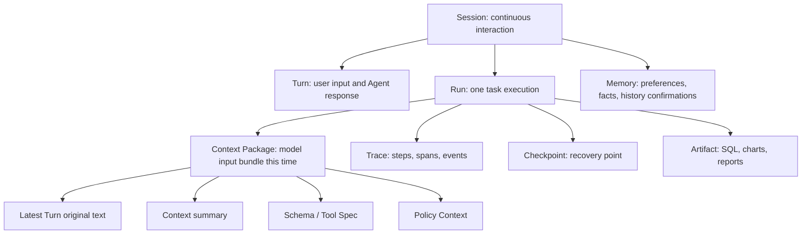
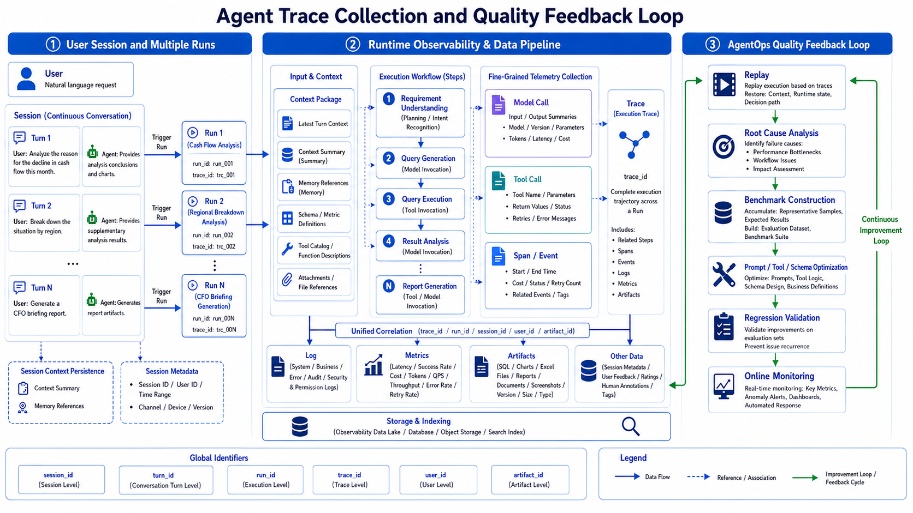

# Chapter 38 Agent Observability and Operational Diagnostics

---
## Chapter Summary

This chapter discusses the observability and runtime diagnostics of Agent platforms. Failures of an Agent often do not appear in the final answer but are hidden within context packaging, Planner decisions, tool parameters, permission policies, downstream systems, or some step in artifact generation. The platform must connect the evidence chain of a single Run using traces, spans, events, logs, metrics, and artifact references. This chapter clarifies the boundaries of Session, Run, Context Package, Trace, Checkpoint, and Artifact, explains how to collect runtime traces and diagnose failures, and describes how online tracing feeds into the continuous improvement loop of AgentOps.
## Key Terms

Observability, Trace, Span, Context Package, Checkpoint, Artifact, AgentOps
## Learning Objectives

- Distinguish the responsibility boundaries of Session, Turn, Run, Trace, Checkpoint, and Artifact.
- Explain which observable evidence should be recorded at a minimum during an Agent Run.
- Use Trace to pinpoint whether a failure occurred in context, planning, tools, data, permissions, or downstream systems.
- Integrate online failure samples into evaluation, regression, and staged release processes.

---
## Opening Scenario

An Agent being able to provide an answer does not mean it is ready for production use. The team also needs to know why it responded that way, what context it saw at the time, which tools it invoked, what SQL criteria were used, which artifact the charts in the report came from, and at which step it failed if any. Without this evidence, troubleshooting is guesswork.

Take DataAgent as an example. The user first asks, "Why did the operating cash flow decline this month?" The system generates SQL, executes the query, analyzes the reasons, and produces charts. Then the user asks, "Break out the East China region separately." The system must remember the previous round’s metrics, time frame, and analysis intent. Finally, the user requests, "Generate a briefing for the CFO." The system must reuse conclusions, charts, and criteria from the previous two rounds. The frontend only shows three dialogue rounds, but the backend involves multiple Runs, multiple Tool Calls, context summaries, Memory, chart artifacts, and report approvals.

The goal of observability is not to store every raw text string, but to save a sufficient evidence chain: when results are wrong, costs spike, approvals reject, or users complain, the platform can answer “which step went wrong, why it happened, and how to avoid it next time.”

---
## 38.1 Boundaries of Runtime Objects

Agent runtime generates many types of objects. The most easily confused are Session and Run. A Session represents a continuous interaction with the user, which can include multiple Turns and trigger multiple Runs. A Run is a single specific task execution, such as one cash flow analysis, one SQL query, or one report generation. Trace describes the detailed steps within a Run; Checkpoint enables interrupt and resume; Artifact references outputs like charts, SQL queries, reports, Excel files, etc.

*Table 38-1: Responsibilities and boundaries of runtime objects. Source: compiled by this book.*

| Object | Main Responsibility | Common Misuse |
|---|---|---|
| Session / Turn | Preserve user experience and multi-turn conversation | Use as a substitute for the execution trace |
| Run | Represents one executable task | Pack multiple multi-turn sessions into one Run |
| Context Package | Records what the model actually saw at the time | Only saves full chat history without actual input content |
| Trace | Restores timeline of Steps, Spans, Events | Treated as ordinary log text |
| Checkpoint | Supports recovery after interruptions | Treated as long-term memory |
| Artifact | Stores business outputs and evidence references | Embed large file contents directly into Trace |

These object boundaries should be separated in the storage model. Session serves frontend review and user experience; Run serves execution and state management; Trace serves playback and diagnostics; Checkpoint serves recovery; Artifact serves delivery, download, and audit. Mixing them into one "big log table" may simplify early implementations but will incur costs later on permissions, lifecycle management, and troubleshooting.

The Context Package is especially critical. The model does not “see the entire session” but sees a context package assembled by the Runtime at that moment. It may include the latest user utterance, recent turns, early summaries, Memory, Schema, Tool Specs, and policy context. When diagnosing multi-turn errors, you must inspect the Context Package, not just the full Session.

These objects also correspond to different lifecycles. Sessions might be retained for a period based on user experience and compliance; Traces may enter observability systems and be retained according to debugging and auditing policies; Checkpoints only remain valid within the task recovery window; Artifacts may be archived long-term or expire quickly due to sensitive data. Without distinct lifecycles, cleanup, export, and permission handling become chaotic.

Multi-tenant platforms must also bind tenants and permissions per object type. An operations staff member may view Trace structure and error types but not raw tool outputs; a business user may see their own report artifacts but not model input summaries; an auditor may view desensitized evidence chains according to process. Observability is not “everyone can see all logs,” but enabling the right people to see sufficient evidence under the right permissions.

---
## 38.2 What Should a Single Run Record

A diagnosable run should at minimum record identity, context, steps, model calls, tool calls, state transitions, artifacts, and costs. The recording granularity doesn’t need to be infinitely fine but must be sufficient to answer questions such as: Where did the task come from? What did the model see? Which tools were chosen? What parameters did the tools receive? What did downstream returns contain? Where did the final artifact originate?

*Figure 38-1: Diagram of Agent run trace collection. Source: drawn by the author. Alt text: During a run, probes are embedded along the execution flow at points such as creation, planning, tool calls, and state transitions. Data are imported into the trace backend, with arrows indicating that observation data are uniformly collected from all execution stages.*

*Table 38-2: Run Collection Points and Minimum Evidence. Source: compiled by the author.*

| Collection Point  | Minimum Evidence                                    | Purpose                          |
|-------------------|----------------------------------------------------|---------------------------------|
| Run start         | `run_id`, `session_id`, task type, trigger turn    | Know where this task originated |
| Context assembly  | source, summary version, whether input to model, token estimate | Determine what the model saw at that moment |
| Model call        | model, prompt version, input/output summary, tokens, latency | Analyze model quality and cost  |
| Tool call         | tool name, parameter summary, permission context, return summary, errors | Locate issues with tools and parameters |
| State event       | state transitions, retries, human waits, failure reasons | Reconstruct runtime behavior    |
| Artifact write    | artifact ID, type, hash, permissions, storage location | Support reporting and auditing  |

A guiding principle for collection is: by default save summaries, hashes, versions, and references, and access original content only with permission. Prompts, tool returns, database results, and file contents may contain sensitive information. Trace should not become a second copy of sensitive data. If original content is needed, it should be fetched on demand via object storage, log systems, or business systems according to permissions.

A failed run should not be recorded simply as `failed`. It must at least log the failed step, error type, responsibility domain, retry possibility, and recommended action. For example, an SQL timeout is a downstream or query cost issue; a Policy denial indicates a permissions boundary; a missing constraint in Context Summary signals a context packaging problem. Such classifications determine the repair direction.

Collection should also control field stability. `run_id`, `trace_id`, `span_id`, `step_id`, `artifact_id`, and `tenant_id` are cross-system correlation keys and should not be frequently renamed. Logs, metrics, Traces, and Report EvidenceRefs all rely on these keys for navigation. Consistent field naming is more important than overly detailed one-off records.

OpenTelemetry can serve as a general skeleton for tracing. The agent platform can map model calls, tool calls, retrievals, SQL executions, and report generation as Spans, while state changes, retries, approvals, and errors map to Events. For model inputs/outputs, tool results, and artifacts, it’s recommended to only save summaries, hashes, and references, avoiding turning the OpenTelemetry backend into a large object store.

Collection points should not be limited to successful paths. Retries, refusals, human takeovers, Policy denials, context compression, cache hits, demotion to smaller models, switching to async tasks — these events all affect diagnosis. Many online issues are not “tool failures” but system choices to downgrade without recording reasons.
## 38.3 Frontend Timeline and Backend Trace

The timeline presented to users should be simple and stable, for example: "Understanding Requirements," "Querying Data," "Generating Chart," and "Waiting for Approval." The backend trace, however, is more detailed: a single "Querying Data" step may include Schema Linking, SQL Generation, AST Validation, Policy Validation, OLAP Execution, Result Truncation, and Artifact Writing.

The frontend timeline serves the user experience, while the backend trace serves diagnostics. The two cannot substitute for each other. The frontend should not expose every internal event, or users will be overwhelmed by implementation details; the backend also cannot only store frontend cards, or it will be impossible to locate the real failure point when troubleshooting.

A trace is not the raw internal output of the model's reasoning. The platform should store auditable decision summaries, tool calls, input and output summaries, errors, and artifact references, rather than long-term preservation of implicit model reasoning that is unsuitable for display or persistence. This enables review while controlling compliance risks.

The frontend projection must remain consistent. The "Querying Data" card shown to the user should map to a corresponding set of backend steps in the trace; the "Generating Report" card should link to the report artifact and EvidenceRef. The frontend does not need to show internal spans, but every frontend state must have backend support. Otherwise, when users report a "stuck" step, engineers cannot pinpoint the matching trace segment.

The backend trace must also support time analysis. A slowdown in a Run may be caused by model latency, SQL execution, cold start of the Python sandbox, chart rendering, or waiting on manual intervention. The start and end times of spans decompose the time consumption, while metrics dashboards can only tell us the overall slowdown; traces reveal exactly where the bottleneck lies.
## 38.4 How to Replay Multi-Turn Context

Multi-turn conversations are not passed into the next model call verbatim. The runtime retains the latest user request and keeps the full text of the most recent few turns, while compressing earlier history into a Context Summary. Large objects are only referenced by pointers. Memory, Schema, and Policy Context are then injected. When replaying, the Context Package for that particular run must be examined.

A Context Package must at minimum record: the source of each item, whether it entered the model, how it entered, the summary version, reference objects, and estimated token counts. Only then can questions such as “Did the model see the chart parameters from the last turn?” or “Did the summary omit the East China region filter?” or “Did Memory incorrectly inject user preferences?” be answered.

Context compression failures are a common issue for agents. For example, if the summary omits “Only look at East China,” subsequent SQL may query the whole company. Or if the chart artifact only retains the image but not the generation parameters, a later command like “redraw that chart” will fail. The trace must preserve `context_summary_id`, source turn, and compression strategy, otherwise these issues are difficult to diagnose.

Memory must also be separated from Context Summary. The summary comes from the current session’s history; memory may be reused across sessions. Summaries can be regenerated, but memory requires deletion, expiration, and access controls. Mixing the two complicates deletion and auditing.

The replay page is best organized as an evidence chain rather than a reverse chronological log stack. Start by showing the user query and task goal, then display the Context Package, followed by Planner decisions, tool calls, state transitions, artifacts, and the final response. This lets business, engineering, and auditing all view the same chain but with different visible fields.

Replay must also support “the then version.” Prompt versions, model versions, ToolSpec versions, semantic layer versions, Policy versions, and report template versions may all change. Historical runs must be interpreted using the versions active at that time, not with the current configuration. Otherwise replay becomes “what the current system thinks happened” instead of “what actually happened then.”

If a run needs to be re-executed, it should be marked as a new debug execution. Re-running can help verify fixes but should not overwrite the original trace. The original trace is the factual record; the rerun trace is an experimental record. Both should be kept linked to avoid mixing problem review and fix validation.

---
## 38.5 Diagnosis Path

Diagnosis typically begins with metrics. A drop in success rate, an increase in P95 latency, elevated tool error rates, abnormal costs, or more user downgrades all lead engineers to investigate a batch of abnormal runs. Then the trace is drilled down: start with the failed step, then examine the context package, model calls, tool parameters, policy results, downstream logs, and artifacts.

*Table 38-3: Failure Categories and Directions for Fixing. Source: Compiled by this book.*

| Failure Category       | Typical Signals in Trace                     | Direction for Fixing                          |
|-----------------------|---------------------------------------------|----------------------------------------------|
| Context Errors         | Summary missing constraints, Memory injection errors, missing artifact parameters | Adjust context packaging and summary strategies |
| Intent Understanding Failures | Planner selects wrong task type, multi-turn clarifications still off-target | Add clarifications and intent samples          |
| Schema Linking Failures| Wrong table, field, or metric version       | Modify semantic layer, glossary, and linker  |
| Tool Selection Failures| Wrong tool chosen or missing necessary tools | Improve tool descriptions and planner constraints |
| Parameter Failures     | Schema validation errors, SQL errors, missing API parameters | Add parameter validation and error feedback   |
| Downstream Failures    | Timeout, 5xx errors, circuit breaking, resource shortage | Retry, degrade, or async processing            |
| Permission Failures    | Policy denial, field desensitization, tenant boundary crossing | Change permission prompts or approval paths    |
| Cost Out of Control    | Token explosion, retry loops, broad queries | Increase budget, add caching and step limits   |

When diagnosing, avoid letting a single phrase like “model hallucination” obscure all issues. Many results that look like model nonsense actually stem from missing semantic layer fields, unclear tool descriptions, missing constraints in context summaries, or ambiguous permission feedback. The value of a trace is to break down responsibility boundaries.

Playback is not rerunning the model. LLM output is stochastic—playback aims to reconstruct the evidence chain at that time: input, Prompt version, tool outputs, state transitions, artifacts, and final answer. If needed, specific tool calls can be replayed, but that counts as debugging rather than pure playback.

Root cause analysis requires clear ownership. Context packaging problems belong to Runtime or Memory policy, semantic layer problems to the data platform, tool parameter issues to Tool and Planner, permission denials to Policy, and model quality issues to Prompt, model routing, or evaluation sets. A trace doesn’t just describe errors; it helps teams know who should fix them.

Diagnosis results should be documented. After a post-incident review, failure runs should be marked as samples, recording failure categories, fix actions, and regression status. When the same problem recurs, the team should not start guessing from logs again but be able to search historical similar traces and fix records.

For user-facing faults, diagnostic info should be converted to understandable feedback. An internal error might be `SCHEMA_LINKING_AMBIGUOUS`, but the user sees “Sales volume has multiple definitions; please choose between operational GMV or financial GMV.” Observability systems record technical details, product interfaces provide actionable guidance, and both must share error codes.

---
## 38.6 AgentOps Closed Loop

Observability is not valuable enough if it is used only for incident investigation. The Agent platform needs to turn online traces into quality improvement assets. Failed runs, timed-out runs, high-cost runs, user downvotes, manual interventions, and approval rejections should all enter the sample pool, be cleaned, and then feed into the offline evaluation of Chapter 39 and the online evaluation of Chapter 40.

AgentOps can operate along a simple chain: collect run traces, filter high-value samples, cluster by failure category, accumulate benchmarks, fix prompts, tools, semantic layers, or policies, run regression tests, perform staged rollouts, and continue monitoring online metrics. This closed loop transforms traces from mere “logs” into “engineering assets.”

For example, if user downvotes increase for a batch of cash flow analysis tasks, metrics first detect quality degradation; traces reveal that multiple failed samples selected the wrong cash flow scope at the schema linking stage; the team adds these samples to offline evaluation, enriches field descriptions and sample SQL; after passing regression, the fix is staged online; then success rate, judge scores, user feedback, and token costs for similar tasks are continuously monitored. The entire process relies on traceable run evidence.

Sample governance should avoid collecting only failures. Successfully completed runs with abnormal costs, runs where users manually made large report edits, and runs that were rejected by HITL but then fixed successfully are also valuable. They expose hidden quality issues: answers may be correct but too slow, reports usable but requiring heavy manual edits, advice directionally right but with insufficient evidence. AgentOps needs these intermediate states, not only success and failure.

Evaluation samples must also be desensitized and minimized. Online traces cannot be directly used as benchmarks, especially when containing client data, PII, or business-sensitive fields. Sample retention should preserve task structure, error categories, essential input summaries, tool result summaries, and expected behavior; whenever synthetic data can substitute, real details should be removed.

AgentOps ultimately returns to release governance. Any change to the model, prompts, tool descriptions, semantic layers, or policies should be traceable to which samples were fixed, which scenarios regressed, and which metrics remained stable during staged rollouts. Without this chain, teams can only guess if a change is safe.

Before samples enter the evaluation set, they must undergo “evidence minimization.” Traces often contain user original texts, business fields, tool parameters, and downstream response summaries—the platform cannot keep all fields long-term. Samples can be split into three layers: the first layer is publicly reusable task structure and expected behavior, the second layer is internally visible, desensitized tool results, and the third layer is raw evidence accessible only via approval. The evaluation set by default retains only the first two layers, while the third layer can be back-referenced via EvidenceRef. This enables reproducibility without uncontrolled copying of production logs to the evaluation system.

Sampling strategy must also be explicitly documented. Storing all traces is costly and risky; storing only failed samples leaves teams blind to normal paths. A prudent approach is: low-rate sampling of successful runs, increased sampling for high-risk tasks and new version rollouts, keeping all failed, timed-out, manually taken over, and user downvoted samples. Sampling rules themselves should be versioned since differences in pre/post release sampling ratios affect quality trend interpretation.

Finally, AgentOps needs a fixed retrospective entry point. Whenever a quality issue is closed, the retrospective record should at minimum include related traces, failure categories, fix PRs, regression samples, release versions, and observation windows. Without these fields, fixes tend to remain superficial “prompt tweaks.” The platform should convert a temporary firefight into a traceable quality asset so that next time a similar issue arises, engineers can build on historical samples and fix records rather than re-digging logs.

---
## Chapter Recap

1. Agent observability records the evidence chain of a single task, not the log of individual API requests.
2. The boundaries between Session, Run, Context Package, Trace, Checkpoint, and Artifact must be clearly separated.
3. Trace should be able to answer what the model saw at that time, which tools were invoked, and where the artifacts originated.
4. Failure diagnosis must attribute issues to specific links such as context, planning, tools, data, permissions, downstream processes, or cost.
5. The core of AgentOps is turning online failures into engineering assets that are measurable, fixable, and regression-testable.
## Further Reading

- [Chapter 22 Agent Runtime](../../part05-agent-capabilities/ch/ch22-agent-runtime.md)
- [Chapter 30 Human-in-the-loop and Long-running Tasks](../../part05-agent-capabilities/ch/ch30-human-in-the-loop.md)
- [Chapter 39 Enterprise-level DataAgent Evaluation System Design and Benchmark Construction](ch39-dataagent-eval-benchmark.md)
- [Chapter 42 SLO Management, Rate Limiting, and System Resilience](ch42-slo.md)
## References

OpenTelemetry. (n.d.). *Documentation*. [https://opentelemetry.io/docs/](https://opentelemetry.io/docs/)

OpenTelemetry. (n.d.). *Semantic conventions for generative AI systems*. [https://opentelemetry.io/docs/specs/semconv/gen-ai/](https://opentelemetry.io/docs/specs/semconv/gen-ai/)

Langfuse. (n.d.). *Documentation*. [https://langfuse.com/docs](https://langfuse.com/docs)

Arize Phoenix. (n.d.). *Documentation*. [https://docs.arize.com/phoenix](https://docs.arize.com/phoenix)
