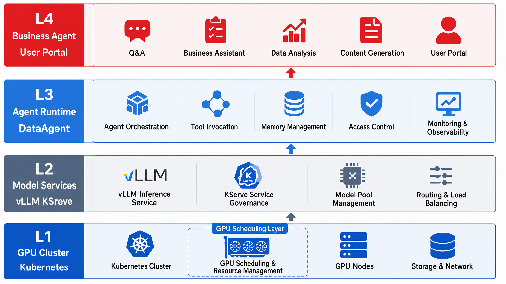
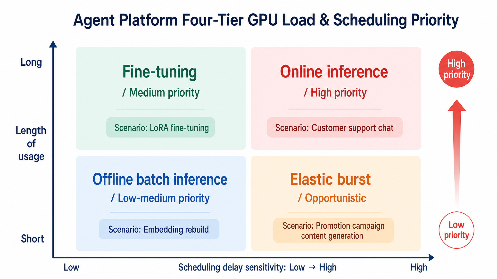
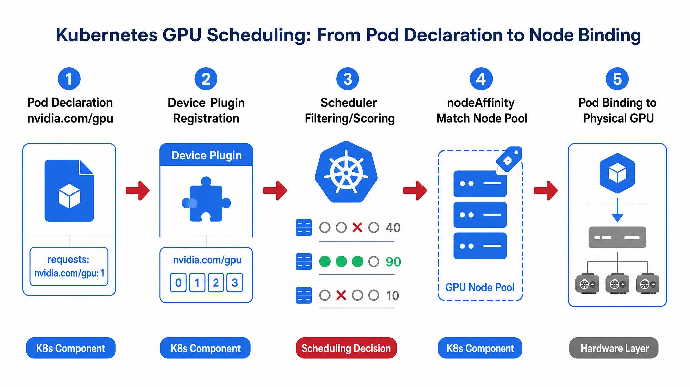
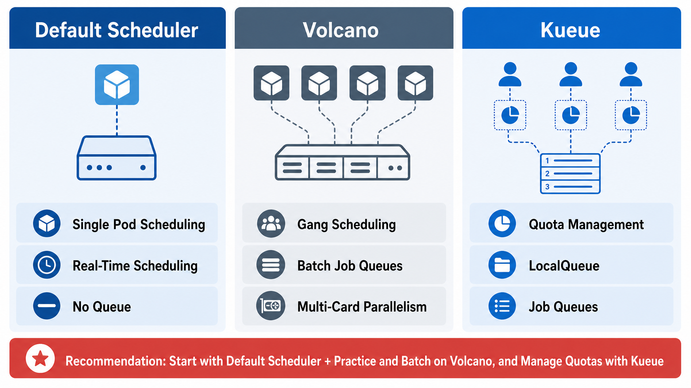
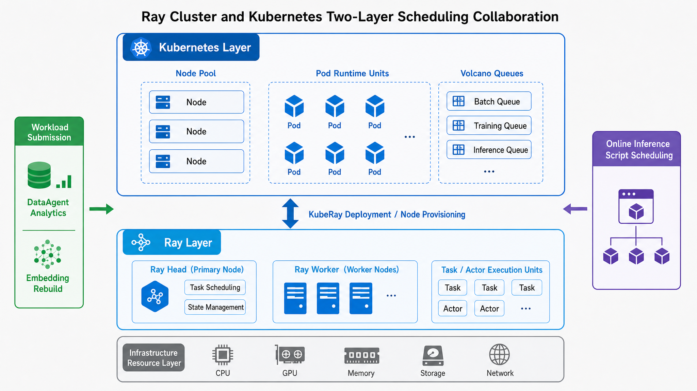
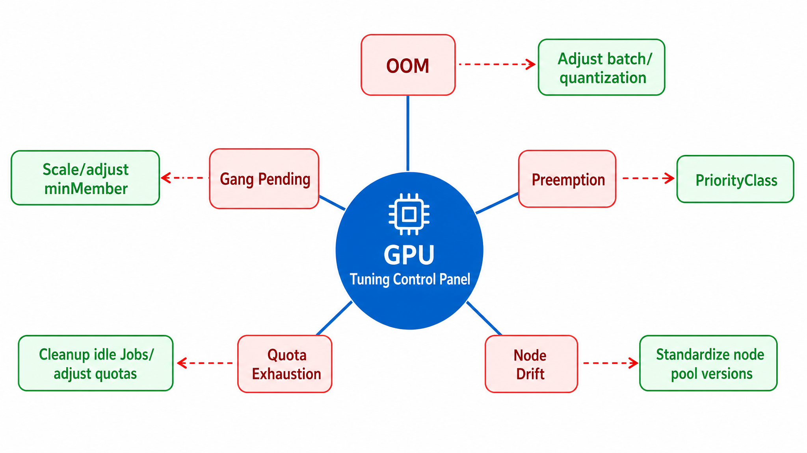

# Chapter 43 GPU Scheduling and Kubernetes

---
## Chapter Summary

This chapter discusses GPU scheduling and Kubernetes, explaining how GPU resource pools, queues, model replicas, node isolation, and elastic scheduling support inference services. GPUs are expensive and scarce; multiple models and tenants competing for the same set of GPUs can lead to situations where some jobs are queued while others remain idle due to poor scheduling. This chapter illustrates how to organize GPUs into schedulable resource pools on Kubernetes, use queues and priority to guarantee resources for critical inference services, and balance utilization and stability through node isolation and elastic scaling.
## Key Terms

GPU scheduling, Kubernetes, resource pool, queue priority, node isolation, elastic scaling
## Learning Objectives

- Explain how GPUs are organized as schedulable and isolatable resource pools in Kubernetes.
- Use queues and priorities to ensure key inference services obtain GPUs during resource contention.
- Design node isolation strategies to avoid interference among multi-tenant workloads.
- Design GPU elastic scaling strategies that balance utilization and stability.

---
## Opening Scenario

A successful local demonstration is only the starting point of deployment. Once entering a shared environment, the position of the GPU scheduling layer in the enterprise Agent platform, the fundamentals of Kubernetes GPU scheduling, and engineering implementation will collectively impact resource isolation, service stability, release cadence, and fault recovery.

---
## 43.1 The Role of the GPU Scheduling Layer in the Enterprise Agent Platform

When multiple business units share a GPU cluster, competition for compute resources often becomes a production bottleneck before model capability does. A typical scenario is: online inference Pods line up waiting for GPUs, while training or batch jobs occupy a large number of cards; the monitoring dashboard shows moderate average GPU utilization, yet the first token delay (TTFT) has already exceeded the SLA. The root cause usually lies not in the model algorithm, but rather in **compute resource scheduling that does not respect business priority and SLA**. In enterprise Agent platforms, production faults at the compute layer typically first manifest as scheduling anomalies rather than degraded inference quality.

As enterprise Agent platforms scale from pilot to wide deployment, competing compute demands from multiple business units emerge. Consider four typical business units:

- **Retail**: During promotional peaks, the system must support high-concurrency inference; P99 first token latency must be controlled within milliseconds to seconds, with no tolerance for long queues;
- **Manufacturing**: Device diagnostic Agents require round-the-clock GPU occupancy for vision inference, demanding node affinity and fault domain isolation;
- **Finance**: End-of-month batch analysis occupies queues for extended periods, but data does not leave the domain and must not affect daytime online queries;
- **Logistics**: Experiences predictable short-term elastic peaks, with GPUs freed for other queues between spikes.

Multiple business units with varied SLAs and a fixed GPU procurement budget—without a unified **GPU scheduling layer**, this often degrades into informal compute coordination: operators manually cordon nodes and evict Pods, which is neither auditable nor reproducible.

Positioned at the bottom layer in Part VIII, the GPU scheduling layer answers a precise question: **Which physical card, on which node, with what isolation granularity, runs which workload, and for how long?** It provides upward support to Chapter 44’s model deployment by delivering a "predictable compute contract"—for example, if model service requires one A100-80G GPU, the scheduler guarantees binding to a node satisfying `nodepool=gpu-inference` within the agreed timeframe, instead of relying on "a pool of GPUs shared informally across teams." Horizontally, it supports the GitOps delivery in Chapter 46 by enabling declarative node pools—Terraform creates node pools, Kubernetes labels express scheduling policies, ArgoCD syncs DaemonSet and Queue configurations.

Explicit responsibilities the scheduler layer **does not handle**, to avoid overlap with adjacent chapters:

- It does not manage how model weights load or how Canary deployments switch—covered in Chapter 44;
- It does not decide request routing to which model version or tenant token quota—covered in Chapter 45;
- It does not optimize vLLM’s KV cache—covered in Part II Chapter 7.



*Figure 43-1: The GPU scheduling layer sits at the foundation of the Agent platform compute stack, supporting model services and business Agents above. Source: Author’s own illustration. Alt text: Layered diagram with GPU resource pool and scheduler at bottom, model services in middle, and business Agents on top; arrows upward show compute support flows.*

Figure 43-1 illustrates the origin of compute resources in Part VIII. Readers should understand: GPU scheduling is not simply the `--gpu-memory-utilization` vLLM launch parameter, but a core platform infrastructure layer; without it, Chapter 44’s InferenceService just writes `nvidia.com/gpu: 1` in YAML but cannot guarantee during peak times that training jobs won’t crowd out inference.

*Table 43-1: Definitions and distinctions of core GPU scheduling concepts. Source: Compiled by author.*

| Concept         | Definition                                                   | Distinction from Adjacent Concepts                     |
|-----------------|--------------------------------------------------------------|-------------------------------------------------------|
| GPU Scheduling  | Assigning GPUs within the cluster to Pods/Jobs by priority, quota, and topology | Different from model version management and Canary traffic in Chapter 44 |
| Kubernetes (K8s) | Container orchestration platform providing abstractions such as Pods, Nodes, Namespaces | Different from HPC batch semantics and `sbatch` culture of Slurm          |
| Queue Scheduler | Manages AI job queueing, prioritization, and Gang Scheduling on top of K8s | Different from default kube-scheduler's one-Pod-at-a-time scheduling      |
| GPU Sharing    | Multiple workloads sharing the same physical card (MIG, timeslicing, etc.) | Not the same as HPA scaling Pod replicas (horizontal scaling)             |

### 43.1.1 Classification of GPU Workloads in the Agent Platform: Inference, Fine-tuning, Batch and Elastic Scaling

Part II Chapter 6 answers **what engine to run models on**—vLLM or SGLang; the scheduling layer addresses **how many to run, for how long, can jobs preempt others, who yields on failure**. **Without classifying workloads first, node pool design is impossible.** Architects mixing significantly different SLA workloads in the same scheduling domain commonly encounter: online inference OOM, starvation of fine-tuning jobs, FinOps inability to attribute cost per business line—the problem is usually not insufficient card count but **improper scheduling domain partitioning**.

#### Online Inference

Agent Runtime, DataAgent conversations, customer service streaming replies belong to online inference. Characteristics are: **latency sensitive, streamable, uncertain occupancy duration but single conversations are short, and cannot be arbitrarily preempted.** During promotional or business peaks, concurrency can surge multiple-fold from baseline; if inference Pods share a pool with fine-tuning jobs, users experience "stuck" responses—the real cause is Pods waiting on GPUs, not slow model inference.

Online inference should bind to the dedicated `gpu-inference` node pool and use Chapter 44’s `minReplicas` for warmup to avoid HPA cold starts compounding GPU node scale-up delays.

#### Fine-tuning and Alignment

LoRA fine-tuning in Part II Chapter 9 is intermittent but high usage: for example, running 8 GPUs for 36–48 hours quarterly, with business typically tolerating non-real-time queuing. This workload fears not waiting but partial Gang startup—if 8 Pods start with only 6 actually running, training silently fails. It should enter the `gpu-train` queue managed by Volcano, having lower priority than online inference with `minMember` and queue limits set.

#### Offline Batch Inference

Embedding rebuild, RAG index refresh, and evaluation batch runs (Chapter 39) are high-throughput, latency insensitive, and resumable. If nightly batch jobs co-locate with online inference, they may occupy bandwidth and GPU DMA during business peak hours. They should be placed in the `gpu-batch` queue with concurrency limits (e.g., up to 2 batch jobs simultaneously).

#### Elastic Scaling

Promotional nights, month-end closing, and major campaign retrospectives generate **predictable but roughly estimated peaks**. Kubernetes HPA scaling Pods and Cluster Autoscaler scaling nodes are often sufficient for CPU services; for GPU nodes, from Pending to schedulable new nodes typically take **8–25 minutes** (image warm-up, driver initialization, model pulling). At scale, a common practice is to pre-warm a `gpu-burst` buffer pool before predictable peaks, instead of fully relying on Autoscaler’s lagged response—usually Autoscaler only reclaims nodes **after** peak ends, suboptimal for cost and experience.

*Table 43-2: Latency requirements, scheduling priority, and recommended node pools for four types of GPU workloads. Source: Compiled by author.*

| Workload Type  | Typical Scenario               | Latency Requirement | Scheduling Priority | Recommended Node Pool   |
|---------------|-------------------------------|---------------------|--------------------|-----------------------|
| Online Inference | Customer service Agents, DataAgent conversations | Milliseconds to seconds | High               | `gpu-inference`       |
| Fine-tuning Training | LoRA domain adaptation      | Hours to days       | Medium             | `gpu-train`           |
| Offline Batch Inference | Embedding rebuild, evaluation batch | Minutes to hours    | Medium to low      | `gpu-batch`           |
| Elastic Peaks  | Promotional nights, month-end analysis | Burst               | Preemptible buffer | `gpu-burst`           |



*Figure 43-2: Differences in latency, duration, and priority among four GPU workload types determine node pool partitioning. Source: Author’s own illustration. Alt text: A coordinate plot showing four workloads—online inference, batch inference, training, experiment—clustered by latency and runtime length, each mapped to a dedicated node pool reflecting workload-specific resource isolation.*

The key takeaway from Figure 43-2 is: **first identify the workload quadrant, then decide the node pool;** conversely, "sharing one unified GPU pool among all teams" trades off operational complexity for procurement convenience but almost inevitably leads to OOM or queue overload as scale grows.

### 43.1.2 Misjudgment Risks in Scheduling Design

**Misconception 1: Having Kubernetes automatically means you have GPU scheduling capability**

Kubernetes’ default scheduler understands `cpu` and `memory`, and can see `nvidia.com/gpu` through Device Plugin, but it **does not understand** three special requirements of AI workloads: Gang Scheduling (N GPUs must be ready simultaneously), queue priority (fine-tuning can wait but must not starve indefinitely), and topology-awareness (NVLink multi-GPU inference expects Pods on the same NUMA domain). During a 70B four-card tensor parallel production launch, one encountered a "partial startup" with 3 of 4 Pods running and 1 Pending—the vLLM process hung, gateway timed out, and monitoring showed “GPU still available” because that 1 GPU was on another node and could not meet TP=4.

**Misconception 2: GPU sharing means free doubling of capacity**

From a FinOps perspective, when average GPU utilization for inference is low, enabling MIG or time-slicing seems to improve card utilization. Common pilot failure mode: P99 latency spikes, users feel AI is slower, while GPU utilization charts “look OK.” The root cause is **time-sharing latency-sensitive inference with batch workloads;** sharing improves averages but worsens tail latency. MIG suits multi-tenant inference with similar specs and SLAs; time-slicing fits dev/test; dedicated single-card for online inference remains the documented best practice for most large enterprises.

**Misconception 3: Must choose either Slurm or Kubernetes**

Manufacturing or simulation teams traditionally run HPC with Slurm, familiar with `sbatch --gres=gpu:4`; AI platforms use Kubernetes. Independent GPU procurement on both sides complicates budget and utilization alignment. The coexistence model hinges on **a unified inventory:** CMDB records total physical GPUs; Slurm partitions and K8s node pools reserve quotas respectively, with no unilateral oversubscription within a quarter; Slurm manages training and scientific computing, K8s runs inference and Agent Runtime; only containerized jobs mature enough to align with GitOps lifecycle migrate.

---
## 43.2 Basics of Kubernetes GPU Scheduling: Device Plugin, Resource Requests, Node Affinity, and Topology Awareness

Kubernetes GPU scheduling can be understood as three steps: "Make the scheduler see the GPU → Make the scheduler understand the rules → Make the scheduler place Pods correctly." Many teams only complete the first step and then encounter mysterious Pending statuses during production peak times.

#### Device Plugin: Let K8s "See" the GPU

The NVIDIA Device Plugin (or equivalent from cloud providers) runs as a DaemonSet on each GPU node and registers the `nvidia.com/gpu` resource to kubelet. Without it, even if Pods specify `limits.gpu` in their spec, scheduling will not occur—because the scheduler thinks the node has no GPUs. When operators troubleshoot Pending issues after a driver upgrade, they sometimes find the entire cluster's `nvidia.com/gpu` capacity dropped to zero; this usually traces back to version mismatches between the Device Plugin and the driver. Best practice is to first roll out and verify releases in the `gpu-staging` pool before touching the production inference pool.

Example Pod resource declaration:

```yaml
# Example: GPU resource declaration for an inference Pod
resources:
  limits:
    nvidia.com/gpu: "1"
  requests:
    nvidia.com/gpu: "1"
```

`requests` and `limits` are usually identical for GPUs—unlike CPUs which can burst, GPUs are exclusive resources, so these values should match to avoid scheduler overcommitment.

#### Affinity and Taints: Let Pods "Land" in the Right Node Pool

With only the Device Plugin, batch training Pods may still land on inference nodes—the scheduler just counts GPUs but doesn’t understand workload business rules. Platform teams often isolate node pools using **Taints and Tolerations**: inference nodes get tainted with `workload=online-infer:NoSchedule`, so only Pods with matching tolerations can land there; batch nodes get `workload=batch:NoSchedule`.

Additionally:

- **nodeAffinity**: restrict nodes by `nodepool=gpu-inference` or `gpu.model=a100-80g`;
- **podAntiAffinity**: replicas of the same InferenceService prefer not to co-locate on the same node to avoid multi-replica loss in single-node failure;
- **topologySpreadConstraints**: spread evenly across availability zones to mitigate AZ-level failures affecting computing capacity.

*Table 43-3: Common labels used for node pool scheduling, example values, and meanings. Source: compiled by this book.*

| Label Key     | Example Value   | Meaning               |
|---------------|-----------------|-----------------------|
| `nodepool`    | `gpu-inference` | Node pool affiliation |
| `gpu.model`   | `a100-80g`      | Physical GPU model    |
| `gpu.topology`| `nvlink-2`      | Multi-GPU NVLink topology |
| `workload`    | `online-infer`  | Allowed workload type |



*Figure 43-3: The five-step scheduling chain from Pod resource declaration to physical GPU binding. Source: drawn by the author. Alt text: From left to right—resource request, scheduler filtering, node scoring, binding, device plugin allocating GPU, arrows show a complete Pod journey from compute request to getting physical card.*

Step ③ in Figure 43-3 is just "counting GPUs;" step ④ enforces platform discipline. When designing clusters, ask: **If affinity is removed, can batch jobs sneak into inference pools?** If yes, scheduling design is not complete.

### 43.2.1 Comparing Queue Schedulers: Volcano, Kueue, and Default Scheduler Boundaries

The default kube-scheduler suits "one Pod, one candy" stateless services. AI workloads often require "distributing a pack of candies simultaneously to N kids, starting only when all have them"—this is Gang Scheduling.

#### Typical Scenario: Four-GPU Tensor Parallel Inference Half-Startup

`llm-general-70b` needs TP=4. Without Volcano PodGroup, scheduler might bind 3 Pods while the 4th remains Pending—these 3 occupy GPUs without progress, and the 4th never obtains all 4 consecutive GPUs. Volcano’s `PodGroup.minMember: 4` guarantees: **either all 4 bind together or all 4 wait together**.

#### Kueue: GPU Budget Controller Across Business Units

Compliance states a division may "use at most 30% GPU time"; another division needs temporary quota boosts for promotion. Kueue’s `ClusterQueue` acts as a finance budget category, `LocalQueue` as department reimbursement windows—jobs exceeding quotas queue instead of preempting online inference Pods (preemption should be explicitly designed with PriorityClass, not left to chance).

*Table 43-4: Kueue as a "GPU budget controller" across business units: trade-offs and scenarios. Source: compiled by this book.*

| Solution           | Advantages                        | Costs             | Suitable Scenarios         | Book Recommendation        |
|--------------------|---------------------------------|-------------------|---------------------------|----------------------------|
| Default scheduler   | No extra components, native K8s | No queue, no gang, no AI priority | Single-GPU inference Pods | Online inference + Affinity |
| Volcano            | Gang scheduling, queue, batch jobs native | CRD and operational learning cost | Fine-tuning, batch inference, multi-GPU parallelism | `gpu-train` / `gpu-batch`  |
| Kueue              | Lightweight, multi-tenant quota management | Weaker gang support than Volcano | Cross-division GPU budgeting | Quota governance            |



*Figure 43-4: Three scheduler types divided by workload characteristics, not replacements of each other. Source: drawn by the author. Alt text: Default scheduler, batch schedulers (like Volcano), and framework schedulers (like Ray) are placed side-by-side, each labeled with their workload specializations; arrows indicate they manage different workloads, not competing for the same responsibility.*

Figure 43-4 compares responsibilities: default scheduler manages single Pod immediate binding; Volcano manages gang scheduling and batch queues; Kueue manages cross-tenant GPU quotas. These are not mutually exclusive. The recommended architecture is: **inference Pods scheduled by default scheduler to inference pool; training/batch jobs enter Volcano queue; all job workloads constrained by Kueue quotas**.

### 43.2.2 HPC Cluster Path: Slurm and Kubernetes Coexistence, Migration, and Division of Labor

HPC users often are more familiar with `sbatch` than YAML. Forced migration typically results in a lose-lose: HPC user efficiency decreases, Kubernetes teams bear extra support burden.

Typical coexistence practice:

- **Slurm retained**: CFD, long pretraining, scientific computing; independent GPU partitions;
- **K8s led**: inference, Agents, KServe, GitOps (Chapter 46); separate GPU node pools;
- **Migration criteria**: job containerized, needs synchronized versioning with InferenceService, requires ArgoCD management—only then move to K8s + Volcano.

Unified accounting prevents resource silos like "Slurm GPUs idle while K8s inference queues." Platform weekly meetings review utilization across domains, and FinOps charge departments accordingly.

### 43.2.3 Distributed Computing Frameworks: Role of Ray Cluster in Agent Inference and Data Processing

DataAgent’s end-of-month batch analytics typically involve parallel Python stats over many parquet partitions, exceeding single-node memory. Ray splits jobs into hundreds of Tasks running on K8s Worker Pods—**externally a single K8s Job, internally Ray’s Task scheduling**.

Typical Ray use cases in enterprise Agent platforms:

1. **DataAgent batch analysis**: Ray Data + Python, integrated with Kueue quotas;
2. **Offline RAG embedding**: Ray parallelizes calls to Triton Embedding API;
3. **Optional multi-replica orchestration with KServe**: complex pre/post chains.

Confusing Volcano with Ray is a common architectural mistake: Volcano controls "can 4 GPU Pods start simultaneously;" Ray manages "how 200 Tasks inside the Pod receive CPU/GPU." Check Pending states in Volcano; Task slowness in Ray Dashboard.



*Figure 43-5: Kubernetes manages nodes and Pod lifecycle; Ray schedules fine-grained Tasks within the Pods. Source: drawn by the author. Alt text: Outer Kubernetes layer manages nodes and Pods; inner Ray layer schedules fine-grained Tasks on the cluster of Pods; arrows illustrate layered, nested scheduling cooperation.*

Figure 43-5 illustrates the dual layer division: upper node pools and Volcano queues decide Pod GPU allocation timing; lower Ray Head schedules Tasks/Actors inside Pods. Troubleshoot Pending at Volcano, Task slowness at Ray Dashboard—mixing layers is a common misdiagnosis.

### 43.2.4 GPU Sharing and Partitioning: MIG, Time-Slicing, vGPU, and Multi-Tenant Compute Isolation

Idle GPUs don’t always mean waste—online inference reserves 20% KV Cache capacity for long context. But **28% average utilization** still draws FinOps questions: can sharing be improved?

*Table 43-5: GPU sharing schemes like MIG, Time-Slicing, vGPU, their isolation strength and risks. Source: compiled by this book.*

| Solution     | Isolation Strength | Suitable Scenarios           | Main Risks                   |
|--------------|--------------------|-----------------------------|-----------------------------|
| MIG          | High (hardware partitioning) | Multiple inference services with same SLA | Fixed specs, no dynamic merge after partitioning |
| Time-Slicing | Low (time slices)  | dev/test, low-priority batch | Tail latency jitter          |
| vGPU         | Medium             | Virtual desktop-style multi-tenant | Licensing and vendor lock-in |
| Exclusive use| Highest            | Latency-sensitive online inference | Utilization looks “bad”      |

The recommended written policy: **online inference defaults to exclusive use; dev environments use Time-Slicing; non-core batch on dedicated A100 with MIG 7g, never mixed with online inference nodes.**

### 43.2.5 Failure Modes: OOM, Preemption, Gang Scheduling Failures, Quota Exhaustion, and Node Drift

GPU scheduling failures rarely reside in a single component. When Device Plugin loses contact, Kubernetes may still show nodes as Ready; when Volcano queue is blocked, the model service layer sees Pods Pending; when Kueue runs out of quota, the business perceives "service doesn’t scale." Troubleshooting requires breaking down responsibility domains first, then deciding if node repair, queue tuning, quota adjustment, or reduced model scale is needed.

*Table 43-6: Responsibilities and failure signals of GPU scheduling components. Source: compiled by this book.*

| Component           | Responsibility     | Input               | Output              | Failure Mode                |
|---------------------|--------------------|---------------------|---------------------|-----------------------------|
| Device Plugin       | Register GPUs       | Physical GPU state  | Allocatable amount  | Lost after driver upgrade   |
| kube-scheduler      | Single Pod scheduling | Pod spec           | Binding             | Fragmented Pending          |
| Volcano             | Gang + queue       | PodGroup            | Batch Binding       | minMember stuck indefinitely|
| Kueue               | Tenant quota       | ClusterQueue        | Admit/Queue         | Quota starvation            |
| Cluster Autoscaler  | Node scaling       | Pending Pods        | New nodes           | GPU scale-up lag            |

Interface contract example (Volcano PodGroup):

```yaml
apiVersion: scheduling.volcano.sh/v1beta1
kind: PodGroup
metadata:
  name: llm-70b-tp4
spec:
  minMember: 4
  queue: gpu-inference
  priorityClassName: online-infer-high
```

*Table 43-7: Detection and recovery strategies for scheduling failures like OOM, preemption, quota exhaustion. Source: compiled by this book.*

| Failure Mode           | Trigger Condition        | Impact              | Detection Method         | Recovery Strategy                             |
|-----------------------|--------------------------|---------------------|-------------------------|----------------------------------------------|
| GPU OOM               | KV Cache + weights exceed GPU memory | Pod restarts, 503 errors | DCGM, OOMKilled status  | Reduce batch size, quantization (Ch.7), limit max_model_len |
| Gang Scheduling Pending permanently | Free GPUs < minMember       | Service never Ready  | PodGroup Unschedulable  | Scale up, reduce minMember, adjust TP         |
| Preemption mishandling | Batch job preempts inference Pod | Conversation interruption | SLO alerts, Events       | Disable preemption on online PriorityClass    |
| Quota exhaustion       | Kueue hits limit           | Jobs queue indefinitely | Workload Pending        | Increase quotas, clean stale jobs             |
| Node drift            | Driver/CUDA mismatch        | Some nodes unavailable | Label reconciliation     | Standard rolling upgrades of node pools       |



*Figure 43-6: Detectable signals and recovery actions for five scheduling failure types documented in a Runbook. Source: drawn by the author. Alt text: Five failure modes (OOM, preemption, Gang scheduling failure, quota exhaustion, node failure) connected to detection signals and recovery steps into a Runbook for standard incident response.*

Figure 43-6 summarizes detection signals and recovery actions for OOM, Gang Pending, mistaken preemption, quota exhaustion, and node drift failures—on-call engineers can match issues to this Runbook rather than blindly restarting GPUs one-by-one.

The trade-off between isolated and unified GPU pools is not just utilization numbers. Unified pools simplify procurement, labeling, and permissions during pilot phases; but once multi-division shared, latency-sensitive inference, batch, training, and experiments mix in one fault domain. Dedicated node pools may show lower utilization but provide explainable SLOs, cost attribution, and incident boundaries. For production platforms, explainability usually outweighs short-term utilization gains.

*Table 43-8: Trade-offs between dedicated node pools and unified GPU pools. Source: compiled by this book.*

| Solution          | Advantages                 | Costs              | Suitable Scenarios              | Book Recommendation            |
|-------------------|----------------------------|--------------------|---------------------------------|-------------------------------|
| Dedicated node pools | Predictable SLOs, clear fault domains | Possibly lower utilization | Multi-division environments with disparate SLA | Recommended for scaled enterprises |
| Unified GPU pool   | Simple procurement decisions | Resource contention, OOM risk | Single-team MVP                    | Only for pilot phases           |

Volcano and Kueue should not be seen as mutually exclusive choices. Volcano handles job startup ordering, ensuring a batch of Pods get resources simultaneously; Kueue handles tenant quota admission, managing if a tenant has available resource budget. Training and batch inference rely on Gang Scheduling, so enter Volcano first; cross-division resource limits and temporary boosts come from Kueue. The operational complexity of running both is a cost, but gains clearer responsibility layers.

*Table 43-9: Division of labor and trade-offs between Volcano and Kueue. Source: compiled by this book.*

| Strategy                 | Advantages         | Cost               | Suitable Use Cases         | Book Recommendation  |
|--------------------------|--------------------|--------------------|---------------------------|----------------------|
| Volcano-primary          | Gang scheduling, AI batch jobs | Heavy components | Multi-GPU training/inference | Training/batch queues |
| Kueue-primary            | Clear quotas        | Weaker gang support | Multi-tenant jobs          | Quotas               |
| Dual use (both)          | Each plays to strengths | Higher ops complexity | Large-scale platforms      | Recommended          |

---
## 43.3 Engineering Implementation: Scheduling Policy Configuration, Resource Quotas, Monitoring Metrics, and Autoscaling Integration

The following configurations are production engineering examples and must be adjusted according to the actual cluster parameters before deployment. The recommended implementation order is: **first define node pool labels and taints → then define inference Pod affinity → then attach Volcano/Kueue queues → finally integrate alerts and autoscaling linkage**. Skipping the first two steps and going straight to queues can cause jobs to remain perpetually Pending in the queue, and it becomes difficult to determine whether the issue is a misconfigured affinity or insufficient resources.

The logic behind this order is to first turn resource boundaries into facts, then codify scheduling policies as rules. Node pool labels and taints control "which Pods can enter which nodes"; affinity and tolerations control "whether a service complies with the pool’s discipline"; queues and quotas manage "which team gets resources first when multiple teams compete"; and monitoring and alerts address "who detects rule violations." Reversing this order often leads teams to spend a long time tuning queues, while basic errors like batch Pods mistakenly landing on inference nodes are overlooked.

Engineering deployment should also clearly delineate responsibilities among SRE, platform, and business owners. SRE manages node pools, drivers, Device Plugins, and scheduler health; the platform team owns InferenceService, queue templates, and default priorities; business owners must specify whether their workloads are online, batch, training, or experimental. Many GPU cluster incidents are not due to immature tech components but because workload types were improperly declared. For example, if an evaluation batch job is mislabeled as online inference, it will consume GPUs that should be reserved for user conversations; conversely, a real online service marked as low-priority batch can get starved during peak times.

Therefore, GPU scheduling configuration should be part of architecture review checklists, but the documentation must not stop at a checklist. What really matters is clearly explaining why each node pool exists, why each workload type belongs in a given pool, whether queue quotas match the budget, and if scaling speed meets business peaks. Only once these questions are answered does the following YAML make sense.

#### Step 1: Define Node Pools and Taints

Inference nodes must *reject* batch Pods mistakenly landing on them. A taint acts as a "No entry unless you have a pass" on the node:

```yaml
# Example: Inference Dedicated Node Taint
apiVersion: v1
kind: Node
metadata:
  name: gpu-infer-node-01
  labels:
    nodepool: gpu-inference
    gpu.model: a100-80g
    workload: online-infer
spec:
  taints:
    - key: workload
      value: online-infer
      effect: NoSchedule
```

The `gpu-batch` pool uses the taint `workload=batch:NoSchedule` to physically isolate it from the inference pool. FinOps allocates GPU hours by the `nodepool` label to avoid being unable to trace which business line consumed cards during OOMs.

#### Step 2: Inference Pod Tolerations and Affinity Declaration

The vLLM InferenceService Pod introduced in Chapter 44 must include tolerations and nodeAffinity or it will not land in the inference pool:

```yaml
# Example: vLLM Inference Pod Scheduling Snippet
affinity:
  nodeAffinity:
    requiredDuringSchedulingIgnoredDuringExecution:
      nodeSelectorTerms:
        - matchExpressions:
            - key: nodepool
              operator: In
              values: ["gpu-inference"]
tolerations:
  - key: workload
    operator: Equal
    value: online-infer
    effect: NoSchedule
resources:
  limits:
    nvidia.com/gpu: "1"
```

Vision diagnostics Agents may require an extra `gpu.model=a100-80g` label to avoid insufficient KV cache space when loading 32B quantized models on 40G cards—this is a typical example of **Affinity expressing business constraints**, not over-engineering.

#### Step 3: Kueue Tenant Quota

The Finance department’s ClusterQueue limits the "concurrent GPU share usage," orthogonal to Volcano queues which determine job launch order; Kueue controls whether jobs can enter the cluster at all:

```yaml
# Example: Finance Department GPU Quota
apiVersion: kueue.x-k8s.io/v1beta1
kind: ClusterQueue
metadata:
  name: finance-gpu
spec:
  resourceGroups:
    - coveredResources: ["nvidia.com/gpu"]
      flavors:
        - name: default
          resources:
            - name: "nvidia.com/gpu"
              nominalQuota: 12    # Illustration: concurrent GPU share upper limit
```

Retail promotions can request temporary quota increases but must go through change requests with expiration times set—otherwise "temporary 48 hours" often becomes permanent quota, squeezing other departments' queues.

#### Step 4: Monitoring Metrics, Alerts, and Autoscaling Linkage

*Table 43-10: Sources of GPU monitoring metrics, alert thresholds, and autoscaling linkage actions. Source: compiled in this book.*

| Metric                          | Source             | Alert Threshold (Example) | Linked Action                        |
|--------------------------------|--------------------|--------------------------|------------------------------------|
| `DCGM_FI_DEV_GPU_UTIL`          | DCGM Exporter      | < 10% continuously for 15 min | FinOps reviews for overprovisioning |
| `kube_pod_status_phase{phase="Pending"}` | Prometheus         | Pending > 5 min           | Investigate Gang/quota/node pool    |
| `volcano_queue_allocated`       | Volcano Metrics    | Queue full                | Scale out or adjust priority        |
| GPU Node NotReady ratio          | Node Exporter      | > 10%                     | Node pool rolling repair            |

Special care is needed in autoscaling linkage: **HPA scaling Pod replicas ≠ guaranteed GPU availability.** If Pod count increases from 4 to 8 but the cluster only has 2 free GPUs left, the extra 4 Pods will Pending. Chapter 44’s `minReplicas` and Chapter 43’s node pool `max_size` must be planned together. Cluster Autoscaler is slow to cold start new GPU nodes (8–25 minutes); before predictable peaks, SRE can pre-warm the `gpu-burst` pool from 0 to some nodes, then scale down after activity ends, avoiding "scale down right after peak, then second peak hits" oscillations.

Monitoring metrics should be partitioned by user roles. Business owners care about first token latency, request queue time, and downgrade counts; platform teams care about Pod Pending, queue backlog, Kueue admission failures, and model replica counts; SRE cares about node NotReady, GPU memory error-correction events, driver drift, and Device Plugin restarts. Putting all metrics on one big dashboard usually results in no one knowing what they should focus on. A more practical approach is routing alerts bound to responsibility domains: PodGroup Pending > 10 minutes alerts platform team first; GPU capacity zero alerts SRE; a tenant quota saturated alerts business owner and FinOps.

Capacity planning cannot just look at the number of GPUs. For inference services, VRAM, context length, KV Cache, tokenizer CPU load, and model weight pull speeds all affect usable capacity. A 32B model can serve stably with short context, but long report generation quickly consumes VRAM with KV Cache. The scheduler only knows a Pod requires 1 GPU card; it doesn’t know if that GPU can handle specific request types. Therefore, capacity planning in Chapter 43 must integrate with model resource profiling in Chapter 44 and gateway quotas in Chapter 45—not be estimated independently.

Finally, a *termination mechanism* for temporary scale-up is needed. Pre-warming `gpu-burst` before business peaks is reasonable, but after events end the resources must be reclaimed per plan, recording peak demand, queue times, and actual GPU hours. Otherwise, temporary pools become permanent, FinOps sees rising bills, but SRE cannot match usage windows. GPU scheduling governance must ensure services run and compute capacity returns to an explainable steady state.

Verification commands (examples):

```bash
kubectl describe node gpu-infer-node-01 | grep -A5 Taints
kubectl get podgroup -n model-serving
kubectl get clusterqueue finance-gpu -o yaml
```

### 43.3.1 Release Gate and Failure Recovery

**Failure Mode 1: Device Plugin upgrade causes entire cluster GPUs to become invisible**

- Symptom: After a NVIDIA driver upgrade, all inference Pods are Pending, `kubectl describe node` shows `nvidia.com/gpu: 0`.
- Root cause: Device Plugin DaemonSet version mismatch with node driver; Plugin fails to start but node remains Ready.
- Fix: Rolling upgrade of node pool — cordon → evict Pods → upgrade driver and Plugin → verify with `nvidia-smi` and Plugin logs → uncordon; **must** run full process in `gpu-staging` pool before touching production inference pool.
- Lesson: "Node Ready" does not mean "GPU schedulable"; alerting must cover Plugin Pod restarts and `gpu_capacity` metrics.

**Failure Mode 2: Volcano PodGroup minMember exceeds cluster available GPUs**

- Symptom: A 70B 4-GPU inference service permanently Unschedulable after launch; 3 Pods Running, 1 Pending; gateway returning some 503 errors.
- Root cause: Production pool has only 3 consecutive free GPUs; Gang with `minMember=4` can never be satisfied.
- Fix: Short term: use 3-GPU tensor parallelism + quantization (Part II Chapter 7); long term: expand `gpu-inference`; alert rule "PodGroup Pending > 10 min" goes directly to on-call.
- Lesson: Gang config must be jointly reviewed with capacity planning; "model runs" verified on a single machine ≠ able to simultaneously acquire N GPUs in cluster.

**Failure Mode 3: Time-Slicing mixed with online inference causes 3x increase in P99 latency**

- Symptom: During promotional peak, customer service Agent’s first token P99 latency rises from 600ms to 1.8s, yet GPU utilization KPI "meets" targets.
- Root cause: To save costs, GPU time-slicing enabled on inference nodes; embedding batch jobs share slices with online inference, causing batch jobs to spike tail latency.
- Fix: Revert online inference to exclusive full GPUs; move batch jobs to `gpu-batch`; FinOps KPIs switched to **per-pool utilization**, forbidding cluster-average utilization for inference SLOs.
- Lesson: Utilization is a cost metric, not an experience metric; mixing latency-sensitive load with batch jobs on physical cards saves little compared to incident review and remediation costs.

In production, GPU scheduling policies must be integrated into platform governance, not remain just YAML examples. Queue, PriorityClass, and Kueue ClusterQueue should be maintained by platform SRE; business teams adjust resources via quota requests and change tickets—no direct cluster-level scheduler object changes. Volcano/Kueue events must flow into auditing systems; GPU allocations must carry tenant, department, and node pool labels to enable FinOps to track spending by business unit rather than just cluster-wide cost.

Online inference exclusive policies should be formalized. Time-Slicing can be used for development and low-priority batch, but must not mix in `gpu-inference` node pool. DCGM, kube-state-metrics, Volcano/Kueue exporters, and node health metrics should connect to the observability pipeline described in Chapter 38, covering at least PodGroup Pending, GPU NotReady, OOMKilled, and node pool scaling failures. Critical models should ideally be scheduled across two availability zones or two node pools. This is not just for formal high availability, but to avoid all inference replicas disappearing simultaneously due to a driver upgrade or node pool failure.

---
## Chapter Recap

1. The GPU scheduling layer serves as the foundational computing resource and is orthogonal to Chapters 44 and 45; incidents typically first manifest as pending states and tail latency rather than model degradation.
2. There are four types of workload partitioning: inference gets exclusive pools, training/batch jobs use Volcano, quotas go through Kueue; GPU autoscalers are slow, so spikes require warm-up.
3. Slurm and Kubernetes can coexist; unified asset accounting is more important than siloed procurement.
4. Gang partial starts, OOMs, mistaken preemptions, and quota exhaustion require runbooks and detectable signals.
5. Affinity and taints enforce "pool discipline"; Device Plugin alone is not sufficient.
## Further Reading

- [Chapter 6: Inference Engine](../../part02-model-inference/ch/ch06.md)
- [Chapter 42: SLO Management, Rate Limiting, and System Resilience](../../part07-observability-eval/ch/ch42-slo.md)
- [Chapter 44: Model Deployment](ch44.md)
## References

Kubernetes. (n.d.). [Device Plugins documentation](https://kubernetes.io/docs/concepts/extend-kubernetes/compute-storage-net/device-plugins/).

NVIDIA. (n.d.). [GPU Operator documentation](https://docs.nvidia.com/datacenter/cloud-native/gpu-operator/latest/).

Kubernetes. (n.d.). [Kueue documentation](https://kueue.sigs.k8s.io/docs/).

Volcano. (n.d.). [Documentation](https://volcano.sh/en/docs/).
