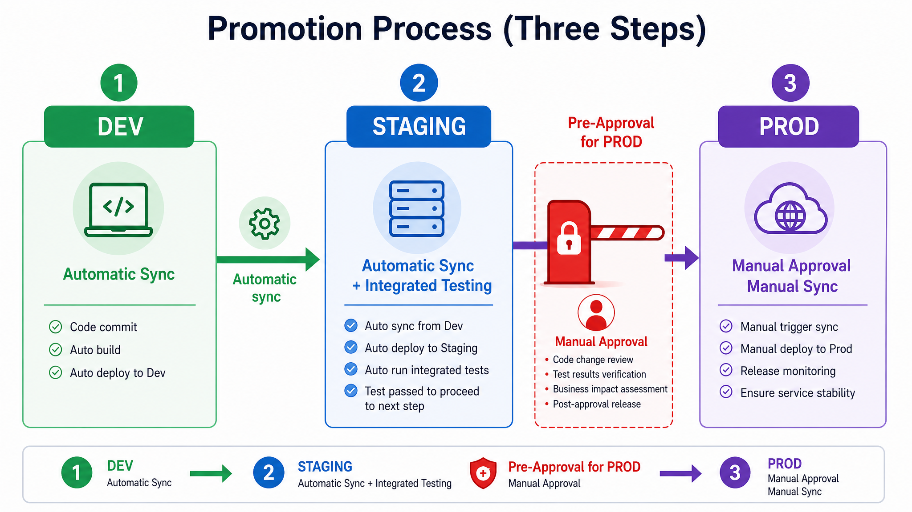
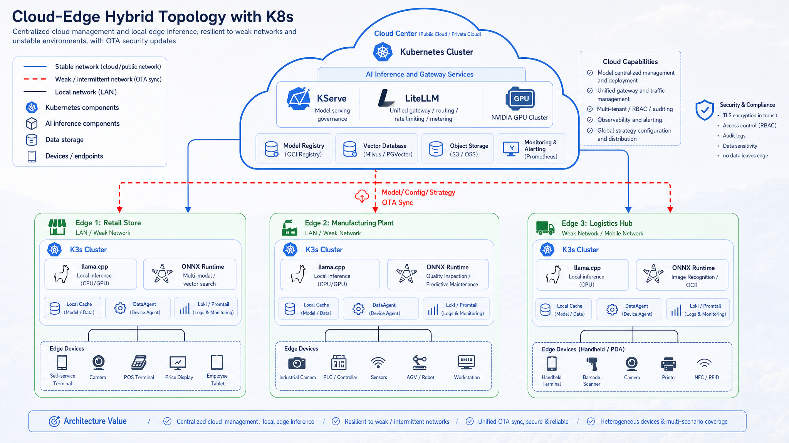

# Chapter 46 GitOps, IaC, and Edge Inference

---

## Chapter Summary

This chapter discusses GitOps, Infrastructure as Code (IaC), and edge inference, illustrating how declarative configuration, environment drift control, infrastructure versioning, and edge deployment are integrated into production workflows. The biggest problem with manual deployment is not speed, but lack of reproducibility: who changed what, when it was changed, and whether the current state matches the desired state are all unknown. This chapter explains how declarative configuration brings infrastructure into version control; how GitOps tools turn the “difference between actual and desired state in Git” into detectable and auto-remediable issues; and how edge inference can be managed uniformly under the GitOps framework.

## Key Terms

GitOps, IaC, Declarative Configuration, Environment Drift, Terraform, Edge Inference

## Learning Objectives

- Explain the core problems solved by declarative configuration compared to manual deployment.
- Design a GitOps process to bring model services and agent platform configuration under version control.
- Use IaC tools like Terraform to manage infrastructure for reproducibility and auditability.
- Describe edge inference deployment and drift control strategies within the GitOps framework.

---

## Opening Scenario

Successful local demos are only the starting point of deployment. Once entering shared environments, moving from manual deployment to declarative delivery, IaC toolchains, and engineering best practices simultaneously affects resource isolation, service stability, release cadence, and incident recovery.

---

## 46.1 From Manual Deployment to Declarative Delivery: Evolution Path of Agent Platform Infrastructure

Chapters 43–45 delivered compute, model services, and the gateway respectively; Chapter 46 answers: **how to deliver these components collectively in a versioned, promotable way to dev/staging/prod environments, and how to incorporate store/factory edge locations into the same governance model.** Without GitOps, Canary traffic percentages from Chapter 44, tenant whitelists from Chapter 45, and node pool labels from Chapter 43 will drift independently across the three environments—passing staging tests but exhibiting inconsistent production behavior is the most common “environment lie.”

An enterprise agent platform usually evolves through three stages: first, engineers SSH into GPU machines to start vLLM; second, Kubernetes + Helm with manual `kubectl apply`; third, Git repository declares desired state, with Argo CD automatically syncing to clusters. In one production incident, an operator manually edited LiteLLM’s ConfigMap via `kubectl edit` in prod to troubleshoot latency and forgot to revert the change, causing model overload and widespread 502 errors. Worse, **there was no PR, no ArgoCD sync record, no Terraform state change**—post-mortem could not answer “who changed what and when.” The risk of manual deployment is not just slowness but **lack of auditability, rollback, and reproducibility.**


*Figure 46-1: GitOps transforms deployment from “SSH on machines” with no record on the left, into declarative config changes reviewed via PR and auto-synced by CI on the right. Source: this book. Alt text: Left “manual deployment” involves direct SSH config edits without trace; right “GitOps” uses PR-based declarative config changes validated by CI and auto-synced, showing deployment shifting from manual work to code review.*

In Figure 46-1’s third stage, the only valid path to “change production” is to merge to protected branches + manual prod sync—not a question of `kubectl` permission, but whether **organizational memory is externalized to Git history.**

### 46.1.1 Core GitOps Mechanisms: Declarative Configuration, Git as Single Source of Truth, Auto Sync, and Drift Detection

GitOps four principles:

1. **Declarative:** Cluster state described by YAML/HCL, not imperative scripts.
2. **Git as SSOT (Single Source of Truth):** Changing production means merging a PR.
3. **Automatic Synchronization:** ArgoCD/Flux reconcile desired vs actual states.
4. **Drift Detection:** Manual `kubectl edit` marks resources OutOfSync and can auto-fix optionally.

The reconcile loop is the heartbeat of GitOps: ArgoCD compares Git commits to cluster objects every 3 minutes (default), and if diffs exist, performs a Sync or sends alerts. The prod `llm-gateway-prod` Application disables automated sync but **continues diff monitoring**—OutOfSync itself signals someone bypassing Git.

*Table 46-1: Definitions and distinctions of GitOps core concepts like declarative config, Git as source of truth, and auto sync. Source: this book.*

| Concept | Definition | Distinction From Nearby Concepts |
|---|---|---|
| GitOps | Use Git to drive deployment and changes | Unlike CI, which only builds images |
| IaC (Infrastructure as Code) | Describe infrastructure with code | Includes Terraform, Helm, etc. |
| Promotion | Config promotion from dev → staging → prod | Different from image tag promotion |
| Drift | Actual cluster state ≠ Git declared state | Different from Canary traffic ratios |

Git repo structure (indicative, matching component names in Chapters 44/45):

```text
agent-platform-gitops/
├── terraform/           # Cloud resources: VPC, GPU node pools, OSS
├── helm/
│   ├── llm-gateway/     # Chapter 45 LiteLLM
│   ├── model-serving/   # Chapter 44 KServe InferenceService
│   └── observability/   # Chapter 38
├── kustomize/
│   ├── overlays/dev
│   ├── overlays/staging
│   └── overlays/prod
└── argocd/apps/         # Application definitions
```

The `helm/model-serving/values-prod.yaml` sets `canaryTrafficPercent` and OSS URI for `llm-general-32b`; `helm/llm-gateway/values-prod.yaml` sets tenant quotas and backend lists—**the same PR can atomically change “model + routing,”** avoiding the window where Chapter 44 has Canary 20% but Chapter 45 still points to old Service.

### 46.1.2 Misjudgment Risks in GitOps Adoption

**Misconception 1: GitOps means “put YAML in Git”**

Without auto reconcile, PR gates, or secret separation, it’s just storing YAML as backup. True GitOps requires ArgoCD + branch strategies + promotion workflow + External Secrets. In one rollout, YAML was committed but deployment was done with manual `kubectl apply`; long-term drift between Git and cluster caused ArgoCD to delete manually created Ingress on first sync—showing **you must baseline align before enabling self-heal.**

**Misconception 2: Terraform vs Helm is an either/or choice**

Terraform excels at cloud resources (GPU node pools, networks, IAM); Helm excels at packaging Kubernetes apps. Use both: Terraform manages `gpu-inference` node pools and model OSS buckets; Helm deploys KServe and LiteLLM. Hardcoding Deployment templates in Terraform is less maintainable than Helm; creating VPC in Helm reduces state and module reuse—**layer by management object, not by tool religion.**

**Misconception 3: Edge inference can be operated independently of GitOps**

Hundreds of stores manually upgrading llama.cpp inevitably fragment versions—models quantized differently per region, inconsistent response quality for sales scripts, and headquarters unable to reproduce complaints. Edge should be a GitOps `overlay` with different sync policies (see 46.6): central Git publishes manifest, stores OTA Agent reconciles, unified philosophy with cloud ArgoCD.

**Misconception 4: Promotion equals pushing image tags staging → prod**

Agent platform promotion mainly means promoting Helm values and Terraform variables—like updating OSS URIs, Canary percentages, LiteLLM tenant quotas. Only promoting gateway image digest without promoting model-serving values causes an implicit drift of “new gateway with old model URI.” PR templates should list affected Applications.

---

## 46.2 IaC Toolchain: Terraform Resource Orchestration, Helm Chart Packaging, and ArgoCD Continuous Delivery

The delivery stack in Part VIII has four collaboration layers: **Terraform manages cloud, Helm manages apps, Kustomize manages environment differences, ArgoCD manages sync.** Each layer has clear SSOT boundaries, avoiding a “mega-repo script” approach.

*Table 46-2: Responsibilities and managed objects of IaC tools like Terraform and Helm Chart. Source: this book.*

| Tool | Responsibility | Managed Objects | Typical Use |
|---|---|---|---|
| Terraform | CRUD cloud resources | VPC, node pools, OSS, IAM | GPU node pools, model buckets |
| Helm | Kubernetes app templating | Deployment, Service, CRD values | LiteLLM, KServe |
| Kustomize | Patch environment differences | overlay patches | dev/staging/prod replica counts |
| ArgoCD | Git → Cluster sync | Application, AppProject | Per-environment Applications |

Terraform state records OSS bucket ARNs and node pool IDs; Helm values reference IAM Roles via External Secrets—**clear division between cloud and app.** On-call seeing InferenceService OSS 403 looks first at Terraform IAM module, not restarting Pods.


*Figure 46-2: Terraform manages cloud infra resources, Helm Charts manage Kubernetes app configs, ArgoCD continuously compares Git and actual cluster state and auto fixes. Three collaborate to cover the full cloud-to-app declarative delivery. Source: this book. Alt text: Three-layer separation—Terraform manages cloud infrastructure resources; Helm Chart manages Kubernetes app configuration; ArgoCD continuously compares Git and actual cluster state and auto remediates, covering all declarative delivery from cloud to app.*

Figure 46-2 shows four-layer collaboration: Terraform declares cloud resources, Helm packages Kubernetes apps, Kustomize expresses environment overlays, ArgoCD reconciles Git commits to clusters—PR merge triggers legal changes into prod.

**Tradeoff 1: ArgoCD vs Flux**

*Table 46-3: IaC toolchain choices between Terraform resource orchestration and Helm Chart approaches. Source: this book.*

| Option | Advantages | Costs | Applicable Scenarios | Recommendation |
|---|---|---|---|---|
| ArgoCD | Intuitive UI, mature AppProject | Higher resource use | Multi-team, need visual UI | Recommended for scale-up |
| Flux | Lightweight, native GitOps Toolkit | Weak UI | CLI-only teams | Optional |

Multiple business units and platform SREs need to view prod diffs and sync history—ArgoCD’s UI reduces communication cost of config changes. Flux suits teams deeply GitOps fluent without UI needs.

**Tradeoff 2: Monorepo vs Multiple Repo GitOps**

*Table 46-4: IaC toolchain choices between Terraform resource orchestration and Helm Chart approaches. Source: this book.*

| Option | Advantages | Costs | Applicable Scenarios | Recommendation |
|---|---|---|---|---|
| Monorepo | Atomic changes, simpler promotion | Coarse permission | Centralized platform team | Early phase recommended |
| Multi-repo | Team autonomy | Cross-repo version alignment hard | Large-scale multi-team | Long-term evolution |

Chapters 44 Canary and 45 routing merged atomically in one PR are core monorepo benefits. Long term split into `terraform/` and `helm/` repos is feasible but promotion tags must align across repos—for example, `prod-v1.2.0` pins both model and gateway chart versions.

### 46.2.1 Platform Delivery Layers: Network, Storage, GPU Node Pools, Model Services, Gateway, and App Stack

Delivery order should be bottom-up, consistent with Chapters 43–45—upper Application depends on lower resource IDs and Secrets; skipping layers via direct cluster edits causes ArgoCD PreSync hook failures or worse “silent misconfigurations.”

*Table 46-5: Components and delivery methods of platform layers: network, storage, GPU node pools, etc. Source: this book.*

| Layer | Components | Delivery Method | Dependencies |
|---|---|---|---|
| L0 Network | VPC, subnet, security group | Terraform | None |
| L1 Compute | GPU node pool, Device Plugin | Terraform + DaemonSet | L0 |
| L2 Storage | OSS buckets, PVC | Terraform | L0 |
| L3 Model Service | KServe InferenceService | Helm | L1, L2 |
| L4 Gateway | LiteLLM | Helm | L3 |
| L5 Platform Apps | Agent Runtime, DataAgent | Helm/Kustomize | L4 |
| L6 Observability | OTel, Langfuse | Helm | L5 |

Direct cluster changes that skip PRs break upper-layer assumptions. Typical errors: manually scaling GPU node pool max_size not reflected in Terraform causes Cluster Autoscaler/FinOps tag drift; manually changing LiteLLM backend not updated in Helm leads ArgoCD to overwrite changes on next sync, causing “ghost failures.”

Helm release order of L3 and L4 controlled by ArgoCD Application dependencies or sync waves: first `model-serving-prod`, then after Ready `llm-gateway-prod`—avoiding gateways pointing to nonexistent InferenceServices.

### 46.2.2 Environment Management: Config Differences, Secret Management, and Promotion Process for Dev, Staging, Prod

Three-environment differences are not just “replica count halved”—model weights, external API policies, and sync gating differ, must be explicitly stated in `values-*.yaml` and Kustomize overlays, not just verbally agreed.

*Table 46-6: Comparison of config differences and secret management for dev, staging, prod environments. Source: this book.*

| Dimension | dev | staging | prod |
|---|---|---|---|
| GPU nodes | 1–2 shared GPUs | Small cluster same as prod | Full node pool |
| Models | 7B quantized | Same weights as prod | 32B+ production weights |
| Replicas | 1 | 2 | ≥4 |
| External APIs | Allowed | Allowed (quota-limited) | Finance disabled |
| Sync strategy | Automatic | Automatic | **Manual approval** |

Secrets management: **Never store plaintext keys in Git;** use External Secrets Operator (ESO) to inject from Vault/KMS. LiteLLM `master_key`, cloud API keys, OSS creds all secret-referenced—PR only shows `secretRef: vault/path/openai-key`, never plaintext. Finance tenant cloud keys do not exist at Vault path level, forming double insurance alongside Chapter 45 tenant whitelists.

Promotion process: dev auto sync → staging auto sync + integration tests (including Chapter 39 offline gate trigger) → prod Platform Owner approval + ArgoCD manual sync. Config diffs must be auditable: ArgoCD `app diff` matches PR diff. After staging passes, tag `prod-v1.2.0` created; prod Application’s `targetRevision` points to tag, not floating `main`—**prod cannot track moving head.**



*Figure 46-3: Production promotion must have manual gate, different from dev’s automatic sync. Source: this book. Alt text: dev and staging allow automatic sync, but prod has a manual approval gate indicated at the entry, with arrows showing sync only triggers after approval, reflecting differentiated release cadence.*

Figure 46-3 emphasizes prod’s sync strategy difference: dev/staging auto sync allowed, prod requires manual approval + manual sync. Promotion windows before business peak: upstream `llm-general-32b.minReplicas` promoted with tag after staging load tests; prod manual sync scheduled in low traffic, avoiding config changes overlapping traffic spikes.

### 46.2.3 Edge Inference Scenarios: Store Terminals, Factory Edge Nodes, Offline/Low Network, and Hybrid Cloud Topologies

A retail enterprise platform team must serve hundreds of stores with offline shopping assistants; manufacturing factories have isolated networks requiring ms-level response for QC agent; logistics handheld devices need waybill queries on mobile networks. All cloud gateway and 32B models (Chapters 45 and 44) alone are impractical—weak network RTT and disconnections will shatter user experience. **Edge inference is a deployment location extension, not a separate architecture:** control plane remains central GitOps; edge uses special `overlay` + OTA reconcile policies.

Edge scenario characteristics:

*Table 46-7: Constraints, model sizes, and sync strategies of edge inference scenarios like stores and factories. Source: this book.*

| Scenario | Constraints | Model Size | Sync Strategy |
|---|---|---|---|
| Store Sales Assistant | Weak network, privacy | 3B–7B quantized | Nightly batch OTA |
| Factory QC | Isolated network, low latency | 7B vision-language | Triggered by work orders |
| Logistics Handheld | Mobile network | 3B text model | Region CDN delivery |

Stores run llama.cpp 7B Q4 to handle high-frequency Q&A on size, inventory, return policies; complex complaints or cross-SKU reasoning **fallback** to central Chapter 45 gateway with `llm-general-32b`—fallback path requires circuit breaker, preferring local downgrade “please contact support” over hanging on central link indefinitely.



*Figure 46-4: Edge nodes are GitOps special overlays, not governance-isolated islands. Source: this book. Alt text: Cloud Git repo applies overlays to cover edge node special configs (lightweight models, offline cache); edge nodes remain within GitOps sync framework rather than manually maintained islands.*

Figure 46-4 illustrates hybrid topology of central GitOps with three edge node types (store, factory, logistics): edge runs llama.cpp/ONNX/MLC small models; control plane OTA sync from central manifest; not separate governance islands. Factory QC ONNX models exported from central training pipeline share version schema with cloud KServe models—facilitates complaint reconciliation of “edge 7B vision vs cloud 32B review” as same release train.

#### Edge vs Cloud Request Routing Decisions (Illustrative)

*Table 46-8: Reasoning basis for handling requests at edge or fallback to center. Source: this book.*

| Request Type | Edge Handling | Fallback Conditions to Center |
|---|---|---|
| Store FAQ, size/inventory | llama.cpp 7B | Low confidence / user demands human |
| Factory visual defect pre-judgment | ONNX small model | Borderline samples / require 32B review |
| Logistics handheld waybill query | MLC 3B | Complex claims / multi-turn dialogs |
| Enterprise-wide DataAgent NL2SQL | Never edge fallback | Always via Chapter 45 → `llm-code-7b` |

Fallback requests carry `edge_store_id` and `edge_model_version` headers; central gateway observability distinguishes “edge origin” vs “pure cloud”—FinOps cost allocation separates retail store compute from central GPU.

### 46.2.4 Edge Inference Engines Comparison: ONNX Runtime, llama.cpp, MLC, and Cloud Model Coordination

*Table 46-9: Comparison of edge inference engines like ONNX Runtime and llama.cpp: advantages, costs, suitability, cloud synergy. Source: this book.*

| Engine | Advantages | Costs | Suitable For | Cloud Coordination |
|---|---|---|---|---|
| llama.cpp | Lightweight CPU/GPU, mature quantization | Limited large model performance | Stores ≤ 7B | Complex queries fallback gateway |
| ONNX Runtime | Cross-framework, inference optimizations | Conversion pipeline | Vision QC small models | Central training → ONNX distribution |
| MLC LLM | Mobile-side, NPU acceleration | Ecosystem young | Handheld devices | Works with cloud models |
| Cloud KServe | Most powerful models | Network reliance | Non-edge scenarios | Edge fallback to upstream |

Hybrid approach: edge services 80% high-frequency simple requests; timeout or low-confidence requests **fallback** to Chapter 45 gateway with 32B cloud model—network-layer circuit breakers required to prevent weak network dragging down center. Logistics handheld runs MLC on NPU with 3B model; fallback sends only structured JSON, saving bandwidth.

### 46.2.5 Failure Modes: Config Drift, Sync Conflicts, Rollback Failures, Edge OTA Interruptions, and Version Fragmentation

GitOps failures usually do not happen because the tools are unavailable. They happen because the organization bypasses the tools. Terraform state without locking, ArgoCD OutOfSync treated as noise, External Secrets rotation failures, and half-applied edge OTA updates all turn "Git as the source of truth" into a slogan. The platform should write these failure modes into delivery policy, not leave them as one SRE's private experience.

Drift is hard because it often appears under the name of temporary repair. During a production incident, directly running `kubectl edit` on a ConfigMap may indeed be the fastest move. The problem is that if the temporary change is not written back to Git, it may be overwritten by the next sync, or nobody will know during the next incident that the cluster has already diverged. GitOps does not ban emergency operations, but it requires an incident ID, an expiry time, and a path back to Git. Otherwise manual deployment simply survives under another name.

Sync conflicts are also common when multiple Charts share resources. One Chart manages a CRD while another tries to upgrade the same CRD. One team changes `model-serving` values while another changes `llm-gateway` backends. Two PRs pass staging separately but conflict when combined into the prod tag. The answer is not to make everyone wait for a release manager. Dependencies should be written into directory structure, sync waves, and CI checks. Names, dependencies, and versions that machines can check should not depend on meeting memory.

Edge OTA risks differ from cloud rollback risks. In the cloud, a failed deployment can roll back to an older Revision. At the edge, failure may happen under weak networks, power loss, or small disks. If a partially downloaded model file is loaded directly, the symptom may not be startup failure. It may be low-quality answers or random crashes. Edge updates therefore need a staging directory, checksum verification, atomic switching, and retained old versions. Central inventory must also see the current version of every store; otherwise version fragmentation will surface during complaint review.

*Table 46-10: Responsibilities, inputs/outputs, and failure modes of GitOps components. Source: this book.*

| Component | Responsibility | Input | Output | Failure Mode |
|---|---|---|---|---|
| Terraform | Cloud resource desired state | HCL | Resource IDs | State lock conflicts |
| ArgoCD | Kubernetes sync | Git commit | Sync status | Unresolved OutOfSync |
| External Secrets | Secret injection | Vault | K8s Secret | Rotation window failures |
| Edge OTA Agent | Edge model updates | Artifact manifest | Local model version | Network interruption partial update |

*Table 46-11: Detection and recovery of failure modes like config drift, sync conflicts, edge OTA interruptions. Source: this book.*

| Failure Mode | Trigger Condition | Impact | Detection Method | Recovery Strategy |
|---|---|---|---|---|
| Config drift | Manual `kubectl edit` | Git vs cluster mismatch | ArgoCD OutOfSync alerts | Auto self-heal or PR fix |
| Helm value conflicts | Two charts conflict on same CRD | Deployment failure | Helm template CI | Version lock on chart dependencies |
| Git rollback failure | Incomplete revert merge | Mixed prod versions | ArgoCD history | Fixed tag re-sync |
| Edge OTA interruption | Network download interruption | Corrupt edge model | Checksum validation | Atomic replace after full download |
| Version fragmentation | Stores upgrade individually | Inconsistent experience | Edge version reporting | Enforce minimum version + batch OTA |

Drift is GitOps’ “immune response”: OutOfSync is not noise, but a signal of bypassing PRs. Enabling self-heal in prod is controversial—large enterprises default to **no auto heal in prod, only alert then manual confirm + sync** to avoid masking ongoing legitimate emergency changes (which still require retrospective PRs).

#### Naming Conventions for Components in Chapters 43–45 in Git

*Table 46-12: Naming conventions and key values fields for chapters 43–45 components in Git. Source: this book.*

| Git Path | Chapter | Key Values Fields |
|---|---|---|
| `terraform/node-pools/gpu-inference.tf` | Chapter 43 | min/max_size, labels |
| `helm/model-serving/values-prod.yaml` | Chapter 44 | storageUri, canaryTrafficPercent |
| `helm/llm-gateway/values-prod.yaml` | Chapter 45 | model_list, tenantPolicy |
| `argocd/apps/prod/*.yaml` | Chapter 46 | targetRevision tag |

Naming mismatches (e.g., gateway writes `general-32b` vs KServe named `llm-general-32b`) cause implicit “syncable but not callable” faults during promotion—PR templates should cross-check service names vs Chapter 45 contract.

---

## 46.3 Engineering Implementation: Complete Delivery Pipeline Example with Terraform + Helm + ArgoCD

Complete pipeline: **Terraform plan/apply node pools and OSS** → **Helm CI template validation** → **ArgoCD Application points to tag** → **staging integration tests** → **prod Manual Sync.** Engineers forbidden from local `kubectl apply -f` directly to prod—dev cluster excepted but must write back to Git with same-named overlay.

**Terraform GPU Node Pool (snippet)**

Consistent with Chapter 43 `gpu-inference` labels and taints for Chapter 44 InferenceService node affinity.

```hcl
# Example: GPU inference node pool (production engineering example)
resource "cloud_kubernetes_node_pool" "gpu_inference" {
  cluster_id   = cloud_k8s_cluster.agent_platform.id
  name         = "gpu-inference"
  min_size     = 4
  max_size     = 20
  instance_type = "gpu.a100.80g.8xlarge"   # illustrative, adjust per cloud vendor

  labels = {
    nodepool  = "gpu-inference"
    workload  = "online-infer"
  }

  taint {
    key    = "workload"
    value  = "online-infer"
    effect = "NoSchedule"
  }
}
```

Terraform Cloud or OSS backend stores state; `terraform plan` shows diffs in PR bot comments; after merge CI applies staging; prod apply requires two-person approval.

**ArgoCD Application (snippet)**

```yaml
# Example: Production LiteLLM gateway Application
apiVersion: argoproj.io/v1alpha1
kind: Application
metadata:
  name: llm-gateway-prod
  namespace: argocd
spec:
  project: agent-platform-prod
  source:
    repoURL: https://git.example.com/agent-platform-gitops.git
    targetRevision: prod-v1.2.0          # fixed tag, avoid floating branch
    path: helm/llm-gateway
    helm:
      valueFiles:
        - values-prod.yaml
  destination:
    server: https://kubernetes.default.svc
    namespace: llm-gateway
  syncPolicy:
    automated: null                       # prod forbids auto sync
    syncOptions:
      - CreateNamespace=true
```

`model-serving-prod` Application has similar structure; `values-prod.yaml` includes `llm-general-32b`’s `canaryTrafficPercent` and OSS URI—both Applications promote with the same tag.

**Kustomize prod overlay (snippet)**

```yaml
# Example: Increase gateway replicas in prod environment
apiVersion: apps/v1
kind: Deployment
metadata:
  name: litellm
spec:
  replicas: 4
```

Business peak window overlay patches `replicas: 8` and HPA max, promoted through separate PR merge with tag, not via `kubectl scale`.

**Edge llama.cpp systemd unit (illustrative)**

```ini
# Example: Store edge inference service
[Service]
ExecStart=/opt/llama-cpp/server -m /var/models/qwen2.5-7b-q4_k_m.gguf --port 8080
Restart=on-failure
Environment=UPSTREAM_GATEWAY=https://llm-gateway.prod.example.com
```

Edge OTA: central Git publishes `manifest.json` (model_version, sha256, url); store OTA Agent downloads at night to `.staging`, verifies checksum then atomically renames to `/var/models/active`—same philosophy as ArgoCD reconcile: **align desired state before switching traffic.**

**Verification commands**

```bash
terraform plan -out=tfplan          # Preview cloud resource changes
helm template llm-gateway ./helm/llm-gateway -f values-prod.yaml | kubectl apply --dry-run=client -f -
argocd app diff llm-gateway-prod    # Diff before sync
```

CI gates: if `helm template` fails, PR cannot merge; if `argocd app diff` non-empty, prod sync needs second confirmation. Staging auto sync triggers post-merge smoke tests: gateway pings four tenants, `llm-code-7b` NL2SQL samples, finance tenant forbids cloud probes.

#### model-serving Helm and KServe values file (snippet)

Chapter 44’s InferenceService managed by GitOps, not raw `kubectl`:

```yaml
# Example snippet from helm/model-serving/values-prod.yaml
inferenceServices:
  llm-general-32b:
    storageUri: oss://agent-platform-models/llm/qwen2.5-32b-awq/v20260301/
    minReplicas: 4
    maxReplicas: 8
    canaryTrafficPercent: 0
    nodepool: gpu-inference
  llm-code-7b:
    storageUri: oss://agent-platform-models/llm/qwen2.5-coder-7b/v20260301/
    minReplicas: 2
    maxReplicas: 4
  embed-bge-m3:
    runtime: triton
    storageUri: oss://agent-platform-models/embed/bge-m3/v20260301/
```

When promoting, if only `llm-general-32b.storageUri` changes, the same PR should update offline evaluation links from Chapter 39; ArgoCD sync then triggers Canary per Chapter 44 runbook.

#### Edge overlay directory structure (illustrative)

```text
kustomize/overlays/edge-retail-store/
├── kustomization.yaml
├── llama-cpp-config.yaml
└── ota-manifest-ref.yaml   # Points to central manifest tag
```

Edge does not run ArgoCD Server, but OTA Agent pulls manifest tags matching cloud `prod-v*` source—version fragmentation can be located via central inventory.

### 46.3.1 Release Gates and Incident Recovery

**Failure Mode 1: Enabling automated sync in ArgoCD prod leads to unintended direct production changes without approval**

- Symptom: Engineer merges to main, prod gateway config changes within 5 minutes, fallback disables during peak.
- Root cause: Application copied dev’s `automated: {}` to prod; main branch used alongside prod tags.
- Fix: Prod must have `automated: null` + manual sync; branch protection + mandatory reviewers; prod tracks only tags.

**Failure Mode 2: Missing Terraform state locking causes concurrent apply chaos on node pools**

- Symptom: GPU node pool max_size overwritten, Cluster Autoscaler misbehaves; Chapter 44 HPA scales pods but no nodes available.
- Root cause: Local state file without remote backend; two engineers apply different HCL simultaneously.
- Fix: Use Terraform Cloud or OSS backend + locking; forbid local prod apply; audit state changes.

**Failure Mode 3: Edge OTA partial-download without sha256 checksum causes corrupt store model files**

- Symptom: Some store sales Agents output errors, file sizes 200MB short.
- Root cause: Incomplete downloads on flaky networks; OTA Agent did not rename atomically.
- Fix: Download to `.staging`, require sha256 pass before renaming active; startup probe tests tokenizer smoke; central inventory reports versions, and versions below `min_version` trigger forced OTA.

Production delivery should bind permissions, audit, and rollback together. ArgoCD AppProject should limit which Namespace and resource types each Application may write, and prod sync should be executable only by the Platform Owner or release automation. Git PR, ArgoCD Sync, and Terraform apply records must line up with each other. If a model release is visible in Git but no corresponding ArgoCD Sync exists, it has not actually reached production. If a Terraform apply has no run_id, the team cannot later explain why a node pool became larger at a specific time.

Cost and performance should also enter the GitOps record. Terraform GPU node pools need environment, business unit, and cost-center tags, and autoscaling bounds should be reviewed through PR rather than changed in a cloud console. Helm CI `template` validation proves only that YAML renders; it does not prove that the model loads. Before prod promotion, staging still needs smoke tests for cold start, gateway, tenant policies, and rollback using the same model weights as production. Edge nodes also need to report `edge_model_version`, manifest tag, and verification results; an edge version that central inventory cannot see is not governable.

Disaster recovery starts with fixed versions. Prod Applications should not track a floating branch. They should track `prod-v*` tags. Rollback syncs to the previous tag and retains the corresponding Terraform, Helm values, and model manifest. `argocd app sync --revision <tag>` is not a magic button; it works only if the old model URI, Secret references, and edge manifests remain accessible.

Drift handling should distinguish emergency changes from unauthorized changes. During a production incident, SRE may need to temporarily patch a replica count or remove a broken backend. Such operations can exist, but they need an incident ID, an expiry time, and a follow-up PR. OutOfSync without an incident ID should be treated as an unauthorized change; an incident-linked OutOfSync that is not written back to Git on time should be escalated to the platform owner. This preserves emergency response without letting the emergency path become normal operations.

Release records should support cross-layer tracing. A finance compliance issue may need to trace from gateway audit logs to Git PR, ArgoCD Sync, and Terraform apply. A model latency issue may need to trace from a runtime Trace to KServe Revision and then to node-pool scaling records. Triple audit is not process overhead for its own sake. It lets teams complete these traces in minutes. Without shared fields, postmortems return to asking who remembers what changed.

Triple audit also supports normal operations. A platform monthly review can use PR paths to see which components change most often, ArgoCD Sync records to see which environments fail most often, and Terraform apply records to see which resources are repeatedly expanded temporarily. If the team has to assemble this manually every month, structural problems stay hidden. For example, frequent hotfixes to `llm-gateway` quota policy suggest the quota model does not fit business rhythm; repeated temporary expansion of `gpu-inference` suggests capacity planning or peak prewarming needs redesign.

For the English edition and later versions, this GitOps chapter also provides the book's closure around engineering reproducibility. Earlier chapters cover Runtime, model service, gateway, observability, and security. If deployment still depends on manual operations, readers cannot reproduce those capabilities reliably. Chapter 46 puts them back into a declarative delivery flow and shows that an enterprise Agent platform must be versioned, audited, rolled back, and reproduced across environments.

This is also what makes the chapter different from a general DevOps tutorial. The book is not mainly concerned with deploying any application to Kubernetes. It is concerned with Agent-platform-specific change objects: model weights, prompts, ToolSpecs, tenant policies, GPU node pools, edge manifests, and evaluation evidence. Together they determine which path an Agent call takes, what capabilities it sees, and what risks it carries. GitOps puts these objects in one reviewable change system so the platform can move from pilot engineering to maintainable production.

GitOps is therefore not decorative closure for Part VIII. It is the mechanism that keeps the previous layers running according to their design. Without it, model serving, gateways, and scheduling will drift after a few manual repairs.

The key judgment for readers is this: any object that can change Agent behavior, cost, permissions, or observability evidence belongs in a declarative change process. Only then can an enterprise platform stay consistent across people, environments, models, and edge nodes. The same principle applies to future case studies and hands-on projects.

#### Triple Audit Field Alignment

*Table 46-13: Key fields alignment for Trace, audit logs, GitOps change records. Source: this book.*

| System | Mandatory Fields | Use |
|---|---|---|
| Git PR | author, paths, tag | Who changed what config |
| ArgoCD Sync | revision, initiator, diff | When changes reached cluster |
| Terraform apply | workspace, run_id, resource | Cloud resource changes |

All three systems use consistent `tenant`/`environment` tags matching Chapter 45, facilitating finance compliance audits to trace any PR that relaxes cloud backend permissions—should be none; if any found, process has failed.

---

## Chapter Recap

1. GitOps shifts agent platform delivery from manual operations to PR-driven declarative reconciliation; Git is SSOT, ArgoCD is executor.
2. Terraform manages cloud, Helm manages apps, Kustomize manages environment differences, ArgoCD manages synchronization—four layers with distinct responsibilities, not interchangeable.
3. Prod promotion requires manual gates; secrets never enter Git but go through External Secrets.
4. Edge inference is special GitOps overlay, requiring OTA, checksums, version inventory, not a governance blind spot.
5. Failure modes cluster around drift, sync policy misconfiguration, missing state locks, and partial OTA updates. CI, audit, and runbooks must cover them together.

## Further Reading

- [Chapter 43: GPU Scheduling and Kubernetes](ch43-gpu-kubernetes.md)
- [Chapter 44: Model Deployment](ch44.md)
- [Chapter 45: LLM Gateway and Multi-Tenancy](ch45-llm.md)
- [Chapter 47: Dialog UI](../../part09-frontend-multimodal/ch/ch47-ui.md)

## References

HashiCorp. (n.d.). [Terraform documentation](https://developer.hashicorp.com/terraform/docs).

Helm. (n.d.). [Documentation](https://helm.sh/docs/).

Argo CD. (n.d.). [Documentation](https://argo-cd.readthedocs.io/).

ONNX Runtime. (n.d.). [Documentation](https://onnxruntime.ai/docs/).
