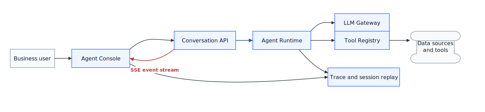
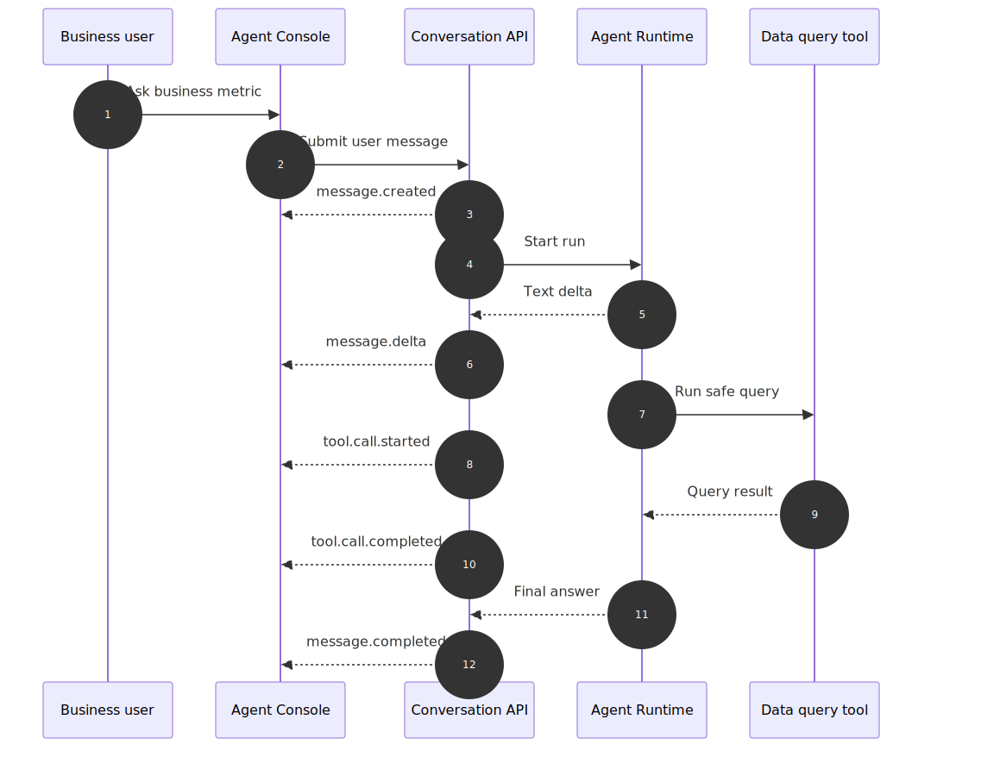
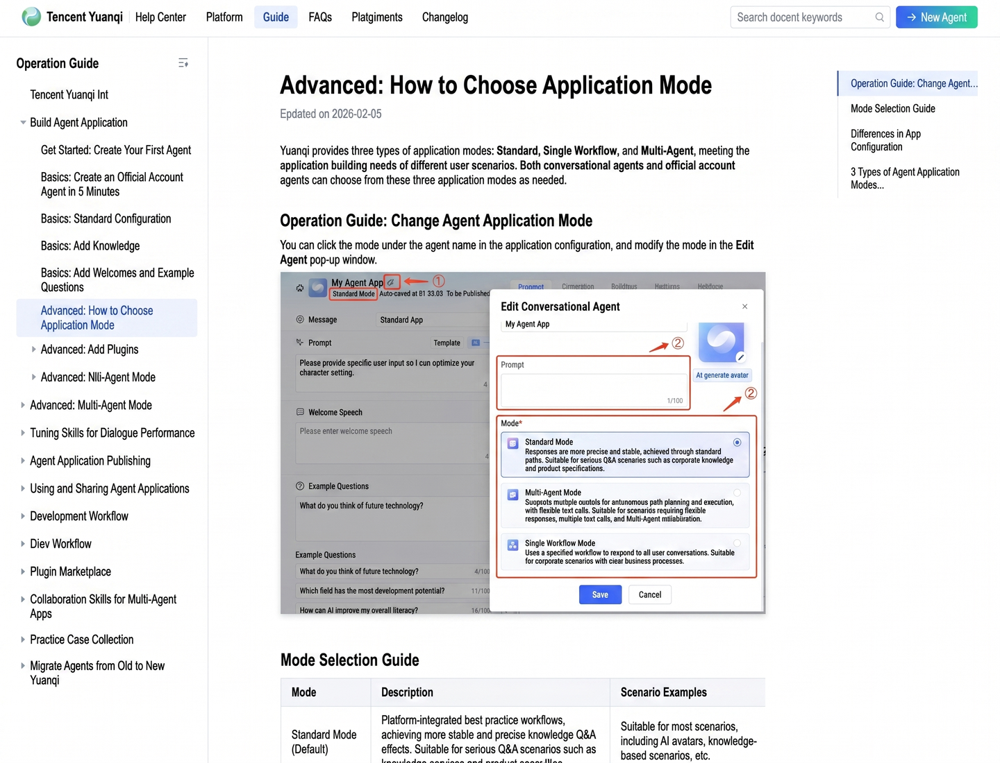
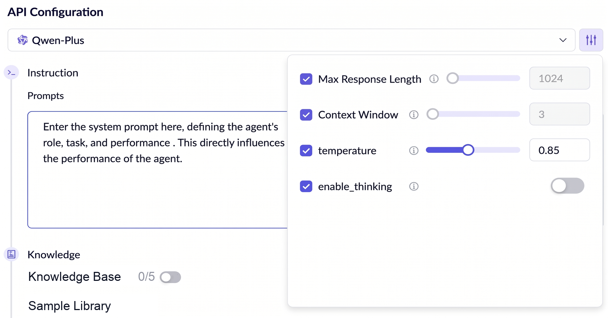
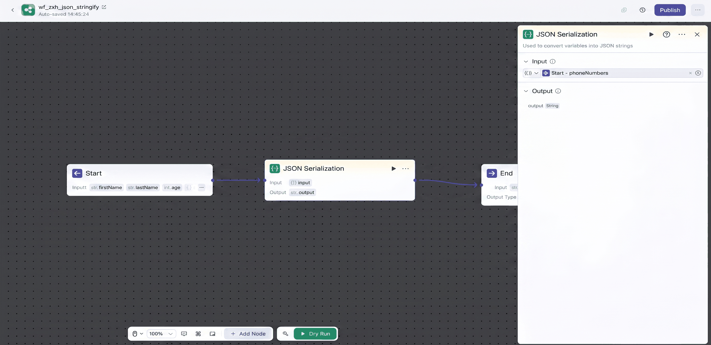

# Chapter 47 Dialogue UI and Streaming Output

---

## Chapter Summary

This chapter discusses dialogue UI and streaming output, explaining how the message model, event protocol, incremental rendering, frontend state, and observability affect the user experience of an Agent. The enterprise Agent frontend is not just a chat box—it must display tool invocation status, approval waiting, editable evidence, task progress, and more. This requires a comprehensive protocol to translate the SSE event stream into UI states that can be incrementally rendered. This chapter presents the composition of enterprise Agent UI, streaming interaction protocol design, message model and incremental rendering strategy, frontend framework selection, and observability construction.

## Key Terms

Dialogue UI, streaming output, SSE, incremental rendering, message model, frontend framework selection

## Learning Objectives

- Be able to describe the constituent elements of enterprise Agent UI and distinguish it from ordinary chat UI.
- Be able to design SSE event protocols that map backend state changes into frontend incrementally renderable messages.
- Be able to choose appropriate frontend frameworks to handle streaming output, tool invocation status, and approval waiting.
- Be able to establish basic frontend observability to aid in locating streaming rendering and state synchronization issues.

---

## Opening Scenario

When enterprises create an Agent UI for the first time, they often oversimplify the problem as “building a chat window.” This usually works for internal demos: a user inputs a question, the model outputs a text, and the frontend renders the Markdown. Once in an enterprise scenario, users quickly ask for more details: which table is the Agent querying, what metric definitions are used, whether an approval is triggered, why something failed, whether generation can continue, and whether this answer can be audited and traced.

Take a retail DataAgent performing gross margin anomaly analysis as an example. If the manager asks, "Which SKUs caused this month's gross margin anomalies in East China?", it's insufficient if the system just answers, “Mainly fresh produce and appliances.” The UI also needs to show the SQL generation process, permission filtering results, data query status, chart cards, referenced metric definitions, export buttons, and user feedback entry points. When the user follows up by asking if it relates to last week's replenishment delay, the frontend must thread previous tool results, current user permissions, and new query tasks together.

In industry products, Agent UI is evolving from “chat components” toward “task workbenches.” Vercel AI SDK packages model calls, streaming output, tool calls, and frontend state as a development framework; assistant-ui focuses on production-ready React chat components; CopilotKit embeds Agents into existing app states; AG-UI tries to abstract the event flow between Agent backend and frontend, shared state, and human-in-the-loop into a protocol. Though these have different origins, they all push the frontend beyond text rendering toward task process management: the process must be visible, actions controllable, failures recoverable, and results auditable.

The current industry approaches can be divided into four categories.

*Table 47-1: Comparison of Industry Agent UI Technical Approaches. Source: Compiled by this book.*

| Approach              | Representative       | Problems Solved                                  | Enterprise Deployment Boundaries                     |
|-----------------------|---------------------|-------------------------------------------------|-----------------------------------------------------|
| Streaming Application SDK | Vercel AI SDK      | Unify model calls, message states, streaming output, tool calls, and frontend hooks | Good for rapid app building, but enterprise permissions, auditing, tracing, and tool governance must be built separately |
| Dialogue Component Framework | assistant-ui      | Offers threads, messages, input boxes, attachments, run status, production-ready UI components | Provides UI infrastructure, not responsible for enterprise Agent runtime or permissions |
| In-App Copilot        | CopilotKit          | Embeds Agent into business apps, supports shared app state, frontend tools, human-in-the-loop | Suitable to augment existing business systems, requires integration of business state and approval policies into platform governance |
| Agent-UI Protocol     | AG-UI               | Connects frontend apps with various Agent backends via event protocols, covering text, tools, state, interactions | Suitable for cross-framework interoperability, but production requires tenant, permissions, auditing and observability standards |

Browser foundational protocols are also forming clear roles. SSE suits one-way server event push, commonly used for text streaming, tool progress, and task status. WebSocket supports bi-directional real-time control, suitable for multi-user collaboration, voice control, and complex app state sync. WebRTC targets real-time audio/video and low-latency media channels—topic of Chapter 49. Enterprises should not blend all three into one “real-time capability,” but clarify which tasks use which channel.

From the enterprise product form perspective, dialogue UIs are also differentiating.

*Table 47-2: Comparison of Enterprise Agent UI Product Forms. Source: Compiled by this book.*

| Product Form           | Representative          | Dialogue UI Role                                  | Insights for Enterprise Platforms                    |
|-----------------------|-------------------------|-------------------------------------------------|-----------------------------------------------------|
| Enterprise Copilot Building Platform | Microsoft Copilot Studio | Enables business teams to build Agents via natural language, themes, actions, and connectors | Dialogue UI must carry action selection, knowledge source, escalation to humans, and performance analysis |
| Business System Agent  | Salesforce Agentforce   | Triggers actions via dialogue inside sales, service, and other business systems, can augment UI | Dialogue UI must bind with business objects, authentication, action permissions, and channel sessions |
| Workflow Agent Platform | ServiceNow AI Agents   | Executes tasks around enterprise workflows and includes lifecycle governance | Dialogue UI is only the entry, backend must connect workflows, monitoring, and governance |
| Open Source/Low Code Agent | Dify Chatflow / Workflow | Uses Chatflow for multi-turn dialogue apps, Workflow for backend task orchestration | Dialogue UI should distinguish “persistent conversations” vs. “one-off task execution” |

Though products vary greatly, their dialogue UIs essentially play the same role: entry to Copilot, interface to confirm business actions, window for workflow observability, or low-code orchestration UI layer. When enterprises build platforms, copying any product’s visual style is less meaningful than implementing conversation context, tool actions, state stream, permission confirmation, and observability loops.

This means the frontend framework cannot define platform boundaries. Frameworks help teams build chat UIs faster; protocols enable various Agent backends to connect frontend; but enterprises still need to define their own message contracts, tool rendering specifications, permission policies, and conversation observability models.

This chapter develops around five questions: what UI units comprise enterprise Agent UI? Why must streaming output be event protocol modeled? How does the message model support incremental rendering? How to select frontend frameworks? How to integrate frontend interactions into observability?

---

## 47.1 Enterprise Agent UI Composition

Enterprise Agent UI is first and foremost a business task entry point, and only second a dialogue interface. A page showing only question and answer bubbles struggles to support data analysis, approval, export, error correction, and audit. Many internal pilots find business users care less about “does the model chat well?” and more about “what did it query, what’s the basis, can I change it, and who is accountable if it fails?”

Enterprise Agent UI can be divided into seven types of interface units.

*Table 47-3: Seven Interface Units of Enterprise Agent UI. Source: Compiled by this book.*

| Interface Unit    | Purpose                           | Enterprise Requirements                            |
|-------------------|---------------------------------|--------------------------------------------------|
| Conversation Entry | Input questions, select workspace, switch task mode | Bind tenant, user, permissions, default data domain |
| Message Stream    | Display user questions, Agent replies, citations, errors | Support streaming, folding, recovery, cite jump  |
| Tool Progress     | Show SQL, retrieval, charts, approval tool states | Only display parameters and results permitted to user |
| Context Panel     | Show current metric definitions, data sources, filters | Avoid user misunderstanding answer applicability |
| Business Controls | Retry, stop, confirm, export, escalate to human | High-risk actions must have server-side secondary validation |
| Feedback Entry    | Likes, dislikes, error correction, human notes | Enter evaluation set and conversation replay      |
| Observability Tags | Trace, latency, model and tool versions | Support troubleshooting, review, and auditing     |

After breaking the interface into units, the relationship between frontend and platform foundation becomes clearer: Runtime, Tool Registry, permission system, and observability system ultimately expose themselves to users through these units. No matter how strong the backend, poor frontend design turns it into a black box.

## 47.2 Streaming Interaction Protocol

The value of streaming output is not just “show text faster.” In enterprise Agents, the streaming protocol must handle task progress, tool state, error recovery, approval insertion, and frontend observability. Model outputting text, Runtime invoking tools, user clicking stop, permission system rejecting action—all should be part of one sortable, recoverable event stream.

*Table 47-4: Core Concepts of Streaming Interaction Protocol. Source: Compiled by this book.*

| Concept          | Definition                                          | Boundary with Adjacent Concepts                   |
|------------------|-----------------------------------------------------|--------------------------------------------------|
| Dialogue UI      | Interaction layer carrying conversation, tool progress, business actions, feedback | Not the same as chat bubble component             |
| Streaming Output | Server breaks generation into events or incremental pieces sent to frontend | Not purely token-by-token typing effect           |
| SSE              | Server-Sent Events, browser receives one-way events via HTTP | Suitable for text gen, tool progress, low-complexity push |
| WebSocket        | Bi-directional long-lived connection protocol        | Suitable for real-time control, multi-user collaboration, voice |
| Incremental Rendering | Frontend updates partial messages, tool cards, and states based on events | Not simple string concatenation; requires idempotency and rollback |
| Frontend Observability | Trace user interactions, render latency, connection recovery, feedback into traces | Not just page visit statistics                     |

Enterprise DataAgent defaults to SSE as the primary transport for text tasks. The reason is simple: most analytic tasks involve server continuously pushing, occasionally interrupted by users; SSE has lower deployment, proxy, and browser support costs. WebSocket is not abandoned, just reserved for voice, multi-end collaboration, and strong real-time control in Chapter 49.

Protocol choice must serve this boundary. Enterprise platforms choose SSE, WebSocket, or WebRTC not to prove technology advancement, but to ensure events in one task can be ordered, recovered, audited, and explained.

### 47.2.1 Misuse Risks in Streaming Interaction

1. **Equating streaming output with token typing effect.** Real tasks require frontend to handle not only text increments but also tool start, progress, finish, approval requests, errors, and final states.
2. **Thinking reliability is backend-only.** If frontend does not handle duplicate events, stale request pollution, connection recovery, and cancellation semantics, wrong renderings still occur.
3. **Assuming using a UI SDK completes enterprise Agent UI.** SDKs improve dev efficiency, but permissions, auditing, observability, fallback, and business state synchronization remain platform responsibilities.
4. **Showing raw tool logs directly to users.** Tool logs are for engineering troubleshooting; users need desensitized, summarized, and explained task statuses.

## 47.3 Message Model and Incremental Rendering

Enterprise dialogue UI is at the top layer of Agent platform, but it should not directly depend on any specific model vendor’s streaming format. A more robust approach is for the Conversation API to convert internal events from Runtime, LLM Gateway, Tool Registry, and Observability into unified frontend events. This way, models can be switched, tools extended, and frontend message state remains stable.



*Figure 47-1: Position of Dialogue UI in enterprise Agent platform. Source: self-drawn. Alt text: A layered diagram with Dialogue UI at the top, connecting downward via HTTP/WebSocket to Agent Runtime, with UI layer annotated with roles: message rendering, state awareness, approval interaction, evidence display.*

Figure 47-1 shows three boundaries:

- The Agent Console does not call models directly. All model interactions pass through Conversation API and Runtime for unified authentication, tracing, rate limiting, and error handling.

- Tool execution results do not directly write to frontend. Structured results from Tool Registry must be refined by Runtime for permission filtering and rendering contract conversion; frontend consumes only displayable events.

- Frontend events also flow back to observability system. User stopping generation, retry clicking, tool card expansion, or submitting negative feedback should link to backend trace; otherwise, online incidents see backend logs but not what user actually saw.

The flow of a streaming Q&A in DataAgent can be abstracted by the following sequence.



*Figure 47-2: DataAgent streaming dialogue sequence. Source: self-drawn. Alt text: Sequence diagram shows user question, server pushes state/token/tool_call/done events; frontend incrementally renders partial content; loading shown during tool call, illustrating real-time collaboration between dialogue UI and Agent execution.*

Figure 47-2 shows the frontend handles not a string stream but a task view. The user sees one answer, but internally the system contains multiple phases: message creation, text increments, tool start, tool finish, and final completion. Any phase failure must correspond to an explainable frontend state.

### 47.3.1 Component Division and Interface Contracts

The enterprise Agent UI message model is suggested to be divided into three layers.

*Table 47-5: Three Layers of Enterprise Agent UI Message Model. Source: Compiled by this book.*

| Layer        | Recorded Content                                  | Why Needed                                         |
|--------------|-------------------------------------------------|---------------------------------------------------|
| Conversation | `conversation_id`, tenant, user, workspace, permission context | Supports multi-turn follow-up, tenant isolation, conversation replay |
| Message      | User message, assistant message, tool message, approval message, error message | Supports display, referencing, feedback, auditing |
| Event        | Incremental events during message generation process | Supports streaming, recovery, idempotency, state machine |

Frontend should not treat events as final message storage. Events represent the process; messages represent the view. The Event Reducer's responsibility is to fold ordered events into stable message trees, tool cards, and error states.



*Figure 47-3: Streaming event model and frontend reducer. Source: self-drawn. Alt text: Left side shows SSE event stream of various types like state/token/tool_call/done, right side shows frontend reducer mapping each event to state updates, arrows illustrate data flow of event-driven UI updates.*

Component division is as follows.

*Table 47-6: Agent UI Component Responsibilities and Failure Modes. Source: Compiled by this book.*

| Component           | Responsibility                              | Input                             | Output                        | Failure Modes                    |
|---------------------|---------------------------------------------|----------------------------------|-------------------------------|---------------------------------|
| Conversation API     | Receive user message, return unified event stream | Conversation ID, user input, context | SSE event stream              | Auth failure, connection break, event disorder |
| Event Reducer       | Fold events into frontend state             | Event sequence                   | Message tree, tool card states | Duplicate events, missing final event |
| Message Renderer    | Render text, references, code, errors       | Message state                   | Readable message              | Markdown injection, render blocking |
| Tool Call Panel     | Display tool call progress and results      | Tool events, schema              | Tool card                    | Oversized tool results, sensitive field leakage |
| Interaction Controller | Handle interruption, retry, confirmation, export | User actions                   | Control events               | Old stream continues after cancellation |
| Observability Adapter | Record frontend events and user feedback   | Trace, event, UI state          | Metrics, logs, replay indices | Trace breaks, privacy leak        |

A minimal streaming request looks like this.

```http
POST /api/conversations/{conversation_id}/messages
Content-Type: application/json

Request:
{
  "message": {
    "role": "user",
    "content": "Which SKUs caused the gross margin anomaly in East China this month?"
  },
  "context": {
    "tenant_id": "retail-demo",
    "workspace_id": "retail-bi",
    "permission_scope": ["sales_summary:read"]
  },
  "stream": true
}

Response:
Content-Type: text/event-stream

event: message.created
data: {"event_id":"evt_1","message_id":"msg_1","run_id":"run_1","seq":1}

event: message.delta
data: {"event_id":"evt_2","message_id":"msg_1","run_id":"run_1","seq":2,"payload":{"content_delta":"Querying now"}}
```

Events must cover at least the following types.

*Table 47-7: DataAgent Streaming Event Contract. Source: Compiled by this book.*

| Event               | Trigger Time                              | Frontend Action                                |
|---------------------|------------------------------------------|------------------------------------------------|
| `message.created`     | Runtime accepts user input and creates assistant message | Create placeholder message                      |
| `message.delta`       | Model or Runtime produces text increment | Append content, keep scroll stable              |
| `tool.call.started`   | Agent prepares to invoke tool            | Show tool card and input summary                 |
| `tool.call.delta`     | Tool produces progress                    | Update stage, row count, elapsed time             |
| `tool.call.completed` | Tool returns structured result            | Fix tool result or data references                 |
| `approval.required`   | High-risk action requires confirmation    | Insert approval card                              |
| `message.completed`   | Assistant message generation complete     | Close generation state, open feedback entry      |
| `error`               | Any stage failure                         | Show retry, fallback, or escalation options      |

Error responses must be stably categorized by frontend. Enterprise systems should not just return a textual error.

```json
{
  "code": "TOOL_PERMISSION_DENIED",
  "reason": "User lacks sales_detail:read permission",
  "recoverable": false,
  "suggested_action": "request_approval",
  "trace_id": "trace_abc",
  "run_id": "run_1"
}
```

This contract essentially constrains event semantics: each event must be sortable, deduplicatable, trace-associated, and identifiable as belonging to the current task.

## 47.4 Agent Frontend Framework Selection

**Trade-off 1: SSE vs WebSocket vs HTTP Chunked Response**

*Table 47-8: Transport Protocol Selection Trade-offs. Source: Compiled by this book.*

| Option              | Advantages                              | Costs                                   | Suitable Scenarios               | mini-platform Choice      |
|---------------------|----------------------------------------|----------------------------------------|---------------------------------|--------------------------|
| SSE                 | Native browser support, easy deployment, suitable for unidirectional model output | Weak bidirectional control, long connection affected by proxies | Text dialogues, tool progress, report generation | Default                  |
| WebSocket           | Bidirectional real-time, supports complex control and collaboration | Gateway, auth, heartbeat, and scaling complexity | Voice, multi-user collaboration, real-time editing | Optional                 |
| HTTP Chunked Response | Simple implementation, easy to access model streams | Weak event semantics on browser side, difficult recovery | Internal demos or minimal tools | Not preferred by default |

**Trade-off 2: Custom Protocol vs Using UI SDK**

*Table 47-9: Frontend Framework and Protocol Selection Trade-offs. Source: Compiled by this book.*

| Option                    | Advantages                              | Costs                                       | Suitable Scenarios           | mini-platform Choice     |
|---------------------------|----------------------------------------|---------------------------------------------|-----------------------------|--------------------------|
| Custom message protocol + lightweight components | High controllability, facilitates governance and auditing | Larger initial development effort            | Enterprise platforms, long-term evolution | Default                  |
| Vercel AI SDK             | Mature ecosystem, good streaming and tool call experience | Requires adaptation for enterprise permissions, auditing, and data boundaries | Frontend quick validation, product prototyping | Reference implementation |
| assistant-ui              | Mature dialogue components, suitable for production UI | Business tool cards still need customization | Agent chat in React apps   | Optional                 |
| CopilotKit / AG-UI        | Emphasizes Agent-app state synchronization | Backend protocol adaptation required        | Embedded Copilot, human-in-loop | Benchmark and experiment |

**Trade-off 3: Client-side token concatenation vs event reducer**

*Table 47-10: Incremental Rendering Strategy Trade-offs. Source: Compiled by this book.*

| Option                    | Advantages                                | Costs                            | Suitable Scenarios           | mini-platform Choice     |
|---------------------------|------------------------------------------|---------------------------------|-----------------------------|--------------------------|
| Client token concatenation | Fastest to implement                      | Cannot express tool state and error recovery | Teaching demos              | Not chosen               |
| Full message refresh      | Simple logic                             | Poor performance for large messages, flicker in interaction | Low-frequency background tasks | Not chosen               |
| Event reducer             | Recoverable, observable, suitable for complex tool flows | Requires strict event contract  | Enterprise Agent UI          | Default                  |

This section’s engineering conclusion: the default enterprise Agent UI solution should be an “evolvable event protocol + controlled components + observability chain.” Framework can change, but protocol and governance boundaries must be preserved.

### 47.4.1 Comparison of Domestic Enterprise Agent / DataAgent UIs

Domestic enterprise Agent product UI lines are also rapidly converging: the entry remains dialogue, but control surfaces are expanding to “app mode selection, capability orchestration, knowledge base/plugin configuration, workflow canvas, testing/debug, release governance.” Tencent Yuanqi, Alibaba Cloud Bailian Model Studio, and ByteDance/Volcano’s Coze exemplify this trend. They may not all call themselves DataAgent, but they solve the same class of enterprise problems: how business users organize models, knowledge, tools, processes, and release controls into runnable intelligent applications.

*Table 47-11: Comparison of Domestic Enterprise Agent UI Products. Source: Compiled by this book.*

| Product / Platform       | UI Focus                                 | Dialogue and Streaming Output Position | Insights for DataAgent                        | Enterprise Deployment Boundaries                   |
|-------------------------|-----------------------------------------|----------------------------------------|-----------------------------------------------|----------------------------------------------------|
| Tencent Yuanqi          | Standard mode, single workflow mode, multi-Agent mode selection, organized around knowledge, plugins, app configs | Dialogue testing is result validation entry; mode selection defines underlying task structure | DataAgent frontend should allow different task modes, not route all questions through one chat link | Enterprises must complement unified permissions, auditing, metric definitions, and cross-system data governance |
| Alibaba Cloud Bailian Model Studio | Agent apps put models, system prompts, knowledge base, plugins, file inputs in an app config panel | Dialogue window used to test Agent; config panel determines model params, knowledge, and plugin abilities | DataAgent needs to integrate model params, knowledge sources, plugin abilities, and test dialogues into one engineering feedback loop | Official docs note some app dev features have version and scope restrictions; production should not rely on console only |
| ByteDance/Volcano Coze | Uses low-code workflows, Chatflow, nodes, plugins, knowledge base to organize Agent capabilities | Dialogue is Chatflow entry; Workflow focuses on automated tasks and node orchestration | DataAgent UI should differentiate “multi-turn dialogue analysis” vs. “backend task orchestration”, mapping node execution states back to message stream | Workflow canvas aids biz orchestration, but enterprise data permission, approvals, and internal system connections require platform governance |

Table 47-11 serves better as a product boundary checklist rather than vendor ranking. Agent UI must cover configuration, runtime, debug, and governance surfaces; chat window is just a part of runtime and cannot replace configuration, orchestration, permissions, and observability. For enterprise DataAgent, a more reasonable product form is: business users raise questions via dialogue, platform displays data domains, metric definitions, and tool status in sidebars, and admins manage knowledge, plugins, approvals, and release policies on configuration surfaces.



*Figure 47-4: Tencent Yuanqi intelligent agent app mode selection interface. Source: product screenshot. Alt text: Interface shows dialogue, workflow, release mode switching entries, annotated layout of Agent config and dialogue preview areas, typical UI structure of Copilot-style Agent building tool.*

Mode selection should happen before user questions, not guessed inside Runtime. The standard mode, single workflow mode, and Multi-Agent mode in Figure 47-4 place this product boundary at the entry point. If DataAgent only retains a unified input box, it becomes difficult to express differences between normal Q&A, data analysis workflows, and multi-role collaboration.



*Figure 47-5: Alibaba Cloud Bailian Model Studio Agent configuration interface. Source: product screenshot. Alt text: UI divided into toolbar, model selection, system prompt, test dialogue, illustrating typical enterprise Agent building platform configuration.*

Configuration surface is not just a backend form for developers. Figure 47-5 places model selection, prompt, knowledge base, and model parameters together, signaling enterprises not to hide quality-affecting settings as backend parameters. For DataAgent, model, knowledge sources, plugin capabilities, and context turn counts must be explainable and reproducible; otherwise, online issues are hard to pinpoint to model, retrieval, or config.



*Figure 47-6: Coze Studio workflow canvas nodes and configuration panel. Source: product screenshot. Alt text: Canvas with multiple workflow nodes connected as a DAG, right panel configures selected node parameters, illustrating low-code Agent orchestration visual workflow UI.*

Multi-step tasks require process views to carry state. The nodes, edges, and right config panel in Figure 47-6 correspond exactly to DataAgent’s query, compute, visualization, approval, and export chain. Dialogue messages can be the user entry, but frontend must also display node execution states, failure points, input/output mapping, and retry boundaries; otherwise, users see only the final answer and not how the task was accomplished.

## 47.5 Reliable Interaction and Frontend Observability

Streaming UI states should not only be “loading” and “done.” Enterprise Agent must express waiting for tools, waiting for approval, user cancellation, network reconnect, degraded completion, and other states.



*Figure 47-7: Streaming UI state machine. Source: self-drawn. Alt text: State machine with idle, streaming, tool_calling, waiting_human, done, error nodes; arrows mark legal transitions triggered by SSE events, showing frontend state driven by backend events.*

Some states are especially underestimated.

**ToolRunning is not just a subset of Streaming.** Tool calls can last tens of seconds and may encounter permission denial, SQL safety interception, or approval. Frontend must independently display tool states rather than show users only “generating.”

**Cancelled must be end-to-end cancellation.** User clicks stop does not just close browser connection. Frontend must stop rendering old events, backend must cancel Runtime task, and tool layer should try to abort ongoing queries.

**Recovering must have clear recovery boundaries.** After SSE disconnects, event cursor can restore; if recovery window expires, frontend should show “continue generation” or “rerun,” rather than silently losing subsequent events.

Streaming UI issues usually appear in connection recovery, event ordering, cancellation semantics, and sensitive result rendering. Table 47-12 summarizes these boundaries into recoverable actions executable both frontend and backend.

*Table 47-12: Streaming UI Failure Modes and Recovery Strategies. Source: Compiled by this book.*

| Failure Mode     | Trigger Condition                          | Recovery Strategy                               |
|------------------|--------------------------------------------|------------------------------------------------|
| Connection Break | SSE disconnect or proxy timeout            | Use event cursor to recover; if impossible, show continue generation option |
| Event Disorder   | Concurrent multi-tool event returns         | Use `seq` and `event_id` for idempotent folding |
| Stale Stream Pollution | Old request returns after user cancellation | Frontend discards invalid events by `run_id`   |
| Oversized Tool Result | Query returns too many rows or large objects | Show summary only in message; use data references for tables |
| Sensitive Field Leakage | Tool results contain unmasked sensitive fields | Backend desensitizes fields; frontend renders whitelist only |
| Markdown Injection | Model outputs scripts or dangerous links   | Disable raw HTML; confirm for external links    |
| Trace Break      | Frontend events lack backend trace association | All events carry trace; frontend reuses same trace |

Frontend observability should cover four categories of signals: experience, reliability, quality, and governance.

*Table 47-13: Frontend Observability Dimensions and Typical Metrics. Source: Compiled by this book.*

| Observability Dimension | Typical Metrics                          | Purpose                                      |
|-------------------------|-----------------------------------------|----------------------------------------------|
| Experience              | Time to first token, full answer time, tool card first frame time | Judge if users feel system is “stuck”       |
| Reliability             | Disconnect rate, recovery success rate, cancellation success rate, duplicate event rate | Troubleshoot streaming pipeline and frontend reducer |
| Quality                 | Negative feedback rate, follow-up rate, copy rate, manual error corrections | Feed offline evaluation and product improvement |
| Governance              | Permission denials, approval triggers, export actions, sensitive field interceptions | Support security auditing and compliance review |

## Chapter Recap

1. The core of enterprise Agent UI is not the chat box, but unified presentation of task status, tool processes, business actions, and audit trails.
2. Streaming output must be modeled by event lifecycles, not just token append.
3. SSE is the default for text DataAgent; WebSocket and WebRTC are reserved for stronger real-time control scenarios.
4. Frontend reducers, event idempotency, recovery cursors, and trace association form the foundation of reliable interactions.
5. UI SDKs help improve development efficiency but cannot replace enterprise-owned permissions, observability, and message contracts.

- Official documentation: [Vercel AI SDK](https://ai-sdk.dev/docs/introduction)
- Official documentation: [assistant-ui](https://www.assistant-ui.com/docs)
- Official documentation: [CopilotKit](https://docs.copilotkit.ai/)
- Official documentation: [AG-UI](https://docs.ag-ui.com/introduction)
- Official documentation: [MDN Server-Sent Events](https://developer.mozilla.org/en-US/docs/Web/API/Server-sent_events)
- Benchmark product: [Microsoft Copilot Studio documentation](https://learn.microsoft.com/en-us/microsoft-copilot-studio/)
- Benchmark product: [Salesforce Agentforce Developer Guide](https://developer.salesforce.com/docs/ai/agentforce/guide/)
- Benchmark product: [ServiceNow AI Agents](https://www.servicenow.com/products/ai-agents.html)
- Benchmark product: [Dify Workflow & Chatflow](https://docs.dify.ai/en/use-dify/build/workflow-chatflow)
- Benchmark product: [Tencent Yuanqi Help Center](https://yuanqi.tencent.com/guide/yuanqi-introduction)
- Benchmark product: [Tencent Yuanqi: How to Choose Application Mode](https://yuanqi.tencent.com/guide/agent-build-choose-mode)
- Benchmark product: [Alibaba Cloud Bailian Model Studio: Agent Application](https://www.alibabacloud.com/help/en/model-studio/single-agent-application)
- Benchmark product: [Coze Low-Code Workflow Introduction](https://www.coze.cn/open/docs/guides/workflow)
- Benchmark product: [Coze Studio: Add New Workflow Node Types (frontend)](https://github.com/coze-dev/coze-studio/wiki/10.-Add-new-workflow-node-types-(frontend))
- Related chapters: 22, 23, 38, 48, 49

---

## References

WHATWG. (n.d.). [Server-sent events](https://html.spec.whatwg.org/multipage/server-sent-events.html).

Vercel. (n.d.). [AI SDK documentation](https://sdk.vercel.ai/docs).

assistant-ui. (n.d.). [Documentation](https://www.assistant-ui.com/docs).

OpenTelemetry. (n.d.). [Documentation](https://opentelemetry.io/docs/).
