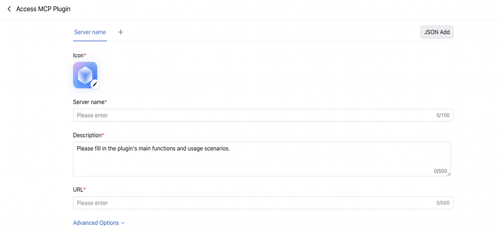
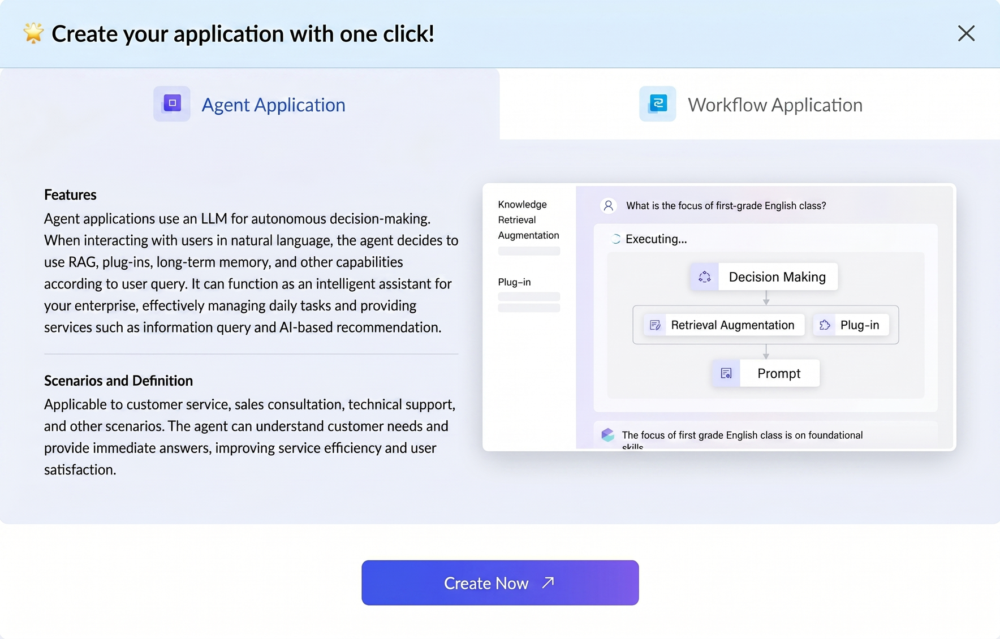
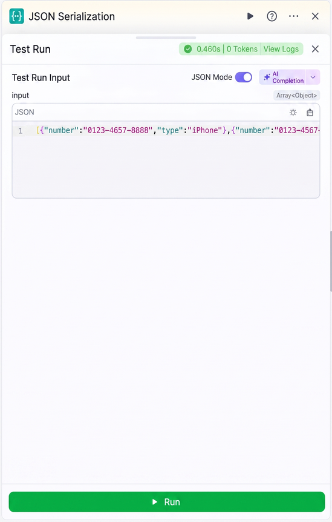
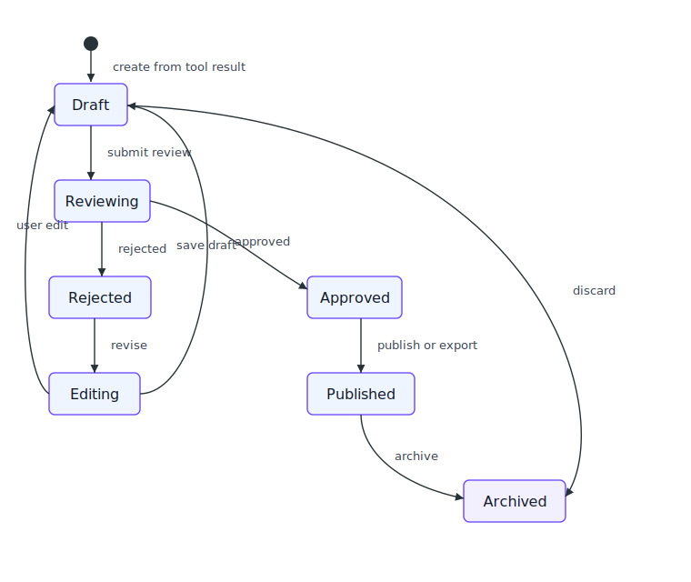
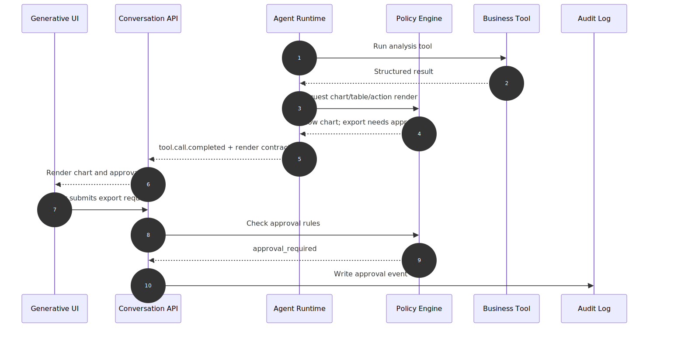
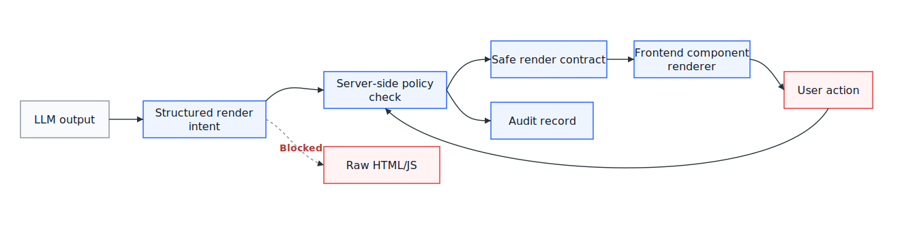

# Chapter 48 Generative UI and Rich Interaction

---

## Chapter Summary

This chapter discusses Generative UI and rich interaction, explaining how editable artifacts, structured rendering, approval controls, security boundaries, and frontend contracts carry forward Agent outputs. Agent output is more than just text; it can include tables, charts, code, fillable forms, and structured conclusions pending approval—these require specially designed rendering components instead of degrading everything into Markdown text. The chapter details how to design structured rendering for tool calls, frontend contracts for editable artifacts, approval control state flows, and security boundaries to prevent XSS in Generative UI.

## Key Terms

Generative UI, editable artifacts, structured rendering, approval controls, frontend contracts, XSS protection

## Learning Objectives

- Explain the differences between Generative UI and ordinary Markdown rendering, including design implications.
- Design structured rendering components for tool call results that display rich content such as charts, tables, and code.
- Define frontend contracts for editable artifacts that support user modifications and write-back to Agent context.
- Identify XSS risks in Generative UI and design secure boundaries.

---

## Opening Scenario

When enterprises first build DataAgent workbenches, they often misunderstand “rich interaction” as simply having the model output more charts or generate more HTML snippets. This approach is risky. Charts without defined metric definitions, tables without field-level permissions, buttons that bypass approvals, and artifacts that overwrite audit trails—all these create rich interfaces but make incident forensics harder.

A prototype like gross margin anomaly analysis in ChatBI easily exposes such issues. When users ask “Which SKUs contributed to margin anomalies in East China this month?” the prototype returns text and a bar chart. After a week of piloting, business teams demand filters by store and category, finance wants to save anomaly analysis as monthly reports, data governance needs SQL replay, metric definitions, approval records, and export audit trails, and security teams watch for sensitive fields leaked by the model “drawing tables.” The dialogue box naturally evolves into a workbench, and model outputs become parts of an interactive interface.

From industry products, Generative UI is shifting from “model-generated pages” to “Agent selecting controlled components.” This is not about redrawing an industry map unrelated to Chapter 47. Instead, it’s about viewing the same Agent UI technologies through a rich interaction lens: Chapter 47 focuses on message streams, chat components, tool progress, and frontend protocols; Chapter 48 focuses on how these capabilities extend to charts, tables, forms, artifacts, and approval cards. Vercel AI SDK, CopilotKit, and AG-UI remain core, but here the concern is not “how to stream output to frontend,” but “how to constrain tool results inside streams into operable interfaces.”

We can think of Chapter 47’s dialogue UI capabilities evolving toward five Generative UI abilities.

*Table 48-1: Capability Evolution from Dialogue UI to Generative UI. Source: Compiled by this book.*

| Existing Chapter 47 Ability | Industry Representative | Additional Rich Interaction Capability Needed in Chapter 48 | Enterprise Deployment Boundary |
|---|---|---|---|
| Streaming messages and tool progress | Vercel AI SDK | Map tool results into whitelisted components like charts, tables, forms | Don’t just pass JSON to React; bind field permissions, data references, audits |
| Production-grade chat components | assistant-ui | Support collapsible tool cards, citation panels, and action entry alongside message flow | Chat components handle basic interaction, not business component registration, approvals, audit trail |
| In-app Copilot with shared state | CopilotKit | Let Agent read/write page state and trigger forms, filters, human-in-the-loop cards | Component actions must integrate with business system permissions, tenant boundaries, approval policies |
| Agent-frontend event protocol | AG-UI | Express UI patches, tool rendering, shared state, interrupts via events | Protocol only unifies interaction semantics; enterprise defines whitelist, policy, observability fields |
| Independent workspace alongside chat | Claude Artifacts / OpenAI Apps SDK | Make reports, chart combos, MCP tool components editable and savable artifacts | Requires versioning, collaboration, data provenance, component security, access control governance |

The layered relationship in Table 48-1 helps teams avoid a common misconception: the value of Generative UI is not to make the interface appear smarter, but to transform tools, business objects, approval logic, and editable artifacts inside dialogue streams into user-verifiable, adjustable, confirmable, and reusable workspaces. This chapter addresses five questions: what exactly the task-oriented interface generates; how tool calls map to controlled components; how artifacts manage lifecycles; how business controls and visualizations avoid misleading users; and finally how UI security and approval flow integrate into platform contracts.

---

## 48.1 Comparison of Generative UI / DataAgent UI in Chinese Enterprises

Chinese enterprise Agent products are also shifting from “dialogue-generated answers” to “dialogue-driven task interfaces.” Chapter 47 already discussed dialogue entry, application modes, and streaming state. This chapter focuses on how tools and components enter controlled interfaces: Tencent Yuanqi integrates MCP plugins as configurable capabilities; Alibaba Cloud Bailian Model Studio distinguishes between Agent Applications and Workflow Applications during app creation; Coze Studio makes node inputs, variables, and trial-run forms into controlled configuration panels. These interfaces share governance approaches rather than visual style: model capabilities converge to tool contracts, process nodes, parameter forms, and run states before becoming user-operable UI.

*Table 48-2: Comparison of Domestic Generative UI / DataAgent UI Products. Source: Compiled by this book.*

| Product / Platform | UI Focus | Generative UI Expression | Inspiration for DataAgent Workbench | Enterprise Deployment Boundary |
|---|---|---|---|---|
| Tencent Yuanqi | Plugin marketplace, MCP plugin access, tool configuration forms | Register external capabilities as controlled tools via server name, description, URL fields | DataAgent query, export, notification, ticket actions should flow through tool registration table then map to UI cards | MCP plugin access ≠ direct enterprise execution; tenant auth, action approval, audit needed |
| Alibaba Cloud Bailian Model Studio | Agent Application vs Workflow Application creation entry | Distinguish autonomous Agent vs orchestrated workflow by app type | Generative UI must first decide if task is “chat component” or “workflow workbench” before choosing rendering | Console app types cannot replace internal component whitelists, field permissions, version governance |
| ByteDance / Volcano Coze Studio | Node inputs, variable forms, trial run, logs | Use node trial run forms to express input schema, run results, debug entry | DataAgent’s tables, charts, forms, approval cards must trace back to debuggable node/tool I/O | Workflow trial run aids validation; data access, permissions, audit trail still require platform-side guarantees |



*Figure 48-1: Tencent Yuanqi MCP plugin configuration form. Source: product UI screenshot. Alt text: form fields showing MCP service address, authentication method, tool list, exemplifying typical Chinese Agent platform external tool integration UI interaction.*

Before embedding tool capabilities into the interface, the platform must first know who the tool is, what it does, and what parameters it exposes. Figure 48-1 makes name, description, URL, and advanced options controlled fields, matching enterprise DataAgent tool registration requirements: the model must not dynamically compose arbitrary external calls; tool registration, schema validation, permissions, and rendering components must tightly bind within the same chain.



*Figure 48-2: Alibaba Cloud Bailian Model Studio application type creation interface. Source: product UI screenshot. Alt text: UI shows cards for assistant application, workflow assistant, with usage scenarios, reflecting enterprise Agent platforms’ task-based differentiated templates.*

Different task forms mean different interface containers. Figure 48-2 puts Agent Application vs Workflow Application branching upfront at creation stage, a detail valuable for platform design: autonomous decision tasks suit in-conversation components, explicit workflows suit workbenches and node state replay. Generative UI does not pack all components into chat but first decides which container fits the task.



*Figure 48-3: Coze Studio single node trial run form. Source: product UI screenshot. Alt text: form shows node name, input parameter area, run result display, illustrating low-code platform debugging UI—input, output, validate single-step logic.*

Debugging must revolve around contracts as well. Figure 48-3 combines inputs, variable types, and run button on one node trial run form, giving enterprise workbenches a concrete reference: schema, form, run result, and logs need to be tied to the same tool node. Simply stuffing raw tool logs back into chat bubbles makes debugging and auditing much harder.

---

## 48.2 Task-Oriented Interactive Interfaces

Enterprise Agent UI usually evolves not by jumping from chat to “auto-generating full apps,” but by starting with task-oriented interaction. Users do not consume model outputs for enjoyment—they want to complete a business task: analyze anomalies, generate reports, submit approvals, export data, fix field mappings, confirm next steps.

Enterprise DataAgent workbenches can be decomposed into six types of task entry points.

*Table 48-3: DataAgent Workbench Task Entry Points. Source: Compiled by this book.*

| Task Entry Point | User Real Intention | Generative UI Carries | Downstream Systems |
|---|---|---|---|
| Anomaly Analysis | Identify causes of margin, inventory, fulfillment anomalies | Charts, tables, metric explanations, drill-in entries | Data warehouse, metrics platform, alerting system |
| Operational Reporting | Summarize analysis into monthly or weekly reports | Editable artifacts, chart citations, version records | Reporting system, document system |
| Parameter Correction | Modify time range, store, category, metric definitions | Filters, forms, recommended parameters | Semantic layer, tool registry |
| Approval Confirmation | Execute export, issue tasks, trigger replenishment suggestions | Approval cards, impact range, evidence list | Policy engine, workflow, auditing system |
| Data Verification | Confirm field mappings, anomalous data, missing definitions | Tables, field explanations, quality alerts | Data governance platform |
| Collaboration Handoff | Transfer to finance, operations, regional managers | Comments, task status, referenced context | Ticketing, messaging, task systems |

Table 48-3 re-centers the discussion on business tasks rather than flashy UI. Every control in enterprise workbench potentially links to tools, permissions, data, and audit. Behind charts lie `data_ref`, metric definitions, and query snapshots; behind buttons lie action permissions, approval policies, and tracing; artifacts are not just bigger message bubbles, but editable, reusable, archivable business artifacts.

In enterprise contexts, Generative UI can be defined as: the Agent selecting, filling, and arranging platform-registered UI components within controlled protocols. The model is not responsible for writing frontend code; it delivers tool results as business objects into the interface.

## 48.3 Tool Call Rendering Patterns

Generative UI boundaries must be clarified at L1 level. Enterprise platforms should not let the model decide DOM, scripts, download links or business actions directly. Instead, the model outputs structured intent that frontend and backend jointly validate before rendering whitelisted components.

*Table 48-4: Generative UI rendering contracts and governance boundaries. Source: Compiled by this book.*

| Concept | Definition | Distinction from Adjacent Concepts |
|---|---|---|
| Generative UI | LLM or Agent selects and fills controlled UI components based on task context | Not equivalent to model generating arbitrary frontend code |
| Tool Call Rendering | Map tool call inputs, states, outputs to cards, charts, tables, or forms | Not equivalent to showing raw tool logs directly to users |
| Artifact | Editable, savable, reusable artifacts outside dialogue, e.g. reports, analysis notes, code, chart combos | Not a message attachment; has lifecycle and versioning |
| Business Controls | Filters, buttons, forms, and approval components bound to business actions | Not decorative UI; triggers permissions and audits |
| Component Whitelist | Platform-allowed component types, fields, versions, and actions Agent may reference | Not full frontend component library; exposure minimized by default |
| Approval Card | Shows impact range, evidence, confirmation before high-risk actions | Not ordinary confirmation popup; requires audit trail and policy binding |

The minimal chain from tool result to UI is: tool execution yields structured result; Runtime attaches permissions and evidence; Render Contract decides renderable component; frontend renders based on whitelist and user permissions; user actions flow back to Policy and Observability. Skipping any step exposes security weaknesses.

Enterprises can classify render targets into five types.

*Table 48-5: Controlled Render Targets for Tool Results. Source: Compiled by this book.*

| Render Target | Typical Input | User Actions | Required Controls |
|---|---|---|---|
| Chart | Aggregated data, chart specs, metric definitions | Switch dimensions, drill down, export image | Show definitions, limit dimensions, keep data snapshot |
| Table | Query results, field explanations, desensitization status | Sort, filter, copy, download | Field-level permissions, row count limit, export approval |
| Form | Tool parameters, business action parameters | Modify parameters, submit tasks | Schema validation, backend secondary auth |
| Artifact | Reports, plans, code, long analyses | Edit, save, submit review, export | Version control, evidence chain, collaboration permissions |
| Approval Card | High-risk actions, impact range, evidence list | Approve, reject, reassign, append notes | Mandatory trace, policy binding, state replay |

The boundaries shown in Table 48-5 are direct: models can suggest components and data bindings but cannot bypass component registry; they can suggest actions but cannot directly execute high-risk actions; they can draft reports but cannot overwrite underlying evidence.

### 48.3.1 Common Pitfalls

1. **Misunderstanding Generative UI as model-generated HTML.** This works in prototypes but is dangerously risky in production. Correct approach: “model selects components, platform renders components, backend validates actions.”
2. **Assuming more charts mean more professionalism.** DataAgent UI must explain definitions, sources, time ranges, and constraints first. Charts without evidence amplify false conclusions.
3. **Treating Artifacts as message attachments.** Once in business flow, Artifacts require versioning, permissions, export, collaboration, approval, and audit lifecycles.
4. **Hiding high-risk buttons only on frontend.** Frontend hiding is experience optimization, cannot replace backend policy checks.
5. **Ignoring historical message replay.** After component upgrades, historical messages and Artifacts must remain readable, auditable, and reproducible.

---

## 48.4 Artifacts and Editable Outputs

Generative UI intersects Tool Registry, Policy, Runtime, Observability, and Console. Backend handles tool execution, permission checks, result structuring, and audit trail; frontend renders whitelist components, displays evidence chain, collects user confirmation and feedback. A stable architecture forbids direct model output rendering on page; instead, a Render Gateway or Conversation API translates internal events into controlled rendering contracts.



*Figure 48-4: Generative UI’s position in enterprise Agent platform. Source: self-drawn. Alt text: layered diagram showing Generative UI located between Agent and user, subscribing downward to tool call results and state events, presenting rich content upward and writing back user edits to Agent, highlighting roles beyond ordinary dialogue UI.*

Figure 48-4 illustrates three boundaries.

First, Tool Registry returns tool capabilities and structured results, not frontend components. Components are chosen via Render Contract to prevent tool developers exposing internal logs, sensitive fields, or debug params directly to users.

Second, Policy governs backend tool execution and frontend actions. Exporting, submitting approvals, reassigning tasks, saving Artifacts, copying detail all are business actions tied to user, tenant, data scope, risk level.

Third, Observability must record interface states users see. Backend tool traces alone are insufficient; platform must know which chart a user viewed, which table expanded, which param modified, which approval action taken.

## 48.5 Business Controls and Data Visualization

Component categorization in enterprise Generative UI should remain restrained. More components mean stronger expressive power but harder governance. Initial versions can start from `chart`, `table`, `form`, `artifact`, and `approval_card`.

*Table 48-6: Generative UI Component Responsibilities and Failure Modes. Source: Compiled by this book.*

| Component | Responsibility | Input | Output | Failure Mode |
|---|---|---|---|---|
| Render Gateway | Defines map from tool results to UI components | tool name, schema, result, policy | rendering contract | schema mismatch, missing component |
| Component Registry | Maintains Agent-allowed component whitelist | component type, version, permission | component definitions | version conflict, unauthorized component |
| Chart Renderer | Renders charts and data summaries | dataset reference, chart spec, definitions | chart card | oversized data, misleading chart |
| Table Renderer | Renders tables, field explanations, desensitization status | row/column data or `data_ref` | table card | sensitive field exposure, browser lag |
| Artifact Workspace | Edits and saves long artifacts | artifact document, evidence refs, version | drafts, reviews, exports | overwriting evidence, edit conflicts |
| Approval Flow | Confirms and approves high-risk actions | actions, impact range, evidence | approval status | approval bypass, state inconsistency |
| UI Telemetry Adapter | Records frontend interactions and render states | traces, component states, user actions | metrics, logs, replay indices | trace breaks, privacy leaks |

Example rendering contract is as follows. It describes a possible future interface—not a fully implemented current API.

```json
{
  "render_id": "render_margin_chart_001",
  "conversation_id": "conv_20260609_001",
  "message_id": "msg_042",
  "tool_call_id": "call_margin_analysis_01",
  "tool_name": "analyze_margin_by_sku",
  "component": "chart",
  "component_version": "1.0",
  "title": "Gross Margin Anomaly SKU Distribution in East China",
  "data_ref": "dataset://retail-demo/margin-analysis/20260609/run_001",
  "spec": {
    "chart_type": "bar",
    "x": "sku_name",
    "y": "gross_margin_delta",
    "color": "category",
    "limit": 20
  },
  "evidence": {
    "metric": "gross_margin_delta",
    "time_range": "2026-06-01/2026-06-09",
    "sql_ref": "sql://trace_abc/query_003"
  },
  "actions": ["drill_down", "export_png"],
  "policy": {
    "mask_fields": ["customer_phone"],
    "requires_approval": false,
    "allowed_roles": ["retail_manager", "finance_analyst"]
  },
  "trace_id": "trace_abc"
}
```

Mapping from tool results to controlled components is shown below.



*Figure 48-5: Rendering contract from tool results to controlled components. Source: self-drawn. Alt text: tool call returns JSON structure; frontend dispatches by `type` field to corresponding rendering components (table, chart, code block, form). Contract constrains both sides disallowing unauthorized rewrites, illustrating frontend-Agent decoupling.*

The most easily underestimated element is `data_ref`. Small tables can be embedded directly in messages; large results must reference datasets instead. `data_ref` lets backend recalculate permissions and desensitize on user expand, filtering or export, avoiding stuffing huge detail inside message streams or browser memory.

### 48.5.1 Artifact Lifecycle and Workspace

Artifacts’ lifecycle should be independent of message lifecycle. Messages are communication logs; artifacts are business products. One conversation can generate multiple artifacts; one artifact can be referenced by subsequent conversations and enter approval, export, archive, or discard workflows.



*Figure 48-6: Artifact lifecycle state machine. Source: self-drawn. Alt text: state machine containing states like generating, generated, editing, committed, archived; arrows mark transitions triggered by user edit, submit, archive, showing full lifecycle management of editable artifacts.*

Operational analysis artifacts must record at least four info categories.

*Table 48-7: Essential Records for Operational Analysis Artifacts. Source: Compiled by this book.*

| Artifact Info | Example | Why Needed |
|---|---|---|
| Content blocks | Operational notes, anomaly causes, action suggestions | Support user editing and collaboration |
| Evidence blocks | SQL, chart parameters, metric definitions, data snapshots | Support auditing and reproducibility |
| Edit records | Model generation, user modifications, approval comments | Distinguish machine suggestions and human judgments |
| Status records | draft, reviewing, approved, exported, archived | Support workflow and accountability |

Editable artifacts must not overwrite original evidence. DataAgent-generated operational analysis reports may allow users to rephrase, but SQL, metric definitions, data snapshots, and chart generation parameters must remain as an audit trail. This supports business glossing while ensuring auditing returns to factual foundations.

## 48.6 UI Security and Approval Processes

Tool call rendering carries higher risk than plain text replies, as it encourages users to click buttons, submit forms, export data, or save conclusions. High-risk UI must be constrained by policies, not freely decided by the model.



*Figure 48-7: UI security and approval sequence. Source: self-drawn. Alt text: sequence diagram showing Agent generating high-risk action, frontend popping up approval controls, user confirming or rejecting, runtime continuing execution on confirm or suspending task on reject, illustrating full approval interaction at UI layer.*

Generative UI failures often occur around component authorization, contract versioning, chart definitions, approval bypass, and export permissions. Table 48-8 maps risks to rendering, approval, and export chains to guide unified frontend policy handling.

*Table 48-8: Generative UI Failure Modes and Recovery Strategies. Source: Compiled by this book.*

| Failure Mode | Trigger Condition | Recovery Strategy |
|---|---|---|
| Component Overreach | Model requests rendering unauthorized component or action | Deny rendering, degrade to safe summary |
| Schema Drift | Tool output fields mismatch component version | Use versioned contracts, frontend shows compatibility errors |
| Misleading Charts | Model selects inappropriate chart or hides denominator | Show chart specs, metrics, sample ranges |
| Approval Bypass | Frontend directly calls business action | All actions revalidated by backend; frontend submits only intents |
| Artifact Pollution | Prompt injection written into report content | Mark generated origin; require manual confirmation for risky sections |
| Data Leakage | Table export bypasses field desensitization | Exports use backend tasks with recalculated permissions |
| Old Version Unplayable | Component upgrades break historic rendering | Retain compatibility layers; degrade to static summaries if needed |



*Figure 48-8: Security boundary between model output and frontend rendering. Source: self-drawn. Alt text: model output passes through HTML escaping, CSP restrictions, sandbox isolation before rendering to DOM; arrows mark each filtering step to prevent malicious script execution from model-generated code.*

The core principle of this security boundary is: the model may express intent, the platform decides permission; frontend may render entry points, backend decides execution; users may edit artifacts but cannot overwrite evidence chains.

### 48.6.1 Design Tradeoffs

**Tradeoff 1: Model-Generated Code vs Component Whitelist**

*Table 48-9: Tradeoffs Between Model-Generated Code and Component Whitelist. Source: Compiled by this book.*

| Approach | Advantages | Costs | Suitable Scenarios | mini-platform Choice |
|---|---|---|---|---|
| Model generates HTML/JS | High expressiveness, rapid prototyping | Poor security boundaries, hard auditing | Experimental sandbox isolation | Not adopted |
| Component whitelist | Secure, controllable, supports permissions and audit | Limited expressiveness, needs component maintenance | Enterprise production systems | Default |
| Model generates config | Moderate flexibility, reusable components | Requires strict schema validation | Charts, forms, report templates | Default |

**Tradeoff 2: In-Dialogue Cards vs Independent Artifact Workspace**

*Table 48-10: Tradeoffs Between In-Dialogue Cards and Independent Artifact Workspace. Source: Compiled by this book.*

| Approach | Advantages | Costs | Suitable Scenarios | mini-platform Choice |
|---|---|---|---|---|
| In-dialogue cards | Continuous context, low user comprehension cost | Poor experience editing long artifacts | Small charts, short tables, approval prompts | Default |
| Independent Artifact workspace | Suits editing, review, export | Requires versioning and permission system | Reports, plans, code, long analyses | Default |
| External system redirection | Reuse mature BI/ERP capabilities | Fragmented context, complex tracing | Mature business system operations | Optional |

**Tradeoff 3: Frontend Direct Data Rendering vs Data Reference Rendering**

*Table 48-11: Tradeoffs Between Frontend Direct Data Rendering and Data Reference Rendering. Source: Compiled by this book.*

| Approach | Advantages | Costs | Suitable Scenarios | mini-platform Choice |
|---|---|---|---|---|
| Embed data directly | Simple, faster first screen load | Lag with large data, higher leak risk | Small summary tables | Limited use |
| `data_ref` references | Permissions recalculable, suits large results | Extra data fetch step | Enterprise data analysis | Default |
| Static screenshots | Good compatibility | Not interactive, hard to audit | Report archiving | Optional |

**Tradeoff 4: Frontend Tool Calls vs Backend Tool Rendering**

*Table 48-12: Tradeoffs Between Frontend Tool Calls and Backend Tool Rendering. Source: Compiled by this book.*

| Approach | Advantages | Costs | Suitable Scenarios | mini-platform Choice |
|---|---|---|---|---|
| Frontend tool calls | Can read app state directly, flexible interaction | Easy to bypass backend governance | Low-risk UI state toggles | Use cautiously |
| Backend tool rendering | Clear permission, audit, data boundaries | Longer interaction chain | Data query, export, approval | Default |
| Hybrid mode | Balanced experience and governance | Complex contracts | Copilot inside business systems | Under evaluation |

If later product-style interface illustrations are needed without replacing Mermaid architecture diagrams, the following prompt can be used:

```text
Generate an enterprise-grade Generative UI DataAgent workbench interface. Left side shows a dialogue task stream, center displays editable operational analysis artifacts, right side shows charts, tables, approval cards, and evidence chain panels. The interface highlights component whitelist, secure approvals, field desensitization, version history, and trace logging. Chinese labels, serious enterprise backend style, white background, blue-gray main colors, without real brands, customer data, exaggerated marketing, or decorative illustrations.
```

## Chapter Recap

1. The production path for Generative UI is controlled component rendering, not arbitrary code generation.
2. Tool call results should be structured first, then mapped to charts, tables, forms, Artifacts, and approval cards.
3. Artifacts are business products, not message attachments; they require versioning, permissions, export, and audit lifecycles.
4. High-risk UI actions must have backend secondary validation; frontend alone is not a secure boundary.
5. Enterprise platforms must establish their own rendering contracts, component whitelists, data references, and UI observability models.

- Official docs: [Vercel AI SDK](https://ai-sdk.dev/docs/introduction)
- Official docs: [Vercel AI SDK Generative User Interfaces](https://ai-sdk.dev/docs/ai-sdk-ui/generative-user-interfaces)
- Official docs: [CopilotKit Generative UI](https://docs.copilotkit.ai/built-in-agent/concepts/generative-ui-overview)
- Official docs: [CopilotKit Human-in-the-Loop](https://docs.copilotkit.ai/human-in-the-loop)
- Official docs: [AG-UI Overview](https://docs.ag-ui.com/introduction)
- Official docs: [AG-UI Interrupts](https://docs.ag-ui.com/concepts/interrupts)
- Official docs: [OpenAI Apps SDK](https://developers.openai.com/apps-sdk)
- Official intro: [Claude Artifacts](https://www.claude.com/blog/artifacts)
- Reference products: [Tencent Yuanqi MCP Plugin Integration](https://yuanqi.tencent.com/guide/plugin-market-integrate-mcp-plugin)
- Reference products: [Alibaba Cloud Bailian Model Studio Agent Application](https://www.alibabacloud.com/help/en/model-studio/single-agent-application)
- Reference products: [Coze Studio Add New Workflow Node Types](https://github.com/coze-dev/coze-studio/wiki/10.-Add-new-workflow-node-types-(frontend))
- Related Chapters: 23, 30, 36, 47, 49, 50

## References

Vercel. (n.d.). [AI SDK documentation](https://sdk.vercel.ai/docs).

Model Context Protocol. (n.d.). [Specification and documentation](https://modelcontextprotocol.io/).

JSON Schema. (n.d.). [Specification](https://json-schema.org/).

W3C. (n.d.). [Web Content Accessibility Guidelines (WCAG) 2.2](https://www.w3.org/TR/WCAG22/).
