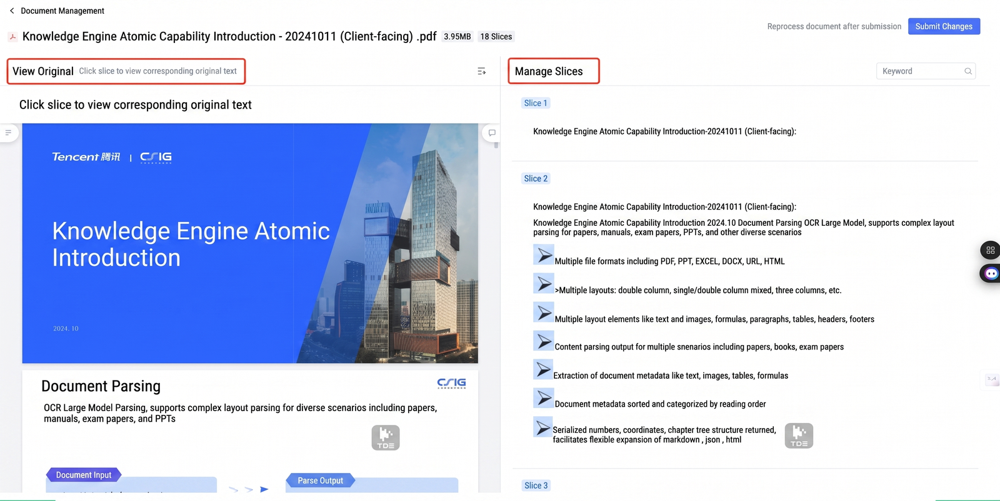
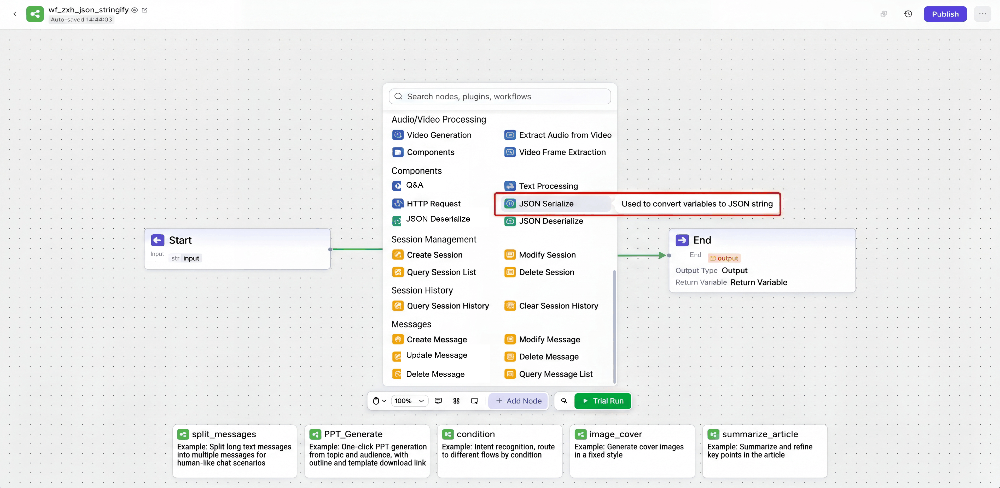
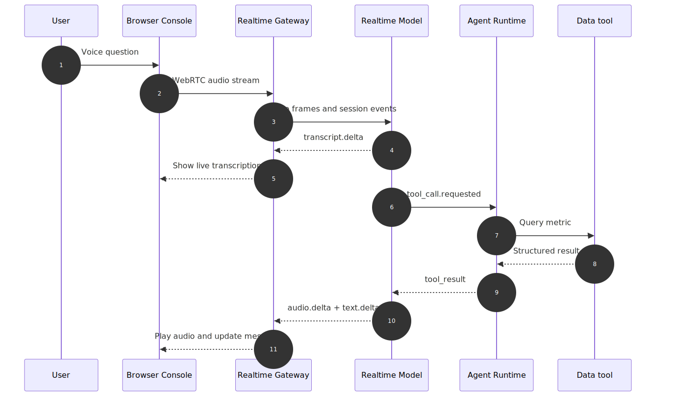

# Chapter 49 Multimodal Input and Voice Agents

---

## Chapter Summary

This chapter discusses multimodal input and voice agents, explaining how documents, images, audio, real-time control, and upload pipelines are integrated into enterprise task interfaces. Inputs beyond text greatly expand the applicability of agents but also introduce new engineering boundaries: files require asynchronous parsing, images require permissions and desensitization, audio demands low latency and real-time control—none of which can be glossed over with a simple "add an API" approach. This chapter provides product boundary judgments for multimodal input, pipeline design for file uploading and asynchronous parsing, and architectural and real-time interaction control details for voice agents.

## Key Terms

Multimodal input, file upload, asynchronous parsing, voice agent, real-time interaction, multimodal permissions

## Learning Objectives

- Explain the boundary differences among file, image, and voice input in enterprise task interfaces.
- Design asynchronous parsing pipelines for file uploads that support large files and complex formats.
- Describe the architecture of voice agents, handling latency, interruption, and real-time feedback control.
- Design permissions, desensitization, and auditing for multimodal input to meet enterprise compliance requirements.

---

## Opening Scenario

When enterprises build multimodal agents, it’s easy to oversimplify the problem: supporting file uploads, integrating speech recognition, and playing voice responses seems to complete multimodality. Once deployed on site, risks quickly emerge. Files may contain cross-tenant data, images may reveal ID badges or customer info, Excel sheets may have merged cells causing field misalignment, speech transcriptions may miss negations, and real-time audio streams may keep playing old answers after the user interrupts.

Business users do not only ask questions by text. A store manager might upload shelf photos asking if the display meets promotion standards; finance might upload Excel sheets to explain unusual fluctuations; after-sales supervisors might provide customer call recordings for complaint summaries; executives may want to ask operational metrics directly via voice. Multimodal input pushes agents from “text Q&A” to “business site interface” while moving permissions, quality, latency, and audit risks to the input stage.

If Chapter 47 addresses how "output continuously reaches the frontend", Chapter 48 how "output becomes actionable UI", then Chapter 49 focuses on "how non-text inputs safely enter context." Therefore, this chapter organizes around input governance and media link layers rather than UI framework components: files, images, and recordings upload first and enter parser queues to produce structured text, layout, tables, metadata, and references for agent usage; browsers or clients use WebRTC, WebSocket, etc., to exchange audio, transcriptions, tool calls, and control events in real time, suitable for voice assistants, customer service, and frontline work. OpenAI Realtime documentation distinguishes browser WebRTC, backend WebSocket, and SIP connection methods; MDN docs clarify media transmission and bidirectional event channel roles of WebRTC vs WebSocket. Enterprise platforms need not make every input real-time nor push every file directly into model context.

Multimodal input capability can be decomposed into four layers.

*Table 49-1: Multimodal Input and Real-Time Media Link Capability Layers. Source: Compiled by author.*

| Capability Layer            | Representative Capability                            | Problems Solved                                 | Enterprise Deployment Boundaries                           |
|----------------------------|----------------------------------------------------|------------------------------------------------|-----------------------------------------------------------|
| Asynchronous File Parsing  | Document parsing, OCR, table extraction, object storage tasks | Converts files into auditable, referable context | Needs virus scan, permission checks, retention cycles, quality reports |
| Real-Time Media Session     | OpenAI Realtime, browser WebRTC                     | Supports low-latency voice, transcription, interruption, tool invocation | Needs temporary credentials, session control, sensitive action confirmation |
| Voice Capability Orchestration | ASR, TTS, recording upload                        | Supports recording analysis, transcription summary, voice playback | Not the same as voice agent; still requires turn management, tool & confirmation governance |
| Browser Capture & Transmission | getUserMedia, WebRTC, WebSocket                    | Enables frontend audio capture and real-time link establishment | Handles authorization, fallback, network jitter, privacy prompts |

Table 49-1 breaks multimodality into input governance, media link, context reference, and audit mechanisms—not just a “model capability toggle.” This chapter develops five core questions: how to define multimodal input boundaries, why file uploads default to asynchronous parsing, how to architect voice agents, how to handle real-time voice interruption and confirmation, and how to implement permissions and audit as engineering contracts.

---

## 49.1 Domestic Multimodal / Voice Agent UI Comparisons

Mainstream Chinese agent and DataAgent platforms show a layered trend for multimodal entry: files and images usually enter conversations as controlled attachments, complex documents need parsing and slicing governance, audio and video are better handled by separate nodes or real-time session control. Tencent Yuanqi’s knowledge base interface places original PDFs, parsed slices, and manual management on the same page; Alibaba Cloud BAILIAN Model Studio supports attachment upload in the agent dialogue and distinguishes image understanding, video understanding, etc. in model selection; Coze Studio exposes audio/video processing, HTTP requests, and text processing nodes on a workflow canvas. Enterprise platforms cannot just pursue entry count; every input type requires authorization, parsing, confirmation, and audit paths.

*Table 49-2: Domestic Multimodal / Voice Agent UI Product Comparison. Source: Compiled by author.*

| Product / Platform          | UI Focus                                             | Multimodal Entry                                  | Lessons for DataAgent                                  | Enterprise Boundaries                              |
|----------------------------|-----------------------------------------------------|-------------------------------------------------|-------------------------------------------------------|---------------------------------------------------|
| Tencent Yuanqi             | Knowledge base document management, original preview and parse slices | Documents like PDF, web pages parsed into manageable slices | Multimodal input isn’t just upload—must expose parsing quality, slice boundaries, manual correction points | Enterprise must add file permissions, content source audit, data domain segregation |
| Alibaba Cloud BAILIAN Model Studio | Agent dialogue input, model selection, multimodal config | Dialogue input area supports attachments; model selection distinguishes image, video understanding | DataAgent should bind attachment entry, model capabilities, parse status to avoid users trusting uploads immediately | Files parsing, field desensitization, retention, and export approval still need platform governance |
| Byte / Volcano Coze Studio | Workflow canvas, node panels, audio-video processing and test runs | Audio, video, text, HTTP, sessions enter workflow via nodes | Voice and file inputs mapped as nodes with status written back to message flow | Canvas orchestration cannot replace tenant permissions, sensitive field detection, and audit trails |



*Figure 49-1: Tencent Yuanqi knowledge base document parse slice management interface. Source: product screenshot. Alt text: Interface showing list of uploaded documents, parse status (parsing/in progress/failed), and block previews, illustrating Chinese agent platform visibility into document parse progress.*

File upload is just the entry point; parsing and slicing determine the quality of subsequent answers. Figure 49-1 is highlighted because it places PDF originals, slice lists, and management entries on the same page: before files enter the agent context, they must be parsed, chunked, quality-assessed, and manually handled, finally entering inference as `context_ref` or knowledge slices.


*Figure 49-2: Alibaba BAILIAN Model Studio dialogue input attachment entry. Source: product screenshot. Alt text: Next to input box, attachment upload icon supports multiple formats like files and images, demonstrating embedding multimodal inputs inside the main dialogue UI.*

The simpler the attachment button, the more governance must follow. Figure 49-2’s input area is straightforward, but enterprise DataAgents can’t let users think "uploaded means trusted immediately"; behind the scenes must be upload tasks, parse quality, permission checks, and `context_ref`; raw files cannot be fed directly to the model.



*Figure 49-3: Coze Studio workflow canvas audio/video and tool node panels. Source: product screenshot. Alt text: Toolbar shows draggable nodes like audio-to-text, video understanding, illustrating low-code platform encapsulation of multimodal capabilities as composable workflow nodes.*

Complex multimodal tasks are better decomposed into nodes rather than hidden behind an upload entry. Figure 49-3’s node panel covers video generation, video audio extraction, video frame extraction, HTTP requests, text processing, and session management capabilities. For enterprise platforms, corresponding input, processing, tool invocation, and runtime state must have composable, replayable node boundaries.

---

## 49.2 Multimodal Input Product Boundaries

The first principle for enterprise multimodal agents is clear boundaries. File uploads are not knowledge base entries, image recognition is not fact confirmation, and speech transcription is not final user intent. Every input type requires parsing, permissions, quality evaluation, user confirmation, and audit trails. Otherwise, the system will treat low-quality OCR, erroneous transcripts, or out-of-scope files as trusted context, polluting subsequent tool calls.

Enterprises can categorize input scenarios by risk and processing methods.

*Table 49-3: Real Inputs, Agent Needs, Default Processing, and Platform Requirements by Multimodal Input Scenario. Source: Compiled by author.*

| Input Scenario          | Real Input                         | Agent Needs                              | Default Processing          | Platform Requirements                  |
|------------------------|----------------------------------|-----------------------------------------|----------------------------|--------------------------------------|
| Business Analysis Attachments | Excel, CSV, PDF reports            | Table structure, metric definitions, field types | Asynchronous parsing        | Format validation, field desensitization, quality reports |
| On-site Images          | Shelves, equipment, receipts, screenshots | Image description, OCR text, region references   | Async parsing + optional visual understanding | PII detection, image permission, manual confirmation |
| Customer Service Recordings | Phone calls, meeting recordings      | Transcripts, speakers, timestamps, summaries      | Async ASR                  | Retention policy, client privacy, transcription confidence |
| Real-time Voice Q&A    | Microphone audio                 | Transcription deltas, user interruptions, tool confirmations | WebRTC real-time session    | Temporary credentials, VAD, fallback, audit |
| Mobile Field Work      | Voice + images + forms          | On-site evidence, task status, confirmation actions | Hybrid mode                | Offline retry, permission caching, risk confirmation |

Table 49-3 focuses on default processing modes rather than how many modalities are supported. Low-risk attachments can asynchronously parse then enter context as references; high-risk files must pass scanning and permission checks first; real-time voice fits short turns and frequent interruptions; recording analysis suits async processing and need not be real-time.

### 49.2.1 Files, Voice, and Context Reference Boundaries

File uploads are recommended to adopt an “object storage + parse task + context reference” pattern. Frontends only upload and display task status; agents do not directly read raw files but read parsed secure references. This enables control of file size, format, virus scans, permissions, desensitization, retries, and audit.

*Table 49-4: Multimodal input types and their governance boundaries. Source: Compiled by this book.*

| Concept          | Definition                                                 | Difference from Adjacent Concepts                                 |
|------------------|------------------------------------------------------------|-------------------------------------------------------------------|
| Multimodal Input | Inputs beyond text: files, images, audio, video, etc.       | Not equal to multimodal models; platforms may combine parsers and unimodal models |
| Asynchronous Parsing | Background tasks parse files after upload, progressively returning status and results | Different from immediate upload-query; suits large files and layouts |
| Context Ref     | Reference pointing to parsed, secure context               | Not raw file URL; carries permissions, version, and quality info |
| ASR              | Automatic Speech Recognition converting audio to text       | Not semantic understanding; still needs intent recognition and confirmation |
| TTS              | Text-to-Speech synthesizing audio from text response        | Not the same as a voice agent, which also manages turns, interruptions, and tools |
| VAD              | Voice Activity Detection determining when user starts/stops speaking | Different from wake words; VAD handles real-time turn segmentation |
| WebRTC           | Browser real-time audio/video communication technology       | Closer to media transmission and network adaptation than WebSocket |
| Realtime Session | Low latency multimodal session exchanging audio, text, tool calls, events | Not normal HTTP request; has session state, temporary credentials, real-time control |

After parsing completes, agents consume `context_ref` instead of file paths. `context_ref` must contain tenant, permissions, source, parse version, quality score, and retention policy. This lets business users trace back “which table was used for this analysis,” “which recording provided this transcript,” or “has this image been desensitized” through system replay.

### 49.2.2 Misuse Risks in Multimodal Input

1. **"You can directly ask questions right after file upload."** Enterprise systems must first perform format validation, virus scanning, parse quality evaluation, permission checks, and reference registration.
2. **"Voice agent is just ASR plus TTS."** Production voice agents also handle interruptions, half/full duplex, noise, latency, turns, tool invocation, and audit.
3. **"Real-time is always more advanced than asynchronous."** Recording analysis, complex table parsing, and receipt recognition are better done asynchronously; forcibly making them real-time sacrifices quality and auditability.
4. **"Multimodal models replace data governance."** Models may understand images and files, but permissions, provenance, field desensitization, and evidence chain remain platform responsibilities.
5. **"Transcript equals final user intent."** ASR may omit words, misrecognize, mix speakers; high-risk tool calls must show textual intents and require user confirmation.

---

## 49.3 File Upload and Asynchronous Parsing

The multimodal input layer sits between the frontend console and the agent runtime, connecting file parsing tools and real-time media services. Its output should not be “raw files” or “raw audio,” but context references marked with permissions, source, and quality.



*Figure 49-4: Position of multimodal input layer in enterprise agent platform. Source: drawn by author. Alt text: Layered diagram showing multimodal input layer below frontend UI and above agent runtime, converting files, images, and audio into agent-consumable context, highlighting permission checks and parsing pipeline as key components.*

Figure 49-4 shows three boundaries:

First, decoupling upload entry and agent runtime. Files first go to object storage and parse tasks; parse results are exposed to runtime via Context Store, avoiding agents reading unmanaged raw files directly.

Second, decoupling real-time media and business actions. Voice streams handle capture, transmission, transcription, playback, and interruption; business actions still go through Tool Registry and Policy layer.

Third, multimodal input must connect to observability. Upload failures, parse warnings, transcription confidence, user corrections, interruptions, confirmations, and tool calls all enter one trace.

### 49.3.1 File Upload and Asynchronous Parsing Pipeline

File upload engineering should be designed around "retryable, degradable, auditable" rather than "ask immediately after upload."


*Figure 49-5: File upload and asynchronous parsing pipeline. Source: drawn by author. Alt text: horizontal pipeline from frontend upload to object storage, triggering async parse task, OCR/document parsing, chunking into vector store, and returning parse status; arrows show parsing running independently from UI to avoid blocking.*

Component responsibilities are:

*Table 49-5: File Upload and Async Parsing Component Responsibilities. Source: Compiled by author.*

| Component       | Responsibility                                | Input                          | Output                        | Failure Mode                   |
|-----------------|-----------------------------------------------|--------------------------------|------------------------------|-------------------------------|
| Upload API      | Receives files and creates parse tasks       | File, metadata, permission context | `upload_id`, `task_id`         | File too large, unsupported format |
| Object Store    | Stores raw files or controlled copies        | File stream, retention policy    | Object reference             | Overlong retention, cross-tenant access |
| Parser Worker   | Performs OCR, table extraction, ASR, layout parsing | Object store reference           | `context_ref`, quality report | Parse failure, low quality     |
| Context Store   | Stores parse results, references, evidence chain | Parse fragments, metadata        | Retrievable context reference | Reference expiry, changed permissions   |
| Quality Gate    | Judges if parse result can enter agent context | Confidence, warnings, field mapping | allow / confirm / reject      | Low-quality content slipping into context |
| Audit Adapter   | Records upload, parse, delete, and consumption | Trace, user, resource            | Audit records                | Trace disconnection, sensitive data leaks |

Example file upload contract:

```http
POST /api/multimodal/uploads
Content-Type: multipart/form-data

Request:
file=@margin_report.xlsx
metadata={"tenant_id":"retail-demo","purpose":"data_agent_context","conversation_id":"conv_001"}

Response:
{
  "upload_id": "upl_001",
  "parse_task_id": "parse_001",
  "status": "queued",
  "max_wait_seconds": 300,
  "trace_id": "trace_mm_001"
}
```

Example parse status event:

```json
{
  "type": "parse.completed",
  "parse_task_id": "parse_001",
  "context_ref": "context://retail-demo/parse_001",
  "quality": {
    "ocr_confidence": 0.94,
    "table_count": 3,
    "warnings": ["merged_cells_detected"]
  },
  "audit": {
    "source_file_hash": "sha256:...",
    "retention_policy": "tenant_default",
    "trace_id": "trace_mm_001"
  }
}
```

This contract enforces the file lifecycle: raw files, parse results, context references, and agent sessions must be traceable; low-quality parses cannot silently enter context; retention and delete policies must be declared on upload.

## 49.4 Voice Agent Architecture

Voice agent pipelines break into six segments: capture, transmission, transcription, understanding, action, synthesis. Browsers typically use WebRTC for low-latency audio links; backend tasks or non-browser clients may use WebSocket. Real-time voice does not imply all logic runs immediately; sensitive tool calls must still pause and go through confirmation.



*Figure 49-6: Voice agent real-time interaction sequence. Source: drawn by author. Alt text: Sequence diagram showing user speaking, VAD detecting speech endpoints, STT converting audio to text, agent processing, TTS synthesis and streaming playback, with state switches on user interruption, illustrating low-latency voice design.*

## 49.5 Real-Time Voice Interaction Control

Real-time voice session events minimally cover these types:

*Table 49-6: Real-Time Voice Session Event Contract. Source: Compiled by author.*

| Event                 | Trigger                                  | Frontend Action                  | Backend Action                     |
|-----------------------|-----------------------------------------|---------------------------------|----------------------------------|
| `session.created`      | After temporary credential creation     | Prepare to connect media channel | Bind user, tenant, and trace info |
| `audio.input.started`  | VAD detects user speaking                | Show listening status            | Start receiving audio frames      |
| `transcript.delta`     | ASR produces incremental transcription  | Display real-time subtitles      | Accumulate turn text              |
| `response.audio.delta` | Model or TTS generates audio             | Add to playback queue            | Record `response_id`              |
| `tool.approval_required` | Triggers high-risk action               | Pause playback, show approval card | Wait for user confirmation       |
| `response.cancelled`   | User interrupts or cancels               | Clear old audio queue            | Cancel current response            |
| `session.closed`       | Session ended or timed out                | Release mic and player           | Close session and finalize audit |

Real-time session event example:

```json
{
  "session_id": "rt_001",
  "type": "transcript.delta",
  "seq": 23,
  "payload": {
    "text_delta": "华东区本月",
    "speaker": "user",
    "is_final": false
  },
  "trace_id": "trace_voice_001"
}
```

The engineering challenge of voice agents lies in turn management. When the user interrupts, the frontend must stop local playback, the backend must cancel the current response, and any late-arriving old audio or tool events must be discarded by matching `response_id`. Otherwise, the user has moved to the next question but the system is still playing the previous answer.

## 49.6 Multimodal Permissions and Audit Trails

Multimodal input moves risks to the "input stage." Files may have sensitive fields, images may contain faces or badges, recordings may include customer privacy. The platform must complete permission checks and minimize exposure before agents use such content.


*Figure 49-7: Multimodal input governance state machine. Source: drawn by author. Alt text: State machine with states uploading, scanning, quarantined, parsing, ready, expired, with arrows showing transitions triggered by permission checks, virus scan, parse completion, expiry, reflecting full file lifecycle governance.*

Multimodal input faults often occur before agent inference: file over-permission, low OCR confidence, images containing private info, or distorted speech transcripts. Table 49-7 places these issues into input governance to prevent dirty inputs contaminating tool chains.

*Table 49-7: Multimodal Input Failure Modes and Recovery Strategies. Source: Compiled by author.*

| Failure Mode          | Trigger Condition                              | Recovery Strategy                                |
|----------------------|------------------------------------------------|-------------------------------------------------|
| Low parsing quality   | Low OCR confidence or incomplete table structure | Request user confirmation of key fields or manual verification |
| File over-permission  | User uploads a file outside current tenant or project | Deny entry to context, log security event        |
| Image privacy leaks   | Image contains faces, badges, customer names      | Desensitize, crop, or deny context entry          |
| Speech misrecognition | Noise, accent, multiple speakers cause transcription errors | Display real-time text, require user confirmation before sensitive actions |
| Excessive real-time delay | Network jitter, slow model response              | Fallback to push-to-talk, text input, or recording upload |
| Failed interruption  | Model still playing old response                  | Frontend stops playback; backend cancels current response, discards old audio events |
| Missing audit        | Audio, files, tool calls lack unified trace       | Generate trace at session start; all inputs & calls inherit trace |


*Figure 49-8: Real-time voice control pipeline. Source: drawn by author. Alt text: Pipeline illustrating audio capture from microphone, VAD endpoint detection, STT recognition, agent inference, TTS synthesis, to speaker playback, marking interruption points and latency control, showing full real-time voice interaction flow.*

Audit records must answer five questions at minimum: who uploaded or spoke what, how the system parsed it, what entered the agent context, what tools were triggered, and what sensitive actions were user confirmed. Without these records, multimodal agents are harder to audit than text agents because raw inputs are usually more complex, sensitive, and harder to manually review quickly.

### 49.6.1 Design Tradeoffs

**Tradeoff 1: Asynchronous Parsing vs Synchronous Q&A**

*Table 49-8: Tradeoffs Between Asynchronous Parsing and Synchronous Q&A. Source: Compiled by author.*

| Approach          | Advantages                           | Cost                          | Suitable Scenarios           | mini-platform Choice      |
|-------------------|------------------------------------|-------------------------------|-----------------------------|---------------------------|
| Asynchronous Parsing | Handles large files, easy scan/retry/audit | User waits for task completion | Enterprise files, tables, recordings | Default                   |
| Synchronous Q&A     | Simple, immediate experience       | High timeout/failure rate, weak governance | Small images or short text | Limited use               |
| Pre-ingestion       | High retrieval efficiency, reusable | High ingestion governance cost | Stable knowledge bases      | Covered in Chapters 20/19 |

**Tradeoff 2: WebRTC vs WebSocket vs Recording Upload**

*Table 49-9: Tradeoffs Among WebRTC, WebSocket, and Recording Upload. Source: Compiled by author.*

| Approach          | Advantages                            | Cost                          | Suitable Scenarios          | mini-platform Choice      |
|-------------------|-------------------------------------|-------------------------------|----------------------------|---------------------------|
| WebRTC            | Low latency, fits browser audio, good network adaptation | Debug and backend integration complexity | Browser real-time voice agents | Default                   |
| WebSocket         | Simple protocol, suits server-to-server events | Weaker media handling than WebRTC | Backend recording, non-browser clients | Optional                  |
| Recording Upload  | Simplest implementation, offline processing possible | No real-time interruption support | Meeting minutes, customer recording analysis | Optional                  |

**Tradeoff 3: Direct Multimodal Model vs Parser Pipeline**

*Table 49-10: Tradeoffs Between Direct Multimodal Models and Parser Pipelines. Source: Compiled by author.*

| Approach           | Advantages                           | Cost                          | Suitable Scenarios           | mini-platform Choice      |
|--------------------|------------------------------------|-------------------------------|-----------------------------|---------------------------|
| Direct Multimodal Model | Handles complex visual semantics  | High cost, weak evidence structure | Image understanding, field inspection | Optional                  |
| Parser Pipeline    | Strong structured outputs, easier audit/retrieval | Weaker on complex image semantics | Documents, tables, receipts, recordings | Default                   |
| Hybrid Mode        | Balances semantics and structure   | Complex orchestration          | High-value workflows         | To be evaluated           |

**Tradeoff 4: Save Raw Audio vs Transcript Only**

*Table 49-11: Tradeoffs of Raw Audio and Transcript Retention. Source: Compiled by author.*

| Approach            | Advantages                             | Cost                           | Suitable Scenarios           | mini-platform Choice       |
|---------------------|--------------------------------------|--------------------------------|-----------------------------|----------------------------|
| Save Raw Audio      | Easier review and quality control      | High privacy and storage risk   | Customer service quality, compliance retention | Per tenant policy         |
| Transcript Only     | Lower risk and cost                    | Harder to verify misrecognition | General voice assistants     | Default                    |
| Save Summaries and Confirmation Logs | Minimal retention                | Difficult full dispute reviews | Low-risk internal assistants | Optional                   |

If product-style UI supplement images are needed later without replacing Mermaid architecture diagrams, the following prompt can be used:

```text
Generate an enterprise multimodal agent console interface. The interface includes file upload parse tasks, real-time voice transcription, voice playback controls, permission audit panel, and DataAgent answer area. Visual style is serious enterprise backend, emphasizing low-latency voice chain, file parse quality, sensitive field desensitization, user confirmation, and traceable audit trails. Labels in Chinese, white background, blue-gray primary colors, no real brand, no real personal info, no exaggerated marketing style.
```

## Chapter Recap

1. Multimodal input expands business entry points but increases permission, quality, and audit risks.
2. File uploads by default should use asynchronous parsing and context references; agents should not directly consume raw files.
3. Voice agents are more than ASR plus TTS — they require turn management, interruption, confirmation, and degradation strategies.
4. Browsers typically use WebRTC for real-time voice; backends or non-browser clients can use WebSocket.
5. Sensitive actions must be confirmed after transcription; real-time recognition results should not be treated as final intents.

- Official docs: [OpenAI Realtime API](https://developers.openai.com/api/docs/guides/realtime)
- Official docs: [OpenAI Audio and speech](https://developers.openai.com/api/docs/guides/audio)
- Official docs: [MDN WebRTC API](https://developer.mozilla.org/en-US/docs/Web/API/WebRTC_API)
- Official docs: [MDN WebSocket API](https://developer.mozilla.org/en-US/docs/Web/API/WebSocket)
- Official docs: [MDN MediaDevices getUserMedia](https://developer.mozilla.org/en-US/docs/Web/API/MediaDevices/getUserMedia)
- Reference product: [Tencent Yuanqi: Document Parsing and Chunked Intervention](https://yuanqi.tencent.com/guide/parsing-splitting-intervention)
- Reference product: [Alibaba Cloud BAILIAN Model Studio: Agent Application](https://www.alibabacloud.com/help/en/model-studio/single-agent-application)
- Reference product: [Coze: Low-Code Workflow Introduction](https://www.coze.cn/open/docs/guides/workflow)
- Reference product: [Coze Studio: Add New Workflow Node Types](https://github.com/coze-dev/coze-studio/wiki/10.-Add-new-workflow-node-types-(frontend))
- Related chapters: Chapters 19, 22, 47, 48, 50

## References

Radford, A. et al. (2023). [*Robust Speech Recognition via Large-Scale Weak Supervision*](https://arxiv.org/abs/2212.04356). ICML.

W3C. (n.d.). [WebRTC 1.0: Real-Time Communication Between Browsers](https://www.w3.org/TR/webrtc/).

Web Speech API. (n.d.). [Specification](https://webaudio.github.io/web-speech-api/).

OpenAI. (n.d.). [Realtime API documentation](https://platform.openai.com/docs/guides/realtime).
