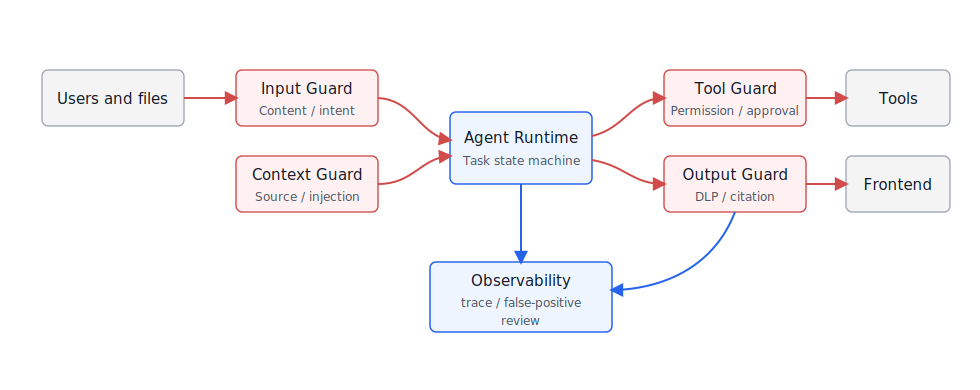
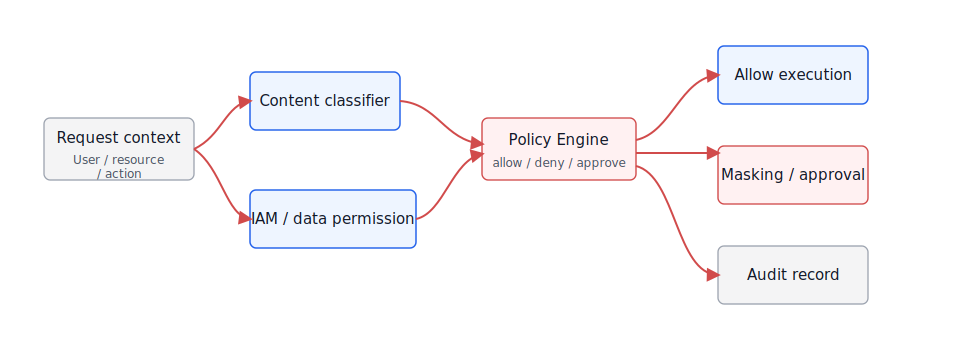
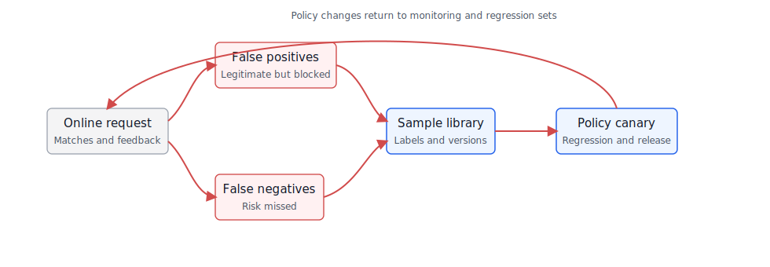

# Chapter 51 Guardrails and Content Safety

-----

## Chapter Summary

This chapter discusses guardrails and content safety, explaining how control points such as inputs, retrieval, tools, outputs, and human review together form an auditable policy network. Guardrails are not merely keyword filters—they must be enforced at multiple stages throughout the agent execution pipeline, with policies that are configurable, auditable, and version-controlled. The chapter presents a layered guardrails architecture, locations for deploying content safety classifiers, the design of a programmable policy engine, and how redaction and output validation focus on the final response rather than only the input.

## Key Terms

Guardrails, content safety, layered architecture, programmable policies, data masking, output validation

## Learning Objectives

  - Be able to explain the deployment strategy of Guardrails at various control points in the Agent execution pipeline.
  - Be able to design a configurable and versioned policy engine to enable traceability of rule changes.
  - Be able to deploy content safety classifiers on both input and output sides to cover different types of risks.
  - Be able to design data masking and output validation mechanisms to prevent leakage of sensitive data through Agent outputs.

-----

## Opening Scenario

The term "Guardrails" is often misunderstood as simply "adding a layer of content moderation before and after the model." This is only part of the picture. Guardrails for enterprise agents must cover at least four types of constraints: content safety—to prevent illegal, harmful, sensitive, or inappropriate content outputs; permission security—to prevent unauthorized access and tool misuse; business security—to enforce compliance with workflows, official guidelines, approvals, and risk controls; and engineering safety—to prevent unparseable outputs, dangerous code, unsupported answers, and runaway retries.

NVIDIA NeMo Guardrails provides a framework of rails around dialogue flow, retrieval, and tool behavior; services like Meta Llama Guard, OpenAI Moderation, and Azure AI Content Safety productize content classifiers; many enterprises also integrate their own sensitive word lists, DLP (Data Loss Prevention), PII detection, and approval policies at the gateway layer. These approaches are not mutually exclusive but should coexist within a unified platform architecture with clear responsibilities.

This chapter follows the order of enterprise implementation: first clarifying the layered architecture of Guardrails, then discussing content safety classifiers and policy engines, followed by desensitization filtering and output validation, and finally addressing false positives and false negatives governance along with configurable gateway experiments.

## 51.1 Guardrails Layered Architecture

The first principle of Guardrails is layering. Input guardrails process user messages, attachments, and URLs; context guardrails handle retrieved documents and tool return values; tool guardrails manage action authorization; output guardrails oversee final answers, charts, code, and exports; observation guardrails record policy hits and false positive examples. Calling all these simply "content moderation" would obscure the true engineering boundaries.

Looking along the execution chain, Guardrails are not a single component but a set of control points distributed across different places. Table 51-1 breaks down responsibilities by execution location, continuing the attack surface discussion from Chapter 50 and turning the question of "where to intercept, where to sanitize, and where to approve" into an engineering problem.

*Table 51-1: Guardrails Layered Responsibilities. Source: This book.*

| Layer             | Checked Object                                          | Typical Policies                                                        | Actions on Failure                                            |
| ----------------- | ------------------------------------------------------- | ----------------------------------------------------------------------- | ------------------------------------------------------------- |
| Input Layer       | User messages, attachments, URLs, speech transcriptions | Content security, intent risks, authorization overreach, rate limits    | Reject, Clarify, Downgrade, Human escalation                  |
| Context Layer     | RAG chunks, webpages, tool return values, memory        | Source trust, injection detection, sensitive fields, stale content      | Isolation, Sanitization, Weight reduction, Block from context |
| Tool Layer        | Tool names, parameters, resources, action types         | RBAC/ABAC, risk levels, approval, idempotency                           | Reject, Require confirmation, Issue short tokens              |
| Output Layer      | Text, SQL, code, charts, export files                   | Content safety, citation verification, format checking, DLP             | Rewrite, Refuse answer, Sanitization, Risk tagging            |
| Observation Layer | Policy hits, user feedback, human review                | Hit rate, false positives, false negatives, drift, incident correlation | Alert, Regression, Policy version adjustment                  |

If these five layers existed only in documents, they could easily be implemented as a scattered collection of rules. The layout in Figure 51-1 places them back around the Agent Runtime: blue indicates platform internal control points, gray external systems, and red control flows represent policy decisions. It emphasizes a simple judgment: Guardrails are not a single proxy layer outside the model but a policy network spanning the entire task execution chain.

*Figure 51-1: Guardrails Layered Architecture. Source: This book. Alt text: From top to bottom, divided into input guardrails (monitoring user input), retrieval guardrails (filtering retrieval content), tool guardrails (validating tool call parameters), and output guardrails (reviewing final answers), each annotated with control points and typical policies.*

The value of this diagram lies in breaking "interception" into multiple timing points. The input layer can judge whether the user is requesting sensitive details, but doesn’t know which fields subsequent retrieval might expose; the context layer can isolate low-trust documents but cannot judge if tool parameters are unauthorized; the output layer can sanitize, but if the original tool result has already entered frontend state, leakage has occurred. Guardrails in DataAgent should also be implemented according to this structure: whether field descriptions and historical SQL are accessible by the current role, whether SQL includes tenant filtering and field permissions, whether charts, tables, and explanations leak sensitive information—all must be handled at their respective stages, with the observation layer collecting rejected queries and manual rewrites as evaluation samples.

The layered design also avoids a common misjudgment: treating "final answer safety" as "the entire chain is safe." For example, a user might never see a customer phone number, but the tool layer has already returned the full details to the Runtime; the output layer sanitizes the response, but traces, cache, or frontend state still store the original text. Another example is when user input itself is benign, but retrieved webpages contain prompt injection that induces the model to call an export tool. Auditing only at input and output cannot detect such mid-chain risks. Therefore, Guardrails must be deployed along data and action flows, with each layer clearly defining what it intercepts, possible actions it can take, and where it stores evidence on failure.

## 51.2 Content Safety Classifier

A content safety classifier addresses the question: "What risk category does this content belong to?" Tools like Azure AI Content Safety, OpenAI Moderation, and Llama Guard generally cover common categories such as violence, self-harm, pornography, hate speech, illegality, and dangerous advice. Enterprises need to supplement these with industry-specific categories, for example, financial investment advice, medical diagnostic advice, classified information, customer privacy, employee privacy, and brand risk.

Classification itself is not the ultimate goal. What enterprises really care about is, once a risk category is detected, whether the platform should reject, redact, require approval, downgrade, or allow the content. Table 51-2 therefore directly maps content categories to platform actions, avoiding having classifier results linger simply as "high/medium/low risk" labels.

*Table 51-2: Mapping content safety categories to platform actions. Source: compiled by the author.*

| Category                     | Typical Content                                                                       | Platform Action                                                         |
| ---------------------------- | ------------------------------------------------------------------------------------- | ----------------------------------------------------------------------- |
| Explicitly Prohibited        | Illegal activities, serious harm, malicious code, credential theft                    | Reject response, log security incident                                  |
| High-Risk Sensitive          | Medical, financial, legal, HR, minors, customer privacy                               | Restrict to general information, require manual or expert system review |
| Enterprise Sensitive         | Keys, contract pricing, salaries, customer lists, unpublished financial reports       | Redact, reject, or return summary by role                               |
| Answerable Within Boundaries | Compliance explanations, process instructions, product limitations, internal policies | Respond with scope and references attached                              |
| Normal Business              | General knowledge Q\&A, low-risk data analysis, document summarization                | Allow, retain trace                                                     |

The challenge of classification is not calling the API, but the context. The same text may be treated differently in different scenarios. For example, the query "Export customer phone numbers" may require approval under a customer service manager role, but should be rejected under a normal sales role. The request "Generate layoff communication scripts" might be legitimate as part of HR compliance training but should be restricted in casual chat. The enterprise platform must feed the content classification results together with user identity, role, data domain, and task type into its policy engine.

Classifiers also cannot replace business judgment. General classifiers usually identify risks like violence, self-harm, pornography, and hate speech. More challenging for enterprises are narrow-scope content types such as unpublished financial reports, customer lists, employee performance, contract floor prices, vendor ratings, and incident root cause analyses. These materials may be linguistically normal but should not be accessible or exportable by certain roles. Platforms need to unify generic content safety, enterprise DLP, field-level permissions, and task intent into a single decision—not simply rely on a classifier’s low-risk score to allow passage.

## 51.3 Programmable Policy Engine

The content security classifier provides a risk assessment, and the programmable policy engine decides on actions such as "allow, deny, mask, require approval, downgrade, log." The policy engine is the core of Guardrails because enterprise security requirements change across organizations, business domains, regions, and regulations. You cannot hardcode all rules in prompts or application code.

A policy request can be designed with the following structure:

    {
      "trace_id": "trace_guard_001",
      "stage": "tool_call",
      "user": {
        "user_id": "u_1024",
        "tenant_id": "tenant_a",
        "roles": ["sales_manager"]
      },
      "request": {
        "tool_name": "query_customer_metrics",
        "action_type": "export",
        "resource": "dataset://crm/customer_profile",
        "fields": ["customer_id", "customer_phone", "region", "revenue"]
      },
      "risk": {
        "content_categories": ["enterprise_sensitive"],
        "sensitive_fields": ["customer_phone"],
        "risk_level": "high"
      }
    }

The policy response must also be structured; it cannot just return a natural language paragraph.

    {
      "decision": "require_approval",
      "policy_id": "customer_pii_export_v3",
      "reason": "customer_phone export requires manager approval and masking",
      "actions": [
        {"type": "mask_field", "field": "customer_phone"},
        {"type": "require_human_approval", "approval_flow": "pii_export"}
      ],
      "audit": {
        "trace_id": "trace_guard_001",
        "severity": "high"
      }
    }

Policy implementation can start simply but cannot remain scattered across prompts and application code. The trade-off conclusions in Table 51-3 are straightforward: the first version does not need complex policy languages; start by making rules configurable, versioned, and auditable, then introduce stronger policy engines or DSLs later.

*Table 51-3: Trade-offs for Guardrails Policy Implementation. Source: compiled by this book.*

| Approach            | Advantages                                             | Costs                                                           | Applicable Scenarios                                 | Mini-platform Choice                                 |
| ------------------- | ------------------------------------------------------ | --------------------------------------------------------------- | ---------------------------------------------------- | ---------------------------------------------------- |
| Prompt Rules        | Fastest to implement; good for prototypes              | Unstable, not auditable, hard to revert                         | Low-risk demos, quick validation                     | Only as auxiliary explanation, not production policy |
| In-app if-else      | Simple and direct; few dependencies                    | Repetitive across apps, version chaos, hard to unify governance | Single app, temporary rules                          | Not default for platform                             |
| Configured Policies | Auditable, versioned, easy to do gradual rollout       | Limited capability expressing complex logic                     | Most content security, field masking, approval rules | Default approach                                     |
| Policy Engine / DSL | Highly expressive; can integrate IAM and data policies | Higher learning and ops cost                                    | Multi-tenant, cross-system, high-risk tools          | Introduced progressively as advanced capability      |

In this chain, the policy engine does not replace models or business systems. In Figure 51-2, it sits between model intent, tool actions, and output presentation. Its responsibility is to provide interpretable reasons for every interception, approval, masking, and release.

*Figure 51-2: Programmable Policy Engine Flow. Source: drawn by this book. Alt text: The policy engine starts from input events, then passes through rule matching, classifier scoring, risk assessment, action execution (intercept/downgrade/approval/release). Each step’s result is written to audit logs, demonstrating policy configurability and full auditability.*

Figure 51-2 shows that the policy engine does not process a single plain text input, but a decision request with identity, scenario, tools, resources, and risk tags. This structured input determines whether policies can be audited and reproduced: if the policy layer only receives “model intends to query customer data,” it cannot tell whether this is a legitimate analysis, an unauthorized export, or an action induced by prompt injection.

Policy versions must also enter the trace. Whether a rejection, approval, or masking was reasonable often arises during user appeals or incident retrospectives. If the system only records the final decision without logging `policy_id`, policy version, matched conditions, or user roles at the time, reviews can only rely on guesswork. A more robust approach treats policy release as a configuration release: with change notes, rollout scope, rollback procedures, and regression cases. This lets security teams tighten high-risk rules while business teams can see why false positives rise and identify responsible policies.

## 51.4 Desensitization Filtering and Output Validation

Desensitization should not occur only in the final answer. Sensitive information may appear in user inputs, retrieval context, tool results, intermediate model outputs, frontend component states, logs, and exported files. A common incident is that the final answer does not display a phone number, but the complete tool result including that phone number has already been written into traces or browser state.

If desensitization is only applied at the final answer stage, it is already too late. The risk of the same field appearing varies across the input, retrieval context, tool results, frontend state, and exported files. Table 51-4 corresponds to these key locations, guiding the platform to decide at an early stage in the data flow which content must not enter the model or logs.

*Table 51-4: Locations for Desensitization and Output Validation. Source: Compiled for this book.*

| Location                  | Content Checked                                              | Handling Method                                                            |
| ------------------------- | ------------------------------------------------------------ | -------------------------------------------------------------------------- |
| Before input enters model | User-pasted keys, ID cards, customer information             | Mark, desensitize, block from entering context                             |
| RAG context assembly      | Sensitive fields and low-trust sources in document fragments | Field-level desensitization, source warning, reduce weight                 |
| After tool results return | Detailed rows, PII, trade secrets, cross-tenant data         | Server-side filtering to avoid raw data entering frontend and logs         |
| Before output display     | Model answers, SQL, code, chart descriptions                 | Content safety, citation consistency, format validation                    |
| Before export and sharing | Tables, images, reports, artifacts                           | Recalculate permissions and desensitize again; do not reuse frontend state |

Output validation must handle two issues: "structural correctness" and "content trustworthiness." Structural correctness means whether the JSON, SQL, chart specs, and table schema conform to contracts. Content trustworthiness means whether the answer is supported by evidence, contains sensitive fields, or exceeds role permissions. DataAgent especially needs to perform validation before SQL execution and before chart export rather than waiting until after the model output is generated.

Desensitization strategies must also distinguish between "display," "computation," and "audit." Some fields may be used in aggregate calculations but cannot be shown in detail; some fields can be retained as hashes in controlled server logs but cannot enter the model context; some exported files need to be desensitized again according to recipient permissions rather than reuse the screen display. DataAgent’s charts are especially easy to overlook: the absence of phone numbers in a chart does not mean grouping dimensions, filter conditions, or tooltips won't expose sensitive attributes. Output validation should cover text, SQL, chart configurations, table columns, and exported files—not just check the model answer string.

## 51.5 Governance of False Positives and False Negatives in Policies

The biggest product challenge for Guardrails is managing false positives and false negatives. Excessive false positives cause business users to bypass the platform; too many false negatives make security teams unwilling to go live. Enterprises must treat policies as operational assets rather than one-time configurations.

Governance metrics cannot focus only on block rate. A rising block rate may indicate increasing attacks or overly strict policies; business stakeholders really care about false positives, false negatives, manual reviews, and user experience impact. The metrics breakdown in Table 51-5 is designed to help platform teams decide whether to tighten or relax policies.

*Table 51-5: Guardrails Governance Metrics. Source: Compiled by the author.*

| Metric               | Meaning                                                         | Handling Approach                                         |
| -------------------- | --------------------------------------------------------------- | --------------------------------------------------------- |
| Block rate           | Proportion of requests denied or downgraded                     | Monitor if policies are too strict or attacks are rising  |
| False positive rate  | Proportion of legitimate requests wrongly blocked               | Regress from user feedback and manual review samples      |
| False negative count | Number of risky requests missed                                 | Discovered via red team, security incidents, and sampling |
| Approval conversion  | Final approval rate after review                                | Assess if approval process is too strict                  |
| Policy drift         | Policy invalidation caused by new business, documents, or tools | Periodically regress by policy version and scenario       |

Beyond metrics, example cases must circulate. The governance loop in Figure 51-3 channels user feedback, manual reviews, red team failure samples, and incidents back to the policy example repository; after policy adjustments, gray releases and regression tests validate before production deployment, avoiding direct on-line rule changes.

*Figure 51-3: Governance Loop for Guardrails Policies. Source: Self-drawn for this book. Alt text: Circular process—policy definition, testing and validation, gray release, online monitoring, false positive/negative analysis, policy revision, arrows indicate each round of online data drives the next round of policy optimization, embodying continuous policy evolution.*

The core of this loop is the regression set. User feedback, manual reviews, red team failure samples, and incidents come from different sources with varying trustworthiness and priority; after entering the example repository, expected decisions must be labeled first, then policy versions are validated through gray release and regression testing. The cost is a longer process, but this prevents urgent rules from going online directly and causing widespread false positives in other business scenarios.

## 51.6 Engineering Experiment: Configurable Guardrails Gateway

Project 18 implements a Guardrails gateway experiment: a single user request passes sequentially through input classification, context checking, tool policies, and output verification. Each layer returns a structured decision, and finally, the Runtime executes the corresponding actions.

The recommended directory structure is as follows:

    mini-platform/projects/18-configurable-guardrails-gateway/
    ├── README.md
    ├── configs/
    │   ├── policies.yaml
    │   ├── classifiers.yaml
    │   └── routes.yaml
    ├── samples/
    │   ├── requests.jsonl
    │   └── expected_decisions.jsonl
    ├── scripts/
    │   ├── run_gateway_eval.py
    │   └── generate_guardrails_report.py
    └── reports/
        └── guardrails_gateway_report.md

Policy configuration can start with field redaction and action approval.

    policies:
      - id: pii_export_requires_approval
        stage: tool_call
        when:
          action_type: export
          fields_any: [customer_phone, id_card, salary]
        decision: require_approval
        actions:
          - type: mask_fields
            fields: [customer_phone, id_card, salary]

      - id: no_secrets_in_prompt
        stage: input
        when:
          detector_any: [api_key, private_key, password]
        decision: deny
        actions:
          - type: redact

The run commands remain consistent with the security experiment in Chapter 50.

    cd mini-platform/projects/18-configurable-guardrails-gateway
    python scripts/run_gateway_eval.py --config configs/policies.yaml --samples samples/requests.jsonl
    python scripts/generate_guardrails_report.py --run reports/latest.jsonl

The report should present both security and user experience metrics. Therefore, Table 51-6 lays out decision accuracy, false positives, false negatives, added latency, and policy coverage together. Focusing only on interception accuracy ignores user experience, while focusing solely on latency hides security gaps. Whether the gateway is fit for production depends on the balance across these metrics.

*Table 51-6: Guardrails Gateway Evaluation Report Fields. Source: Compiled by this book.*

| Field                 | Description                                                                          |
| --------------------- | ------------------------------------------------------------------------------------ |
| Decision accuracy     | Agreement rate with human-annotated expected decisions                               |
| False positives       | Examples where legitimate requests are rejected, downgraded, or incorrectly approved |
| False negatives       | Examples of risky requests that were not blocked                                     |
| Added latency p95     | 95th percentile latency introduced by the gateway                                    |
| Policy coverage       | Coverage of tools, fields, actions, and content categories                           |
| Regression set growth | Number of additional regression test cases generated                                 |
| \#\# Chapter Recap    |                                                                                      |

Guardrails is the control system for the enterprise Agent platform, not a single content moderation API. The content classifier is responsible for identifying risks, the policy engine handles decision making, the tools layer enforces least privilege, the output layer ensures masking and structural validation, and the observability layer governs false positives and false negatives.

In the platform’s first version, the goal is not to achieve “perfect interception of all risks,” but to be configurable, explainable, and reproducible. As long as policy decisions can be traced, false positives and false negatives can be sampled, Guardrails can evolve alongside business needs and regulatory requirements.

  -  Clear policy points exist in all five layers: input, context, tools, output, and observability.
  -  Content classification results feed into the policy engine, rather than directly deciding all actions.
  -  Sensitive fields do not enter the model context, frontend state, logs, or export files.
  -  Every interception, approval, masking, and degradation action records a `policy_id`, `reason`, and `trace_id`.
  -  False positives, false negatives, manual reviews, and red team failure cases are incorporated into regression datasets.

## References

  - [NVIDIA NeMo Guardrails Documentation](https://docs.nvidia.com/nemo/guardrails/latest/)
  - [Meta Llama Guard Model Card](https://huggingface.co/meta-llama/Llama-Guard-3-8B)
  - [Azure AI Content Safety](https://learn.microsoft.com/en-us/azure/ai-services/content-safety/overview)
  - [OpenAI Moderation Guide](https://platform.openai.com/docs/guides/moderation)
  - [OWASP Top 10 for Large Language Model Applications](https://owasp.org/www-project-top-10-for-large-language-model-applications/)
