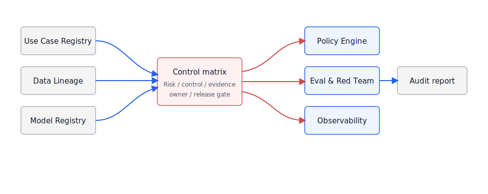
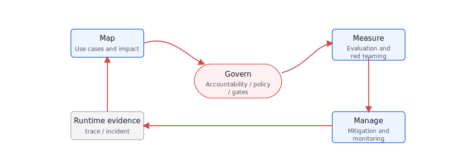
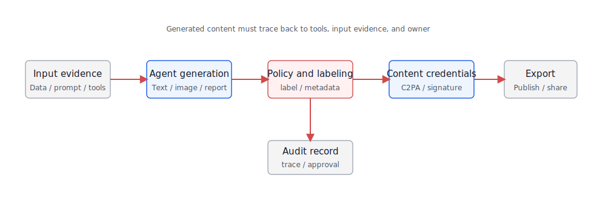
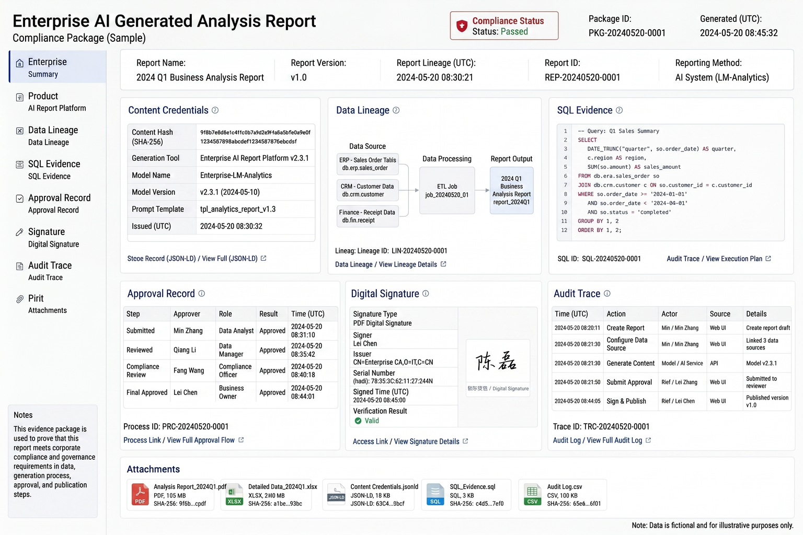

# Chapter 52 Compliance and Regulations

-----

## Chapter Summary

This chapter discusses the engineering implementation of compliance and regulations, explaining how risk classification, control matrices, content traceability, audit reports, and release gatekeeping together form a chain of evidence. Compliance cannot be limited to simply “reading the EU AI Act once and then writing a declaration”—it must be transformed into verifiable engineering controls, so that each release can prove which requirements have been met, and each incident can trace back the accountability chain. This chapter provides a compliance engineering framework aligned with the NIST AI RMF, EU AI Act, and China’s generative AI compliance requirements, illustrating how to map regulatory demands into a platform control matrix.

## Key Terms

Compliance Engineering, NIST AI RMF, EU AI Act, China Generative AI, Control Matrix, Evidence Chain

## Learning Objectives

  - Be able to map regulatory requirements (NIST AI RMF, EU AI Act, domestic regulations) to verifiable engineering controls.
  - Be able to design a compliance control matrix that links each requirement to the responsible team, verification method, and evidence location.
  - Be able to establish content traceability mechanisms, ensuring each Agent output can be traced back to inputs and the decision chain.
  - Be able to generate auditable reports to demonstrate that the platform meets compliance requirements at release.

-----

## Opening Scenario

Compliance is not just filling out a form before going live. An enterprise Agent platform processes data, generates content, invokes tools, influences business decisions, and may operate across regions, tenants, and vendors. When regulations and standards truly enter engineering practice, the questions become: What risk level does this Agent belong to? What data and models does it use? Who is affected by its output? Who can perform reviews? After an incident, can evidence be restored?

NIST AI RMF organizes AI risk management around four functions: Govern, Map, Measure, and Manage. NIST AI 600-1 further supplements risk profiles for generative AI. The EU AI Act employs a risk-tiered approach, imposing different obligations on high-risk AI systems and general AI models. China’s regulations on generative AI service management, deep synthesis management, and generated content labeling emphasize content safety, data provenance, labeling, and service responsibility. C2PA and Content Credentials further transform content origin, editing history, and signature proofs into verifiable metadata.

This chapter translates these requirements into platform engineering tasks: risk classification, control matrices, evidence chains, content traceability, audit reports, and release gatekeeping. This is not legal advice but rather a shared language to help engineering teams communicate effectively with compliance teams.

-----

## 52.1 Compliance Engineering Framework

The first step in enterprise Agent compliance is not memorizing regulations, but establishing a control matrix. The rows represent risks and obligations; the columns represent platform control points and evidence. Only with this matrix can legal, compliance, security, platform, and business teams discuss around the same object.

The key to this matrix is breaking down “requirements” into fields that can be recorded, tested, and audited by the system. Table 52-1 presents a minimal framework. Later, NIST, EU, Chinese regulations, and C2PA requirements can all be mapped onto these objects.

*Table 52-1: Agent Compliance Engineering Framework. Source: Compiled by the author.*

| Compliance Object        | Engineering Issue                                                                                                              | Evidence Form                                  |
| ------------------------ | ------------------------------------------------------------------------------------------------------------------------------ | ---------------------------------------------- |
| Purpose and Risk         | What business is the Agent used for, and does it impact personal rights, finance, employment, safety, or compliance decisions? | use case registry, risk tier, owner            |
| Data Source              | Are training, retrieval, context, and tool data legal, traceable, and deletable?                                               | data lineage, license, retention, ACL          |
| Model and Vendor         | Which models, versions, deployment regions, and providers are used?                                                            | model card, provider contract, region, version |
| Output Control           | Is the content safe, labeled, explainable, and reviewable?                                                                     | guardrail log, citation, watermark/provenance  |
| Human Oversight          | Is there human-in-the-loop for high-risk scenarios? Can outputs be revoked or corrected?                                       | approval record, appeal path, review SLA       |
| Monitoring and Incidents | Are drift, misuse, security events, and user feedback monitored?                                                               | trace, eval report, incident record            |

If the control matrix is just an Excel sheet, it quickly detaches from real systems. The matrix in Figure 52-1 sits centrally on the platform link, connecting use case registry, data lineage, model registry, policy engine, evaluation system, and audit reports. It serves as the middle layer between compliance teams and engineering systems.

*Figure 52-1: The compliance control matrix's position in the platform. Source: Author’s illustration. Alt text: The control matrix is at the middle layer of the Agent platform, connecting regulatory requirements (EU AI Act, NIST, domestic regulations) on the left and platform modules (Guardrails, Trace, Approvals, Release Gate) on the right; each matrix cell represents which regulation corresponds to which platform control.*

Figure 52-1 places the control matrix between the use case registry, data lineage, model registry, policy engine, evaluation system, and audit reports to build it as an engineering contract rather than an offline Excel sheet. The compliance lead’s concern about “auditability” corresponds, on the platform, to whether each control point can locate evidence source, owner, version, and gatekeeping. DataAgent is a fitting example of compliance engineering: a data analysis Agent reads semantic layers, generates SQL, queries lakehouse, and produces charts and reports. Compliance evidence cannot only store the final answer—it must also preserve metric definitions, SQL, execution permissions, data snapshots, model versions, chart parameters, and user confirmation records. Otherwise, when the business questions “where did this number come from,” the platform can only explain the model but not the data or workflow.

Another purpose of the control matrix is to separate “whether a legal provision applies” from “whether the system preserves evidence.” Applicability judgment should come from legal and compliance teams; engineering teams cannot decide arbitrarily. But regardless of which rules apply in the end, the platform should proactively prepare traceable evidence. For example, an Agent may start as an internal pilot and later be offered to external customers, changing obligations. Without early records of data sources, model versions, output labels, and human review, later compliance documentation will be very difficult. The core of compliance engineering is to have evidence accompany the system operation from day one—not backfilled only at audit time.

## 52.2 NIST AI RMF Risk Management

The value of the NIST AI RMF lies in not delegating AI risk solely to security teams, but requiring organizations to establish governance, mapping, measurement, and management closed loops. When applied to enterprise Agent platforms, these four functions need to be transformed into engineering actions like those in Table 52-2. Without this, the framework struggles to integrate into release and operational processes.

*Table 52-2: Mapping NIST AI RMF Functions to Agent Platform Actions. Source: Compiled by this book.*

| AI RMF Function | Platform Action                                                                         | Typical Evidence                                |
| --------------- | --------------------------------------------------------------------------------------- | ----------------------------------------------- |
| Govern          | Define AI asset owners, risk categorization, approval workflows, and exception handling | use case owner, policy version, approval log    |
| Map             | Describe application scenarios, users, data, models, tools, and affected entities       | system card, data flow, threat model            |
| Measure         | Assess quality, security, fairness, robustness, privacy, and explainability             | eval report, red team report, bias check        |
| Manage          | Handle risks, release gating, monitoring, incident response, and continuous improvement | release gate, monitoring alert, incident record |

The key to this mapping is continuity. Many enterprises perform risk assessment only once at project inception, but models, data, prompts, tools, and business processes all evolve. The AI RMF approach aligns more with lifecycle governance: every model upgrade, tool addition, data source change, policy update, or business scope expansion must re-trigger risk assessment or at least an evidence update.

Continuity also means compliance is not a blocking checkpoint before release. Figure 52-2 corresponds to a platform-driven cycle: risk information flows from use case registration to assessment and release, then back from operational monitoring, incidents, and feedback to governance updates.

*Figure 52-2: NIST AI RMF Lifecycle Closed Loop. Source: Self-drawn for this book. Alt text: Circular closed loop containing GOVERN, MAP, MEASURE, and MANAGE core functions, with arrows indicating risk governance spanning the entire AI system lifecycle; labels show typical activities for each function (e.g., risk identification and classification during the MAP phase).*

The feedback loop in this cycle is often overlooked. Post-release incidents, user complaints, quality drift, and integration of new data sources can all change prior risk judgments. If this information does not return to the use case registry and control matrices, compliance assessments remain frozen at the pre-release moment. From a platform perspective, at minimum model versions, data source changes, policy versions, and evaluation reports must trigger reassessment.

The value of AI RMF for engineering teams is not in providing a new approval script, but in linking "who is responsible, how to identify, how to measure, how to handle" into a closed loop. Many Agent risks are not single-point failures but accumulations of small changes: a new regional model vendor, RAG connecting a new knowledge base, expanded tool permissions, but an outdated evaluation set. As long as these changes do not trigger remapping and re-measurement, monitoring seen at the Manage stage will lag. The platform should treat such changes as events rather than relying on project managers manually notifying compliance teams.

## 52.3 EU AI Act Risk Classification

The cornerstone of the EU AI Act is risk tiering. Not all AI systems carry the same obligations. Requirements differ across prohibited-risk, high-risk, limited-risk, and low-risk scenarios; general-purpose AI models carry additional obligations related to transparency, technical documentation, copyright policy, and systemic risk. Enterprise platform teams may not always qualify as a "provider" in the regulatory sense, but any team serving EU users or EU-facing business processes must work with legal counsel to determine their role and responsibilities.

Platform teams cannot substitute for legal judgment, but they can ask the right questions at the project-initiation stage: Does this use case affect significant individual rights? Does it face external users? Is it powered by a general-purpose model? Does it require transparency disclosures or human oversight? Table 52-3 summarizes the risk tiers in engineering terms so that these questions surface early.

*Table 52-3: Engineering implications of EU AI Act risk tiers. Source: compiled by the authors.*

| Risk Tier                | Typical Determination                                                                                             | Platform Action                                                                                          |
| ------------------------ | ----------------------------------------------------------------------------------------------------------------- | -------------------------------------------------------------------------------------------------------- |
| Prohibited risk          | Prohibited uses such as manipulation and social scoring                                                           | Reject at use-case registration or escalate to legal review                                              |
| High risk                | Significant impact on employment, education, credit, law enforcement, critical infrastructure, and similar rights | Risk management, data governance, logging, transparency, human oversight, accuracy and security controls |
| Limited risk             | Users must be informed they are interacting with AI or that content is AI-generated                               | Clear disclosure, content labeling, explainability statements                                            |
| Low risk                 | General-purpose assistance, low-impact internal tools                                                             | Basic security, logging, user feedback, and revocation mechanisms                                        |
| General-purpose AI model | Use of external foundation models or proprietary models                                                           | Vendor documentation, model versioning, deployment region, output labeling, and evaluation evidence      |

The complexity of enterprise agents lies in the fact that a single platform can host use cases spanning multiple risk tiers. An internal policy Q\&A assistant may be low risk; a résumé-screening tool for recruiting may fall into the high-risk tier; financial advice delivered to customers may simultaneously implicate financial regulation and AI regulation. The platform cannot apply a uniform threshold across all applications—risk levels must be bound to individual entries in the use-case registry.

Risk tiers can also shift as capabilities are combined. An assistant that only summarizes publicly available policies moves into a different risk zone the moment it is connected to employee records and performance systems. A DataAgent built purely for business analytics may cross from ordinary analysis tool to a system affecting individual rights if its outputs feed into credit decisions or compensation reviews. Platforms must re-evaluate risk whenever tools are added, data domains are expanded, the user population changes, or the intended use of outputs changes—not only at the time an application is first created.

## 52.4 Compliance Requirements for Generative AI in China

In the Chinese context, generative AI services must simultaneously address content security, data compliance, deep synthesis identification, personal information protection, algorithm filing or security assessment, and other requirements. For internal enterprise platforms, the key is not simply to mechanically apply all consumer-level rules, but to identify the service target, scope of openness, data sources, content generation, and identification responsibilities.

The specific applicability needs to be determined by legal and compliance teams, but engineering teams cannot wait until these judgments are finalized to start gathering evidence. Table 52-4 maps common requirements to platform control items, allowing teams to prepare evidence related to content security, data sources, personal information, identification, and service responsibility in advance.

*Table 52-4: Compliance Requirements for Generative AI in China and Corresponding Platform Controls. Source: Compiled by the author.*

| Focus Area                                          | Engineering Controls                                                                                      | Evidence                                            |
| --------------------------------------------------- | --------------------------------------------------------------------------------------------------------- | --------------------------------------------------- |
| Content Security                                    | Input/output classification, sensitive content blocking, risk warnings, and human review                  | guardrail logs, review records                      |
| Data Sources                                        | Traceability of training, retrieval, upload, and tool data sources                                        | data lineage, licenses, consent, retention policies |
| Personal Information Protection                     | Minimization, desensitization, access control, deletion, and correction procedures                        | PII policies, access logs, deletion records         |
| Deep Synthesis and Generated Content Identification | Explicit or implicit identification of generated images, audio, video, text, etc., according to scenarios | content labels, metadata, watermark/provenance      |
| Service Responsibility                              | User agreements, complaint handling, risk management, log retention                                       | terms of service, appeal logs, incident records     |
| Security Assessment and Filing                      | Preparation of materials according to service type and openness scope                                     | system descriptions, model/data/evaluation reports  |

Data reports generated by DataAgent also require a compliance perspective. If the reports include customer, employee, financial, or non-public operational data, governance standards cannot be lowered just because these are "model-generated summaries." On the contrary, summaries may be more easily forwarded and misinterpreted, thus requiring stricter access controls, labeling, citation, and export auditing.

## 52.5 Content Provenance and C2PA

Generative AI makes it increasingly difficult to determine the authenticity, origin, and edit history of content. The C2PA approach is to attach verifiable provenance information to digital content, recording creators, tools, edits, and signatures. Content Credentials then productize and display this type of information. For enterprise Agents, content provenance is not only for public media but also applies to internal reports, marketing materials, training resources, and AI-generated images.

Content provenance does not need to start at the highest specification from the outset. Enterprises can begin with explicit labeling and metadata, then introduce signature attestations for public releases, branded content, and audit materials. Table 52-5 breaks down the capability levels, allowing different solutions based on the risk profile of the content.

*Table 52-5: Levels of Content Provenance Capabilities. Source: Compiled by this book.*

| Level                   | Capability                                                                      | Applicable Content                                               |
| ----------------------- | ------------------------------------------------------------------------------- | ---------------------------------------------------------------- |
| Explicit Labeling       | Page, report, or image side-notes indicating AI generation or assistance        | External content, client materials, high-risk internal reports   |
| Metadata Tagging        | Writing generation tool, model, time, and responsible person into file metadata | Images, documents, audio/video, export reports                   |
| Signature Attestation   | Using mechanisms such as C2PA to bind content credentials and signatures        | Public releases, branded content, audit materials                |
| Evidence Chain Citation | Retaining prompt, model, input data, citations, and approval records            | DataAgent reports, compliance analysis, business decision-making |

When integrated into a platform workflow, generated content should not flow directly from the Agent to export. The chain path in Figure 52-3 requires content to first pass through policy, tagging, signature, and audit records; even if content is redistributed secondarily, it can still trace back to the original generation record.

*Figure 52-3: Content provenance chain for generated content. Source: Author’s illustration. Alt text: The chain path starts from final Agent output, tracing back stepwise to tool calls, retrieved knowledge fragments, and original inputs, annotating each step with a trace ID and timestamp, demonstrating that each conclusion can be traced to a complete decision chain.*

For DataAgent, content provenance must also answer “Where do the numbers come from?” The provenance of a business analysis report is not just “generated by model X” but must include datasets, SQL queries, metric definitions, time ranges, chart parameters, user edits, and approval records. This kind of evidence chain is much more important than a simple watermark. Figure 52-4 shows how this information aggregates into a single compliance evidence package through a sample report layout.

*Figure 52-4: Sample compliance evidence package for an AI-generated report. Source: Author’s illustration. Alt text: The evidence package sample shows the cover page, control matrix summary, key control point test results, anomaly logs, and more, illustrating the structure of a compliance report suitable for submission to regulators or auditors.*

This sample is split into two layers: the upper layer is a report summary for business and compliance owners, explaining findings, data scope, approval status, and risk warnings; the lower layer is an evidence package for audit and engineering teams, containing SQL, datasets, model versions, prompts, chart configurations, and signature records. If an enterprise only adds visible watermarks without preserving these underlying evidences, it still cannot explain how the report was generated if a dispute occurs.

## 52.6 Engineering Experiment: Compliance Control Matrix Generator

Project 19 can develop a compliance control matrix generator. The inputs are agent use case descriptions, risk levels, data sources, models, tools, and target regions. The output is a Markdown/JSON control matrix listing the required controls, evidence fields, and release gates.

The recommended directory structure is as follows:

    mini-platform/projects/19-compliance-control-matrix/
    ├── README.md
    ├── configs/
    │   ├── frameworks.yaml
    │   ├── controls.yaml
    │   └── regions.yaml
    ├── samples/
    │   ├── dataagent_use_case.yaml
    │   └── customer_support_agent.yaml
    ├── scripts/
    │   ├── generate_matrix.py
    │   └── validate_evidence.py
    └── reports/
        └── dataagent_compliance_matrix.md

Use case input can be described like this:

    use_case:
      id: dataagent_revenue_analysis
      owner: analytics_platform
      users: [regional_manager, finance_analyst]
      regions: [CN, EU]
      risk_tier: medium
      data_sources:
        - dataset: sales_order
          pii: false
          financial: true
        - dataset: customer_profile
          pii: true
          fields: [customer_id, region, segment]
      models:
        - provider: local
          model: enterprise-llm
      outputs:
        - chart
        - markdown_report
        - csv_export

The commands to run are as follows:

    cd mini-platform/projects/19-compliance-control-matrix
    python scripts/generate_matrix.py --use-case samples/dataagent_use_case.yaml --out reports/dataagent_compliance_matrix.md
    python scripts/validate_evidence.py --matrix reports/dataagent_compliance_matrix.md --trace trace_001.json

The report does not need to copy all regulatory articles verbatim. It first needs to enable the platform owner and compliance officer to view applicable frameworks, mandatory controls, evidence mappings, release gates, and gaps. The fields in Table 52-6 are organized around these core issues and represent the minimal report structure.

*Table 52-6: Compliance Control Matrix Report Fields. Source: Compiled by this book.*

| Field                 | Description                                                                  |
| --------------------- | ---------------------------------------------------------------------------- |
| Use case summary      | Use case, owner, users, regions, risk tier                                   |
| Applicable frameworks | Applicability of NIST, EU, China regulations, internal policies              |
| Required controls     | Controls on data, models, outputs, human oversight, audits                   |
| Evidence mapping      | Required traceability, assessments, approvals, and metadata for each control |
| Release gate          | Gates that must be met before release                                        |
| Gaps                  | Current missing evidence and responsible persons                             |
| \#\# Chapter Recap    |                                                                              |

After achieving compliance within the enterprise Agent platform, the core challenge is not merely "knowing which regulations apply," but translating those requirements into actionable, recordable, and verifiable controls. The NIST AI RMF provides a closed-loop risk management framework; the EU AI Act offers a risk-tiered perspective; China’s generative AI regulations emphasize content safety, data provenance, and responsibility labeling; and C2PA delivers a technical pathway for content provenance.

What the platform team needs to do is distill these demands into a use case registry, control matrices, evidence chains, release gating, and audit reports. In this way, compliance is no longer a last-minute add-on before launch, but an ongoing capability spanning design, development, evaluation, and operation.

  -  Each Agent use case has an owner, risk level, target region, and applicable framework judgment.
  -  Data sources, model versions, tool calls, output content, and human approvals all have evidence chains.
  -  High-risk scenarios include human supervision, appeal/correction channels, and incident response processes.
  -  Generated content carries explicit annotations, metadata labels, or C2PA/content credentials according to the scenario.
  -  The compliance control matrix can automatically or semi-automatically generate evidence from traces and metadata.

## References

  - [NIST AI Risk Management Framework](https://www.nist.gov/itl/ai-risk-management-framework)
  - [NIST AI 600-1: Generative AI Profile](https://www.nist.gov/itl/ai-risk-management-framework/nist-ai-600-1)
  - [Regulation (EU) 2024/1689: Artificial Intelligence Act](https://eur-lex.europa.eu/eli/reg/2024/1689/oj)
  - [Interim Measures for the Administration of Generative Artificial Intelligence Services](https://www.cac.gov.cn/2023-07/13/c_1690898327029107.htm)
  - [Regulations on the Administration of Deep Synthesis of Internet Information Services](https://www.cac.gov.cn/2022-12/11/c_1672221949354811.htm)
  - [C2PA Specifications](https://c2pa.org/specifications/specifications/)
