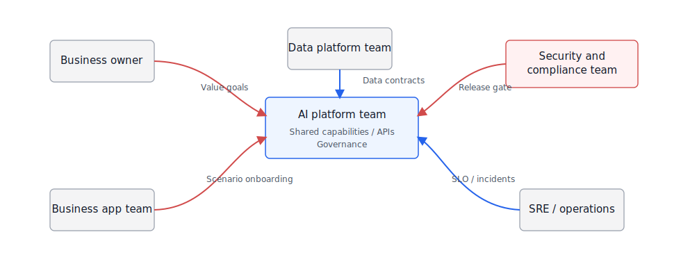
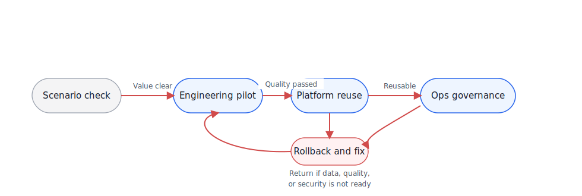
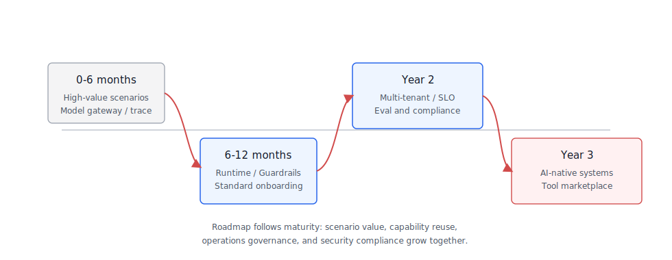
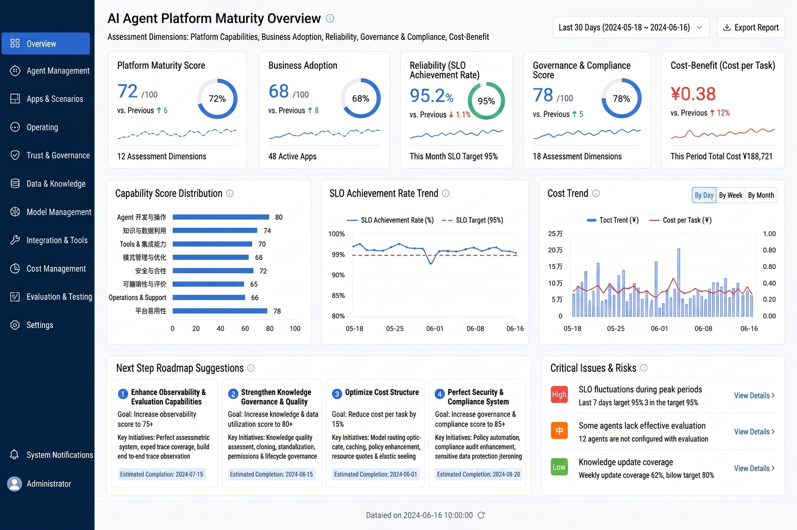

# Chapter 53 Organization, Talent, and Platform Evolution Roadmap

-----

## Chapter Summary

This chapter discusses the organizational, talent, and platform evolution roadmap, explaining responsibility divisions, team capabilities, migration from PoC to platformization, and the three-year development rhythm. Even with solid technology, platform development often stalls in the second stage because platform teams get pulled away by application teams for customizations, lacking dedicated resources to maintain shared capabilities. This chapter defines the responsibility boundaries of AI platform teams, the migration path from PoC to platform, ROI and SLO value measurement, and a reference rhythm for a three-year evolution roadmap.

## Key Terms

AI platform team, responsibility boundaries, PoC to platformization, ROI measurement, talent capability model, three-year roadmap

## Learning Objectives

  - Explain the core responsibilities of AI platform teams and their division of work with business application teams.
  - Describe the migration path from PoC pilot to platformized operation and common failure points.
  - Use ROI and SLO metrics to provide value measurement for platform building to support continuous investment decisions.
  - Develop a three-year platform evolution roadmap that differentiates key focuses at each stage.

-----

## Opening Scenario

When enterprises build Agent platforms, they easily get stuck at two extremes. One extreme is each business team creating a demo independently, causing short-term excitement but leaving behind a few sets of prompts, scripts, and accounts nobody maintains after six months. The other extreme is the platform team, from the start, pursuing a large all-encompassing system producing an "AI middle platform" that no one wants to adopt.

A more stable rhythm usually starts from a small number of high-value scenarios: first proving the problem is worth solving, then extracting the repeatedly used runtime, tools, evaluation, security, and observability capabilities into a platform. Finally, operational metrics and governance mechanisms decide whether to continue investing, consolidate, or retire.

This chapter puts the technical issues back into an organizational context: who is responsible for models, tools, data, evaluation, security, and deployment; how to avoid PoC success turning into a one-off project; how to measure ROI and SLO; what roles the team needs; and how a three-year roadmap can evolve from one-off applications to enterprise AI-native business systems.

-----

## 53.1 AI Platform Team Responsibility Boundaries

The AI platform team is neither “the team that builds Agents for all business lines” nor “the team that just procures model APIs.” Its responsibilities are to provide shared capabilities, interface contracts, operational governance, and engineering baselines so business teams can build Agent applications faster and more securely. Business teams remain responsible for business processes, data interpretation, acceptance criteria, and operational results.

The later these responsibility boundaries are clarified, the more projects risk becoming "the platform team taking all the blame" or "business teams reinventing their own wheels." Table 53-1 intentionally separates platform, business, data, security, and operations roles because these roles often blur together in real projects.

*Table 53-1: Responsibility Boundaries of Enterprise Agent Platform Teams. Source: Compiled by this book.*

| Role                         | Main Responsibilities                                                                              | Should Not Take Responsibility For                                         |
| ---------------------------- | -------------------------------------------------------------------------------------------------- | -------------------------------------------------------------------------- |
| AI Platform Team             | Runtime, Tool Registry, RAG, Evaluation, Observability, Guardrails, Gateway and platform standards | Defining processes and business KPIs for all business teams                |
| Business Application Team    | Business scenarios, user flows, tool integration, acceptance examples, deployment and operations   | Building non-reusable model gateways and security policies                 |
| Data Platform Team           | Data sources, semantic layers, metric definitions, lineage, permissions, data quality              | Allowing models to bypass data contracts to access raw tables              |
| Security and Compliance Team | Risk classification, red team, content security, audit, compliance evidence, release gates         | Only performing manual approval after deployment, no involvement in design |
| SRE / Operations Team        | SLO, capacity, cost, release, rollback, incident response                                          | Only monitoring infrastructure, not Agent task quality                     |
| Business Owner               | Value goals, resource allocation, process transformation, ultimate accountability                  | Shifting all responsibility of "model answer quality" to platform team     |

Table 53-1 addresses responsibility attribution, not reporting lines. Once the Agent platform connects models, data, and tools, no single team can fully own all risks independently. The platform team provides reusable capabilities; business teams provide business judgment; security and compliance define risk boundaries; SRE ensures operational quality. Without clear boundaries, platform teams easily become outsourced project teams; drawing boundaries too rigidly leads to platforms no one uses.

This shared responsibility requires a collaboration model. In Figure 53-1, blue represents internal platform and business components; gray represents external/horizontal systems; red arrows show decision and control flows. It reminds platform leaders that an Agent platform is not built behind closed doors by a single team.

*Figure 53-1: AI Platform Team Responsibility Boundaries. Source: Drawn by this book. Alt text: Concentric circles, inner circle is AI platform team (shared capabilities: Runtime, Registry, Guardrails, governance), outer circle is business application teams (using platform capabilities to build vertical scenarios), boundary lines mark what is open to business teams and what is maintained centrally by platform.*

Figure 53-1 organizes by responsibility flows. Business owners determine value and process boundaries, data platform ensures data contracts, AI platform provides reusable runtime capabilities, security defines gates, SRE ensures operational quality. Gaps in the red decision flow often become concrete incidents after deployment: wrong answers lack explanation, unauthorized access goes unaddressed, soaring costs and degraded availability have no owner.

## 53.2 Migration Path from PoC to Platformized Operation

PoC’s goal is to validate value; platformization aims for stable reuse. Many Agent projects perform well in demos but fail in production due to engineering gaps: no evaluation sets, no security baselines, no deployment SLOs, no cost models, and no version governance for data and tools.

After PoC success, management actions should not just add more demos but move to stage reviews. Table 53-2’s four-stage path corresponds to different outputs, management methods, and exit criteria; each scenario should clearly decide whether to continue piloting, abstract platform capabilities, enter governance operation, or exit due to insufficient value.

*Table 53-2: Stages from PoC to Platformized Operation. Source: Compiled by this book.*

| Stage                | Goal                                           | Key Deliverables                                                                  | Exit Criteria                                               |
| -------------------- | ---------------------------------------------- | --------------------------------------------------------------------------------- | ----------------------------------------------------------- |
| Scenario Validation  | Identify real pain points and measurable value | Business problems, example sets, manual baselines, initial risk assessment        | Business owner willing to invest data and processes         |
| Engineering Pilot    | Validate end-to-end chains                     | Minimal Agent, tool integration, evaluation sets, traces, permission policies     | Reach quality and security thresholds with controlled users |
| Platform Reuse       | Extract shared capabilities                    | General runtime, tool registry, RAG, guardrails, evaluation and observability     | Second and third scenarios reuse platform capabilities      |
| Operation Governance | Continuous improvement and scaling             | SLOs, cost dashboards, red team regression, version governance, incident response | Platform becomes part of business systems                   |

DataAgent projects often go through these four stages. The first may be a simple ChatBI demo; second requires semantic layer, permissions, and SQL evaluation integration; third platformizes NL2SQL, metric retrieval, charts, and report capabilities; fourth depends on real business adoption, query success rates, error fix cycles, and costs.

This path is not strictly linear. Figure 53-2 includes fallback mechanisms: if pilot reveals data quality issues, revert to scenario and data preparation; if platform reuse causes security incidents, return to baselines and release gates.

*Figure 53-2: Migration Path from PoC to Platformized Operation. Source: Drawn by this book. Alt text: Horizontal path with four stages—single scenario PoC, multi-scenario pilot, platform sedimentation, scaled operation, marking key milestones and common stall points per stage, arrows showing progression rhythm and decision gates.*

The fallback path sets realistic expectations for management: PoC demo success does not mean automatic production rollout. If any condition among data quality, permissions, evaluation, cost, or security is unmet, teams should rollback to the prior stage to gather more evidence. Otherwise, platformization copies temporary pilot schemes to more business lines, eventually increasing governance costs.

## 53.3 ROI, SLO, and Value Measurement

Agent platform ROI cannot only look at token cost nor just labor savings. Much value comes from response speed, quality stability, knowledge reuse, risk reduction, and process reengineering. Platform leaders must monitor value, quality, cost, and risk simultaneously.

Thus, Agent platform metrics must cover business, quality, operational, and cost risks. Table 53-3’s four groups of indicators prevent teams from focusing solely on model accuracy or just cost savings as proof of platform value.

*Table 53-3: Agent Platform Value Measurement System. Source: Compiled by this book.*

| Dimension             | Metric                                                                                               | Explanation                                           |
| --------------------- | ---------------------------------------------------------------------------------------------------- | ----------------------------------------------------- |
| Business Value        | Usage rate, task completion rate, time saved, revenue/conversion impact, process cycle reduction     | Determine if truly integrated into business processes |
| Quality Effectiveness | answer pass rate, tool success rate, citation correctness, SQL execution pass rate                   | Judge Agent reliability                               |
| Operational Quality   | p95 latency, availability, error rate, degradation rate, recovery time                               | Align SRE and business user experience                |
| Cost Risk             | token cost, GPU/vector store cost, manual review cost, security incidents, false positives/negatives | Assess scalability sustainability                     |

SLOs should be tied to scenario risk. Internal knowledge Q\&A can tolerate higher latency and more refusals; customer service assistance needs to focus on response speed and human fallback; DataAgent cares about SQL executability, citation accuracy, and data permissions; high-risk legal or financial cases should rather refuse answers than execute incorrectly.

One-size-fits-all SLOs do not apply. Table 53-4 continues the evaluation and security gate discussion, expressing SLO tradeoffs: high-risk scenarios prioritize quality and manual review; low-risk, high-frequency scenarios favor latency or cost priority.

*Table 53-4: Agent Platform SLO Tradeoff Table. Source: Compiled by this book.*

| Approach               | Advantages                                              | Cost                                              | Suitable Scenarios                                                 | mini-platform Choice                            |
| ---------------------- | ------------------------------------------------------- | ------------------------------------------------- | ------------------------------------------------------------------ | ----------------------------------------------- |
| Quality Priority       | Reduces errors and risks, fits high-impact decisions    | Higher latency and cost, more refusals            | Legal, finance, DataAgent high-risk analysis                       | Default for high-risk scenarios                 |
| Latency Priority       | Better user experience, fits high-frequency interaction | May reduce retrieval, reranking, and verification | Customer service assistance, front desk Copilot                    | Optional for low-risk, high-frequency scenarios |
| Cost Priority          | Favors scale and budget control                         | May sacrifice quality and explainability          | Internal low-risk knowledge Q\&A                                   | As fallback strategy                            |
| Manual Review Priority | Clear responsibility, lowest risk                       | Low automation rate, heavier processes            | Writing, exporting, external notifications, compliance conclusions | Mandatory for high-risk actions                 |

## 53.4 Talent Structure and Capability Model

Enterprise Agent platforms require cross-functional teams. Relying only on algorithm engineers or application developers is insufficient. The team must understand models, data, backend, frontend, SRE, security, compliance, and business processes.

Team building should be judged by capability gaps, not headcount alone. Table 53-5 does not require everyone to know everything but helps leaders see which capabilities are covered and which remain “everyone knows a little but no one owns it.”

*Table 53-5: Agent Platform Talent Capability Model. Source: Compiled by this book.*

| Capability Domain       | Key Skills                                                                              | Typical Roles                             |
| ----------------------- | --------------------------------------------------------------------------------------- | ----------------------------------------- |
| Model and Prompting     | Model selection, prompt crafting, structured output, evaluation, fine-tuning boundaries | AI engineer, model platform engineer      |
| Agent Engineering       | Runtime, tool invocation, state machines, async tasks, error recovery                   | Backend engineer, Agent platform engineer |
| Data Intelligence       | Semantic layers, NL2SQL, RAG, metric definitions, data permissions                      | Data engineer, data intelligence engineer |
| Product and Interaction | Task workbench, generative UI, feedback, manual review                                  | Product manager, frontend engineer        |
| Security and Compliance | Guardrails, red team, DLP, audit, regulatory control matrices                           | Security engineer, compliance lead        |
| Operations and Cost     | SLO, capacity, cost, canary releases, rollback, incident response                       | SRE, platform ops, FinOps                 |
| Business Operations     | Scenario selection, process reengineering, training, adoption and ROI review            | Business owner, operations lead           |

Organizations can start with small teams but should not omit roles. Early on, one person may wear multiple hats; later, capabilities become specialized. Platform leaders must watch whether the feedback loop closes: business raises problems, data supplies evidence, platform delivers capabilities, security defines boundaries, SRE ensures operation, and operations bring usage, failure examples, and cost back into the roadmap cycle.

## 53.5 Three-Year Platform Evolution Roadmap

The three-year roadmap should not be a slogan like “Year 1 build models, Year 2 build platform, Year 3 build ecosystem.” A more practical approach progresses by platform capability maturity: from scenario validation, to shared capabilities, to governance and operations, finally to AI-native business systems.

Different companies vary in rhythm, but capability order is similar: prove value first, then abstract platform capabilities, augment operational governance, ultimately reengineer business systems. Table 53-6 is a reference version rather than a fixed template.

*Table 53-6: Three-Year Agent Platform Evolution Roadmap. Source: Compiled by this book.*

| Stage       | Capability Focus                                                                                            | Organizational Focus                                     | Milestones                                                                        |
| ----------- | ----------------------------------------------------------------------------------------------------------- | -------------------------------------------------------- | --------------------------------------------------------------------------------- |
| 0-6 months  | Select 2-3 high-value scenarios, build model gateway, basic RAG, tool registry, tracing and evaluation sets | Form platform squad and business owner mechanism         | First production pilot with quality, security and cost reports                    |
| 6-12 months | Runtime, Guardrails, semantic layer, DataAgent, frontend workbench, red team regression                     | Establish release gates and cross-team reviews           | Multiple scenarios reuse platform components; standard onboarding process created |
| Year 2      | Multi-tenancy, SLO, cost governance, model routing, evaluation platform, compliance matrices                | Platform operation, business teams self-serve onboarding | Agent becomes stable entry for several business processes                         |
| Year 3      | AI-native business systems, cross-Agent collaboration, process reengineering, ecosystem tool marketplace    | Establish platform product lines and ongoing governance  | From isolated Agents to enterprise-grade AI application foundation                |

The roadmap must return to the capability map. Figure 53-3 overlays capability reuse, operational governance, business value, and security compliance in one chart to prevent the roadmap from becoming a feature checklist. Persistent lack of reuse will push platform back to project mode; prolonged absence of governance amplifies risk; ongoing poor business value will starve investment rationales.

*Figure 53-3: Three-Year Platform Evolution Roadmap. Source: Drawn by this book. Alt text: Timeline divided into Year 1 (foundation: Runtime/Registry/Guardrails), Year 2 (extended: evaluation/cost/multi Agent), Year 3 (mature operation: self-service/scaling/ecosystem), each phase marked with key builds.*

Figure 53-3 should not be read as a fixed delivery timeline but as a capability constraint diagram. Without trace, evaluation, and security baseline in Year 1, building multi-tenancy and self-serve onboarding in Year 2 will enlarge risks; without SLO and cost governance in Year 2, Year 3’s business system rebuild will lack operational grounds. The roadmap must maintain exit mechanisms: not every Agent deserves platformization; not all business processes suit automation. Platform teams should regularly retire low-value, high-risk, low-usage Agents, concentrating resources on scenarios that yield reusable capabilities and business value.

## 53.6 Engineering Experiment: Platform Maturity Assessment

Project 20 can create a platform maturity assessment tool converting the book’s earlier capabilities into scorable items. Inputs include current platform capabilities, deployed scenarios, SLOs, evaluations, security, and compliance evidence; outputs include a maturity report and next-quarter roadmap suggestions.

A suggested directory structure:

    mini-platform/projects/20-platform-maturity-assessment/
    ├── README.md
    ├── configs/
    │   ├── maturity_model.yaml
    │   └── weights.yaml
    ├── samples/
    │   └── platform_snapshot.yaml
    ├── scripts/
    │   ├── score_maturity.py
    │   └── generate_roadmap.py
    └── reports/
        └── maturity_assessment.md

A platform snapshot example:

    platform:
      scenarios:
        production: 3
        pilot: 5
      capabilities:
        model_gateway: true
        tool_registry: true
        rag_pipeline: true
        eval_platform: partial
        guardrails: partial
        compliance_matrix: false
        slo_dashboard: partial
      metrics:
        monthly_active_users: 820
        task_success_rate: 0.72
        p95_latency_seconds: 9.8
        monthly_model_cost_usd: 4200

Run commands:

    cd mini-platform/projects/20-platform-maturity-assessment
    python scripts/score_maturity.py --snapshot samples/platform_snapshot.yaml --out reports/maturity_assessment.md
    python scripts/generate_roadmap.py --assessment reports/maturity_assessment.md --quarters 4

The maturity report should avoid giving just a single overall score. Platform leaders need to know capability gaps, business adoption realism, operational stability, governance progress, and cost sustainability. Figure 53-4 organizes this info into a platform operations dashboard ideal for quarterly reviews and roadmap assessments; Table 53-7 fixes the report fields behind the dashboard.

*Figure 53-4: Agent Platform Maturity Dashboard. Source: Product interface screenshot. Alt text: Dashboard displaying scenario coverage, platform shared capability adoption rates, SLO achievement, security incident counts, etc. as radar charts and gauges to quantify platform maturity.*

Figure 53-4 suits quarterly business reviews rather than project reports. Leaders first check if business adoption is real, then if quality, reliability, governance, and cost support scaling. If active users grow fast but red team regression and compliance evidence remain partial, next quarter should prioritize fixing governance and operational capabilities rather than adding new scenarios.

*Table 53-7: Platform Maturity Assessment Report Fields. Source: Compiled by this book.*

| Field             | Explanation                                                                               |
| ----------------- | ----------------------------------------------------------------------------------------- |
| Capability score  | Scores on model, data, Agent, frontend, security, evaluation, and operations capabilities |
| Business adoption | Deployed scenarios, active users, task completion rate, business owner coverage           |
| Reliability score | SLOs, incidents, recovery times, degradation handling                                     |
| Governance score  | Guardrails, red team, compliance matrices, audit evidence                                 |
| Cost score        | Token, GPU, vector store, manual review, and per-task costs                               |
| Next roadmap      | Capabilities and owners prioritized for next quarter                                      |

## Chapter Recap

Agent platforms will ultimately become organizational capabilities, not one-off projects. Technically, they must build runtime, tools, data, evaluation, guardrails, and observability; organizationally, establish collaboration among platform teams, business owners, security and compliance, SRE, and operations; managerially, use ROI, SLO, and maturity assessments to decide continuation, convergence, or retirement.

The three-year roadmap is more than a feature list. The critical factor is maturity stages: from PoC value proof, to platform capability reuse, to operational governance, to AI-native business systems. Enterprises reaching the end are usually not the earliest demo-makers but those who earliest embedded Agents into engineering, governance, and organizational processes.

  -  Every Agent scenario has a business owner, platform owner, security and compliance contact, and SLO.
  -  Before PoC moves to production, evaluation sets, tracing, security baselines, cost models, and exit criteria exist.
  -  Platform capabilities are reusable by second and third business scenarios, not one-off project code.
  -  ROI covers business value, quality, operational quality, cost, and risk simultaneously.
  -  Roadmaps are updated quarterly with maturity assessments, retiring low-value, high-risk scenarios.

## References

  - [NIST AI Risk Management Framework](https://www.nist.gov/itl/ai-risk-management-framework)
  - [Google Secure AI Framework](https://saif.google/)
  - [Microsoft Responsible AI Standard](https://www.microsoft.com/en-us/ai/principles-and-approach)
  - [ISO/IEC 42001 AI management system](https://www.iso.org/standard/81230.html)
  - [OpenTelemetry Semantic Conventions for GenAI](https://opentelemetry.io/docs/specs/semconv/gen-ai/)
